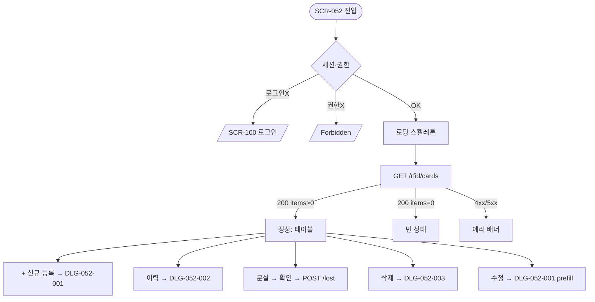

# SCR-052 밴드/카드 관리 (RFID) — 기본화면 (마스터)

> 이 문서는 **화면 마스터 스펙**입니다. `01~04` 상태 문서는 이 문서를 상속(override/delta)합니다.
> 🔐 **멀티테넌트**: 모든 RFID 카드는 `branchId` 스코프로 격리됩니다.
> 🎫 **출입 관리 핵심 화면**: 회원·직원 RFID 배정으로 게이트/락커/타석 인증 루트가 된다.

---

## 0. 메타 & 원천 참조

| 항목 | 값 |
|------|----|
| 화면 ID | SCR-052 |
| 화면명 | 밴드/카드 관리 (RFID) |
| 도메인 | D06-시설관리 |
| 경로 | `/rfid` (별칭: `/facilities/rfid`) |
| Next.js Route Group | `(facilities)` |
| 파일 경로 | `src/app/(facilities)/rfid/page.tsx` |
| 페이지 컴포넌트 | `RfidManagement` |
| 역할 | `superAdmin`(=primary) / `owner` / `manager` / `staff` |
| 제외 역할 | `fc` / `trainer` / `front` / `readonly` |
| 우선순위 | P1 |
| 플랫폼 | 데스크톱(우선) / 태블릿 |
| 멀티테넌트 | ✅ `branchId` 필터 강제 |

### 원천 문서 링크
| 문서 | 경로 | 섹션 |
|---|---|---|
| 화면설계서 | `docs/화면설계서/시설관리.md` | §SCR-052 밴드/카드 관리 |
| 기능명세서 | `docs/기능명세서/시설관리.md` | §3 밴드/카드 관리 (`/rfid`), 부록 C |
| 상태전이도 | `docs/상태전이도.md` | §RFID 상태 (활성→분실→해제) |
| 에러코드정의서 | `docs/에러코드정의서.md` | §4.7 시설/락커 E4xx600~699 |
| 권한 매트릭스 | `docs/다이어그램/10_권한매트릭스/R1_역할화면_매트릭스.md` | `/rfid` 접근 |
| 다이어그램 F1 진입 | `docs/다이어그램/D06_시설관리/SCR-052_밴드카드관리/F1_진입.md` | 세션→스코프 로딩 |
| 다이어그램 F2 메인 | `docs/다이어그램/D06_시설관리/SCR-052_밴드카드관리/F2_메인.md` | 카드 조회/필터 |
| 다이어그램 F3 버튼액션 | `docs/다이어그램/D06_시설관리/SCR-052_밴드카드관리/F3_버튼액션.md` | 신규/이력/분실/삭제 |
| 다이어그램 F5 모달트리거 | `docs/다이어그램/D06_시설관리/SCR-052_밴드카드관리/F5_모달트리거.md` | DLG-052-001~003 |
| 다이어그램 F6 상태별 | `docs/다이어그램/D06_시설관리/SCR-052_밴드카드관리/F6_상태별.md` | 로딩/정상/빈/에러 |
| 다이어그램 F7 권한 | `docs/다이어그램/D06_시설관리/SCR-052_밴드카드관리/F7_권한.md` | 역할 분기 |
| 다이어그램 F8 에러 | `docs/다이어그램/D06_시설관리/SCR-052_밴드카드관리/F8_에러.md` | E409601 외 |

---

## 1. 화면 목적 (Why)

RFID 밴드/카드를 **등록·분실처리·해제·삭제**하고, 회원·직원과 매핑하여 **출입 및 시설 이용(락커/타석/샤워실)의 인증 루트**를 관리한다.

- 카드 스캔(USB/시리얼/시뮬) + 수동 입력 모두 지원
- 회원/직원 매핑 + 사물함 번호 연결
- 분실·해제 상태 관리 + 이력 조회
- 카드번호 UNIQUE 제약(E409601) 강제

---

## 2. 화면 레이아웃

### 2.1 풀뷰 와이어프레임 (데스크톱 1440px 기준)

```
┌──────────────────────────────────────────────────────────────────┐
│ AppLayout + Sidebar(시설관리 활성)                                │
│ ┌──Main──────────────────────────────────────────────────────────┐│
│ │ PageHeader: "밴드/카드 관리"                                   ││
│ │   "RFID 밴드 및 카드를 등록하고 회원/직원과 연결합니다."         ││
│ │                                     [📥 엑셀][+ 신규 등록]      ││
│ ├────────────────────────────────────────────────────────────────┤│
│ │ StatCardGrid cols=3                                            ││
│ │ [전체 카드 120] [활성 98] [미사용/해제/분실 22]                ││
│ ├────────────────────────────────────────────────────────────────┤│
│ │ FilterBar                                                      ││
│ │ [🔍 카드번호/회원명]    상태:[전체▼]  유형:[전체▼]  [초기화]   ││
│ ├────────────────────────────────────────────────────────────────┤│
│ │ DataTable (10행 페이지)                                        ││
│ │ No│등록일│카드번호│회원명│연락처│유형│상태│배정일│사물함│메뉴  ││
│ │ 1│01-10│RF-10293│홍길동│010-..│회원│활성│02-01│A-102│📜 ❌ ✏ 🗑││
│ │ 2│01-11│RF-10294│김철수│010-..│직원│활성│02-02│ -   │📜 ❌ ✏ 🗑││
│ │ ... (최대 10건/페이지)                                         ││
│ │ [← 이전]  1 2 3 ... 12  [다음 →]                               ││
│ └────────────────────────────────────────────────────────────────┘│
└──────────────────────────────────────────────────────────────────┘
```

### 2.2 영역별 치수

| 영역 | 그리드 | 비고 |
|---|---|---|
| PageHeader | `flex justify-between` | title + 액션 버튼 그룹 |
| StatCardGrid | `grid grid-cols-1 md:grid-cols-3 gap-4` | 3카드 |
| FilterBar | `flex flex-wrap gap-3` | 검색/상태/유형 |
| DataTable | `w-full overflow-x-auto` | 모바일 가로 스크롤 |
| Pagination | `flex justify-center py-4` | 페이지당 10건 |

---

## 3. 디자인 토큰

### 3.1 색상
| 토큰 | 클래스 | 용도 |
|---|---|---|
| bg.page | `bg-gray-50` | 전체 배경 |
| card | `bg-white rounded-xl shadow-sm ring-1 ring-gray-100 p-5` | StatCard |
| stat.default | `bg-white text-gray-900` | 전체 카드 수 |
| stat.mint | `bg-emerald-50 text-emerald-700` | 활성 카드 |
| stat.amber | `bg-amber-50 text-amber-800` | 미사용/해제/분실 |
| badge.active | `bg-emerald-100 text-emerald-800` | 활성 |
| badge.lost | `bg-red-100 text-red-800` | 분실 |
| badge.released | `bg-gray-100 text-gray-700` | 해제 |
| badge.member | `bg-sky-100 text-sky-800` | 회원 유형 |
| badge.staff | `bg-amber-100 text-amber-800` | 직원 유형 |
| cardNo.mono | `font-mono font-semibold text-gray-900` | 카드번호 |
| scan.pulse | `ring-2 ring-blue-400 animate-pulse` | 스캔 대기 |

### 3.2 타이포그래피
| 토큰 | 스타일 | 용도 |
|---|---|---|
| page.title | `text-2xl font-bold tracking-tight text-gray-900` | PageHeader title |
| page.desc | `text-sm text-gray-500` | PageHeader desc |
| stat.value | `text-3xl font-bold tabular-nums` | 카운트 |
| table.th | `text-xs uppercase font-semibold text-gray-600 bg-gray-50` | 헤더 |
| table.td | `text-sm text-gray-900` | 셀 |

### 3.3 간격/반경
| 토큰 | 값 |
|---|---|
| page.padding | `p-6 lg:p-8` |
| section.gap | `space-y-6` |
| card.radius | `rounded-xl` |
| row.height | `h-12` |

### 3.4 모션
- 스캔 대기: `animate-pulse` (Wifi 아이콘)
- 새 카드 등록 성공: `animate-[fadeInUp_150ms]` (새 행 하이라이트 500ms)
- 스켈레톤: `animate-pulse`

---

## 4. 반응형 규칙

| BP | §StatCard | §Filter | §Table | Modal |
|---|---|---|---|---|
| Mobile <640 | 1열 | 세로 스택 | 가로 스크롤(필수 컬럼만) | 풀스크린 시트 |
| Tablet 640~1024 | 3열 | 2줄 | 전체 컬럼 | 센터 모달 |
| Desktop ≥1024 | 3열 | 1줄 | 전체 컬럼 | 센터 모달 max-w-lg |

---

## 5. 🔐 역할별(RBAC) 매트릭스

> `●` = 표시+CRUD 가능, `○` = 표시만(읽기), `—` = 미표시/접근 불가
> 멀티테넌트: `primary/super`는 전 지점, 그 외는 본인 지점 고정(`branchId` 강제)

| 요소 | primary/super | owner | manager | fc | trainer | staff | front | readonly |
|---|:---:|:---:|:---:|:---:|:---:|:---:|:---:|:---:|
| **페이지 접근** | ● | ● | ● | — | — | ● | — | — |
| 지점 전환 드롭다운 | ●(전 지점) | ○(소속 브랜드) | — | — | — | — | — | — |
| **§StatCard** | | | | | | | | |
| 전체 카드 수 | ● | ● | ● | — | — | ○ | — | — |
| 활성 카드 수 | ● | ● | ● | — | — | ○ | — | — |
| 미사용/해제/분실 | ● | ● | ● | — | — | ○ | — | — |
| **§FilterBar** | | | | | | | | |
| 카드번호/회원명 검색 | ● | ● | ● | — | — | ● | — | — |
| 상태 필터 | ● | ● | ● | — | — | ● | — | — |
| 유형 필터 | ● | ● | ● | — | — | ● | — | — |
| **§DataTable** | | | | | | | | |
| 행 조회 | ● | ● | ● | — | — | ● | — | — |
| 회원명 → 회원상세 이동 | ● | ● | ● | — | — | ○ | — | — |
| 이력 조회(📜) | ● | ● | ● | — | — | ● | — | — |
| 분실 처리(❌) | ● | ● | ● | — | — | ● | — | — |
| 수정(✏) | ● | ● | ● | — | — | ● | — | — |
| 삭제(🗑) | ● | ● | ●(자기 지점) | — | — | — | — | — |
| **§Actions** | | | | | | | | |
| 신규 등록 버튼 | ● | ● | ● | — | — | ● | — | — |
| 엑셀 다운로드 | ● | ● | ● | — | — | — | — | — |

### 5.1 역할별 요약

- **primary/super**: 전 지점 카드 조회·CRUD, 지점 전환 드롭다운 노출.
- **owner**: 본인 지점 고정, 전체 CRUD + 엑셀.
- **manager**: 본인 지점 고정, 전체 CRUD(삭제 포함) + 엑셀.
- **staff**: 본인 지점 고정, 조회·신규등록·분실처리·수정 가능(삭제 불가, 엑셀 불가).
- **fc / trainer / front / readonly**: 미접근(사이드바 메뉴에서 숨김).

### 5.2 역할 판별 코드
```ts
type Role = 'superAdmin'|'primary'|'owner'|'manager'|'fc'|'trainer'|'staff'|'front'|'readonly';
const canAccessRfid = (r:Role) => ['superAdmin','primary','owner','manager','staff'].includes(r);
const canDeleteRfid = (r:Role) => ['superAdmin','primary','owner','manager'].includes(r);
const canExportRfid = (r:Role) => ['superAdmin','primary','owner','manager'].includes(r);
const canSwitchBranch = (r:Role) => ['superAdmin','primary'].includes(r);
```

---

## 6. 컴포넌트 트리

```
<AppLayout role={user.role}>
  <Sidebar active="facilities/rfid" />
  <MainContent>
    <PageHeader title="밴드/카드 관리"
                description="RFID 밴드 및 카드를 등록하고 회원/직원과 연결합니다.">
      {canSwitchBranch(role) && <BranchSwitcher value={branchId} onChange={setBranchId} />}
      {canExportRfid(role) && <Button variant="ghost" onClick={exportExcel}>📥 엑셀</Button>}
      <Button variant="primary" onClick={openAddModal}>+ 신규 등록</Button>
    </PageHeader>

    <StatCardGrid cols={3}>
      <StatCard label="전체 카드" value={total} icon={<CreditCard/>} variant="default" />
      <StatCard label="활성"    value={active} icon={<CheckCircle/>} variant="mint" />
      <StatCard label="미사용/해제/분실" value={inactive} icon={<AlertTriangle/>} variant="amber" />
    </StatCardGrid>

    <FilterBar>
      <SearchInput placeholder="카드번호 또는 회원명" value={q} onChange={setQ} />
      <Select options={STATUS_OPTIONS} value={status} onChange={setStatus} />
      <Select options={TYPE_OPTIONS}   value={type}   onChange={setType} />
      <Button variant="ghost" onClick={resetFilters}>초기화</Button>
    </FilterBar>

    <DataTable
      columns={COLUMNS}
      data={rows}
      loading={isLoading}
      emptyMessage="등록된 RFID 카드가 없습니다."
      pagination={{ page, pageSize: 10, total, onChange: setPage }}
    />

    {addModalOpen && <RfidFormModal onClose={close} onSaved={refresh} />}
    {historyModalOpen && <RfidHistoryModal cardId={selectedId} onClose={close} />}
    {deleteConfirmOpen && <ConfirmModal variant="danger" confirmText="삭제" onConfirm={doDelete} />}
  </MainContent>
</AppLayout>
```

### 6.1 핵심 컴포넌트
| 컴포넌트 | 파일 | 핵심 Props |
|---|---|---|
| `PageHeader` | `src/components/layout/PageHeader.tsx` | `{title, description, children}` |
| `StatCardGrid` | `src/components/common/StatCardGrid.tsx` | `{cols, children}` |
| `StatCard` | `src/components/common/StatCard.tsx` | `{label, value, icon, variant}` |
| `FilterBar` | `src/components/common/FilterBar.tsx` | `{children}` |
| `DataTable` | `src/components/common/DataTable.tsx` | `{columns, data, loading, emptyMessage, pagination}` |
| `RfidFormModal` | `src/components/facilities/RfidFormModal.tsx` | `{card?, onClose, onSaved}` |
| `RfidHistoryModal` | `src/components/facilities/RfidHistoryModal.tsx` | `{cardId, onClose}` |
| `ConfirmModal` | `src/components/common/ConfirmModal.tsx` | `{variant, title, description, confirmText, onConfirm}` |

---

## 7. 데이터 계약

### 7.1 타입
```ts
type RfidStatus = 'ACTIVE' | 'LOST' | 'RELEASED';
type RfidUserType = 'MEMBER' | 'STAFF';

interface RfidCard {
  id: number;
  branchId: number;
  cardNo: string;            // RF-XXXXXXXX 형식
  userType: RfidUserType;
  memberId?: number;
  memberName?: string;
  memberPhone?: string;
  staffId?: number;
  status: RfidStatus;
  registeredAt: string;      // ISO
  issuedAt?: string;         // 배정일
  lockerNo?: string;         // 연결 사물함
  note?: string;
  createdAt: string;
  updatedAt: string;
}

interface RfidHistory {
  id: number;
  cardId: number;
  branchId: number;
  action: 'REGISTER'|'ISSUE'|'LOST'|'RELEASE'|'ENTER'|'EXIT';
  gateName?: string;
  memberId?: number;
  memberName?: string;
  occurredAt: string;
}
```

### 7.2 API 엔드포인트
| 엔드포인트 | 메서드 | 파라미터 | 반환 |
|---|---|---|---|
| `GET /rfid/cards` | GET | `{branchId, q?, status?, type?, page, pageSize}` | `{items: RfidCard[], total}` |
| `GET /rfid/cards/:id` | GET | — | `RfidCard` |
| `POST /rfid/cards` | POST | `{branchId, cardNo, userType, memberId?, staffId?, lockerNo?}` | `RfidCard` |
| `PATCH /rfid/cards/:id` | PATCH | 부분 필드 | `RfidCard` |
| `POST /rfid/cards/:id/lost` | POST | — | `{ok: true}` → status=LOST |
| `DELETE /rfid/cards/:id` | DELETE | — | `204` |
| `GET /rfid/cards/:id/history` | GET | `{from, to}` | `RfidHistory[]` |
| `GET /rfid/cards/export` | GET | `{branchId, filters}` | XLSX stream |

**서버 권한 강제**: jwt role/branchId 기반 스코프. staff는 DELETE 차단. fc/trainer/front는 전 엔드포인트 403.

### 7.3 상태 관리
- Store: `useAuthStore`(user/role/branchId)
- Fetching: React Query (`useQuery(['rfid', branchId, filters, page])`)
- Mutation: register/update/lost/delete — `invalidateQueries(['rfid'])`
- Cache: `staleTime: 30_000`
- 실시간(선택): Supabase Realtime 구독으로 ENTER/EXIT 이벤트 수신 가능

### 7.4 멀티테넌트 branchId
1. URL `?branch=`
2. `useBranchStore.current`
3. `user.branchId`
- 서버는 jwt의 branchId와 불일치 시 403 → `/forbidden` 리다이렉트

---

## 8. 비즈니스 룰

1. **카드번호 형식**: `RF-` + 8자리 영숫자(대문자). 정규식 `/^RF-[A-Z0-9]{8}$/`.
2. **카드번호 UNIQUE(branchId 단위)**: 중복 등록 시 409 `E409601`.
3. **사용자 매핑 필수**: userType=MEMBER이면 memberId 필수, STAFF이면 staffId 필수.
4. **자동 배정일**: 등록 시 `issuedAt = now()`.
5. **분실 처리**: status=ACTIVE → LOST 일방향 전환. 재활성은 수정 모달로 RELEASED→ACTIVE 가능.
6. **해제 후 재발급**: RELEASED 카드는 삭제하거나 동일 cardNo로 재활성 가능(동일 회원/직원일 때만).
7. **연결 사물함**: lockerNo는 **락커 관리(SCR-050)**의 실제 번호와 문자열 매칭(외래키 아님, 자유 입력).
8. **이력 조회 기간**: 기본 최근 30일, 최대 180일 조회.
9. **삭제 제약**: ACTIVE 카드는 삭제 불가(먼저 분실/해제 처리). 409 `E409600` 유사 처리.
10. **엑셀 다운로드**: 필터 적용 결과 일괄 다운로드. 파일명 `rfid_cards_{branchCode}_{yyyyMMdd}.xlsx`.
11. **검색 대상**: `cardNo`(부분 일치) + `memberName`(부분 일치) + `memberPhone`(뒷 4자리).
12. **페이지당 10건**: 서버 페이지네이션 기본.
13. **스캔 시뮬(로컬)**: `RF-` + `Date.now().toString(36).toUpperCase().slice(-8).padStart(8,'0')`.
14. **실제 USB 스캐너**: 키보드 에뮬레이션 방식 → input focus 유지 후 Enter로 확정.

---

## 9. 상태 목록

| 파일 | 상태 코드 | 트리거 |
|---|---|---|
| `01-로딩.md` | `rfid-loading` | API pending |
| `02-정상-데이터있음.md` | `rfid-ready` | 카드 1개 이상 |
| `03-빈상태.md` | `rfid-empty` | 카드 0개 |
| `04-에러.md` | `rfid-error` | API 실패/권한 실패/네트워크 |

---

## 10. 에러 코드 매핑

| errorCode | 시나리오 | 표시 | 대응 |
|---|---|---|---|
| E401001 | jwt 만료 | 전역 인터셉터 → `/login` | 자동 리다이렉트 |
| E403xxx | 권한 부족(삭제/지점 조작) | toast.error "권한이 없습니다" | 닫기 |
| E404600 | 카드 없음 | toast.error "카드를 찾을 수 없습니다" | 목록 refresh |
| E409601 | RFID 중복 | FormModal 필드 에러 "이미 등록된 RFID입니다" | 스캔 재시도 |
| E422xxx | 유효성 실패 | FormModal 필드 에러 | 필드 수정 |
| E500001 | 서버 에러 | 전체 에러 배너 + 재시도 | `04-에러` |
| NETWORK | 오프라인 | 오프라인 배너 | 캐시 fallback |

---

## 11. 접근성 (WCAG 2.1 AA)

- `<main role="main">` + 섹션별 `aria-label`
- StatCard: `role="group"` + `aria-labelledby`
- DataTable: `<table>` 시맨틱, `<th scope="col">`, 행 선택 시 `aria-selected`
- 액션 아이콘 버튼: `aria-label="이력 조회"` 등 명시
- 스캔 입력: `aria-describedby="scan-help"` + "카드를 리더기에 대거나 직접 입력하세요"
- ConfirmModal: `role="alertdialog"` + focus trap
- 키보드: Tab/Shift+Tab 순환, Esc로 모달 닫기, Enter로 확인
- `prefers-reduced-motion`: 펄스/fade 애니메이션 제거

---

## 12. 진입 / 이탈

### 진입
- 사이드바 "시설관리 > 밴드/카드 관리" 클릭
- 사물함 배정 관리(SCR-051)에서 "밴드/카드" 링크
- 회원 상세에서 "RFID 카드 등록" 링크(pre-fill)

### 이탈
| 액션 | 목적지 |
|---|---|
| 회원명 클릭 | `/members/detail?id={memberId}` |
| 사물함 번호 클릭 | `/locker?number={lockerNo}` |
| 신규 등록 저장 | 목록 refresh + 새 행 하이라이트 |
| 이력 조회 | 모달(이탈 없음) |
| 삭제 | 목록 refresh |
| 사이드바 메뉴 | 역할 허용 경로 |

---

## 13. 다이어그램 통합 뷰



---

## 14. 🧩 바이브코딩 프롬프트 마스터

```
Next.js 15 App Router + TypeScript + Tailwind + Supabase + React Query 기반
'use client' 컴포넌트를 작성하라.

━━ 화면: SCR-052 밴드/카드 관리 (RFID) ━━
파일: src/app/(facilities)/rfid/page.tsx
보조:
- src/components/facilities/RfidFormModal.tsx (DLG-052-001)
- src/components/facilities/RfidHistoryModal.tsx (DLG-052-002)
- src/components/common/ConfirmModal.tsx (DLG-052-003)
- src/hooks/useRfidCards.ts (React Query 훅)
- src/lib/role-access.ts (canAccessRfid/canDeleteRfid/canExportRfid)

━━ 멀티테넌트 ━━
- branchId는 URL ?branch= > useBranchStore > user.branchId 우선순위
- 서버가 jwt role/branchId로 스코프 강제. 클라 role-access는 UX 가시성만.
- primary/super만 BranchSwitcher 노출

━━ 레이아웃 (Tailwind 정확 적용) ━━
<main className="min-h-screen bg-gray-50">
  <AppLayout role={user.role}>
    <div className="p-6 lg:p-8 space-y-6">
      <PageHeader title="밴드/카드 관리"
                  description="RFID 밴드 및 카드를 등록하고 회원/직원과 연결합니다.">
        {canSwitchBranch(role) && <BranchSwitcher .../>}
        {canExportRfid(role) && <Button variant="ghost" onClick={exportExcel}>📥 엑셀</Button>}
        <Button variant="primary" onClick={openAdd}>+ 신규 등록</Button>
      </PageHeader>

      <div className="grid grid-cols-1 md:grid-cols-3 gap-4">
        <StatCard label="전체 카드" value={total} icon={<CreditCard/>} />
        <StatCard label="활성" value={active} icon={<CheckCircle/>} variant="mint" />
        <StatCard label="미사용/해제/분실" value={inactive} icon={<AlertTriangle/>} variant="amber" />
      </div>

      <FilterBar className="flex flex-wrap gap-3">
        <SearchInput value={q} onChange={setQ} placeholder="카드번호 또는 회원명" className="w-72"/>
        <Select value={status} onChange={setStatus} options={STATUS_OPTIONS}/>
        <Select value={type} onChange={setType} options={TYPE_OPTIONS}/>
        <Button variant="ghost" onClick={reset}>초기화</Button>
      </FilterBar>

      <DataTable
        columns={[
          { key:'no',          header:'No',     width:55 },
          { key:'registeredAt',header:'등록일', width:110, render:(v)=>formatKST(v,'MM-DD') },
          { key:'cardNo',      header:'카드번호', render:(v)=><span className="font-mono font-semibold">{v}</span> },
          { key:'memberName',  header:'회원명', render:(v,r)=>v
              ? <button onClick={()=>goToMember(r.memberId)} className="text-sky-600 hover:underline">{v}</button>
              : <span className="text-gray-400">-</span> },
          { key:'memberPhone', header:'연락처', width:120, render:(v)=><span className="font-mono">{v||'-'}</span> },
          { key:'userType',    header:'유형',   width:80,  render:(v)=><Badge variant={v==='MEMBER'?'info':'warning'}>{v==='MEMBER'?'회원':'직원'}</Badge> },
          { key:'status',      header:'상태',   width:90,  render:(v)=><Badge variant={STATUS_VARIANT[v]}>{STATUS_LABEL[v]}</Badge> },
          { key:'issuedAt',    header:'배정일', width:100, render:(v)=>v?formatKST(v,'MM-DD'):'-' },
          { key:'lockerNo',    header:'사물함', width:80,  render:(v)=>v||'-' },
          { key:'actions',     header:'메뉴',   width:130, render:(_,r)=>(
              <div className="flex gap-1">
                <IconButton aria-label="이력"  onClick={()=>openHistory(r.id)}><Scroll className="h-4 w-4"/></IconButton>
                <IconButton aria-label="분실"  onClick={()=>markLost(r.id)} disabled={r.status!=='ACTIVE'}><XCircle className="h-4 w-4"/></IconButton>
                <IconButton aria-label="수정"  onClick={()=>openEdit(r.id)}><Pencil className="h-4 w-4"/></IconButton>
                {canDeleteRfid(role) && <IconButton aria-label="삭제" onClick={()=>openDelete(r.id)} disabled={r.status==='ACTIVE'}><Trash2 className="h-4 w-4"/></IconButton>}
              </div>
            )},
        ]}
        data={rows}
        loading={isLoading}
        emptyMessage="등록된 RFID 카드가 없습니다."
        pagination={{ page, pageSize:10, total, onChange:setPage }}
      />
    </div>
  </AppLayout>
</main>

━━ DLG-052-001 RfidFormModal ━━
- title: 수정 모드 ? "카드 수정" : "신규 카드 등록"
- 필드:
  1) 카드 번호 (필수, 정규식 /^RF-[A-Z0-9]{8}$/)
     - 스캔 대기 영역: 중앙 정렬 + WiFi 아이콘 + ring-2 ring-blue-400 animate-pulse
     - "리더기에 카드를 대거나 직접 입력" placeholder
     - [스캔 시뮬] 버튼(dev-only) → cardNo = "RF-" + random8
  2) 사용자 유형 RadioGroup: 회원 | 직원
  3) 회원/직원 선택 AutoComplete (/members?q= 또는 /staff?q=)
  4) 연결 사물함 번호 (선택, 자유 입력)
  5) 메모 Textarea
- footer: [취소] [저장]
- onSubmit: POST /rfid/cards (또는 PATCH /rfid/cards/:id)
- 에러 409 E409601 → cardNo 필드 에러 표시 "이미 등록된 RFID입니다"
- 성공 → toast.success "카드가 등록되었습니다" + 모달 닫기 + refetch

━━ DLG-052-002 RfidHistoryModal ━━
- title: "{cardNo} 이력"
- 기간 선택: DateRange (기본 최근 30일, 최대 180일)
- [조회] 버튼
- 테이블: 일시 | 액션(REGISTER/ISSUE/LOST/RELEASE/ENTER/EXIT) | 게이트 | 회원명
- 빈 상태: "해당 기간 이력이 없습니다"
- footer: [닫기]

━━ DLG-052-003 ConfirmModal (삭제) ━━
- title: "카드 삭제"
- description: "카드 {cardNo}를 삭제하시겠습니까?\n회원 연결이 끊어지며, 복구할 수 없습니다."
- confirmationText: "삭제" (사용자가 정확히 입력해야 활성)
- variant: danger
- onConfirm: DELETE /rfid/cards/:id → toast.success "카드가 삭제되었습니다"

━━ 디자인 토큰 ━━
bg.page: bg-gray-50
card: bg-white rounded-xl shadow-sm ring-1 ring-gray-100 p-5
stat.value: text-3xl font-bold tabular-nums
cardNo: font-mono font-semibold text-gray-900
badge.active: bg-emerald-100 text-emerald-800
badge.lost: bg-red-100 text-red-800
badge.released: bg-gray-100 text-gray-700

━━ 인터랙션 ━━
- 회원명 클릭 → goToMember(memberId)
- 사물함 셀 클릭 → goToLocker(lockerNo)
- 분실 버튼 → ConfirmModal "카드를 분실 처리하시겠습니까?" → POST /lost
- 필터 변경 → 300ms debounce → refetch (page=1)
- 모바일: 가로 스크롤, 필수 컬럼만 노출(카드번호/회원명/상태/메뉴)

━━ 접근성 ━━
- <table> 시맨틱 + <th scope="col">
- 모달: role="dialog" aria-modal="true" focus trap
- 아이콘 버튼: aria-label 필수
- 스캔 입력: aria-describedby
- prefers-reduced-motion: pulse 제거

━━ 에러/로딩/빈상태 ━━
- 로딩: 테이블 skeleton 10행
- 빈상태: 중앙 아이콘 + "등록된 RFID 카드가 없습니다" + [+ 신규 등록] CTA
- 에러: 상단 에러 배너 + [재시도] 버튼
- 오프라인: 배너 "네트워크 연결이 끊어졌습니다" + 캐시 fallback
```

---

## 15. QA 체크리스트

- [ ] primary/super만 지점 전환 드롭다운 노출
- [ ] staff 로그인 시 삭제(🗑) 버튼 미노출, 엑셀 버튼 미노출
- [ ] fc/trainer/front 접근 시 403 → /forbidden
- [ ] 카드 등록: 스캔 대기 UI + 수동 입력 모두 동작
- [ ] 카드번호 중복 시 E409601 → 필드 에러 표시
- [ ] ACTIVE 카드 삭제 시도 차단 (버튼 disabled)
- [ ] 분실 처리 후 상태 배지 "분실"로 갱신 + 삭제 활성화
- [ ] 회원명 클릭 → `/members/detail?id=` 이동
- [ ] 필터(상태/유형) + 검색 조합 정상 동작
- [ ] 페이지네이션 10건/페이지
- [ ] 이력 조회 기간 180일 초과 시 에러
- [ ] 엑셀 다운로드: 파일명 + 현재 필터 반영
- [ ] 모바일 가로 스크롤 + 필수 컬럼 노출
- [ ] 키보드 Tab 순환, Esc 모달 닫힘
- [ ] 오프라인 배너 + 캐시 fallback
- [ ] 멀티테넌트: 다른 branchId 조작 시 403
