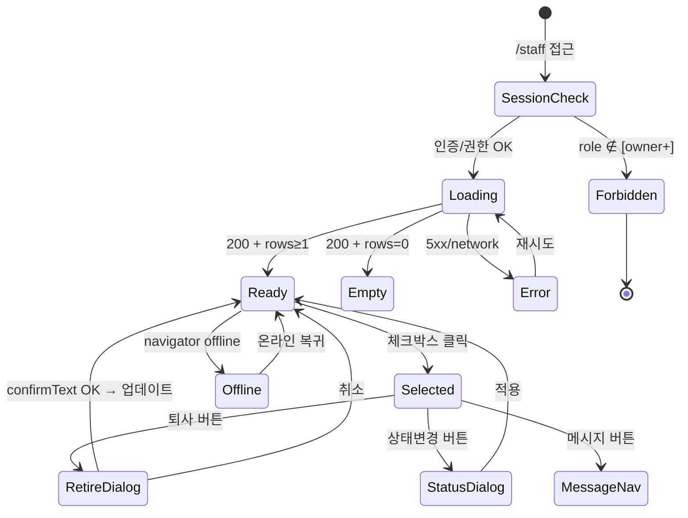

# SCR-060 직원 목록 — 기본화면 (마스터)

> 이 문서는 **화면 마스터 스펙**입니다. `01~08` 상태 문서는 이 문서를 상속(override/delta)합니다.
> 🔐 **권한 핵심**: `/staff`는 **owner 이상만 접근**. manager/fc/trainer/staff/front/readonly 는 `/forbidden` 리다이렉트.
> 🏢 **멀티테넌트**: `primary/superAdmin`은 전 지점 조회(지점 전환 가능), `owner`는 본인 지점 고정.

---

## 0. 메타 & 원천 참조

| 항목 | 값 |
|------|----|
| 화면 ID | SCR-060 |
| 화면명 | 직원 목록 |
| 도메인 | D07-직원관리 |
| 경로 | `/staff` |
| Next.js Route Group | `(dashboard)` |
| 파일 경로 | `src/app/staff/page.tsx` |
| 페이지 컴포넌트 | `StaffList` |
| 역할 | `superAdmin`, `primary`, `owner`, `manager`(조건부 차단) 등 — 공통.md §2.2 준수 |
| 우선순위 | P0 (인사 운영 필수) |
| 플랫폼 | 데스크톱(우선) / 태블릿 / 모바일 |
| 멀티테넌트 | ✅ `branchId` 스코프 강제 |

### 원천 문서 링크
| 문서 | 경로 | 섹션 |
|---|---|---|
| 화면설계서 | `docs/화면설계서/직원관리.md` | §SCR-060 직원 목록 |
| 기능명세서 | `docs/기능명세서/직원관리.md` | §1. 직원 목록 |
| 공통 UI 패턴 | `docs/화면설계서/공통.md` | §2.2 권한 매트릭스, §3 공통 UI |
| 상태전이도 | `docs/상태전이도.md` | §8 직원 상태(StaffStatus) |
| 에러코드정의서 | `docs/에러코드정의서.md` | §4.3 직원(E4xx200~299), §공통(E401/E403) |
| 권한 매트릭스 | `docs/다이어그램/10_권한매트릭스/R1_역할화면_매트릭스.md` | `/staff` 행 |
| KPI 정의서 | `docs/KPI_정의서.md` | §직원 KPI (FC/PT/GX) |
| 다이어그램 F1 진입 | `docs/다이어그램/D07_직원관리/SCR-060_직원목록/F1_진입.md` | 세션/권한/지점 컨텍스트 검증 |
| 다이어그램 F2 메인 | `docs/다이어그램/D07_직원관리/SCR-060_직원목록/F2_메인인터랙션.md` | 필터/정렬/선택/페이지네이션 |
| 다이어그램 F3 버튼액션 | `docs/다이어그램/D07_직원관리/SCR-060_직원목록/F3_버튼액션.md` | BTN_NEW/MSG/STATUS/RETIRE/EXPORT |
| 다이어그램 F4 필터검색정렬 | `docs/다이어그램/D07_직원관리/SCR-060_직원목록/F4_필터검색정렬.md` | 3-state sort, 복합 필터 |
| 다이어그램 F5 모달트리거 | `docs/다이어그램/D07_직원관리/SCR-060_직원목록/F5_모달트리거.md` | DLG-060-001, DLG-060-002 |
| 다이어그램 F6 상태별 | `docs/다이어그램/D07_직원관리/SCR-060_직원목록/F6_상태별화면.md` | 로딩/정상/빈상태/에러/권한/오프라인/선택유무 |
| 다이어그램 F7 권한 | `docs/다이어그램/D07_직원관리/SCR-060_직원목록/F7_권한분기.md` | owner 이상만 접근 |
| 다이어그램 F8 에러 | `docs/다이어그램/D07_직원관리/SCR-060_직원목록/F8_에러예외복구.md` | E404200, E409200, E422200, NETWORK |
| 다이어그램 F9 토스트 | `docs/다이어그램/D07_직원관리/SCR-060_직원목록/F9_토스트피드백.md` | 성공/실패/경고 메시지 |

---

## 1. 화면 목적 (Why)

센터(지점)에 등록된 직원 데이터를 한 화면에서 **조회·필터·정렬·선택·일괄 처리**한다.
- 4개 통계 카드(전체/재직/휴직/퇴사)로 인력 현황 즉시 파악.
- 이름·연락처 검색 + 역할·상태 필터 + 3-state 정렬로 빠른 탐색.
- 다중 선택 후 메시지 전송 / 상태 변경(DLG-060-002) / 퇴사 처리(DLG-060-001) 일괄 수행.
- 엑셀 다운로드로 외부 보고용 명단 추출.
- 멀티테넌트: 자기 지점만(owner), 슈퍼/최고관리자는 지점 전환 가능.

---

## 2. 화면 레이아웃 (Wireframe)

### 2.1 풀뷰 와이어프레임 (데스크톱 ≥1280px)

```
┌──────────────────────────────────────────────────────────────────────────┐
│ AppLayout                                                                │
│ ┌Sidebar(240)─┐ ┌Main Content (p-6 lg:p-8)─────────────────────────────┐│
│ │ 직원관리▼   │ │ PageHeader                                           ││
│ │  · 직원목록◀│ │   title = "직원 관리"                                ││
│ │  · 직원등록 │ │   description = "센터의 직원 정보를 관리합니다."    ││
│ │  · 퇴사처리 │ │   actions = [+ 직원 등록] (BTN_NEW)                  ││
│ │  · 근태     │ │                                                      ││
│ │ 급여관리▶   │ │ ┌── StatCardGrid (cols=4) ─────────────────────────┐││
│ │             │ │ │ [전체 {N}명]  [재직 {N}명]  [휴직 {N}명]  [퇴사]│││
│ │             │ │ │  Users        UserCheck     Clock     UserMinus │││
│ │             │ │ │  default      mint          peach     default   │││
│ │             │ │ └──────────────────────────────────────────────────┘││
│ │             │ │ ┌── SearchFilter ───────────────────────────────────┐││
│ │             │ │ │ [🔍 직원 이름, 연락처 검색               ]         │││
│ │             │ │ │ [역할 ▼] [재직 상태 ▼]              [필터 초기화] │││
│ │             │ │ └──────────────────────────────────────────────────┘││
│ │             │ │ ┌── 액션 버튼 바 (flex gap-2) ─────────────────────┐││
│ │             │ │ │ [💬 메시지] [⚙ 상태변경] [🚪 퇴사처리]  [📥 명단]│││
│ │             │ │ │  outline     outline      danger        outline  │││
│ │             │ │ │  disabled    disabled     disabled      활성     │││
│ │             │ │ │  ↑ selectedRows.size === 0 일 때 3개 disabled    │││
│ │             │ │ └──────────────────────────────────────────────────┘││
│ │             │ │ ┌── DataTable (selectable, sortable, paginated) ──┐││
│ │             │ │ │ [☐][No][직원명↕][역할↕][연락처][입사일↕][상태↕][메모][⋮]│││
│ │             │ │ │ [☐][ 1][ 홍길동][트레이너][010-..][2024-03][재직][- ][⋮]│││
│ │             │ │ │ [☐][ 2][ 이서연][ FC   ][010-..][2024-05][재직][- ][⋮]│││
│ │             │ │ │ [☐][ 3][ 박지훈][매니저 ][010-..][2023-11][휴직][- ][⋮]│││
│ │             │ │ │  ...                                              │││
│ │             │ │ │ [<  1 2 3  >]  (PAGE_SIZE=10)                     │││
│ │             │ │ └──────────────────────────────────────────────────┘││
│ │             │ └─────────────────────────────────────────────────────┘│
│ └─────────────┘                                                         │
└──────────────────────────────────────────────────────────────────────────┘
```

### 2.2 영역별 치수/역할 표

| 영역 | 위치 | 치수 | 역할 |
|---|---|---|---|
| PageHeader | 상단 | h-auto, `pb-6` | 타이틀 + BTN_NEW |
| StatCardGrid | header 아래 | `grid grid-cols-2 md:grid-cols-4 gap-4` | 4개 지표 카드 |
| SearchFilter | StatGrid 아래 | `flex flex-col gap-3` | 검색창 + 필터 Select 2개 + 리셋 |
| 액션 버튼 바 | filter 아래 | `flex flex-wrap gap-2 py-3` | 4개 버튼 (메시지/상태/퇴사/다운로드) |
| DataTable | bar 아래 | `w-full bg-white rounded-xl ring-1 ring-gray-100` | 직원 테이블 |
| Pagination | table 하단 | `flex justify-center py-4` | 페이지 이동 |
| StatCard | 각 셀 | `rounded-xl shadow-sm ring-1 p-5` | 단일 지표 |
| 테이블 row | 각 행 | `h-14 border-b border-gray-100 hover:bg-gray-50` | 개별 직원 |

---

## 3. 디자인 토큰

### 3.1 색상 (Tailwind 토큰 매핑)
| 역할 | 클래스 | Hex | 용도 |
|---|---|---|---|
| bg.page | `bg-gray-50` | #F9FAFB | 전체 배경 |
| bg.card | `bg-white rounded-xl shadow-sm ring-1 ring-gray-100` | — | StatCard/Table 컨테이너 |
| stat.default | `bg-white` | — | 전체/퇴사 카드 |
| stat.mint | `bg-emerald-50 text-emerald-700 ring-emerald-100` | — | 재직 카드 |
| stat.peach | `bg-orange-50 text-orange-700 ring-orange-100` | — | 휴직 카드 |
| badge.role.primary | `bg-[#FFEEEE] text-error border border-error/30` | — | 최고관리자 배지 |
| badge.role.owner | `bg-[#FFF3E5] text-[#E07820] border-[#E07820]/30` | — | 센터장 배지 |
| badge.role.manager | `bg-accent-light text-accent border-accent/30` | — | 매니저 배지 |
| badge.role.fc | `bg-[#EEF4FF] text-[#3B7CF4] border-[#3B7CF4]/30` | — | FC 배지 |
| badge.role.trainer | `bg-[#F0FFF4] text-state-success border-state-success/30` | — | 트레이너 배지 |
| badge.role.staff | `bg-surface-secondary text-content-secondary border-line` | — | 스태프 배지 |
| badge.role.front | `bg-[#EEF4FF] text-[#3B7CF4] border-[#3B7CF4]/30` | — | 프론트 배지 |
| status.active | `text-emerald-700 bg-emerald-100` | — | 재직 StatusBadge (success, dot) |
| status.leave | `text-amber-800 bg-amber-100` | — | 휴직 StatusBadge (warning, dot) |
| status.resigned | `text-gray-700 bg-gray-200` | — | 퇴사 StatusBadge (default, dot) |
| button.primary | `bg-primary text-white hover:bg-primary/90` | #2563EB | + 직원 등록 |
| button.outline | `border border-line bg-white text-content-secondary hover:bg-gray-50` | — | 메시지/상태변경/다운로드 |
| button.danger | `bg-error text-white hover:bg-error/90` | #DC2626 | 퇴사 처리 |
| button.disabled | `opacity-50 cursor-not-allowed pointer-events-none` | — | 선택 없을 때 |
| row.hover | `hover:bg-gray-50` | — | 테이블 행 hover |
| row.selected | `bg-primary/5` | — | 체크된 행 강조 |

### 3.2 타이포그래피
| 토큰 | 스타일 | 용도 |
|---|---|---|
| page.title | `text-2xl font-bold tracking-tight text-gray-900` | "직원 관리" |
| page.desc | `text-sm text-gray-500 mt-1` | description |
| stat.label | `text-xs uppercase tracking-wide font-medium text-gray-500` | 카드 라벨 |
| stat.value | `text-3xl font-bold tabular-nums text-gray-900` | 카드 값 |
| stat.unit | `text-base text-gray-500 ml-1` | "명" |
| table.header | `text-[13px] font-semibold text-gray-600 uppercase tracking-wide` | 컬럼 헤더 |
| table.cell | `text-sm text-gray-900` | 본문 셀 |
| table.ghost.name | `text-sm text-primary hover:underline cursor-pointer` | 직원명 ghost 버튼 |
| badge.role | `inline-flex items-center px-2 py-[2px] rounded-full text-[11px] font-semibold border` | 역할 배지 |
| memo.muted | `text-content-secondary text-Body-2` | 메모 "-" |

### 3.3 간격 / 반경 / 그림자
| 토큰 | 값 |
|---|---|
| radius.card | `rounded-xl` (12px) |
| radius.input | `rounded-lg` (8px) |
| radius.button | `rounded-lg` (8px) |
| radius.badge | `rounded-full` |
| shadow.card | `shadow-sm` |
| spacing.section | `space-y-6` (24px) |
| spacing.card | `p-5` |
| spacing.page | `p-6 lg:p-8` |
| spacing.filter | `gap-3` |

### 3.4 모션 / 포커스
| 토큰 | 값 |
|---|---|
| motion.table.row | `transition-colors duration-100` |
| motion.btn | `transition-colors duration-150` |
| focus.ring | `focus:outline-none focus:ring-2 focus:ring-offset-1 focus:ring-primary` |
| focus.visible | `focus-visible:ring-2 focus-visible:ring-primary` |

---

## 4. 반응형 규칙

| BP | 폭 | StatCardGrid | 필터 레이아웃 | 테이블 | Sidebar |
|---|---|---|---|---|---|
| Mobile <640 | 100% | 2열 | `flex-col` (검색→역할→상태) | 카드뷰 또는 가로스크롤 | 드로어 |
| Tablet 640~1024 | 100% | 4열 | 검색 1행 + 필터 1행 | 테이블 가로스크롤 허용 | 아이콘 축약 |
| Desktop ≥1024 | sidebar + main | 4열 | 한 줄 (검색 flex-1 + 필터) | 전체 표시 | 펼침(240px) |
| XL ≥1440 | container max | 4열 | 한 줄 | 전체 표시 | 펼침(260px) |

---

## 5. 🔐 역할별(RBAC) 매트릭스

> `●` = 전체 접근·CRUD, `○` = 조회만, `—` = 미표시/차단
> 멀티테넌트: `primary/superAdmin`은 전 지점, `owner`는 본인 지점 고정

### 5.1 역할 × 요소 매트릭스

| 요소 | superAdmin/primary | owner | manager | fc | trainer | staff | front | readonly |
|---|:---:|:---:|:---:|:---:|:---:|:---:|:---:|:---:|
| **페이지 접근** (`/staff`) | ● | ● | ●(*) | — | — | — | — | — |
| **BranchSwitcher** (지점전환) | ●(전 지점) | ●(소속 브랜드 한정) | — | — | — | — | — | — |
| StatCard 전체 | ● | ● | ● | — | — | — | — | — |
| StatCard 재직/휴직/퇴사 | ● | ● | ● | — | — | — | — | — |
| 검색/필터/정렬 | ● | ● | ● | — | — | — | — | — |
| 체크박스 (다중 선택) | ● | ● | ●(일부) | — | — | — | — | — |
| **BTN_NEW (+ 직원 등록)** | ● | ● | ● | — | — | — | — | — |
| **BTN_MSG (메시지 전송)** | ● | ● | ● | — | — | — | — | — |
| **BTN_STATUS (상태 변경)** | ● | ● | ●(휴직만) | — | — | — | — | — |
| **BTN_RETIRE (퇴사 처리)** | ● | ● | —(차단, 안내 toast) | — | — | — | — | — |
| **BTN_EXPORT (엑셀)** | ● | ● | ●(본인지점만) | — | — | — | — | — |
| 직원명 클릭 (→ SCR-061) | ● | ● | ● | — | — | — | — | — |
| 역할 변경 | ● | ●(자기 지점) | — | — | — | — | — | — |
| 퇴사 확정 (DLG-060-001) | ● | ● | — | — | — | — | — | — |
| 타 지점 직원 조회 | ●(전 지점) | —(자기 지점만) | — | — | — | — | — | — |

(*) manager 접근은 공통.md §2.2 정책에 따라 허용되며, 퇴사 처리 등 민감 액션은 owner+ 전용. 권한매트릭스 R1에서는 `●` 이나 비즈니스 룰에서 세분화.

### 5.2 역할별 요약

```
┌──── superAdmin / primary ────┐
│ 전 지점 직원 조회 + 지점 전환│
│ 모든 액션 (등록/수정/퇴사/역할)│
│ 감사 로그에 actorId 기록     │
└──────────────────────────────┘
┌──── owner (센터장) ──────────┐
│ 본인 지점만 고정              │
│ 등록/수정/퇴사/엑셀 전권      │
│ 지점 전환 불가 (소속 1개 시)  │
└──────────────────────────────┘
┌──── manager (매니저) ────────┐
│ 조회/등록/수정 ●              │
│ 퇴사 처리 — (안내 toast)      │
│ 상태 변경: 휴직 전환만 ●      │
│ 본인 지점만                   │
└──────────────────────────────┘
┌──── 이하 역할 (fc/trainer/staff/front/readonly) ────┐
│ 접근 불가 → /forbidden 리다이렉트                    │
│ 사이드바에 "직원 관리" 메뉴 숨김                     │
└──────────────────────────────────────────────────────┘
```

### 5.3 서버 스코프 강제

- jwt.role + jwt.branchId 로 `staff` 테이블 RLS(Row-Level Security) 적용.
- `primary/superAdmin` 외: `branchId = jwt.branchId` 강제.
- URL 조작으로 `?branch=OTHER_ID` 전달 시: 서버 403 → `/forbidden`.

---

## 6. 컴포넌트 트리

```
<AppLayout role={user.role}>
  <div className="p-6 lg:p-8 space-y-6">
    <PageHeader
      title="직원 관리"
      description="센터의 직원 정보를 관리합니다."
      actions={
        canCreate(role) && (
          <Button variant="primary" onClick={() => moveToPage(998)}>
            <Plus size={16} /> 직원 등록
          </Button>
        )
      }
    />

    <StatCardGrid cols={4}>
      <StatCard label="전체 직원" value={`${total}명`} icon={<Users/>} variant="default" description="등록된 총 인원" />
      <StatCard label="재직 중"   value={`${active}명`} icon={<UserCheck/>} variant="mint"    description="현재 근무 인원" />
      <StatCard label="휴직 중"   value={`${onLeave}명`} icon={<Clock/>} variant="peach"   description="휴직자 현황" />
      <StatCard label="퇴사"      value={`${resigned}명`} icon={<UserMinus/>} variant="default" description="퇴사 처리 인원" />
    </StatCardGrid>

    <SearchFilter
      searchPlaceholder="직원 이름, 연락처 검색"
      searchValue={searchQuery}
      onSearchChange={setSearchQuery}
      filters={[
        { key: 'role',   label: '역할',   options: ROLE_OPTIONS },
        { key: 'status', label: '재직 상태', options: STATUS_OPTIONS },
      ]}
      values={filterValues}
      onChange={setFilterValues}
      onReset={handleResetFilters}
    />

    <div className="flex flex-wrap gap-2">
      <Button variant="outline" disabled={!hasSel} onClick={() => moveToPage(980)}>
        <MessageSquare size={16}/> 메시지 전송
      </Button>
      <Button variant="outline" disabled={!hasSel || !canChangeStatus(role)} onClick={openStatusDialog}>
        <Settings2 size={16}/> 상태 변경
      </Button>
      <Button variant="danger" disabled={!hasSel || !canRetire(role)} onClick={() => setIsRetireDialogOpen(true)}>
        <UserMinus size={16}/> 퇴사 처리
      </Button>
      <Button variant="outline" onClick={() => exportToExcel(filtered, exportColumns, { filename: '직원목록' })}>
        <Download size={16}/> 명단 다운로드
      </Button>
    </div>

    <DataTable
      columns={STAFF_COLUMNS}
      data={pageData}
      selectable
      selectedRows={selectedRows}
      onSelectionChange={setSelectedRows}
      sortKey={sortKey}
      sortDir={sortDir}
      onSort={handleSort}
      emptyMessage={isLoadingData ? '데이터를 불러오는 중...' : '직원 데이터가 없습니다.'}
      pagination={{ page: currentPage, pageSize: PAGE_SIZE, total: filtered.length }}
      onPageChange={setCurrentPage}
    />

    <ConfirmDialog /* DLG-060-001 퇴사 처리 확인 */ />
    <StatusChangeDialog /* DLG-060-002 상태 변경 */ />
  </div>
</AppLayout>
```

### 6.1 컴포넌트 명세
| 컴포넌트 | 파일 | 핵심 Props | 재사용 |
|---|---|---|---|
| `PageHeader` | `src/components/common/PageHeader.tsx` | `{title, description, actions}` | 전역 |
| `StatCardGrid` | `src/components/common/StatCardGrid.tsx` | `{cols, children}` | 전역 |
| `StatCard` | `src/components/common/StatCard.tsx` | `{label, value, icon, variant, description}` | 전역 |
| `SearchFilter` | `src/components/common/SearchFilter.tsx` | `{searchValue, onSearchChange, filters, values, onChange, onReset}` | 전역 |
| `DataTable` | `src/components/common/DataTable.tsx` | `{columns, data, selectable, sortable, pagination}` | 전역 |
| `ConfirmDialog` | `src/components/common/ConfirmDialog.tsx` | `{open, title, description, confirmationText, variant, onConfirm}` | 전역 |
| `StatusChangeDialog` | `src/components/staff/StatusChangeDialog.tsx` | `{open, count, onConfirm}` — DLG-060-002 | 전용 |
| `StatusBadge` | `src/components/ui/StatusBadge.tsx` | `{variant, dot, children}` | 전역 |

---

## 7. 데이터 계약

### 7.1 타입
```ts
// src/api/endpoints/staff.ts
export type StaffStatus = 'ACTIVE' | 'RESIGNED' | 'TRANSFERRED' | 'ON_LEAVE' | 'LOCKED';

export interface Staff {
  id: number;
  name: string;
  phone: string;
  email?: string;
  role: string;           // DB 한글: "센터장"|"매니저"|"FC"|"트레이너"|"스태프"|"프론트"
  position: string;
  hireDate: string;       // ISO
  salary?: number;
  color?: string;
  isActive: boolean;
  branchId: number;
  staffStatus?: StaffStatus;
  leaveStartAt?: string;
  leaveEndAt?: string;
  leaveReason?: string;
  resignedAt?: string;
  resignReason?: string;
  resignScheduledAt?: string;
}

// 프론트 테이블 행 (페이지 전용)
interface StaffRow {
  id: number;
  name: string;
  role: RoleKey;          // primary|owner|manager|fc|trainer|staff|프론트
  contact: string;        // phone 매핑
  joinDate: string;       // hireDate 슬라이스
  status: 'active' | 'leave' | 'resigned';
  memo: string;
}
```

### 7.2 API 엔드포인트
| 시점 | 메서드 | 테이블/엔드포인트 | 파라미터/페이로드 |
|---|---|---|---|
| 마운트 | SELECT | `staff` | `.select("id,name,phone,email,role,position,hireDate,salary,color,isActive,branchId,staffStatus,leaveStartAt,leaveEndAt").eq("branchId", getBranchId()).order("name")` |
| 퇴사 처리 | UPDATE | `staff` | `.update({ isActive:false, staffStatus:'RESIGNED', resignedAt:nowISO() }).in("id", ids)` |
| 상태 변경(휴직) | UPDATE | `staff` | `.update({ staffStatus:'ON_LEAVE', leaveStartAt, leaveEndAt, leaveReason }).in("id", ids)` |
| 상태 변경(복직) | UPDATE | `staff` | `.update({ staffStatus:'ACTIVE', isActive:true }).in("id", ids)` |
| 엑셀 | 로컬 | `exportToExcel` | `(filtered, exportColumns, { filename:'직원목록' })` |
| 감사 로그 | INSERT | `audit_logs` | `{ action:'STAFF_RESIGN_SCHEDULE', actorId, targetIds }` |

### 7.3 권한별 스코프
- `superAdmin/primary`: `branchId` 필터 없이 전 지점 또는 선택된 branchId
- `owner/manager`: 서버가 jwt.branchId 강제
- 기타 역할: 사전 가드로 `/forbidden` 리다이렉트

### 7.4 상태 관리
- **Store**: `useAuthStore`(user/role/branchId), `useBranchStore`(지점 리스트)
- **Fetching**: React Query `useStaffList({ branchId })`
- **Cache**: `staleTime: 30_000`, `refetchOnWindowFocus: true`
- **Local state**: `selectedRows(Set<number>)`, `searchQuery`, `filterValues`, `sortKey/Dir`, `currentPage`, `isRetireDialogOpen`, `isStatusDialogOpen`

### 7.5 DB ↔ 프론트 매핑
```ts
const mapped: StaffRow[] = data.map((s) => ({
  id: s.id,
  name: s.name,
  role: mapDbRoleToKey(s.role),  // 한글 → 영문 key
  contact: s.phone ?? '',
  joinDate: s.hireDate ?? '',
  status:
    s.staffStatus === 'ON_LEAVE' ? 'leave' :
    s.staffStatus === 'RESIGNED' || s.isActive === false ? 'resigned' :
    'active',
  memo: '',
}));
```

### 7.6 엑셀 컬럼
```ts
const exportColumns = [
  { key: 'id', header: 'No' },
  { key: 'name', header: '직원명' },
  { key: 'role', header: '역할' },
  { key: 'contact', header: '연락처' },
  { key: 'joinDate', header: '입사일' },
  { key: 'status', header: '상태' },
  { key: 'memo', header: '메모' },
];
```

---

## 8. 비즈니스 룰

### 8.1 공통
1. **스코프 강제**: 서버는 jwt.role/branchId로 `staff` RLS 적용. URL 조작 시 403 → `/forbidden`.
2. **정렬 3-state**: null → asc → desc → null. 정렬 가능: `name`, `role`, `joinDate`, `status`. 방식: `localeCompare('ko')`.
3. **페이지네이션**: `PAGE_SIZE = 10`. 필터 변경 시 `currentPage = 1`로 리셋.
4. **통계 재계산**: `staffData` 변경 시 total/active/onLeave/resigned 파생값 useMemo.

### 8.2 필터/검색
5. **검색 대상**: `name.includes(q) || contact.includes(q)`. 대소문자 구분 없음. debounce 미적용(즉시).
6. **역할 필터**: RoleKey 일치 비교 (`===`). 다국어 대응은 key 기준.
7. **상태 필터**: `active/leave/resigned` — 매핑 기반. DB `staffStatus`와 `isActive`의 조합을 프론트에서 단일 필드로 축소.
8. **필터 초기화**: `setFilterValues({role:'',status:''})` + `setSearchQuery('')` + `setCurrentPage(1)`.

### 8.3 선택/액션
9. **선택 활성화**: `selectedRows.size === 0` → 메시지/상태변경/퇴사 버튼 disabled.
10. **퇴사 처리 (owner 이상만)**:
    - DLG-060-001 오픈 → confirmationText "퇴사처리" 입력 → 확정 시 `update({ isActive:false, staffStatus:'RESIGNED', resignedAt })`.
    - E409200 (이미 퇴사) 시 해당 행 skip, 나머지 처리 후 요약 toast.
    - E422200 (담당 회원 존재) 시 SCR-062로 리다이렉트 권유 dialog.
11. **상태 변경 (DLG-060-002)**: 재직/휴직/퇴사 Select + (휴직 시) 시작/종료일 + 사유 textarea. manager는 "휴직" 옵션만 활성.
12. **메시지 전송**: 선택된 ids를 SCR-071(메시지 발송)에 쿼리 전달. `moveToPage(980, { ids })`.
13. **엑셀**: 현재 filtered 결과만 내보냄(검색/필터 적용된 상태). 파일명 `직원목록_{YYYYMMDD}.xlsx`.

### 8.4 행 인터랙션
14. **직원명 ghost 클릭**: `moveToPage(998, { id })` → SCR-061 수정 모드.
15. **MoreVertical 메뉴**: 컨텍스트 메뉴 (상세/수정/휴직/퇴사). 권한별 옵션 차등.
16. **역할 배지**: `ROLE_CONFIG[val] ?? ROLE_CONFIG.staff` fallback.

### 8.5 감사 로그
17. 퇴사/상태변경/역할변경 시 `audit_logs` INSERT. action: `STAFF_RESIGN_SCHEDULE` / `STAFF_STATUS_CHANGE` / `STAFF_ROLE_CHANGE`.
18. primary/superAdmin의 전 지점 액션은 actorBranchId와 targetBranchId 모두 기록.

### 8.6 상태전이 (docs/상태전이도.md §8)
```
ACTIVE ──퇴사처리──▶ RESIGNED (resignedAt 기록)
ACTIVE ──휴직──▶ ON_LEAVE (leaveStartAt~leaveEndAt)
ON_LEAVE ──복직──▶ ACTIVE
ACTIVE ──5회 로그인 실패──▶ LOCKED (시스템 자동)
ACTIVE ──타지점 발령──▶ TRANSFERRED
```

---

## 9. 상태 목록

| 파일 | 상태 코드 | 한글 | 트리거 |
|---|---|---|---|
| `01-로딩.md` | `staff-list-loading` | 로딩(스켈레톤) | 진입 직후, API pending |
| `02-정상-데이터있음.md` | `staff-list-ready` | 정상(데이터 있음) | 200 + rows ≥ 1 |
| `03-빈상태.md` | `staff-list-empty` | 빈 상태 | 200 + rows = 0 |
| `04-에러.md` | `staff-list-error` | 에러 | API 실패(E500/NETWORK) |
| `05-권한없음.md` | `staff-list-forbidden` | 권한 없음 | role ∉ [owner+] → /forbidden |
| `06-오프라인.md` | `staff-list-offline` | 오프라인 | navigator.onLine=false |
| `07-선택없음.md` | `staff-list-unselected` | 선택 없음 | selectedRows.size = 0 |
| `08-선택있음.md` | `staff-list-selected` | 선택 있음 | selectedRows.size ≥ 1 |

상태 전이: `docs/다이어그램/D07_직원관리/SCR-060_직원목록/F6_상태별화면.md`.

---

## 10. 에러 코드 매핑

| errorCode | HTTP | 시나리오 | 표시 | 추가 액션 |
|---|---|---|---|---|
| E400200 | 400 | 직원 정보 누락(등록 시 공통) | 폼 필드 인라인 | SCR-061에서 주로 처리 |
| E401001 | 401 | 인증 실패/만료 | 전역 인터셉터 | `/login?redirect=/staff` |
| E403001 | 403 | 권한 없음 | `/forbidden` | 메뉴 숨김 |
| E403003 | 403 | 지점 접근 제한 | `/forbidden` | URL ?branch= 조작 시 |
| E404200 | 404 | 직원 없음(상세 이동) | toast.error "직원을 찾을 수 없습니다." | 목록 새로고침 |
| E409200 | 409 | 이미 퇴사된 직원 | toast.error "이미 퇴사 처리된 직원입니다." | 해당 행 skip, 나머지 처리 |
| E422200 | 422 | 담당 회원 존재 시 퇴사 | 경고 dialog + SCR-062 안내 | "퇴사 처리 위자드로 이동" |
| E500001 | 500 | 서버 내부 오류 | 전역 에러 배너 | 재시도 버튼 → `04-에러` |
| NETWORK | — | 오프라인 | 오프라인 배너 + 캐시 | `06-오프라인` |

토스트 메시지 (F9 참조):
- 로드 실패: `toast.error("직원 데이터를 불러오지 못했습니다.")`
- 퇴사 성공: `` toast.success(`${ids.length}명의 퇴사 처리가 완료되었습니다.`) ``
- 퇴사 실패: `toast.error("퇴사 처리에 실패했습니다.")`
- 엑셀 완료: `` toast.success(`${filtered.length}건 엑셀 다운로드 완료`) ``

---

## 11. 접근성 (WCAG 2.1 AA)

| 항목 | 요구사항 |
|---|---|
| 페이지 구조 | `<main role="main">` + 각 section `aria-label` |
| 테이블 | `<table>` + `<caption className="sr-only">직원 목록</caption>` |
| 체크박스 | `<input type="checkbox" aria-label="{name} 선택">` / 헤더는 "전체 선택" |
| 정렬 헤더 | `<button aria-sort="{none|ascending|descending}">` |
| 배지 | `role="status"` + 텍스트 (색상만으로 전달 금지) |
| 필터 Select | `<select>` + `<label>` 연결 (또는 ARIA combobox) |
| 액션 버튼 | disabled 시 `aria-disabled` + 툴팁 "먼저 직원을 선택하세요" |
| 다이얼로그 | `role="dialog" aria-modal="true" aria-labelledby` + focus trap + Esc 닫기 |
| 포커스 표시 | `focus-visible:ring-2 ring-primary ring-offset-1` |
| 대비 | 본문 4.5:1, 배지 4.5:1 |
| 스크린리더 | 선택 상태 변화 `aria-live="polite"` |
| prefers-reduced-motion | 테이블 row hover/열림 애니메이션 비활성 |

---

## 12. 진입 / 이탈

### 진입
- 사이드바 "직원 관리 > 직원 목록"
- 로그인 후 owner/primary가 `/staff` 북마크 직접 접근
- SCR-061(등록/수정) 저장 성공 후 `moveToPage(974)` 복귀
- SCR-062 퇴사 위자드 완료 후 복귀
- 대시보드 "직원 전체보기" 링크 (옵션)

### 이탈
| 액션 | 목적지 |
|---|---|
| + 직원 등록 | SCR-061 `/staff/new` |
| 직원명 ghost 클릭 | SCR-061 `/staff/new?id={id}` 수정 모드 |
| 퇴사 처리 → SCR-062 이관 | SCR-062 `/staff/resignation?staffId={id}` |
| 메시지 전송 | SCR-071 `/message?ids=...` |
| 급여 바로가기 (하단 카드) | SCR-064 `/payroll` |
| 사이드바 다른 메뉴 | 해당 라우트 |
| 403 | `/forbidden` |
| 401 | `/login?redirect=/staff` |

---

## 13. 다이어그램 통합 뷰



---

## 14. 🧩 바이브코딩 프롬프트 (마스터)

```
Next.js 15 App Router + TypeScript + Tailwind + Supabase + React Query + react-hook-form
'use client' 컴포넌트를 작성하라.

━━ 화면: SCR-060 직원 목록 (멀티테넌트, owner 이상 전용) ━━
파일: src/app/staff/page.tsx
보조:
- src/components/staff/StatusChangeDialog.tsx (DLG-060-002)
- src/components/common/{PageHeader,StatCardGrid,StatCard,SearchFilter,DataTable,ConfirmDialog,StatusBadge}.tsx
- src/api/endpoints/staff.ts (getStaff, updateStaff 등)
- src/lib/role-access.ts (canCreate, canRetire, canChangeStatus)
- src/lib/export.ts (exportToExcel)

━━ 상단 가드 ━━
- 미인증: /login?redirect=/staff 리다이렉트
- role ∉ ['superAdmin','primary','owner','manager']: /forbidden
- URL ?branch= 조작 시 서버가 403 반환 → /forbidden

━━ 레이아웃 ━━
<AppLayout role={user.role}>
  <div className="p-6 lg:p-8 space-y-6">
    <PageHeader title="직원 관리" description="센터의 직원 정보를 관리합니다."
      actions={canCreate(role) && <Button variant="primary" onClick={()=>moveToPage(998)}><Plus size={16}/> 직원 등록</Button>} />

    <StatCardGrid cols={4}>
      <StatCard label="전체 직원" value={`${total}명`} icon={<Users/>} variant="default" description="등록된 총 인원" />
      <StatCard label="재직 중"   value={`${active}명`} icon={<UserCheck/>} variant="mint"    description="현재 근무 인원" />
      <StatCard label="휴직 중"   value={`${onLeave}명`} icon={<Clock/>} variant="peach"   description="휴직자 현황" />
      <StatCard label="퇴사"      value={`${resigned}명`} icon={<UserMinus/>} variant="default" description="퇴사 처리 인원" />
    </StatCardGrid>

    <SearchFilter
      searchPlaceholder="직원 이름, 연락처 검색"
      searchValue={searchQuery}
      onSearchChange={setSearchQuery}
      filters={[
        { key:'role', label:'역할', options:[
          {value:'owner',label:'센터장'},{value:'manager',label:'매니저'},
          {value:'fc',label:'FC'},{value:'trainer',label:'트레이너'},
          {value:'staff',label:'스태프'},{value:'프론트',label:'프론트'}]},
        { key:'status', label:'재직 상태', options:[
          {value:'active',label:'재직'},{value:'leave',label:'휴직'},{value:'resigned',label:'퇴사'}]},
      ]}
      values={filterValues} onChange={setFilterValues} onReset={handleResetFilters} />

    <div className="flex flex-wrap gap-2">
      <Button variant="outline" disabled={!hasSel}
              onClick={()=>moveToPage(980,{ids:Array.from(selectedRows)})}>
        <MessageSquare size={16}/> 메시지 전송
      </Button>
      <Button variant="outline" disabled={!hasSel || !canChangeStatus(role)}
              onClick={()=>setIsStatusDialogOpen(true)}>
        <Settings2 size={16}/> 상태 변경
      </Button>
      <Button variant="danger" disabled={!hasSel || !canRetire(role)}
              onClick={()=>setIsRetireDialogOpen(true)}>
        <UserMinus size={16}/> 퇴사 처리
      </Button>
      <Button variant="outline"
              onClick={()=>exportToExcel(filtered, exportColumns, {filename:'직원목록'})}>
        <Download size={16}/> 명단 다운로드
      </Button>
    </div>

    <DataTable
      columns={STAFF_COLUMNS}
      data={pageData}
      selectable selectedRows={selectedRows} onSelectionChange={setSelectedRows}
      sortKey={sortKey} sortDir={sortDir} onSort={handleSort}
      emptyMessage={isLoadingData ? '데이터를 불러오는 중...' : '직원 데이터가 없습니다.'}
      pagination={{page:currentPage, pageSize:PAGE_SIZE, total:filtered.length}}
      onPageChange={setCurrentPage}
    />
  </div>

  <ConfirmDialog open={isRetireDialogOpen}
    title="직원 퇴사 처리"
    description={`선택한 ${selectedRows.size}명의 직원을 퇴사 처리하시겠습니까?\n퇴사 처리 시 해당 직원의 계정 접근이 제한됩니다.`}
    confirmLabel="퇴사 처리" cancelLabel="취소"
    variant="danger" confirmationText="퇴사처리"
    onConfirm={handleRetire} onCancel={()=>setIsRetireDialogOpen(false)} />

  <StatusChangeDialog open={isStatusDialogOpen}
    count={selectedRows.size} canManagerOnLeaveOnly={role==='manager'}
    onConfirm={handleStatusChange} onCancel={()=>setIsStatusDialogOpen(false)} />
</AppLayout>

━━ STAFF_COLUMNS ━━
[
  { key:'id', header:'No', width:60, align:'center' },
  { key:'name', header:'직원명', sortable:true,
    render:(v,row)=><Button variant="ghost" size="sm"
                      onClick={()=>moveToPage(998,{id:row.id})}>{v}</Button> },
  { key:'role', header:'역할', width:120, sortable:true,
    render:(v)=>{ const cfg = ROLE_CONFIG[v] ?? ROLE_CONFIG.staff;
      return <span className={`inline-flex items-center px-sm py-[2px] rounded-full text-[11px] font-semibold ${cfg.badgeClass}`}>{cfg.label}</span>; } },
  { key:'contact', header:'연락처', width:140 },
  { key:'joinDate', header:'입사일', width:120, sortable:true,
    render:(v)=>v ? v.slice(0,10) : '-' },
  { key:'status', header:'상태', width:100, align:'center', sortable:true,
    render:(v)=><StatusBadge variant={STATUS_VARIANT[v]} dot>{STATUS_LABEL[v]}</StatusBadge> },
  { key:'memo', header:'메모', render:(v)=>v||'-' },
  { key:'menu', header:'', width:60, align:'center',
    render:(_,row)=><Button variant="ghost" size="sm" onClick={(e)=>openRowMenu(e,row)}>
      <MoreVertical size={16}/></Button> },
]

━━ 디자인 토큰 ━━
bg.page: bg-gray-50
card: bg-white rounded-xl shadow-sm ring-1 ring-gray-100 p-5
stat.label: text-xs uppercase tracking-wide font-medium text-gray-500
stat.value: text-3xl font-bold tabular-nums text-gray-900
badge.role.*: 위 §3.1 참조
button.primary: bg-primary text-white hover:bg-primary/90
button.danger:  bg-error text-white hover:bg-error/90
button.outline: border border-line bg-white text-content-secondary hover:bg-gray-50
button.disabled: opacity-50 cursor-not-allowed

━━ 데이터/훅 ━━
useStaffList({ branchId: getBranchId() }) 
  → { data, isLoading, refetch }
  → supabase.from('staff')
      .select('id,name,phone,email,role,position,hireDate,salary,color,isActive,branchId,staffStatus,leaveStartAt,leaveEndAt')
      .eq('branchId', branchId).order('name');

매핑:
const mapped = data.map((s) => ({
  id: s.id, name: s.name, role: mapDbRoleToKey(s.role),
  contact: s.phone ?? '', joinDate: s.hireDate ?? '',
  status: s.staffStatus === 'ON_LEAVE' ? 'leave'
        : s.staffStatus === 'RESIGNED' || s.isActive === false ? 'resigned'
        : 'active',
  memo: '',
}));

파생:
total = mapped.length; 
active = mapped.filter(s=>s.status==='active').length; 
onLeave = mapped.filter(s=>s.status==='leave').length;
resigned = mapped.filter(s=>s.status==='resigned').length;

filtered: search + role + status 적용
pageData: filtered.slice((currentPage-1)*PAGE_SIZE, currentPage*PAGE_SIZE)

━━ 퇴사 처리 핸들러 ━━
async function handleRetire() {
  const ids = Array.from(selectedRows);
  const { error } = await supabase.from('staff')
    .update({ isActive:false, staffStatus:'RESIGNED', resignedAt:new Date().toISOString() })
    .in('id', ids);
  if (error) {
    if (error.code === 'E422200') toast.error('담당 회원이 있어 퇴사 처리할 수 없습니다. 퇴사 위자드를 이용하세요.');
    else if (error.code === 'E409200') toast.error('이미 퇴사 처리된 직원입니다.');
    else toast.error('퇴사 처리에 실패했습니다.');
    return;
  }
  toast.success(`${ids.length}명의 퇴사 처리가 완료되었습니다.`);
  setIsRetireDialogOpen(false);
  setSelectedRows(new Set());
  refetch();
}

━━ 인터랙션 ━━
- 체크박스 토글: setSelectedRows(prev => toggle(prev, id))
- 정렬 헤더 클릭: sortKey/sortDir 3-state 순환
- 필터 변경: setFilterValues + setCurrentPage(1)
- 검색 onChange: 즉시 filtered 재계산 (debounce 없음)
- MoreVertical: 컨텍스트 메뉴 (상세/수정/휴직/퇴사)
- 오프라인: onOnline/onOffline 이벤트로 배너 토글

━━ 접근성 ━━
- <main role="main" aria-label="직원 관리">
- table: aria-label="직원 목록" + <caption className="sr-only">
- 체크박스: aria-label={`${row.name} 선택`}; 헤더는 "전체 선택"
- 정렬 헤더: aria-sort="ascending|descending|none"
- 액션 버튼 disabled: aria-disabled + title="먼저 직원을 선택하세요"
- ConfirmDialog: role="dialog" aria-modal="true" aria-labelledby="retire-title" focus trap
- reduced-motion: transition 제거

━━ 반응형 ━━
mobile(<640): StatGrid 2열, 필터 세로, 테이블 가로스크롤, 액션바 wrap
tablet(640~1024): StatGrid 4열, 필터 2행
desktop(≥1024): 전체 표시, sidebar 펼침
```

---

## 15. QA 체크리스트 (수용 기준)

- [ ] manager가 `/staff` 접근 시 접근 가능, 퇴사 처리 버튼 비활성/안내
- [ ] fc/trainer/staff/front/readonly 접근 시 `/forbidden` 리다이렉트
- [ ] owner가 자기 지점 직원만 조회(타 지점 URL 조작 시 403)
- [ ] primary/superAdmin가 BranchSwitcher로 지점 전환 시 데이터 갱신
- [ ] 4개 StatCard 값이 실시간 반영
- [ ] 검색 즉시 반영, 필터·정렬 조합 동작
- [ ] 3-state 정렬 토글 (null→asc→desc→null)
- [ ] 체크박스 단일/전체 선택, 페이지 이동 시 선택 상태 유지 정책 명확
- [ ] 선택 0명 시 3개 액션 버튼 disabled + aria-disabled
- [ ] 퇴사 처리 DLG-060-001에 "퇴사처리" 입력 확인 동작
- [ ] 담당 회원 존재 시 E422200 dialog → SCR-062 이관
- [ ] 상태 변경 DLG-060-002: 휴직 선택 시 기간/사유 필수
- [ ] manager는 DLG-060-002에서 "휴직"만 활성
- [ ] 엑셀 다운로드 파일명/컬럼 정확
- [ ] PAGE_SIZE=10 페이지네이션 경계 케이스(11번째, 21번째) 정상
- [ ] 빈 데이터/에러/오프라인 상태 각 메시지 일치
- [ ] 키보드만으로 선택→퇴사 처리 플로우 완주 가능
- [ ] 스크린리더: 선택 상태 변화 aria-live 공지
- [ ] 감사 로그 기록 (STAFF_RESIGN_SCHEDULE, STAFF_STATUS_CHANGE)
- [ ] reduced-motion 준수
