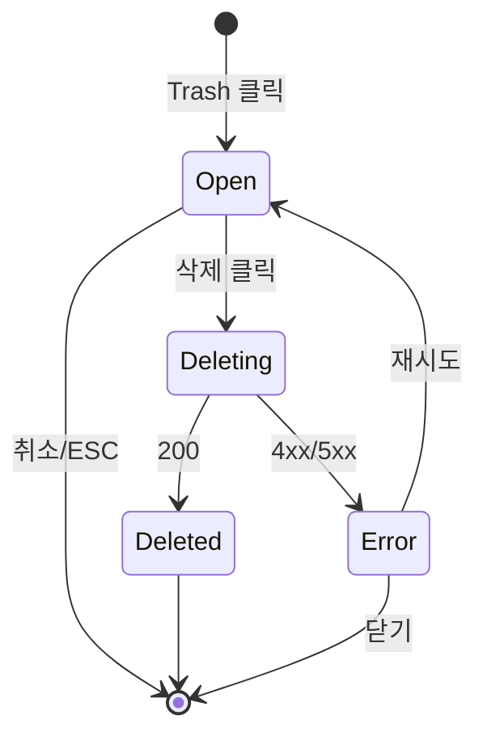

# DLG-070-002 리드 삭제 확인 — 기본화면 (마스터)

> 이 문서는 **다이얼로그 마스터 스펙**입니다. `01~03` 상태 문서는 이 문서를 상속합니다.
> 부모 화면: SCR-070 리드 관리 (`/leads`)

---

## 0. 메타 & 원천 참조

| 항목 | 값 |
|------|----|
| 다이얼로그 ID | DLG-070-002 |
| 다이얼로그명 | 리드 삭제 확인 |
| 도메인 | D08-마케팅 |
| 부모 화면 | SCR-070 리드 관리 |
| 트리거 | 테이블 행 삭제(Trash2) 아이콘 |
| 확인 레벨 | L3 (삭제 확인 / danger) |
| 서버 호출 여부 | ✅ `supabase.leads.delete` (hard delete) |
| 닫기 옵션 | ESC/배경/X/취소 가능 |
| 역할 | owner, manager, fc |
| 파일 경로 | `src/app/(marketing)/leads/DeleteConfirmDialog.tsx` (ConfirmDialog 재사용) |
| 우선순위 | P1 |

### 원천 문서 링크
| 문서 | 경로 |
|---|---|
| 화면설계서 | `docs/화면설계서/마케팅.md` §SCR-070 §8.2 DLG-070-002 |
| 기능명세서 | `docs/기능명세서/마케팅.md` §1 §G-2 |
| 에러코드 | `docs/에러코드정의서.md` §리드 |
| 다이어그램 | `docs/다이어그램/D08_마케팅/DLG/DLG-070-002_리드삭제확인/F1~F9` |

---

## 1. 다이얼로그 목적
잘못된 리드 삭제로 인한 데이터 손실을 방지하기 위해 **명시적 확인 절차**를 제공한다. FC가 중복/테스트 리드를 정리하는 주요 경로.

---

## 2. 화면 레이아웃

```
  Backdrop(dim)
  ┌────────────────────────────────────────┐
  │ ⚠️  리드 삭제                         │
  │                                        │
  │ 이 리드를 삭제하시겠습니까?             │
  │                                        │
  │                    [취소]  [삭제(red)] │
  └────────────────────────────────────────┘
```

| 영역 | 치수 | 역할 |
|---|---|---|
| Backdrop | `fixed inset-0 bg-black/50` | 차단 |
| Modal | `max-w-sm` | 카드 |
| Header | 40px h | 경고 아이콘 + 타이틀 |
| Body | auto | 확인 문구 |
| Footer | 48px h | 취소 + 삭제(danger) |

---

## 3. 디자인 토큰

| 토큰 | 클래스 | 용도 |
|---|---|---|
| card | `bg-white rounded-2xl shadow-2xl p-6 max-w-sm` | 카드 |
| icon.warn | `text-red-500 size-5` | AlertTriangle |
| title | `text-lg font-semibold text-gray-900` | 타이틀 |
| body | `text-sm text-gray-600` | 본문 |
| btn.danger | `bg-red-600 hover:bg-red-700 text-white` | 삭제 버튼 |
| btn.ghost | `border border-gray-300 hover:bg-gray-50` | 취소 |

---

## 4. 반응형

| BP | 모달 |
|---|---|
| <640 | `max-w-[calc(100%-24px)]` |
| ≥640 | `max-w-sm` (384px) |

---

## 5. 🔐 RBAC 매트릭스

| 요소 | superAdmin | primary | owner | manager | fc | trainer | staff | front | readonly |
|---|:---:|:---:|:---:|:---:|:---:|:---:|:---:|:---:|:---:|
| 모달 열기 | ● | ● | ● | ● | ● | — | — | — | — |
| 삭제 확정 | ● | ● | ● | ● | ● | — | — | — | — |
| 취소 | ● | ● | ● | ● | ● | — | — | — | — |
| 타지점 리드 삭제 | ● | ● | — | — | — | — | — | — | — |

### 5.1 멀티테넌트
- 본 지점 리드만 삭제(RLS). super/primary는 예외.

---

## 6. 컴포넌트 트리

```tsx
<ConfirmDialog
  open={!!deleteId}
  title="리드 삭제"
  description="이 리드를 삭제하시겠습니까?"
  confirmLabel="삭제"
  cancelLabel="취소"
  variant="danger"
  onConfirm={handleDelete}
  onCancel={() => setDeleteId(null)}
/>
```

| 컴포넌트 | Props |
|---|---|
| `ConfirmDialog` | `{ open, title, description, confirmLabel, cancelLabel, variant, onConfirm, onCancel }` |

---

## 7. 데이터 계약

### API

| 함수 | 쿼리 |
|---|---|
| `deleteLead(id)` | `supabase.from('leads').delete().eq('id', id)` |

### 트리거
- `setDeleteId(lead.id)` → `open = true`
- `onConfirm` → `deleteLead(deleteId)` → `setDeleteId(null)` → `fetchData()`

---

## 8. 비즈니스 룰

1. 삭제는 **hard delete** (현재 구현 기준).
2. 연결된 멤버(`convertedMemberId`)가 있어도 차단하지 않음 (FK는 NULL 처리).
3. 중복 확인 방지: 삭제 중 버튼 disabled.
4. 성공 시 토스트 `"삭제되었습니다."`, 실패 시 `"삭제 실패: …"`.
5. 목록은 낙관적 업데이트 X — 완료 후 `fetchData()`.
6. 감사로그: `AUDIT.LEAD_DELETED(leadId, branchId, byUserId)` 서버 기록.

---

## 9. 상태 목록

| 파일 | 상태 코드 | 한글 |
|---|---|---|
| `01-열림.md` | `open` | 열림 (확인 대기) |
| `02-삭제성공.md` | `deleted` | 삭제 성공 |
| `03-삭제오류.md` | `delete-error` | 삭제 오류 |

---

## 10. 에러 코드 매핑

| errorCode | 시나리오 | 표시 |
|---|---|---|
| E40703 | 타지점 삭제 시도 | 토스트 "권한이 없습니다." |
| E40901 | FK 제약(종속 데이터) | 토스트 "연결된 데이터가 있어 삭제할 수 없습니다." |
| E5xx | 서버 오류 | 토스트 "삭제 실패: ${message}" |

---

## 11. 접근성

| 항목 | 요구 |
|---|---|
| role | `role="alertdialog"` |
| 포커스 | 삭제 버튼이 기본 포커스? **취소에 우선 포커스 (실수 방지)** |
| ESC | 닫기 = 취소와 동일 |
| 대비 | 삭제 버튼 4.5:1 |

---

## 12. 진입/이탈

| 액션 | 목적지 |
|---|---|
| 삭제 클릭 | `02-삭제성공` → 모달 닫힘 + 목록 갱신 |
| 취소/ESC | 모달 닫힘 (상태 변화 없음) |
| 삭제 실패 | `03-삭제오류` (모달 유지 또는 닫힘 + 토스트) |

---

## 13. 다이어그램 통합 뷰



---

## 14. 🧩 바이브코딩 프롬프트 마스터

```
Next.js 15 + TS + Tailwind + Radix Dialog 기반 ConfirmDialog를 재사용하여
리드 삭제 확인 모달을 작성하라.

━━ 부모 (SCR-070) ━━
const [deleteId, setDeleteId] = useState<number | null>(null);
const [deleting, setDeleting] = useState(false);

const handleDelete = async () => {
  if (!deleteId) return;
  setDeleting(true);
  try {
    await deleteLead(deleteId);
    toast.success('삭제되었습니다.');
    setDeleteId(null);
    fetchData();
  } catch (e: any) {
    const msg = e?.message ?? '알 수 없는 오류';
    toast.error(`삭제 실패: ${msg}`);
  } finally { setDeleting(false); }
};

━━ 렌더 ━━
<ConfirmDialog
  open={!!deleteId}
  title="리드 삭제"
  description="이 리드를 삭제하시겠습니까?"
  confirmLabel="삭제"
  cancelLabel="취소"
  variant="danger"
  confirmLoading={deleting}
  onConfirm={handleDelete}
  onCancel={() => setDeleteId(null)}
/>

━━ ConfirmDialog 스펙 ━━
<Dialog.Root open={open} onOpenChange={(o)=>!o && onCancel()}>
  <Dialog.Portal>
    <Dialog.Overlay className="fixed inset-0 z-50 bg-black/50 backdrop-blur-sm" />
    <Dialog.Content role="alertdialog"
      className="fixed left-1/2 top-1/2 -translate-x-1/2 -translate-y-1/2
                 w-[calc(100%-24px)] max-w-sm bg-white rounded-2xl shadow-2xl p-6 space-y-4">
      <header className="flex items-center gap-3">
        <AlertTriangle className="size-5 text-red-500" aria-hidden />
        <Dialog.Title className="text-lg font-semibold">{title}</Dialog.Title>
      </header>
      <Dialog.Description className="text-sm text-gray-600">{description}</Dialog.Description>
      <footer className="flex justify-end gap-2">
        <button onClick={onCancel}
          className="h-10 px-4 rounded-lg border border-gray-300 hover:bg-gray-50 text-sm">
          {cancelLabel ?? '취소'}
        </button>
        <button onClick={onConfirm} disabled={confirmLoading}
          className={cx("h-10 px-5 rounded-lg text-white text-sm font-medium disabled:opacity-60",
            variant==='danger' ? 'bg-red-600 hover:bg-red-700' : 'bg-blue-600 hover:bg-blue-700')}>
          {confirmLoading ? '처리 중…' : (confirmLabel ?? '확인')}
        </button>
      </footer>
    </Dialog.Content>
  </Dialog.Portal>
</Dialog.Root>

━━ QA ━━
- 삭제 클릭 → deleteLead 호출 → 토스트 + 목록 갱신
- 취소/ESC → 상태 변화 없음
- 실패 → 토스트 노출
- 삭제 중 버튼 비활성
- 취소에 오토포커스(실수 방지)
- role=alertdialog
```

---

## 15. QA 체크리스트

- [ ] 삭제 아이콘 클릭 → 모달 오픈
- [ ] 취소 버튼/ESC/배경/X → 모달 닫기 (삭제 안 됨)
- [ ] 삭제 버튼 → `deleteLead` 호출 → `toast.success("삭제되었습니다.")` + 목록 갱신
- [ ] 삭제 실패 → `toast.error("삭제 실패: …")`
- [ ] 삭제 중 버튼 disabled + "처리 중…" 라벨
- [ ] 타지점 리드 삭제 시도 → 403 → 권한 토스트
- [ ] 취소 버튼에 기본 포커스
- [ ] role=alertdialog, aria-labelledby
- [ ] 모바일 360px 가독성
