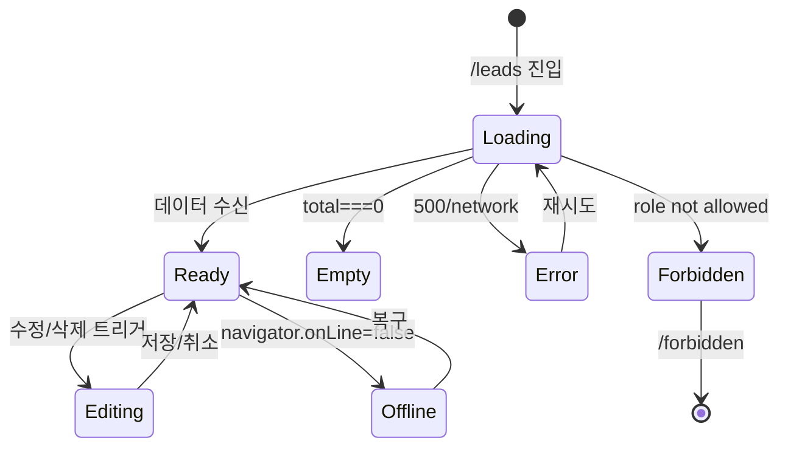

# SCR-070 리드 관리 — 기본화면 (마스터)

> 이 문서는 **화면 마스터 스펙**입니다. `01~06` 상태 문서는 이 문서를 상속(override/delta)합니다.
> 🚨 **FC 핵심 업무 화면**: FC/매니저/오너/센터장/슈퍼관리자 전부 CRUD 가능, 스태프/트레이너/프론트는 접근 불가.

---

## 0. 메타 & 원천 참조

| 항목 | 값 |
|------|----|
| 화면 ID | SCR-070 |
| 화면명 | 리드 관리 |
| 도메인 | D08-마케팅 |
| 경로 | `/leads` |
| Next.js Route Group | `(dashboard)` |
| 파일 경로 | `src/app/(dashboard)/leads/page.tsx` |
| 페이지 컴포넌트 | `LeadsPage` |
| 역할 | `superAdmin`, `primary`, `owner`, `manager`, `fc` (staff/trainer/front 접근 불가) |
| 우선순위 | P0 (프리-온보딩 핵심) |
| 플랫폼 | 데스크톱(우선) / 태블릿 / 모바일 |
| 멀티테넌트 | ✅ `branchId` 컨텍스트 강제 |

### 원천 문서 링크
| 문서 | 경로 | 섹션 |
|---|---|---|
| 화면설계서 | `docs/화면설계서/마케팅.md` | §SCR-070 리드 관리 |
| 기능명세서 | `docs/기능명세서/마케팅.md` | §1 리드 관리 (`/leads`) |
| 에러코드정의서 | `docs/에러코드정의서.md` | §공통 E401/E403/E500, §마케팅 E4xx950~ |
| 상태전이도 | `docs/상태전이도.md` | 리드 상태 전이(신규→상담예정→방문완료→등록완료) |
| KPI 정의서 | `docs/KPI_정의서.md` | §프리-온보딩 (DB 생성수, 상담 전환율, 등록 전환율, 리드 응대 시간) |
| 권한 매트릭스 | `docs/다이어그램/10_권한매트릭스/R1_역할화면_매트릭스.md` | `/leads` |
| 다이어그램 F1 진입 | `docs/다이어그램/D08_마케팅/SCR-070_리드관리/F1_진입.md` | 초기 로딩 플로우 |
| 다이어그램 F2 메인 | `docs/다이어그램/D08_마케팅/SCR-070_리드관리/F2_메인인터랙션.md` | 목록/칸반 전환 |
| 다이어그램 F3 버튼액션 | `docs/다이어그램/D08_마케팅/SCR-070_리드관리/F3_버튼액션.md` | +등록, 수정, 삭제 |
| 다이어그램 F4 필터 | `docs/다이어그램/D08_마케팅/SCR-070_리드관리/F4_필터검색.md` | 상태/유입경로/검색 |
| 다이어그램 F5 모달트리거 | `docs/다이어그램/D08_마케팅/SCR-070_리드관리/F5_모달트리거.md` | DLG-070-001/002 |
| 다이어그램 F6 상태별 | `docs/다이어그램/D08_마케팅/SCR-070_리드관리/F6_상태별화면.md` | 로딩/정상/빈/에러/오프라인/권한없음 |
| 다이어그램 F7 권한 | `docs/다이어그램/D08_마케팅/SCR-070_리드관리/F7_권한분기.md` | 역할별 CRUD |
| 다이어그램 F8 에러 | `docs/다이어그램/D08_마케팅/SCR-070_리드관리/F8_에러예외.md` | E500, NETWORK |
| 다이어그램 F9 피드백 | `docs/다이어그램/D08_마케팅/SCR-070_리드관리/F9_토스트피드백.md` | toast 7종 |

---

## 1. 화면 목적 (Why)

잠재 고객(문의/상담) **파이프라인**을 목록/칸반 두 관점으로 관리하여 **DB 응대 누락**을 0으로 만들고, **등록 전환율**(`방문완료 → 등록완료`) 60~70%를 달성한다.

- 프리-온보딩 단계의 **첫 접점**: FC가 리드를 등록하고 상태를 전진시켜 매출로 연결.
- 리드 응대 시간(24시간 이내) 및 리드 누락률(3% 이하) KPI 모니터링.
- `convertedMemberId` 채워지면 회원 상세(`/members/detail?id=...`)로 연결 가능.

---

## 2. 화면 레이아웃 (Wireframe)

### 2.1 풀뷰 와이어프레임 (데스크톱 1440px)

```
┌──────────────────────────────────────────────────────────────────────┐
│ AppLayout                                                             │
│ ┌──Sidebar──┐ ┌──Main Content────────────────────────────────────┐   │
│ │ 마케팅     │ │  PageHeader: "리드 관리"         [+ 리드 등록]    │   │
│ │ ▸ 리드관리 │ │  "잠재 고객(문의/상담) 파이프라인을 관리합니다."  │   │
│ │  메시지발송│ │ ┌──────────────────────────────────────────────┐ │   │
│ │  자동알림  │ │ │ §A StatCardGrid cols=5                      │ │   │
│ │  쿠폰관리  │ │ │ [전체128] [등록23] [전환18%] [대기45] [미22%]│ │   │
│ │  마일리지  │ │ └──────────────────────────────────────────────┘ │   │
│ │            │ │ §B 상태별 분포 (count>0 상태만 뱃지 그리드)     │   │
│ │            │ │ [신규 45(35%)] [상담예정 30(23%)] ...            │   │
│ │            │ │ ┌──────────────────────────────────────────────┐ │   │
│ │            │ │ │ §C Toolbar                                    │ │   │
│ │            │ │ │ [상태▼][유입경로▼][🔍검색]  [📋목록][🔲칸반] │ │   │
│ │            │ │ └──────────────────────────────────────────────┘ │   │
│ │            │ │ §D 목록 뷰 (DataTable) 또는 칸반 뷰 (5컬럼)      │   │
│ └────────────┘ └──────────────────────────────────────────────────┘   │
└──────────────────────────────────────────────────────────────────────┘
```

### 2.2 뷰 모드별 영역

#### D-1 목록 뷰 (`viewMode='list'`)
```
┌────────────────────────────────────────────────────────────────────┐
│ 문의일 │ 이름 │ 연락처 │ 유입경로 │ 상태 │ 담당FC │ 후속일 │ 메모 │[수정][삭제]│
│ 04-01  │ 홍길동│010-... │ [SNS] │ [신규]│ 김FC │ 04-03 │ ...  │ ✏️ 🗑 │
└────────────────────────────────────────────────────────────────────┘
```

#### D-2 칸반 뷰 (`viewMode='kanban'`)
```
┌ 신규 ┐ ┌ 상담예약 ┐ ┌ 상담완료 ┐ ┌ 등록의향 ┐ ┌ 등록완료 ┐
│ 45  │ │   30    │ │   18    │ │    8    │ │    23   │
├─────┤ ├─────────┤ ├─────────┤ ├─────────┤ ├─────────┤
│카드 │ │  카드   │ │  카드   │ │  카드   │ │  카드   │
│카드 │ │         │ │         │ │         │ │         │
└─────┘ └─────────┘ └─────────┘ └─────────┘ └─────────┘
 blue    amber      purple     orange      green
```

### 2.3 영역별 치수

| 영역 | 위치 | 치수 | 역할 |
|------|------|------|------|
| PageHeader | 최상단 | 72px h | 제목 + 우측 CTA |
| StatCardGrid | Header 아래 24px | `grid-cols-5 gap-4` | 통계 5장 |
| 상태 분포 배지 | KPI 아래 16px | auto | count>0 상태만 |
| Toolbar | 분포 아래 16px | 56px h | 필터 + 뷰 토글 |
| DataTable/Kanban | 본문 | auto, scroll | 메인 |

---

## 3. 디자인 토큰

### 3.1 색상

| 역할 | 클래스 | Hex | 용도 |
|---|---|---|---|
| bg.page | `bg-gray-50` | #F9FAFB | 전체 배경 |
| bg.card | `bg-white rounded-xl shadow-sm ring-1 ring-gray-100` | — | StatCard/Table 컨테이너 |
| stat.default | `bg-white` | #FFFFFF | 기본 카드 |
| stat.mint | `bg-emerald-50 text-emerald-700 ring-emerald-100` | — | 등록 전환 카드 |
| stat.peach | `bg-orange-50 text-orange-700 ring-orange-100` | — | 전환율 카드 |
| badge.신규 | `bg-blue-100 text-blue-700` | #DBEAFE | 신규 |
| badge.상담예정 | `bg-amber-100 text-amber-800` | #FEF3C7 | 상담예정 |
| badge.방문완료 | `bg-purple-100 text-purple-700` | #EDE9FE | 방문완료 |
| badge.연락완료 | `bg-orange-100 text-orange-700` | #FED7AA | 연락완료 |
| badge.등록완료 | `bg-emerald-100 text-emerald-800` | #D1FAE5 | 등록완료 |
| badge.미전환 | `bg-red-100 text-red-700` | #FEE2E2 | 미전환 |
| badge.보류 | `bg-slate-100 text-slate-700` | #F1F5F9 | 보류 |
| kanban.blue | `border-t-4 border-blue-500 bg-blue-50/40` | — | 신규 |
| kanban.amber | `border-t-4 border-amber-500 bg-amber-50/40` | — | 상담예약 |
| kanban.purple | `border-t-4 border-purple-500 bg-purple-50/40` | — | 상담완료 |
| kanban.orange | `border-t-4 border-orange-500 bg-orange-50/40` | — | 등록의향 |
| kanban.green | `border-t-4 border-emerald-500 bg-emerald-50/40` | — | 등록완료 |

### 3.2 타이포그래피

| 토큰 | 스타일 | 용도 |
|---|---|---|
| page.title | `text-2xl font-bold text-gray-900` | "리드 관리" |
| page.subtitle | `text-sm text-gray-500` | 부제 |
| stat.label | `text-xs uppercase tracking-wide text-gray-500` | 카드 라벨 |
| stat.value | `text-3xl font-bold tabular-nums text-gray-900` | 카드 값 |
| stat.unit | `text-base text-gray-500 ml-1` | 단위("건", "%") |
| table.header | `text-xs font-medium text-gray-500 uppercase` | 테이블 헤더 |
| table.cell | `text-sm text-gray-900` | 셀 |
| table.mono | `font-mono text-xs text-gray-700` | 날짜/연락처 |
| kanban.count | `text-lg font-semibold text-gray-900` | 컬럼 카운트 |

### 3.3 간격 / 반경 / 그림자

| 토큰 | 값 |
|---|---|
| card.radius | `rounded-xl` (12px) |
| card.padding | `p-5` |
| section.gap | `space-y-6` |
| page.padding | `p-6 lg:p-8` |
| toolbar.gap | `gap-2` |

### 3.4 모션

- 목록↔칸반 전환: `transition-opacity duration-200`
- 카드 진입: `animate-[fadeInUp_150ms_ease-out]`
- 토스트: shadcn `sonner` 기본

---

## 4. 반응형 규칙

| BP | 폭 | §A KPI | §D 본문 | Sidebar |
|---|---|---|---|---|
| Mobile <640 | 100% | 2열 | 카드 리스트(목록 대체), 칸반 가로 스크롤 | 드로어 |
| Tablet 640~1024 | 100% | 3열 | 목록 테이블 수평 스크롤 | 축약 |
| Desktop ≥1024 | sidebar+main | 5열 | 목록 전체 표시, 칸반 5컬럼 | 펼침 |
| XL ≥1440 | max-w-7xl | 5열 | 칸반 카드 2열 grid | 펼침 |

---

## 5. 🔐 역할별(RBAC) 매트릭스

> `●` = 표시+액션, `○` = 표시만(읽기), `—` = 미표시/차단
> 멀티테넌트: super/primary 지점 전환 가능, 그 외 본인 지점 고정

| 요소 | super/primary | owner | manager | fc | trainer | staff | front | readonly |
|---|:---:|:---:|:---:|:---:|:---:|:---:|:---:|:---:|
| **페이지 접근** | ● | ● | ● | ● | — | — | — | ○ |
| 지점 전환 드롭다운 | ● | ●(다지점시) | — | — | — | — | — | — |
| StatCardGrid | ● | ● | ● | ● | — | — | — | ○ |
| 상태별 분포 배지 | ● | ● | ● | ● | — | — | — | ○ |
| [+ 리드 등록] 버튼 | ● | ● | ● | ● | — | — | — | — |
| 뷰 전환(목록/칸반) | ● | ● | ● | ● | — | — | — | ○ |
| 상태/유입경로 필터 | ● | ● | ● | ● | — | — | — | ○ |
| 검색(이름/연락처/담당FC) | ● | ● | ● | ● | — | — | — | ○ |
| 행 [수정] | ● | ● | ● | ● | — | — | — | — |
| 행 [삭제] | ● | ● | — | — | — | — | — | — |
| DLG-070-001 등록/수정 | ● | ● | ●(등록/수정만) | ●(등록/수정만) | — | — | — | — |
| DLG-070-002 삭제 확인 | ● | ● | — | — | — | — | — | — |
| `convertedMemberId` → 회원상세 이동 | ● | ● | ● | ● | — | — | — | — |

### 5.1 역할 판별 코드

```ts
type Role = 'superAdmin'|'primary'|'owner'|'manager'|'fc'|'trainer'|'staff'|'front'|'readonly';
const canAccessLeads = (r: Role) => ['superAdmin','primary','owner','manager','fc','readonly'].includes(r);
const canCreateLead  = (r: Role) => ['superAdmin','primary','owner','manager','fc'].includes(r);
const canEditLead    = (r: Role) => ['superAdmin','primary','owner','manager','fc'].includes(r);
const canDeleteLead  = (r: Role) => ['superAdmin','primary','owner'].includes(r);
const isReadOnly     = (r: Role) => r === 'readonly';
```

접근 불가 역할(`trainer/staff/front`)은 `/forbidden` 리다이렉트 또는 사이드바 메뉴에서 제거.

---

## 6. 컴포넌트 트리

```
<AppLayout role={user.role}>
  <LeadsPage>
    <PageHeader title="리드 관리"
                subtitle="잠재 고객(문의/상담) 파이프라인을 관리합니다.">
      {canCreateLead(role) && (
        <Button variant="primary" onClick={openCreate}>
          <Plus className="size-4" /> 리드 등록
        </Button>
      )}
    </PageHeader>

    <StatCardGrid cols={5}>
      <StatCard label="전체 리드"   value={total}           unit="건" icon={<Users/>}        variant="default"/>
      <StatCard label="등록 전환"   value={converted}       unit="건" icon={<UserPlus/>}     variant="mint"/>
      <StatCard label="전환율"      value={conversionRate}  unit="%"  icon={<TrendingUp/>}   variant="peach"/>
      <StatCard label="대기 중"     value={pending}         unit="건" icon={<Phone/>}        variant="default"/>
      <StatCard label="미전환율"    value={missedRate}      unit="%"  icon={<AlertCircle/>}  variant="default"/>
    </StatCardGrid>

    {total > 0 && <StatusDistribution data={statusCounts} />}

    <LeadsToolbar
      filterStatus={filterStatus} setFilterStatus={setFilterStatus}
      filterSource={filterSource} setFilterSource={setFilterSource}
      searchValue={searchValue}  setSearchValue={setSearchValue}
      viewMode={viewMode}        setViewMode={setViewMode} />

    {viewMode === 'list'
      ? <LeadsTable    data={filtered} onEdit={openEdit} onDelete={openDelete} role={role}/>
      : <LeadsKanban   data={filtered} onEdit={openEdit} onDelete={openDelete} role={role}/>}

    <LeadFormDialog   open={formOpen}   onOpenChange={setFormOpen}   lead={editing}   onSubmit={save}/>
    <ConfirmDialog    open={confirmOpen} onOpenChange={setConfirmOpen}
                      variant="danger" confirmLabel="삭제" onConfirm={doDelete}
                      title="리드 삭제" description={`${target?.name}을(를) 삭제하시겠습니까?`}/>
  </LeadsPage>
</AppLayout>
```

### 6.1 핵심 컴포넌트

| 컴포넌트 | 파일 | 핵심 Props |
|---|---|---|
| `LeadsPage` | `src/app/(dashboard)/leads/page.tsx` | — (Route Component) |
| `StatCardGrid` | `src/components/common/StatCardGrid.tsx` | `{cols, children}` |
| `StatCard` | `src/components/common/StatCard.tsx` | `{label, value, unit, icon, variant}` |
| `StatusDistribution` | `src/components/leads/StatusDistribution.tsx` | `{data: Record<LeadStatus, number>}` |
| `LeadsToolbar` | `src/components/leads/LeadsToolbar.tsx` | 필터/검색/뷰 |
| `LeadsTable` | `src/components/leads/LeadsTable.tsx` | `{data, onEdit, onDelete, role}` |
| `LeadsKanban` | `src/components/leads/LeadsKanban.tsx` | `{data, onEdit, onDelete, role}` |
| `LeadFormDialog` | `src/components/leads/LeadFormDialog.tsx` | DLG-070-001 |
| `ConfirmDialog` | `src/components/ui/ConfirmDialog.tsx` | DLG-070-002 (공용) |

---

## 7. 데이터 계약

### 7.1 타입

```ts
// src/api/endpoints/leads.ts
export const LEAD_STATUSES = ['신규','연락완료','상담예정','방문완료','등록완료','미전환','보류'] as const;
export type LeadStatus = (typeof LEAD_STATUSES)[number];

export const LEAD_SOURCES = ['간판','인터넷','전단지','추천','SNS','카카오톡','전화문의','방문','기타'] as const;
export type LeadSource = (typeof LEAD_SOURCES)[number];

export interface Lead {
  id: number;
  branchId: number;
  name: string;
  phone?: string;
  source: LeadSource;
  status: LeadStatus;
  assignedFc?: string;
  memo?: string;
  inquiryDate: string;        // YYYY-MM-DD
  followUpDate?: string | null;
  convertedMemberId?: number | null;
  createdAt: string;          // ISO
}

export interface CreateLeadInput {
  name: string;
  phone?: string;
  source: LeadSource;
  status?: LeadStatus;
  assignedFc?: string;
  memo?: string;
  inquiryDate?: string;
  followUpDate?: string | null;
}

export interface LeadStats {
  total: number;
  converted: number;
  conversionRate: number;
  pending: number;
  missedRate: number;
  statusCounts: Record<LeadStatus, number>;
}
```

### 7.2 API 엔드포인트

| 함수 | 메서드 | 설명 |
|---|---|---|
| `getLeads(branchId)` | GET | `supabase.from('leads').select('*').eq('branch_id', branchId).order('created_at', {ascending:false})` |
| `createLead(branchId, input)` | INSERT | 서버에서 `branch_id`, `inquiry_date`(기본 오늘) 자동 설정 |
| `updateLead(id, patch)` | UPDATE | `status='등록완료'` 전환 시 `convertedMemberId` 연결 가능 |
| `deleteLead(id)` | DELETE | hard delete (이력 없음) |
| `getLeadStats(branchId)` | GET(집계) | `LeadStats` 반환 (클라이언트 계산 or RPC) |

### 7.3 상태 관리

- **Query**: React Query `useQuery(['leads', branchId], getLeads)`, `staleTime: 30_000`
- **Mutations**: create/update/delete 각각 `onSuccess`에서 `invalidateQueries(['leads'])` + toast
- **Local UI state**: `viewMode`, `filterStatus`, `filterSource`, `searchValue`, `formOpen`, `editing`, `confirmOpen`, `target`
- **branchId**: `useAuthStore(s => s.user?.branchId)` 또는 `?branch=` URL 우선

---

## 8. 비즈니스 룰

1. **통계 계산**
   - `conversionRate = total>0 ? round((converted/total)*100) : 0`
   - `missedRate    = total>0 ? round((미전환/total)*100) : 0`
   - `pending       = 신규 + 연락완료`
2. **상태별 분포**: `total === 0`이면 §B 섹션 완전히 숨김.
3. **칸반 컬럼**: 고정 5개(신규/상담예약/상담완료/등록의향/등록완료). `미전환/보류` 리드는 칸반에서 숨기거나 "기타"로 축약(옵션).
4. **등록완료 전환**: `status='등록완료'`로 바뀌면 해당 리드 행에 "회원 상세 이동" 링크 활성화(있는 경우).
5. **필터 AND 결합**: 상태 AND 유입경로 AND 검색어(이름/연락처/담당FC) 모두 일치해야 노출.
6. **검색 대소문자 무시** + 한글 초성 매칭 생략(Phase 2).
7. **멀티테넌트**: 서버 RLS로 `branch_id = auth.jwt.branch_id` 강제. super는 `branch_id` 명시만 가능.
8. **리드 응대 시간 KPI**: `createdAt → status='연락완료'` 또는 `방문완료` 전환 시각 기록(별도 테이블 또는 audit log).
9. **삭제 권한 분리**: manager/fc는 삭제 불가 → 삭제 아이콘 자체 비렌더.
10. **전환 방지 액션**: `status='등록완료'` 리드 수정 시 status 변경 금지(옵션, 비즈니스 합의 필요).

---

## 9. 상태 목록

| 파일 | 상태 코드 | 한글 | 트리거 |
|---|---|---|---|
| `01-로딩.md` | `leads-loading` | 로딩 | 진입 직후, `useQuery` pending |
| `02-정상-데이터있음.md` | `leads-ready` | 정상 | 1건 이상 리드 존재 |
| `03-빈상태.md` | `leads-empty` | 빈 상태 | `total === 0` |
| `04-에러-서버오류.md` | `leads-error` | 서버/API 에러 | 500/네트워크 오류 |
| `05-오프라인.md` | `leads-offline` | 오프라인 | `navigator.onLine === false` |
| `06-권한없음.md` | `leads-forbidden` | 권한 없음 | 역할 `trainer/staff/front` 접근 |

상태 전이: `docs/다이어그램/D08_마케팅/SCR-070_리드관리/F6_상태별화면.md`.

---

## 10. 에러 코드 매핑

| errorCode | HTTP | 사용자 메시지 | UI 대응 |
|---|---|---|---|
| E401000 | 401 | 로그인이 필요합니다 | 전역 인터셉터 → `/login` |
| E403001 | 403 | 접근 권한이 없습니다 | `06-권한없음` |
| E500001 | 500 | 서버 오류가 발생했습니다 | `04-에러-서버오류` + 재시도 |
| E500950 | 500 | 리드 조회 실패 | 테이블 영역 에러 카드 |
| NETWORK | — | 네트워크 연결을 확인해주세요 | `05-오프라인` 배너 |

---

## 11. 접근성 (WCAG 2.1 AA)

- `<main role="main" aria-labelledby="leads-title">`
- StatCard: `role="group" aria-labelledby`, 값 `aria-live="polite"`
- 테이블: `<table role="table">` + `<caption class="sr-only">리드 목록</caption>`
- 필터 드롭다운: `combobox` 패턴 또는 `<select>`; 모바일 `<select>` 권장
- 검색 인풋: `<label htmlFor="lead-search" class="sr-only">리드 검색</label>`
- 칸반: 각 컬럼 `role="group" aria-labelledby="kanban-col-{status}"`
- 액션 버튼: `aria-label="{name} 수정"` / `"{name} 삭제"`
- 포커스 링: `focus-visible:ring-2 ring-blue-500 ring-offset-2`
- `prefers-reduced-motion`: 카드 fadeIn 제거

---

## 12. 진입 / 이탈

### 진입
- 사이드바 "마케팅 > 리드 관리" 클릭
- 대시보드 SCR-090 §C "리드" 위젯 클릭(있는 경우)
- URL 직접 `/leads` 입력

### 이탈
| 액션 | 목적지 |
|---|---|
| 행의 `convertedMemberId` 링크 | `/members/detail?id={convertedMemberId}` |
| "담당 FC" 클릭(옵션) | `/staff/detail?name=...` |
| 사이드바 메뉴 | 역할별 경로 |
| 모달 닫기 | 같은 화면 유지 |

---

## 13. 다이어그램 통합 뷰



---

## 14. 🧩 바이브코딩 프롬프트 (마스터)

```
Next.js 15 App Router + TypeScript + Tailwind + Supabase + React Query + react-hook-form + zod 기반
'use client' 컴포넌트를 작성하라.

━━ 화면: SCR-070 리드 관리 (FC 핵심 업무, 멀티테넌트, 목록/칸반 2뷰) ━━
파일: src/app/(dashboard)/leads/page.tsx
보조:
- src/components/leads/{LeadsToolbar, LeadsTable, LeadsKanban, LeadFormDialog, StatusDistribution}.tsx
- src/components/common/{StatCardGrid, StatCard, ConfirmDialog}.tsx
- src/api/endpoints/leads.ts (getLeads/createLead/updateLead/deleteLead/getLeadStats)
- src/hooks/useLeads.ts (React Query 훅)
- src/lib/role-access.ts (canCreateLead/canDeleteLead 등)
- src/schemas/leads.ts (leadSchema)

━━ 권한 핵심 ━━
- 접근 가능: superAdmin, primary, owner, manager, fc, readonly(조회만)
- CRUD: superAdmin/primary/owner는 전체, manager/fc는 생성·수정까지, 삭제는 owner 이상
- trainer/staff/front: /forbidden 리다이렉트 (또는 사이드바 메뉴 제거)
- 서버 RLS로 branch_id 강제

━━ 레이아웃 ━━
<main className="min-h-screen bg-gray-50">
  <AppLayout role={user.role}>
    <div className="p-6 lg:p-8 space-y-6">
      <header className="flex items-center justify-between">
        <div>
          <h1 id="leads-title" className="text-2xl font-bold text-gray-900">리드 관리</h1>
          <p className="text-sm text-gray-500">잠재 고객(문의/상담) 파이프라인을 관리합니다.</p>
        </div>
        {canCreateLead(role) && (
          <Button variant="primary" onClick={openCreate}>
            <Plus className="size-4 mr-1" /> 리드 등록
          </Button>
        )}
      </header>

      <StatCardGrid cols={5}>
        <StatCard label="전체 리드"  value={stats.total}          unit="건" icon={<Users/>}      variant="default"/>
        <StatCard label="등록 전환"  value={stats.converted}      unit="건" icon={<UserPlus/>}   variant="mint"/>
        <StatCard label="전환율"    value={stats.conversionRate} unit="%"  icon={<TrendingUp/>} variant="peach"/>
        <StatCard label="대기 중"   value={stats.pending}        unit="건" icon={<Phone/>}      variant="default"/>
        <StatCard label="미전환율"  value={stats.missedRate}     unit="%"  icon={<AlertCircle/>} variant="default"/>
      </StatCardGrid>

      {stats.total > 0 && <StatusDistribution data={stats.statusCounts}/>}

      <LeadsToolbar
        filterStatus={filterStatus} setFilterStatus={setFilterStatus}
        filterSource={filterSource} setFilterSource={setFilterSource}
        searchValue={searchValue}   setSearchValue={setSearchValue}
        viewMode={viewMode}         setViewMode={setViewMode}/>

      {viewMode === 'list'
        ? <LeadsTable  data={filtered} role={role} onEdit={openEdit} onDelete={openDelete}/>
        : <LeadsKanban data={filtered} role={role} onEdit={openEdit} onDelete={openDelete}/>}

      <LeadFormDialog open={formOpen} onOpenChange={setFormOpen}
                      lead={editing} onSubmit={save}/>
      <ConfirmDialog  open={confirmOpen} onOpenChange={setConfirmOpen}
                      variant="danger" confirmLabel="삭제"
                      title="리드 삭제" description={`${target?.name}을(를) 삭제하시겠습니까?`}
                      onConfirm={doDelete}/>
    </div>
  </AppLayout>
</main>

━━ 디자인 토큰 ━━
bg.page:      bg-gray-50
card:         bg-white rounded-xl shadow-sm ring-1 ring-gray-100 p-5
stat.mint:    bg-emerald-50 text-emerald-700 ring-emerald-100
stat.peach:   bg-orange-50 text-orange-700 ring-orange-100
badge.신규:   bg-blue-100 text-blue-700 text-xs px-2 py-0.5 rounded-full
badge.등록완료: bg-emerald-100 text-emerald-800 ...
badge.미전환: bg-red-100 text-red-700 ...
kanban.col:   border-t-4 {color} bg-{color}-50/40 rounded-xl p-3
table.mono:   font-mono text-xs text-gray-700

━━ 데이터 훅 ━━
useLeads(branchId) → { leads, stats, isLoading, error, refetch,
                       createMutation, updateMutation, deleteMutation }
- React Query, staleTime 30_000, refetchOnWindowFocus true
- stats는 클라이언트에서 useMemo로 leads에서 계산

━━ 필터링 (useMemo) ━━
const filtered = useMemo(() => leads.filter(l =>
  (filterStatus === 'all' || l.status === filterStatus) &&
  (filterSource === 'all' || l.source === filterSource) &&
  (!searchValue || [l.name, l.phone ?? '', l.assignedFc ?? ''].some(s => s.toLowerCase().includes(searchValue.toLowerCase())))
), [leads, filterStatus, filterSource, searchValue]);

━━ 인터랙션 ━━
- [+ 리드 등록] → openCreate() → LeadFormDialog(editing=null)
- 행 [수정 ✏] → openEdit(lead)
- 행 [삭제 🗑] → openDelete(lead) → ConfirmDialog → doDelete()
- [목록]/[칸반] 토글 → viewMode 변경
- 필터/검색 변경 → useMemo 재계산
- `convertedMemberId` 존재 시 행에서 "회원 상세" 링크 노출 → moveToPage('/members/detail', {id})

━━ 토스트 (sonner) ━━
- 등록 성공: toast.success("리드가 등록되었습니다.")
- 수정 성공: toast.success("리드가 수정되었습니다.")
- 삭제 성공: toast.success("삭제되었습니다.")
- 이름 미입력: toast.error("이름을 입력하세요.")
- API 500: toast.error("서버 오류가 발생했습니다.")
- 권한 없음: toast.error("접근 권한이 없습니다.")

━━ 접근성 ━━
- main role="main" aria-labelledby="leads-title"
- StatCard role="group" aria-labelledby
- table role="table" + caption sr-only
- 액션 버튼 aria-label 필수
- 칸반 컬럼 role="group" aria-labelledby

━━ 반응형 ━━
- Mobile: KPI 2열, 목록→카드 리스트 전환, 칸반 가로 스크롤
- Tablet: KPI 3열, 테이블 가로 스크롤
- Desktop+: KPI 5열, 테이블 전체, 칸반 5컬럼

━━ 에러/빈/권한 상태 분기 ━━
if (!canAccessLeads(role)) return <ForbiddenView/>;   // 06
if (isLoading) return <LoadingSkeleton/>;            // 01
if (error)   return <ErrorCard onRetry={refetch}/>;  // 04
if (!leads.length) return <EmptyState onCreate={openCreate}/>; // 03
if (!navigator.onLine) return <OfflineBanner/>;      // 05

━━ QA 체크 ━━
- FC가 + 리드 등록 → 리스트 반영 + toast
- manager가 삭제 아이콘 비렌더 확인
- 검색 "홍" → "홍길동" 매치
- 상태 필터 "신규" → 신규만 노출
- 칸반 전환 시 각 컬럼 count 정확
- total=0 시 상태 분포 섹션 숨김
```

---

## 15. QA 체크리스트 (수용 기준)

- [ ] FC/매니저/오너/슈퍼관리자 진입 시 정상 렌더
- [ ] trainer/staff/front 진입 시 403 → `/forbidden`
- [ ] StatCard 5장 계산식 일치 (`conversionRate = round(converted/total*100)`)
- [ ] total=0 시 상태별 분포 섹션 완전 숨김
- [ ] [+ 리드 등록]은 `canCreateLead(role)`에만 노출
- [ ] 행 [삭제]는 `canDeleteLead(role)`에만 노출
- [ ] 목록 ↔ 칸반 전환 동작
- [ ] 칸반 5컬럼 색상 일치 (blue/amber/purple/orange/green)
- [ ] 필터 AND 결합 동작
- [ ] 검색: 이름/연락처/담당FC 모두 매칭
- [ ] 등록 성공 toast, 이름 미입력 시 error toast
- [ ] 수정/삭제 성공 toast
- [ ] API 500 시 에러 카드 + 재시도
- [ ] 오프라인 시 배너 노출
- [ ] 키보드만으로 CRUD 가능 (Tab/Enter)
- [ ] 스크린리더: 카드 값 갱신 시 `aria-live` 공지
- [ ] `prefers-reduced-motion` 준수
- [ ] 멀티테넌트 데이터 누수 없음 (RLS 검증)
