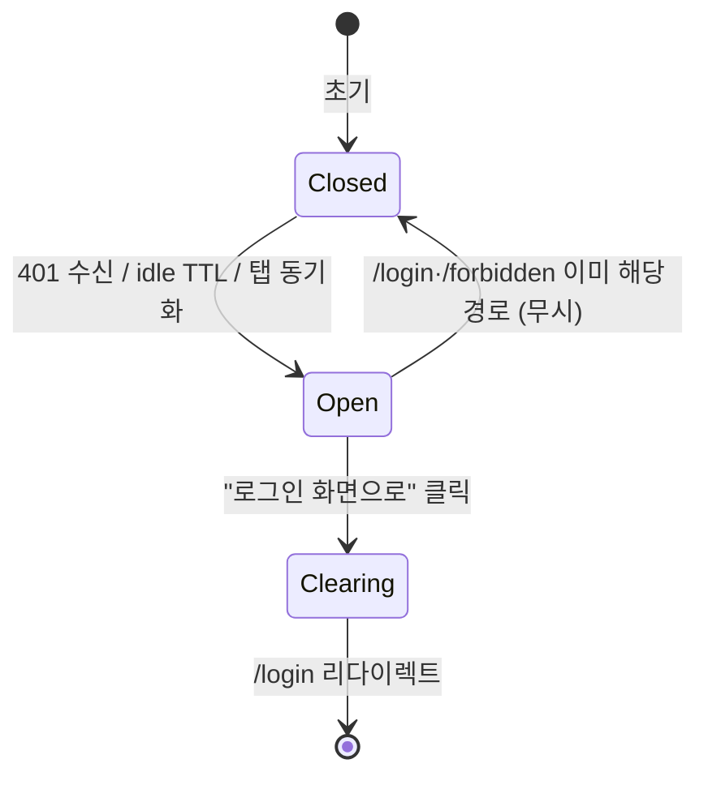

# DLG-000 세션만료 — 기본화면 (마스터)

> 이 문서는 **다이얼로그 마스터 스펙**입니다. `01~02` 상태 문서는 이 문서를 상속(override/delta)합니다.
> 🚨 **글로벌 다이얼로그**: 어떤 화면이든 401 토큰 만료/세션 TTL 도달 시 **자동 오픈**되는 시스템 수준 다이얼로그.
> 부모 화면은 `현재 활성 라우트 전체` (SCR-100 로그인·SCR-108 에러페이지 제외).

---

## 0. 메타 & 원천 참조

| 항목 | 값 |
|------|----|
| 다이얼로그 ID | DLG-000 |
| 다이얼로그명 | 세션만료 |
| 도메인 | D01-공통 (글로벌) |
| 부모 화면 | 현재 활성 라우트 전체 (auth 제외) |
| 트리거 조건 | API 401 (E401002 토큰 만료) 또는 클라이언트 TTL 경과 또는 탭 비활성 60분 |
| 확인 레벨 | L1 (정보성 + 강제 이동) |
| 서버 호출 여부 | ✅ 로그아웃/세션 클리어 호출 (`POST /auth/logout`, best-effort) |
| 닫기 옵션 | ❌ ESC/배경/X 모두 불가 (강제 모달) |
| 역할 | all (로그인 경험한 모든 역할) |
| 파일 경로 | `src/components/dialogs/SessionExpiredDialog.tsx` |
| 우선순위 | P0 (보안/UX 필수) |

### 원천 문서 링크
| 문서 | 경로 | 섹션 |
|---|---|---|
| 공통 화면설계서 | `docs/화면설계서/공통.md` | §4 공통 다이얼로그, §7 접근성, §16 감사 로그(LOGOUT) |
| 에러코드정의서 | `docs/에러코드정의서.md` | §공통 E401002 (토큰 만료), E401003 (토큰 무효) |
| 상태전이도 | `docs/상태전이도.md` | §세션 상태 |
| 다이어그램 M1 생명주기 | `docs/다이어그램/D01_공통/DLG/DLG-000_세션만료/M1_생명주기.md` | — |
| 다이어그램 M2 필드검증 | `docs/다이어그램/D01_공통/DLG/DLG-000_세션만료/M2_필드검증.md` | — |
| 다이어그램 M3 결과분기 | `docs/다이어그램/D01_공통/DLG/DLG-000_세션만료/M3_결과분기.md` | — |
| 권한 매트릭스 | `docs/다이어그램/10_권한매트릭스/R1_역할화면_매트릭스.md` | 전 역할 공통 |
| SCR-100 마스터 | `docs/화면설계서/D01-공통/SCR-100-로그인/00-기본화면.md` | §12 진입 (`/login?redirect=...`) |

---

## 1. 다이얼로그 목적 (Why)

장시간 미사용이거나 토큰이 서버에서 무효화된 사용자를 **안전하게 재인증 화면으로 유도**하기 위한 강제 안내 모달.
- 사용자 작업 중 돌발적인 401이 발생하면 UX 붕괴 없이 상황을 설명한다.
- 로컬 상태/세션 저장소를 정리하여 다음 세션에서의 데이터 오염을 방지한다.
- `redirect` 쿼리를 통해 로그인 후 작업 지점을 복원한다.

---

## 2. 화면 레이아웃 (Wireframe)

```
  배경: 페이지 어둡게(dim) + blur (pointer-events:none 하위)
  ┌──────────────────────────────────────────────┐
  │  ▓▓▓▓▓▓▓▓▓▓  backdrop bg-black/50           │
  │  ┌────────────────────────────────┐          │
  │  │  🔒  세션이 만료되었습니다       │          │ ← Header (icon + title)
  │  │                                │          │
  │  │  보안을 위해 30분 이상 활동이     │          │ ← body text
  │  │  없어 자동 로그아웃되었습니다.    │          │
  │  │                                │          │
  │  │  다시 로그인해 주세요.            │          │
  │  │                                │          │
  │  │  ─────────────────────────     │          │
  │  │              [  로그인 화면으로 ]│          │ ← Primary only (단일 CTA)
  │  └────────────────────────────────┘          │
  └──────────────────────────────────────────────┘
```

### 영역 치수표

| 영역 | 위치 | 치수 | 역할 |
|---|---|---|---|
| Backdrop | 전역 | `fixed inset-0` | 배경 차단 (`bg-black/50 backdrop-blur-sm`) |
| Modal | 화면 중앙 | `max-w-md w-full` | 다이얼로그 카드 |
| Header | 상단 | 48px h | 아이콘 + 타이틀 |
| Body | 가운데 | auto × ~80px | 본문 메시지 (2~3줄) |
| Footer | 하단 | 56px h | 단일 Primary 버튼 |

---

## 3. 디자인 토큰

### 3.1 색상

| 토큰 | 클래스 | 용도 |
|---|---|---|
| backdrop | `fixed inset-0 bg-black/50 backdrop-blur-sm z-50` | 배경 |
| modal.card | `bg-white rounded-2xl shadow-2xl ring-1 ring-gray-100` | 카드 |
| modal.header.fg | `text-gray-900` | 타이틀 |
| modal.body.fg | `text-gray-600` | 본문 |
| icon.lock | `text-amber-500` | 잠금 아이콘 (`size-6`) |
| btn.primary | `bg-blue-600 hover:bg-blue-700 text-white` | 단일 CTA |

### 3.2 타이포

| 토큰 | 값 |
|---|---|
| title | `text-lg font-semibold tracking-tight` |
| body | `text-sm leading-relaxed` |
| button | `text-sm font-medium` |

### 3.3 간격/반경

| 토큰 | 값 |
|---|---|
| modal.radius | `rounded-2xl` (16px) |
| modal.padding | `p-6` (24px) |
| body.gap | `space-y-3` |

### 3.4 모션

| 토큰 | 값 |
|---|---|
| backdrop.enter | `animate-[fadeIn_120ms_ease-out]` |
| modal.enter | `animate-[fadeInUp_160ms_ease-out]` |
| motion.reduced | `prefers-reduced-motion:reduce` → 애니메이션 제거 |

---

## 4. 반응형 규칙

| BP | 폭 | 모달 | 비고 |
|---|---|---|---|
| Mobile <640 | 100% | `max-w-sm w-[calc(100%-32px)]` | 상하 여백 16px |
| Tablet 640~1024 | center | `max-w-md` | |
| Desktop ≥1024 | center | `max-w-md` | z-index 50 |
| Landscape <500h | | `my-4` 스크롤 허용 | |

---

## 5. 🔐 역할별(RBAC) 매트릭스

> 모든 역할이 공통으로 겪는 시스템 이벤트. 역할별 차등 없음.

| 요소 | superAdmin | primary | owner | manager | fc | trainer | staff | front |
|---|:---:|:---:|:---:|:---:|:---:|:---:|:---:|:---:|
| 다이얼로그 오픈(자동) | ● | ● | ● | ● | ● | ● | ● | ● |
| "로그인 화면으로" 버튼 | ● | ● | ● | ● | ● | ● | ● | ● |
| ESC/배경 클릭 닫기 | — | — | — | — | — | — | — | — |
| X 버튼 | — | — | — | — | — | — | — | — |
| 서버 로그아웃 호출 | ● | ● | ● | ● | ● | ● | ● | ● |
| redirect 쿼리 복원 | ● | ● | ● | ● | ● | ● | ● | ● |

### 5.1 멀티테넌트

- `branchId` 컨텍스트는 **전체 클리어** 대상(localStorage/useBranchStore 모두 초기화).
- super/primary도 예외 없음. 지점 전환 상태도 함께 리셋.
- redirect 대상 경로가 현재 사용자 role에서 접근 불가면, 로그인 후 역할별 기본 대시보드로 자동 대체.

---

## 6. 컴포넌트 트리

```tsx
<Portal>
  <div role="dialog" aria-modal="true" aria-labelledby="session-expired-title"
       className="fixed inset-0 z-50 flex items-center justify-center
                  bg-black/50 backdrop-blur-sm px-4">
    <div className="w-full max-w-md bg-white rounded-2xl shadow-2xl
                    ring-1 ring-gray-100 p-6 space-y-4 animate-[fadeInUp_160ms]">
      <header className="flex items-center gap-3">
        <div className="flex size-10 items-center justify-center rounded-full bg-amber-50">
          <Lock className="size-5 text-amber-500" aria-hidden="true" />
        </div>
        <h2 id="session-expired-title" className="text-lg font-semibold text-gray-900">
          세션이 만료되었습니다
        </h2>
      </header>
      <div className="text-sm text-gray-600 space-y-2" id="session-expired-desc">
        <p>보안을 위해 일정 시간 이상 활동이 없어 자동 로그아웃되었습니다.</p>
        <p>다시 로그인해 주세요.</p>
      </div>
      <div className="pt-2 flex justify-end">
        <button onClick={handleGoLogin} autoFocus
          className="h-11 px-5 rounded-lg bg-blue-600 hover:bg-blue-700
                     text-white text-sm font-medium
                     focus:outline-none focus:ring-2 focus:ring-offset-2 focus:ring-blue-500">
          로그인 화면으로
        </button>
      </div>
    </div>
  </div>
</Portal>
```

### 컴포넌트 명세

| 컴포넌트 | Props | 재사용 여부 |
|---|---|---|
| `SessionExpiredDialog` | `{ isOpen, redirectPath? }` | 전역 (`<RootProviders>` 수준) |
| `Portal` | children | 전역 공용 |
| `Button` | `{variant:'primary', size:'lg'}` | 전역 공용 |

---

## 7. 데이터 계약

### 7.1 전역 상태

```ts
// src/stores/sessionStore.ts
interface SessionState {
  isExpiredDialogOpen: boolean;
  triggerReason: 'E401002' | 'E401003' | 'idle-timeout' | 'manual';
  redirectPath: string | null;   // 만료 순간의 pathname+search
  openExpired: (reason, redirectPath?) => void;
  closeExpired: () => void;       // 내부에서만 사용, 사용자는 호출 불가
}
```

### 7.2 트리거 소스

| 소스 | 구현 |
|---|---|
| API 인터셉터 | axios/fetch wrapper에서 401 + errorCode ∈ {E401002, E401003} 수신 시 `openExpired()` |
| 클라이언트 TTL | `setTimeout` 세션 TTL=30분(또는 서버 claim `exp` 사용), 경과 시 dispatch |
| 다중 탭 동기화 | `storage` 이벤트: 다른 탭에서 로그아웃 발생 시 `logout_broadcast` 감지 → 오픈 |
| 탭 비활성 | `visibilitychange` + `Date.now() - lastActiveTs > 60분` |

### 7.3 서버 호출

| 엔드포인트 | 호출 시점 | 실패 시 |
|---|---|---|
| `POST /auth/logout` | "로그인 화면으로" 클릭 직후 | best-effort, 실패해도 클라이언트 클리어는 진행 |

---

## 8. 비즈니스 룰

1. **다중 오픈 방지**: `isExpiredDialogOpen === true`면 추가 오픈 호출 무시.
2. **401 폭주 가드**: 같은 요청 사이클 내 다수 401 수신 시 1회만 오픈(디바운스 200ms).
3. **강제 모달**: ESC/배경/X 로 닫히지 않음. 사용자 선택지는 "로그인 화면으로" 단일.
4. **상태 정리 순서**:
   1) 열려 있는 다른 모달/토스트 강제 닫기
   2) `POST /auth/logout` (best-effort)
   3) `useAuthStore.clear()` / `useBranchStore.clear()` / localStorage 민감값 제거
   4) `router.replace('/login?redirect=<원래 경로>')`
5. **redirect 복원**: `window.location.pathname + search` 를 쿼리에 URL-encode 하여 전달.
6. **로그인 페이지/에러 페이지 예외**: `/login`, `/reset-password`, `/forbidden`, `/not-found` 에 있으면 다이얼로그 오픈 생략 + 조용히 세션 정리.
7. **감사로그**: 자동 로그아웃은 클라이언트 `AUDIT.SESSION_EXPIRED` 로컬 이벤트 → 다음 로그인 성공 시 서버로 배치 전송(선택).
8. **포커스 트랩**: 열리자마자 Primary 버튼에 포커스. Tab 순환은 해당 버튼 1개만.
9. **reduced-motion**: 모션 설정 비활성 시 애니메이션 생략.
10. **i18n**: ko-KR 고정(현재). en-US 예정.

---

## 9. 상태 목록

| 파일 | 상태 코드 | 한글 | 트리거 |
|---|---|---|---|
| `01-열림.md` | `session-expired-open` | 열림 | 자동 오픈 직후, 사용자 버튼 클릭 전 |
| `02-클리어후이동.md` | `session-expired-clearing` | 클리어 후 이동 | 버튼 클릭 → logout API → clear → redirect |

상태 전이: `01-열림` → (버튼 클릭) → `02-클리어후이동` → (언마운트) → `/login`

---

## 10. 에러 코드 매핑

| errorCode | 시나리오 | 표시 |
|---|---|---|
| E401002 | 토큰 만료 | 본문 "세션이 만료되었습니다" |
| E401003 | 토큰 무효/위변조 | 본문 "로그인 정보가 유효하지 않습니다" (동일 UI, 카피만 스위칭 가능) |
| idle-timeout | 클라이언트 측 유휴 | 본문 "일정 시간 동안 활동이 없어…" |
| `POST /auth/logout` 실패 | 네트워크/서버 오류 | 조용히 무시, 클라이언트 클리어는 진행 |

---

## 11. 접근성 (WCAG 2.1 AA)

| 항목 | 요구사항 |
|---|---|
| role/aria | `role="dialog"` + `aria-modal="true"` + `aria-labelledby` + `aria-describedby` |
| 포커스 트랩 | 열림 시 Primary 버튼 오토포커스, Tab 순환 이 버튼 1개 |
| 키보드 | `Enter` = 버튼 클릭. `ESC` 비활성(강제 모달). |
| 대비 | 본문 4.5:1 이상. 버튼 4.5:1 이상. |
| 스크린리더 | 열림 시점에 `aria-live` 별도 공지 불필요(role=dialog 자체로 공지) |
| 모션 감소 | `prefers-reduced-motion:reduce` 시 enter 애니 제거 |
| 포커스 가시 | `focus-visible:ring-2 ring-offset-2 ring-blue-500` |

---

## 12. 진입 / 이탈 연결

### 진입 (자동 오픈)

- API 401 수신 (`E401002`, `E401003`) — 모든 인증 API 공통 인터셉터
- 클라이언트 idle TTL 경과
- 멀티탭 `storage` 이벤트로 다른 탭 로그아웃 감지
- `visibilitychange` + idle 감지

### 이탈 (다이얼로그 → 다음 목적지)

| 액션 | 목적지 |
|---|---|
| "로그인 화면으로" 클릭 | `POST /auth/logout` → clear → `router.replace('/login?redirect=<원경로>')` |
| 다중 탭에서 이미 /login 인 경우 | 조용히 닫힘 + redirect 없음 |

---

## 13. 다이어그램 통합 뷰



참조: `docs/다이어그램/D01_공통/DLG/DLG-000_세션만료/M1_생명주기.md` / `M3_결과분기.md`

---

## 14. 🧩 바이브코딩 프롬프트 (마스터)

```
Next.js 15 App Router + TypeScript + Tailwind + Zustand + Supabase 기반
'use client' 글로벌 다이얼로그 컴포넌트를 작성하라.

━━ 다이얼로그: DLG-000 세션만료 ━━
파일:
  src/components/dialogs/SessionExpiredDialog.tsx
  src/stores/sessionStore.ts
  src/lib/auth-interceptor.ts  (fetch/axios wrapper에 401 후킹)
  src/app/providers.tsx       (RootProviders에 <SessionExpiredDialog /> 마운트)

━━ Store ━━
import { create } from 'zustand';

type Reason = 'E401002' | 'E401003' | 'idle-timeout' | 'manual';
export const useSessionStore = create<{
  open: boolean;
  reason: Reason | null;
  redirectPath: string | null;
  openExpired: (r: Reason, path?: string) => void;
  close: () => void;
}>((set, get) => ({
  open: false,
  reason: null,
  redirectPath: null,
  openExpired: (reason, path) => {
    if (get().open) return;                // 중복 오픈 가드
    const here = typeof window !== 'undefined'
      ? window.location.pathname + window.location.search
      : null;
    if (typeof window !== 'undefined' &&
        ['/login','/reset-password','/forbidden','/not-found']
          .some(p => window.location.pathname.startsWith(p))) return;
    set({ open: true, reason, redirectPath: path ?? here });
  },
  close: () => set({ open: false, reason: null, redirectPath: null }),
}));

━━ 인터셉터 (401 → store.openExpired) ━━
// src/lib/auth-interceptor.ts
import { useSessionStore } from '@/stores/sessionStore';

export async function fetchWithAuth(input: RequestInfo, init?: RequestInit) {
  const res = await fetch(input, {
    ...init,
    credentials: 'include',
    headers: { 'Content-Type': 'application/json', ...(init?.headers ?? {}) },
  });
  if (res.status === 401) {
    const body = await res.clone().json().catch(() => ({}));
    const code = body?.errorCode === 'E401003' ? 'E401003' : 'E401002';
    useSessionStore.getState().openExpired(code);
  }
  return res;
}

━━ 레이아웃 ━━
import { createPortal } from 'react-dom';
import { Lock } from 'lucide-react';
import { useEffect, useRef } from 'react';
import { useSessionStore } from '@/stores/sessionStore';
import { useAuthStore } from '@/stores/authStore';
import { useBranchStore } from '@/stores/branchStore';
import { supabase } from '@/lib/supabase';
import { useRouter } from 'next/navigation';

export default function SessionExpiredDialog() {
  const { open, reason, redirectPath, close } = useSessionStore();
  const router = useRouter();
  const btnRef = useRef<HTMLButtonElement>(null);

  useEffect(() => { if (open) btnRef.current?.focus(); }, [open]);

  useEffect(() => {
    if (!open) return;
    const onKey = (e: KeyboardEvent) => {
      if (e.key === 'Escape' || e.key === 'Tab') e.preventDefault(); // 강제 모달
    };
    window.addEventListener('keydown', onKey);
    document.body.style.overflow = 'hidden';
    return () => {
      window.removeEventListener('keydown', onKey);
      document.body.style.overflow = '';
    };
  }, [open]);

  if (!open || typeof document === 'undefined') return null;

  const handleGoLogin = async () => {
    try { await supabase.auth.signOut(); } catch {}
    useAuthStore.getState().clear();
    useBranchStore.getState().clear();
    ['authToken','refreshToken','branchId'].forEach(k => localStorage.removeItem(k));
    close();
    const redirect = redirectPath ? `?redirect=${encodeURIComponent(redirectPath)}` : '';
    router.replace(`/login${redirect}`);
  };

  const title = '세션이 만료되었습니다';
  const body =
    reason === 'E401003'
      ? '로그인 정보가 유효하지 않습니다. 다시 로그인해 주세요.'
      : reason === 'idle-timeout'
        ? '일정 시간 동안 활동이 없어 자동 로그아웃되었습니다.'
        : '보안을 위해 일정 시간 이상 활동이 없어 자동 로그아웃되었습니다.';

  return createPortal(
    <div role="dialog" aria-modal="true" aria-labelledby="sxp-title" aria-describedby="sxp-desc"
         className="fixed inset-0 z-50 flex items-center justify-center
                    bg-black/50 backdrop-blur-sm px-4 motion-reduce:animate-none
                    animate-[fadeIn_120ms_ease-out]">
      <div className="w-full max-w-md bg-white rounded-2xl shadow-2xl
                      ring-1 ring-gray-100 p-6 space-y-4
                      motion-reduce:animate-none animate-[fadeInUp_160ms_ease-out]">
        <header className="flex items-center gap-3">
          <div className="flex size-10 items-center justify-center rounded-full bg-amber-50">
            <Lock className="size-5 text-amber-500" aria-hidden />
          </div>
          <h2 id="sxp-title" className="text-lg font-semibold text-gray-900">{title}</h2>
        </header>
        <p id="sxp-desc" className="text-sm text-gray-600 leading-relaxed">{body} 다시 로그인해 주세요.</p>
        <div className="pt-2 flex justify-end">
          <button ref={btnRef} onClick={handleGoLogin}
            className="h-11 px-5 rounded-lg bg-blue-600 hover:bg-blue-700
                       text-white text-sm font-medium
                       focus:outline-none focus:ring-2 focus:ring-offset-2 focus:ring-blue-500">
            로그인 화면으로
          </button>
        </div>
      </div>
    </div>,
    document.body
  );
}

━━ providers에 마운트 ━━
// app/providers.tsx
<RootProviders>
  {children}
  <SessionExpiredDialog />
</RootProviders>

━━ 디자인 토큰 (정확히) ━━
backdrop: fixed inset-0 z-50 bg-black/50 backdrop-blur-sm
card:     bg-white rounded-2xl shadow-2xl ring-1 ring-gray-100 p-6
icon.wrap:rounded-full bg-amber-50 size-10
icon:     text-amber-500
title:    text-lg font-semibold text-gray-900
body:     text-sm text-gray-600 leading-relaxed
button:   h-11 px-5 rounded-lg bg-blue-600 hover:bg-blue-700 text-white text-sm font-medium
focus:    focus:outline-none focus:ring-2 focus:ring-offset-2 focus:ring-blue-500

━━ 멀티탭 동기화 (선택, 고급) ━━
useEffect(() => {
  const onStorage = (e: StorageEvent) => {
    if (e.key === 'logout_broadcast') {
      useSessionStore.getState().openExpired('manual');
    }
  };
  window.addEventListener('storage', onStorage);
  return () => window.removeEventListener('storage', onStorage);
}, []);

━━ QA 체크 ━━
- 401 수신 시 한 번만 오픈(중복 금지)
- /login 경로에서는 오픈되지 않음
- ESC/배경 클릭으로 닫히지 않음
- 버튼 클릭 → logout → clear → /login?redirect=... 이동
- 포커스 트랩 + Tab 순환 작동
- reduced-motion 시 애니메이션 생략
- 키보드만으로 로그인 페이지로 이동 가능
```

---

## 15. QA 체크리스트 (수용 기준)

- [ ] 401(E401002) 인터셉트 → 다이얼로그 자동 오픈
- [ ] 401(E401003) 인터셉트 → 문구 스위치 + 다이얼로그 오픈
- [ ] 클라이언트 idle TTL(30분) 경과 시 오픈
- [ ] 다중 401 폭주 시 1회만 오픈
- [ ] `/login`, `/reset-password`, `/forbidden`, `/not-found` 경로에서는 오픈되지 않음
- [ ] ESC, 배경 클릭, X 버튼으로 닫히지 않음
- [ ] "로그인 화면으로" 클릭 → supabase signOut → 스토어 clear → localStorage 정리 → `/login?redirect=<경로>` 이동
- [ ] 리다이렉트 쿼리 복원 동작
- [ ] 멀티탭 storage 이벤트 동기화 작동(선택)
- [ ] 포커스 자동 이동 + Tab 트랩
- [ ] role=dialog, aria-modal, aria-labelledby, aria-describedby 적용
- [ ] prefers-reduced-motion 준수
- [ ] 모바일 360px에서도 모달 가독성 유지
- [ ] 다른 모달/토스트가 열려 있어도 이 다이얼로그가 최상위(z-index 50)
