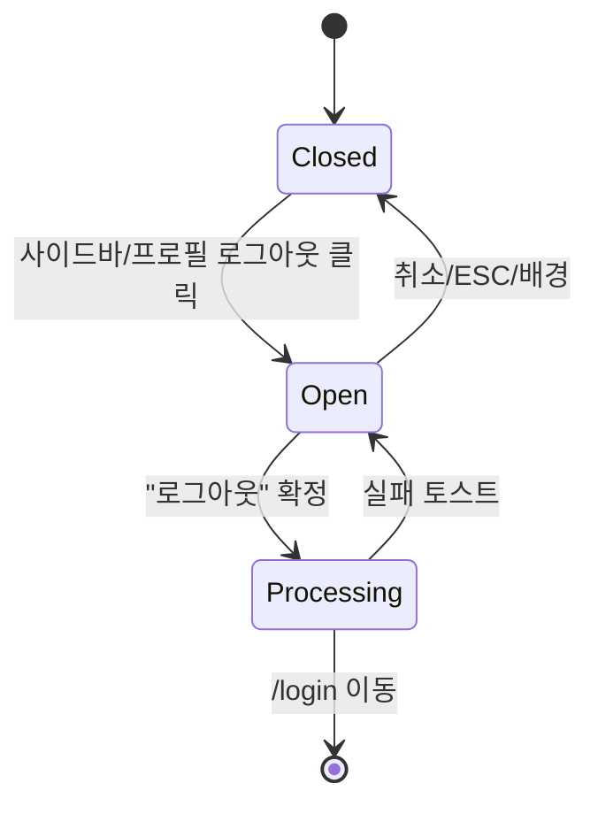

# DLG-001 로그아웃 확인 — 기본화면 (마스터)

> 이 문서는 **다이얼로그 마스터 스펙**입니다. `01~02` 상태 문서는 이 문서를 상속(override/delta)합니다.
> 사용자 **명시적 의도**(사이드바/프로필 메뉴)로 로그아웃할 때 한 번 더 확인을 받는 가벼운 확인 모달.
> DLG-000 세션만료(강제)와 다르게 사용자가 닫을 수 있음 (취소 허용).

---

## 0. 메타 & 원천 참조

| 항목 | 값 |
|------|----|
| 다이얼로그 ID | DLG-001 |
| 다이얼로그명 | 로그아웃 확인 |
| 도메인 | D01-공통 |
| 부모 화면 | 전 화면 (사이드바 푸터, `/profile` 메뉴) |
| 트리거 조건 | 사이드바 "로그아웃" 버튼 클릭, `/profile` 프로필 드롭다운 "로그아웃" |
| 확인 레벨 | L1 (단순 확인) |
| 서버 호출 여부 | ✅ `02-로그아웃처리중` 상태에서 `POST /auth/logout` 호출 |
| 닫기 옵션 | ✅ ESC/배경 클릭/X 버튼 모두 허용 |
| 역할 | all (로그인 모든 역할) |
| 파일 경로 | `src/components/dialogs/LogoutConfirmDialog.tsx` |
| 우선순위 | P0 |

### 원천 문서 링크
| 문서 | 경로 | 섹션 |
|---|---|---|
| 공통 화면설계서 | `docs/화면설계서/공통.md` | §4 다이얼로그, §5 네비게이션, §16 감사로그(LOGOUT) |
| 에러코드정의서 | `docs/에러코드정의서.md` | §공통(로그아웃 실패 토스트) |
| 다이어그램 M1/M2/M3 | `docs/다이어그램/D01_공통/DLG/DLG-001_로그아웃확인/` | 생명주기/검증/결과 |
| SCR-109 로그아웃 | `docs/화면설계서/D01-공통/SCR-109-로그아웃/` | 실제 로그아웃 라우트 |
| SCR-102 사이드바 | `docs/화면설계서/D01-공통/SCR-102-사이드바네비게이션/` | 트리거 버튼 위치 |

---

## 1. 다이얼로그 목적 (Why)

사용자가 의도치 않게 로그아웃하여 작업 상태를 잃는 실수를 방지하기 위한 **가벼운 확인 장치**.
- 로그아웃은 파괴적 액션은 아니지만, 작업 중인 폼/캐시 상태를 리셋하므로 한 번 확인을 받는다.
- `isDirty=true` 상태에서는 DLG-002(이탈 경고)와 조합되지 않고, 로그아웃이 우선한다(의도 명시성).
- 확인 시 `SCR-109` 로그아웃 처리로 진입(또는 동일 핸들러 실행).

---

## 2. 화면 레이아웃 (Wireframe)

```
  backdrop: bg-black/40
  ┌──────────────────────────────────┐
  │  ┌────────────────────────┐      │
  │  │ 👤 로그아웃             │ [X]  │ ← Header + close
  │  │                        │      │
  │  │ 로그아웃 하시겠습니까?   │      │ ← title
  │  │ 저장하지 않은 작업은     │      │ ← body
  │  │ 복구되지 않습니다.       │      │
  │  │                        │      │
  │  │  [ 취소 ]  [ 로그아웃 ] │      │ ← Secondary + Danger
  │  └────────────────────────┘      │
  └──────────────────────────────────┘
```

| 영역 | 위치 | 치수 | 역할 |
|---|---|---|---|
| Backdrop | fixed | `inset-0 bg-black/40 z-40` | 배경 |
| Modal | 중앙 | `max-w-sm w-full` | 카드 |
| Header | 상단 | 48px h | 아이콘/제목/X 버튼 |
| Body | 가운데 | auto | 본문 2줄 |
| Footer | 하단 | 56px h | Secondary + Danger 버튼 2개 |

---

## 3. 디자인 토큰

### 3.1 색상
| 토큰 | 클래스 | 용도 |
|---|---|---|
| backdrop | `fixed inset-0 bg-black/40 z-40` | 배경 |
| card | `bg-white rounded-2xl shadow-xl ring-1 ring-gray-100` | 카드 |
| title.fg | `text-gray-900` | 타이틀 |
| body.fg | `text-gray-600` | 본문 |
| icon.user | `text-gray-500` | `LogOut` 아이콘 |
| btn.cancel | `border border-gray-300 bg-white hover:bg-gray-50 text-gray-700` | Secondary |
| btn.logout | `bg-rose-600 hover:bg-rose-700 text-white` | Danger (로그아웃 확정) |

### 3.2 타이포
| 토큰 | 값 |
|---|---|
| title | `text-lg font-semibold` |
| body | `text-sm text-gray-600 leading-relaxed` |
| button | `text-sm font-medium` |

### 3.3 간격/반경/모션
- radius: `rounded-2xl`
- padding: `p-6`
- body gap: `space-y-3`
- enter: `animate-[fadeInUp_140ms_ease-out]`

---

## 4. 반응형 규칙
| BP | 모달 |
|---|---|
| Mobile <640 | `max-w-xs w-[calc(100%-32px)]` |
| Tablet | `max-w-sm` |
| Desktop | `max-w-sm` |

---

## 5. 🔐 역할별(RBAC) 매트릭스

> 모든 인증 사용자가 동일하게 사용. 역할별 차등 없음.

| 요소 | superAdmin | primary | owner | manager | fc | trainer | staff | front |
|---|:---:|:---:|:---:|:---:|:---:|:---:|:---:|:---:|
| 다이얼로그 오픈 | ● | ● | ● | ● | ● | ● | ● | ● |
| "취소" 버튼 | ● | ● | ● | ● | ● | ● | ● | ● |
| "로그아웃" 버튼 | ● | ● | ● | ● | ● | ● | ● | ● |
| ESC/배경 닫기 | ● | ● | ● | ● | ● | ● | ● | ● |
| 감사로그 AUDIT.LOGOUT 기록 | ● | ● | ● | ● | ● | ● | ● | ● |

### 멀티테넌트
- `branchId` 는 로그아웃 시 전체 클리어.
- super/primary는 현재 선택된 branchId 와 무관하게 전 권한 클리어.

---

## 6. 컴포넌트 트리

```tsx
<Portal>
  <div role="dialog" aria-modal="true" aria-labelledby="logout-title"
       aria-describedby="logout-desc"
       className="fixed inset-0 z-40 flex items-center justify-center
                  bg-black/40 px-4">
    <div className="w-full max-w-sm bg-white rounded-2xl shadow-xl
                    ring-1 ring-gray-100 p-6 space-y-4
                    animate-[fadeInUp_140ms_ease-out]">
      <header className="flex items-start justify-between gap-3">
        <div className="flex items-center gap-2">
          <LogOut className="size-5 text-gray-500" aria-hidden />
          <h2 id="logout-title" className="text-lg font-semibold text-gray-900">
            로그아웃
          </h2>
        </div>
        <button aria-label="닫기" onClick={onClose}
          className="size-8 grid place-items-center rounded-md hover:bg-gray-100 text-gray-500">
          <X className="size-4" aria-hidden />
        </button>
      </header>
      <p id="logout-desc" className="text-sm text-gray-600 leading-relaxed">
        로그아웃 하시겠습니까?<br/>저장하지 않은 작업은 복구되지 않습니다.
      </p>
      <div className="flex items-center justify-end gap-2 pt-2">
        <Button variant="secondary" onClick={onClose}>취소</Button>
        <Button variant="danger" onClick={onConfirm} autoFocus>로그아웃</Button>
      </div>
    </div>
  </div>
</Portal>
```

### 컴포넌트 명세
| 컴포넌트 | Props | 재사용 여부 |
|---|---|---|
| `LogoutConfirmDialog` | `{ isOpen, onClose, onConfirm }` | 전역 (사이드바/프로필 공용) |
| `Button` variant=danger | `{variant:'danger', size:'md'}` | 전역 공용 |

---

## 7. 데이터 계약

### 7.1 트리거
| 소스 | 구현 |
|---|---|
| 사이드바 푸터 "로그아웃" | `onClick={() => setOpen(true)}` |
| 프로필 드롭다운 "로그아웃" | 동일 |
| 키보드 단축키 | 없음(의도적, 실수 방지) |

### 7.2 서버 호출 (02-로그아웃처리중 단계에서)

| 엔드포인트 | 요청 | 응답 |
|---|---|---|
| `POST /auth/logout` | `{}` (쿠키 기반) | 204 No Content |
| Supabase `auth.signOut()` | — | Promise<void> |

### 7.3 상태 전이
```
closed → open(clicked btn) → processing(confirmed) → /login
                             ↳ closed(cancelled)
                             ↳ closed(ESC/backdrop)
```

---

## 8. 비즈니스 룰

1. **가벼운 확인**: 위험 액션은 아니지만 실수 방지용. Destructive 시각화는 최소(로즈 컬러, 아이콘은 중립).
2. **닫기 허용**: ESC, 배경 클릭, X 버튼 모두 `onClose` 호출.
3. **포커스 강제 이동**: 확정 버튼("로그아웃")에 `autoFocus` → Enter 즉시 진행.
4. **중복 오픈 방지**: 이미 열린 상태에서 재트리거는 무시.
5. **세션 만료 우선**: `useSessionStore.open === true` 면 DLG-000이 최상위 — DLG-001은 뒤로 숨김 또는 오픈 금지.
6. **이탈 경고 미표시**: `isDirty=true` 상태에서도 DLG-002는 띄우지 않음. 로그아웃 의도를 우선함(공통.md §5.2).
7. **감사로그**: 확정 클릭 → `AUDIT.LOGOUT` 기록(서버 측 로그아웃 시점).
8. **실제 로그아웃 처리는 SCR-109 와 공용 함수 공유**: `handleLogout()` 훅 재사용.

---

## 9. 상태 목록

| 파일 | 상태 코드 | 한글 | 트리거 |
|---|---|---|---|
| `01-열림.md` | `logout-confirm-open` | 열림 | 트리거 버튼 클릭 |
| `02-로그아웃처리중.md` | `logout-confirm-processing` | 처리 중 | 확정 버튼 클릭 |

---

## 10. 에러 코드 매핑

| 에러 | 시나리오 | 표시 |
|---|---|---|
| `POST /auth/logout` 실패 | 네트워크/서버 오류 | 토스트 "로그아웃에 실패했습니다. 다시 시도해 주세요" + 모달 재활성 |
| 타임아웃(>2s) | 네트워크 불량 | 클라이언트 강제 클리어 + `/login` 이동 |

---

## 11. 접근성 (WCAG 2.1 AA)

| 항목 | 요구사항 |
|---|---|
| role | `role="dialog"`, `aria-modal="true"` |
| 라벨 | `aria-labelledby="logout-title"`, `aria-describedby="logout-desc"` |
| 포커스 | 오픈 시 "로그아웃" 버튼에 오토포커스 |
| 트랩 | 모달 내부 Tab 순환(취소 → 로그아웃 → X → 취소) |
| 키보드 | `Enter`=로그아웃(포커스), `Esc`=닫기 |
| 스크롤 | `body` 스크롤 잠금 |
| 모션 | `prefers-reduced-motion:reduce` → 애니 제거 |

---

## 12. 진입 / 이탈 연결

### 진입
- 사이드바 푸터 "로그아웃" 버튼
- 프로필 드롭다운(SCR-105) "로그아웃" 메뉴
- 키오스크 점검 모드 관리자 로그아웃(선택)

### 이탈
| 액션 | 목적지 |
|---|---|
| "로그아웃" 확정 | `02-로그아웃처리중` → `/login?logout=true` |
| "취소" / ESC / 배경 | 모달 닫힘, 현재 화면 유지 |

---

## 13. 다이어그램 통합 뷰



참조: `docs/다이어그램/D01_공통/DLG/DLG-001_로그아웃확인/M1_생명주기.md`

---

## 14. 🧩 바이브코딩 프롬프트 (마스터)

```
Next.js 15 App Router + TypeScript + Tailwind + Zustand + Supabase 기반
'use client' 공용 확인 다이얼로그를 작성하라.

━━ 다이얼로그: DLG-001 로그아웃 확인 ━━
파일:
  src/components/dialogs/LogoutConfirmDialog.tsx
  src/hooks/useLogout.ts        (실제 로그아웃 로직. SCR-109 와 공유)

━━ 훅: useLogout ━━
import { supabase } from '@/lib/supabase';
import { useAuthStore } from '@/stores/authStore';
import { useBranchStore } from '@/stores/branchStore';
import { useRouter } from 'next/navigation';

export function useLogout() {
  const router = useRouter();
  return async () => {
    try {
      await Promise.race([
        supabase.auth.signOut(),
        new Promise((_,rej) => setTimeout(() => rej(new Error('timeout')), 2000)),
      ]);
    } catch {}
    useAuthStore.getState().clear();
    useBranchStore.getState().clear();
    ['authToken','refreshToken','branchId'].forEach(k => localStorage.removeItem(k));
    sessionStorage.clear();
    router.replace('/login?logout=true');
  };
}

━━ 컴포넌트 ━━
'use client';
import { createPortal } from 'react-dom';
import { LogOut, X, Loader2 } from 'lucide-react';
import { useEffect, useRef, useState } from 'react';
import { useLogout } from '@/hooks/useLogout';

export default function LogoutConfirmDialog({
  isOpen, onClose,
}: { isOpen: boolean; onClose: () => void }) {
  const doLogout = useLogout();
  const [processing, setProcessing] = useState(false);
  const btnRef = useRef<HTMLButtonElement>(null);

  useEffect(() => {
    if (!isOpen) return;
    btnRef.current?.focus();
    document.body.style.overflow = 'hidden';
    const onKey = (e: KeyboardEvent) => { if (e.key === 'Escape' && !processing) onClose(); };
    window.addEventListener('keydown', onKey);
    return () => {
      document.body.style.overflow = '';
      window.removeEventListener('keydown', onKey);
    };
  }, [isOpen, processing, onClose]);

  if (!isOpen || typeof document === 'undefined') return null;

  const handleConfirm = async () => {
    if (processing) return;
    setProcessing(true);
    try { await doLogout(); }
    catch (e) {
      toast.error('로그아웃에 실패했습니다. 다시 시도해 주세요');
      setProcessing(false);
    }
  };

  return createPortal(
    <div role="dialog" aria-modal="true" aria-labelledby="logout-title" aria-describedby="logout-desc"
         onClick={(e) => { if (e.target === e.currentTarget && !processing) onClose(); }}
         className="fixed inset-0 z-40 flex items-center justify-center bg-black/40 px-4">
      <div className="w-full max-w-sm bg-white rounded-2xl shadow-xl ring-1 ring-gray-100 p-6 space-y-4
                      motion-reduce:animate-none animate-[fadeInUp_140ms_ease-out]">
        <header className="flex items-start justify-between gap-3">
          <div className="flex items-center gap-2">
            <LogOut className="size-5 text-gray-500" aria-hidden />
            <h2 id="logout-title" className="text-lg font-semibold text-gray-900">로그아웃</h2>
          </div>
          <button aria-label="닫기" onClick={onClose} disabled={processing}
            className="size-8 grid place-items-center rounded-md hover:bg-gray-100 text-gray-500
                       disabled:opacity-50">
            <X className="size-4" aria-hidden />
          </button>
        </header>
        <p id="logout-desc" className="text-sm text-gray-600 leading-relaxed">
          로그아웃 하시겠습니까?<br/>저장하지 않은 작업은 복구되지 않습니다.
        </p>
        <div className="flex items-center justify-end gap-2 pt-2">
          <button onClick={onClose} disabled={processing}
            className="h-10 px-4 rounded-lg border border-gray-300 bg-white hover:bg-gray-50
                       text-sm font-medium text-gray-700 disabled:opacity-50">취소</button>
          <button ref={btnRef} onClick={handleConfirm} disabled={processing}
            className="h-10 px-4 rounded-lg bg-rose-600 hover:bg-rose-700 text-white text-sm font-medium
                       disabled:bg-rose-400 disabled:cursor-not-allowed inline-flex items-center gap-2">
            {processing && <Loader2 className="size-4 animate-spin" aria-hidden />}
            {processing ? '로그아웃 중...' : '로그아웃'}
          </button>
        </div>
      </div>
    </div>,
    document.body
  );
}

━━ 디자인 토큰 (정확히) ━━
backdrop:    fixed inset-0 z-40 bg-black/40
card:        bg-white rounded-2xl shadow-xl ring-1 ring-gray-100 p-6
title:       text-lg font-semibold text-gray-900
body:        text-sm text-gray-600 leading-relaxed
btn.cancel:  h-10 px-4 rounded-lg border border-gray-300 bg-white hover:bg-gray-50 text-sm font-medium text-gray-700
btn.danger:  h-10 px-4 rounded-lg bg-rose-600 hover:bg-rose-700 text-white text-sm font-medium
focus:       focus:outline-none focus:ring-2 focus:ring-offset-2 focus:ring-rose-500

━━ QA 체크 ━━
- 사이드바/프로필에서 트리거되어 오픈
- Primary ("로그아웃") 포커스 자동 이동
- ESC/배경/X 클릭 시 닫힘 (단, processing=true 면 차단)
- 확정 시 supabase.auth.signOut → 스토어/스토리지 클리어 → /login?logout=true
- 실패 시 토스트 + 버튼 재활성
- 모션 감소 설정 준수
```

---

## 15. QA 체크리스트

- [ ] 사이드바 "로그아웃" 클릭 시 모달 오픈
- [ ] 프로필 드롭다운 "로그아웃" 클릭 시 모달 오픈
- [ ] 오픈 즉시 "로그아웃" 버튼 포커스
- [ ] 취소/ESC/배경 클릭 → 모달 닫힘, 현재 화면 유지
- [ ] 확정 → processing 상태 진입 → Primary 버튼 스피너
- [ ] 로그아웃 성공 시 `/login?logout=true` 이동
- [ ] 로그아웃 실패 시 토스트 + 모달 유지
- [ ] `isDirty=true` 여부와 무관하게 DLG-002 이탈경고는 뜨지 않음
- [ ] DLG-000 세션만료 모달과 동시 오픈되지 않음 (세션만료 우선)
- [ ] Tab 순환 정상 (취소 → 로그아웃 → X → 취소)
- [ ] `role=dialog`, `aria-modal=true`, 라벨 적용
- [ ] 모바일 360px 폭 가독성 유지
- [ ] 감사로그 `AUDIT.LOGOUT` 기록(서버)
