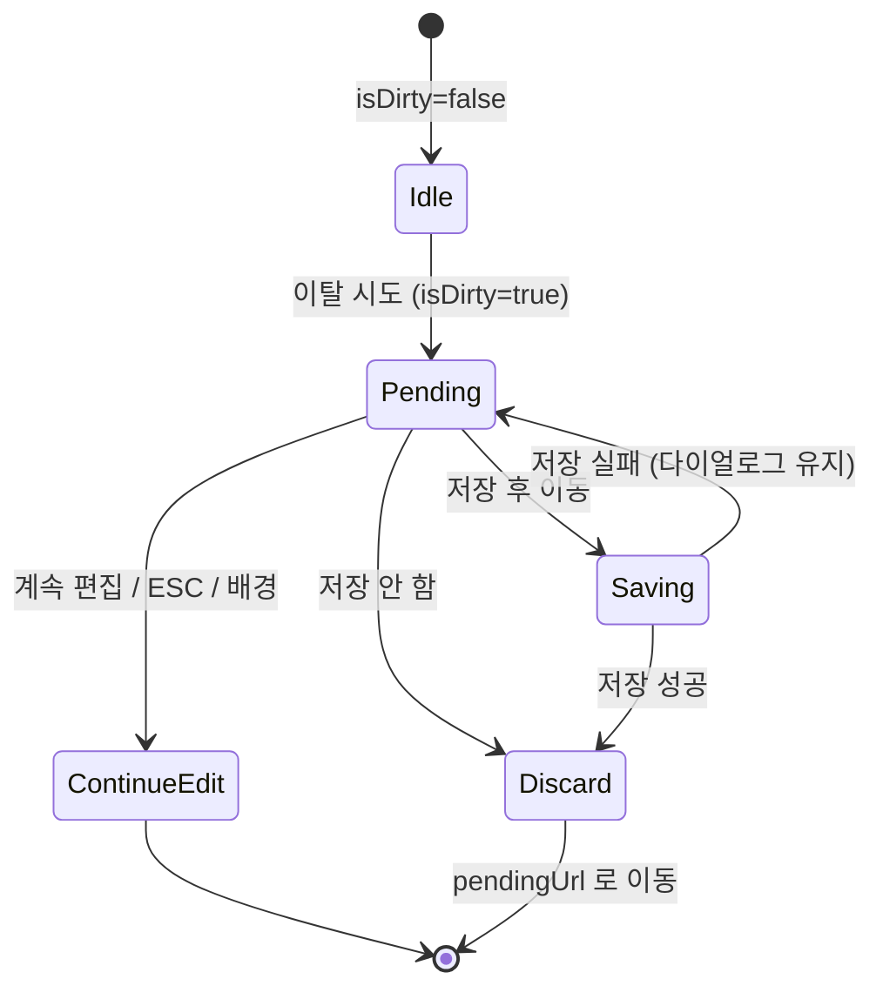

# DLG-002 이탈 경고 — 기본화면 (마스터)

> 이 문서는 **다이얼로그 마스터 스펙**입니다. `01~02` 상태 문서는 이 문서를 상속(override/delta)합니다.
> 폼의 `isDirty=true` 상태에서 페이지 이탈을 시도할 때 자동 오픈되는 **경고 다이얼로그**.
> 목적은 "실수 이탈로 인한 미저장 변경사항 손실"을 방지.

---

## 0. 메타 & 원천 참조

| 항목 | 값 |
|------|----|
| 다이얼로그 ID | DLG-002 |
| 다이얼로그명 | 이탈 경고 (미저장) |
| 도메인 | D01-공통 |
| 부모 화면 | 편집 폼이 있는 모든 화면 (SCR-011 회원등록, SCR-061 직원등록, SCR-080 센터설정, SCR-081 권한 설정, SCR-105 프로필 편집 등) |
| 트리거 조건 | `isDirty===true` + (router.push / back / popstate / beforeunload / Tab 전환 / 사이드바 클릭) |
| 확인 레벨 | L1 (경고) |
| 서버 호출 여부 | ❌ (클라이언트 전용) — 단, "저장 후 이동" 선택 시에만 부모 폼의 save 핸들러 트리거 |
| 닫기 옵션 | ✅ ESC/배경/X ("계속 편집"과 동일 효과) |
| 역할 | all (isDirty 폼을 편집할 수 있는 모든 역할) |
| 파일 경로 | `src/components/dialogs/LeaveWarningDialog.tsx` + `src/hooks/useBlockNavigation.ts` |
| 우선순위 | P1 |

### 원천 문서 링크
| 문서 | 경로 | 섹션 |
|---|---|---|
| 공통 화면설계서 | `docs/화면설계서/공통.md` | §4 DLG-COM-003, §5 네비게이션, §13 중복제출 방지 |
| 다이어그램 M1/M2/M3 | `docs/다이어그램/D01_공통/DLG/DLG-002_이탈경고/` | 생명주기/검증/결과 |
| SCR-061 직원등록 | `docs/화면설계서/D07-직원관리/SCR-061-직원등록/` | 대표적 사용 화면 |
| SCR-080 센터설정 | `docs/화면설계서/D09-설정관리/SCR-080-센터설정/` | 탭 전환 경고 사용 화면 |

---

## 1. 다이얼로그 목적 (Why)

미저장 편집 상태를 보호한다.
- 실수로 뒤로가기/탭 이동/링크 클릭/탭 닫기 시 작업 손실 방지
- "저장 후 이동" 선택을 제공(선택적 패턴)하여 의도를 살린 이동 경로 제공
- 브라우저 기본 `beforeunload` 에는 별도 커스텀 메시지가 불가하므로, 라우터 수준 차단만 커스텀 UI로 처리

---

## 2. 화면 레이아웃 (Wireframe)

```
  backdrop: bg-black/40
  ┌────────────────────────────────────────┐
  │  ┌────────────────────────────────┐    │
  │  │ ⚠  저장하지 않은 변경사항   [X]│    │
  │  │                                │    │
  │  │ 페이지를 벗어나면 변경사항이     │    │
  │  │ 사라집니다.                    │    │
  │  │                                │    │
  │  │  [  계속 편집 ] [저장 후 이동]  │    │
  │  │                 [저장 안 함] → │    │
  │  └────────────────────────────────┘    │
  └────────────────────────────────────────┘
```

| 영역 | 치수 | 역할 |
|---|---|---|
| Backdrop | `fixed inset-0 bg-black/40 z-40` | 배경 |
| Modal | `max-w-md` | 카드 |
| Header | 48px | 아이콘/제목/X |
| Body | ~64px | 본문 1~2줄 |
| Footer | 64px | 3-버튼 또는 2-버튼 |

### 버튼 변형(부모 폼 지원 여부에 따라)

| 패턴 | 버튼 | 용도 |
|---|---|---|
| 2-버튼(기본) | [계속 편집] [저장 안 함 (이탈)] | 대부분 폼 |
| 3-버튼(저장 가능한 폼) | [계속 편집] [저장 안 함] [저장 후 이동] | `onSaveAndLeave` prop 제공 시 |

---

## 3. 디자인 토큰

### 3.1 색상
| 토큰 | 클래스 | 용도 |
|---|---|---|
| backdrop | `fixed inset-0 bg-black/40 z-40` | 배경 |
| card | `bg-white rounded-2xl shadow-xl ring-1 ring-gray-100` | 카드 |
| icon.warn.wrap | `bg-amber-50 rounded-full size-10` | 경고 아이콘 래퍼 |
| icon.warn | `text-amber-500` | `AlertTriangle` |
| btn.continue | `border border-gray-300 bg-white hover:bg-gray-50 text-gray-700` | Secondary (계속 편집) |
| btn.save-leave | `bg-blue-600 hover:bg-blue-700 text-white` | Primary (저장 후 이동) |
| btn.discard | `text-rose-600 hover:bg-rose-50` | Tertiary/Ghost-Danger (저장 안 함) |

### 3.2 타이포
| 토큰 | 값 |
|---|---|
| title | `text-lg font-semibold text-gray-900` |
| body | `text-sm text-gray-600 leading-relaxed` |
| button | `text-sm font-medium` |

### 3.3 간격/반경/모션
- radius: `rounded-2xl`
- padding: `p-6`
- enter: `animate-[fadeInUp_140ms_ease-out]`

---

## 4. 반응형 규칙
| BP | 모달 | 버튼 레이아웃 |
|---|---|---|
| Mobile <640 | `max-w-xs w-[calc(100%-32px)]` | 세로 스택(3-button) |
| Tablet | `max-w-md` | 가로 우측 정렬 |
| Desktop | `max-w-md` | 가로 우측 정렬 |

모바일 3-버튼 세로: [계속 편집][저장 후 이동][저장 안 함] 순으로, 위험 액션이 맨 아래.

---

## 5. 🔐 역할별(RBAC) 매트릭스

> 편집 가능한 폼을 여는 모든 역할에 공통 적용. 역할별 차등 없음.

| 요소 | superAdmin | primary | owner | manager | fc | trainer | staff | front |
|---|:---:|:---:|:---:|:---:|:---:|:---:|:---:|:---:|
| 다이얼로그 오픈(자동) | ● | ● | ● | ● | ● | ● | ● | ● |
| "계속 편집" | ● | ● | ● | ● | ● | ● | ● | ● |
| "저장 후 이동" | ●* | ●* | ●* | ●* | ●* | ●* | ●* | ●* |
| "저장 안 함" | ● | ● | ● | ● | ● | ● | ● | ● |
| ESC/배경 닫기 | ● | ● | ● | ● | ● | ● | ● | ● |

\* 부모 폼이 `onSaveAndLeave` 를 제공할 때만 노출. 역할에 따라 저장 권한이 없으면 해당 버튼은 숨김(부모 폼 RBAC 적용).

### 멀티테넌트
- `branchId` 컨텍스트와 무관(클라이언트 전용 경고)
- 저장 후 이동 선택 시 부모 폼이 branchId 스코프로 저장

---

## 6. 컴포넌트 트리

```tsx
<Portal>
  <div role="alertdialog" aria-modal="true"
       aria-labelledby="leave-title" aria-describedby="leave-desc"
       className="fixed inset-0 z-40 flex items-center justify-center bg-black/40 px-4">
    <div className="w-full max-w-md bg-white rounded-2xl shadow-xl ring-1 ring-gray-100 p-6 space-y-4
                    animate-[fadeInUp_140ms_ease-out]">
      <header className="flex items-start gap-3">
        <span className="flex size-10 items-center justify-center rounded-full bg-amber-50 shrink-0">
          <AlertTriangle className="size-5 text-amber-500" aria-hidden />
        </span>
        <div className="flex-1">
          <h2 id="leave-title" className="text-lg font-semibold text-gray-900">저장하지 않은 변경사항</h2>
          <p id="leave-desc" className="text-sm text-gray-600 leading-relaxed mt-1">
            페이지를 벗어나면 변경사항이 사라집니다.
          </p>
        </div>
        <button aria-label="닫기" onClick={onContinueEditing}>
          <X className="size-4" />
        </button>
      </header>
      <div className="flex flex-col sm:flex-row sm:justify-end gap-2 pt-2">
        <Button variant="secondary" onClick={onContinueEditing} autoFocus>계속 편집</Button>
        {onSaveAndLeave && (
          <Button variant="primary" onClick={onSaveAndLeave} loading={saving}>저장 후 이동</Button>
        )}
        <Button variant="ghost-danger" onClick={onDiscard}>저장 안 함</Button>
      </div>
    </div>
  </div>
</Portal>
```

### 컴포넌트 명세
| 컴포넌트 | Props | 재사용 여부 |
|---|---|---|
| `LeaveWarningDialog` | `{ isOpen, onContinueEditing, onDiscard, onSaveAndLeave?, saving? }` | 전역 |
| `useBlockNavigation` | `(isDirty: boolean) => { pending, confirm, cancel }` | 훅 |

---

## 7. 데이터 계약

### 7.1 훅: `useBlockNavigation(isDirty)`

```ts
// src/hooks/useBlockNavigation.ts
import { useEffect, useState } from 'react';
import { useRouter } from 'next/navigation';

export function useBlockNavigation(isDirty: boolean) {
  const router = useRouter();
  const [pendingUrl, setPendingUrl] = useState<string | null>(null);

  // beforeunload (탭 닫기/리로드) - 브라우저 기본 다이얼로그만 가능
  useEffect(() => {
    if (!isDirty) return;
    const handler = (e: BeforeUnloadEvent) => {
      e.preventDefault();
      e.returnValue = '';
    };
    window.addEventListener('beforeunload', handler);
    return () => window.removeEventListener('beforeunload', handler);
  }, [isDirty]);

  // <a href>, router.push 가로채기: <LinkGuard> 컴포넌트에서 통합 (Next.js 15 Router events 미지원 대응)
  const tryNavigate = (url: string) => {
    if (!isDirty) { router.push(url); return true; }
    setPendingUrl(url);
    return false; // 호출 측에서 DLG 오픈
  };
  const confirmLeave = () => {
    if (pendingUrl) router.push(pendingUrl);
    setPendingUrl(null);
  };
  const cancelLeave = () => setPendingUrl(null);

  return { pendingUrl, isOpen: !!pendingUrl, tryNavigate, confirmLeave, cancelLeave };
}
```

### 7.2 트리거 소스

| 소스 | 구현 | 비고 |
|---|---|---|
| 사이드바/네비 링크 | `<LinkGuard>` 래퍼 (내부에서 `tryNavigate`) | preventDefault 후 DLG 오픈 |
| `router.push/replace` | 호출부가 `tryNavigate` 사용 | 직접 호출 대신 훅 경유 |
| `popstate`(뒤로가기) | `history.pushState` 로 가짜 프레임 유지 + popstate 감지 | 감지 후 DLG 오픈 |
| `beforeunload` | 브라우저 기본 다이얼로그(커스텀 불가) | 탭 닫기/리로드 |
| 탭 전환(탭 컴포넌트) | `onTabChange` 핸들러에서 isDirty 체크 | |

### 7.3 상태 전이
```
idle → pending(navigate 요청) → discard | saveAndLeave | continueEdit
```

---

## 8. 비즈니스 룰

1. **isDirty 추적**: react-hook-form의 `formState.isDirty` 또는 수동 `useState` 기반 플래그. 저장 성공 시 `reset(values)` 로 dirty=false 복원.
2. **닫기 = 계속 편집**: ESC/배경/X = `onContinueEditing` 동일 효과 (pendingUrl 초기화).
3. **"저장 안 함"** 선택 시 즉시 `pendingUrl` 로 이동. 파괴적 액션이므로 `text-rose-600` 시각적 구분.
4. **"저장 후 이동"**: `onSaveAndLeave` 핸들러 있으면 제공. 내부에서 save → 성공 시 `router.push(pendingUrl)`. 실패 시 다이얼로그 유지 + 에러 토스트.
5. **중복 오픈 방지**: 이미 `pendingUrl!==null` 인데 다른 네비게이션 요청이 오면 무시 또는 마지막 URL로 덮어쓰기(정책 택1, 기본은 무시).
6. **감사 로그 없음**: 이탈 경고 자체는 감사로그 대상이 아님. 저장 성공 시 부모 폼이 기록.
7. **탭 닫기/리로드**: 커스텀 UI 제공 불가. `beforeunload` 만 등록하여 브라우저 기본 경고에 의존.
8. **세션 만료 우선**: DLG-000 이 열려 있으면 DLG-002 는 오픈 금지.
9. **로그아웃 우선**: DLG-001 트리거 경로에서는 DLG-002를 스킵(공통.md §5.2).
10. **저장 후 이동 구현 실패 시**: `saving=true` 동안 버튼 스피너, 실패 시 `onError` → 다이얼로그 유지.

---

## 9. 상태 목록

| 파일 | 상태 코드 | 한글 | 트리거 |
|---|---|---|---|
| `01-열림.md` | `leave-warning-open` | 열림 | 이탈 시도 + isDirty |
| `02-이탈허용.md` | `leave-warning-discard` | 이탈 허용 | "저장 안 함" 클릭 → 이동 |

---

## 10. 에러 코드 매핑

| 에러 | 시나리오 | 표시 |
|---|---|---|
| 저장 실패(500/네트워크) | "저장 후 이동" 선택 → 저장 실패 | 다이얼로그 유지 + 에러 토스트 |
| pendingUrl 없음 | 타이밍 이슈 | 다이얼로그 닫기(noop) |

---

## 11. 접근성 (WCAG 2.1 AA)

| 항목 | 요구사항 |
|---|---|
| role | `role="alertdialog"` (데이터 손실 경고) |
| 라벨 | `aria-labelledby="leave-title"`, `aria-describedby="leave-desc"` |
| 포커스 | 오픈 시 "계속 편집"(안전 기본값)에 오토포커스 |
| Tab | 계속 편집 → 저장 후 이동 → 저장 안 함 → X → 계속 편집 (trap) |
| 키보드 | `Enter`=계속 편집(안전), `Esc`=계속 편집(동일) |
| 위험 액션 명시 | "저장 안 함" 은 `text-rose-600` + 명확한 한국어 라벨 |
| 모션 감소 | `motion-reduce:animate-none` |

---

## 12. 진입 / 이탈 연결

### 진입
- 폼 편집 중(`isDirty=true`) 에서 네비게이션/링크 클릭/뒤로가기/탭 전환 시도
- 브라우저 탭 닫기/리로드: 네이티브 `beforeunload` 다이얼로그(커스텀 불가)

### 이탈
| 액션 | 목적지 |
|---|---|
| "계속 편집" / ESC / 배경 / X | 현재 화면 유지, pendingUrl 초기화 |
| "저장 안 함" | `02-이탈허용` 상태 → pendingUrl 이동 |
| "저장 후 이동" | 부모 폼 save → 성공 시 pendingUrl 이동 / 실패 시 다이얼로그 유지 |

---

## 13. 다이어그램 통합 뷰



참조: `docs/다이어그램/D01_공통/DLG/DLG-002_이탈경고/M1_생명주기.md`

---

## 14. 🧩 바이브코딩 프롬프트 (마스터)

```
Next.js 15 App Router + TypeScript + Tailwind + react-hook-form 기반
'use client' 공용 이탈 경고 다이얼로그와 훅을 작성하라.

━━ 다이얼로그: DLG-002 이탈 경고 ━━
파일:
  src/components/dialogs/LeaveWarningDialog.tsx
  src/hooks/useBlockNavigation.ts
  src/components/navigation/LinkGuard.tsx

━━ 훅 ━━
import { useEffect, useState, useRef } from 'react';
import { useRouter } from 'next/navigation';

export function useBlockNavigation(isDirty: boolean) {
  const router = useRouter();
  const [pendingUrl, setPendingUrl] = useState<string | null>(null);

  useEffect(() => {
    if (!isDirty) return;
    const onBeforeUnload = (e: BeforeUnloadEvent) => { e.preventDefault(); e.returnValue = ''; };
    window.addEventListener('beforeunload', onBeforeUnload);
    return () => window.removeEventListener('beforeunload', onBeforeUnload);
  }, [isDirty]);

  // popstate 가드 (뒤로가기)
  useEffect(() => {
    if (!isDirty) return;
    history.pushState(null, '', location.href); // 가짜 프레임
    const onPop = () => {
      setPendingUrl('__back__');
      history.pushState(null, '', location.href); // 다시 밀어 넣기
    };
    window.addEventListener('popstate', onPop);
    return () => window.removeEventListener('popstate', onPop);
  }, [isDirty]);

  const tryNavigate = (url: string) => {
    if (!isDirty) { router.push(url); return true; }
    setPendingUrl(url);
    return false;
  };
  const confirmLeave = () => {
    const u = pendingUrl;
    setPendingUrl(null);
    if (u === '__back__') history.back();
    else if (u) router.push(u);
  };
  const cancelLeave = () => setPendingUrl(null);

  return { isOpen: !!pendingUrl, pendingUrl, tryNavigate, confirmLeave, cancelLeave };
}

━━ LinkGuard ━━
'use client';
import Link from 'next/link';
import { useBlockNavigation } from '@/hooks/useBlockNavigation';

export function LinkGuard({ href, isDirty, children, ...rest }:
  { href: string; isDirty: boolean; children: React.ReactNode } & React.HTMLAttributes<HTMLAnchorElement>) {
  const { tryNavigate } = useBlockNavigation(isDirty);
  return (
    <Link href={href} onClick={(e) => {
      if (isDirty) {
        e.preventDefault();
        tryNavigate(href);
      }
    }} {...rest}>{children}</Link>
  );
}

━━ 다이얼로그 컴포넌트 ━━
'use client';
import { createPortal } from 'react-dom';
import { AlertTriangle, X, Loader2 } from 'lucide-react';
import { useEffect, useRef, useState } from 'react';

interface Props {
  isOpen: boolean;
  onContinueEditing: () => void;
  onDiscard: () => void;
  onSaveAndLeave?: () => Promise<void>;
}

export default function LeaveWarningDialog({
  isOpen, onContinueEditing, onDiscard, onSaveAndLeave,
}: Props) {
  const [saving, setSaving] = useState(false);
  const btnRef = useRef<HTMLButtonElement>(null);

  useEffect(() => {
    if (!isOpen) return;
    btnRef.current?.focus();
    document.body.style.overflow = 'hidden';
    const onKey = (e: KeyboardEvent) => { if (e.key === 'Escape' && !saving) onContinueEditing(); };
    window.addEventListener('keydown', onKey);
    return () => {
      document.body.style.overflow = '';
      window.removeEventListener('keydown', onKey);
    };
  }, [isOpen, saving, onContinueEditing]);

  if (!isOpen || typeof document === 'undefined') return null;

  const handleSaveAndLeave = async () => {
    if (!onSaveAndLeave || saving) return;
    setSaving(true);
    try { await onSaveAndLeave(); }
    catch { toast.error('저장에 실패했습니다'); setSaving(false); }
  };

  return createPortal(
    <div role="alertdialog" aria-modal="true" aria-labelledby="leave-title" aria-describedby="leave-desc"
         onClick={(e) => { if (e.target === e.currentTarget && !saving) onContinueEditing(); }}
         className="fixed inset-0 z-40 flex items-center justify-center bg-black/40 px-4">
      <div className="w-full max-w-md bg-white rounded-2xl shadow-xl ring-1 ring-gray-100 p-6 space-y-4
                      motion-reduce:animate-none animate-[fadeInUp_140ms_ease-out]">
        <header className="flex items-start gap-3">
          <span className="flex size-10 items-center justify-center rounded-full bg-amber-50 shrink-0">
            <AlertTriangle className="size-5 text-amber-500" aria-hidden />
          </span>
          <div className="flex-1">
            <h2 id="leave-title" className="text-lg font-semibold text-gray-900">저장하지 않은 변경사항</h2>
            <p id="leave-desc" className="text-sm text-gray-600 leading-relaxed mt-1">
              페이지를 벗어나면 변경사항이 사라집니다.
            </p>
          </div>
          <button aria-label="닫기" onClick={onContinueEditing} disabled={saving}
            className="size-8 grid place-items-center rounded-md hover:bg-gray-100 text-gray-500 disabled:opacity-50">
            <X className="size-4" />
          </button>
        </header>
        <div className="flex flex-col sm:flex-row sm:justify-end gap-2 pt-2">
          <button ref={btnRef} onClick={onContinueEditing} disabled={saving}
            className="h-10 px-4 rounded-lg border border-gray-300 bg-white hover:bg-gray-50 text-sm font-medium text-gray-700 disabled:opacity-50">
            계속 편집
          </button>
          {onSaveAndLeave && (
            <button onClick={handleSaveAndLeave} disabled={saving}
              className="h-10 px-4 rounded-lg bg-blue-600 hover:bg-blue-700 text-white text-sm font-medium
                         disabled:bg-blue-400 inline-flex items-center gap-2">
              {saving && <Loader2 className="size-4 animate-spin" aria-hidden />}
              {saving ? '저장 중...' : '저장 후 이동'}
            </button>
          )}
          <button onClick={onDiscard} disabled={saving}
            className="h-10 px-4 rounded-lg text-rose-600 hover:bg-rose-50 text-sm font-medium disabled:opacity-50">
            저장 안 함
          </button>
        </div>
      </div>
    </div>,
    document.body
  );
}

━━ 폼 측 사용 예 ━━
const form = useForm<Profile>({ ... });
const { isOpen, confirmLeave, cancelLeave } = useBlockNavigation(form.formState.isDirty);

<LeaveWarningDialog
  isOpen={isOpen}
  onContinueEditing={cancelLeave}
  onDiscard={confirmLeave}
  onSaveAndLeave={async () => {
    await form.handleSubmit(onSubmit)();
    confirmLeave();
  }}
/>

━━ 디자인 토큰 ━━
backdrop:   fixed inset-0 z-40 bg-black/40
card:       bg-white rounded-2xl shadow-xl ring-1 ring-gray-100 p-6
icon.wrap:  flex size-10 items-center justify-center rounded-full bg-amber-50
icon:       text-amber-500
title:      text-lg font-semibold text-gray-900
body:       text-sm text-gray-600 leading-relaxed
btn.sec:    h-10 px-4 rounded-lg border border-gray-300 bg-white hover:bg-gray-50 text-gray-700
btn.pri:    h-10 px-4 rounded-lg bg-blue-600 hover:bg-blue-700 text-white
btn.ghost:  h-10 px-4 rounded-lg text-rose-600 hover:bg-rose-50

━━ QA 체크 ━━
- isDirty=true 에서 뒤로가기 → 가짜 popstate 프레임 + DLG-002 오픈
- 사이드바 링크 클릭(LinkGuard) → DLG-002 오픈
- beforeunload 등록(탭 닫기/리로드) → 브라우저 기본 경고
- "계속 편집"/ESC/배경 → 닫힘 + 화면 유지
- "저장 안 함" → pendingUrl 로 이동
- "저장 후 이동" → 부모 save → 성공 시 이동 / 실패 시 다이얼로그 유지
- Tab 순환, 포커스 "계속 편집" 자동
- motion-reduce 준수
```

---

## 15. QA 체크리스트

- [ ] 사이드바 링크 클릭 시 isDirty=true 면 DLG-002 오픈
- [ ] 뒤로가기 시 DLG-002 오픈
- [ ] 브라우저 탭 닫기/리로드 시 브라우저 기본 `beforeunload` 경고 표시
- [ ] "계속 편집" 시 페이지 유지, 스크롤 복원
- [ ] "저장 안 함" 시 pendingUrl 로 즉시 이동
- [ ] "저장 후 이동" 버튼은 onSaveAndLeave 제공 시만 노출
- [ ] "저장 후 이동" 성공 → 이동, 실패 → 다이얼로그 유지 + 토스트
- [ ] isDirty=false 이면 오픈되지 않음
- [ ] DLG-000/DLG-001 열린 상태에서는 DLG-002 무시
- [ ] Tab 순환 정상, 포커스 "계속 편집" 자동
- [ ] role=alertdialog 적용, 라벨/설명 공지
- [ ] 모바일에서 버튼 세로 스택
- [ ] motion-reduce 준수
