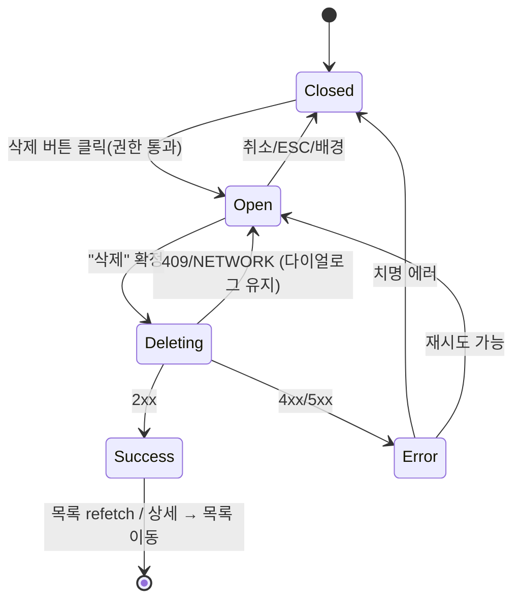

# DLG-003 삭제 확인 — 기본화면 (마스터)

> 이 문서는 **다이얼로그 마스터 스펙**입니다. `01~04` 상태 문서는 이 문서를 상속(override/delta)합니다.
> 🚨 **파괴적 액션(destructive)**: 되돌릴 수 없는 삭제 작업 직전에 사용자의 재확인을 받는 공용 다이얼로그.

---

## 0. 메타 & 원천 참조

| 항목 | 값 |
|------|----|
| 다이얼로그 ID | DLG-003 |
| 다이얼로그명 | 삭제 확인 |
| 도메인 | D01-공통 |
| 부모 화면 | 삭제 기능이 있는 모든 목록/상세 (회원, 직원, 상품, 락커, 쿠폰, 리드, 템플릿, RFID, 운동룸 등) |
| 트리거 조건 | `onClick` 삭제 버튼 클릭 + 권한 검증 통과 |
| 확인 레벨 | L2 (파괴적) — 타이핑 확인(`confirmationText`) 옵션 |
| 서버 호출 여부 | ✅ `DELETE /resource/:id` 또는 `POST /resource/bulk-delete` |
| 닫기 옵션 | 🟡 ESC/배경/X = 취소 허용 (단, `02-삭제중` 상태에서는 차단) |
| 역할 | 삭제 권한 있는 역할만 (부모 RBAC에 의존) |
| 파일 경로 | `src/components/common/ConfirmDialog.tsx` (variant=danger) |
| 우선순위 | P0 |

### 원천 문서 링크
| 문서 | 경로 | 섹션 |
|---|---|---|
| 공통 화면설계서 | `docs/화면설계서/공통.md` | §4 DLG-COM-001/005, §16 감사로그(DELETE) |
| 에러코드정의서 | `docs/에러코드정의서.md` | §공통 E403001, §회원 E404100, E409100, §시설 E4xx600~ |
| 다이어그램 M1/M2/M3 | `docs/다이어그램/D01_공통/DLG/DLG-003_삭제확인/` | 생명주기/검증/결과 |
| 권한 매트릭스 | `docs/다이어그램/10_권한매트릭스/R1_역할화면_매트릭스.md` | 부모 화면 삭제 권한 |

---

## 1. 다이얼로그 목적 (Why)

되돌릴 수 없는 삭제 작업 직전 **재확인 + 상세 안내**로 실수 방지.
- 단건 삭제 + 일괄 삭제 모두 지원
- 참조 제약(관련 데이터) 경고 포함
- 위험도 따라 타이핑 확인(`confirmationText`) 요구 옵션
- 삭제 성공/실패/충돌 등 다양한 결과 분기를 처리

---

## 2. 화면 레이아웃 (Wireframe)

### 2.1 기본 레이아웃

```
  backdrop: bg-black/50
  ┌─────────────────────────────────────┐
  │  ┌─────────────────────────────┐    │
  │  │ 🗑 {대상} 삭제           [X]│    │ ← Header (danger tone)
  │  │                             │    │
  │  │ "{이름}"을(를) 삭제합니다.    │    │ ← 본문
  │  │ 이 작업은 되돌릴 수 없습니다.  │    │
  │  │                             │    │
  │  │ ⚠ 연관된 N개의 데이터도       │    │ ← (참조 있을 때만)
  │  │   함께 삭제됩니다.            │    │
  │  │                             │    │
  │  │ 확인 입력: [ 삭제        ]   │    │ ← (confirmationText 옵션)
  │  │                             │    │
  │  │        [ 취소 ]  [ 삭제 ]   │    │
  │  └─────────────────────────────┘    │
  └─────────────────────────────────────┘
```

### 2.2 일괄 삭제 변형

```
  🗑 {N}건 삭제
  선택한 {N}건의 {대상}을(를) 삭제합니다.
  이 작업은 되돌릴 수 없습니다.
  ⚠ {M}건은 참조 관계가 있어 삭제되지 않을 수 있습니다.
                        [ 취소 ]  [ N건 삭제 ]
```

| 영역 | 치수 | 역할 |
|---|---|---|
| Backdrop | `fixed inset-0 bg-black/50 z-40` | 배경 |
| Modal | `max-w-md` | 카드 |
| Header | 48px | 아이콘/제목/X |
| Body | auto | 본문 + 참조 경고 + 타이핑 입력 |
| Footer | 56px | [취소][삭제(danger)] |

---

## 3. 디자인 토큰

### 3.1 색상

| 토큰 | 클래스 | 용도 |
|---|---|---|
| backdrop | `fixed inset-0 bg-black/50 z-40` | 배경 |
| card | `bg-white rounded-2xl shadow-xl ring-1 ring-gray-100` | 카드 |
| icon.danger.wrap | `bg-rose-50 rounded-full size-10` | 아이콘 래퍼 |
| icon.danger | `text-rose-500` | `Trash2` |
| warn.banner | `bg-amber-50 border border-amber-200 text-amber-800 rounded-md p-3 text-xs` | 참조 경고 |
| btn.cancel | `border border-gray-300 bg-white hover:bg-gray-50 text-gray-700` | Secondary |
| btn.delete | `bg-rose-600 hover:bg-rose-700 text-white` | Danger |
| btn.delete.disabled | `bg-rose-300 cursor-not-allowed` | 타이핑 미매칭 시 |
| confirm.input | `h-10 w-full rounded-lg border border-gray-300 px-3 text-sm focus:ring-2 focus:ring-rose-500 focus:border-rose-500` | 타이핑 입력 |

### 3.2 타이포

| 토큰 | 값 |
|---|---|
| title | `text-lg font-semibold text-gray-900` |
| body | `text-sm text-gray-600 leading-relaxed` |
| target.name | `font-medium text-gray-900` (인용부 안 이름 강조) |
| warn | `text-xs text-amber-800` |

### 3.3 간격/반경/모션
- radius: `rounded-2xl`
- padding: `p-6`
- enter: `animate-[fadeInUp_140ms_ease-out]`

---

## 4. 반응형 규칙
| BP | 모달 |
|---|---|
| Mobile <640 | `max-w-xs w-[calc(100%-32px)]` |
| Tablet | `max-w-md` |
| Desktop | `max-w-md` |

---

## 5. 🔐 역할별(RBAC) 매트릭스

> 다이얼로그 자체 접근은 **부모 화면의 삭제 권한**에 따른다. 부모가 금지하면 이 다이얼로그는 오픈되지 않음.

| 요소 | superAdmin | primary | owner | manager | fc | trainer | staff | front |
|---|:---:|:---:|:---:|:---:|:---:|:---:|:---:|:---:|
| **대표 부모 화면별 노출** | | | | | | | | |
| SCR-010 회원 삭제 | ● | ● | ● | ● | ● | — | — | — |
| SCR-060 직원 삭제 | ● | ● | ● | — | — | — | — | — |
| SCR-050 락커 해제 | ● | ● | ● | ● | — | — | ● | — |
| SCR-073 쿠폰 삭제 | ● | ● | ● | ● | — | — | — | — |
| SCR-070 리드 삭제 | ● | ● | ● | ● | ● | — | — | — |
| SCR-083 IoT 장치 삭제 | ● | ● | ● | — | — | — | — | — |
| **다이얼로그 요소** | | | | | | | | |
| "취소" 버튼 | ● | ● | ● | ● | ● | ● | ● | ● |
| "삭제" 버튼 | 부모 권한 따름 | | | | | | | |
| ESC/배경 닫기 | ● | ● | ● | ● | ● | ● | ● | ● |
| 일괄 삭제 | 부모 화면에서 일괄 선택 가능할 때만 | | | | | | | |

### 멀티테넌트
- 서버는 `branchId` 스코프로 삭제 권한 강제
- 다른 지점 데이터 조작 시 403 → 토스트 후 다이얼로그 닫기

---

## 6. 컴포넌트 트리

```tsx
<ConfirmDialog
  isOpen={isOpen}
  variant="danger"
  icon={<Trash2 />}
  title={`${targetName} 삭제`}
  description={`"${targetName}"을(를) 삭제합니다. 이 작업은 되돌릴 수 없습니다.`}
  warning={hasRelated
    ? `연관된 ${relatedCount}개의 데이터도 함께 삭제됩니다.`
    : undefined}
  confirmationText="삭제"              // L2: 타이핑 확인 옵션
  confirmLabel={bulkCount ? `${bulkCount}건 삭제` : '삭제'}
  cancelLabel="취소"
  loading={isDeleting}
  onCancel={onClose}
  onConfirm={handleDelete}
/>
```

### 컴포넌트 명세
| 컴포넌트 | Props | 재사용 여부 |
|---|---|---|
| `ConfirmDialog` | `{isOpen, variant:'danger'|'primary', title, description, warning?, confirmationText?, confirmLabel, cancelLabel, loading, onConfirm, onCancel}` | 전역 공용 |
| `DeleteConfirmDialog` (래퍼) | `{target, relatedCount?, onConfirm}` | 선택 |

---

## 7. 데이터 계약

### 7.1 Props 타입

```ts
// src/components/common/ConfirmDialog.tsx
type ConfirmVariant = 'primary' | 'danger' | 'warning';
interface ConfirmDialogProps {
  isOpen: boolean;
  variant: ConfirmVariant;
  icon?: React.ReactNode;
  title: string;
  description?: string;
  warning?: string;                 // 참조 경고
  confirmationText?: string;        // 타이핑 확인 (예: "삭제")
  confirmLabel: string;
  cancelLabel?: string;             // 기본 "취소"
  loading?: boolean;
  onConfirm: () => void | Promise<void>;
  onCancel: () => void;
}
```

### 7.2 API (부모 화면에서 호출)

| 패턴 | 엔드포인트 | 응답 성공 | 실패 |
|---|---|---|---|
| 단건 | `DELETE /resource/:id` | 204 | 403/404/409/500 |
| 일괄 | `POST /resource/bulk-delete { ids: number[] }` | `{ deletedCount, failedIds, failedReasons }` | 부분 실패 허용 |

### 7.3 상태 전이
```
closed → open(01) → deleting(02) → success(03) | error(04)
                                  ↳ closed(cancel/esc)
```

---

## 8. 비즈니스 룰

1. **권한 가드 이중화**: 클라이언트 `canDelete(role, resource)` + 서버 403 반환. 다이얼로그는 UX 용.
2. **타이핑 확인**: `confirmationText` 제공 시 정확히 입력해야 Primary 버튼 활성. 고위험 리소스(회원, 지점) 등에 사용.
3. **닫기 차단**: `02-삭제중` 상태에서는 ESC/배경/X 차단.
4. **참조 경고**: 자식 데이터(결제 이력, 출석 기록 등) 존재 시 `warning` 텍스트 표시. 카운트 미리 조회(optional).
5. **일괄 처리**: 부분 실패 허용. 서버가 `{deletedCount, failedIds}` 반환 → `03-삭제성공` 상태에서 토스트로 요약.
6. **성공 동작**: 목록 refetch 또는 낙관적 제거 + 토스트. 상세 화면이면 목록으로 이동.
7. **실패 동작**: 에러 코드에 따라 다이얼로그 유지/닫기 분기. 409 충돌은 토스트 + 닫기.
8. **감사로그**: `AUDIT.DELETE` 서버 기록. 클라이언트는 targetType, targetId만 전달.
9. **낙관적 업데이트 롤백**: 실패 시 자동 롤백.
10. **배경 스크롤 잠금**: 오픈 동안 `body.style.overflow='hidden'`.

---

## 9. 상태 목록

| 파일 | 상태 코드 | 한글 | 트리거 |
|---|---|---|---|
| `01-열림.md` | `delete-confirm-open` | 열림 | 삭제 버튼 클릭 |
| `02-삭제중.md` | `delete-confirm-deleting` | 삭제 중 | "삭제" 확정 |
| `03-삭제성공.md` | `delete-confirm-success` | 삭제 성공 | 2xx 응답 |
| `04-삭제실패.md` | `delete-confirm-error` | 삭제 실패 | 4xx/5xx 응답 |

---

## 10. 에러 코드 매핑

| errorCode | HTTP | 시나리오 | 표시 | 다음 상태 |
|---|---|---|---|---|
| E403001 | 403 | 권한 없음 | 토스트 "삭제 권한이 없습니다" | 다이얼로그 닫기 |
| E404xxx | 404 | 이미 삭제됨 | 토스트 "이미 삭제된 항목입니다" + 목록 refetch | 다이얼로그 닫기 |
| E409xxx | 409 | 참조 제약 충돌 | 토스트 "현재 사용 중인 항목은 삭제할 수 없습니다" | 다이얼로그 닫기 |
| E500001 | 500 | 서버 오류 | 토스트 "일시적인 오류가 발생했습니다" | 다이얼로그 유지 + 재시도 가능 |
| NETWORK | — | 네트워크 | 토스트 "네트워크 오류" | 다이얼로그 유지 |
| E401002 | 401 | 세션 만료 | DLG-000 오픈 | 이 다이얼로그 자동 정리 |

---

## 11. 접근성 (WCAG 2.1 AA)

| 항목 | 요구사항 |
|---|---|
| role | `role="alertdialog"` (파괴적) |
| 라벨 | `aria-labelledby`, `aria-describedby` |
| 포커스 | 오픈 시 "취소"(안전 기본값) 또는 "삭제"(관례) — 프로젝트 정책: "취소" 자동 포커스 권장 |
| Tab trap | 취소 → 삭제 → (타이핑 입력) → X → 취소 |
| 키보드 | `Enter` = 포커스된 버튼, `Esc` = 취소 (단 deleting 중엔 차단) |
| 위험 액션 시각 | Primary 버튼 `bg-rose-600` + 아이콘 + 카피 명확 |
| Live region | 에러/경고 메시지 `role="alert" aria-live="assertive"` |
| 모션 감소 | `motion-reduce:animate-none` |

---

## 12. 진입 / 이탈 연결

### 진입
- 목록 행의 삭제 액션 버튼(`···` 메뉴 > 삭제)
- 상세 화면 상단 `[삭제]` 버튼
- 일괄 선택 상단 툴바 `[선택 삭제]`

### 이탈

| 액션 | 목적지 |
|---|---|
| "취소" / ESC / 배경 | 닫힘, 현재 화면 유지 |
| "삭제" 확정 | `02-삭제중` → 성공 시 목록 갱신 / 상세 → 목록으로 이동 |
| 세션 만료(401) | DLG-000 오픈, 이 다이얼로그 정리 |

---

## 13. 다이어그램 통합 뷰



참조: `docs/다이어그램/D01_공통/DLG/DLG-003_삭제확인/M1_생명주기.md`

---

## 14. 🧩 바이브코딩 프롬프트 (마스터)

```
Next.js 15 App Router + TypeScript + Tailwind + React Query 기반
'use client' 공용 확인 다이얼로그를 작성하라.

━━ 공용 ConfirmDialog (danger/primary/warning 공용) ━━
파일: src/components/common/ConfirmDialog.tsx

import { createPortal } from 'react-dom';
import { useEffect, useRef, useState } from 'react';
import { X, Loader2 } from 'lucide-react';

export type ConfirmVariant = 'primary' | 'danger' | 'warning';
interface Props {
  isOpen: boolean;
  variant: ConfirmVariant;
  icon?: React.ReactNode;
  title: string;
  description?: string;
  warning?: string;
  confirmationText?: string;
  confirmLabel: string;
  cancelLabel?: string;
  loading?: boolean;
  onConfirm: () => void | Promise<void>;
  onCancel: () => void;
}

const TONE = {
  primary: { iconWrap:'bg-blue-50', iconColor:'text-blue-500',
             confirm:'bg-blue-600 hover:bg-blue-700 disabled:bg-blue-300' },
  danger:  { iconWrap:'bg-rose-50', iconColor:'text-rose-500',
             confirm:'bg-rose-600 hover:bg-rose-700 disabled:bg-rose-300' },
  warning: { iconWrap:'bg-amber-50', iconColor:'text-amber-500',
             confirm:'bg-amber-600 hover:bg-amber-700 disabled:bg-amber-300' },
} as const;

export function ConfirmDialog({
  isOpen, variant, icon, title, description, warning, confirmationText,
  confirmLabel, cancelLabel='취소', loading=false, onConfirm, onCancel,
}: Props) {
  const [typed, setTyped] = useState('');
  const cancelRef = useRef<HTMLButtonElement>(null);
  const tone = TONE[variant];
  const needsTyping = !!confirmationText;
  const canConfirm = !loading && (!needsTyping || typed === confirmationText);

  useEffect(() => {
    if (!isOpen) { setTyped(''); return; }
    cancelRef.current?.focus();
    document.body.style.overflow = 'hidden';
    const onKey = (e: KeyboardEvent) => {
      if (e.key === 'Escape' && !loading) onCancel();
    };
    window.addEventListener('keydown', onKey);
    return () => {
      document.body.style.overflow = '';
      window.removeEventListener('keydown', onKey);
    };
  }, [isOpen, loading, onCancel]);

  if (!isOpen || typeof document === 'undefined') return null;

  return createPortal(
    <div role="alertdialog" aria-modal="true" aria-labelledby="cd-title" aria-describedby="cd-desc"
         onClick={(e) => { if (e.target === e.currentTarget && !loading) onCancel(); }}
         className="fixed inset-0 z-40 flex items-center justify-center bg-black/50 px-4">
      <div className="w-full max-w-md bg-white rounded-2xl shadow-xl ring-1 ring-gray-100 p-6 space-y-4
                      motion-reduce:animate-none animate-[fadeInUp_140ms_ease-out]">
        <header className="flex items-start gap-3">
          {icon && (
            <span className={`flex size-10 items-center justify-center rounded-full shrink-0 ${tone.iconWrap}`}>
              <span className={`${tone.iconColor}`}>{icon}</span>
            </span>
          )}
          <div className="flex-1">
            <h2 id="cd-title" className="text-lg font-semibold text-gray-900">{title}</h2>
            {description && <p id="cd-desc" className="text-sm text-gray-600 leading-relaxed mt-1">{description}</p>}
          </div>
          <button aria-label="닫기" onClick={onCancel} disabled={loading}
            className="size-8 grid place-items-center rounded-md hover:bg-gray-100 text-gray-500 disabled:opacity-50">
            <X className="size-4" />
          </button>
        </header>

        {warning && (
          <div role="alert"
               className="rounded-md bg-amber-50 border border-amber-200 p-3 text-xs text-amber-800">
            ⚠ {warning}
          </div>
        )}

        {needsTyping && (
          <label className="block space-y-2">
            <span className="text-xs text-gray-600">
              계속하려면 <b className="text-gray-900">{confirmationText}</b> 를 입력하세요
            </span>
            <input type="text" value={typed} onChange={(e) => setTyped(e.target.value)}
              disabled={loading}
              className="h-10 w-full rounded-lg border border-gray-300 px-3 text-sm
                         focus:outline-none focus:ring-2 focus:ring-rose-500 focus:border-rose-500" />
          </label>
        )}

        <div className="flex items-center justify-end gap-2 pt-2">
          <button ref={cancelRef} onClick={onCancel} disabled={loading}
            className="h-10 px-4 rounded-lg border border-gray-300 bg-white hover:bg-gray-50
                       text-sm font-medium text-gray-700 disabled:opacity-50">
            {cancelLabel}
          </button>
          <button onClick={onConfirm} disabled={!canConfirm}
            className={`h-10 px-4 rounded-lg text-white text-sm font-medium inline-flex items-center gap-2
                        ${tone.confirm} disabled:cursor-not-allowed`}>
            {loading && <Loader2 className="size-4 animate-spin" aria-hidden />}
            {loading ? '처리 중...' : confirmLabel}
          </button>
        </div>
      </div>
    </div>,
    document.body
  );
}

━━ 사용 예 (회원 삭제) ━━
const [open, setOpen] = useState(false);
const del = useMutation({
  mutationFn: (id: number) => fetch(`/members/${id}`, { method:'DELETE' }),
  onSuccess: () => { qc.invalidateQueries({queryKey:['members']}); toast.success('회원이 삭제되었습니다'); setOpen(false); },
  onError: (e:any) => {
    if (e.errorCode === 'E409xxx') toast.error('현재 사용 중인 회원은 삭제할 수 없습니다');
    else toast.error('삭제에 실패했습니다');
    setOpen(false);
  },
});

<ConfirmDialog
  isOpen={open}
  variant="danger"
  icon={<Trash2 className="size-5" />}
  title={`${member.name} 삭제`}
  description={`"${member.name}"을(를) 삭제합니다. 이 작업은 되돌릴 수 없습니다.`}
  warning={member.paymentCount > 0 ? `연관된 결제 내역 ${member.paymentCount}건이 함께 삭제됩니다.` : undefined}
  confirmationText="삭제"
  confirmLabel="삭제"
  loading={del.isPending}
  onConfirm={() => del.mutate(member.id)}
  onCancel={() => setOpen(false)}
/>

━━ 디자인 토큰 (정확히) ━━
backdrop:     fixed inset-0 z-40 bg-black/50
card:         bg-white rounded-2xl shadow-xl ring-1 ring-gray-100 p-6
icon.wrap:    flex size-10 items-center justify-center rounded-full
warn.banner:  rounded-md bg-amber-50 border border-amber-200 p-3 text-xs text-amber-800
input:        h-10 w-full rounded-lg border border-gray-300 px-3 text-sm focus:ring-2
btn.cancel:   h-10 px-4 rounded-lg border border-gray-300 bg-white hover:bg-gray-50 text-sm font-medium text-gray-700
btn.danger:   h-10 px-4 rounded-lg bg-rose-600 hover:bg-rose-700 text-white text-sm font-medium

━━ QA 체크 ━━
- 기본 포커스 "취소" (안전한 기본값)
- 타이핑 옵션 시 정확히 입력해야 Primary 활성
- 삭제 중 ESC/배경 차단
- 성공 시 목록 refetch + 토스트
- 실패 코드별 메시지 분기 (403/404/409/500)
- role=alertdialog, aria-modal, 라벨, 설명 공지
- 모바일 360px 가독성
```

---

## 15. QA 체크리스트

- [ ] 삭제 버튼 클릭 시 오픈 (권한 없는 역할은 클릭 자체 불가)
- [ ] 기본 포커스 "취소"
- [ ] 참조 데이터 있음 시 warning 배너 노출
- [ ] confirmationText 옵션 시 정확히 입력해야 Primary 활성
- [ ] 확정 → `02-삭제중` 로딩 상태
- [ ] 성공 시 목록 refetch 또는 상세 → 목록 이동 + 토스트
- [ ] 409 충돌 시 토스트 + 다이얼로그 닫기
- [ ] 500/NETWORK 시 다이얼로그 유지 + 재시도 가능
- [ ] 일괄 삭제 부분 실패 시 토스트 요약
- [ ] ESC/배경 = 취소 (단 deleting 중 차단)
- [ ] 키보드 Tab 순환 정상
- [ ] role=alertdialog, 라벨/설명 공지
- [ ] 세션 만료 시 DLG-000 우선
- [ ] 모바일 360px 폭 가독성
- [ ] 감사로그 AUDIT.DELETE 서버 기록 확인
