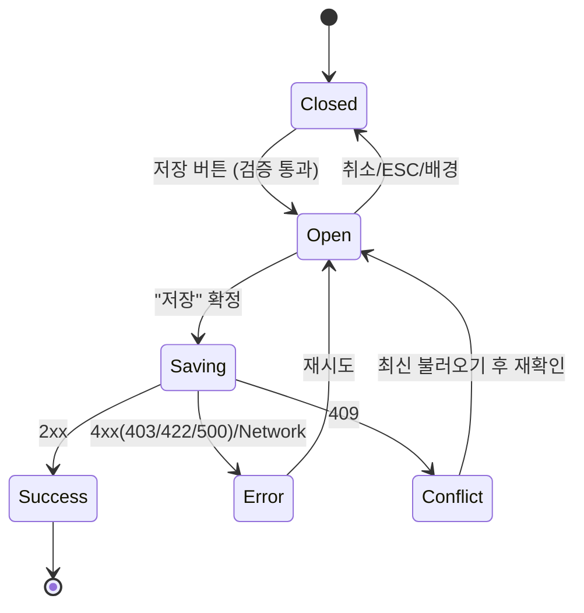

# DLG-004 저장 확인 — 기본화면 (마스터)

> 이 문서는 **다이얼로그 마스터 스펙**입니다. `01~05` 상태 문서는 이 문서를 상속(override/delta)합니다.
> 중요한 변경이 있는 폼에서 저장 직전 **명시적 확인 + 저장 진행 + 결과 분기**를 통합 처리하는 공용 다이얼로그.
> 낙관적 잠금(optimistic concurrency) 충돌 시 `05-충돌` 상태로 분기하여 복구 경로 제공.

---

## 0. 메타 & 원천 참조

| 항목 | 값 |
|------|----|
| 다이얼로그 ID | DLG-004 |
| 다이얼로그명 | 저장 확인 |
| 도메인 | D01-공통 |
| 부모 화면 | 편집 폼 중요 변경(SCR-080 센터설정, SCR-081 권한, SCR-012 회원수정, SCR-061B 직원수정, SCR-072 자동알림, SCR-073 쿠폰수정 등) |
| 트리거 조건 | 폼 저장 버튼 클릭 (일부 중요 폼에서만 사용, 일반 저장은 버튼 직접 처리) |
| 확인 레벨 | L1 (확인형) — 일반, L2(강조) 옵션은 부모 선택 |
| 서버 호출 여부 | ✅ `POST/PATCH /resource/:id` (다이얼로그 내부 `02-저장중` 상태에서) |
| 닫기 옵션 | ✅ ESC/배경/X = 취소 허용 (단, `02-저장중` 차단) |
| 역할 | 부모 화면 저장 권한 있는 역할 |
| 파일 경로 | `src/components/common/ConfirmDialog.tsx` (variant='primary') 또는 `SaveConfirmDialog.tsx` |
| 우선순위 | P1 |

### 원천 문서 링크
| 문서 | 경로 | 섹션 |
|---|---|---|
| 공통 화면설계서 | `docs/화면설계서/공통.md` | §4 DLG-COM-002, §13 중복 제출 방지, §16 감사로그(UPDATE) |
| 에러코드정의서 | `docs/에러코드정의서.md` | §공통 E400001, §회원 E409101, §409 Conflict 전반 |
| 다이어그램 M1/M2/M3 | `docs/다이어그램/D01_공통/DLG/DLG-004_저장확인/` | 생명주기/검증/결과 |
| DLG-002 이탈경고 | `docs/화면설계서/D01-공통/DLG-002-이탈경고/` | "저장 후 이동" 연동 |

---

## 1. 다이얼로그 목적 (Why)

- 주요 설정 저장 직전 한 번 더 의도 확인.
- 저장 중/성공/실패/충돌의 결과 UI를 하나의 모달에서 흐름 있게 처리.
- 낙관적 잠금 충돌(`E409xxx`) 시 최신 데이터 재로드 또는 사용자 입력 유지 중 선택.

---

## 2. 화면 레이아웃 (Wireframe)

```
  ┌──────────────────────────────┐
  │ 💾 변경사항 저장          [X] │
  │                              │
  │ 변경된 내용을 저장하시겠습니까? │
  │                              │
  │         [ 취소 ] [ 저장 ]     │
  └──────────────────────────────┘
```

### 요약 미리보기 변형(옵션)

```
  💾 센터 설정 저장
  변경된 항목 3건:
   • 영업 시간: 06:00-23:00 → 07:00-22:00
   • 주휴무: 일요일 추가
   • 기본 이용권: 6개월 → 12개월
            [ 취소 ] [ 저장 ]
```

| 영역 | 치수 | 역할 |
|---|---|---|
| Backdrop | `fixed inset-0 bg-black/40 z-40` | 배경 |
| Modal | `max-w-md` | 카드 |
| Header | 48px | 아이콘/제목/X |
| Body | auto | 본문/변경 미리보기 |
| Footer | 56px | [취소][저장] |

---

## 3. 디자인 토큰

### 3.1 색상

| 토큰 | 클래스 | 용도 |
|---|---|---|
| backdrop | `fixed inset-0 bg-black/40 z-40` | 배경 |
| card | `bg-white rounded-2xl shadow-xl ring-1 ring-gray-100` | 카드 |
| icon.primary.wrap | `bg-blue-50 rounded-full size-10` | 아이콘 래퍼 |
| icon.primary | `text-blue-500` | `Save` |
| icon.conflict | `text-amber-500` | 충돌 UI |
| icon.success | `text-emerald-500` | 성공 UI |
| btn.cancel | `border border-gray-300 bg-white hover:bg-gray-50 text-gray-700` | Secondary |
| btn.save | `bg-blue-600 hover:bg-blue-700 text-white` | Primary |
| btn.save.disabled | `bg-blue-300 cursor-not-allowed` | disabled |
| diff.banner | `bg-gray-50 border border-gray-200 rounded-md p-3 text-xs` | 변경 미리보기 |

### 3.2 타이포

| 토큰 | 값 |
|---|---|
| title | `text-lg font-semibold text-gray-900` |
| body | `text-sm text-gray-600 leading-relaxed` |
| diff.key | `font-medium text-gray-900` |
| diff.value | `text-gray-600 tabular-nums` |

### 3.3 간격/반경/모션
- radius: `rounded-2xl`
- padding: `p-6`
- enter: `animate-[fadeInUp_140ms_ease-out]`

---

## 4. 반응형 규칙
| BP | 모달 |
|---|---|
| Mobile <640 | `max-w-xs w-[calc(100%-32px)]` |
| Tablet | `max-w-md` |
| Desktop | `max-w-md` |

---

## 5. 🔐 역할별(RBAC) 매트릭스

> 부모 화면의 저장 권한에 의존.

| 요소 | superAdmin | primary | owner | manager | fc | trainer | staff | front |
|---|:---:|:---:|:---:|:---:|:---:|:---:|:---:|:---:|
| **대표 부모 화면별 저장 권한** | | | | | | | | |
| SCR-080 센터 설정 | ● | ● | ● | — | — | — | — | — |
| SCR-081 권한 설정 | ● | ● | ● | — | — | — | — | — |
| SCR-061B 직원 수정 | ● | ● | ● | — | — | — | — | — |
| SCR-072 자동 알림 | ● | ● | ● | ● | — | — | — | — |
| SCR-073 쿠폰 수정 | ● | ● | ● | ● | — | — | — | — |
| SCR-083 IoT 설정 | ● | ● | ● | — | — | — | — | — |
| SCR-105 프로필 편집 | ● | ● | ● | ● | ● | ● | ● | ● |
| **다이얼로그 요소** | | | | | | | | |
| "취소" 버튼 | ● | ● | ● | ● | ● | ● | ● | ● |
| "저장" 버튼 | 부모 권한 따름 | | | | | | | |
| ESC/배경 닫기 | ● | ● | ● | ● | ● | ● | ● | ● |

### 멀티테넌트
- 서버는 `branchId` 스코프로 저장 권한 강제. super/primary 만 전 지점 대상 저장.
- 다른 지점 리소스 수정 시 403

---

## 6. 컴포넌트 트리

```tsx
<ConfirmDialog
  isOpen={isOpen}
  variant="primary"
  icon={<Save />}
  title={title ?? '변경사항 저장'}
  description={description ?? '변경된 내용을 저장하시겠습니까?'}
  confirmLabel="저장"
  cancelLabel="취소"
  loading={isSaving}
  onConfirm={handleSave}
  onCancel={onClose}
>
  {diff && <DiffPreview diff={diff} />}
  {conflict && <ConflictPanel current={conflict.current} server={conflict.server}
                              onReload={onReload} onOverwrite={onOverwrite} />}
</ConfirmDialog>
```

### 컴포넌트 명세
| 컴포넌트 | Props | 재사용 여부 |
|---|---|---|
| `ConfirmDialog` (primary) | DLG-003 마스터에 공용 정의 | 전역 공용 |
| `DiffPreview` | `{diff: {key: string; from: string; to: string}[]}` | 선택 |
| `ConflictPanel` | `{current, server, onReload, onOverwrite}` | 충돌 UI 전용 |

---

## 7. 데이터 계약

### 7.1 API 패턴

| 엔드포인트 | 예시 | 응답 |
|---|---|---|
| `PATCH /resource/:id` | `/settings/center` | 200 `{ data, etag, version }` |
| `POST /resource` | `/coupons` | 201 `{ data, id }` |
| 낙관적 잠금 | 요청 헤더 `If-Match: <etag>` 또는 body `version` | 409 시 충돌 본문에 서버 최신값 포함 |

### 7.2 충돌 응답 예시

```json
{
  "success": false,
  "errorCode": "E409101",
  "message": "현재 상태에서는 해당 작업을 수행할 수 없습니다",
  "data": { "server": { /* 서버 최신값 */ }, "version": "v3" }
}
```

### 7.3 상태 전이

```
closed → open(01) → saving(02) → success(03) | error(04) | conflict(05)
                                          ↳ closed(cancel/esc)
```

---

## 8. 비즈니스 룰

1. **사용처 선별**: 공통.md §4에 따라 중요 저장만 이 다이얼로그 사용. 일반 저장은 버튼 직접 처리.
2. **중복 제출 방지**: `isSaving` 가드, 버튼 disabled.
3. **낙관적 잠금**: 편집 진입 시 서버 버전/etag 저장 → 저장 요청에 첨부 → 409 감지 시 `05-충돌`.
4. **dirty 초기화**: 성공 시 `reset(values)` 로 `formState.isDirty=false` 복원 → 이탈 경고 해제.
5. **검증 선행**: 저장 버튼 클릭 전 zod/react-hook-form 검증 통과해야 다이얼로그 오픈.
6. **감사로그**: 서버가 `AUDIT.UPDATE` 기록 (변경 필드 diff 포함 권장).
7. **충돌 복구 옵션**: `05-충돌`에서 [최신 불러오기] / [취소] / (선택)[강제 덮어쓰기].
8. **네트워크 에러**: `04-저장실패` + 다이얼로그 유지 + 재시도 가능.
9. **세션 만료 우선**: DLG-000 오픈 시 이 다이얼로그 자동 정리.

---

## 9. 상태 목록

| 파일 | 상태 코드 | 한글 | 트리거 |
|---|---|---|---|
| `01-열림.md` | `save-confirm-open` | 열림 | 저장 버튼 클릭 + 검증 통과 |
| `02-저장중.md` | `save-confirm-saving` | 저장 중 | "저장" 확정 |
| `03-저장성공.md` | `save-confirm-success` | 저장 성공 | 2xx 응답 |
| `04-저장실패.md` | `save-confirm-error` | 저장 실패 | 4xx(403/422/500)/네트워크 |
| `05-충돌.md` | `save-confirm-conflict` | 충돌 | 409 응답 |

---

## 10. 에러 코드 매핑

| errorCode | HTTP | 시나리오 | 표시 | 다음 상태 |
|---|---|---|---|---|
| E400001 | 400 | 필수값 누락 | 필드 인라인(폼 측) + 다이얼로그 닫기 | Closed + 토스트 |
| E403001 | 403 | 권한 없음 | 토스트 "저장 권한이 없습니다" | `04` → Closed |
| E409xxx | 409 | 충돌/낙관적 잠금 | `05-충돌` 상태 전환 | `05` |
| E422xxx | 422 | 비즈니스 룰 위반 | 토스트 + 다이얼로그 유지 | `04` (재시도 가능) |
| E500001 | 500 | 서버 오류 | 토스트 | `04` |
| NETWORK | — | 네트워크 | 토스트 | `04` |
| E401002 | 401 | 세션 만료 | DLG-000 우선 | 자동 정리 |

---

## 11. 접근성 (WCAG 2.1 AA)

| 항목 | 요구사항 |
|---|---|
| role | `role="dialog"` (일반 저장), `role="alertdialog"` (충돌 시) |
| 라벨 | `aria-labelledby`, `aria-describedby` |
| 포커스 | "저장"(관례, 주요 액션) 자동 포커스. 보수 정책을 원하면 "취소" |
| Tab trap | 취소 → 저장 → X → 취소 |
| 키보드 | `Enter` = 포커스된 버튼, `Esc` = 취소(저장 중엔 차단) |
| 모션 감소 | `motion-reduce:animate-none` |

---

## 12. 진입 / 이탈 연결

### 진입
- 편집 폼의 주요 저장 버튼(중요 변경 시)
- DLG-002 이탈경고의 "저장 후 이동" 트리거

### 이탈
| 액션 | 목적지 |
|---|---|
| "취소" / ESC / 배경 | 닫힘, 편집 화면 유지 |
| 성공(`03`) | 닫힘 + 토스트 + dirty 초기화 + (옵션) 목적지 이동 |
| 실패(`04`) | 다이얼로그 유지 또는 닫힘(코드별) |
| 충돌(`05`) | 다이얼로그 유지, 복구 액션 노출 |

---

## 13. 다이어그램 통합 뷰



참조: `docs/다이어그램/D01_공통/DLG/DLG-004_저장확인/M1_생명주기.md`

---

## 14. 🧩 바이브코딩 프롬프트 (마스터)

```
Next.js 15 App Router + TypeScript + Tailwind + React Query + react-hook-form 기반
'use client' 공용 저장 확인 다이얼로그를 작성하라.

━━ 공용 ConfirmDialog 활용 ━━
DLG-003 의 공용 ConfirmDialog 를 variant='primary' 로 재사용.
충돌(05) 상태에서만 ConflictPanel 을 children 으로 주입.

━━ 사용 예 (센터 설정 저장) ━━
const form = useForm<CenterSettings>({ ... });
const [open, setOpen] = useState(false);

const save = useMutation({
  mutationFn: async (v: CenterSettings) => {
    const res = await fetch('/settings/center', {
      method:'PATCH',
      headers:{ 'Content-Type':'application/json', 'If-Match': version },
      body: JSON.stringify(v),
    });
    const body = await res.json();
    if (!res.ok) throw { errorCode: body.errorCode, ...body, status: res.status };
    return body;
  },
  onSuccess: (data) => {
    qc.setQueryData(['settings','center'], data.data);
    setVersion(data.version);
    form.reset(data.data); // dirty 초기화
    toast.success('저장되었습니다');
    setOpen(false);
  },
  onError: (err) => {
    if (err.errorCode?.startsWith('E409')) {
      setConflict({ current: form.getValues(), server: err.data?.server });
      return; // 05-충돌 상태로 전환, 다이얼로그 유지
    }
    toast.error(err.message ?? '저장에 실패했습니다');
  },
});

// 저장 버튼 핸들러
const onSaveClick = form.handleSubmit(() => setOpen(true));

<ConfirmDialog
  isOpen={open}
  variant="primary"
  icon={<Save className="size-5" />}
  title="변경사항 저장"
  description="변경된 내용을 저장하시겠습니까?"
  confirmLabel="저장"
  cancelLabel="취소"
  loading={save.isPending}
  onConfirm={() => save.mutate(form.getValues())}
  onCancel={() => setOpen(false)}
>
  {diff && <DiffPreview diff={diff} />}
  {conflict && (
    <ConflictPanel
      current={conflict.current}
      server={conflict.server}
      onReload={() => { form.reset(conflict.server); setConflict(null); }}
      onKeepMine={() => setConflict(null)}  // 다음 저장 재시도로 다시 409 대응
    />
  )}
</ConfirmDialog>

━━ 디자인 토큰 (정확히) ━━
backdrop:  fixed inset-0 z-40 bg-black/40
card:      bg-white rounded-2xl shadow-xl ring-1 ring-gray-100 p-6
icon.wrap: bg-blue-50 size-10 rounded-full
icon:      text-blue-500
btn.cancel: h-10 px-4 rounded-lg border border-gray-300 bg-white hover:bg-gray-50 text-sm font-medium text-gray-700
btn.save:   h-10 px-4 rounded-lg bg-blue-600 hover:bg-blue-700 text-white text-sm font-medium
diff.banner: bg-gray-50 border border-gray-200 rounded-md p-3 text-xs

━━ QA 체크 ━━
- 저장 버튼 검증 통과 후에만 다이얼로그 오픈
- loading=true 시 취소/ESC/배경 차단
- 409 → 05-충돌 상태 + ConflictPanel
- 500/NETWORK → 04 + 다이얼로그 유지
- 403 → 토스트 + 다이얼로그 닫기
- 성공 시 form.reset(values) 로 dirty 초기화
- motion-reduce 준수
```

---

## 15. QA 체크리스트

- [ ] 검증 실패 시 다이얼로그 오픈 안 됨(필드 에러 노출)
- [ ] 오픈 시 포커스 "저장"에 오토(정책 준수)
- [ ] 저장 중 취소/ESC/배경 차단
- [ ] 2xx → 토스트 + 닫기 + dirty 초기화
- [ ] 409 → `05-충돌` 상태 + 복구 UI
- [ ] 403 → 토스트 + 닫기
- [ ] 500/NETWORK → 다이얼로그 유지 + 재시도
- [ ] 422 → 토스트 + 다이얼로그 유지
- [ ] 중복 클릭 방지
- [ ] 낙관적 잠금(etag/version) 헤더/본문 전송
- [ ] Tab trap, 라벨/설명 공지
- [ ] 모바일 360px 가독성
- [ ] 세션 만료 시 DLG-000 우선
- [ ] 감사로그 AUDIT.UPDATE 서버 기록
