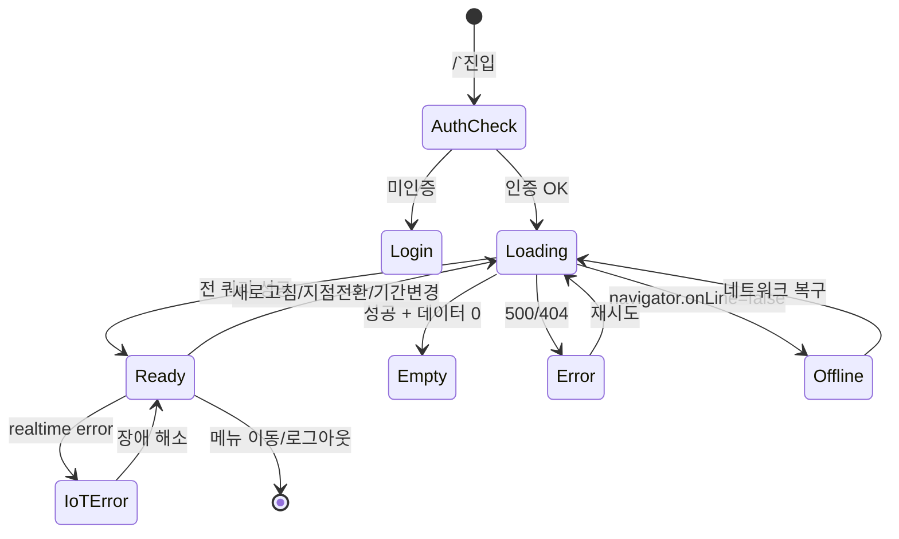

# SCR-101 대시보드 통합 — 기본화면 (마스터)

> 이 문서는 **화면 마스터 스펙**입니다. `01~06` 상태 문서는 이 문서를 상속(override/delta)합니다.
> 🚨 **SCR-090 지점 대시보드와 동일 개념**: 체크리스트 상 `SCR-101 대시보드통합`은 로그인 후 첫 진입하는 **지점 단위 대시보드**(`/`)이며, SCR-090과 1:1 대응된다. 전 지점 통합 뷰는 SCR-091 슈퍼 대시보드(`/super-dashboard`) 별도.
> 🚨 **멀티테넌트**: `branchId` 컨텍스트로 데이터 필터링. 8개 역할(`superAdmin/primary/owner/manager/fc/trainer/staff/front`)이 각각 다른 뷰를 본다.

---

## 0. 메타 & 원천 참조

| 항목 | 값 |
|------|----|
| 화면 ID | SCR-101 |
| 화면명 | 대시보드 통합 (지점 대시보드) |
| 별칭 | "홈 대시보드", "지점 대시보드", SCR-090과 동일 개념 |
| 도메인 | D01-공통 |
| 경로 | `/` (루트) |
| Next.js Route Group | `(dashboard)` |
| 파일 경로 | `src/app/(dashboard)/page.tsx` |
| 페이지 컴포넌트 | `DashboardPage` |
| 역할 | `superAdmin`, `primary`, `owner`, `manager`, `fc`, `trainer`, `staff`, `front` (전 역할, 뷰 상이) |
| 우선순위 | P0 (로그인 후 첫 화면) |
| 플랫폼 | 데스크톱(우선) / 태블릿 / 모바일 |
| 멀티테넌트 | ✅ `branchId` 컨텍스트로 데이터 필터링 |
| i18n | ko-KR |

### 원천 문서 링크
| 문서 | 경로 | 섹션 |
|---|---|---|
| 화면설계서 공통 | `docs/화면설계서/공통.md` | §3 공통 UI, §5 네비게이션, §7 접근성, §8 컴포넌트 카탈로그 |
| 화면설계서 본사관리 | `docs/화면설계서/본사관리.md` | §SCR-090 본사 대시보드(지점 대시보드와 동일 구조) |
| 기능명세서 본사관리 | `docs/기능명세서/본사관리.md` | §1. 대시보드 (`/`) |
| 에러코드정의서 | `docs/에러코드정의서.md` | §공통 E401001~E500001 |
| KPI 정의서 | `docs/KPI_정의서.md` | §지점 KPI |
| 상태전이도 | `docs/상태전이도.md` | §회원 상태 (위젯 배지) |
| 다이어그램 F1 진입 | `docs/다이어그램/D01_공통/SCR-101_대시보드_통합/F1_진입.md` | 로그인 후 역할별 분기 |
| 다이어그램 F2 메인 | `docs/다이어그램/D01_공통/SCR-101_대시보드_통합/F2_메인.md` | 위젯/KPI 클릭 → 도메인 이동 |
| 다이어그램 F3 버튼액션 | `docs/다이어그램/D01_공통/SCR-101_대시보드_통합/F3_버튼액션.md` | 새로고침/레이아웃/내보내기/퀵액션 |
| 다이어그램 F6 상태별 | `docs/다이어그램/D01_공통/SCR-101_대시보드_통합/F6_상태별.md` | 로딩/정상/빈/에러/오프라인/IoT장애 |
| 다이어그램 F7 권한 | `docs/다이어그램/D01_공통/SCR-101_대시보드_통합/F7_권한.md` | 6역할별 분기(본 문서는 8역할 확장) |
| 다이어그램 F8 에러 | `docs/다이어그램/D01_공통/SCR-101_대시보드_통합/F8_에러.md` | 401/403/404/500/타임아웃/오프라인 |
| 권한 매트릭스 | `docs/다이어그램/10_권한매트릭스/R1_역할화면_매트릭스.md` | `/` 전 역할 접근 가능 |

---

## 1. 화면 목적 (Why)

로그인 후 진입하는 **지점 단위 통합 홈 대시보드**로, 사용자의 역할에 따라 KPI 카드·차트·리스트 위젯·감사로그 구성이 다르게 렌더된다.

- 한 지점의 운영 상태(회원/매출/출석/수업/IoT/알림)를 한 화면에서 조망.
- 로그인 직후 첫 화면이며, 역할별 퀵액션·바로가기 제공.
- 멀티테넌트: `branchId` 컨텍스트로 필터링. super/primary만 지점 전환 가능.
- IoT 장애·네트워크 오프라인 등 예외 상황을 전역 배너/배지로 명확히 안내.

---

## 2. 화면 레이아웃 (Wireframe)

### 2.1 풀뷰 골격 (데스크톱 1440px)

```
┌─────────────────────────────────────────────────────────────────────────┐
│ AppLayout                                                                │
│ ┌──Sidebar──┐ ┌──Main Content──────────────────────────────────────────┐│
│ │ FitGenie  │ │ ┌── PageHeader ─────────────────────────────────────┐ ││
│ │           │ │ │ {branchName} 대시보드    🕒 마지막 갱신: 09:30    │ ││
│ │ ■ 본사관리│ │ │ [지점▼] [기간▼] [🔄새로고침] [⚙레이아웃] [⬇엑셀]│ ││
│ │ ■ 대시보드│ │ └───────────────────────────────────────────────────┘ ││
│ │ ■ KPI센터 │ │ ┌── IoT장애 배너 (조건부) ─────────────────────────┐ ││
│ │ ■ 할일    │ │ │ ⚠ IoT 장치 3개 연결 장애가 감지되었습니다.  [상세]│ ││
│ │ ■ 회원 ▸  │ │ └───────────────────────────────────────────────────┘ ││
│ │ ■ 수업 ▸  │ │ ┌── §A. KPI 카드 그리드 (5~7개, 역할별) ──────────┐ ││
│ │ ■ 매출 ▸  │ │ │ [전체회원 +5.3%][활성][만료예정][오늘출석][매출] │ ││
│ │ ■ 상품 ▸  │ │ └───────────────────────────────────────────────────┘ ││
│ │ ■ 시설 ▸  │ │ ┌── §B. 차트 위젯 (2×2) ──────────────────────────┐ ││
│ │ ■ 직원 ▸  │ │ │ [성별 도넛]  [연령 막대]                         │ ││
│ │ ■ 영업 ▸  │ │ │ [월별 매출]  [주간 출석]                         │ ││
│ │ ■ 설정 ▸  │ │ └───────────────────────────────────────────────────┘ ││
│ │           │ │ ┌── §C. 리스트 위젯 (4열) ────────────────────────┐ ││
│ │           │ │ │ [생일자] [미수금] [홀딩] [만료예정]              │ ││
│ │           │ │ └───────────────────────────────────────────────────┘ ││
│ │           │ │ ┌── §D. 오늘 일정 / 퀵액션 ───────────────────────┐ ││
│ │           │ │ │ [수동출석] [회원등록] [수업개설]                 │ ││
│ │           │ │ └───────────────────────────────────────────────────┘ ││
│ │           │ │ ┌── §E. 최근 감사로그 (역할별 노출) ──────────────┐ ││
│ │           │ │ │ [시간] [사용자] [액션배지] [대상]                │ ││
│ │[사용자▼]  │ │ └───────────────────────────────────────────────────┘ ││
│ └───────────┘ └───────────────────────────────────────────────────────┘│
└─────────────────────────────────────────────────────────────────────────┘
```

### 2.2 영역 그리드

| 영역 | 그리드 | 비고 |
|---|---|---|
| §A KPI | `grid grid-cols-2 md:grid-cols-3 lg:grid-cols-5 gap-4` | 역할별 카드 수 다름 |
| §B 차트 | `grid grid-cols-1 lg:grid-cols-2 gap-6` | 최대 2×2 |
| §C 리스트 | `grid grid-cols-1 md:grid-cols-2 lg:grid-cols-4 gap-4` | 역할별 개수 상이 |
| §D 퀵액션 | `flex flex-wrap gap-3` | 역할별 버튼 구성 |
| §E 감사로그 | `w-full` | 테이블 레이아웃, 역할별 scope 상이 |

### 2.3 영역별 치수/역할 표

| 영역 | 위치 | 치수 | 역할 |
|---|---|---|---|
| Sidebar | 좌측 고정 | 240px(펼침) / 72px(접힘) | 네비 (SCR-102 참조) |
| PageHeader | 상단 | h-16 (64px), sticky top-0 | 제목·지점·액션 |
| IoT 배너 | PageHeader 아래 | h-auto p-3 | 조건부 |
| §A KPI | 본문 최상단 | 카드 h-28 | 지점 핵심 지표 |
| §B 차트 | KPI 아래 24px | 각 h-64~72 | 분석 차트 |
| §C 리스트 | 차트 아래 24px | 각 h-80 | 빠른 조회 리스트 |
| §D 퀵액션 | 리스트 아래 24px | h-auto | 자주 쓰는 CTA |
| §E 감사로그 | 퀵액션 아래 24px | h-auto | 운영 추적 |

---

## 3. 디자인 토큰

### 3.1 색상 (Tailwind 토큰 매핑)

| 역할 | 클래스 | Hex | 용도 |
|---|---|---|---|
| bg.page | `bg-gray-50` | #F9FAFB | 전체 배경 |
| bg.card | `bg-white rounded-xl shadow-sm ring-1 ring-gray-100` | #FFFFFF | StatCard·위젯 |
| stat.default | `bg-white text-gray-900` | — | 기본 카드 |
| stat.mint | `bg-emerald-50 text-emerald-700 ring-emerald-100` | — | 활성 회원 |
| stat.peach | `bg-orange-50 text-orange-700 ring-orange-100` | — | 매출 |
| stat.sky | `bg-sky-50 text-sky-700 ring-sky-100` | — | 출석 |
| stat.amber | `bg-amber-50 text-amber-800 ring-amber-200` | — | 경고(만료예정) |
| stat.rose | `bg-rose-50 text-rose-700 ring-rose-100` | — | 위험(미수·만료) |
| chart.primary | `#2563EB` | blue-600 | 메인 차트 |
| chart.secondary | `#10B981` | emerald-500 | 서브 |
| chart.accent | `#F59E0B` | amber-500 | 강조 |
| badge.ACTIVE | `bg-emerald-100 text-emerald-800` | — | 활성 회원 |
| badge.HOLDING | `bg-purple-100 text-purple-800` | — | 홀딩 |
| badge.EXPIRED | `bg-red-100 text-red-800` | — | 만료 |
| badge.DORMANT | `bg-slate-100 text-slate-700` | — | 휴면 |
| badge.LOGIN | `bg-emerald-100 text-emerald-700` | — | 로그인 감사 |
| badge.CREATE | `bg-blue-100 text-blue-700` | — | 생성 |
| badge.UPDATE | `bg-yellow-100 text-yellow-800` | — | 수정 |
| badge.DELETE | `bg-red-100 text-red-700` | — | 삭제 |
| delta.up | `text-emerald-600` | — | +N% |
| delta.down | `text-rose-600` | — | -N% |
| delta.zero | `text-gray-500` | — | 0% |
| iot.banner | `bg-orange-50 border border-orange-200 text-orange-800` | — | IoT 장애 경고 |
| offline.banner | `bg-slate-100 border border-slate-300 text-slate-700` | — | 오프라인 |
| error.banner | `bg-red-50 border border-red-200 text-red-700` | — | API 에러 |

### 3.2 타이포그래피

| 토큰 | 스타일 | 용도 |
|---|---|---|
| page.title | `text-2xl font-bold tracking-tight text-gray-900` | "{branchName} 대시보드" |
| page.subtitle | `text-sm text-gray-500` | 마지막 갱신 시간 |
| stat.label | `text-xs uppercase tracking-wide font-medium text-gray-500` | 카드 라벨 |
| stat.value | `text-3xl font-bold tabular-nums text-gray-900` | 카드 값 |
| stat.unit | `text-base text-gray-500 ml-1` | 단위("명", "원") |
| stat.delta | `text-xs font-medium` | +5.3% ↑ |
| widget.title | `text-sm font-semibold text-gray-900` | 위젯 제목 |
| widget.empty | `text-sm text-gray-400 italic` | 빈 상태 |
| audit.time | `text-xs text-gray-500 tabular-nums` | 감사로그 시간 |
| audit.actor | `text-sm text-gray-900` | 감사로그 액터 |

### 3.3 간격/반경/그림자

| 토큰 | 값 |
|---|---|
| card.radius | `rounded-xl` (12px) |
| card.padding | `p-5` (20px) |
| card.gap | `gap-4` / `gap-6` |
| section.gap | `space-y-6` (24px) |
| page.padding | `p-6 lg:p-8` |
| shadow.card | `shadow-sm ring-1 ring-gray-100` |

### 3.4 모션

| 토큰 | 값 |
|---|---|
| card.enter | `animate-[fadeInUp_150ms_ease-out]` |
| skeleton | `animate-pulse` |
| refresh.icon | `animate-spin` (로딩 중) |
| chart.render | stagger 100ms draw-in |
| reduced-motion | `prefers-reduced-motion`: 모든 애니메이션 비활성 |

---

## 4. 반응형 규칙

| BP | 폭 | §A KPI | §B 차트 | §C 리스트 | Sidebar | Header |
|---|---|---|---|---|---|---|
| Mobile <640 | 100% | 2열 | 1열 세로 | 1열 세로 | 드로어(슬라이드) | 축약, 액션 더보기 메뉴 |
| Tablet 640~1024 | 100% | 3열 | 2열 | 2열 | 축약(아이콘) 또는 드로어 | 정상 |
| Desktop ≥1024 | sidebar+main | 5열(역할별 4~7) | 2열 | 4열 | 펼침(240px) | 정상 |
| XL ≥1440 | max container | 5~7열 | 2열 | 4열 | 펼침(240px) | 고정 |

- 모바일: PageHeader `sticky top-0 z-20 bg-gray-50/95 backdrop-blur`
- 모바일 IoT 배너: `truncate` + "상세" 링크만
- 태블릿 이하: 지점 드롭다운은 햄버거 메뉴 안쪽으로

---

## 5. 🔐 역할별(RBAC) 뷰 매트릭스 — 핵심

> `●` = 표시+CRUD/이동 가능, `○` = 표시만(읽기), `—` = 미표시
> 멀티테넌트 범위: `superAdmin/primary`만 지점 전환 가능, 그 외는 본인 지점 고정

### 5.1 역할 × 요소 매트릭스

| 요소 | superAdmin | primary | owner | manager | fc | trainer | staff | front |
|---|:---:|:---:|:---:|:---:|:---:|:---:|:---:|:---:|
| **페이지 접근** | ● | ● | ● | ● | ● | ●(→/calendar 옵션) | ● | ●(→/attendance 옵션) |
| **지점 전환 드롭다운** | ●(전 지점) | ●(브랜드 하위) | △(다지점 소유 시) | — | — | — | — | — |
| **기간 필터** | ● | ● | ● | ● | ● | ● | ● | ● |
| **새로고침 버튼** | ● | ● | ● | ● | ● | ● | ● | ● |
| **레이아웃 설정** | ● | ● | ● | ● | — | — | — | — |
| **엑셀 내보내기** | ● | ● | ● | ● | — | — | — | — |
| **IoT 장애 배너** | ● | ● | ● | ● | ○ | ○ | ○ | ○ |
| **§A KPI 카드** | | | | | | | | |
| ① 전체 회원 | ● | ● | ● | ● | ● | ○(담당만) | ○ | ○ |
| ② 활성 회원 | ● | ● | ● | ● | ● | ○ | ○ | ○ |
| ③ 만료 예정 | ● | ● | ● | ● | ● | ○ | — | — |
| ④ 오늘 출석 | ● | ● | ● | ● | ● | ● | ● | ● |
| ⑤ 이번달 매출 | ● | ● | ● | ○ | — | — | — | — |
| ⑥ 신규 가입(이번달) | ● | ● | ● | ● | ● | — | — | — |
| ⑦ 미수금 총액 | ● | ● | ● | ○ | — | — | — | — |
| **§B 차트 위젯** | | | | | | | | |
| 성별 분포 | ● | ● | ● | ● | ● | ○ | ○ | ○ |
| 연령대 분포 | ● | ● | ● | ● | ● | ○ | ○ | ○ |
| 월별 매출 추이 | ● | ● | ● | ○ | — | — | — | — |
| 주간 출석 현황 | ● | ● | ● | ● | ● | ● | ● | ● |
| **§C 리스트 위젯** | | | | | | | | |
| 생일자 회원 | ● | ● | ● | ● | ● | ○ | ● | ● |
| 미수금 회원 | ● | ● | ● | ● | ○ | — | — | — |
| 홀딩 회원 | ● | ● | ● | ● | ● | ○ | ○ | — |
| 만료예정 회원 | ● | ● | ● | ● | ● | ○ | — | — |
| **§D 퀵액션** | | | | | | | | |
| 수동 출석 | ● | ● | ● | ● | ● | ● | ● | ● |
| 회원 등록 | ● | ● | ● | ● | ● | — | — | — |
| 수업 개설 | ● | ● | ● | ● | — | ● | — | — |
| **§E 감사로그** | ●(전지점·전이벤트) | ●(브랜드 하위) | ○(본인지점) | ○(본인지점 일부) | — | — | — | — |
| 위젯 항목 클릭 → 회원 상세 | ● | ● | ● | ● | ● | ●(담당만) | ○ | — |
| "전체보기" 링크 | ● | ● | ● | ●(일부) | ●(일부) | — | — | — |

### 5.2 역할별 요약

```
┌──── superAdmin / primary — "통합 관리자 뷰" ────┐
│ KPI 5~7개 전부 + 전월대비 %                      │
│ 차트 4개 전부                                    │
│ 리스트 4개 전부                                  │
│ 퀵액션 3개 전부                                  │
│ 감사로그: 전 지점·전 이벤트(super)               │
│ 지점 전환 드롭다운 노출                          │
└─────────────────────────────────────────────────┘
┌──── owner — "센터장 뷰" ────┐
│ 본인 지점(또는 다지점 소유 시 전환)              │
│ KPI 5~7개, 차트 4개, 리스트 4개, 퀵액션 3개      │
│ 감사로그: 본인 지점                              │
└─────────────────────────────────────────────────┘
┌──── manager — "운영 매니저 뷰" ────┐
│ KPI 5~6개(매출 읽기), 차트 4개(매출 read-only)   │
│ 리스트 4개, 퀵액션 3개                           │
│ 감사로그: 본인 지점 일부                         │
└─────────────────────────────────────────────────┘
┌──── fc — "상담 중심 뷰" ────┐
│ KPI 5개(매출 제거), 차트 3개(매출 제거)          │
│ 리스트 4개, 퀵액션 2개(수동출석·회원등록)        │
│ 감사로그: 미표시                                 │
└─────────────────────────────────────────────────┘
┌──── trainer — "수업 중심 뷰" ────┐
│ 옵션 A: /calendar 리다이렉트                     │
│ 옵션 B: 담당 회원 간소 대시보드(KPI 2, 차트 2)   │
│ 리스트 2개(만료담당·홀딩담당), 퀵액션 2개        │
└─────────────────────────────────────────────────┘
┌──── staff — "스탭 뷰" (읽기 위주) ────┐
│ KPI 3개(회원·활성·오늘출석), 차트 3개            │
│ 리스트 2개(생일자·홀딩), 퀵액션 1개(수동출석)    │
└─────────────────────────────────────────────────┘
┌──── front — "프론트(데스크) 뷰" ────┐
│ 옵션: /attendance 리다이렉트                     │
│ 본 화면 노출 시: KPI 3(출석·생일·주간), 차트 1   │
│ 리스트 1개(생일자), 퀵액션 1개(수동출석)         │
└─────────────────────────────────────────────────┘
```

### 5.3 역할 판별 유틸 (예시)

```ts
type Role = 'superAdmin' | 'primary' | 'owner' | 'manager' | 'fc' | 'trainer' | 'staff' | 'front';

export const canSeeRevenue   = (r: Role) => ['superAdmin','primary','owner','manager'].includes(r);
export const canSeeAuditLog  = (r: Role) => ['superAdmin','primary','owner','manager'].includes(r);
export const canSwitchBranch = (r: Role, ownedCount = 1) =>
  ['superAdmin','primary'].includes(r) || (r === 'owner' && ownedCount > 1);
export const canExportExcel  = (r: Role) => ['superAdmin','primary','owner','manager'].includes(r);
export const canCustomizeLayout = (r: Role) => ['superAdmin','primary','owner','manager'].includes(r);
export const isReadOnly = (r: Role) => ['staff','front','trainer'].includes(r);
```

---

## 6. 컴포넌트 트리

```
<AppLayout role={user.role}>
  <Sidebar menu={getMenuForRole(role)} />       {/* SCR-102 */}
  <MainContent>
    <PageHeader title={`${branchName} 대시보드`}
                subtitle={`마지막 갱신: ${formatKST(updatedAt,'HH:mm')}`}>
      {canSwitchBranch(role) && <BranchSwitcher value={branchId} onChange={switchBranch} />}
      <PeriodFilter value={period} onChange={setPeriod} />  {/* today | week | month */}
      <RefreshButton onClick={refetchAll} loading={isRefetching} disabled={cooldown>0} />
      {canCustomizeLayout(role) && <LayoutButton onClick={openLayoutPanel} />}
      {canExportExcel(role) && <ExportExcelButton onClick={exportKpi} />}
    </PageHeader>

    {iotError && canSeeIotBanner(role) && (
      <IoTAlertBanner count={iotErrorCount} onClose={dismissIotBanner} />
    )}

    {/* §A KPI */}
    <section aria-label="주요 지표"
             className="grid grid-cols-2 md:grid-cols-3 lg:grid-cols-5 gap-4">
      {KPI_FOR_ROLE[role].map(card => (
        <StatCard key={card.id} {...card}
          loading={stats.isLoading}
          value={stats.data?.[card.key]}
          delta={calcDelta(stats.data?.[card.key], stats.data?.[card.prevKey])}
          onClick={card.href ? () => moveToPage(card.href) : undefined}
          readOnly={card.readOnly} />
      ))}
    </section>

    {/* §B 차트 */}
    <section aria-label="분석 차트"
             className="grid grid-cols-1 lg:grid-cols-2 gap-6">
      {canSeeWidget('gender',role)   && <GenderDonutWidget   q={genderQ} />}
      {canSeeWidget('age',role)      && <AgeBarWidget        q={ageQ} />}
      {canSeeRevenue(role)           && <RevenueLineWidget   q={revenueQ} readOnly={role==='manager'} />}
      {canSeeWidget('weekly',role)   && <WeeklyAttendanceBar q={weeklyQ} />}
    </section>

    {/* §C 리스트 위젯 */}
    <section aria-label="회원 위젯"
             className="grid grid-cols-1 md:grid-cols-2 lg:grid-cols-4 gap-4">
      {canSeeWidget('birthday',role) && <BirthdayWidget  q={birthdayQ} onClick={goToMember} />}
      {canSeeWidget('unpaid',role)   && <UnpaidWidget    q={unpaidQ}   onClick={goToMember} />}
      {canSeeWidget('holding',role)  && <HoldingWidget   q={holdingQ}  onClick={goToMember} />}
      {canSeeWidget('expiring',role) && <ExpiringWidget  q={expiringQ} onClick={goToMember} />}
    </section>

    {/* §D 퀵액션 */}
    <section aria-label="퀵액션" className="flex flex-wrap gap-3">
      {QUICK_ACTIONS_FOR_ROLE[role].map(qa => (
        <QuickActionButton key={qa.id} {...qa} onClick={() => moveToPage(qa.href)} />
      ))}
    </section>

    {/* §E 감사로그 */}
    {canSeeAuditLog(role) && (
      <section aria-label="최근 활동 로그">
        <AuditLogList q={auditQ}
                      scope={['superAdmin','primary'].includes(role) ? 'all' : 'branch'} />
      </section>
    )}
  </MainContent>
</AppLayout>
```

### 6.1 핵심 컴포넌트

| 컴포넌트 | 파일 | 핵심 Props |
|---|---|---|
| `StatCard` | `src/components/common/StatCard.tsx` | `{label, value, unit, variant, icon, delta, onClick, readOnly, loading}` |
| `BranchSwitcher` | `src/components/layout/BranchSwitcher.tsx` | `{value, branches, onChange}` |
| `PeriodFilter` | `src/components/dashboard/PeriodFilter.tsx` | `{value:'today'\|'week'\|'month', onChange}` |
| `RefreshButton` | `src/components/ui/RefreshButton.tsx` | `{onClick, loading, disabled}` |
| `LayoutButton` | `src/components/dashboard/LayoutButton.tsx` | `{onClick}` |
| `ExportExcelButton` | `src/components/common/ExportExcelButton.tsx` | `{onClick, loading}` |
| `IoTAlertBanner` | `src/components/dashboard/IoTAlertBanner.tsx` | `{count, onClose}` |
| `GenderDonutWidget` | `src/components/dashboard/GenderDonutWidget.tsx` | `{q}` |
| `AgeBarWidget` | `src/components/dashboard/AgeBarWidget.tsx` | `{q}` |
| `RevenueLineWidget` | `src/components/dashboard/RevenueLineWidget.tsx` | `{q, readOnly}` |
| `WeeklyAttendanceBar` | `src/components/dashboard/WeeklyAttendanceBar.tsx` | `{q}` |
| `BirthdayWidget` | `src/components/dashboard/BirthdayWidget.tsx` | `{q, onClick}` |
| `UnpaidWidget` | `src/components/dashboard/UnpaidWidget.tsx` | `{q, onClick}` |
| `HoldingWidget` | `src/components/dashboard/HoldingWidget.tsx` | `{q, onClick}` |
| `ExpiringWidget` | `src/components/dashboard/ExpiringWidget.tsx` | `{q, onClick}` |
| `QuickActionButton` | `src/components/dashboard/QuickActionButton.tsx` | `{label, icon, href, variant}` |
| `AuditLogList` | `src/components/dashboard/AuditLogList.tsx` | `{q, scope:'all'\|'branch'}` |
| `ActionBadge` | `src/components/common/ActionBadge.tsx` | `{action:AuditAction}` |

---

## 7. 데이터 계약

### 7.1 타입

```ts
// src/types/dashboard.ts
export interface DashboardStats {
  totalMembers: number;
  activeMembers: number;
  expiringCount: number;       // 30일 이내 만료예정
  expiredMembers: number;
  todayAttendance: number;
  monthlyRevenue: number;
  newMembers: number;          // 이번달 신규
  unpaidTotal: number;
  // 변화율 계산용 전월/전일 값
  prevMonthTotalMembers: number;
  prevMonthRevenue: number;
  prevDayAttendance: number;
}
export interface GenderDist   { male: number; female: number; }
export interface AgeDist      { label: string; value: number; color: string; }
export interface MonthlyRevenue { month: string; value: number; }
export interface WeeklyAttendance { day: string; count: number; }
export interface BirthdayMember  { id: number; name: string; birth: string; status: string; }
export interface UnpaidMember    { id: number; name: string; amount: number; item: string; overdueDays: number; }
export interface HoldingMember   { id: number; name: string; period: string; remaining: number; }
export interface ExpiringMember  { id: number; name: string; expiry: string; dday: string; ddayNum: number; }
export interface AuditLog {
  id: number; createdAt: string;
  action: 'LOGIN'|'LOGOUT'|'LOGIN_FAILED'|'CREATE'|'UPDATE'|'DELETE'|'BRANCH_SWITCH'|'ROLE_CHANGE';
  targetType: string; targetId: string|number;
  userName: string; userRole: Role;
  branchId?: number; branchName?: string;
}
export interface IoTDeviceStatus { deviceId: string; status: 'ok'|'error'|'offline'; lastSeen: string; }
```

### 7.2 API 엔드포인트 (병렬 호출)

| 엔드포인트 | 메서드 | 파라미터 | 반환 |
|---|---|---|---|
| `GET /dashboard/stats` | GET | `{branchId?, period}` | `DashboardStats` |
| `GET /dashboard/gender` | GET | `{branchId?}` | `GenderDist` |
| `GET /dashboard/age` | GET | `{branchId?}` | `AgeDist[]` |
| `GET /dashboard/monthly-revenue` | GET | `{branchId?, months=6}` | `MonthlyRevenue[]` |
| `GET /dashboard/weekly-attendance` | GET | `{branchId?}` | `WeeklyAttendance[]` |
| `GET /dashboard/widgets/birthdays` | GET | `{branchId?, date=today}` | `BirthdayMember[]` |
| `GET /dashboard/widgets/unpaid` | GET | `{branchId?}` | `UnpaidMember[]` |
| `GET /dashboard/widgets/holding` | GET | `{branchId?}` | `HoldingMember[]` |
| `GET /dashboard/widgets/expiring` | GET | `{branchId?, days=30}` | `ExpiringMember[]` |
| `GET /audit-log` | GET | `{branchId?, limit=10}` | `AuditLog[]` |
| `GET /iot/status` | GET | `{branchId}` | `{errorCount:number, offlineCount:number, devices:IoTDeviceStatus[]}` |
| `POST /system/daily-sync` | POST | `{branchId}` | 진입 시 1회, EXPIRED 자동 전환 |
| `POST /dashboard/export-excel` | POST | `{branchId?, period, section}` | file stream |

### 7.3 상태 관리

- **Store**: `useAuthStore` (user/role/branchId), `useBranchStore`(current/list), `useDashboardStore`(period/layout)
- **Fetching**: React Query `useQueries`로 병렬. 각 위젯 독립 `isLoading/error`
- **Cache**: `staleTime: 60_000`, `refetchOnWindowFocus: true`
- **Realtime**: Supabase channel `iot_devices` 구독 → `isIotError` 자동 갱신
- **Persistence**: `레이아웃 설정`은 `localStorage['dashboard.layout.v1']`
- **Polling**: 오늘 출석 카드만 60초 주기

### 7.4 멀티테넌트 branchId 규칙

1. URL `?branch=<id>` 있고 접근 권한 있으면 우선
2. `useBranchStore.current`
3. `user.branchId` (단일 지점 역할)
4. super/primary가 미선택 시: 최근 지점 or 첫 지점 기본 세팅 (전체 `null`은 SCR-091에서만 허용)

서버는 jwt의 role/branchId로 스코프 강제 (클라 필터는 UX용).

---

## 8. 비즈니스 룰

### 8.1 공통

1. **로그인 후 리다이렉트**: SCR-100 §7 표에 따라 `trainer→/calendar`, `front→/attendance` 가능(옵션).
2. **일일 동기화**: 진입 시 1회 `runDailySync()` 호출(세션 guard). 이용권 만료 임박 자동 전환.
3. **매출 포맷**: 1억+ `"X.X억"`, 1천만+ `"N,NNN만"`, 그 외 `"N,NNN,NNN원"` (utils `formatAmount`).
4. **숫자 포맷**: `Intl.NumberFormat('ko-KR')` + 단위("명","건").
5. **갱신 시간**: `마지막 갱신: HH:mm` KST.
6. **새로고침**: 전 쿼리 refetch + `runDailySync`. 60초 쿨다운.

### 8.2 멀티테넌트/권한

7. `canSwitchBranch(role)` false면 BranchSwitcher 미렌더.
8. super/primary 지점 전환: 전역 `branchId` 변경 + URL `?branch=` + 전 위젯 refetch + toast.
9. URL 조작으로 권한 없는 branchId → 서버 403 → `/forbidden` 리다이렉트.
10. `isReadOnly(role)` 역할은 위젯 항목 클릭 비활성 (cursor-default). 클릭 시 toast "읽기 전용 계정입니다".
11. `canExportExcel(role)` false 역할이 엑셀 버튼 클릭 시 권한없음 토스트.
12. `canCustomizeLayout(role)` false 역할은 레이아웃 버튼 미렌더.

### 8.3 위젯

13. **만료 예정**: `오늘 ≤ membershipExpiry ≤ 오늘+30일 AND status='ACTIVE'`.
14. **생일자**: `MM-DD` 일치 + 활성 상태.
15. **홀딩**: `status='HOLDING'` + 남은 기간(일) 계산.
16. **미수금**: `unpaidAmount > 0 AND overdueDays ≥ 1`.
17. **위젯 상한**: 각 5건, "전체보기" 클릭 시 필터 메뉴로 이동.

### 8.4 감사로그

18. 최신 10건. 클릭 시 `/audit-log?id=...` 이동.
19. `super/primary`는 전 지점·전 이벤트, `owner` 이하는 본인 지점·일부.

### 8.5 IoT

20. Supabase realtime `iot_devices.status` 구독. 장애 감지 시 배너 표시.
21. 장애 해소 시 realtime으로 배너 자동 제거.
22. 닫기(X)는 `sessionStorage['iot.banner.dismissed']=true` 저장(세션 1회).
23. IoT 기능 미사용 지점은 `isIotError=false` 상시 (배너 미표시).

### 8.6 레이아웃 설정

24. 위젯 순서/표시 여부 커스터마이즈. `localStorage['dashboard.layout.v1']` 저장.
25. 기본값 복원 버튼 제공.
26. 모바일에서는 레이아웃 버튼 미노출(고정 순서).

### 8.7 접근성 / i18n

27. 모든 section `aria-label` 필수.
28. 차트: `aria-describedby` 또는 sr-only `<table>`로 데이터 제공.
29. 현재 ko-KR, 금액 KRW `₩`.

---

## 9. 상태 목록

| 파일 | 상태 코드 | 한글 | 트리거 |
|---|---|---|---|
| `01-로딩.md` | `dashboard-loading` | 로딩(스켈레톤) | 진입 직후, 모든 API pending |
| `02-정상.md` | `dashboard-ready` | 정상 | 모든 쿼리 수신 완료 |
| `03-빈상태.md` | `dashboard-empty` | 빈 상태 | 신규 지점/데이터 없음 |
| `04-에러.md` | `dashboard-error` | 에러 | API 실패(500/404) |
| `05-오프라인.md` | `dashboard-offline` | 오프라인 | `navigator.onLine=false` |
| `06-IoT장애.md` | `dashboard-iot-error` | IoT 장애 감지 | realtime iot error |

상태 전이 그래프: `docs/다이어그램/D01_공통/SCR-101_대시보드_통합/F6_상태별.md`.

---

## 10. 에러 코드 매핑

| errorCode | HTTP | 시나리오 | 표시 | 대응 |
|---|---|---|---|---|
| E401002 | 401 | JWT 만료 | DLG-000 세션만료 모달 → `/login?redirect=/` | 자동 |
| E401003 | 401 | JWT 무효 | 로그인 리다이렉트 | 자동 |
| E403001 | 403 | 권한 없음 | `/forbidden` 또는 개별 토스트 | 리다이렉트 |
| E403003 | 403 | 지점 접근 제한 | `/forbidden` | 리다이렉트 |
| E404xxx | 404 | 개별 API 데이터 없음 | 해당 위젯 빈 상태 | 부분 렌더 |
| E500001 | 500 | 서버 오류 | 전역 에러 배너 + 재시도 | `04-에러` |
| E503001 | 503 | 서비스 점검 | warn 배너 + 자동 폴링 | warn 톤 |
| NETWORK | — | 오프라인 | `05-오프라인` 배너 + 캐시 fallback | SW 캐시 |
| IOT_ERROR | — | IoT 장애 realtime | `06-IoT장애` 오렌지 배너 | realtime |

부분 실패 허용(Fault Tolerance): 개별 위젯 `ErrorBoundary` + `WidgetError` fallback.

---

## 11. 접근성 (WCAG 2.1 AA)

| 항목 | 요구사항 |
|---|---|
| Landmark | `<main role="main">` + section별 `aria-label` |
| StatCard | `role="group" aria-labelledby` + 값 `aria-live="polite"` |
| 차트 | sr-only `<table>`로 값 병행 제공. 라이브러리 접근성 플러그인 활성 |
| 위젯 빈 상태 | `role="status"` + 한국어 설명 |
| 지점 드롭다운 | combobox 또는 `<select>` |
| 포커스 순서 | Header → 지점/기간 → KPI → 차트 → 위젯 → 퀵액션 → 감사로그 |
| 키보드 | Enter=StatCard 클릭, Space=체크박스, Esc=드롭다운 닫기 |
| 포커스 링 | `focus-visible:ring-2 ring-blue-500 ring-offset-2` |
| 모션 감소 | `prefers-reduced-motion`: 차트 stagger/애니메이션 비활성 |
| 읽기 전용 | `aria-disabled="true"` + toast "읽기 전용 계정입니다" |

---

## 12. 진입 / 이탈 연결

### 진입

- SCR-100 로그인 성공 후 역할별 분기 (super/primary → `/super-dashboard`도 선택 가능, 일반 역할은 `/`)
- 사이드바 "대시보드" 클릭 (SCR-102)
- 에러/권한 페이지에서 "대시보드로 이동" 버튼
- SCR-108 에러 페이지의 fallback

### 이탈

| 액션 | 목적지 |
|---|---|
| KPI 카드 클릭 | `/members?filter=...`, `/sales`, `/attendance` 등 |
| 위젯 항목 클릭 | `/members/detail?id={id}` |
| "전체보기" | `/members`, `/unpaid`, `/holding`, `/members?filter=expiring` |
| 퀵액션 | `/attendance` (수동출석), `/members/new`, `/classes/new` |
| IoT 배너 "상세" | `/iot` (SCR-I003) |
| 미처리 알림 배지 | `/notifications` (SCR-104) |
| 지점 전환 | `?branch=id` URL 갱신, 페이지 유지 |
| 사이드바 메뉴 | 역할별 접근 가능 경로 |
| DLG-000 (401) | `/login?redirect=/` |

---

## 13. 다이어그램 통합 뷰



---

## 14. 🧩 바이브코딩 프롬프트 (마스터)

```
Next.js 15 App Router + TypeScript + Tailwind + React Query + Supabase 기반
'use client' 컴포넌트를 작성하라.

━━ 화면: SCR-101 대시보드 통합 (지점 대시보드, 멀티테넌트, 8역할 분기) ━━
파일: src/app/(dashboard)/page.tsx
보조:
- src/components/common/{StatCard, ExportExcelButton, ActionBadge}.tsx
- src/components/dashboard/{GenderDonutWidget, AgeBarWidget, RevenueLineWidget,
   WeeklyAttendanceBar, BirthdayWidget, UnpaidWidget, HoldingWidget, ExpiringWidget,
   AuditLogList, IoTAlertBanner, PeriodFilter, LayoutButton, QuickActionButton}.tsx
- src/components/layout/BranchSwitcher.tsx
- src/components/ui/RefreshButton.tsx
- src/hooks/useDashboard.ts (React Query 훅)
- src/hooks/useIoTStatus.ts (Supabase realtime 구독)
- src/lib/role-access.ts (canSee*/canExport*/isReadOnly/KPI_FOR_ROLE/QUICK_ACTIONS_FOR_ROLE)

━━ 멀티테넌트 핵심 ━━
- user.role에 따라 8가지 뷰 (superAdmin|primary|owner|manager|fc|trainer|staff|front)
- super/primary만 BranchSwitcher, 전환 시 URL ?branch= + 전체 refetch
- URL ?branch= > useBranchStore.current > user.branchId
- 서버는 jwt role/branchId로 스코프 강제

━━ 레이아웃 ━━
<AppLayout role={user.role}>
  <main className="min-h-screen bg-gray-50">
    <div className="p-6 lg:p-8 space-y-6">
      <header className="flex items-center justify-between flex-wrap gap-3">
        <div>
          <h1 className="text-2xl font-bold tracking-tight text-gray-900">
            {branchName} 대시보드
          </h1>
          <p className="text-sm text-gray-500">
            마지막 갱신: {formatKST(updatedAt,'HH:mm')}
          </p>
        </div>
        <div className="flex items-center gap-2 flex-wrap">
          {canSwitchBranch(role) && <BranchSwitcher value={branchId} onChange={switchBranch} />}
          <PeriodFilter value={period} onChange={setPeriod} />
          <RefreshButton onClick={refetchAll} loading={isRefetching} disabled={cooldown>0} />
          {canCustomizeLayout(role) && <LayoutButton onClick={openLayoutPanel} />}
          {canExportExcel(role) && <ExportExcelButton onClick={() => exportKpi(branchId, period)} />}
        </div>
      </header>

      {iotError && !iotBannerDismissed && (
        <IoTAlertBanner count={iotErrorCount} onClose={dismissIotBanner} />
      )}

      <section aria-label="주요 지표"
               className="grid grid-cols-2 md:grid-cols-3 lg:grid-cols-5 gap-4">
        {KPI_FOR_ROLE[role].map(c => (
          <StatCard key={c.id} {...c}
            loading={stats.isLoading}
            value={formatValue(stats.data?.[c.key], c.format)}
            delta={calcDelta(stats.data?.[c.key], stats.data?.[c.prevKey], c.deltaLabel)}
            onClick={c.href ? () => moveToPage(c.href) : undefined}
            readOnly={isReadOnly(role) || c.readOnly} />
        ))}
      </section>

      <section aria-label="분석 차트"
               className="grid grid-cols-1 lg:grid-cols-2 gap-6">
        {canSeeWidget('gender',role)   && <GenderDonutWidget   q={genderQ} />}
        {canSeeWidget('age',role)      && <AgeBarWidget        q={ageQ} />}
        {canSeeRevenue(role)           && <RevenueLineWidget   q={revenueQ} readOnly={role==='manager'} />}
        {canSeeWidget('weekly',role)   && <WeeklyAttendanceBar q={weeklyQ} />}
      </section>

      <section aria-label="회원 위젯"
               className="grid grid-cols-1 md:grid-cols-2 lg:grid-cols-4 gap-4">
        {canSeeWidget('birthday',role) && <BirthdayWidget q={birthdayQ} onClick={goToMember} />}
        {canSeeWidget('unpaid',role)   && <UnpaidWidget   q={unpaidQ}   onClick={goToMember} />}
        {canSeeWidget('holding',role)  && <HoldingWidget  q={holdingQ}  onClick={goToMember} />}
        {canSeeWidget('expiring',role) && <ExpiringWidget q={expiringQ} onClick={goToMember} />}
      </section>

      <section aria-label="퀵액션" className="flex flex-wrap gap-3">
        {QUICK_ACTIONS_FOR_ROLE[role].map(qa => (
          <QuickActionButton key={qa.id} label={qa.label} icon={qa.Icon}
                             onClick={() => moveToPage(qa.href)}
                             variant={qa.variant} />
        ))}
      </section>

      {canSeeAuditLog(role) && (
        <section aria-label="최근 활동 로그">
          <AuditLogList q={auditQ}
                        scope={['superAdmin','primary'].includes(role) ? 'all' : 'branch'} />
        </section>
      )}
    </div>
  </main>
</AppLayout>

━━ role-access.ts 스니펫 ━━
export const KPI_FOR_ROLE: Record<Role, KpiConfig[]> = {
  superAdmin: [KPI.totalMembers, KPI.activeMembers, KPI.expiring, KPI.todayAttendance, KPI.monthlyRevenue, KPI.newMembers, KPI.unpaidTotal],
  primary:    [KPI.totalMembers, KPI.activeMembers, KPI.expiring, KPI.todayAttendance, KPI.monthlyRevenue, KPI.newMembers, KPI.unpaidTotal],
  owner:      [KPI.totalMembers, KPI.activeMembers, KPI.expiring, KPI.todayAttendance, KPI.monthlyRevenue, KPI.newMembers, KPI.unpaidTotal],
  manager:    [KPI.totalMembers, KPI.activeMembers, KPI.expiring, KPI.todayAttendance, KPI.monthlyRevenueRO, KPI.newMembers],
  fc:         [KPI.totalMembers, KPI.activeMembers, KPI.expiring, KPI.todayAttendance, KPI.newMembers],
  trainer:    [KPI.myMembers, KPI.todayAttendance],
  staff:      [KPI.totalMembers, KPI.activeMembers, KPI.todayAttendance],
  front:      [KPI.todayAttendance, KPI.birthdayCount, KPI.weeklyAttendance],
};

export const QUICK_ACTIONS_FOR_ROLE: Record<Role, QuickAction[]> = {
  superAdmin: [QA.attendance, QA.memberNew, QA.classNew],
  primary:    [QA.attendance, QA.memberNew, QA.classNew],
  owner:      [QA.attendance, QA.memberNew, QA.classNew],
  manager:    [QA.attendance, QA.memberNew, QA.classNew],
  fc:         [QA.attendance, QA.memberNew],
  trainer:    [QA.attendance, QA.classNew],
  staff:      [QA.attendance],
  front:      [QA.attendance],
};

━━ 디자인 토큰 (정확히 이 값 사용) ━━
bg.page:  bg-gray-50
card:     bg-white rounded-xl shadow-sm ring-1 ring-gray-100 p-5
stat.label: text-xs uppercase tracking-wide font-medium text-gray-500
stat.value: text-3xl font-bold tabular-nums text-gray-900
stat.unit:  text-base text-gray-500 ml-1
stat.delta.up:   text-emerald-600 text-xs font-medium
stat.delta.down: text-rose-600 text-xs font-medium
widget.title: text-sm font-semibold text-gray-900 mb-3
iot.banner:   flex items-start gap-3 rounded-lg border border-orange-200
              bg-orange-50 p-3 text-sm text-orange-800
offline.banner: flex items-center gap-2 rounded-lg border border-slate-300
                bg-slate-100 p-3 text-sm text-slate-700
error.banner:   flex items-start gap-2 rounded-lg border border-red-200
                bg-red-50 p-3 text-sm text-red-700
badge.ACTIVE:  bg-emerald-100 text-emerald-800 text-xs px-2 py-0.5 rounded-full
badge.HOLDING: bg-purple-100 text-purple-800 text-xs px-2 py-0.5 rounded-full
badge.EXPIRED: bg-red-100 text-red-800 text-xs px-2 py-0.5 rounded-full
chart.primary:#2563EB chart.secondary:#10B981 chart.accent:#F59E0B

━━ 데이터 훅 ━━
useDashboard(branchId, period) → {
  stats, gender, age, monthlyRevenue, weeklyAttendance,
  birthdays, unpaid, holding, expiring, auditLogs,
  isLoading, isRefetching, refetchAll, errors
}
- React Query useQueries 병렬 발사
- staleTime: 60_000, refetchOnWindowFocus: true
- refetchAll(): invalidate + runDailySync

useIoTStatus(branchId) → {
  isIotError, iotErrorCount, devices
}
- Supabase channel.on('postgres_changes', { table:'iot_devices' }, ...)
- initial fetch: GET /iot/status

━━ 인터랙션 ━━
- StatCard click → moveToPage(c.href) (href 있을 때만)
- 위젯 항목 click → moveToPage('/members/detail', {id})
- "전체보기" link → /members?filter=...
- 새로고침 → refetchAll(), 60초 쿨다운 (cooldown state)
- BranchSwitcher → switchBranch(newId) → router.replace(?branch=id) → toast
- PeriodFilter change → setPeriod → refetch stats만
- 엑셀 내보내기 → POST /dashboard/export-excel → toast "엑셀 다운로드 완료"
- 레이아웃 버튼 → 모달로 위젯 on/off·순서 → localStorage 저장
- IoT 배너 닫기 → sessionStorage dismissed=true
- 오프라인(online/offline 이벤트) → 05-오프라인 상태

━━ 접근성 ━━
- 모든 section aria-label
- StatCard role="group" aria-labelledby, value aria-live="polite"
- 차트 옆 sr-only 테이블
- 읽기전용: cursor-default, aria-disabled, toast
- Esc: 레이아웃 모달 닫기
- prefers-reduced-motion: 스피너/차트 애니메이션 제거

━━ 반응형 ━━
모바일: 사이드바 드로어, KPI 2열, 차트 1열, 위젯 1열, 퀵액션 wrap
태블릿: KPI 3열, 차트 2열, 위젯 2열
데스크톱: KPI 5~7열(역할별), 차트 2열, 위젯 4열

━━ 에러/부분실패 ━━
- 각 위젯 <ErrorBoundary fallback={<WidgetError onRetry/>}>
- 전체 API 실패 → 상단 에러 배너 + 재시도 (04-에러)
- navigator.onLine=false → 오프라인 배너 + 캐시 fallback (05-오프라인)
- IoT realtime error → 오렌지 배너 (06-IoT장애)
```

---

## 15. QA 체크리스트

- [ ] 로그인 직후 역할별 정확한 화면 렌더(8가지 역할 매트릭스 일치)
- [ ] super/primary만 지점 전환 드롭다운 노출
- [ ] 지점 전환 시 URL `?branch=` 갱신 + 전 위젯 refetch + toast
- [ ] 권한 없는 branchId 조작 시 403 → `/forbidden`
- [ ] manager에게 매출 카드/차트는 읽기 전용
- [ ] fc/trainer/staff/front 매출 관련 비표시
- [ ] trainer 로그인 후 `/calendar` 자동 리다이렉트(옵션)
- [ ] front 로그인 후 `/attendance` 자동 리다이렉트(옵션)
- [ ] 위젯 항목 클릭 → 회원 상세 이동
- [ ] "전체보기" 클릭 → 필터링 메뉴 이동
- [ ] 새로고침 버튼 60초 쿨다운
- [ ] 엑셀 내보내기 권한 체크 + 토스트
- [ ] 레이아웃 설정 저장 시 localStorage 반영, 재진입 유지
- [ ] IoT realtime error 감지 시 오렌지 배너 표시, 해소 시 자동 제거
- [ ] IoT 배너 닫기 → 세션 동안 유지
- [ ] 한 API 실패 시 다른 위젯 정상 렌더(부분 실패 허용)
- [ ] 오프라인 시 캐시 fallback + 오프라인 배너
- [ ] 401 발생 시 DLG-000 세션만료 모달 → 로그인
- [ ] Tab 흐름 / SR / aria-live 값 갱신 공지
- [ ] prefers-reduced-motion: 차트 stagger·스피너 비활성
- [ ] 멀티테넌트 데이터 누수 없음(서버 스코프 강제 검증)
