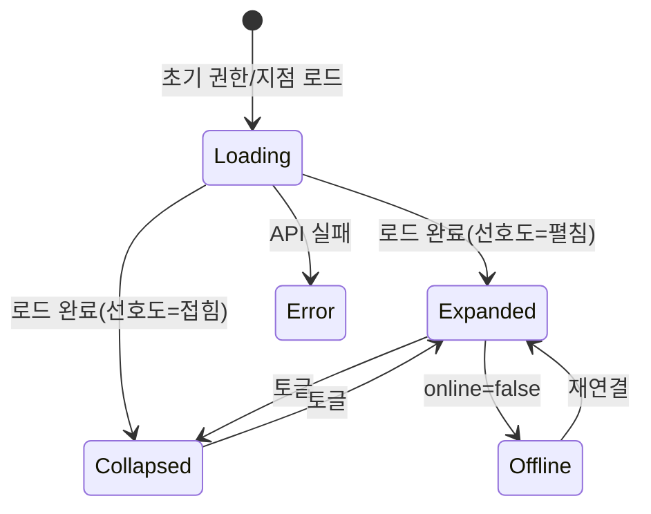

# SCR-102 사이드바 네비게이션 — 기본화면 (마스터)

> 이 문서는 **화면 마스터 스펙**입니다. `01~05` 상태 문서는 이 문서를 상속(override/delta)합니다.
> 🚨 **글로벌 컴포넌트**: 특정 라우트를 갖지 않으며 `AppLayout` 의 구조적 일부로서 전 페이지에서 렌더됩니다.
> 역할/지점별 메뉴 노출, 펼침/접힘, 오프라인 표시, 접근성 포커스 트랩을 포함.

---

## 0. 메타 & 원천 참조

| 항목 | 값 |
|------|----|
| 화면 ID | SCR-102 |
| 화면명 | 사이드바 네비게이션 |
| 도메인 | D01-공통 |
| 경로 | N/A (전역 컴포넌트) |
| 파일 경로 | `src/components/layout/Sidebar.tsx` + `src/components/layout/AppLayout.tsx` |
| 역할 | 전 역할 (노출 메뉴 상이) |
| 우선순위 | P0 |
| 플랫폼 | 데스크톱(펼침) / 태블릿(축약) / 모바일(드로어) |

### 원천 문서 링크
| 문서 | 경로 | 섹션 |
|---|---|---|
| 공통 화면설계서 | `docs/화면설계서/공통.md` | §1 라우트, §2.2 메뉴 권한, §5.1 사이드바 구조, §7 접근성 |
| 권한 매트릭스 | `docs/다이어그램/10_권한매트릭스/R1_역할화면_매트릭스.md` | 전 역할 메뉴 접근 |
| 다이어그램 F1~F9 | `docs/다이어그램/D01_공통/SCR-102_사이드바_네비게이션/` | |
| DLG-002 | `docs/화면설계서/D01-공통/DLG-002-이탈경고/` | 사이드바 링크 클릭 → isDirty 가드 |
| DLG-001 | `docs/화면설계서/D01-공통/DLG-001-로그아웃확인/` | 푸터 로그아웃 |

---

## 1. 화면 목적 (Why)

- 모든 페이지에서 일관된 **1차 내비게이션** 제공
- 역할별/지점별 메뉴 노출을 런타임에 결정(RBAC)
- 오프라인/시스템 상태 알림 배지
- 프로필/지점 정보와 로그아웃 액션 포함

---

## 2. 화면 레이아웃 (Wireframe)

### 2.1 데스크톱 펼침(240px)
```
┌──────────────────────────────────┐
│ FitGenie CRM            [<<접힘] │ ← 헤더 (로고 + 접힘 토글)
├──────────────────────────────────┤
│ [지점 전환 ▼ 강남점]              │ ← super/primary/owner(멀티브랜드)
├──────────────────────────────────┤
│ 🏢 본사 관리 ▸                    │ ← super/primary 만
│  ├ 지점 관리                      │
│  ├ 지점 리포트                    │
│  ├ KPI 대시보드                   │
│  ├ KPI 프리뷰                     │
│  ├ 감사 로그                      │
│  └ 구독 관리                      │
│ ────────────────                 │
│ 🏠 대시보드                      │
│ ✅ Today Tasks                   │
│ 👥 회원 ▸                         │
│  ├ 회원 목록                      │
│  ├ 회원 등록                      │
│  └ 출석 관리                      │
│ 📅 수업/캘린더 ▸                  │
│ 💰 매출 ▸                         │
│ 📦 상품 ▸                         │
│ 🔐 시설 ▸                         │
│ 🧑 직원/급여 ▸                    │
│ 📢 마케팅 ▸                       │
│ ⚙ 설정 ▸                          │
│ 📄 공지사항                       │
├──────────────────────────────────┤
│ 👤 홍길동 (센터장)                 │
│ 🏢 강남점                         │
│ [ 로그아웃 ]                      │
└──────────────────────────────────┘
```

### 2.2 접힘(72px, 아이콘만)
```
┌──────┐
│[로고]│
│[>>] │
├──────┤
│ 🏠  │
│ ✅  │
│ 👥  │
│ 📅  │
│ 💰  │
│ ...  │
├──────┤
│ 👤  │
└──────┘
```

### 2.3 모바일 드로어 (offcanvas)
```
[햄버거]  ← 트리거
◀ 슬라이드 인
바깥 클릭/ESC → 닫힘
```

| 영역 | 치수 | 역할 |
|---|---|---|
| Sidebar | 펼침 240px / 접힘 72px / 모바일 100% | 컨테이너 |
| Header | 56px h | 로고 + 접힘 토글 |
| BranchSwitcher | 40px h | 지점 드롭다운 (super/primary/owner 멀티브랜드) |
| Nav scroll | `flex-1 overflow-y-auto` | 메뉴 |
| Footer | 80px h | 사용자 + 로그아웃 |

---

## 3. 디자인 토큰

### 3.1 색상
| 토큰 | 클래스 | 용도 |
|---|---|---|
| sidebar.bg | `bg-white border-r border-gray-200` | 배경 |
| sidebar.mobile.bg | `bg-white` + overlay `bg-black/40` | 모바일 드로어 |
| item.default | `text-gray-700 hover:bg-gray-50` | 기본 |
| item.active | `bg-blue-50 text-blue-700 border-l-2 border-blue-600` | 활성 경로 |
| item.disabled | `text-gray-300 cursor-not-allowed` | RBAC 접근 불가(옵션: 숨김) |
| group.header | `text-xs font-semibold uppercase text-gray-500 tracking-wide` | "본사 관리" 등 |
| footer.bg | `bg-gray-50 border-t border-gray-200` | 푸터 |
| status.online | `bg-emerald-500` | 온라인 점 |
| status.offline | `bg-gray-400` | 오프라인 점 |

### 3.2 타이포
| 토큰 | 값 |
|---|---|
| logo | `text-lg font-bold text-gray-900` |
| item | `text-sm font-medium` |
| footer.user | `text-sm font-medium text-gray-900` |
| footer.role | `text-xs text-gray-500` |

### 3.3 간격/반경/모션
- 패딩: 그룹 `py-2 px-3`, 아이템 `h-10 px-3 rounded-md`
- 접힘/펼침 애니메이션: `transition-[width] duration-200 ease-out`
- 모바일 드로어: `transition-transform duration-200`

---

## 4. 반응형 규칙
| BP | 사이드바 |
|---|---|
| <640 | 드로어 (오버레이 + 100%) |
| 640~1024 | 축약(아이콘만 72px) 또는 펼침 선택 |
| ≥1024 | 펼침 240px 기본 |
| XL ≥1440 | 펼침 260px |

- 모바일: 햄버거 버튼으로 토글, 바깥 클릭/ESC 닫힘
- 유저 선호도는 `localStorage.sidebarCollapsed` 에 저장

---

## 5. 🔐 역할별(RBAC) 매트릭스

> 공통.md §2.2 기반. 주요 그룹만 발췌.

| 메뉴 그룹 | superAdmin | primary | owner | manager | fc | trainer | staff | front |
|---|:---:|:---:|:---:|:---:|:---:|:---:|:---:|:---:|
| 본사 관리 그룹 | ● | ●(브랜드 하위만) | — | — | — | — | — | — |
| 지점 전환 드롭다운 | ● | ●(브랜드) | ●(멀티 지점 소유 시) | — | — | — | — | — |
| 대시보드 | ● | ● | ● | ● | ● | ●(→/calendar 자동) | ● | ●(→/attendance 자동) |
| Today Tasks | ● | ● | ● | ● | ● | ● | ● | ● |
| 회원 | ● | ● | ● | ● | ● | ○ | ○ | ● |
| 수업/캘린더 | ● | ● | ● | ● | ● | ● | ○ | — |
| 매출 | ● | ● | ● | ○ | — | — | — | — |
| 상품 | ● | ● | ● | — | — | — | — | — |
| 시설 | ● | ● | ● | ● | — | — | ● | — |
| 직원/급여 | ● | ● | ● | — | — | — | — | — |
| 마케팅 | ● | ● | ● | ● | ● | — | — | — |
| 설정 | ● | ● | ● | — | — | — | — | — |
| 공지사항 | ● | ● | ● | ● | ● | ● | ● | ● |
| 로그아웃 버튼 | ● | ● | ● | ● | ● | ● | ● | ● |
| 오프라인 배지 | ● | ● | ● | ● | ● | ● | ● | ● |

### 멀티테넌트
- 지점 전환: super/primary 전체 브랜드, owner 는 본인 보유 지점만
- 현재 선택된 `branchId` 는 `useBranchStore` 에 유지
- URL `?branch=` 변화 시 사이드바 "지점 전환" 값도 동기화

---

## 6. 컴포넌트 트리

```tsx
<Sidebar
  role={user.role}
  currentPath={pathname}
  branchId={branchId}
  branches={branches}
  collapsed={collapsed}
  mobileOpen={mobileOpen}
  onToggleCollapse={toggleCollapse}
  onMobileClose={closeMobile}
  isDirty={isDirty}
>
  <SidebarHeader logo="FitGenie CRM" onToggle={onToggleCollapse} collapsed={collapsed} />
  {canSwitchBranch(role, branches.length) && (
    <BranchSwitcher value={branchId} options={branches} onChange={switchBranch} />
  )}
  <nav aria-label="주요 메뉴" className="flex-1 overflow-y-auto">
    <SidebarGroup title="본사 관리" show={role==='superAdmin' || role==='primary'}>
      <Item href="/branches"       label="지점 관리"   icon={Building} />
      <Item href="/branch-report"  label="지점 리포트" icon={LineChart} show={role==='superAdmin'} />
      <Item href="/kpi"            label="KPI 대시보드" icon={Gauge} />
      <Item href="/kpi-preview"    label="KPI 프리뷰"  icon={Eye} />
      <Item href="/audit-log"      label="감사 로그"   icon={Shield} />
      <Item href="/subscription"   label="구독 관리"   icon={CreditCard} />
    </SidebarGroup>
    <SidebarGroup title="지점 운영">
      <Item href="/"             label="대시보드"    icon={Home} />
      <Item href="/today-tasks"  label="Today Tasks" icon={ListTodo} />
      <SubGroup title="회원" icon={Users} defaultOpen>
        <Item href="/members"          label="회원 목록" />
        <Item href="/members/new"      label="회원 등록" show={canCreate(role,'member')} />
        <Item href="/attendance"       label="출석 관리" />
      </SubGroup>
      ...
    </SidebarGroup>
    <SidebarGroup title="기타">
      <Item href="/notices" label="공지사항" icon={Bell} />
    </SidebarGroup>
  </nav>
  <SidebarFooter>
    <UserCard name={user.name} role={user.roleLabel} branch={branchName} online={online} />
    <LogoutButton onClick={() => setLogoutOpen(true)} />
  </SidebarFooter>
</Sidebar>
```

### 컴포넌트 명세
| 컴포넌트 | Props | 재사용 |
|---|---|---|
| `Sidebar` | `{role, currentPath, branchId, branches, collapsed, mobileOpen, onToggleCollapse, onMobileClose, isDirty}` | 전역 |
| `SidebarGroup` | `{title, show?, children}` | 내부 |
| `Item` | `{href, label, icon?, show?}` — `<LinkGuard>` 래퍼 (isDirty 가드) | 내부 |
| `BranchSwitcher` | `{value, options, onChange}` | 전역 |
| `LogoutButton` | `{onClick}` → DLG-001 오픈 | 내부 |

---

## 7. 데이터 계약

### 7.1 스토어
```ts
// src/stores/authStore.ts
interface AuthUser { id: number; name: string; role: Role; roleLabel: string;
  branchId: number | null; isSuperAdmin?: boolean; }

// src/stores/branchStore.ts
interface BranchStore { current: { id: number; name: string } | null;
  branches: Branch[]; setCurrent(v): void; }

// src/stores/uiStore.ts (사이드바)
interface UIStore { sidebarCollapsed: boolean; mobileSidebarOpen: boolean; ... }
```

### 7.2 API
- `GET /branches?accessible=true` — 현재 사용자 접근 가능한 지점 목록(사이드바 드롭다운)
- `POST /branches/:id/switch` — 지점 전환 (super/primary/owner 멀티)
- `GET /system/status` — 오프라인/점검 상태(옵션, SystemStatusBar 공유)

### 7.3 오프라인 감지
- `navigator.onLine` + `online`/`offline` 이벤트
- 상태는 `useUIStore.online` 반영

---

## 8. 비즈니스 룰

1. **RBAC 기반 노출**: 권한 없는 메뉴는 **숨김(기본)**. 정책에 따라 `disabled` 표시도 가능.
2. **활성 경로 하이라이트**: `pathname.startsWith(item.href)` 기준 매칭. `/` 는 정확 매칭만.
3. **isDirty 가드**: 링크 클릭 시 부모 폼이 dirty 면 DLG-002 이탈경고 오픈(LinkGuard 사용).
4. **지점 전환**: 선택 시 `POST /branches/:id/switch` + store 업데이트 + `router.refresh()` + toast.
5. **접힘 상태 영속화**: `localStorage.sidebarCollapsed` 저장/복원.
6. **모바일 드로어 포커스 트랩**: 열림 시 첫 아이템 포커스, ESC 닫기.
7. **로그아웃**: 푸터 "로그아웃" 클릭 → DLG-001 오픈. 확인 시 SCR-109 로그아웃 플로우.
8. **감사로그 잠금**: 삭제/생성 액션은 여기서 발생하지 않음(읽기 전용 내비게이션).
9. **아이콘 접근성**: 접힘 상태에서 각 아이템 `aria-label` 텍스트 제공.
10. **서브메뉴(Collapsible)**: `aria-expanded` + keyboard(Space/Enter) 지원.

---

## 9. 상태 목록

| 파일 | 상태 코드 | 한글 | 트리거 |
|---|---|---|---|
| `01-로딩.md` | `sidebar-loading` | 로딩 | 권한/지점 정보 로드 중 |
| `02-펼침.md` | `sidebar-expanded` | 펼침 | 기본 상태(데스크톱) |
| `03-접힘.md` | `sidebar-collapsed` | 접힘 | 접힘 토글 클릭 or 저장된 선호도 |
| `04-에러.md` | `sidebar-error` | 에러 | 지점/권한 API 실패 |
| `05-오프라인표시.md` | `sidebar-offline-indicator` | 오프라인 표시 | `navigator.onLine=false` |

---

## 10. 에러 코드 매핑

| errorCode | 시나리오 | 표시 |
|---|---|---|
| E401002 | JWT 만료 | DLG-000 |
| E403001 | 권한 없음(지점 전환) | 토스트 "해당 지점 접근 권한이 없습니다" |
| E500001 | 서버 오류 | `04-에러` 사이드바 축소 에러 상태 |
| NETWORK | 오프라인 | `05-오프라인표시` 오프라인 배지 |

---

## 11. 접근성 (WCAG 2.1 AA)

- `<aside role="navigation" aria-label="주요 메뉴">`
- 각 `<ul>`에 aria-label, 아이템 `<a>` 또는 `<button>` 으로 구현
- 활성 아이템 `aria-current="page"`
- 접힘 상태 아이템은 `aria-label={label}` 로 접근성 보장
- 모바일 드로어: `role="dialog"` + 포커스 트랩 + ESC 닫기
- 로고 링크는 대시보드로 이동(`aria-label="홈으로 이동"`)
- Tab 순서: 로고 → 접힘 토글 → 지점 드롭다운 → 메뉴 → 유저 → 로그아웃
- `prefers-reduced-motion` 준수

---

## 12. 진입 / 이탈

### 진입
- 모든 인증된 페이지에서 렌더 (AppLayout 내부)
- 모바일: 헤더의 햄버거 버튼 클릭

### 이탈
| 액션 | 목적지 |
|---|---|
| 메뉴 클릭 | 해당 경로 (`LinkGuard` + DLG-002) |
| 지점 전환 | 현재 경로 유지 + `?branch=` 업데이트 + refetch |
| 로고 클릭 | `/` 대시보드 |
| 로그아웃 | DLG-001 오픈 → 확인 시 SCR-109 |

---

## 13. 다이어그램 통합 뷰



참조: `docs/다이어그램/D01_공통/SCR-102_사이드바_네비게이션/F6_상태별.md`

---

## 14. 🧩 바이브코딩 프롬프트 (마스터)

```
Next.js 15 App Router + TypeScript + Tailwind + Zustand + lucide-react 기반
'use client' 전역 사이드바 + AppLayout 을 작성하라.

━━ 전역 컴포넌트: SCR-102 사이드바 ━━
파일:
  src/components/layout/AppLayout.tsx   (플렉스 레이아웃: <Sidebar /> | <main>)
  src/components/layout/Sidebar.tsx
  src/components/layout/BranchSwitcher.tsx
  src/components/navigation/LinkGuard.tsx  (DLG-002 연동)
  src/lib/menu.ts                          (MENU_CONFIG 정의)

━━ MENU_CONFIG ━━
export type MenuNode = {
  id: string; label: string; href?: string; icon?: LucideIcon;
  roles?: Role[] | ((ctx) => boolean);  // 접근 규칙
  children?: MenuNode[];
};
export const MENU_CONFIG: MenuNode[] = [
  { id:'admin', label:'본사 관리',
    roles:['superAdmin','primary'],
    children:[
      { id:'branches',      label:'지점 관리',   href:'/branches',       roles:['superAdmin','primary'] },
      { id:'branch-report', label:'지점 리포트', href:'/branch-report',  roles:['superAdmin'] },
      { id:'kpi',           label:'KPI 대시보드',href:'/kpi',            roles:['superAdmin','primary','owner','manager'] },
      { id:'kpi-preview',   label:'KPI 프리뷰', href:'/kpi-preview',    roles:['superAdmin','primary','owner','manager','fc','staff'] },
      { id:'audit-log',     label:'감사 로그',   href:'/audit-log',      roles:['superAdmin','primary','owner'] },
      { id:'subscription',  label:'구독 관리',   href:'/subscription',   roles:['superAdmin','primary'] },
    ]},
  { id:'ops', label:'지점 운영',
    children:[
      { id:'home',       label:'대시보드',    href:'/',             icon:Home },
      { id:'todo',       label:'Today Tasks', href:'/today-tasks',  icon:ListTodo },
      { id:'members',    label:'회원',        icon:Users,
        children:[
          { id:'m-list', label:'회원 목록', href:'/members' },
          { id:'m-new',  label:'회원 등록', href:'/members/new', roles:['superAdmin','primary','owner','manager','fc'] },
          { id:'attend', label:'출석 관리', href:'/attendance' },
        ]},
      // ... (수업/매출/상품/시설/직원/마케팅/설정)
      { id:'notices',    label:'공지사항',    href:'/notices', icon:Bell },
    ]},
];

━━ 접근 규칙 함수 ━━
function isMenuAccessible(node: MenuNode, ctx: { role: Role; branches: Branch[] }): boolean {
  if (Array.isArray(node.roles)) return node.roles.includes(ctx.role);
  if (typeof node.roles === 'function') return node.roles(ctx);
  return true;
}

━━ Sidebar 렌더 ━━
export function Sidebar({ role, collapsed, onToggleCollapse, isDirty, branchId, branches }: Props) {
  const pathname = usePathname();
  const online = useOnlineStatus();
  const ctx = { role, branches };
  const renderNode = (n: MenuNode) => {
    if (!isMenuAccessible(n, ctx)) return null;
    if (n.children?.length) {
      return (
        <Collapsible key={n.id} title={n.label} icon={n.icon} collapsed={collapsed} defaultOpen>
          {n.children.map(renderNode)}
        </Collapsible>
      );
    }
    if (!n.href) return null;
    const active = n.href === '/' ? pathname === '/' : pathname.startsWith(n.href);
    return (
      <LinkGuard key={n.id} href={n.href} isDirty={isDirty}
        aria-current={active ? 'page' : undefined}
        className={cn('group flex items-center gap-2 h-10 px-3 rounded-md text-sm font-medium',
          active ? 'bg-blue-50 text-blue-700 border-l-2 border-blue-600' : 'text-gray-700 hover:bg-gray-50')}>
        {n.icon && <n.icon className="size-4" aria-hidden />}
        {!collapsed && <span>{n.label}</span>}
      </LinkGuard>
    );
  };
  return (
    <aside role="navigation" aria-label="주요 메뉴"
           className={cn('bg-white border-r border-gray-200 flex flex-col', collapsed ? 'w-[72px]' : 'w-60',
             'transition-[width] duration-200')}>
      <SidebarHeader collapsed={collapsed} onToggle={onToggleCollapse} />
      {canSwitchBranch(role, branches.length) && (
        <BranchSwitcher value={branchId} options={branches} onChange={switchBranch} collapsed={collapsed} />
      )}
      <nav className="flex-1 overflow-y-auto p-2 space-y-2">
        {MENU_CONFIG.map(renderNode)}
      </nav>
      <SidebarFooter online={online} onLogout={() => setLogoutOpen(true)} collapsed={collapsed} />
    </aside>
  );
}

━━ 모바일 드로어 ━━
{isMobile && mobileOpen && createPortal(
  <div role="dialog" aria-modal="true" aria-label="주요 메뉴"
       onClick={(e) => { if (e.target === e.currentTarget) onMobileClose(); }}
       className="fixed inset-0 z-50 bg-black/40">
    <div className="h-full w-[80%] max-w-[320px] bg-white
                    animate-[slideInLeft_180ms_ease-out]">
      {/* Sidebar 재사용 */}
    </div>
  </div>, document.body)}

━━ 접근성 ━━
- 루트 <aside role="navigation">
- 활성 aria-current="page"
- Collapsible aria-expanded
- 접힘 시 각 Item aria-label={n.label}
- 모바일 드로어 role="dialog" + trap + ESC

━━ 오프라인 표시 ━━
푸터 유저 카드 옆에 상태 점:
<span aria-label={online?'온라인':'오프라인'}
      className={online ? 'size-2 rounded-full bg-emerald-500' : 'size-2 rounded-full bg-gray-400'} />

━━ 성능 ━━
- MENU_CONFIG 는 상수 (서버 컴포넌트에서도 사용 가능)
- 사용자/권한 로드가 SSR 에서 완료되어 있으면 첫 렌더에 스켈레톤 최소화

━━ QA ━━
- 역할별 메뉴 노출 일치(공통.md §2.2)
- 활성 경로 하이라이트 정확 (경로 prefix 매칭)
- 접힘/펼침 토글 localStorage 영속
- 모바일 드로어 열림/닫힘 ESC/배경/포커스 트랩
- 지점 전환 시 ?branch= 갱신
- 오프라인 배지 표시
- 로그아웃 클릭 시 DLG-001 오픈
- 편집 중(isDirty) 링크 클릭 시 DLG-002 오픈
```

---

## 15. QA 체크리스트

- [ ] 8역할 각각의 메뉴 노출 정확(§5 매트릭스)
- [ ] 활성 경로 하이라이트 + `aria-current="page"`
- [ ] 접힘/펼침 토글 + localStorage 영속
- [ ] 모바일 드로어 열림/닫힘(햄버거/배경/ESC)
- [ ] 모바일 드로어 포커스 트랩
- [ ] 지점 전환 드롭다운 super/primary/owner(다지점) 만 노출
- [ ] 지점 전환 시 toast + refetch
- [ ] 오프라인 시 푸터 상태 점 회색
- [ ] 편집 중 링크 클릭 → DLG-002 이탈경고 호출
- [ ] 로그아웃 버튼 → DLG-001 오픈
- [ ] 키보드 Tab 순서 정상
- [ ] Collapsible `aria-expanded` 토글
- [ ] 접힘 상태에서 각 아이템 `aria-label` 제공
- [ ] reduced-motion 준수
- [ ] 모바일 <640, 태블릿 640~1024, 데스크톱 ≥1024 각각 정상
