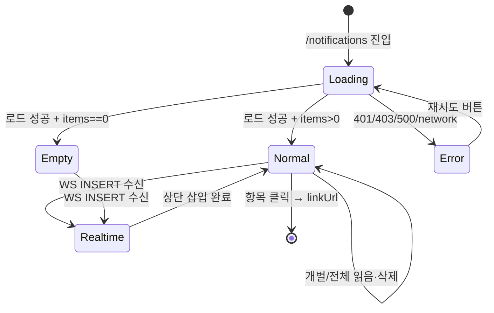

# SCR-104 알림 센터 — 기본화면 (마스터)

> 이 문서는 **화면 마스터 스펙**입니다. `01~05` 상태 문서는 이 문서를 상속(override/delta)합니다.
> 상태별 파일은 "변경점(델타)만" 기술하며, 이 문서에 정의된 레이아웃/토큰/컴포넌트/데이터/권한/접근성은 **기본값**으로 적용됩니다.

---

## 0. 메타 & 원천 참조

| 항목 | 값 |
|------|----|
| 화면 ID | SCR-104 |
| 화면명 | 알림 센터 |
| 도메인 | D01-공통 |
| 경로 | `/notifications` |
| Next.js Route Group | `(dashboard)` |
| 파일 경로 | `src/app/(dashboard)/notifications/page.tsx` |
| 페이지 컴포넌트 | `NotificationCenter` |
| 역할 | superAdmin / primary / owner / manager / fc / trainer / staff / front |
| 우선순위 | P0 (필수) |
| 플랫폼 | 데스크톱(우선) / 태블릿 / 모바일 |
| i18n | ko-KR |
| 실시간 | WebSocket (Supabase Realtime) + 30초 폴링 폴백 |

### 원천 문서 링크

| 문서 종류 | 경로 | 참조 섹션 |
|---|---|---|
| 화면설계서 | `docs/화면설계서/공통.md` | §3(UI 패턴), §4(다이얼로그), §5(네비게이션), §8(컴포넌트) |
| 상태전이도 | `docs/상태전이도.md` | 알림 읽음/미읽음 전이 |
| 에러코드정의서 | `docs/에러코드정의서.md` | §공통(001~099) — E401001/2, E403001, E500001, E503001 |
| 다이어그램 F1 진입 | `docs/다이어그램/D01_공통/SCR-104_알림센터/F1_진입.md` | 사이드바/헤더 뱃지/드롭다운 전체보기 |
| 다이어그램 F2 메인 | `docs/다이어그램/D01_공통/SCR-104_알림센터/F2_메인.md` | 클릭→읽음→이동, 실시간 수신 |
| 다이어그램 F3 버튼액션 | `docs/다이어그램/D01_공통/SCR-104_알림센터/F3_버튼액션.md` | 전체읽음/전체삭제/개별읽음·삭제 |
| 다이어그램 F4 필터검색 | `docs/다이어그램/D01_공통/SCR-104_알림센터/F4_필터검색.md` | 탭 전환(전체/미읽음/읽음) |
| 다이어그램 F5 모달트리거 | `docs/다이어그램/D01_공통/SCR-104_알림센터/F5_모달트리거.md` | 전체삭제 인라인 확인 |
| 다이어그램 F6 상태별 | `docs/다이어그램/D01_공통/SCR-104_알림센터/F6_상태별.md` | LOADING/NORMAL/EMPTY/ERROR/REALTIME |
| 다이어그램 F7 권한 | `docs/다이어그램/D01_공통/SCR-104_알림센터/F7_권한.md` | 역할별 알림 범위 + 액션 가능 여부 |
| 다이어그램 F8 에러 | `docs/다이어그램/D01_공통/SCR-104_알림센터/F8_에러.md` | 401/403/500/네트워크/WS 끊김 |
| 다이어그램 F9 토스트 | `docs/다이어그램/D01_공통/SCR-104_알림센터/F9_토스트.md` | 성공/실패/권한없음 토스트 |
| 권한 매트릭스 | `docs/다이어그램/10_권한매트릭스/R1_역할화면_매트릭스.md` | 모든 역할 접근 가능 |

---

## 1. 화면 목적 (Why)

시스템 내 모든 사용자 대상 알림(회원/매출/수업/공지/시스템)을 **한 곳에 집약**하여 열람·처리·관리하는 화면.
- 실시간 WebSocket 수신으로 즉시 반영(헤더 뱃지 + 목록 상단 삽입)
- 미읽음/읽음 상태 관리, 개별·전체 읽음 처리, 개별·전체 삭제 지원
- 알림 타입별 아이콘·색상 체계로 직관적 인지
- 역할별 알림 수신 범위를 차등(슈퍼/본사 = 전 지점, 그 외 = 본인 지점)
- 알림 클릭 시 연결 화면(`linkUrl`)으로 전환 + 낙관적 읽음 처리

---

## 2. 화면 레이아웃 (Wireframe)

### 2.1 풀뷰 와이어프레임 (데스크톱 1440px 기준)

```
┌────────────────────────────────────────────────────────────────────┐
│ [Sidebar]  │  [Header: FitGenie CRM      🔔12  👤 홍길동  ▾    ]   │
│            │                                                        │
│            │  ┌─────────────────────────────────────────────────┐  │
│            │  │ 알림 센터                     [모두 읽음] [설정] │  │ ← PageHeader (72px)
│            │  │ 새 알림 12개                                     │  │   h1 text-Heading-3
│            │  └─────────────────────────────────────────────────┘  │
│            │                                                        │
│            │  ┌─────────────────────────────────────────────────┐  │
│            │  │ [전체 42] [미읽음 12] [읽음 30]                  │  │ ← TabNav (48px)
│            │  └─────────────────────────────────────────────────┘  │
│            │                                                        │
│            │  ┌─────────────────────────────────────────────────┐  │
│            │  │ 🔔 신규 회원 등록                          1분 전 │  │ ← 미읽음 (bg-blue-50)
│            │  │    김철수 (010-1234-5678)가 등록되었습니다.      │  │   border-l-4 border-blue-500
│            │  │                                          [X]    │  │   font-semibold
│            │  ├─────────────────────────────────────────────────┤  │
│            │  │ ⚠️ 재등록 알림                           15분 전 │  │ ← 미읽음
│            │  │    이영희 회원권이 7일 뒤 만료됩니다.            │  │
│            │  │                                          [X]    │  │
│            │  ├─────────────────────────────────────────────────┤  │
│            │  │ ✅ 결제 완료                              1시간 전│  │ ← 읽음 (bg-white)
│            │  │    박민수 POS 결제 200,000원이 완료되었습니다.   │  │   font-normal
│            │  │                                          [X]    │  │   text-gray-600
│            │  ├─────────────────────────────────────────────────┤  │
│            │  │ ℹ️ 시스템 공지                            2시간 전│  │
│            │  │    2026-04-22 03:00 시스템 점검 안내              │  │
│            │  │                                          [X]    │  │
│            │  └─────────────────────────────────────────────────┘  │
│            │                                                        │
│            │  [◀ 이전] [1] [2] [3] [다음 ▶]                        │ ← Pagination
└────────────────────────────────────────────────────────────────────┘
```

### 2.2 영역별 치수 / 역할 표

| 영역 | 위치 | 치수 | 역할 |
|------|------|------|------|
| AppLayout | 전체 | `min-h-screen` | 사이드바 + 헤더 + 콘텐츠 |
| Content Area | 사이드바 우측 | `max-w-3xl mx-auto px-6 py-8` | 중앙 정렬 콘텐츠 |
| PageHeader | 상단 | `h-auto pb-lg` | 제목 + 미읽음 수 + 액션 버튼 |
| TabNav | Header 아래 24px | `h-12` | 전체/미읽음/읽음 필터 탭 |
| List Container | TabNav 아래 16px | `rounded-xl border border-line bg-surface divide-y` | 알림 카드 컨테이너 |
| NotificationItem | 카드 내부 | `px-4 py-3` 최소 72px | 단일 알림 카드 |
| 아이콘 | 좌측 | 40×40 rounded-full | 타입별 아이콘/색상 |
| 제목+본문 | 중앙 flex-1 | gap-1 | title + 2줄 truncate body |
| 시간 | 우측 상단 | `text-xs text-content-tertiary` | 상대 시간 |
| 삭제 버튼 | 우측 하단 | 24×24 `hover:bg-red-50` | X 아이콘 |
| Pagination | 하단 | `mt-6` | 20개 단위 페이징 |

---

## 3. 디자인 토큰

### 3.1 색상 (Tailwind 토큰 매핑)

| 역할 | 클래스 | 용도 |
|------|--------|------|
| bg.page | `bg-surface-secondary` | 콘텐츠 배경 |
| bg.card | `bg-white rounded-xl border border-line` | 리스트 컨테이너 |
| bg.unread | `bg-blue-50 border-l-4 border-blue-500` | 미읽음 항목 강조 |
| bg.read | `bg-white` | 읽음 항목 |
| bg.hover | `hover:bg-gray-50` | 항목 호버 |
| fg.title.unread | `text-gray-900 font-semibold` | 미읽음 제목 |
| fg.title.read | `text-gray-700 font-medium` | 읽음 제목 |
| fg.body | `text-sm text-gray-600` | 본문 |
| fg.time | `text-xs text-gray-400` | 시간 표시 |
| icon.info | `bg-blue-100 text-blue-600` | Info 타입 |
| icon.success | `bg-green-100 text-green-600` | Success 타입 |
| icon.warning | `bg-amber-100 text-amber-600` | Warning 타입 |
| icon.error | `bg-red-100 text-red-600` | Error 타입 |
| icon.member | `bg-purple-100 text-purple-600` | 회원 이벤트 |
| badge.unread | `bg-red-500 text-white text-xs` | 미읽음 카운트 뱃지 |

### 3.2 타이포그래피

| 토큰 | 스타일 | 용도 |
|------|--------|------|
| h1 | `text-Heading-3 font-bold` | "알림 센터" |
| subtitle | `text-sm text-gray-500` | "새 알림 N개" |
| tab | `text-sm font-medium` | 탭 라벨 |
| title.unread | `text-sm/5 font-semibold text-gray-900` | 알림 제목(미읽음) |
| title.read | `text-sm/5 font-medium text-gray-700` | 알림 제목(읽음) |
| body | `text-sm/5 text-gray-600 line-clamp-2` | 알림 본문 2줄 |
| time | `text-xs text-gray-400` | 상대 시간 |
| empty | `text-sm text-gray-500 text-center` | 빈 상태 메시지 |

### 3.3 간격 / 반경 / 그림자

| 토큰 | 값 |
|------|----|
| radius.card | `rounded-xl` (12px) |
| radius.icon | `rounded-full` |
| spacing.header | 24px (`pb-lg`) |
| spacing.section | 16px (`space-y-md`) |
| spacing.item | 12px (`py-3`) |
| shadow.card | `shadow-sm` |
| divider | `divide-y divide-gray-100` |

### 3.4 모션 / 포커스

| 토큰 | 값 |
|------|----|
| motion.enter | `animate-[slideDown_200ms_ease-out]` (실시간 신규 항목 삽입) |
| motion.exit | `animate-[fadeOut_150ms_ease-in]` (삭제 시) |
| motion.skeleton | `animate-pulse` |
| focus.ring | `focus-visible:ring-2 focus-visible:ring-blue-500 focus-visible:ring-offset-2` |

---

## 4. 반응형 규칙

| 브레이크포인트 | 폭 | 컨테이너 | 항목 | 특이사항 |
|---|---|---|---|---|
| Mobile | <640px | `max-w-full px-4 py-6` | 아이콘 32px, title 단일행, body 1줄 | 삭제 버튼 스와이프 제스처 |
| Tablet | 640~1024px | `max-w-2xl px-6 py-6` | 표준 | TabNav 수평 스크롤 허용 |
| Desktop | ≥1024px | `max-w-3xl mx-auto px-6 py-8` | 표준 72px h | Footer 미표시 |
| Wide | ≥1280px | 동일 `max-w-3xl` | — | 좌/우 여백 확장 |

---

## 5. 🔐 역할별(RBAC) 매트릭스

`●` = 전체 가능, `○` = 조회만, `—` = 불가

| 요소 | superAdmin | primary | owner | manager | fc | trainer | staff | front | readonly |
|------|:---:|:---:|:---:|:---:|:---:|:---:|:---:|:---:|:---:|
| 알림 센터 진입 | ● | ● | ● | ● | ● | ● | ● | ● | ○ |
| **알림 수신 범위** | 전 지점 시스템/운영/감사 | 브랜드 하위 지점 | 본인 지점 전체 | 본인 지점 운영 | 본인 지점 회원/수업 | 본인 담당 수업 | 본인 지점 출석/회원 | 본인 지점 출석 | 본인 수신분만 |
| 개별 읽음 처리 | ● | ● | ● | ● | ● | ● | ● | ● | ○(본인) |
| 개별 삭제 | ● | ● | ● | ● | ● | ● | ● | ● | — |
| **전체 읽음 처리** | ● | ● | ● | ● | — | — | — | — | — |
| **전체 삭제** | ● | ● | ● | ● | — | — | — | — | — |
| 알림 설정 진입 (→ SCR-105) | ● | ● | ● | ● | ● | ● | ● | ● | — |
| 실시간 WebSocket 구독 | ● | ● | ● | ● | ● | ● | ● | ● | ● |
| 필터 탭 (전체/미읽음/읽음) | ● | ● | ● | ● | ● | ● | ● | ● | ● |

> **정책**:
> - 전체 읽음/전체 삭제는 **관리자급(manager 이상)** 만 노출. fc/trainer/staff/front는 버튼 자체 미렌더.
> - 슈퍼관리자(`role==='superAdmin'`)는 `branchId` 필터 미적용(전체 지점 시스템 알림 포함).
> - 그 외 역할은 `branchId = getBranchId()` 강제 필터.
> - 읽기전용(`readonly`)은 조회만 가능, 읽음 처리는 본인 수신분만 허용.

---

## 6. 컴포넌트 트리

```
<AppLayout>
  <main className="max-w-3xl mx-auto px-6 py-8">
    <PageHeader
      title="알림 센터"
      description={`새 알림 ${unreadCount}개`}
      actions={[
        <Button variant="ghost" onClick={handleMarkAllRead}>모두 읽음</Button>,  // manager+ 만
        <Button variant="ghost" onClick={() => moveToPage('/profile?tab=notifications')}>설정</Button>,
      ]}
    />
    <TabNav
      tabs={[
        { id: 'all',    label: `전체 ${total}` },
        { id: 'unread', label: `미읽음 ${unreadCount}` },
        { id: 'read',   label: `읽음 ${readCount}` },
      ]}
      activeTab={activeTab}
      onChange={setActiveTab}
    />
    {/* 상태 분기 */}
    {isLoading && <NotificationSkeleton count={6} />}
    {!isLoading && error && <NotificationErrorState onRetry={refetch} errorCode={error} />}
    {!isLoading && !error && items.length === 0 && <NotificationEmptyState tab={activeTab} />}
    {!isLoading && !error && items.length > 0 && (
      <ul role="feed" aria-label="알림 목록"
          className="rounded-xl border border-line bg-white divide-y divide-gray-100 overflow-hidden">
        {items.map(item => (
          <NotificationItem
            key={item.id}
            item={item}
            onRead={handleMarkRead}
            onDelete={handleDelete}
            onClick={handleClick}
          />
        ))}
      </ul>
    )}
    <Pagination
      page={page}
      pageSize={20}
      total={total}
      onChange={setPage}
    />
  </main>
</AppLayout>
```

### 컴포넌트 명세

| 컴포넌트 | Props | 재사용 여부 |
|---|---|---|
| `NotificationItem` | `{ item: Notification, onRead, onDelete, onClick }` | 전용 |
| `NotificationSkeleton` | `{ count?: number }` | 전용 |
| `NotificationEmptyState` | `{ tab: 'all'\|'unread'\|'read' }` | 전용 |
| `NotificationErrorState` | `{ onRetry, errorCode }` | 전용 |
| `PageHeader` | `{ title, description, actions? }` | 전역 공용 |
| `TabNav` | `{ tabs, activeTab, onChange }` | 전역 공용 |
| `Pagination` | `{ page, pageSize, total, onChange }` | 전역 공용 |
| `Button` | `{ variant, size, loading, disabled }` | 전역 공용 |

---

## 7. 데이터 계약

### 7.1 타입 정의 (TypeScript)

```ts
// src/types/notification.ts
export type NotificationType =
  | 'info' | 'success' | 'warning' | 'error'
  | 'member.new' | 'member.expire' | 'member.withdraw'
  | 'payment.paid' | 'payment.failed' | 'payment.refund'
  | 'class.booked' | 'class.cancelled' | 'class.reminder'
  | 'system.maintenance' | 'system.announcement'
  | 'audit.login' | 'audit.security';

export interface Notification {
  id: string;                   // uuid
  userId: number;               // 수신자 user_id
  branchId: number | null;      // null이면 전역 시스템 알림
  type: NotificationType;
  title: string;                // 최대 60자
  body: string;                 // 최대 200자
  linkUrl: string | null;       // 클릭 시 이동 경로
  isRead: boolean;
  readAt: string | null;        // ISO
  createdAt: string;            // ISO
  metadata: Record<string, unknown> | null;
}

export interface NotificationListQuery {
  tab: 'all' | 'unread' | 'read';
  page: number;
  pageSize: number;             // 기본 20
  branchId?: number | null;     // superAdmin은 null
}
```

### 7.2 API 계약

| 엔드포인트 | 메서드 | 용도 | 권한 |
|---|---|---|---|
| `/notifications` | GET | 목록 조회 (page/tab/branchId) | all |
| `/notifications/unread-count` | GET | 미읽음 카운트 | all |
| `/notifications/:id/read` | PATCH | 개별 읽음 | 본인 수신분 |
| `/notifications/read-all` | PATCH | 전체 읽음 (본인 수신분) | manager+ |
| `/notifications/:id` | DELETE | 개별 삭제 | 본인 수신분 |
| `/notifications` | DELETE | 전체 삭제 (본인 수신분) | manager+ |

### 7.3 응답 스키마 (성공)

```json
{
  "success": true,
  "data": {
    "items": [ /* Notification[] */ ],
    "total": 42,
    "unreadCount": 12,
    "page": 1,
    "pageSize": 20
  },
  "errorCode": null
}
```

### 7.4 에러 응답

```json
{
  "success": false,
  "data": null,
  "message": "접근 권한이 없습니다",
  "errorCode": "E403001"
}
```

### 7.5 실시간 (Supabase Realtime)

```ts
// WebSocket 채널 구독
const channel = supabase
  .channel(`notifications:user:${userId}`)
  .on('postgres_changes',
    { event: 'INSERT', schema: 'public', table: 'notifications',
      filter: `user_id=eq.${userId}` },
    (payload) => {
      prependNotification(payload.new);
      incrementUnreadBadge();
      playToast(payload.new.title);  // 사용자 설정에 따라
    }
  )
  .subscribe();

// 언마운트 시 구독 해제
return () => { supabase.removeChannel(channel); };
```

### 7.6 상태 관리

- **Store**: `useNotificationStore` (Zustand) — `unreadCount`, `items`, `activeTab`, `lastFetchedAt`, `decrementUnread()`, `incrementUnread()`, `setItems()`
- **Fetch**: `@tanstack/react-query` — `useQuery(['notifications', tab, page, branchId])`
- **Realtime**: Supabase `supabase.channel()` + 30초 폴링 폴백(`refetchInterval: 30_000`)
- **Local state**: `deletingId`, `confirmDeleteAll`, `toastQueue`

---

## 8. 비즈니스 룰

1. **멀티테넌트 필터**: `superAdmin`은 전 지점, 그 외는 `branchId = getBranchId()` 강제.
2. **실시간 수신**: WebSocket 연결 유지, 끊김 시 3회 재시도 후 30초 폴링 폴백.
3. **낙관적 업데이트**: 읽음 처리/삭제는 UI 즉시 반영, API 실패 시 롤백 + 에러 토스트.
4. **알림 보존 기간**: 서버에서 30일 이후 자동 삭제(`created_at < NOW() - 30d`).
5. **미읽음 뱃지**: 헤더와 사이드바에 동기화 `unreadCount` (999+ 표시).
6. **알림 클릭 플로우**: PATCH read → 낙관적 리스트 갱신 → `linkUrl` 라우팅(없으면 머무름).
7. **전체 삭제 확인**: 인라인 확인(`"전체 삭제하시겠습니까? [취소] [삭제]"`) → 확정 시 API 호출.
8. **권한 위반**: 관리자 전용 액션(전체읽음/전체삭제)을 비관리자가 API 호출 시 E403001 토스트.
9. **실시간 토스트**: 알림 센터가 포커스되지 않은 상태면 전역 토스트로 새 알림 알림(사용자 설정 가능).
10. **감사 로그**: `EXPORT`/대량 삭제는 서버에서 audit_log 기록.

---

## 9. 상태 목록

| 파일 | 상태 코드 | 한글 | 트리거 |
|---|---|---|---|
| `01-로딩.md` | `notification-loading` | 로딩 (스켈레톤) | 페이지 진입, 탭 변경, 재시도 |
| `02-정상.md` | `notification-normal` | 정상 (알림 목록) | 로드 성공 + items.length > 0 |
| `03-빈상태.md` | `notification-empty` | 빈 상태 | 로드 성공 + items.length === 0 |
| `04-에러.md` | `notification-error` | 에러 (API 실패) | 401/403/500/network |
| `05-실시간수신.md` | `notification-realtime` | 실시간 신규 수신 | WebSocket INSERT 이벤트 |

상태 전이 그래프: `docs/다이어그램/D01_공통/SCR-104_알림센터/F6_상태별.md` 참조.

---

## 10. 에러 코드 매핑

| errorCode | HTTP | 사용자 메시지 | 추가 액션 |
|---|---|---|---|
| E401001 | 401 | 인증이 만료되었습니다 | DLG-000 세션만료 → /login |
| E401002 | 401 | 세션이 만료되었습니다 | DLG-000 세션만료 |
| E403001 | 403 | 접근 권한이 없습니다 | 토스트 + 액션 버튼 disable |
| E500001 | 500 | 일시적인 오류가 발생했습니다 | 에러 상태 + 재시도 버튼 |
| E503001 | 503 | 알림 서비스 연결 실패 | 폴링 폴백 + 경고 배너 |
| NETWORK | — | 네트워크 연결을 확인해주세요 | 30초 후 자동 재시도 |
| WS_DISCONNECTED | — | 실시간 연결이 끊어졌습니다 | 재연결 시도 + 폴링 폴백 |

---

## 11. 접근성 (WCAG 2.1 AA)

| 항목 | 요구사항 |
|---|---|
| 리스트 | `role="feed"` `aria-label="알림 목록"` `aria-busy={isLoading}` |
| 항목 | `role="article"` `aria-label="{title} ({isRead ? '읽음' : '미읽음'})"` `aria-posinset={i+1}` |
| 탭 | `role="tablist"` / 각 탭 `role="tab"` `aria-selected` `aria-controls` |
| 미읽음 뱃지 | `aria-label="미읽음 {N}건"` |
| 실시간 수신 | Live region `aria-live="polite"` `aria-atomic="true"` 공지 영역 |
| 시간 | `<time datetime={createdAt}>` + 사람 읽기용 라벨 |
| 삭제 버튼 | `aria-label="알림 삭제: {title}"` |
| 에러 배너 | `role="alert"` `aria-live="assertive"` |
| 포커스 | 키보드 Tab: 탭 → 액션 버튼 → 항목 → 삭제 순 |
| 키 | `Enter`=클릭, `Delete`=삭제, `Esc`=인라인 확인 취소 |
| 대비 | 본문 4.5:1, 미읽음 강조색 3:1 이상 |
| 모션 | `prefers-reduced-motion` 시 slideDown 애니메이션 off |

---

## 12. 진입/이탈 연결

### 진입
- 사이드바 "알림" 메뉴 클릭
- 헤더 🔔 뱃지 아이콘 클릭
- 헤더 알림 드롭다운 "전체보기" 클릭
- URL 직접 접근: `/notifications`
- 실시간 토스트 "상세보기" 클릭

### 이탈

| 액션 | 목적지 |
|---|---|
| 알림 항목 클릭 (linkUrl 有) | `{linkUrl}` (회원상세/POS/캘린더 등) |
| "설정" 버튼 | `/profile?tab=notifications` (SCR-105) |
| 사이드바 다른 메뉴 | 해당 화면 |
| 세션 만료 | DLG-000 → `/login` (SCR-100) |
| 403 수신 | `/forbidden` (SCR-108) |

---

## 13. 다이어그램 통합 뷰



---

## 14. 🧩 바이브코딩 프롬프트 (마스터)

> 상태별 파일은 이 프롬프트를 **기본값**으로 사용하며, 변경점(델타)만 오버라이드합니다.

```
Next.js 15 App Router + TypeScript + Tailwind + Supabase + @tanstack/react-query + zustand 기반
'use client' 컴포넌트를 작성하라.

━━ 화면: SCR-104 알림 센터 (마스터) ━━
파일: src/app/(dashboard)/notifications/page.tsx
보조 파일:
- src/components/notifications/NotificationItem.tsx
- src/components/notifications/NotificationSkeleton.tsx
- src/components/notifications/NotificationEmptyState.tsx
- src/components/notifications/NotificationErrorState.tsx
- src/stores/notificationStore.ts
- src/hooks/useNotifications.ts       (useQuery + realtime)
- src/types/notification.ts

━━ 레이아웃 ━━
- AppLayout 사용 (사이드바 + 헤더)
- <main className="max-w-3xl mx-auto px-6 py-8 space-y-4">
- PageHeader (title + description + 액션 버튼 slot)
- TabNav: 전체/미읽음/읽음
- 리스트 컨테이너: rounded-xl border bg-white divide-y overflow-hidden
- Pagination (20개 단위)
- 모바일(<640): px-4 py-6
- 태블릿(640~1024): max-w-2xl px-6
- 데스크톱(≥1024): max-w-3xl px-6 py-8

━━ 컴포넌트 트리 ━━
<AppLayout>
  <main className="max-w-3xl mx-auto px-6 py-8 space-y-4">
    <PageHeader
      title="알림 센터"
      description={`새 알림 ${unreadCount}개`}
      actions={
        <div className="flex gap-2">
          {canManageAll && (
            <Button variant="ghost" size="sm" onClick={handleMarkAllRead}
                    disabled={unreadCount === 0 || isMarkingAll}>
              {isMarkingAll ? '처리 중...' : '모두 읽음'}
            </Button>
          )}
          <Button variant="ghost" size="sm"
                  onClick={() => router.push('/profile?tab=notifications')}>
            <Settings className="size-4" /> 설정
          </Button>
        </div>
      } />

    <TabNav
      tabs={[
        { id: 'all',    label: `전체 ${total}` },
        { id: 'unread', label: `미읽음 ${unreadCount}` },
        { id: 'read',   label: `읽음 ${readCount}` },
      ]}
      activeTab={activeTab}
      onChange={setActiveTab} />

    {isLoading
      ? <NotificationSkeleton count={6} />
      : error
        ? <NotificationErrorState onRetry={refetch} errorCode={error} />
        : items.length === 0
          ? <NotificationEmptyState tab={activeTab} />
          : (
            <ul role="feed" aria-label="알림 목록"
                aria-busy={isFetching}
                className="rounded-xl border border-gray-200 bg-white divide-y divide-gray-100 overflow-hidden">
              {items.map((item, i) => (
                <NotificationItem
                  key={item.id}
                  item={item}
                  index={i}
                  onRead={handleMarkRead}
                  onDelete={handleDelete}
                  onClick={handleClick} />
              ))}
            </ul>
          )}
    <Pagination page={page} pageSize={20} total={total} onChange={setPage} />
  </main>
</AppLayout>

━━ NotificationItem 컴포넌트 ━━
<li role="article"
    aria-label={`${item.title} (${item.isRead ? '읽음' : '미읽음'})`}
    className={cn(
      'group flex items-start gap-3 px-4 py-3 cursor-pointer transition-colors duration-150',
      'hover:bg-gray-50',
      !item.isRead && 'bg-blue-50 border-l-4 border-blue-500',
      item.isRead && 'bg-white'
    )}
    onClick={() => onClick(item)}
    tabIndex={0}
    onKeyDown={e => { if (e.key === 'Enter') onClick(item); if (e.key === 'Delete') onDelete(item.id); }}>
  <div className={cn('flex size-10 shrink-0 items-center justify-center rounded-full',
                     iconBg[item.type])}>
    <IconComp className="size-5" />
  </div>
  <div className="flex-1 min-w-0">
    <div className="flex items-baseline gap-2">
      <p className={cn('text-sm leading-5 truncate',
                       !item.isRead ? 'font-semibold text-gray-900' : 'font-medium text-gray-700')}>
        {item.title}
      </p>
      <time dateTime={item.createdAt}
            className="ml-auto shrink-0 text-xs text-gray-400">
        {formatRelativeTime(item.createdAt)}
      </time>
    </div>
    <p className="mt-1 text-sm text-gray-600 line-clamp-2">{item.body}</p>
  </div>
  <button
    aria-label={`알림 삭제: ${item.title}`}
    onClick={(e) => { e.stopPropagation(); onDelete(item.id); }}
    className="opacity-0 group-hover:opacity-100 size-6 rounded hover:bg-red-50 flex items-center justify-center transition-opacity">
    <X className="size-4 text-gray-400 hover:text-red-500" />
  </button>
</li>

━━ 디자인 토큰 (정확히 이 값 사용) ━━
container:       max-w-3xl mx-auto px-6 py-8 space-y-4
card:            rounded-xl border border-gray-200 bg-white divide-y divide-gray-100 overflow-hidden
item:            flex items-start gap-3 px-4 py-3 cursor-pointer transition-colors duration-150
item.unread:     bg-blue-50 border-l-4 border-blue-500
item.read:       bg-white
item.hover:      hover:bg-gray-50
icon.info:       size-10 rounded-full bg-blue-100 text-blue-600
icon.success:    size-10 rounded-full bg-green-100 text-green-600
icon.warning:    size-10 rounded-full bg-amber-100 text-amber-600
icon.error:      size-10 rounded-full bg-red-100 text-red-600
icon.member:     size-10 rounded-full bg-purple-100 text-purple-600
title.unread:    text-sm/5 font-semibold text-gray-900 truncate
title.read:      text-sm/5 font-medium text-gray-700 truncate
body:            text-sm text-gray-600 line-clamp-2
time:            text-xs text-gray-400 shrink-0
btn.delete:      opacity-0 group-hover:opacity-100 size-6 rounded hover:bg-red-50
badge.unread:    inline-flex min-w-[18px] h-[18px] items-center justify-center rounded-full
                 bg-red-500 text-white text-xs px-1

━━ 데이터 ━━
hook: useNotifications({ tab, page, pageSize: 20, branchId })
  → useQuery(['notifications', tab, page, branchId], fetcher, {
      refetchInterval: 30_000,   // 폴링 폴백
      staleTime: 5_000,
    })

타입(src/types/notification.ts):
  export type NotificationType = 'info'|'success'|'warning'|'error'
    | `member.${'new'|'expire'|'withdraw'}`
    | `payment.${'paid'|'failed'|'refund'}`
    | `class.${'booked'|'cancelled'|'reminder'}`
    | `system.${'maintenance'|'announcement'}`
    | `audit.${'login'|'security'}`;

  export interface Notification {
    id: string; userId: number; branchId: number | null;
    type: NotificationType; title: string; body: string;
    linkUrl: string | null; isRead: boolean;
    readAt: string | null; createdAt: string;
    metadata: Record<string, unknown> | null;
  }

API:
  GET    /notifications?tab=&page=&pageSize=&branchId=
  PATCH  /notifications/:id/read
  PATCH  /notifications/read-all
  DELETE /notifications/:id
  DELETE /notifications              (전체)
  GET    /notifications/unread-count

실시간(Supabase Realtime):
  const ch = supabase.channel(`notifications:user:${userId}`)
    .on('postgres_changes',
        { event: 'INSERT', schema: 'public', table: 'notifications',
          filter: `user_id=eq.${userId}` },
        (payload) => {
          qc.setQueryData(['notifications', activeTab, 1, branchId], (old) => ({
            ...old,
            items: [payload.new, ...(old?.items ?? [])].slice(0, 20),
            unreadCount: (old?.unreadCount ?? 0) + 1,
            total: (old?.total ?? 0) + 1,
          }));
          useNotificationStore.getState().incrementUnread();
          toast.info(payload.new.title, { description: payload.new.body });
        })
    .subscribe();
  return () => supabase.removeChannel(ch);

━━ 인터랙션 ━━
- 항목 클릭 → onClick(item):
  1) if (!item.isRead) optimisticUpdate(id: isRead=true); PATCH /:id/read
  2) if (item.linkUrl) router.push(item.linkUrl)
- 삭제 버튼 → onDelete(id):
  1) setDeletingId(id) → 150ms fadeOut 애니
  2) DELETE /:id → 성공 시 리스트에서 제거, 실패 시 롤백 + 에러 토스트
- "모두 읽음" → setIsMarkingAll(true) → PATCH /read-all → unreadCount=0 → 성공 토스트
- 탭 전환 → setActiveTab → useQuery 새 쿼리 키로 리페치
- Enter 키 항목 포커스 시 클릭과 동일
- Delete 키 항목 포커스 시 onDelete
- WS INSERT → 낙관적 prepend + toast + 뱃지 +1
- WS disconnect → 3회 재시도(지수 백오프) → 실패 시 폴링 폴백

━━ 접근성 ━━
- feed: role="feed" aria-label="알림 목록" aria-busy={isLoading||isFetching}
- article: role="article" aria-label="{title} ({읽음|미읽음})" aria-posinset aria-setsize
- time: <time datetime={createdAt}>상대시간</time>
- tablist: role="tablist", 각 탭 role="tab" aria-selected aria-controls
- 미읽음 뱃지: aria-label="미읽음 {N}건"
- 실시간 토스트는 role="status" aria-live="polite"
- 삭제 버튼: aria-label="알림 삭제: {title}"
- 키 Tab: 탭 → 액션 → 항목 → 삭제
- Enter: 클릭, Delete: 삭제, Esc: 인라인 확인 취소
- prefers-reduced-motion 시 slideDown 애니 off

━━ 반응형 ━━
- 모바일(<640): px-4 py-6, 아이콘 size-8, title 단일행, body line-clamp-1, 삭제 버튼 상시 표시
- 태블릿(640~1024): max-w-2xl px-6 py-6
- 데스크톱(≥1024): max-w-3xl px-6 py-8
- 와이드(≥1280): 동일 max-w-3xl (가독성 유지)

━━ 유틸 / 의존 ━━
import { useQuery, useQueryClient } from '@tanstack/react-query';
import { useAuthStore } from '@/stores/authStore';
import { useNotificationStore } from '@/stores/notificationStore';
import { supabase } from '@/lib/supabase';
import { toast } from 'sonner';
import { formatRelativeTime } from '@/lib/format';
import { cn } from '@/lib/cn';
import { getBranchId } from '@/lib/branch';
import {
  Bell, AlertTriangle, CheckCircle, Info, X, Settings,
  UserPlus, CreditCard, Calendar, Megaphone
} from 'lucide-react';

━━ QA 체크 ━━
- 페이지 진입 즉시 스켈레톤 → 500ms 이내 목록 표시
- 미읽음 항목 시각적으로 읽음 항목과 명확히 구분
- 실시간 신규 알림 수신 시 500ms 이내 상단 반영
- 관리자만 "모두 읽음"/"전체 삭제" 버튼 노출
- 알림 없을 때 빈 상태 아이콘 + 안내 문구
- API 실패 시 에러 상태 + 재시도 버튼
- WS 끊김 시 폴링 폴백 + 경고 배너
- 키보드만으로 읽음/삭제/이동 가능
- 낙관적 업데이트 후 API 실패 시 롤백 + 에러 토스트
```

---

## 15. QA 체크리스트 (수용 기준)

- [ ] 페이지 진입 → 500ms 이내 스켈레톤 → 목록 표시
- [ ] 미읽음 항목 `bg-blue-50 + border-l-4 border-blue-500 + font-semibold`
- [ ] 읽음 항목 `bg-white + font-medium + text-gray-700`
- [ ] 항목 클릭 → 낙관적 읽음 + linkUrl 라우팅
- [ ] 삭제 버튼 hover 시 노출, 클릭 시 150ms fadeOut
- [ ] 관리자(manager+)만 "모두 읽음"/"전체 삭제" 버튼 노출
- [ ] 전체 삭제 시 인라인 확인 → 확정 시 실행
- [ ] 실시간 WebSocket INSERT → 상단 삽입 + 뱃지 +1 + 토스트
- [ ] WS 끊김 → 3회 재시도 → 30초 폴링 폴백 + 경고 배너
- [ ] 필터 탭 전환 시 쿼리 재실행, `activeTab` 상태 유지
- [ ] 빈 상태: 각 탭별 맞춤 메시지 ("새 알림이 없습니다"/"읽지 않은 알림이 없습니다"/"읽은 알림이 없습니다")
- [ ] 에러 상태: E500 토스트 + 재시도 버튼, E401 DLG-000 세션만료
- [ ] superAdmin은 branchId 필터 미적용, 그 외 역할은 본인 지점 강제
- [ ] 키보드만으로 탭 → 항목 → 삭제 이동 및 실행 가능
- [ ] 스크린리더 feed/article 역할 인식
- [ ] 미읽음 뱃지 999+ 표시
- [ ] prefers-reduced-motion 준수 (slideDown off)
- [ ] 컴포넌트 언마운트 시 Supabase 채널 구독 해제
- [ ] 모바일 스와이프 삭제 제스처(선택, Phase 2)
