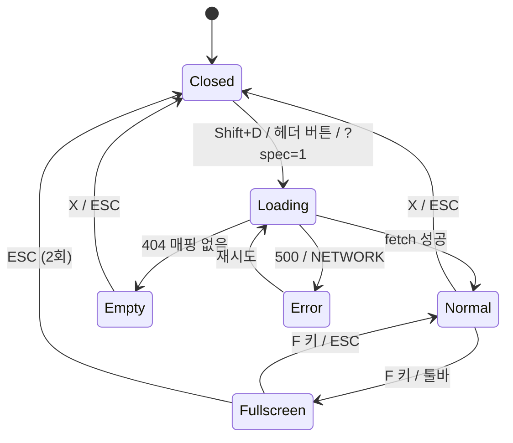

# SCR-107 화면설계서 오버레이 — 기본화면 (마스터)

> 이 문서는 **화면 마스터 스펙**입니다. `01~05` 상태 문서는 이 문서를 상속(override/delta)합니다.
> 기존 `docs/화면설계서/` 마크다운 문서를 **현재 화면 위에 오버레이** 로 띄워 기획-개발 싱크를 맞추는 유틸리티 화면.

---

## 0. 메타 & 원천 참조

| 항목 | 값 |
|------|----|
| 화면 ID | SCR-107 |
| 화면명 | 화면설계서 오버레이 |
| 도메인 | D01-공통 (글로벌) |
| 경로 | `/?spec=1` (쿼리 파라미터 오버레이) |
| Next.js Route Group | (없음) — 모든 라우트 위에 포털로 마운트 |
| 파일 경로 | `src/components/spec-overlay/SpecOverlay.tsx` (Portal 기반 오버레이) |
| 페이지 컴포넌트 | `SpecOverlay` (최상위 Provider 아래 전역 마운트) |
| 역할 | superAdmin, primary, owner, manager, fc, trainer, staff (all 로그인) — 개발/기획 환경 플래그로 front 제외 |
| 우선순위 | P2 (기획 싱크 유틸리티) |
| 플랫폼 | 데스크톱 우선 / 태블릿 / 모바일(뷰어 모드만) |
| i18n | ko-KR 고정 |
| 환경 노출 | `NEXT_PUBLIC_SPEC_OVERLAY=true` 또는 `role ∈ {superAdmin, primary}` |

### 원천 문서 링크
| 문서 종류 | 경로 | 참조 섹션 |
|---|---|---|
| 화면설계서 (공통) | `docs/화면설계서/공통.md` | §1 라우트맵 (전 화면과 매칭), §3 공통 UI 패턴 |
| 상태별 문서 원본 | `docs/화면설계서/` | 전 도메인 SCR/DLG 마크다운 소스 |
| 다이어그램 F1 진입 | `docs/다이어그램/D01_공통/SCR-107_화면설계서오버레이/F1_진입.md` | 진입 방법 3가지 (헤더/Shift+D/쿼리) |
| 다이어그램 F2 메인 | `docs/다이어그램/D01_공통/SCR-107_화면설계서오버레이/F2_메인.md` | 페이지 이동/줌/목차/주석 |
| 다이어그램 F3 버튼액션 | `docs/다이어그램/D01_공통/SCR-107_화면설계서오버레이/F3_버튼액션.md` | PDF/MD 다운로드, 인쇄, 전체화면, 닫기 |
| 다이어그램 F6 상태별 | `docs/다이어그램/D01_공통/SCR-107_화면설계서오버레이/F6_상태별.md` | 로딩/정상/빈/에러/전체화면 |
| 다이어그램 F7 권한 | `docs/다이어그램/D01_공통/SCR-107_화면설계서오버레이/F7_권한.md` | 역할 무관 공통 |
| 다이어그램 F8 에러 | `docs/다이어그램/D01_공통/SCR-107_화면설계서오버레이/F8_에러.md` | 404 파일 없음, 500 파싱 실패 |
| 에러코드정의서 | `docs/에러코드정의서.md` | §공통 E404001, E500001 |

---

## 1. 화면 목적 (Why)

현재 사용자가 보고 있는 CRM 화면의 **공식 설계서(마크다운)** 를 한 번의 단축키로 같은 화면 위에 겹쳐 보이도록 하여:
- 기획자·QA·개발자가 **실제 UI와 설계서를 동시에 비교** 할 수 있게 한다.
- 상태별(`01~N`) 문서를 빠르게 탐색할 수 있도록 사이드 목차를 제공.
- Mermaid 다이어그램과 스펙 테이블을 바로 읽고, PDF/MD로 스냅샷 다운로드 가능.

비기능 목표:
- 원본 CRM 페이지 인터랙션을 **중단시키지 않음**(pointer-events 분리 옵션).
- 개발 빌드 및 `superAdmin` 운영 환경에서만 노출.

---

## 2. 화면 레이아웃 (Wireframe)

### 2.1 풀뷰 와이어프레임 (데스크톱 1440px 기준, 기본 정상 상태)

```
┌───────────────────────────────────────────────────────────────────────────┐
│  [ 현재 CRM 화면 (배경에 흐리게 유지) — 더미 회원목록/대시보드 등 ]           │
│                                                                           │
│  ┌─────────────────────────────────────────────────────────────────────┐ │
│  │  Spec Overlay (fixed inset-0 bg-black/30 backdrop-blur-sm z-[60])    │ │
│  │ ┌─────────────────────────────────────────────────────────────────┐ │ │
│  │ │ 📘 화면설계서 ▸ D02-회원관리 ▸ SCR-010 회원목록                 │ │ │ ← Header (48px)
│  │ │    [경로:/members] [상태: 02-정상]           ⌘ ⎘ ⤢ ✕           │ │ │   MD PDF 전체 닫기
│  │ ├──────────┬──────────────────────────────────────────────────────┤ │ │
│  │ │          │                                                      │ │ │
│  │ │ 목차     │   # SCR-010 회원목록 — 02 정상                       │ │ │
│  │ │ (240)    │                                                      │ │ │
│  │ │          │   > 상속: 00-기본화면.md                             │ │ │
│  │ │ □ 00 기본│                                                      │ │ │
│  │ │ ■ 01 로딩│   ## 메타                                            │ │ │
│  │ │ ● 02 정상│   | 상태 코드 | member-list-default |                │ │ │
│  │ │ □ 03 빈  │   ...                                                │ │ │
│  │ │ □ 04 에러│                                                      │ │ │
│  │ │ □ 05 검색│   ```mermaid                                         │ │ │
│  │ │          │    flowchart TD ... ← 렌더된 SVG                     │ │ │
│  │ │ [⏴ 이전] │   ```                                                │ │ │
│  │ │ [다음 ⏵] │                                                      │ │ │
│  │ │          │                                                      │ │ │
│  │ │          │   (스크롤 가능, prose max-w-none)                    │ │ │
│  │ └──────────┴──────────────────────────────────────────────────────┘ │ │
│  │ ┌─────────────────────────────────────────────────────────────────┐ │ │
│  │ │  🔍 50% ─●───── 200%   📌 주석 toggle   📖 N/M 페이지          │ │ │ ← Toolbar (40px)
│  │ └─────────────────────────────────────────────────────────────────┘ │ │
│  └─────────────────────────────────────────────────────────────────────┘ │
└───────────────────────────────────────────────────────────────────────────┘
```

### 2.2 영역별 치수 / 역할 표

| 영역 | 위치 | 치수 | 역할 |
|------|------|------|------|
| Backdrop | 전역 | `fixed inset-0 bg-black/30 backdrop-blur-sm z-[60]` | 배경 블러 |
| Overlay Frame | 중앙 | `max-w-7xl w-[calc(100vw-64px)] h-[calc(100vh-64px)]` | 오버레이 컨테이너 |
| Header | 상단 | 48px h | 문서 타이틀 + 툴바 액션 |
| TOC Sidebar | 좌측 | 240px × 100% | 상태 목차 + 이전/다음 네비 |
| Main Viewer | 우측 | flex-1 | 마크다운 렌더 영역 |
| Footer Toolbar | 하단 | 40px h | 줌/주석/페이지 정보 |
| Close Button | 우상단 | 32×32 | 오버레이 닫기(X) |
| Mermaid Canvas | Main 내부 | auto | Mermaid SVG 렌더러 |

### 2.3 전체화면 변형 (05-전체화면)

```
┌───────────────────────────────────────────────────────────────────────────┐
│ 📘 SCR-010 회원목록 - 02 정상                          ⌘ ⎘ ⤢off ✕        │ ← Header (48px)
├──────────┬────────────────────────────────────────────────────────────────┤
│ 목차     │   (마크다운 콘텐츠 전체 화면으로 확장)                         │
│ (280)    │   max-w-4xl mx-auto 가독성 유지                               │
│          │                                                                │
└──────────┴────────────────────────────────────────────────────────────────┘
```

- Backdrop 제거. 배경 블러 없음. Viewport 전체 차지 (`inset-0`).
- ESC 한 번 → 일반 모드, 두 번 → 완전 종료.

---

## 3. 디자인 토큰

### 3.1 색상 (Tailwind 토큰 매핑)
| 역할 | 클래스 | 용도 |
|------|--------|------|
| bg.backdrop | `bg-black/30 backdrop-blur-sm` | 뒤 화면 흐리게 |
| bg.overlay | `bg-white` | 프레임 배경 |
| border.overlay | `ring-1 ring-gray-200` | 프레임 테두리 |
| bg.toc | `bg-gray-50 border-r border-gray-200` | 좌측 목차 |
| bg.header | `bg-white border-b border-gray-200` | 헤더 바 |
| bg.toolbar | `bg-gray-50 border-t border-gray-200` | 하단 툴바 |
| bg.toc.active | `bg-blue-50 text-blue-700 ring-1 ring-blue-200` | 현재 상태 목차 항목 |
| bg.toc.hover | `hover:bg-gray-100` | 목차 호버 |
| fg.title | `text-gray-900 font-semibold` | 헤더 제목 |
| fg.path | `text-gray-500 font-mono text-xs` | 경로 뱃지 |
| fg.body | `text-gray-800` | 마크다운 본문 |
| fg.muted | `text-gray-500` | 보조 텍스트 |
| btn.icon | `size-8 rounded-md text-gray-600 hover:bg-gray-100 hover:text-gray-900` | 툴바 아이콘 버튼 |
| btn.primary | `bg-blue-600 hover:bg-blue-700 text-white` | "다운로드" 같은 주요 액션 |
| mermaid.bg | `bg-white` | Mermaid 영역 배경 |
| mermaid.border | `ring-1 ring-gray-200 rounded-lg` | Mermaid 카드 테두리 |

### 3.2 타이포그래피 (prose 커스터마이즈)
| 토큰 | 스타일 | 용도 |
|------|--------|------|
| h1 | `text-2xl font-bold tracking-tight text-gray-900` | 문서 최상위 제목 |
| h2 | `text-xl font-semibold text-gray-900 mt-8 mb-3 border-b pb-2` | 섹션 제목 |
| h3 | `text-lg font-semibold text-gray-900 mt-6 mb-2` | 하위 섹션 |
| p | `text-sm text-gray-700 leading-relaxed` | 본문 |
| code | `font-mono text-xs bg-gray-100 px-1.5 py-0.5 rounded` | 인라인 코드 |
| pre | `bg-gray-900 text-gray-100 rounded-lg p-4 text-xs overflow-auto` | 코드 블록 |
| table | `text-xs border-collapse w-full` | 테이블 |
| th | `bg-gray-100 text-left px-2 py-1.5 border-b border-gray-300` | 헤더 셀 |
| td | `px-2 py-1.5 border-b border-gray-200 align-top` | 데이터 셀 |
| blockquote | `border-l-4 border-blue-400 bg-blue-50 pl-4 py-2 text-gray-700` | 인용문 |

### 3.3 간격 / 반경 / 그림자
| 토큰 | 값 |
|------|----|
| radius.overlay | `rounded-xl` (12px) |
| radius.toc.item | `rounded-md` (6px) |
| shadow.overlay | `shadow-2xl` |
| spacing.toc.item | `px-3 py-2` |
| spacing.content | `p-6` (메인 뷰어) |
| spacing.header | `px-4 py-2` |

### 3.4 모션 / 포커스
| 토큰 | 값 |
|------|----|
| motion.enter | `animate-[fadeIn_150ms_ease-out]` |
| motion.frame.enter | `animate-[scaleIn_180ms_ease-out]` |
| motion.reduced | `motion-reduce:animate-none` |
| focus.ring | `focus-visible:outline-none focus-visible:ring-2 focus-visible:ring-blue-500 focus-visible:ring-offset-2` |

---

## 4. 반응형 규칙

| BP | 폭 | 오버레이 | TOC | 비고 |
|---|---|---|---|---|
| Mobile <640 | 100% | `inset-x-2 inset-y-4 rounded-lg` | 상단 드롭다운 | TOC 숨김 + 햄버거 아이콘, 단일 컬럼 |
| Tablet 640~1024 | center | `w-[calc(100vw-48px)] h-[calc(100vh-48px)]` | 200px | |
| Desktop ≥1024 | center | `max-w-7xl w-[calc(100vw-64px)] h-[calc(100vh-64px)]` | 240px | |
| 전체화면 | 100% | `inset-0 rounded-none` | 280px | Backdrop 제거 |

키보드 포커스: 데스크톱은 Shift+D 로 오픈, 모바일은 기능 숨김(환경 플래그로 비활성).

---

## 5. 🔐 역할별(RBAC) 매트릭스

> 개발/기획 유틸리티 성격. 기본적으로 **운영 환경에서는 `superAdmin/primary` 만**, 개발 환경에서는 전 역할 노출.

| 요소 | superAdmin | primary | owner | manager | fc | trainer | staff | front |
|---|:---:|:---:|:---:|:---:|:---:|:---:|:---:|:---:|
| 오버레이 진입 (env=dev) | ● | ● | ● | ● | ● | ● | ● | — |
| 오버레이 진입 (env=prod) | ● | ● | — | — | — | — | — | — |
| 헤더 "설계서" 버튼 노출 | ● | ● | — | — | — | — | — | — |
| 단축키 Shift+D | ● | ● | ●* | ●* | ●* | ●* | ●* | — |
| URL 쿼리 `?spec=1` | ● | ● | ●* | ●* | ●* | ●* | ●* | — |
| 목차 상태 전환 | ● | ● | ● | ● | ● | ● | ● | — |
| PDF 다운로드 | ● | ● | — | — | — | — | — | — |
| MD 다운로드 | ● | ● | ● | ● | ● | ● | ● | — |
| 인쇄 | ● | ● | ● | ● | ● | ● | ● | — |
| 전체화면 | ● | ● | ● | ● | ● | ● | ● | — |
| 주석 레이어 토글 | ● | ● | ● | ● | ● | ● | ● | — |

\* 개발 환경에서만 노출. `NEXT_PUBLIC_SPEC_OVERLAY=true` 가 필요.

### 5.1 멀티테넌트
- 설계서 파일은 **지점 무관(branchId 미적용)**. 공통 레포 문서.
- 지점 전환 시 오버레이는 닫히지 않고 유지. 현재 경로 변경에 따라 맵핑되는 문서만 자동 전환.

---

## 6. 컴포넌트 트리

```
<SpecOverlayProvider>                           (Context Provider, app/providers.tsx)
  <SpecOverlay>                                 (Portal @ document.body)
    <Backdrop />                                (bg-black/30 blur)
    <OverlayFrame>                              (max-w-7xl rounded-xl bg-white shadow-2xl)
      <OverlayHeader>
        <Breadcrumb scrId={scrId} stateCode={stateCode} />
        <PathBadge path={currentPath} />
        <ToolbarActions>
          <IconButton icon="Download" onClick={downloadMD} />
          <IconButton icon="FileText" onClick={downloadPDF} />
          <IconButton icon="Maximize2" onClick={toggleFullscreen} />
          <IconButton icon="X" onClick={close} />
        </ToolbarActions>
      </OverlayHeader>
      <OverlayBody>
        <TocSidebar states={states} current={stateCode}
                    onSelect={setStateCode}
                    onPrev={prev} onNext={next} />
        <MainViewer>
          <MarkdownRenderer source={mdSource}
                            plugins={[remarkGfm, remarkMermaid]}
                            components={{ pre: CodeBlock, table: TableWrap }} />
        </MainViewer>
      </OverlayBody>
      <OverlayFooter>
        <ZoomSlider value={zoom} onChange={setZoom} min={50} max={200} />
        <AnnotationToggle on={showAnnotations} onToggle={toggleAnnotations} />
        <PageIndicator current={currentIndex} total={total} />
      </OverlayFooter>
    </OverlayFrame>
  </SpecOverlay>
</SpecOverlayProvider>
```

### 컴포넌트 명세
| 컴포넌트 | Props | 재사용 여부 |
|---|---|---|
| `SpecOverlayProvider` | `{ children, enabled: boolean }` | 전역 1회 |
| `SpecOverlay` | (store 기반, props 없음) | 전역 1회 |
| `TocSidebar` | `{ states: Array<{code,label}>; current; onSelect; onPrev; onNext }` | 전용 |
| `MarkdownRenderer` | `{ source: string; plugins?; components? }` | react-markdown 래퍼 |
| `MermaidBlock` | `{ code: string }` | Mermaid 렌더 (lazy import) |
| `ZoomSlider` | `{ value: number; onChange: (v:number)=>void; min,max }` | 공용 (50~200%) |
| `IconButton` | `{ icon, onClick, ariaLabel, disabled? }` | 전역 공용 |

---

## 7. 데이터 계약

### 7.1 경로 → 문서 매핑

```ts
// src/lib/spec-overlay/route-to-doc.ts
export interface SpecDocMeta {
  scrId: string;              // 'SCR-010'
  domain: string;             // 'D02-회원관리'
  route: string;              // '/members'
  baseDir: string;            // 'docs/화면설계서/D02-회원관리/SCR-010-회원목록'
  states: Array<{ code: string; file: string; label: string }>;
}

export function resolveDocForRoute(pathname: string): SpecDocMeta | null;
// 예: '/members' → SCR-010 매핑
//     '/members/detail' → SCR-013
//     '/login' → SCR-100
```

### 7.2 마크다운 로드 API

| 엔드포인트 | 요청 | 응답 |
|---|---|---|
| `GET /api/spec-docs?scr=SCR-010&state=01` | 쿼리 파라미터 | `{ success:true, data: { markdown: string, meta: SpecDocMeta } }` |
| `GET /api/spec-docs?scr=SCR-010` | — | `{ success:true, data: { markdown: string, states: [...] } }` — 00-기본화면.md |
| 실패 404 | | `{ success:false, errorCode:'E404001', message:'설계서 파일을 찾을 수 없습니다' }` |
| 실패 500 | | `{ success:false, errorCode:'E500001', message:'설계서 파싱 실패' }` |

서버 구현(Next.js Route Handler):
```ts
// src/app/api/spec-docs/route.ts
import { readFile } from 'fs/promises';
import { resolveDocForRoute, resolveDocPath } from '@/lib/spec-overlay';

export async function GET(req: Request) {
  const { searchParams } = new URL(req.url);
  const scr = searchParams.get('scr');
  const state = searchParams.get('state') ?? '00';
  const filePath = resolveDocPath(scr, state);
  try {
    const md = await readFile(filePath, 'utf-8');
    return Response.json({ success: true, data: { markdown: md } });
  } catch (e: any) {
    if (e.code === 'ENOENT') {
      return Response.json({ success: false, errorCode: 'E404001', message: '설계서 파일을 찾을 수 없습니다' }, { status: 404 });
    }
    return Response.json({ success: false, errorCode: 'E500001', message: String(e) }, { status: 500 });
  }
}
```

### 7.3 상태 관리

```ts
// src/stores/specOverlayStore.ts
interface SpecOverlayState {
  isOpen: boolean;
  isFullscreen: boolean;
  scrId: string | null;
  stateCode: string;        // '00' | '01' | ...
  zoom: number;             // 50~200
  showAnnotations: boolean;
  markdown: string | null;
  loading: boolean;
  errorCode: null | 'E404001' | 'E500001' | 'NETWORK';
  open: (scrId?: string, stateCode?: string) => void;
  close: () => void;
  setStateCode: (c: string) => void;
  toggleFullscreen: () => void;
  setZoom: (v: number) => void;
  reload: () => void;
}
```

- 라우트 변경 자동 동기화: `usePathname()` → `resolveDocForRoute()` → `scrId` 업데이트.
- 데이터 로드는 React Query (`useQuery(['spec-doc', scrId, stateCode])`).

---

## 8. 비즈니스 룰

1. **진입 3 경로**: (a) 헤더 "설계서" 버튼, (b) 단축키 `Shift+D` (macOS/Windows 공통), (c) URL 쿼리 `?spec=1` + 선택적 `&scr=SCR-010&state=02`.
2. **오버레이 1개 규칙**: 동시에 1개만 오픈. 재트리거는 무시 또는 현재 오버레이 상태만 갱신.
3. **현재 경로 자동 매핑**: 오버레이 열릴 때 `usePathname()` 로 SCR 자동 선택. 매핑 실패 시 `03-빈상태`.
4. **상태 없음**: 상태 쿼리(`?state=02`)가 해당 SCR에 존재하지 않으면 `00-기본화면` 으로 fallback + 토스트 "해당 상태 문서가 없습니다".
5. **다운로드 권한**: PDF 다운로드는 `superAdmin/primary` 만. 그 외에는 버튼 비활성 + 툴팁 "권한 없음".
6. **탭 보존**: 오버레이 내부는 `role="dialog"` 이지만 **배경의 CRM은 여전히 pointer-events 차단**. ESC 2번 누르면 완전 종료 (Fullscreen 먼저 해제 후 닫기).
7. **라우트 변경 감지**: 오버레이 열려 있는 동안 CRM 페이지 이동이 발생하면 자동으로 새 SCR 문서를 로드(stateCode 는 `02-정상`으로 리셋).
8. **인쇄**: `window.print()` 호출. 인쇄용 CSS에서 Backdrop/TOC 숨김, Main Viewer 만 보이도록 `@media print`.
9. **감사 로그**: `AUDIT.SPEC_OVERLAY_OPEN` (scrId, stateCode) — superAdmin 행위만 기록(선택).
10. **개발 환경 판별**: `process.env.NEXT_PUBLIC_SPEC_OVERLAY === 'true'` 또는 `useAuthStore().role === 'superAdmin'`.

---

## 9. 상태 목록

| 파일 | 상태 코드 | 한글 | 트리거 |
|---|---|---|---|
| `01-로딩.md` | `spec-overlay-loading` | 로딩 | 오버레이 열림 + `useQuery` pending |
| `02-정상.md` | `spec-overlay-normal` | 정상 | fetch 성공, 마크다운/Mermaid 렌더 완료 |
| `03-빈상태.md` | `spec-overlay-empty` | 빈 상태 | 404 (해당 경로 매핑 문서 없음) |
| `04-에러.md` | `spec-overlay-error` | 에러 | 500 파싱 실패 / 네트워크 |
| `05-전체화면.md` | `spec-overlay-fullscreen` | 전체화면 | 전체화면 토글 ON |

상태 전이: `01-로딩 → 02-정상 | 03-빈상태 | 04-에러`, `02-정상 ⇄ 05-전체화면`

---

## 10. 에러 코드 매핑

| errorCode | HTTP | 시나리오 | 사용자 메시지 | 추가 액션 |
|---|---|---|---|---|
| E404001 | 404 | 해당 경로 문서 없음 | "설계서 문서를 찾을 수 없습니다" | 빈 상태 UI + "업로드 가이드 열기" 링크 |
| E404002 | 404 | 상태 파일 없음 | "해당 상태 문서가 없습니다" | `00-기본화면.md` 로 fallback |
| E500001 | 500 | 파싱 실패 | "설계서를 불러오는 중 오류가 발생했습니다" | 재시도 버튼 + 콘솔 로그 |
| E403001 | 403 | 권한 없음 (운영) | "이 기능은 슈퍼관리자만 사용 가능합니다" | 오버레이 자동 닫기 + 토스트 |
| NETWORK | — | 네트워크 | "네트워크 연결을 확인해주세요" | 재시도 버튼 |

---

## 11. 접근성 (WCAG 2.1 AA)

| 항목 | 요구사항 |
|---|---|
| role | Overlay `role="dialog"` + `aria-modal="true"` + `aria-labelledby="spec-overlay-title"` |
| 포커스 트랩 | 오버레이 내부 Tab 순환 (닫기 → 목차 → 다운로드 → 줌 → 닫기) |
| 키보드 | `Shift+D`=열기/닫기, `Esc`=닫기(Fullscreen 시 Fullscreen 먼저 해제), `[`/`]`=이전/다음 상태, `+`/`-`=줌, `F`=전체화면 |
| 라이브 리전 | 로딩 상태 `aria-busy="true"`, 에러 배너 `role="alert"` |
| 대비 | 본문 4.5:1, 코드 블록 7:1 (가독성 향상) |
| 스크린리더 | 목차 항목: `<nav aria-label="설계서 상태 목록">`, 각 항목 `aria-current="true"` 현재 상태 |
| 모션 감소 | `prefers-reduced-motion:reduce` 시 enter 애니 제거 |
| 포커스 가시 | `focus-visible:ring-2 ring-blue-500 ring-offset-2` |
| 색상 의존 금지 | 현재 상태 표시는 배경색 + 좌측 라디오 `●` 아이콘 병행 |

---

## 12. 진입/이탈 연결

### 진입 (이 오버레이를 여는 경로)
- 헤더 우측 "설계서" 버튼 (초기 비활성; env/role로 활성)
- 단축키 `Shift+D`
- URL 쿼리 `?spec=1` (외부 링크/북마크 공유)
- 개발자 콘솔: `window.__openSpecOverlay()` (dev only)

### 이탈 (이 오버레이에서 나가는 경로)
| 액션 | 목적지 |
|---|---|
| X 버튼 / ESC | 오버레이 닫기, 배경 CRM 유지 |
| 닫기 후 CRM 네비게이션 | 정상 동작 |
| PDF/MD 다운로드 | 오버레이 유지 + 다운로드 토스트 |
| 인쇄 | 브라우저 인쇄 다이얼로그 |
| 목차 항목 선택 | 같은 오버레이 내 상태 전환 |

---

## 13. 다이어그램 통합 뷰



참조: `docs/다이어그램/D01_공통/SCR-107_화면설계서오버레이/F6_상태별.md`

---

## 14. 🧩 바이브코딩 프롬프트 (마스터)

```
Next.js 15 App Router + TypeScript + Tailwind + Zustand + React Query + react-markdown + mermaid
'use client' 전역 스펙 오버레이를 작성하라.

━━ 파일 구성 ━━
src/stores/specOverlayStore.ts
src/lib/spec-overlay/route-to-doc.ts
src/lib/spec-overlay/resolve-doc-path.ts   (서버 전용, fs 사용)
src/app/api/spec-docs/route.ts              (Route Handler)
src/components/spec-overlay/SpecOverlay.tsx (Portal)
src/components/spec-overlay/TocSidebar.tsx
src/components/spec-overlay/MarkdownRenderer.tsx
src/components/spec-overlay/MermaidBlock.tsx
src/components/spec-overlay/ZoomSlider.tsx
src/hooks/useSpecOverlayHotkeys.ts

━━ 스토어 ━━
import { create } from 'zustand';
export type SpecErrorCode = null | 'E404001' | 'E404002' | 'E500001' | 'E403001' | 'NETWORK';
export const useSpecOverlayStore = create<{
  isOpen: boolean;
  isFullscreen: boolean;
  scrId: string | null;
  stateCode: string;           // '00','01','02',...
  zoom: number;
  showAnnotations: boolean;
  open: (scrId?: string, stateCode?: string) => void;
  close: () => void;
  setStateCode: (c: string) => void;
  toggleFullscreen: () => void;
  setZoom: (v: number) => void;
  toggleAnnotations: () => void;
}>((set) => ({
  isOpen: false, isFullscreen: false, scrId: null, stateCode: '02',
  zoom: 100, showAnnotations: false,
  open: (scrId, stateCode='02') => set({ isOpen:true, scrId: scrId ?? null, stateCode }),
  close: () => set({ isOpen:false, isFullscreen:false }),
  setStateCode: (c) => set({ stateCode: c }),
  toggleFullscreen: () => set((s) => ({ isFullscreen: !s.isFullscreen })),
  setZoom: (v) => set({ zoom: Math.min(200, Math.max(50, v)) }),
  toggleAnnotations: () => set((s) => ({ showAnnotations: !s.showAnnotations })),
}));

━━ 라우트→문서 매핑 ━━
// src/lib/spec-overlay/route-to-doc.ts
const MAP: Array<{ pattern: RegExp; scrId: string; domain: string }> = [
  { pattern: /^\/login$/,             scrId: 'SCR-100', domain: 'D01-공통' },
  { pattern: /^\/$/,                  scrId: 'SCR-101', domain: 'D01-공통' },
  { pattern: /^\/members$/,           scrId: 'SCR-010', domain: 'D02-회원관리' },
  { pattern: /^\/members\/detail/,    scrId: 'SCR-013', domain: 'D02-회원관리' },
  { pattern: /^\/calendar$/,          scrId: 'SCR-020', domain: 'D03-수업관리' },
  // ... 67개 라우트
];
export function resolveDocForRoute(pathname: string) {
  return MAP.find(m => m.pattern.test(pathname)) ?? null;
}

━━ 단축키 훅 ━━
// src/hooks/useSpecOverlayHotkeys.ts
export function useSpecOverlayHotkeys() {
  const { isOpen, isFullscreen, open, close, toggleFullscreen, setZoom } = useSpecOverlayStore();
  useEffect(() => {
    const onKey = (e: KeyboardEvent) => {
      if (e.shiftKey && e.key === 'D') { e.preventDefault(); isOpen ? close() : open(); return; }
      if (!isOpen) return;
      if (e.key === 'Escape') { isFullscreen ? (useSpecOverlayStore.getState().toggleFullscreen()) : close(); }
      if (e.key === 'f' || e.key === 'F') toggleFullscreen();
      if (e.key === '+') setZoom(useSpecOverlayStore.getState().zoom + 10);
      if (e.key === '-') setZoom(useSpecOverlayStore.getState().zoom - 10);
    };
    window.addEventListener('keydown', onKey);
    return () => window.removeEventListener('keydown', onKey);
  }, [isOpen, isFullscreen]);
}

━━ 오버레이 컴포넌트 ━━
'use client';
import { createPortal } from 'react-dom';
import { useQuery } from '@tanstack/react-query';
import { usePathname } from 'next/navigation';
import ReactMarkdown from 'react-markdown';
import remarkGfm from 'remark-gfm';
import { X, Download, FileText, Maximize2, Minimize2 } from 'lucide-react';
import { useSpecOverlayStore } from '@/stores/specOverlayStore';
import { resolveDocForRoute } from '@/lib/spec-overlay/route-to-doc';
import MermaidBlock from './MermaidBlock';

export default function SpecOverlay() {
  const s = useSpecOverlayStore();
  const pathname = usePathname();
  const auto = resolveDocForRoute(pathname);
  const scrId = s.scrId ?? auto?.scrId ?? null;

  const q = useQuery({
    queryKey: ['spec-doc', scrId, s.stateCode],
    enabled: s.isOpen && !!scrId,
    queryFn: async () => {
      const res = await fetch(`/api/spec-docs?scr=${scrId}&state=${s.stateCode}`);
      const body = await res.json();
      if (!res.ok) throw body;
      return body.data.markdown as string;
    },
    retry: 0,
  });

  if (!s.isOpen || typeof document === 'undefined') return null;

  const frameClass = s.isFullscreen
    ? 'fixed inset-0 bg-white rounded-none'
    : 'relative max-w-7xl w-[calc(100vw-64px)] h-[calc(100vh-64px)] bg-white rounded-xl shadow-2xl ring-1 ring-gray-200';

  return createPortal(
    <div role="dialog" aria-modal="true" aria-labelledby="spec-overlay-title"
         className={s.isFullscreen
           ? 'fixed inset-0 z-[60]'
           : 'fixed inset-0 z-[60] flex items-center justify-center bg-black/30 backdrop-blur-sm px-8 py-8'}>
      <div className={`${frameClass} flex flex-col motion-reduce:animate-none animate-[scaleIn_180ms_ease-out]`}>
        {/* Header */}
        <header className="flex items-center gap-2 px-4 h-12 border-b border-gray-200">
          <span className="text-lg">📘</span>
          <div id="spec-overlay-title" className="flex-1 min-w-0 flex items-center gap-2 text-sm">
            <span className="text-gray-500">화면설계서 ▸ {auto?.domain}</span>
            <span className="font-semibold text-gray-900 truncate">{scrId}</span>
            <span className="text-xs text-gray-500 font-mono bg-gray-100 px-1.5 py-0.5 rounded">{pathname}</span>
            <span className="text-xs text-blue-700 bg-blue-50 px-1.5 py-0.5 rounded">상태 {s.stateCode}</span>
          </div>
          <button aria-label="MD 다운로드" onClick={() => downloadMD(q.data, scrId!, s.stateCode)}
                  className="size-8 rounded-md text-gray-600 hover:bg-gray-100 hover:text-gray-900 grid place-items-center">
            <Download className="size-4" aria-hidden />
          </button>
          <button aria-label="PDF 다운로드" onClick={() => downloadPDF()}
                  className="size-8 rounded-md text-gray-600 hover:bg-gray-100 hover:text-gray-900 grid place-items-center">
            <FileText className="size-4" aria-hidden />
          </button>
          <button aria-label={s.isFullscreen ? '전체화면 해제' : '전체화면'}
                  onClick={s.toggleFullscreen}
                  className="size-8 rounded-md text-gray-600 hover:bg-gray-100 hover:text-gray-900 grid place-items-center">
            {s.isFullscreen ? <Minimize2 className="size-4" /> : <Maximize2 className="size-4" />}
          </button>
          <button aria-label="닫기" onClick={s.close}
                  className="size-8 rounded-md text-gray-600 hover:bg-gray-100 hover:text-gray-900 grid place-items-center">
            <X className="size-4" aria-hidden />
          </button>
        </header>

        {/* Body */}
        <div className="flex-1 min-h-0 flex">
          <aside className="w-60 shrink-0 bg-gray-50 border-r border-gray-200 overflow-y-auto p-2">
            <nav aria-label="설계서 상태 목록" className="space-y-1">
              {STATES.map((st) => {
                const active = st.code === s.stateCode;
                return (
                  <button key={st.code}
                    aria-current={active ? 'true' : undefined}
                    onClick={() => s.setStateCode(st.code)}
                    className={`w-full text-left px-3 py-2 rounded-md text-xs flex items-center gap-2
                      ${active ? 'bg-blue-50 text-blue-700 ring-1 ring-blue-200 font-semibold'
                               : 'text-gray-700 hover:bg-gray-100'}`}>
                    <span aria-hidden>{active ? '●' : '□'}</span>
                    <span>{st.code} {st.label}</span>
                  </button>
                );
              })}
            </nav>
          </aside>

          <main className="flex-1 min-w-0 overflow-y-auto p-6" style={{ zoom: `${s.zoom}%` }}>
            {q.isLoading && <SkeletonDoc />}
            {q.isError && <ErrorState errorCode={(q.error as any)?.errorCode ?? 'NETWORK'} onRetry={() => q.refetch()} />}
            {q.data && (
              <article className="prose prose-sm max-w-none">
                <ReactMarkdown remarkPlugins={[remarkGfm]}
                  components={{
                    pre: ({children, ...rest}: any) => {
                      const code = children?.props?.children ?? '';
                      const lang = children?.props?.className?.replace('language-','');
                      if (lang === 'mermaid') return <MermaidBlock code={code} />;
                      return <pre className="bg-gray-900 text-gray-100 rounded-lg p-4 text-xs overflow-auto" {...rest}>{children}</pre>;
                    },
                  }}>{q.data}</ReactMarkdown>
              </article>
            )}
          </main>
        </div>

        {/* Footer */}
        <footer className="flex items-center gap-4 px-4 h-10 border-t border-gray-200 bg-gray-50 text-xs text-gray-600">
          <label className="flex items-center gap-2">
            🔍
            <input type="range" min={50} max={200} step={10} value={s.zoom}
                   onChange={(e) => s.setZoom(Number(e.target.value))} className="w-32" aria-label="줌 슬라이더" />
            <span className="tabular-nums w-10">{s.zoom}%</span>
          </label>
          <button onClick={s.toggleAnnotations}
                  aria-pressed={s.showAnnotations}
                  className={`px-2 py-1 rounded-md ${s.showAnnotations ? 'bg-blue-50 text-blue-700' : 'hover:bg-gray-200'}`}>
            📌 주석 {s.showAnnotations ? 'ON' : 'OFF'}
          </button>
          <span className="ml-auto">문서 경로: docs/화면설계서/{auto?.domain}/{scrId}</span>
        </footer>
      </div>
    </div>,
    document.body
  );
}

━━ 디자인 토큰 (정확히) ━━
backdrop:   fixed inset-0 z-[60] bg-black/30 backdrop-blur-sm
frame:      max-w-7xl w-[calc(100vw-64px)] h-[calc(100vh-64px)]
            bg-white rounded-xl shadow-2xl ring-1 ring-gray-200
header:     h-12 px-4 border-b border-gray-200 flex items-center gap-2
toc:        w-60 bg-gray-50 border-r border-gray-200 overflow-y-auto p-2
toc.item:   w-full px-3 py-2 rounded-md text-xs
toc.active: bg-blue-50 text-blue-700 ring-1 ring-blue-200 font-semibold
main:       flex-1 overflow-y-auto p-6 prose prose-sm max-w-none
footer:     h-10 px-4 border-t border-gray-200 bg-gray-50 text-xs text-gray-600
icon.btn:   size-8 rounded-md text-gray-600 hover:bg-gray-100 hover:text-gray-900
mermaid:    bg-white ring-1 ring-gray-200 rounded-lg p-4

━━ Mermaid 렌더 (lazy) ━━
'use client';
import { useEffect, useRef } from 'react';
export default function MermaidBlock({ code }: { code: string }) {
  const ref = useRef<HTMLDivElement>(null);
  useEffect(() => {
    (async () => {
      const mermaid = (await import('mermaid')).default;
      mermaid.initialize({ startOnLoad: false, theme: 'neutral', securityLevel: 'loose' });
      const id = `m-${Math.random().toString(36).slice(2,8)}`;
      const { svg } = await mermaid.render(id, code);
      if (ref.current) ref.current.innerHTML = svg;
    })();
  }, [code]);
  return <div ref={ref} className="bg-white ring-1 ring-gray-200 rounded-lg p-4 my-4 overflow-auto" />;
}

━━ 다운로드 유틸 ━━
async function downloadMD(md: string | undefined, scrId: string, state: string) {
  if (!md) return;
  const blob = new Blob([md], { type: 'text/markdown;charset=utf-8' });
  const url = URL.createObjectURL(blob);
  const a = document.createElement('a');
  a.href = url; a.download = `${scrId}-${state}.md`;
  a.click(); URL.revokeObjectURL(url);
  toast.success('마크다운이 다운로드되었습니다');
}
async function downloadPDF() {
  const html2pdf = (await import('html2pdf.js')).default;
  const el = document.querySelector('[role="dialog"] main');
  if (!el) return;
  await html2pdf().from(el).save('spec-overlay.pdf');
}

━━ 인쇄 CSS ━━
@media print {
  .spec-overlay-backdrop { display: none !important; }
  .spec-overlay-toc { display: none !important; }
  .spec-overlay-footer { display: none !important; }
  .spec-overlay-frame { position: static; width: auto; height: auto; box-shadow: none; ring: 0; }
}

━━ 마운트 ━━
// app/providers.tsx
<QueryProvider>
  {children}
  {canShowSpecOverlay() && <SpecOverlay />}
</QueryProvider>

function canShowSpecOverlay() {
  if (process.env.NEXT_PUBLIC_SPEC_OVERLAY === 'true') return true;
  const role = useAuthStore.getState().user?.role;
  return role === 'superAdmin' || role === 'primary';
}

━━ QA 체크 ━━
- Shift+D 로 열림/닫힘 토글
- 경로 변경 시 자동으로 맞는 SCR 문서 로드
- 목차 선택 → 상태별 문서 전환
- 404 → 빈 상태 UI, 500 → 에러 + 재시도
- 전체화면 토글 F / ESC 2회
- Mermaid 렌더 정상 (SVG)
- PDF/MD 다운로드 동작
- 주석 토글 보존
- motion-reduce 준수
```

---

## 15. QA 체크리스트 (수용 기준)

- [ ] 헤더 "설계서" 버튼 / Shift+D / `?spec=1` 세 경로 모두 오버레이 오픈
- [ ] 오픈 시 현재 CRM 경로에 매핑된 SCR 자동 선택
- [ ] 목차로 상태별(`00~N`) 문서 전환
- [ ] 404 시 빈 상태 UI + "업로드 가이드" 링크
- [ ] 500/NETWORK 시 에러 배너 + 재시도 버튼
- [ ] 전체화면 토글 F / ESC 2회로 단계적 종료
- [ ] Mermaid 다이어그램 SVG 렌더
- [ ] PDF/MD 다운로드 성공 시 토스트
- [ ] 인쇄 시 TOC/Footer 숨김
- [ ] 줌 50~200% 슬라이더 반응
- [ ] 키보드만으로 전체 조작 가능
- [ ] 운영 환경에서는 superAdmin/primary 만 노출
- [ ] 모션 감소 설정 준수
- [ ] 오버레이 열린 상태에서 CRM 라우트 이동 시 자동 동기화
- [ ] 감사 로그 `AUDIT.SPEC_OVERLAY_OPEN` 기록 (선택)
