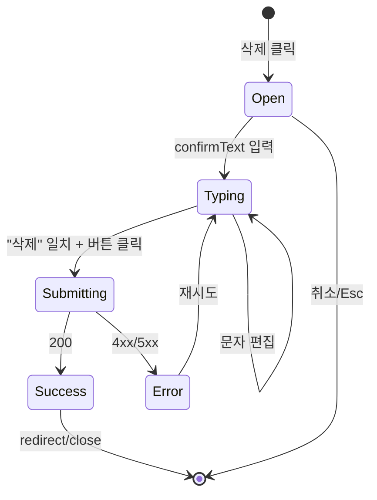

# DLG-M002 회원 삭제 확인 — 기본화면 (마스터)

> 이 문서는 **다이얼로그 마스터 스펙**입니다. `01~04` 상태 문서는 이 문서를 상속(override/delta)합니다.
> 🔴 **Destructive 레벨**: `destructive` (영구 삭제. 타이핑 확인 필수)
> 🏢 **멀티테넌트**: `branchId` 강제. 서버가 대상 회원의 branchId 검증.

---

## 0. 메타 & 원천 참조

| 항목 | 값 |
|---|---|
| 다이얼로그 ID | DLG-M002 |
| 다이얼로그명 | 회원 삭제 확인 (Delete Confirmation) |
| 도메인 | D02-회원관리 |
| 부모 화면 (트리거) | SCR-M004 회원상세 "회원 삭제" (위험 구역) / SCR-M001 BulkActionBar "일괄 삭제" |
| 라우트 (무변경) | `/members/detail?id=:id` (단일) / `/members` (복수) 오버레이 |
| 파일 경로 | `src/components/members/DeleteMemberDialog.tsx` |
| 컴포넌트 | `DeleteMemberDialog` |
| 역할 | `superAdmin`, `primary`, `owner` (MANAGER 이상 요구) |
| 우선순위 | P0 |
| 확인 레벨 | `destructive` (타이핑 확인 + danger variant) |
| 서버 blocking | ✅ Yes (DELETE 완료 전까지 모달 유지) |
| Esc 동작 | 모달 닫기 (제출 중 제외) |
| 포커스 트랩 | ✅ Radix Dialog 기본 |
| 트리거 조건 | `canDelete === true` AND `hasFeature(role, 'memberDelete')` |

### 원천 문서 링크
| 문서 | 경로 | 섹션 |
|---|---|---|
| 화면설계서 | `docs/화면설계서/회원관리.md` | §DLG-M002 삭제 확인 다이얼로그 (L2162~2199) |
| 기능명세서 | `docs/기능명세서/회원관리.md` | §회원 soft delete |
| 상태전이도 | `docs/상태전이도.md` | §1.5 개인정보 처리 (탈퇴·삭제 마스킹) |
| 에러코드정의서 | `docs/에러코드정의서.md` | §4.2 E404100, E403001, E422101 |
| 다이어그램 M1~M3 | `docs/다이어그램/D02_회원관리/DLG/DLG-M002_삭제확인/` | 생명주기/필드검증/결과분기 |

---

## 1. 화면 목적 (Why)

회원 데이터의 **영구 삭제(soft delete)** 전, 실수를 막기 위해 사용자가 **"삭제"** 텍스트를 타이핑해 확인하게 한다.
- 단일 회원 삭제(상세 화면) + 복수 회원 삭제(목록 BulkActionBar)
- 삭제 = `deletedAt = now(), status = 'INACTIVE'`로 마킹 (실제 레코드 유지, 30일 후 개인정보 마스킹)
- destructive 레벨: 파란 버튼 대신 **빨간 danger** 버튼
- 돌이킬 수 없음을 사용자에게 강하게 전달

---

## 2. 화면 레이아웃 (Wireframe)

### 2.1 모달 구조 (max-w-sm, 중앙)

```
┌────────────────────────────────────────────┐ ← Overlay bg-black/40
│                                            │
│  ┌──────────────────────────────────────┐  │
│  │ ⚠ 회원 삭제 확인                 [X] │  │ ← Header (danger icon)
│  ├──────────────────────────────────────┤
│  │ 김철수(010-1234-5678) 회원의          │  │ ← Body
│  │ 모든 데이터가 <b>영구 삭제</b>됩니다.  │  │
│  │ 계속하시겠습니까?                     │  │
│  │                                      │  │
│  │ ┌ 삭제되는 데이터 ──────────────┐     │  │ ← 경고 배너
│  │ │ • 회원 기본 정보               │     │  │   bg-red-50 border-red-200
│  │ │ • 매출/결제 내역 (연동 해제)    │     │  │
│  │ │ • 출석 기록                    │     │  │
│  │ │ • 상담/메모                    │     │  │
│  │ │ • 체성분/운동 이력              │     │  │
│  │ │ 복원 불가 (30일 후 개인정보      │     │  │
│  │ │ 마스킹 자동 실행)              │     │  │
│  │ └──────────────────────────────┘     │  │
│  │                                      │  │
│  │ 삭제하려면 아래에 <b>'삭제'</b> 입력  │  │
│  │ [_________________________]          │  │ ← confirmationText input
│  │                                      │  │
│  ├──────────────────────────────────────┤
│  │       [취소]  [🗑 삭제하기(비활성)]  │  │ ← Footer (danger btn)
│  └──────────────────────────────────────┘  │
│                                            │
└────────────────────────────────────────────┘
```

### 2.2 치수
| 영역 | 치수 | 스타일 |
|---|---|---|
| Content | `w-[92vw] max-w-sm` | `bg-white rounded-xl shadow-xl` |
| Header | `h-14 px-5 py-3 border-b` | 제목 + 닫기X |
| Body | `p-5 space-y-4` | — |
| Input | `h-11 w-full` | `rounded-lg border-gray-300` |
| Footer | `h-16 px-5 border-t` | `justify-end gap-2` |

---

## 3. 디자인 토큰

### 3.1 색상 (destructive 레벨)
| 토큰 | 클래스 |
|---|---|
| danger.banner | `bg-red-50 border border-red-200 text-red-700` |
| danger.title | `text-gray-900 font-semibold` (⚠ 아이콘 `text-red-600`) |
| input.default | `border-gray-300 focus:ring-red-500 focus:border-red-500` |
| input.match | `border-green-400 bg-green-50` (확인 문자열 일치) |
| btn.danger | `bg-red-600 hover:bg-red-700 text-white` |
| btn.danger.disabled | `bg-red-300 cursor-not-allowed` |
| btn.cancel | `bg-white ring-1 ring-gray-300 text-gray-700 hover:bg-gray-50` |

### 3.2 타이포
| 토큰 | 스타일 |
|---|---|
| title | `text-lg font-semibold text-gray-900` |
| subtitle | `text-sm text-gray-600` |
| memberName | `font-semibold text-red-700` (강조) |
| list.item | `text-xs text-red-700` |
| hint | `text-xs text-gray-500` |

---

## 4. 반응형
| BP | 동작 |
|---|---|
| Mobile <640 | `w-[92vw]` 중앙, Footer sticky |
| Tablet 640+ | `max-w-sm` 중앙 |

---

## 5. 🔐 역할별 매트릭스

| 요소 | superAdmin | primary | owner | manager | fc | trainer | staff | front |
|---|:---:|:---:|:---:|:---:|:---:|:---:|:---:|:---:|
| 트리거 버튼 노출 | ● | ● | ● | — | — | — | — | — |
| 다이얼로그 열기 | ● | ● | ● | — | — | — | — | — |
| 확인 텍스트 입력 | ● | ● | ● | — | — | — | — | — |
| 삭제 실행 | ● | ● | ● | — | — | — | — | — |

**주의**: MANAGER는 상태 변경(탈퇴/비활성)까지만 가능. 영구 삭제는 OWNER 이상.

---

## 6. 컴포넌트 트리

```tsx
<Dialog open={open} onOpenChange={onOpenChange}>
  <DialogOverlay className="fixed inset-0 bg-black/40 backdrop-blur-sm z-50" />
  <DialogContent className="fixed left-1/2 top-1/2 -translate-x-1/2 -translate-y-1/2
                             w-[92vw] max-w-sm bg-white rounded-xl shadow-xl z-50">
    <div className="h-14 px-5 py-3 border-b flex items-center justify-between">
      <DialogTitle className="flex items-center gap-2 text-lg font-semibold text-gray-900">
        <AlertTriangle size={18} className="text-red-600" />
        회원 삭제 확인
      </DialogTitle>
      <DialogClose aria-label="닫기"><X size={16}/></DialogClose>
    </div>
    <div className="p-5 space-y-4">
      <p className="text-sm text-gray-700">
        <b className="text-red-700">{member.name}</b>({member.phoneDisplay}) 회원의 모든 데이터가
        <b> 영구 삭제</b>됩니다. 계속하시겠습니까?
      </p>
      <div role="alert"
           className="bg-red-50 border border-red-200 rounded-lg p-3 text-xs text-red-700 space-y-1">
        <div className="font-medium">삭제되는 데이터</div>
        <ul className="list-disc ml-4 space-y-0.5">
          <li>회원 기본 정보</li>
          <li>매출/결제 내역 (연동 해제)</li>
          <li>출석 기록</li>
          <li>상담/메모</li>
          <li>체성분/운동 이력</li>
        </ul>
        <div className="text-red-600 font-medium pt-1">복원 불가 · 30일 후 자동 마스킹</div>
      </div>
      <div>
        <label htmlFor="del-confirm" className="block text-sm font-medium text-gray-700 mb-1">
          삭제하려면 <b className="text-red-700">'삭제'</b>를 입력하세요
        </label>
        <input id="del-confirm" type="text" autoComplete="off"
          value={confirmText} onChange={e => setConfirmText(e.target.value)}
          className={cn(
            'h-11 w-full rounded-lg border px-3 text-sm focus:outline-none focus:ring-2',
            confirmText === '삭제' ? 'border-green-400 bg-green-50 focus:ring-green-500'
                                    : 'border-gray-300 focus:ring-red-500 focus:border-red-500'
          )}
          placeholder="삭제" />
      </div>
      {errorCode && <ErrorBanner code={errorCode}/>}
    </div>
    <div className="h-16 px-5 border-t flex items-center justify-end gap-2">
      <button onClick={() => onOpenChange(false)} disabled={isSubmitting}
        className="h-10 px-4 rounded-lg ring-1 ring-gray-300 bg-white text-gray-700 hover:bg-gray-50 text-sm">
        취소
      </button>
      <button onClick={handleDelete}
        disabled={confirmText !== '삭제' || isSubmitting}
        className="h-10 px-4 rounded-lg bg-red-600 hover:bg-red-700 text-white text-sm font-medium
                   disabled:bg-red-300 disabled:cursor-not-allowed flex items-center gap-2">
        {isSubmitting ? <Loader2 size={14} className="animate-spin"/> : <Trash2 size={14}/>}
        {isSubmitting ? '삭제 중...' : '삭제하기'}
      </button>
    </div>
  </DialogContent>
</Dialog>
```

---

## 7. 데이터 계약

### 7.1 Zod
```ts
export const deleteMemberSchema = z.object({
  memberId: z.string().uuid(),
  confirmText: z.literal('삭제'),
  branchId: z.string().uuid(),
});
```

### 7.2 API
| 항목 | 값 |
|---|---|
| 엔드포인트 | `DELETE /api/members/:id` (단일) / `POST /api/members/bulk-delete` (복수) |
| 요청 | `{ memberId, branchId }` |
| 성공 | `{ success: true, data: { deletedAt, memberId } }` |
| 실패 | E404100 / E403001 / E422101 / E500001 |

### 7.3 상태 관리
- `useMutation` → `onSuccess`에서 `queryClient.invalidateQueries(['members'])` + `router.push('/members')`

---

## 8. 비즈니스 룰

1. **타이핑 확인**: `confirmText === '삭제'` 완전 일치 필수 (대소문자·공백 엄격)
2. **Soft delete**: 물리 삭제 아닌 `deletedAt + status='INACTIVE'` 마킹
3. **연관 데이터**: 매출·출석·상담 레코드는 `memberId` 유지하되 FK 해제/익명화
4. **마스킹 스케줄**: 30일 후 배치로 이름/전화/이메일 마스킹 (`privacyMaskedAt` 기록)
5. **권한**: OWNER 이상만 가능. MANAGER는 버튼 자체 미노출.
6. **감사 로그**: `AUDIT.MEMBER_DELETE` + 요청자/지점/사유 기록
7. **멀티테넌트**: `member.branchId !== user.branchId` 시 서버 403 (URL 조작 방어)
8. **Esc 제한**: 제출 중 Esc 차단

---

## 9. 상태 목록
| 파일 | 상태 코드 | 한글 | 트리거 |
|---|---|---|---|
| `01-열림.md` | `open` | 열림 (초기) | 위험 구역 "삭제" 클릭 |
| `02-입력중또는확인중.md` | `typing` | 확인 텍스트 입력 중 | confirmText 변경 |
| `03-제출중.md` | `submitting` | 서버 삭제 처리 | "삭제하기" 클릭 |
| `04-성공또는실패.md` | `done` | 결과 | API 응답 |

---

## 10. 에러 코드 매핑
| errorCode | 메시지 | 대응 |
|---|---|---|
| E403001 | 접근 권한이 없습니다 | 토스트 + 모달 닫기 |
| E404100 | 회원을 찾을 수 없습니다 | 토스트 + 부모 refetch |
| E422101 | 탈퇴 회원에 대해서는 수행 불가 | 인라인 배너 |
| E500001 | 일시적 오류 | 재시도 버튼 |
| NETWORK | 네트워크 연결 확인 | 재시도 버튼 |

---

## 11. 접근성
- `role="dialog" aria-modal="true"` + `aria-describedby`로 경고 연결
- `⚠` 아이콘은 `aria-hidden`, 의미는 제목으로 전달
- confirmText 일치 여부 `aria-live="polite"` 공지 ("입력 일치"/"입력 필요")
- 초기 포커스: confirmText input
- Tab 순서: 닫기X → input → 취소 → 삭제하기

---

## 12. 진입/이탈
| 진입 | 이탈 |
|---|---|
| SCR-M004 "회원 삭제" 클릭 | 성공 → `/members` 리다이렉트 + toast.success |
| SCR-M001 "일괄 삭제" (multi) | 성공 → 목록 refetch + selectedRows 초기화 |
| 키보드 Delete 단축키(선택) | 실패/취소 → 부모 화면 유지 |

---

## 13. 다이어그램 통합 뷰



---

## 14. 🧩 바이브코딩 프롬프트 마스터

```
Next.js 15 + TypeScript + Tailwind + Radix Dialog + React Query + Supabase 'use client'
파일: src/components/members/DeleteMemberDialog.tsx

Props:
interface Props {
  open: boolean;
  onOpenChange: (o: boolean) => void;
  member: { id: string; name: string; phone: string; branchId: string };
  onDeleted?: () => void;
  mode?: 'single' | 'bulk';
}

State:
  const [confirmText, setConfirmText] = useState('');
  const [errorCode, setErrorCode] = useState<string|null>(null);
  const isMatch = confirmText === '삭제';

UI:
<Dialog.Root ... onEscapeKeyDown={(e)=>{if(mutation.isPending)e.preventDefault()}}>
  <Dialog.Overlay className="fixed inset-0 bg-black/40 backdrop-blur-sm z-50"/>
  <Dialog.Content className="fixed left-1/2 top-1/2 -translate-x-1/2 -translate-y-1/2
                              w-[92vw] max-w-sm bg-white rounded-xl shadow-xl ring-1 ring-gray-200 z-50">
    <div className="h-14 px-5 border-b flex items-center justify-between">
      <Dialog.Title className="flex items-center gap-2 text-lg font-semibold">
        <AlertTriangle size={18} className="text-red-600"/> 회원 삭제 확인
      </Dialog.Title>
      <Dialog.Close disabled={mutation.isPending}><X size={16}/></Dialog.Close>
    </div>
    <div className="p-5 space-y-4">
      <p className="text-sm text-gray-700">
        <b className="text-red-700">{member.name}</b>({member.phone}) 회원의
        모든 데이터가 <b>영구 삭제</b>됩니다. 계속하시겠습니까?
      </p>
      <div role="alert" className="bg-red-50 border border-red-200 rounded-lg p-3 text-xs text-red-700">
        <div className="font-medium mb-1">삭제되는 데이터</div>
        <ul className="list-disc ml-4 space-y-0.5">
          <li>회원 기본 정보</li><li>매출/결제 내역 (연동 해제)</li>
          <li>출석/상담/체성분/운동 이력</li>
        </ul>
        <div className="pt-1 font-medium">복원 불가 · 30일 후 자동 마스킹</div>
      </div>
      <div>
        <label htmlFor="del-confirm" className="block text-sm font-medium text-gray-700 mb-1">
          삭제하려면 <b className="text-red-700">'삭제'</b>를 입력하세요
        </label>
        <input id="del-confirm" autoComplete="off" autoFocus
          value={confirmText} onChange={e=>setConfirmText(e.target.value)}
          className={cn(
            'h-11 w-full rounded-lg border px-3 text-sm focus:outline-none focus:ring-2',
            isMatch ? 'border-green-400 bg-green-50 focus:ring-green-500'
                    : 'border-gray-300 focus:ring-red-500'
          )}
          placeholder="삭제"/>
        <p className="text-xs text-gray-500 mt-1" aria-live="polite">
          {confirmText === '' ? '삭제 텍스트 입력 필요'
            : isMatch ? '✓ 입력 확인됨' : '⚠ "삭제"와 정확히 일치해야 합니다'}
        </p>
      </div>
      {errorCode && <ErrorBanner code={errorCode}/>}
    </div>
    <div className="h-16 px-5 border-t flex justify-end gap-2">
      <button onClick={()=>onOpenChange(false)} disabled={mutation.isPending}
        className="h-10 px-4 rounded-lg ring-1 ring-gray-300 bg-white text-gray-700 hover:bg-gray-50 text-sm">
        취소
      </button>
      <button onClick={handleDelete}
        disabled={!isMatch || mutation.isPending}
        className="h-10 px-4 rounded-lg bg-red-600 hover:bg-red-700 text-white text-sm font-medium
                   disabled:bg-red-300 disabled:cursor-not-allowed flex items-center gap-2">
        {mutation.isPending ? <Loader2 size={14} className="animate-spin"/> : <Trash2 size={14}/>}
        {mutation.isPending ? '삭제 중...' : '삭제하기'}
      </button>
    </div>
  </Dialog.Content>
</Dialog.Root>

Mutation:
const mutation = useMutation({
  mutationFn: async () => {
    const { error } = await supabase
      .from('members')
      .update({ deletedAt: new Date().toISOString(), status: 'INACTIVE' })
      .eq('id', member.id)
      .eq('branchId', member.branchId);
    if (error) throw error;
  },
  onSuccess: () => {
    toast.success('회원이 삭제되었습니다.');
    queryClient.invalidateQueries({ queryKey: ['members'] });
    onDeleted?.();
    onOpenChange(false);
    if (mode === 'single') router.push('/members');
  },
  onError: (err) => setErrorCode(err.code ?? 'E500001'),
});

Tokens:
overlay: fixed inset-0 bg-black/40 backdrop-blur-sm z-50
content: w-[92vw] max-w-sm bg-white rounded-xl shadow-xl ring-1 ring-gray-200
danger.banner: bg-red-50 border border-red-200 text-red-700
btn.danger: h-10 px-4 rounded-lg bg-red-600 hover:bg-red-700 text-white
btn.outline: h-10 px-4 rounded-lg ring-1 ring-gray-300 bg-white

A11y:
- role="dialog" aria-modal="true"
- aria-describedby 로 경고 배너 연결
- autoFocus on confirmText input
- isMatch 상태 aria-live="polite" 피드백
- Esc 차단 during mutation.isPending
```

---

## 15. QA 체크리스트
- [ ] "삭제" 미입력 상태에서 버튼 disabled
- [ ] "삭제" 입력 시 input border 초록 + 버튼 활성
- [ ] 공백 포함 입력(" 삭제 ") 시 버튼 비활성
- [ ] "삭재", "Delete" 등 유사 입력 시 버튼 비활성
- [ ] 삭제 성공 → /members 리다이렉트 + 토스트
- [ ] 삭제 실패 → 모달 유지 + 에러 배너
- [ ] Esc로 정상 닫힘 (제출 전)
- [ ] 제출 중 Esc 차단
- [ ] 포커스 input 자동 이동
- [ ] MANAGER에게 버튼 미노출
- [ ] 네트워크 단절 시 재시도 가능
- [ ] 감사 로그 기록 확인
