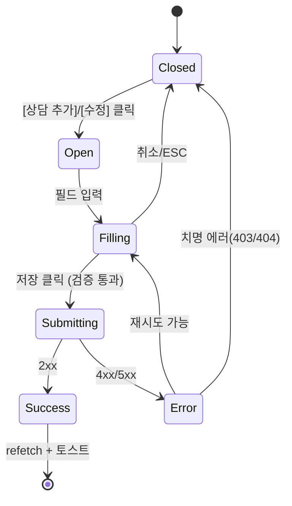

# DLG-M011 상담 등록 — 기본화면 (마스터)

> 이 문서는 **다이얼로그 마스터 스펙**입니다. `01~04` 상태 문서는 이 문서를 상속(override/delta)합니다.
> FC(상담) 핵심 업무 모달: 상담 이력을 **추가/수정** 하는 공용 다이얼로그. 회원 상세 > 상담이력 탭에서 기동.

---

## 0. 메타 & 원천 참조

| 항목 | 값 |
|------|----|
| 다이얼로그 ID | DLG-M011 |
| 다이얼로그명 | 상담 등록 (상담 이력 추가/수정) |
| 도메인 | D02-회원관리 |
| 부모 화면 | SCR-M004 회원상세 > 상담이력 탭 |
| 트리거 조건 | 상담이력 탭 `[상담 추가]` 버튼 또는 기존 행 `[수정]` 버튼 |
| 확인 레벨 | L1 (폼 저장형) |
| 서버 호출 여부 | ✅ `POST /api/consultations` (신규) / `PATCH /api/consultations/:id` (수정) |
| 닫기 옵션 | ✅ ESC/배경/X = 취소 허용 (단, `03-제출중` 차단) |
| 역할 | primary / owner / manager / fc |
| 파일 경로 | `src/components/member/dialogs/ConsultationFormDialog.tsx` |
| 우선순위 | P0 |

### 원천 문서 링크
| 문서 | 경로 | 섹션 |
|---|---|---|
| 회원관리 화면설계서 | `docs/화면설계서/회원관리.md` | §DLG-M011. 상담 등록 |
| 회원관리 기능명세서 | `docs/기능명세서/회원관리.md` | 상담 이력 CRUD |
| 다이어그램 M1/M2/M3 | `docs/다이어그램/D02_회원관리/DLG/DLG-M011_상담등록/` | 생명주기/검증/결과 |
| 에러코드정의서 | `docs/에러코드정의서.md` | §공통 E400001, §회원 E404100 |
| 권한 매트릭스 | `docs/다이어그램/10_권한매트릭스/R1_역할화면_매트릭스.md` | SCR-M004 상담이력 |
| DLG-004 저장확인 | `docs/화면설계서/D01-공통/DLG-004-저장확인/` | 공용 저장 확인 참조 |

---

## 1. 다이얼로그 목적 (Why)

- FC(상담)의 **상담 업무 로깅** 표준화: 날짜·유형·채널·상태·결과·연결 매출까지 한 번에.
- **결과 추적**: 상담 → 등록 전환율(funnel) 지표 산출용 데이터 수집.
- **재연락/후속조치 관리**: `상태=예정` + `후속조치` 로 상담 파이프라인 운영.
- 수정 시에도 **동일 폼 재사용**(`editTarget` 주입) — 추가/수정 단일 진입점.

---

## 2. 화면 레이아웃 (Wireframe)

```
  ┌───────────────────────────────────────────┐
  │ 💬 상담 이력 추가                     [X]│   ← editTarget 있으면 "상담 이력 수정"
  ├───────────────────────────────────────────┤
  │ 일시  * [2026-04-22 14:30         ▾]      │
  │ 유형    [상담  ▾]     채널  [방문   ▾]    │
  │ 담당자  [                           ]     │
  │ 상태  * ( 예정 )( 완료 )( 취소 )( 노쇼 )  │   ← pill 버튼 그룹
  │ 결과    [미선택 ▾]                         │
  │ 연결 매출 [선택 안함 ▾]                    │   ← "상품명 . 50,000원 . 2026-04-20"
  │ 내용                                       │
  │ ┌───────────────────────────────────────┐ │
  │ │                                       │ │
  │ │                                       │ │
  │ │                                       │ │   ← textarea 3행
  │ └───────────────────────────────────────┘ │
  │ 후속조치                                   │
  │ ┌───────────────────────────────────────┐ │
  │ │                                       │ │
  │ └───────────────────────────────────────┘ │   ← textarea 2행, placeholder
  ├───────────────────────────────────────────┤
  │                   [ 취소 ]   [ 저장 ]     │
  └───────────────────────────────────────────┘
```

| 영역 | 치수 | 역할 |
|---|---|---|
| Backdrop | `fixed inset-0 bg-black/40 z-40` | 배경 |
| Modal | `max-w-[480px] w-full` | 카드 |
| Header | 56px | 아이콘(`MessageSquare`)/제목/X |
| Body | auto, max-h `calc(100vh-200px)` scrollable | 9개 필드 폼 |
| Footer | 64px | [취소][저장] 우정렬 |

---

## 3. 디자인 토큰

### 3.1 색상
| 토큰 | 클래스 | 용도 |
|---|---|---|
| backdrop | `fixed inset-0 bg-black/40 z-40` | 배경 |
| card | `bg-white rounded-2xl shadow-xl ring-1 ring-gray-100` | 카드 |
| icon.wrap | `bg-blue-50 rounded-full size-10 flex items-center justify-center` | 아이콘 래퍼 |
| icon | `text-blue-500` | `MessageSquare` 16px |
| pill.on | `bg-primary text-white border-transparent` | 상태 선택됨 |
| pill.off | `border border-line text-content-secondary hover:bg-gray-50` | 상태 미선택 |
| input | `h-10 w-full rounded-lg border border-gray-300 px-3 text-sm focus:ring-2 focus:ring-blue-500 focus:border-blue-500` | 공용 |
| textarea | `w-full rounded-lg border border-gray-300 p-3 text-sm focus:ring-2 focus:ring-blue-500 resize-none` | 본문 |
| btn.cancel | `h-10 px-4 rounded-lg border border-gray-300 bg-white hover:bg-gray-50 text-gray-700` | Secondary |
| btn.save | `h-10 px-4 rounded-lg bg-blue-600 hover:bg-blue-700 text-white` | Primary |
| btn.save.disabled | `bg-blue-300 cursor-not-allowed` | 필수 미충족 |
| err.text | `text-xs text-rose-600 mt-1` | 필드 에러 |

### 3.2 타이포
| 토큰 | 값 |
|---|---|
| title | `text-lg font-semibold text-gray-900` |
| label | `text-sm font-medium text-gray-700` |
| required.mark | `text-rose-500 ml-0.5` |
| input.text | `text-sm text-gray-900` |
| pill.text | `text-xs font-medium px-3 h-8 rounded-full` |

### 3.3 간격/반경/모션
- 모달 radius: `rounded-2xl`, padding: `p-6`, 필드 gap `space-y-4`
- enter: `animate-[fadeInUp_140ms_ease-out]`, reduce motion 준수

---

## 4. 반응형 규칙
| BP | 모달 |
|---|---|
| Mobile <640 | `max-w-xs w-[calc(100%-32px)]` + bottom sheet 허용 |
| Tablet | `max-w-[480px]` |
| Desktop | `max-w-[480px]` |

---

## 5. 🔐 역할별(RBAC) 매트릭스

| 요소 | superAdmin | primary | owner | manager | fc | trainer | staff | front | readonly |
|---|:---:|:---:|:---:|:---:|:---:|:---:|:---:|:---:|:---:|
| 다이얼로그 오픈 | ● | ● | ● | ● | ● | — | — | — | — |
| 상담 추가 | ● | ● | ● | ● | ● | — | — | — | — |
| 본인 상담 수정 | ● | ● | ● | ● | ● | — | — | — | — |
| 타인 상담 수정 | ● | ● | ● | ● | — | — | — | — | — |
| 연결 매출 선택 | ● | ● | ● | ● | ● | — | — | — | — |
| 취소/ESC | ● | ● | ● | ● | ● | — | — | — | — |

### 멀티테넌트
- 서버는 `branchId` 스코프 강제. FC는 본인 지점 회원 상담만 작성 가능.
- `counselorId`(담당자)는 `auth.user.id` 기본값, manager 이상만 타인 지정 가능.

---

## 6. 컴포넌트 트리

```tsx
<ConsultationFormDialog
  isOpen={isOpen}
  memberId={member.id}
  editTarget={editTarget}                 // undefined = 추가, Consultation = 수정
  linkedSales={salesQuery.data}           // 연결 매출 옵션
  onSubmitSuccess={() => { qc.invalidateQueries(['consultations', memberId]); onClose(); }}
  onClose={onClose}
/>
```

### 내부 구조
```tsx
<Dialog role="dialog" aria-labelledby="c-title">
  <Header icon={<MessageSquare />} title={editTarget ? '상담 이력 수정' : '상담 이력 추가'} />
  <FormProvider {...form}>
    <form onSubmit={form.handleSubmit(handleSave)} className="space-y-4">
      <DateTimeField name="consultedAt" required />
      <div className="grid grid-cols-2 gap-3">
        <SelectField name="type" options={TYPE_OPTIONS} required />
        <SelectField name="channel" options={CHANNEL_OPTIONS} />
      </div>
      <TextField name="counselor" />
      <PillGroupField name="status" options={STATUS_OPTIONS} required />
      <SelectField name="result" options={RESULT_OPTIONS} />
      <SelectField name="linkedSaleId" options={linkedSales} />
      <TextareaField name="content" rows={3} />
      <TextareaField name="followUp" rows={2} placeholder="재연락 일정, 후속 액션..." />
      <Footer>
        <Button variant="secondary" onClick={onClose}>취소</Button>
        <Button variant="primary" type="submit" loading={isSubmitting} disabled={!canSubmit}>저장</Button>
      </Footer>
    </form>
  </FormProvider>
</Dialog>
```

---

## 7. 데이터 계약

### 7.1 TypeScript 타입
```ts
type ConsultType = '상담' | 'OT' | '체험' | '재등록상담';
type ConsultChannel = '방문' | '전화' | '카카오톡' | 'DM' | 'SNS' | '기타';
type ConsultStatus = '예정' | '완료' | '취소' | '노쇼';
type ConsultResult = '' | '등록' | '미등록' | '보류';

interface ConsultationFormValues {
  consultedAt: string;              // ISO datetime-local
  type: ConsultType;                // default '상담'
  channel?: ConsultChannel;         // default '방문'
  counselor?: string;               // default ''
  status: ConsultStatus;            // default '완료'
  result?: ConsultResult;
  linkedSaleId?: number | null;
  content?: string;                 // max 2000
  followUp?: string;                // max 1000
}

interface Consultation extends ConsultationFormValues {
  id: number;
  memberId: number;
  branchId: number;
  counselorId: number;
  createdAt: string;
  updatedAt: string;
}
```

### 7.2 API 엔드포인트
| 동작 | 메서드 | 엔드포인트 | 응답 |
|---|---|---|---|
| 신규 | POST | `/api/consultations` | 201 `{ data: Consultation }` |
| 수정 | PATCH | `/api/consultations/:id` | 200 `{ data: Consultation }` |
| 연결 매출 목록 | GET | `/api/sales?memberId=:mid&limit=50&sort=-saleDate` | 200 `{ data: Sale[] }` |

### 7.3 권한별 스코프
- `fc`: `counselorId = self` 강제 (서버 override)
- `manager+`: `counselorId` 자유 지정 가능 (지점 내)
- 모든 역할: `branchId = auth.branchId` 강제

---

## 8. 비즈니스 룰

1. **필수 필드 검증**: `consultedAt`, `type`, `status` 필수. `content`/`followUp` 선택.
2. **zod 스키마 검증**:
   ```ts
   const schema = z.object({
     consultedAt: z.string().min(1, '상담 일시를 입력하세요.'),
     type: z.enum(['상담','OT','체험','재등록상담']),
     status: z.enum(['예정','완료','취소','노쇼']),
     content: z.string().max(2000).optional(),
     followUp: z.string().max(1000).optional(),
   });
   ```
3. **기본값**: 신규 시 `consultedAt=now().slice(0,16)`, `type='상담'`, `channel='방문'`, `status='완료'`.
4. **수정 시**: `editTarget` 주입 → `form.reset(editTarget)` → 동일 UI, 제목만 변경.
5. **연결 매출**: 회원의 sales 50건 최신순. 포맷: `${productName} · ${salePrice.toLocaleString()}원 · ${saleDate}`.
6. **pill 상태**: 4개 중 1개만 선택. 키보드 `←→` 이동, `Space/Enter` 선택.
7. **중복 제출 방지**: `isSubmitting` 가드 + 버튼 `disabled`.
8. **감사로그**: 서버가 `AUDIT.CREATE`/`AUDIT.UPDATE` 기록, `memberId`, `consultationId` 포함.
9. **dirty 복원**: 성공 시 `form.reset(data)` → `formState.isDirty=false` → DLG-002 이탈경고 해제.
10. **에지 케이스**: `editTarget.consultedAt` 값이 과거 3개월 초과이면 서버 403으로 제한(선택 정책).

---

## 9. 상태 목록

| 파일 | 상태 코드 | 한글 | 트리거 |
|---|---|---|---|
| `01-열림.md` | `consult-open` | 열림 | `[상담 추가]`/`[수정]` 클릭 |
| `02-입력중.md` | `consult-filling` | 입력 중 | 오픈 후 사용자 입력 |
| `03-제출중.md` | `consult-submitting` | 제출 중 | 저장 버튼 클릭 |
| `04-성공또는실패.md` | `consult-done` | 성공/실패 | API 응답 수신 |

---

## 10. 에러 코드 매핑

| errorCode | HTTP | 시나리오 | 표시 | 다음 상태 |
|---|---|---|---|---|
| E400001 | 400 | 필수값 누락(consultedAt/type/status) | 인라인 필드 에러 | `02-입력중` 유지 |
| E400105 | 400 | 내용 5,000자 초과 | 인라인 "내용은 2,000자 이내" | `02-입력중` |
| E401002 | 401 | 세션 만료 | DLG-000 오픈 | 자동 정리 |
| E403001 | 403 | 권한 없음 (타지점/타인 수정) | 토스트 "권한이 없습니다" | `04-실패` + 닫기 |
| E404100 | 404 | 회원 없음 | 토스트 "회원을 찾을 수 없습니다" | `04-실패` + 닫기 |
| E409101 | 409 | 회원 상태 충돌(WITHDRAWN 등) | 토스트 | `04-실패` + 닫기 |
| E500001 | 500 | 서버 오류 | 토스트 | `04-실패` + 유지(재시도) |
| NETWORK | — | 네트워크 | 토스트 | `04-실패` + 유지 |

---

## 11. 접근성 (WCAG 2.1 AA)

| 항목 | 요구사항 |
|---|---|
| role | `role="dialog"`, `aria-modal="true"` |
| 라벨 | `aria-labelledby="c-title"`, 각 필드 `<label htmlFor>` |
| 포커스 | 오픈 시 첫 필드(`consultedAt`) 자동 포커스 |
| Tab trap | 헤더 X → 필드 순차 → 취소 → 저장 → 헤더 X |
| pill | `role="radiogroup"`, 각 `role="radio"` `aria-checked` |
| 키보드 | `Esc` = 취소 (제출 중 차단), `Ctrl+Enter` = 저장 |
| 라이브 에러 | 필드 에러 `aria-describedby`, `role="alert"` |
| 모션 감소 | `motion-reduce:animate-none` |

---

## 12. 진입 / 이탈 연결

### 진입
- SCR-M004 회원상세 > 상담이력 탭 `[상담 추가]` (신규)
- 상담 테이블 행 `[수정]` 버튼 (수정)

### 이탈
| 액션 | 목적지 |
|---|---|
| 취소/ESC/배경 | 닫힘, 상담이력 탭 유지 (dirty 있으면 DLG-002 확인) |
| 성공(`04`) | 닫힘 + 토스트 + 상담 목록 refetch |
| 실패(`04`) | 유지 또는 닫힘(코드별 정책) |

---

## 13. 다이어그램 통합 뷰



참조: `docs/다이어그램/D02_회원관리/DLG/DLG-M011_상담등록/M1_생명주기.md`

---

## 14. 🧩 바이브코딩 프롬프트 (마스터)

```
Next.js 15 App Router + TypeScript + Tailwind + Radix Dialog + React Query + react-hook-form + zod 기반
'use client' 상담 등록/수정 공용 다이얼로그를 작성하라.

━━ 파일: src/components/member/dialogs/ConsultationFormDialog.tsx ━━

import * as Dialog from '@radix-ui/react-dialog';
import { useForm, FormProvider } from 'react-hook-form';
import { zodResolver } from '@hookform/resolvers/zod';
import { z } from 'zod';
import { useMutation, useQuery, useQueryClient } from '@tanstack/react-query';
import { MessageSquare, Loader2, X } from 'lucide-react';
import { toast } from 'sonner';

const schema = z.object({
  consultedAt: z.string().min(1, '상담 일시를 입력하세요.'),
  type: z.enum(['상담','OT','체험','재등록상담']),
  channel: z.enum(['방문','전화','카카오톡','DM','SNS','기타']).optional(),
  counselor: z.string().optional(),
  status: z.enum(['예정','완료','취소','노쇼']),
  result: z.enum(['','등록','미등록','보류']).optional(),
  linkedSaleId: z.number().nullable().optional(),
  content: z.string().max(2000).optional(),
  followUp: z.string().max(1000).optional(),
});

type Values = z.infer<typeof schema>;

interface Props {
  isOpen: boolean;
  memberId: number;
  editTarget?: Consultation;
  onClose: () => void;
}

export function ConsultationFormDialog({ isOpen, memberId, editTarget, onClose }: Props) {
  const qc = useQueryClient();
  const now = new Date().toISOString().slice(0,16);
  const form = useForm<Values>({
    resolver: zodResolver(schema),
    defaultValues: editTarget ?? {
      consultedAt: now, type: '상담', channel: '방문', status: '완료',
      counselor: '', result: '', content: '', followUp: '',
    },
  });

  const sales = useQuery({
    queryKey: ['sales', memberId],
    queryFn: () => fetch(`/api/sales?memberId=${memberId}&limit=50&sort=-saleDate`).then(r=>r.json()),
    enabled: isOpen,
  });

  const mutation = useMutation({
    mutationFn: async (v: Values) => {
      const url = editTarget ? `/api/consultations/${editTarget.id}` : `/api/consultations`;
      const method = editTarget ? 'PATCH' : 'POST';
      const res = await fetch(url, {
        method,
        headers: { 'Content-Type': 'application/json' },
        body: JSON.stringify({ ...v, memberId }),
      });
      const body = await res.json();
      if (!res.ok) throw { ...body, status: res.status };
      return body.data;
    },
    onSuccess: () => {
      qc.invalidateQueries({ queryKey: ['consultations', memberId] });
      toast.success(editTarget ? '상담 이력이 수정되었습니다.' : '상담 이력이 저장되었습니다.');
      onClose();
    },
    onError: (e: any) => {
      if (e.errorCode === 'E403001') { toast.error('권한이 없습니다'); onClose(); return; }
      if (e.errorCode === 'E404100') { toast.error('회원을 찾을 수 없습니다'); onClose(); return; }
      toast.error(e.message ?? '저장 실패');
    },
  });

  return (
    <Dialog.Root open={isOpen} onOpenChange={(o) => !o && !mutation.isPending && onClose()}>
      <Dialog.Portal>
        <Dialog.Overlay className="fixed inset-0 z-40 bg-black/40 motion-reduce:animate-none animate-[fadeIn_120ms]" />
        <Dialog.Content
          className="fixed left-1/2 top-1/2 z-50 -translate-x-1/2 -translate-y-1/2
                     w-full max-w-[480px] bg-white rounded-2xl shadow-xl ring-1 ring-gray-100 p-6
                     max-h-[calc(100vh-80px)] overflow-y-auto
                     motion-reduce:animate-none animate-[fadeInUp_140ms_ease-out]">
          <header className="flex items-center gap-3 mb-4">
            <span className="bg-blue-50 rounded-full size-10 flex items-center justify-center">
              <MessageSquare className="size-4 text-blue-500" />
            </span>
            <Dialog.Title id="c-title" className="text-lg font-semibold text-gray-900 flex-1">
              {editTarget ? '상담 이력 수정' : '상담 이력 추가'}
            </Dialog.Title>
            <Dialog.Close disabled={mutation.isPending} className="size-8 grid place-items-center rounded-md hover:bg-gray-100 text-gray-500 disabled:opacity-50">
              <X className="size-4" />
            </Dialog.Close>
          </header>

          <FormProvider {...form}>
            <form onSubmit={form.handleSubmit((v) => mutation.mutate(v))} className="space-y-4">
              {/* 일시 * */}
              <Field label="일시" required name="consultedAt">
                <input type="datetime-local" {...form.register('consultedAt')} className="h-10 w-full rounded-lg border border-gray-300 px-3 text-sm focus:ring-2 focus:ring-blue-500" />
              </Field>

              <div className="grid grid-cols-2 gap-3">
                <Field label="유형" required name="type">
                  <select {...form.register('type')} className="h-10 w-full rounded-lg border border-gray-300 px-3 text-sm">
                    {['상담','OT','체험','재등록상담'].map(o => <option key={o} value={o}>{o}</option>)}
                  </select>
                </Field>
                <Field label="채널" name="channel">
                  <select {...form.register('channel')} className="h-10 w-full rounded-lg border border-gray-300 px-3 text-sm">
                    {['방문','전화','카카오톡','DM','SNS','기타'].map(o => <option key={o} value={o}>{o}</option>)}
                  </select>
                </Field>
              </div>

              <Field label="담당자" name="counselor">
                <input type="text" {...form.register('counselor')} className="h-10 w-full rounded-lg border border-gray-300 px-3 text-sm" />
              </Field>

              {/* pill 상태 * */}
              <Field label="상태" required name="status">
                <PillGroup name="status" options={['예정','완료','취소','노쇼']} control={form.control} />
              </Field>

              <Field label="결과" name="result">
                <select {...form.register('result')} className="h-10 w-full rounded-lg border border-gray-300 px-3 text-sm">
                  <option value="">미선택</option>
                  {['등록','미등록','보류'].map(o => <option key={o} value={o}>{o}</option>)}
                </select>
              </Field>

              <Field label="연결 매출" name="linkedSaleId">
                <select {...form.register('linkedSaleId', { valueAsNumber: true })} className="h-10 w-full rounded-lg border border-gray-300 px-3 text-sm">
                  <option value="">선택 안함</option>
                  {sales.data?.map((s: any) => (
                    <option key={s.id} value={s.id}>{s.productName} · {s.salePrice.toLocaleString()}원 · {s.saleDate}</option>
                  ))}
                </select>
              </Field>

              <Field label="내용" name="content">
                <textarea rows={3} {...form.register('content')} className="w-full rounded-lg border border-gray-300 p-3 text-sm resize-none" />
              </Field>

              <Field label="후속조치" name="followUp">
                <textarea rows={2} placeholder="재연락 일정, 후속 액션..." {...form.register('followUp')} className="w-full rounded-lg border border-gray-300 p-3 text-sm resize-none" />
              </Field>

              <footer className="flex items-center justify-end gap-2 pt-2">
                <button type="button" onClick={onClose} disabled={mutation.isPending}
                  className="h-10 px-4 rounded-lg border border-gray-300 bg-white hover:bg-gray-50 text-sm font-medium text-gray-700 disabled:opacity-50">취소</button>
                <button type="submit" disabled={mutation.isPending || !form.formState.isValid}
                  className="h-10 px-4 rounded-lg bg-blue-600 hover:bg-blue-700 disabled:bg-blue-300 text-white text-sm font-medium inline-flex items-center gap-2">
                  {mutation.isPending && <Loader2 className="size-4 animate-spin" aria-hidden />}
                  {mutation.isPending ? '저장 중...' : '저장'}
                </button>
              </footer>
            </form>
          </FormProvider>
        </Dialog.Content>
      </Dialog.Portal>
    </Dialog.Root>
  );
}

━━ 디자인 토큰 ━━
pill.on:  bg-primary text-white border-transparent
pill.off: border border-gray-300 text-gray-600 hover:bg-gray-50
input:    h-10 w-full rounded-lg border border-gray-300 px-3 text-sm focus:ring-2 focus:ring-blue-500

━━ QA 체크 ━━
- 신규: 일시 = now(0,16), 유형=상담, 상태=완료 디폴트
- 수정: editTarget 주입 시 form.reset(editTarget)
- 상태 pill 키보드 ←→ 이동, 선택 1개만
- 저장 중 취소/ESC 차단, 버튼 Loader2 스핀
- 성공 → toast + invalidateQueries(['consultations', memberId]) + 닫힘
- 403 → "권한이 없습니다" + 닫기 / 404 → 닫기 / 500 → 유지 재시도
- mobile 360px 가독, max-h scroll
```

---

## 15. QA 체크리스트

- [ ] 추가 시 기본값(now, 상담, 방문, 완료) 정확
- [ ] 수정 시 `editTarget` 전체 필드 반영
- [ ] 필수 3개(일시/유형/상태) 미충족 시 저장 disabled
- [ ] 상태 pill 키보드 `←→` 이동 + `Space` 선택
- [ ] 연결 매출 옵션 최신순 50건
- [ ] 제출 중 `isSubmitting=true` → 취소/ESC/배경 차단
- [ ] 성공 2xx → 토스트 + refetch + 닫힘
- [ ] 401 세션 만료 → DLG-000 우선
- [ ] 403/404 → 토스트 + 닫기
- [ ] 500/NETWORK → 다이얼로그 유지 + 재시도
- [ ] 감사로그 `AUDIT.CREATE`/`AUDIT.UPDATE` 기록
- [ ] dirty 초기화(성공 후 `form.reset`)
- [ ] mobile 360px 가독, max-h 스크롤
- [ ] a11y: role=dialog, 라벨/설명 공지, Tab trap
