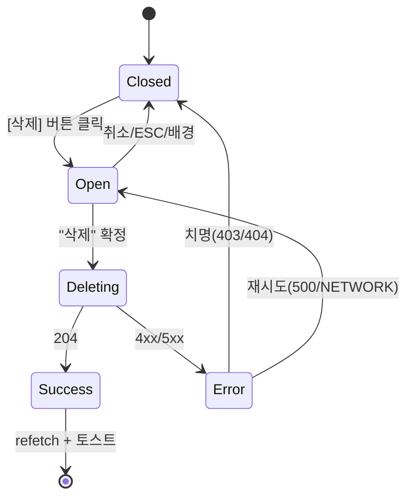

# DLG-M012 상담 삭제 확인 — 기본화면 (마스터)

> 이 문서는 **다이얼로그 마스터 스펙**입니다. `01~04` 상태 문서는 이 문서를 상속(override/delta)합니다.
> 🚨 **파괴적 액션**: 상담 이력 단건 삭제 확인. 공용 `ConfirmDialog(variant='danger')` 재사용.

---

## 0. 메타 & 원천 참조

| 항목 | 값 |
|------|----|
| 다이얼로그 ID | DLG-M012 |
| 다이얼로그명 | 상담 삭제 확인 |
| 도메인 | D02-회원관리 |
| 부모 화면 | SCR-M004 회원상세 > 상담이력 탭 |
| 트리거 조건 | 상담이력 탭 행 `[삭제]` 버튼 (`Trash2` 13px) |
| 확인 레벨 | L2 (파괴적) — 타이핑 확인 없음(단건, 되돌림 없음 명시) |
| 서버 호출 여부 | ✅ `DELETE /api/consultations/:id` |
| 닫기 옵션 | ✅ ESC/배경/X = 취소 (단, `03-제출중` 차단) |
| 역할 | primary / owner / manager / fc (본인 상담만) |
| 파일 경로 | `src/components/member/dialogs/ConsultationDeleteDialog.tsx` 또는 공용 `ConfirmDialog` |
| 우선순위 | P1 |

### 원천 문서 링크
| 문서 | 경로 | 섹션 |
|---|---|---|
| 회원관리 화면설계서 | `docs/화면설계서/회원관리.md` | §DLG-M012. 상담 삭제 확인 |
| 기능명세서 | `docs/기능명세서/회원관리.md` | 상담 이력 DELETE |
| DLG-003 삭제확인 | `docs/화면설계서/D01-공통/DLG-003-삭제확인/` | 공용 파괴 확인 마스터 |
| 에러코드정의서 | `docs/에러코드정의서.md` | §공통 E403001, §회원 E404100 |
| 다이어그램 | `docs/다이어그램/D02_회원관리/DLG/DLG-M012_상담삭제/` | M1/M2/M3 |

---

## 1. 다이얼로그 목적 (Why)

- 실수 삭제 방지: 상담 이력은 KPI 원천이므로 단건이라도 확인.
- DLG-003 공용 danger 확인 다이얼로그 재사용으로 일관된 UX.

---

## 2. 화면 레이아웃 (Wireframe)

```
  ┌──────────────────────────────────────┐
  │ 🗑 상담 이력 삭제                 [X]│
  │                                      │
  │ 이 상담 이력을 삭제하시겠습니까?       │
  │ 이 작업은 되돌릴 수 없습니다.          │
  │                                      │
  │               [ 취소 ]   [ 삭제 ]    │
  └──────────────────────────────────────┘
```

| 영역 | 치수 | 역할 |
|---|---|---|
| Backdrop | `fixed inset-0 bg-black/50 z-40` | 배경 |
| Modal | `max-w-md` | 카드 |
| Header | 48px | `Trash2` icon + 제목 + X |
| Body | auto | description |
| Footer | 56px | [취소][삭제 danger] |

---

## 3. 디자인 토큰

| 토큰 | 클래스 |
|---|---|
| backdrop | `fixed inset-0 bg-black/50 z-40` |
| card | `bg-white rounded-2xl shadow-xl ring-1 ring-gray-100 p-6` |
| icon.wrap | `bg-rose-50 rounded-full size-10 flex items-center justify-center` |
| icon | `text-rose-500` (`Trash2` 20px) |
| title | `text-lg font-semibold text-gray-900` |
| body | `text-sm text-gray-600 leading-relaxed` |
| btn.cancel | `h-10 px-4 rounded-lg border border-gray-300 bg-white hover:bg-gray-50 text-gray-700 text-sm` |
| btn.delete | `h-10 px-4 rounded-lg bg-rose-600 hover:bg-rose-700 text-white text-sm font-medium` |

---

## 4. 반응형 규칙
| BP | 모달 |
|---|---|
| Mobile <640 | `max-w-xs w-[calc(100%-32px)]` |
| Tablet/Desktop | `max-w-md` |

---

## 5. 🔐 역할별(RBAC) 매트릭스

| 요소 | superAdmin | primary | owner | manager | fc | trainer | staff | front | readonly |
|---|:---:|:---:|:---:|:---:|:---:|:---:|:---:|:---:|:---:|
| 모달 오픈 | ● | ● | ● | ● | ●† | — | — | — | — |
| "삭제" 확정 | ● | ● | ● | ● | ●† | — | — | — | — |
| 취소/ESC | ● | ● | ● | ● | ● | — | — | — | — |

† fc: `counselorId === auth.user.id` 인 상담만 가능. 타인 상담은 버튼 자체 비노출.

### 멀티테넌트
- 서버가 `branchId` 일치 강제. 다지점 삭제 시 403.

---

## 6. 컴포넌트 트리

```tsx
<ConfirmDialog
  isOpen={isOpen}
  variant="danger"
  icon={<Trash2 />}
  title="상담 이력 삭제"
  description="이 상담 이력을 삭제하시겠습니까? 이 작업은 되돌릴 수 없습니다."
  confirmLabel="삭제"
  cancelLabel="취소"
  loading={isPending}
  onConfirm={() => mutation.mutate(consultationId)}
  onCancel={onClose}
/>
```

### 컴포넌트 명세
| 컴포넌트 | 비고 |
|---|---|
| `ConfirmDialog` (danger) | DLG-003 마스터 공용 |
| `ConsultationDeleteDialog` (래퍼) | `{consultationId, onSuccess}` 얇은 래퍼 (선택) |

---

## 7. 데이터 계약

### 7.1 Props
```ts
interface ConsultationDeleteProps {
  isOpen: boolean;
  consultationId: number;
  memberId: number;
  onClose: () => void;
}
```

### 7.2 API
| 메서드 | 엔드포인트 | 응답 |
|---|---|---|
| DELETE | `/api/consultations/:id` | 204 No Content / 403 / 404 / 500 |

### 7.3 상태 전이
```
closed → open(01) → confirming(02) → deleting(03) → success/fail(04)
                                  ↳ closed(cancel/esc)
```

---

## 8. 비즈니스 룰

1. **권한 이중 검증**: 클라이언트 `canDelete(consultation, auth)` + 서버 403.
2. **목록 관리**: 성공 시 `invalidateQueries(['consultations', memberId])`.
3. **낙관적 제거 옵션**: `queryClient.setQueryData` 로 해당 row 즉시 제거, 에러 시 롤백.
4. **참조 제약**: 연결된 매출(`linkedSaleId`)은 상담 삭제 시 sale 는 유지(상담만 제거).
5. **감사로그**: `AUDIT.DELETE` 기록 (consultation.id, memberId, reason?).
6. **연속 삭제**: 여러 행 연속 삭제 시 각 모달 독립(중첩 X).
7. **ESC 차단**: `03-제출중` 상태에서만 닫기 차단.

---

## 9. 상태 목록

| 파일 | 상태 코드 | 한글 | 트리거 |
|---|---|---|---|
| `01-열림.md` | `consult-del-open` | 열림 | 행 [삭제] 클릭 |
| `02-입력중.md` | `consult-del-confirming` | 입력 중(확인 대기) | 오픈 상태 지속 |
| `03-제출중.md` | `consult-del-deleting` | 제출 중 | [삭제] 확정 |
| `04-성공또는실패.md` | `consult-del-done` | 성공/실패 | API 응답 |

---

## 10. 에러 코드 매핑

| errorCode | HTTP | 시나리오 | 표시 | 다음 상태 |
|---|---|---|---|---|
| E403001 | 403 | 권한 없음 | 토스트 "삭제 권한이 없습니다" | `04` + 닫기 |
| E404001 | 404 | 이미 삭제 | 토스트 "이미 삭제된 상담입니다" + 목록 refetch | `04` + 닫기 |
| E500001 | 500 | 서버 오류 | 토스트 "일시 오류" | `04` + 유지 재시도 |
| NETWORK | — | 네트워크 | 토스트 | `04` + 유지 |
| E401002 | 401 | 세션 만료 | DLG-000 우선 | 자동 정리 |

---

## 11. 접근성

| 항목 | 요구사항 |
|---|---|
| role | `role="alertdialog"` (파괴적) |
| 라벨 | `aria-labelledby="cd-title"`, `aria-describedby="cd-desc"` |
| 포커스 | 오픈 시 "취소" 자동 포커스 (안전 기본값) |
| Tab | 취소 → 삭제 → X → 취소 |
| 키보드 | `Esc` = 취소 (deleting 중 차단) |
| 라이브 | 에러 `role="alert" aria-live="assertive"` |

---

## 12. 진입 / 이탈

### 진입
- SCR-M004 상담이력 테이블 각 행 `[삭제]` 아이콘 버튼 (`Trash2` 13px)

### 이탈
| 액션 | 목적지 |
|---|---|
| 취소/ESC/배경 | 닫힘, 상담이력 탭 유지 |
| 성공 | 닫힘 + 목록 refetch + 토스트 |
| 실패(치명) | 닫힘 + 토스트 |
| 실패(복구) | 유지 + 재시도 |

---

## 13. 다이어그램 통합 뷰



참조: `docs/다이어그램/D02_회원관리/DLG/DLG-M012_상담삭제/M1_생명주기.md`

---

## 14. 🧩 바이브코딩 프롬프트 (마스터)

```
Next.js 15 App Router + TypeScript + Tailwind + Radix Dialog + React Query
'use client' 상담 이력 삭제 확인 다이얼로그.

━━ 파일: src/components/member/dialogs/ConsultationDeleteDialog.tsx ━━

import { ConfirmDialog } from '@/components/common/ConfirmDialog';
import { useMutation, useQueryClient } from '@tanstack/react-query';
import { Trash2 } from 'lucide-react';
import { toast } from 'sonner';

interface Props {
  isOpen: boolean;
  consultationId: number;
  memberId: number;
  onClose: () => void;
}

export function ConsultationDeleteDialog({ isOpen, consultationId, memberId, onClose }: Props) {
  const qc = useQueryClient();
  const del = useMutation({
    mutationFn: async (id: number) => {
      const res = await fetch(`/api/consultations/${id}`, { method: 'DELETE' });
      if (!res.ok) throw { status: res.status, ...(await res.json().catch(()=>({}))) };
    },
    onSuccess: () => {
      qc.invalidateQueries({ queryKey: ['consultations', memberId] });
      qc.invalidateQueries({ queryKey: ['member', memberId] });
      toast.success('삭제되었습니다.');
      onClose();
    },
    onError: (e: any) => {
      if (e.errorCode === 'E403001') { toast.error('삭제 권한이 없습니다'); onClose(); return; }
      if (e.status === 404) {
        toast.error('이미 삭제된 상담입니다');
        qc.invalidateQueries({ queryKey: ['consultations', memberId] });
        onClose();
        return;
      }
      toast.error(e.message ?? '삭제 실패');
    },
  });

  return (
    <ConfirmDialog
      isOpen={isOpen}
      variant="danger"
      icon={<Trash2 className="size-5" />}
      title="상담 이력 삭제"
      description="이 상담 이력을 삭제하시겠습니까? 이 작업은 되돌릴 수 없습니다."
      confirmLabel="삭제"
      cancelLabel="취소"
      loading={del.isPending}
      onConfirm={() => del.mutate(consultationId)}
      onCancel={onClose}
    />
  );
}

━━ QA ━━
- 기본 포커스 "취소"
- deleting 중 ESC/배경 차단
- 성공 → refetch + 토스트 + 닫기
- 403 → 토스트 + 닫기
- 404 → 토스트 "이미 삭제" + refetch + 닫기
- 500/NETWORK → 유지 + 재시도
- role=alertdialog, 라벨 공지
```

---

## 15. QA 체크리스트

- [ ] 상담 행 [삭제] 클릭 시 오픈
- [ ] fc: 본인 상담 행에만 [삭제] 버튼 노출
- [ ] 기본 포커스 "취소"
- [ ] 확정 → `03-제출중` 로딩
- [ ] 204 성공 → 목록 refetch + 토스트 + 닫기
- [ ] 403 → 토스트 + 닫기
- [ ] 404 → 토스트 "이미 삭제" + refetch + 닫기
- [ ] 500/NETWORK → 유지 + 재시도
- [ ] ESC/배경 = 취소 (deleting 중 차단)
- [ ] a11y role=alertdialog
- [ ] 감사로그 AUDIT.DELETE
- [ ] 낙관적 제거 시 실패 롤백
