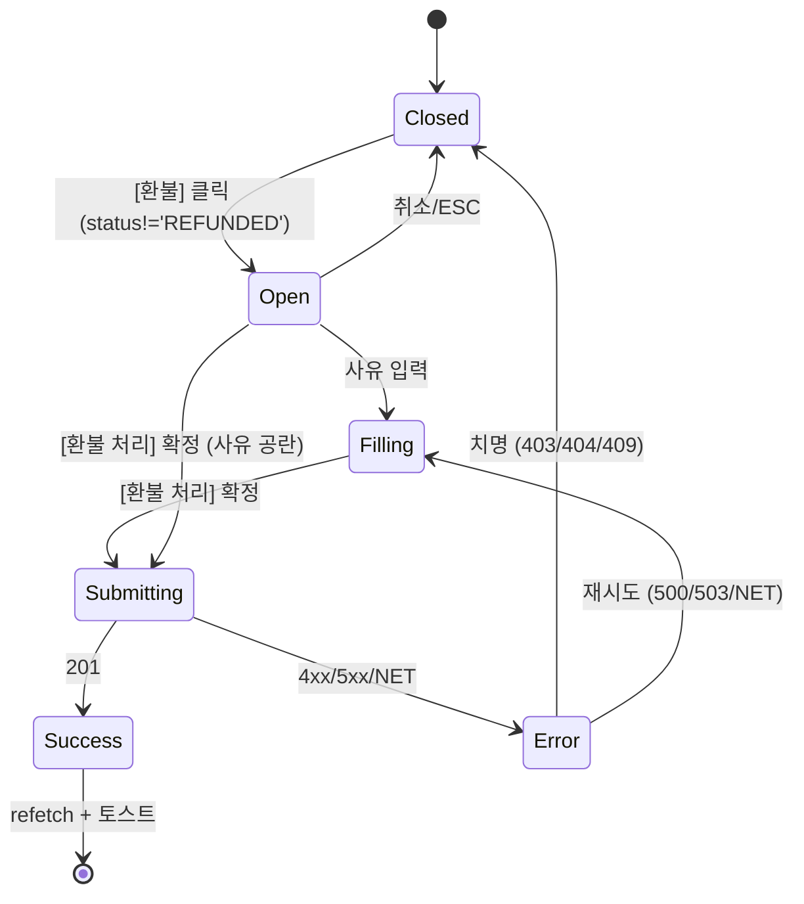

# DLG-M013 환불 처리 — 기본화면 (마스터)

> 이 문서는 **다이얼로그 마스터 스펙**입니다. `01~04` 상태 문서는 이 문서를 상속(override/delta)합니다.
> 🚨 **파괴적 & 금전적 액션**: 완료 결제 건을 환불 레코드(음수)로 기록하고 원본 `status='REFUNDED'` 로 전환. D03 매출관리와 연계.

---

## 0. 메타 & 원천 참조

| 항목 | 값 |
|------|----|
| 다이얼로그 ID | DLG-M013 |
| 다이얼로그명 | 환불 처리 |
| 도메인 | D02-회원관리 (+ D03-매출관리 연계) |
| 부모 화면 | SCR-M004 회원상세 > 결제이력/결제내역 탭 |
| 트리거 조건 | `[환불]` 버튼 (`status!='REFUNDED' AND salePrice>0`) |
| 확인 레벨 | L2 (파괴적, 금전) |
| 서버 호출 여부 | ✅ `POST /api/sales/refund` (트랜잭션: 환불 레코드 INSERT + 원본 UPDATE) |
| 닫기 옵션 | ✅ ESC/배경 = 취소 (단, `03-제출중` 차단) |
| 역할 | primary / owner / manager (승인 레벨) |
| 파일 경로 | `src/components/member/dialogs/RefundDialog.tsx` |
| 우선순위 | P0 |

### 원천 문서 링크
| 문서 | 경로 | 섹션 |
|---|---|---|
| 회원관리 화면설계서 | `docs/화면설계서/회원관리.md` | §DLG-M013. 환불 처리 |
| 매출관리 화면설계서 | `docs/화면설계서/매출관리.md` | §환불 플로우 |
| 에러코드정의서 | `docs/에러코드정의서.md` | §매출/결제 E400301, E409300 |
| 다이어그램 | `docs/다이어그램/D02_회원관리/DLG/DLG-M013_환불처리/` | M1/M2/M3 |
| 상태전이도 | `docs/상태전이도.md` | Sale: COMPLETED → REFUNDED |

---

## 1. 다이얼로그 목적 (Why)

- **부분 반환 없는 전체 환불**: 단건 결제 전체 금액을 환불 처리(단순 정책).
- **이중 레코드 구조**: 음수 환불 행 INSERT + 원본 `status='REFUNDED'` UPDATE (감사/정산 유지).
- **승인 레벨 강제**: fc/staff 진입 차단 (manager 이상).
- **매출 재집계 트리거**: 성공 시 D03 매출 대시보드/월간 리포트 invalidate.

---

## 2. 화면 레이아웃 (Wireframe)

```
  ┌──────────────────────────────────────────┐
  │ ⚠️  환불 처리                         [X]│
  │                                          │
  │ [3개월 회원권] 150,000원 결제 건을         │
  │ 환불 처리하시겠습니까?                    │
  │                                          │
  │ ┌──────────────────────────────────────┐ │
  │ │ 결제일: 2026-03-15                   │ │  ← 요약 카드 (옵션)
  │ │ 결제방법: 카드                       │ │
  │ │ 환불액: -150,000원                   │ │
  │ └──────────────────────────────────────┘ │
  │                                          │
  │ 환불 사유 (선택)                          │
  │ [                                      ] │  ← 선택 입력 (reason)
  │                                          │
  │              [ 취소 ]   [ 환불 처리 ]    │
  └──────────────────────────────────────────┘
```

| 영역 | 치수 | 역할 |
|---|---|---|
| Backdrop | `fixed inset-0 bg-black/50 z-40` | 배경 |
| Modal | `max-w-md` | 카드 (ConfirmDialog 기본) |
| Header | 48px | `AlertTriangle` + 제목 + X |
| Summary | auto | 결제 요약 카드 |
| Reason | 40px | 선택 입력 |
| Footer | 56px | [취소][환불 처리 danger] |

---

## 3. 디자인 토큰

| 토큰 | 클래스 |
|---|---|
| backdrop | `fixed inset-0 bg-black/50 z-40` |
| card | `bg-white rounded-2xl shadow-xl ring-1 ring-gray-100 p-6` |
| icon.wrap | `bg-amber-50 rounded-full size-10 flex items-center justify-center` |
| icon | `text-amber-500` (`AlertTriangle` 20px) — 강조 시 `text-rose-500` |
| summary | `bg-gray-50 border border-gray-200 rounded-md p-3 text-xs space-y-1` |
| summary.key | `text-gray-500` |
| summary.value | `text-gray-900 tabular-nums font-medium` |
| amount.neg | `text-rose-600 font-semibold tabular-nums` |
| reason.input | `h-10 w-full rounded-lg border border-gray-300 px-3 text-sm focus:ring-2 focus:ring-rose-500` |
| btn.cancel | `h-10 px-4 rounded-lg border border-gray-300 bg-white hover:bg-gray-50 text-sm text-gray-700` |
| btn.refund | `h-10 px-4 rounded-lg bg-rose-600 hover:bg-rose-700 text-white text-sm font-medium` |

---

## 4. 반응형
| BP | 모달 |
|---|---|
| Mobile <640 | `max-w-xs w-[calc(100%-32px)]` |
| Tablet/Desktop | `max-w-md` |

---

## 5. 🔐 역할별(RBAC) 매트릭스

| 요소 | superAdmin | primary | owner | manager | fc | trainer | staff | front | readonly |
|---|:---:|:---:|:---:|:---:|:---:|:---:|:---:|:---:|:---:|
| 결제이력 탭 "환불" 버튼 노출 | ● | ● | ● | ● | — | — | — | — | — |
| 모달 오픈 | ● | ● | ● | ● | — | — | — | — | — |
| "환불 처리" 확정 | ● | ● | ● | ●† | — | — | — | — | — |
| 취소/ESC | ● | ● | ● | ● | — | — | — | — | — |

† manager: `salePrice <= 500,000원` 제한(선택 정책). 초과 시 owner 승인 필요 정책 가능.

### 멀티테넌트
- 서버 `branchId` 일치 강제 + sale.branchId 검증.
- super/primary: 전 지점 환불 가능. owner 이하: 본인 지점만.

---

## 6. 컴포넌트 트리

```tsx
<RefundDialog
  isOpen={isOpen}
  sale={sale}                           // {id, productName, salePrice, saleDate, paymentMethod, status}
  onSuccess={() => { qc.invalidateQueries(['sales', memberId]); onClose(); }}
  onClose={onClose}
/>
```

### 내부 구조
```tsx
<ConfirmDialog
  isOpen={isOpen}
  variant="danger"
  icon={<AlertTriangle />}
  title="환불 처리"
  description={`[${sale.productName}] ${sale.salePrice.toLocaleString()}원 결제 건을 환불 처리하시겠습니까?`}
  confirmLabel="환불 처리"
  cancelLabel="취소"
  loading={mutation.isPending}
  onConfirm={() => mutation.mutate({ saleId: sale.id, reason })}
  onCancel={onClose}
>
  <SaleSummary sale={sale} />
  <ReasonInput value={reason} onChange={setReason} />
</ConfirmDialog>
```

---

## 7. 데이터 계약

### 7.1 Types
```ts
interface Sale {
  id: number;
  memberId: number;
  branchId: number;
  productName: string;
  salePrice: number;
  saleDate: string;
  paymentMethod: '카드' | '현금' | '계좌이체' | '기타';
  status: 'COMPLETED' | 'REFUNDED';
}

interface RefundPayload {
  saleId: number;
  reason?: string;          // max 200
}

interface RefundResponse {
  refundSaleId: number;     // 음수 레코드
  originalSaleId: number;   // 원본 (status=REFUNDED)
  refundedAt: string;
}
```

### 7.2 API
| 메서드 | 엔드포인트 | 응답 |
|---|---|---|
| POST | `/api/sales/refund` | 201 `{ data: RefundResponse }` |

서버 내부: DB 트랜잭션
1. INSERT sale (amount=-original, status='COMPLETED', refType='REFUND', parentSaleId)
2. UPDATE original sale SET status='REFUNDED', refundedAt=now

### 7.3 권한 스코프
- `branchId = auth.branchId` 강제 (super/primary 예외)
- 서버가 `canRefund(role, sale)` 재검증

---

## 8. 비즈니스 룰

1. **버튼 노출 조건**: `status!='REFUNDED' AND salePrice>0` (부모 화면에서 필터).
2. **이중 환불 방지**: 서버가 `status='REFUNDED'` 재확인 → `E409300` 반환.
3. **부분 환불 비지원**: 전액 환불만. 부분 환불 필요 시 별도 UX.
4. **사유(reason)**: 선택이지만 매니저 정책 상 권장. 서버 감사로그에 기록.
5. **매출 재집계**: 성공 시 `invalidateQueries(['sales','*'])` + D03 대시보드 캐시 무효화.
6. **PG 연동(옵션)**: 카드 결제 환불은 `paymentMethod === '카드'` 시 PG 호출. 실패 시 `E503002`.
7. **감사로그**: `AUDIT.REFUND` 기록 (saleId, actorId, amount, reason).
8. **알림(옵션)**: 회원에게 환불 알림톡 발송 이벤트 발행.

---

## 9. 상태 목록

| 파일 | 상태 코드 | 한글 | 트리거 |
|---|---|---|---|
| `01-열림.md` | `refund-open` | 열림 | [환불] 버튼 클릭 |
| `02-입력중.md` | `refund-filling` | 입력 중 | 사유 입력/검토 |
| `03-제출중.md` | `refund-submitting` | 제출 중 | [환불 처리] 확정 |
| `04-성공또는실패.md` | `refund-done` | 성공/실패 | API 응답 |

---

## 10. 에러 코드 매핑

| errorCode | HTTP | 시나리오 | 표시 | 다음 상태 |
|---|---|---|---|---|
| E400301 | 400 | 환불 금액 초과 | 토스트 "환불 금액 확인" | `04` + 유지 |
| E403001 | 403 | 권한 없음 | 토스트 "환불 권한 없음" | `04` + 닫기 |
| E404300 | 404 | 매출 없음 | 토스트 "매출 정보를 찾을 수 없습니다" | `04` + refetch + 닫기 |
| E409300 | 409 | 이미 환불됨 | 토스트 "이미 환불 처리된 매출입니다" | `04` + refetch + 닫기 |
| E500001 | 500 | 서버 오류 | 토스트 | `04` + 유지 재시도 |
| E503002 | 503 | PG 연동 오류 | 토스트 "결제 서비스 일시 오류" | `04` + 유지 |
| NETWORK | — | 네트워크 | 토스트 | `04` + 유지 |

---

## 11. 접근성
| 항목 | 요구사항 |
|---|---|
| role | `role="alertdialog"` |
| 라벨 | `aria-labelledby`, `aria-describedby` |
| 포커스 | "취소" autoFocus (금전 파괴 보수 정책) |
| 키보드 | `Esc` = 취소 (제출 중 차단) |
| Tab | 사유 입력 → 취소 → 환불 처리 → X |
| 라이브 | 에러 `role="alert" aria-live="assertive"` |

---

## 12. 진입 / 이탈

### 진입
- 결제이력/결제내역 탭 행의 `[환불]` 버튼

### 이탈
| 액션 | 목적지 |
|---|---|
| 취소/ESC/배경 | 닫힘, 결제이력 탭 유지 |
| 성공 | 닫힘 + 토스트 + 결제 목록 refetch + 상태 배지 갱신("환불") |
| 실패 치명(403/404/409) | 닫힘 + refetch |
| 실패 복구(500/503/NET) | 유지 + 재시도 |

---

## 13. 다이어그램



참조: `docs/다이어그램/D02_회원관리/DLG/DLG-M013_환불처리/M1_생명주기.md`

---

## 14. 🧩 바이브코딩 프롬프트 (마스터)

```
Next.js 15 App Router + TypeScript + Tailwind + Radix Dialog + React Query
'use client' 환불 처리 다이얼로그.

━━ 파일: src/components/member/dialogs/RefundDialog.tsx ━━

import { useState } from 'react';
import { useMutation, useQueryClient } from '@tanstack/react-query';
import { ConfirmDialog } from '@/components/common/ConfirmDialog';
import { AlertTriangle } from 'lucide-react';
import { toast } from 'sonner';

interface Sale { id:number; memberId:number; productName:string; salePrice:number; saleDate:string; paymentMethod:string; status:string; }
interface Props { isOpen: boolean; sale: Sale; onClose: () => void; }

export function RefundDialog({ isOpen, sale, onClose }: Props) {
  const qc = useQueryClient();
  const [reason, setReason] = useState('');

  const refund = useMutation({
    mutationFn: async (payload: {saleId:number; reason?:string}) => {
      const res = await fetch('/api/sales/refund', {
        method: 'POST',
        headers: { 'Content-Type': 'application/json' },
        body: JSON.stringify(payload),
      });
      const body = await res.json();
      if (!res.ok) throw { ...body, status: res.status };
      return body.data;
    },
    onSuccess: () => {
      qc.invalidateQueries({ queryKey: ['sales', sale.memberId] });
      qc.invalidateQueries({ queryKey: ['member', sale.memberId] });
      qc.invalidateQueries({ queryKey: ['sales-kpi'] });  // D03 대시보드
      toast.success('환불 처리가 완료되었습니다.');
      onClose();
    },
    onError: (e: any) => {
      if (e.errorCode === 'E409300') { toast.error('이미 환불 처리된 매출입니다'); onClose(); return; }
      if (e.errorCode === 'E404300') { toast.error('매출 정보를 찾을 수 없습니다'); onClose(); return; }
      if (e.errorCode === 'E403001') { toast.error('환불 권한이 없습니다'); onClose(); return; }
      toast.error(e.message ?? '환불 처리 실패');
    },
  });

  return (
    <ConfirmDialog
      isOpen={isOpen}
      variant="danger"
      icon={<AlertTriangle className="size-5" />}
      title="환불 처리"
      description={`[${sale.productName}] ${sale.salePrice.toLocaleString()}원 결제 건을 환불 처리하시겠습니까?`}
      confirmLabel="환불 처리"
      cancelLabel="취소"
      loading={refund.isPending}
      onConfirm={() => refund.mutate({ saleId: sale.id, reason: reason || undefined })}
      onCancel={onClose}
    >
      <div className="rounded-md bg-gray-50 border border-gray-200 p-3 text-xs space-y-1">
        <Row k="결제일" v={sale.saleDate} />
        <Row k="결제방법" v={sale.paymentMethod} />
        <Row k="환불액" v={`-${sale.salePrice.toLocaleString()}원`} valueClass="text-rose-600 font-semibold" />
      </div>
      <label className="block mt-3">
        <span className="text-xs text-gray-600">환불 사유 (선택)</span>
        <input type="text" value={reason} onChange={(e) => setReason(e.target.value)} maxLength={200}
          disabled={refund.isPending}
          className="h-10 w-full rounded-lg border border-gray-300 px-3 text-sm focus:ring-2 focus:ring-rose-500" />
      </label>
    </ConfirmDialog>
  );
}

function Row({ k, v, valueClass='' }: { k:string; v:string; valueClass?:string }) {
  return (
    <div className="flex justify-between">
      <span className="text-gray-500">{k}</span>
      <span className={`text-gray-900 tabular-nums font-medium ${valueClass}`}>{v}</span>
    </div>
  );
}

━━ QA ━━
- 버튼 노출: sale.status !== 'REFUNDED' && sale.salePrice > 0
- 기본 포커스 "취소" (금전 파괴 보수)
- 제출 중 ESC/배경 차단
- 201 → 토스트 + 닫기 + sales invalidate + D03 kpi invalidate
- 409 → 토스트 "이미 환불" + 닫기 + refetch
- 403 → 토스트 + 닫기
- 500/503/NET → 유지 + 재시도
- a11y role=alertdialog
- 사유 200자 제한
```

---

## 15. QA 체크리스트

- [ ] 환불 버튼은 `status!='REFUNDED' AND salePrice>0` 에만 노출
- [ ] fc/staff/trainer: 버튼 비노출 (권한 이중 방어)
- [ ] 기본 포커스 "취소" (금전 파괴 보수 정책)
- [ ] 요약 카드 결제일/방법/환불액(-부호, rose-600) 렌더
- [ ] 사유 200자 제한 + 선택 입력
- [ ] 201 → 토스트 + 닫기 + `sales`, `member`, `sales-kpi` invalidate
- [ ] 409 → 이미 환불 토스트 + 닫기 + 목록 refetch
- [ ] 404 → 매출 없음 토스트 + 닫기
- [ ] 403 → 권한 없음 토스트 + 닫기
- [ ] 500/503/NET → 유지 + 재시도 가능
- [ ] 제출 중 ESC/배경/X 차단
- [ ] PG 연동 실패(503) 분기 표시
- [ ] 감사로그 AUDIT.REFUND 기록
- [ ] D03 매출 대시보드 즉시 갱신
- [ ] mobile 360px 가독성
