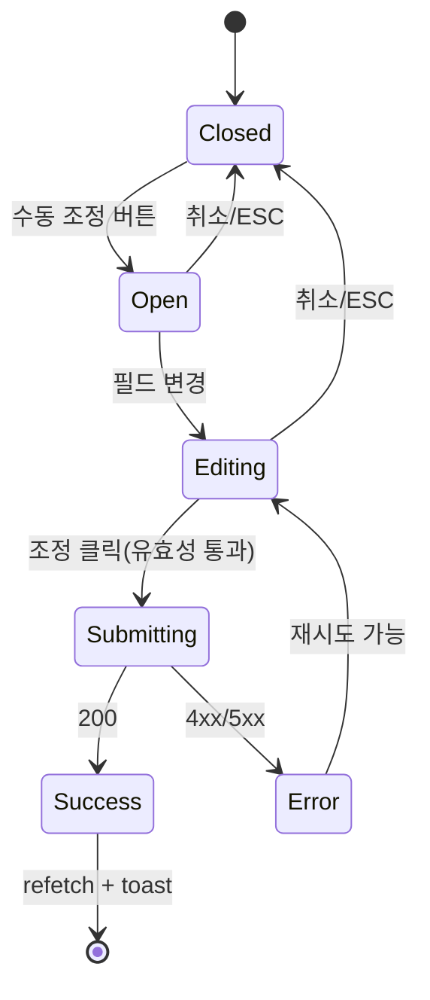

# DLG-M021 마일리지 수동 조정 — 기본화면 (마스터)

> 이 문서는 **다이얼로그 마스터 스펙**입니다. `01~04` 상태 문서는 이 문서를 상속(override/delta)합니다.
> 🚨 **금융성 액션**: 마일리지 포인트를 관리자가 수동 가감하는 고위험 작업 — 감사로그 필수.

---

## 0. 메타 & 원천 참조

| 항목 | 값 |
|------|----|
| 다이얼로그 ID | DLG-M021 |
| 다이얼로그명 | 마일리지 수동 조정 |
| 도메인 | D02-회원관리 |
| 부모 화면 | SCR-M004 회원 상세 > 상세내역 탭 > 마일리지 서브탭 |
| 트리거 조건 | "수동 조정" 버튼 클릭 |
| 확인 레벨 | L1 (가역 불가에 준함, 단 역조정 가능) — 필드 유효성 강제 |
| 서버 호출 여부 | ✅ `POST /members/:id/mileage-adjust` |
| 닫기 옵션 | 🟡 ESC/배경/X = 취소 허용 (`03-제출중` 상태에서는 차단) |
| 역할 | superAdmin / primary / owner / manager (fc/trainer/staff 불가) |
| 파일 경로 | `src/components/members/MileageAdjustDialog.tsx` |
| 우선순위 | P1 |

### 원천 문서 링크
| 문서 | 경로 | 섹션 |
|---|---|---|
| 화면설계서 | `docs/화면설계서/회원관리.md` | §DLG-M021 (L2743~) |
| 기능명세서 | `docs/기능명세서/회원관리.md` | §3.10.5 마일리지 서브탭 |
| 에러코드정의서 | `docs/에러코드정의서.md` | §4.2 회원(E400~E422100대), §공통 E401/E403/E500 |
| 다이어그램 | `docs/다이어그램/D02_회원관리/DLG/DLG-M021_마일리지조정/M1~M3` | 생명주기/검증/결과 |
| 권한 매트릭스 | `docs/다이어그램/10_권한매트릭스/R1_역할화면_매트릭스.md` | 회원관리 마일리지 수정 |

---

## 1. 다이얼로그 목적 (Why)

관리자가 **회원 마일리지 포인트**를 적립(EARN) 또는 사용(USE) 방향으로 수동 조정하는 고위험 금융 작업.
- 사유 필수 입력 → 감사로그 기록
- 포인트 부족 시 USE 차단
- 성공 시 `member_mileage_logs` 테이블에 이력 저장 + 회원 잔액 갱신

---

## 2. 화면 레이아웃 (Wireframe)

### 2.1 기본 레이아웃 (max-w-md)

```
  backdrop: bg-black/50
  ┌─────────────────────────────────────┐
  │  ┌─────────────────────────────┐    │
  │  │ 💰 마일리지 수동 조정    [X]│    │ ← Header
  │  │                             │    │
  │  │ 현재 잔액: 1,500 P          │    │ ← Read-only
  │  │                             │    │
  │  │ 유형 *                       │    │
  │  │ ( ) 적립 (EARN)  ( ) 사용(USE)│  │ ← radio
  │  │                             │    │
  │  │ 포인트 *                     │    │
  │  │ [ 100            ] P        │    │ ← number
  │  │                             │    │
  │  │ 사유 *                       │    │
  │  │ [────────────────────]      │    │ ← text (필수)
  │  │                             │    │
  │  │     [ 취소 ]   [ 조정 ]      │    │
  │  └─────────────────────────────┘    │
  └─────────────────────────────────────┘
```

| 영역 | 치수 | 역할 |
|---|---|---|
| Backdrop | `fixed inset-0 bg-black/50 z-40` | 배경 |
| Modal | `max-w-md` | 카드 |
| Header | 48px | 아이콘/제목/X |
| Balance | 40px | 현재 잔액 Read-only |
| Body | auto | 유형 radio + 포인트 + 사유 |
| Footer | 56px | [취소][조정(primary)] |

---

## 3. 디자인 토큰

### 3.1 색상

| 토큰 | 클래스 | 용도 |
|---|---|---|
| backdrop | `fixed inset-0 bg-black/50 z-40` | 배경 |
| card | `bg-white rounded-2xl shadow-xl ring-1 ring-gray-100` | 카드 |
| icon.wrap | `bg-amber-50 rounded-full size-10` | 아이콘 래퍼 |
| icon.color | `text-amber-500` | `Coins` |
| balance.box | `bg-gray-50 rounded-md p-3 text-sm` | 현재 잔액 |
| radio.earn | `border-green-300 text-green-700` | 적립 선택 |
| radio.use | `border-rose-300 text-rose-700` | 사용 선택 |
| input | `h-10 w-full rounded-lg border border-gray-300 px-3 text-sm focus:ring-2 focus:ring-blue-500` | 필드 |
| btn.cancel | `border border-gray-300 bg-white hover:bg-gray-50 text-gray-700` | Secondary |
| btn.confirm | `bg-blue-600 hover:bg-blue-700 text-white` | Primary |
| btn.confirm.disabled | `bg-blue-300 cursor-not-allowed` | |

### 3.2 타이포

| 토큰 | 값 |
|---|---|
| title | `text-lg font-semibold text-gray-900` |
| body | `text-sm text-gray-600 leading-relaxed` |
| balance | `text-base font-semibold text-amber-700` |
| field.label | `text-sm font-medium text-gray-700` |
| error.field | `text-xs text-red-600 mt-1` |

### 3.3 간격/반경/모션
- radius: `rounded-2xl`
- padding: `p-6`
- enter: `animate-[fadeInUp_140ms_ease-out]`
- fields gap: `space-y-4`

---

## 4. 반응형 규칙

| BP | 모달 |
|---|---|
| Mobile <640 | `max-w-xs w-[calc(100%-32px)]`, radio stacked |
| Tablet | `max-w-md`, radio inline |
| Desktop | `max-w-md` |

---

## 5. 🔐 역할별(RBAC) 매트릭스

| 요소 | superAdmin | primary | owner | manager | fc | trainer | staff | front | readonly |
|---|:---:|:---:|:---:|:---:|:---:|:---:|:---:|:---:|:---:|
| 다이얼로그 오픈 | ● | ● | ● | ● | — | — | — | — | — |
| 유형 선택 (EARN/USE) | ● | ● | ● | ● | — | — | — | — | — |
| 포인트 입력 | ● | ● | ● | ● | — | — | — | — | — |
| 사유 입력 | ● | ● | ● | ● | — | — | — | — | — |
| "조정" 확정 | ● | ● | ● | ● | — | — | — | — | — |
| 취소/ESC | ● | ● | ● | ● | ● | ● | ● | ● | ● |

### 멀티테넌트
- 서버는 `branchId` 스코프 강제 — 타 지점 회원 마일리지 조정 시 403
- `superAdmin/primary`만 전 지점 가능. 그 외 본인 지점만

---

## 6. 컴포넌트 트리

```tsx
<MileageAdjustDialog
  isOpen={isOpen}
  member={{ id, name, mileage: currentBalance }}
  onClose={() => setOpen(false)}
  onSuccess={() => { qc.invalidateQueries(['mileage-logs', memberId]); qc.invalidateQueries(['member', memberId]); }}
/>

내부 구조:
<ConfirmDialog variant="primary" icon={<Coins/>} title="마일리지 수동 조정"
               confirmLabel="조정" ...>
  <div className="bg-gray-50 rounded-md p-3">
    현재 잔액: <b>{formatNumber(currentBalance)} P</b>
  </div>
  <RadioGroup name="type" options={[{value:'EARN', label:'적립'}, {value:'USE', label:'사용'}]} />
  <FormField label="포인트" error={errors.points?.message}>
    <input type="number" min={1} {...register('points', { valueAsNumber:true })} />
  </FormField>
  <FormField label="사유" error={errors.reason?.message}>
    <input type="text" maxLength={200} {...register('reason')} />
  </FormField>
</ConfirmDialog>
```

| 컴포넌트 | Props | 재사용 여부 |
|---|---|---|
| `MileageAdjustDialog` | `{isOpen, member, onClose, onSuccess}` | 전용 |
| `ConfirmDialog` (래퍼) | — | 공용 (DLG-003 마스터) |
| `RadioGroup` | `{name, options, value, onChange}` | 전역 공용 |

---

## 7. 데이터 계약

### 7.1 Zod 스키마

```ts
// src/schemas/members.ts
export const mileageAdjustSchema = z.object({
  type: z.enum(['EARN', 'USE']),
  points: z.number().int().min(1, '포인트를 입력하세요'),
  reason: z.string().trim().min(1, '사유를 입력하세요').max(200),
}).refine(
  (v, ctx) => !(v.type === 'USE' && v.points > (ctx?.balance ?? 0)),
  { message: '보유 마일리지가 부족합니다', path: ['points'] }
);
export type MileageAdjustForm = z.infer<typeof mileageAdjustSchema>;
```

### 7.2 API

| 항목 | 값 |
|---|---|
| 엔드포인트 | `POST /members/:id/mileage-adjust` |
| 요청 | `{ type: 'EARN'|'USE', points: number, reason: string }` |
| 성공(200) | `{ success: true, data: { newBalance: number, logId: number } }` |
| 실패(403) | `{ success: false, errorCode: 'E403001', message: '권한이 없습니다' }` |
| 실패(422) | `{ success: false, errorCode: 'E422100', message: '보유 마일리지가 부족합니다' }` |
| 실패(404) | `{ success: false, errorCode: 'E404100', message: '회원을 찾을 수 없습니다' }` |

### 7.3 상태 전이
```
closed → open(01) → editing(02) → submitting(03) → result(04, 성공|실패)
                                             ↳ closed(cancel/esc, submitting은 차단)
```

---

## 8. 비즈니스 룰

1. **권한 가드 이중화**: 클라이언트 `hasFeature(role, 'memberMileageAdjust')` + 서버 403
2. **USE 포인트 부족 검증**: 클라 `points > balance` 시 필드 에러 → 서버도 E422100
3. **사유 필수**: 공백 trim 후 비어있으면 차단. 감사로그에 그대로 기록
4. **최소 포인트**: `min=1`. 0/음수 불가
5. **감사로그**: 서버가 `AUDIT.MEMBER_MILEAGE_ADJUST` 기록 (adjustor, type, points, reason, beforeBalance, afterBalance)
6. **닫기 차단**: `03-제출중` 상태에서는 ESC/배경/X 차단
7. **낙관적 업데이트 금지**: 금융 성격상 서버 응답 후에만 잔액 갱신
8. **성공 후 refetch**: `['mileage-logs', memberId]` + `['member', memberId]` invalidate

---

## 9. 상태 목록

| 파일 | 상태 코드 | 한글 | 트리거 |
|---|---|---|---|
| `01-열림.md` | `mileage-adjust-open` | 열림 | "수동 조정" 클릭 |
| `02-입력중.md` | `mileage-adjust-editing` | 입력 중 | 필드 변경 |
| `03-제출중.md` | `mileage-adjust-submitting` | 제출 중 | "조정" 클릭 |
| `04-성공또는실패.md` | `mileage-adjust-result` | 결과 | 응답 수신 |

---

## 10. 에러 코드 매핑

| errorCode | HTTP | 시나리오 | 표시 | 다음 상태 |
|---|---|---|---|---|
| E400101 | 400 | 필수값 누락 | 필드 인라인 | `02-입력중` |
| E403001 | 403 | 권한 없음 | 토스트 "권한이 없습니다" | 다이얼로그 닫기 |
| E404100 | 404 | 회원 없음 | 토스트 "회원을 찾을 수 없습니다" | 다이얼로그 닫기 |
| E422100 | 422 | 포인트 부족 | 필드 에러 + 토스트 | 다이얼로그 유지 |
| E500001 | 500 | 서버 오류 | 토스트 "일시적 오류" | 다이얼로그 유지 |
| NETWORK | — | 네트워크 | 토스트 "네트워크 오류" | 다이얼로그 유지 |
| E401002 | 401 | 세션 만료 | DLG-000 | 이 다이얼로그 정리 |

---

## 11. 접근성 (WCAG 2.1 AA)

| 항목 | 요구사항 |
|---|---|
| role | `role="dialog" aria-modal="true"` |
| 라벨 | `aria-labelledby`, `aria-describedby` |
| 포커스 | 오픈 시 유형 radio "적립"에 자동 포커스 |
| Tab 순서 | 유형(radio) → 포인트 → 사유 → 취소 → 조정 → X |
| 키보드 | Enter=폼 제출, Esc=취소 (단 submitting 중 차단) |
| Live region | 필드 에러 `aria-live="polite"` |
| 모션 감소 | `motion-reduce:animate-none` |

---

## 12. 진입/이탈 연결

### 진입
- SCR-M004 상세내역 탭 > 마일리지 서브탭 > "수동 조정" 버튼

### 이탈
| 액션 | 목적지 |
|---|---|
| 취소/ESC | 닫힘, SCR-M004로 복귀 |
| 조정 성공 | 닫힘 + 토스트 + 목록 refetch |
| 세션 만료 | DLG-000 |

---

## 13. 다이어그램 통합 뷰



참조: `docs/다이어그램/D02_회원관리/DLG/DLG-M021_마일리지조정/M1_생명주기.md`

---

## 14. 🧩 바이브코딩 프롬프트 (마스터)

```
Next.js 15 App Router + TypeScript + Tailwind + React Query + react-hook-form + zod 기반
'use client' 다이얼로그를 작성하라.

━━ 파일 ━━
src/components/members/MileageAdjustDialog.tsx
src/schemas/members.ts (mileageAdjustSchema)
src/api/members/mileage.ts (postMileageAdjust)

━━ Props ━━
interface Props {
  isOpen: boolean;
  member: { id: number; name: string; mileage: number };
  onClose: () => void;
  onSuccess?: (newBalance: number) => void;
}

━━ 레이아웃 ━━
Radix Dialog 또는 커스텀 portal 기반. 공용 ConfirmDialog 활용 가능.
- backdrop: fixed inset-0 z-40 bg-black/50
- card: w-full max-w-md bg-white rounded-2xl shadow-xl ring-1 ring-gray-100 p-6 space-y-4
- header: <Coins/> 아이콘 원형 bg-amber-50, 제목 "마일리지 수동 조정"
- 현재 잔액 박스: bg-gray-50 rounded-md p-3 text-sm → `현재 잔액: {formatNumber(member.mileage)} P`
- 유형 radio group: 2개 옵션(EARN/USE) inline flex gap-3
- 포인트 number input: h-10 border rounded-lg, suffix "P"
- 사유 text input: h-10 border rounded-lg, maxLength=200
- footer: [취소(border)][조정(bg-blue-600)] gap-2 justify-end

━━ 스키마 ━━
const mileageAdjustSchema = z.object({
  type: z.enum(['EARN', 'USE']),
  points: z.number().int().min(1, '포인트를 입력하세요'),
  reason: z.string().trim().min(1, '사유를 입력하세요').max(200, '200자 이내'),
});
// USE + points > balance 시 커스텀 superRefine → path:['points'], message:'보유 마일리지가 부족합니다'

━━ react-hook-form ━━
const { register, handleSubmit, watch, formState:{errors, isValid} } = useForm({
  resolver: zodResolver(mileageAdjustSchema),
  defaultValues: { type:'EARN', points:0, reason:'' },
  mode: 'onChange',
});
const type = watch('type'); const points = watch('points');
const insufficient = type === 'USE' && points > member.mileage;

━━ Mutation ━━
const mut = useMutation({
  mutationFn: (body: MileageAdjustForm) =>
    fetch(`/api/members/${member.id}/mileage-adjust`, { method:'POST', body: JSON.stringify(body) }).then(r => r.json()),
  onSuccess: (res) => {
    qc.invalidateQueries({queryKey:['mileage-logs', member.id]});
    qc.invalidateQueries({queryKey:['member', member.id]});
    toast.success(`마일리지가 ${type==='EARN'?'적립':'사용'}되었습니다`);
    onSuccess?.(res.data.newBalance); onClose();
  },
  onError: (e:any) => {
    if (e.errorCode === 'E422100') toast.error('보유 마일리지가 부족합니다');
    else if (e.errorCode === 'E403001') { toast.error('권한이 없습니다'); onClose(); }
    else toast.error('조정에 실패했습니다');
  },
});

━━ 인터랙션 ━━
- 오픈 시 "적립" radio 자동 포커스
- type='USE' 변경 시 points 초과면 필드 에러 즉시 표시
- submitting=true 동안 모든 필드 readOnly, 버튼 Loader2 + "처리 중..."
- ESC/배경/X: submitting 중 차단, 그 외 onClose()

━━ 접근성 ━━
- role="dialog" aria-modal="true" aria-labelledby="mileage-title" aria-describedby="mileage-desc"
- radio group: <fieldset><legend>유형</legend> + aria-required
- points/reason: aria-invalid + aria-describedby="err-{field}"

━━ QA 체크 ━━
- EARN +100 / USE -50 정상 저장
- USE 잔액 초과 시 필드 에러 + 제출 차단
- 사유 공백 시 필드 에러
- 성공 후 잔액 즉시 갱신, 로그 탭에 신규 레코드
- 권한 없는 역할(fc/trainer/staff)은 버튼 자체 불가(부모 화면 가드)
- 403 수신 시 토스트 + 다이얼로그 닫기
- submitting 중 ESC/배경 차단
```

---

## 15. QA 체크리스트

- [ ] 관리자 역할만 다이얼로그 열림
- [ ] 오픈 시 유형 "적립" 자동 포커스
- [ ] 현재 잔액 표시 정확
- [ ] EARN 100 / 사유 "이벤트" 제출 → 성공, 잔액 +100
- [ ] USE 잔액 초과 입력 시 필드 에러
- [ ] 사유 공백 시 필드 에러
- [ ] 포인트 0/음수 차단
- [ ] 제출 중 ESC/배경/X 차단
- [ ] 성공 후 토스트 + 로그 refetch + 잔액 갱신
- [ ] 403 → 토스트 + 다이얼로그 닫기
- [ ] 422(포인트 부족) → 필드 에러 + 다이얼로그 유지
- [ ] 500/NETWORK → 다이얼로그 유지 + 재시도 가능
- [ ] 감사로그 서버 기록 확인
- [ ] 키보드 Tab 순환 정상 (radio → points → reason → cancel → confirm → X)
- [ ] 모바일 360px 폭 가독성
