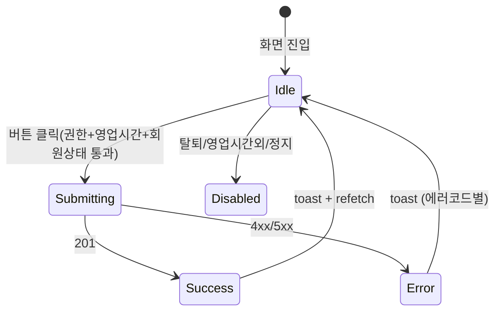

# DLG-M022 수동 출석 등록 — 기본화면 (마스터)

> 이 문서는 **다이얼로그 마스터 스펙**입니다. `01~04` 상태 문서는 이 문서를 상속(override/delta)합니다.
> ⚡ **인라인 실행 다이얼로그**: 별도 모달 없이 버튼 클릭 즉시 처리하나 실패 시 인라인 토스트 + 재시도 UX를 포함.

---

## 0. 메타 & 원천 참조

| 항목 | 값 |
|------|----|
| 다이얼로그 ID | DLG-M022 |
| 다이얼로그명 | 수동 출석 등록 |
| 도메인 | D02-회원관리 |
| 부모 화면 | SCR-M004 회원 상세 프로필 헤더 |
| 트리거 조건 | "수동출석" 버튼 클릭 (CheckCircle2 13px, bg-state-success) |
| 확인 레벨 | L0 (확인 모달 없음 — 직접 실행) |
| 서버 호출 여부 | ✅ `POST /attendances` (type='MANUAL', checkInMethod='MANUAL') |
| 닫기 옵션 | 해당 없음 (인라인 토스트만) |
| 역할 | superAdmin / primary / owner / manager / fc / trainer / staff / front (readonly 제외) |
| 파일 경로 | `src/components/members/ManualAttendanceButton.tsx` |
| 우선순위 | P0 |

### 원천 문서 링크
| 문서 | 경로 | 섹션 |
|---|---|---|
| 화면설계서 | `docs/화면설계서/회원관리.md` | §DLG-M022, §SCR-M004 프로필헤더 |
| 기능명세서 | `docs/기능명세서/회원관리.md` | §3 회원 상세 > 출석 탭, §8.8 수동출석 |
| 에러코드정의서 | `docs/에러코드정의서.md` | §4.5 출석/키오스크 E4xx400~499 |
| 다이어그램 | `docs/다이어그램/D02_회원관리/DLG/DLG-M022_수동출석/M1~M3` | 생명주기/검증/결과 |
| SCR-I001 연계 | `docs/다이어그램/D11_통합운영/SCR-I001_출석관리` | 키오스크/IoT 출석과 통합 집계 |

---

## 1. 다이얼로그 목적 (Why)

회원이 키오스크/IoT 게이트를 이용할 수 없는 경우(기기 장애, 임시 수동 체크인 등)에 관리자가 즉시 출석을 기록.
- 단일 버튼 클릭 → 즉시 서버 호출 → 성공/실패 토스트
- 별도 입력 폼 없음: 현재 시각(`now()`) + 현재 지점(`branchId`) + 수동 마크
- 당일 중복 출석 방지 (E403400)
- 영업시간 외 차단 (E403401)

---

## 2. 화면 레이아웃 (Wireframe)

### 2.1 트리거 버튼 (SCR-M004 헤더 위치)

```
 ┌────────────────────────────────────────────────────────┐
 │ 홍길동 · 010-1234-5678 · ACTIVE               [프로필]   │
 │                                                        │
 │ [✓ 수동출석] [수정] [상품구매] [메시지] [지점이관] [탈퇴]  │
 │   ↑ DLG-M022                                           │
 └────────────────────────────────────────────────────────┘
```

### 2.2 상태 별 시각

| 상태 | 버튼 라벨 | 아이콘 | 비주얼 |
|---|---|---|---|
| idle | 수동출석 | `CheckCircle2(13px)` | `bg-state-success text-white` |
| loading | 처리 중... | `Loader2 animate-spin` | disabled, opacity-70 |
| success (단시간) | 수동출석 | 동일 | 토스트만 |
| error | 수동출석 | 동일 | 토스트만, 버튼 다시 idle |

---

## 3. 디자인 토큰

### 3.1 색상

| 토큰 | 클래스 | 용도 |
|---|---|---|
| btn.bg | `bg-emerald-600 hover:bg-emerald-700` | 기본 |
| btn.bg.loading | `bg-emerald-500 opacity-70` | 제출 중 |
| btn.bg.disabled | `bg-gray-300 cursor-not-allowed` | 탈퇴/영업시간외 |
| btn.fg | `text-white` | 텍스트 |
| toast.success | `bg-emerald-50 border-emerald-200 text-emerald-800` | 성공 |
| toast.error | `bg-rose-50 border-rose-200 text-rose-800` | 실패 |

### 3.2 타이포

| 토큰 | 값 |
|---|---|
| btn.label | `text-[13px] font-medium` |
| toast.body | `text-sm` |

### 3.3 간격/반경/모션
- 버튼: `h-8 px-3 rounded-md inline-flex items-center gap-1.5`
- 로딩 전환: `transition-colors duration-150`

---

## 4. 반응형 규칙

| BP | 버튼 |
|---|---|
| Mobile <640 | 아이콘 + `수동` 라벨만 (축약) |
| Tablet/Desktop | 아이콘 + `수동출석` 라벨 |

---

## 5. 🔐 역할별(RBAC) 매트릭스

| 요소 | superAdmin | primary | owner | manager | fc | trainer | staff | front | readonly |
|---|:---:|:---:|:---:|:---:|:---:|:---:|:---:|:---:|:---:|
| "수동출석" 버튼 노출 | ● | ● | ● | ● | ● | ● | ● | ● | — |
| 실행 | ● | ● | ● | ● | ● | ● | ● | ● | — |

> front/trainer/staff도 현장 지원 인력이므로 수동 출석 실행 권한 부여 (출석 도메인 공통 정책)
> 🔒 서버는 `branchId` 스코프 강제 — 타 지점 회원에 대한 수동 출석 시도 시 403

---

## 6. 컴포넌트 트리

```tsx
<ManualAttendanceButton
  memberId={member.id}
  disabled={member.status === 'WITHDRAWN' || !withinBusinessHours}
  onSuccess={() => qc.invalidateQueries(['attendances', member.id])}
/>

내부:
<button className={btnCls} onClick={onClick} disabled={loading || disabled}>
  {loading ? <Loader2 className="size-[13px] animate-spin" /> : <CheckCircle2 className="size-[13px]" />}
  <span>{loading ? '처리 중...' : '수동출석'}</span>
</button>
```

| 컴포넌트 | Props | 재사용 여부 |
|---|---|---|
| `ManualAttendanceButton` | `{memberId, disabled, onSuccess}` | 전용 |

---

## 7. 데이터 계약

### 7.1 API

| 항목 | 값 |
|---|---|
| 엔드포인트 | `POST /attendances` |
| 요청 | `{ memberId, type:'MANUAL', checkInMethod:'MANUAL', checkInAt: new Date().toISOString() }` |
| 성공(201) | `{ success:true, data:{ id, checkInAt } }` |
| 실패(403) | E403400 재입장 제한 / E403401 영업시간 외 |
| 실패(404) | E404400 회원 없음 또는 출석번호 미등록 |
| 실패(422) | E422400 이용권 없음 / E422401 정지 회원 |
| 실패(500) | E500001 서버 오류 |

### 7.2 상태 전이
```
idle(01) → (클릭) → submitting(03) → success(04) | error(04 유지=idle)
              ↳ (클릭 중복) 무시
```
> 본 DLG는 입력 필드가 없어 `02-입력중`은 **사실상 비어있는 중간 상태**로 간주 — 유효성 없이 바로 submitting으로 전이.

---

## 8. 비즈니스 룰

1. **중복 방지**: `mut.isPending` 동안 버튼 disabled + 이벤트 가드
2. **당일 중복 출석 차단**: 서버 403 E403400. 클라에서는 마지막 출석 시각 기준 UX 힌트(optional)
3. **영업시간 체크**: 클라 `withinBusinessHours` 사전 계산 — 외부면 버튼 disabled + 툴팁 "영업시간 외"
4. **탈퇴 회원 차단**: `status==='WITHDRAWN'` 시 버튼 disabled + 툴팁 "탈퇴 회원"
5. **성공 후 UI**: 토스트 + 출석 탭 refetch. 버튼은 idle로 복귀
6. **감사로그**: 서버가 `AUDIT.ATTENDANCE_MANUAL` 기록 (actor, memberId, at, branchId)
7. **SCR-I001 연계**: 통합출석 화면에서 실시간 반영 (Realtime 채널 `attendances`)

---

## 9. 상태 목록

| 파일 | 상태 코드 | 한글 | 트리거 |
|---|---|---|---|
| `01-열림.md` | `manual-attend-idle` | 열림(=idle 버튼) | 부모 화면 렌더 |
| `02-입력중.md` | `manual-attend-preflight` | 입력중(=프리플라이트) | 클릭 순간(100ms) |
| `03-제출중.md` | `manual-attend-submitting` | 제출 중 | API 호출 |
| `04-성공또는실패.md` | `manual-attend-result` | 결과 | 응답 수신 |

---

## 10. 에러 코드 매핑

| errorCode | HTTP | 시나리오 | 표시 | 다음 상태 |
|---|---|---|---|---|
| E403400 | 403 | 당일 중복 출석 | 토스트 "오늘 이미 출석하셨습니다" | idle 복귀 |
| E403401 | 403 | 영업시간 외 | 토스트 "영업시간이 아닙니다" + 버튼 disabled 유지 | idle disabled |
| E404400 | 404 | 회원/출석번호 없음 | 토스트 "회원을 찾을 수 없습니다" | idle 복귀 |
| E422400 | 422 | 이용권 없음/만료 | 토스트 "유효한 이용권이 없습니다" | idle 복귀 |
| E422401 | 422 | 정지 회원 | 토스트 "이용이 정지된 회원입니다" | idle disabled |
| E403001 | 403 | 권한 없음 | 토스트 "권한이 없습니다" | idle disabled |
| E500001 | 500 | 서버 오류 | 토스트 "일시적 오류가 발생했습니다" | idle 복귀 |
| NETWORK | — | 네트워크 | 토스트 "네트워크 오류" | idle 복귀 |

---

## 11. 접근성 (WCAG 2.1 AA)

| 항목 | 요구사항 |
|---|---|
| 버튼 role | `<button type="button">` |
| aria-label | `"수동출석"` |
| aria-busy | `loading` 시 `aria-busy="true"` |
| 토스트 | `role="status"` (성공) / `role="alert"` (실패) |
| 포커스 | 처리 후 버튼에 포커스 유지 |
| 키보드 | `Enter`/`Space`로 실행 |

---

## 12. 진입/이탈 연결

### 진입
- SCR-M004 회원 상세 프로필 헤더의 "수동출석" 버튼

### 이탈
| 액션 | 목적지 |
|---|---|
| 성공 | 동일 화면 유지 + 토스트 + 출석 탭 갱신 |
| 실패 | 동일 화면 유지 + 토스트 (코드별 메시지) |

---

## 13. 다이어그램 통합 뷰



참조: `docs/다이어그램/D02_회원관리/DLG/DLG-M022_수동출석/M1_생명주기.md`

---

## 14. 🧩 바이브코딩 프롬프트 (마스터)

```
Next.js 15 App Router + TypeScript + Tailwind + React Query 기반
'use client' 인라인 버튼 컴포넌트를 작성하라.

━━ 파일 ━━
src/components/members/ManualAttendanceButton.tsx
src/api/attendances.ts (postManualAttendance)

━━ Props ━━
interface Props {
  memberId: number;
  disabled?: boolean;        // 탈퇴/영업시간외 사유 부모에서 판단
  disabledReason?: string;   // 툴팁
  onSuccess?: () => void;
}

━━ 구현 ━━
export function ManualAttendanceButton({ memberId, disabled, disabledReason, onSuccess }: Props) {
  const qc = useQueryClient();
  const mut = useMutation({
    mutationFn: () => fetch('/api/attendances', {
      method:'POST',
      headers:{'Content-Type':'application/json'},
      body: JSON.stringify({
        memberId,
        type:'MANUAL',
        checkInMethod:'MANUAL',
        checkInAt: new Date().toISOString(),
      }),
    }).then(r => r.ok ? r.json() : Promise.reject(r.json())),
    onSuccess: () => {
      qc.invalidateQueries({queryKey:['attendances', memberId]});
      qc.invalidateQueries({queryKey:['member', memberId]});
      toast.success('출석이 기록되었습니다');
      onSuccess?.();
    },
    onError: async (e:any) => {
      const err = await (typeof e?.then === 'function' ? e : Promise.resolve(e));
      const code = err?.errorCode ?? 'E500001';
      const msg = {
        E403400: '오늘 이미 출석하셨습니다',
        E403401: '영업시간이 아닙니다',
        E404400: '회원을 찾을 수 없습니다',
        E422400: '유효한 이용권이 없습니다',
        E422401: '이용이 정지된 회원입니다',
        E403001: '권한이 없습니다',
        E500001: '일시적 오류가 발생했습니다',
      }[code] ?? '출석 처리에 실패했습니다';
      toast.error(msg);
    },
  });

  const onClick = () => {
    if (mut.isPending || disabled) return;
    mut.mutate();
  };

  return (
    <button type="button" onClick={onClick} disabled={mut.isPending || disabled}
      title={disabled ? disabledReason : undefined}
      aria-label="수동출석" aria-busy={mut.isPending}
      className={clsx(
        'h-8 px-3 rounded-md inline-flex items-center gap-1.5 text-[13px] font-medium text-white transition-colors',
        !disabled && !mut.isPending && 'bg-emerald-600 hover:bg-emerald-700',
        mut.isPending && 'bg-emerald-500 opacity-70 cursor-wait',
        disabled && 'bg-gray-300 cursor-not-allowed',
      )}>
      {mut.isPending
        ? <><Loader2 className="size-[13px] animate-spin" /> 처리 중...</>
        : <><CheckCircle2 className="size-[13px]" /> 수동출석</>}
    </button>
  );
}

━━ 부모 가드(회원 상세 헤더에서) ━━
const withinBH = useBusinessHours(); // 지점 영업시간 체크 훅
<ManualAttendanceButton
  memberId={member.id}
  disabled={member.status==='WITHDRAWN' || member.status==='SUSPENDED' || !withinBH}
  disabledReason={
    member.status==='WITHDRAWN' ? '탈퇴 회원' :
    member.status==='SUSPENDED' ? '정지 회원' :
    !withinBH ? '영업시간 외' : undefined}
  onSuccess={() => refetchMember()}
/>

━━ QA 체크 ━━
- idle → 클릭 → 즉시 loading → 201 → toast 성공 + refetch
- 중복 출석(403) → toast "오늘 이미 출석" + idle 복귀
- 영업시간 외 → 버튼 disabled + 툴팁
- 탈퇴/정지 회원 → 버튼 disabled + 툴팁
- 로딩 중 연속 클릭 → 단 1회만 요청
- 권한 없는 역할(readonly) → 부모에서 버튼 자체 미렌더
- 스크린리더: aria-busy 공지
```

---

## 15. QA 체크리스트

- [ ] 정상 클릭 시 201 + 토스트 "출석이 기록되었습니다"
- [ ] 출석 탭에 신규 레코드 추가
- [ ] 당일 중복 → 403 E403400 토스트
- [ ] 영업시간 외 → 버튼 disabled + 툴팁
- [ ] 탈퇴/정지 회원 → 버튼 disabled + 툴팁
- [ ] 이용권 없음 → 422 E422400 토스트
- [ ] 권한 없는 역할(readonly) → 버튼 미노출
- [ ] 로딩 중 중복 클릭 단 1회
- [ ] 네트워크 에러 → 토스트 + idle 복귀
- [ ] SCR-I001 통합 화면에 Realtime 반영
- [ ] 감사로그 AUDIT.ATTENDANCE_MANUAL 기록
- [ ] aria-busy, 포커스 유지
- [ ] 모바일 축약 라벨 "수동"
