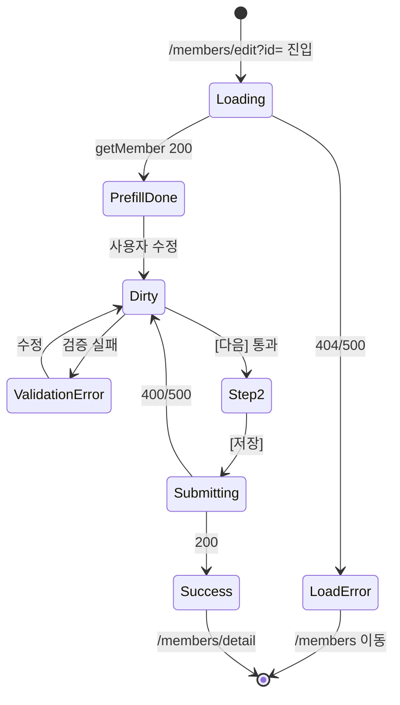

# SCR-M003 회원 정보 수정 — 기본화면 (마스터)

> 이 문서는 **화면 마스터 스펙**. `01~08` 상태 문서는 이 문서를 상속합니다.
> SCR-M002(회원 등록)와 동일 컴포넌트를 재사용. `isEditRoute` 플래그로 분기.

---

## 0. 메타 & 원천 참조

| 항목 | 값 |
|------|----|
| 화면 ID | SCR-M003 |
| 화면명 | 회원 정보 수정 |
| 도메인 | D02-회원관리 |
| 경로 | `/members/edit?id={memberId}` |
| 파일 경로 | `src/app/(dashboard)/members/edit/page.tsx` (내부적으로 new/page 재export) |
| 역할 | `primary/super`, `owner`, `manager`, `staff` (fc/trainer/front/readonly 차단) |
| 우선순위 | P0 |
| pageId(legacy) | 987 |
| 멀티테넌트 | ✅ branchId 강제 |

### 원천 문서
| 문서 | 섹션 |
|---|---|
| `docs/화면설계서/회원관리.md` | §SCR-M003 |
| `docs/기능명세서/회원관리.md` | §2. 회원 등록/수정 (공유) |
| `docs/에러코드정의서.md` | §4.2 회원 (E400100~E409100) |
| `docs/다이어그램/D02_회원관리/SCR-M003_회원수정/F1~F8` | - |

---

## 1. 화면 목적 (Why)

기존 회원의 정보를 수정. SCR-M002와 90% 동일한 UI — 차이점만 분기:
- Pre-fill (기존 데이터 로드 후 폼 채움)
- 중복확인 시 자기 자신 제외 (`.neq('id', urlMemberId)`)
- 저장: INSERT 대신 UPDATE
- PageHeader 제목: "회원 정보 수정"
- 성공 메시지: "회원 정보가 수정되었습니다."
- "바로 결제" 액션 없음

---

## 2. 화면 레이아웃

SCR-M002와 동일. 차이는 PageHeader 제목/설명만.

```
┌─────────────────────────────────────────────────────────────┐
│ PageHeader                                                  │
│  제목: "회원 정보 수정"                                       │
│  설명: "기존 회원의 정보를 수정합니다."                        │
│  액션: [↺ 초기화] [✕ 취소]                                    │
├─────────────────────────────────────────────────────────────┤
│ StepIndicator [① 필수 정보] —— [② 추가 정보]                  │
├─────────────────────────────────────────────────────────────┤
│ (이하 SCR-M002와 동일 — 기존 값 pre-fill)                     │
└─────────────────────────────────────────────────────────────┘
```

---

## 3. 디자인 토큰 / 반응형

SCR-M002 §3, §4와 동일.

---

## 5. 🔐 역할별(RBAC) 매트릭스

| 요소 | primary/super | owner | manager | fc | trainer | staff | front | readonly |
|---|:---:|:---:|:---:|:---:|:---:|:---:|:---:|:---:|
| 페이지 접근 | ● | ● | ● | — | — | ● | — | — |
| 수정 저장 | ● | ● | ● | — | — | ● | — | — |
| 민감 필드 수정 (phone 중복확인 포함) | ● | ● | ● | — | — | ● | — | — |

- 접근 불가 역할: `/members/edit?id=`에 직접 진입 시 `/forbidden` 또는 `/members/detail?id=`로 리다이렉트(읽기 전용).
- fc는 자기 담당 회원이어도 수정 불가 (정책). 🆕 예외 허용 플래그 `feature.allowFcEdit`.

---

## 6. 컴포넌트 트리

SCR-M002와 동일. 차이점:
- 페이지 컴포넌트: `MemberEditPage` (new/page 재사용 + `isEditRoute` flag)
- 데이터 로드 훅: `useMember(memberId)` → pre-fill `reset(memberData)`

```tsx
// /members/edit/page.tsx
export { default } from '../new/page';

// /members/new/page.tsx 내부
const urlMemberId = useSearchParams().get('id');
const isEditRoute = pathname.includes('/edit');
const isEditMode = isEditRoute && !!urlMemberId;

const { data: memberData, isLoading } = useQuery({
  queryKey: ['member', urlMemberId],
  queryFn: () => getMember(Number(urlMemberId)),
  enabled: isEditMode,
});

useEffect(() => {
  if (memberData) {
    reset({
      name: memberData.name,
      gender: memberData.gender === 'M' ? 'male' : 'female',
      phone: memberData.phone,
      memberType: memberData.memberType ?? '일반',
      birthDate: memberData.birthDate ?? '',
      height: memberData.height?.toString() ?? '',
      email: memberData.email ?? '',
      notes: memberData.memo ?? '',
      profileImage: memberData.profileImage,
      marketingConsent: memberData.adConsent ?? false,
      companyName: memberData.companyName ?? '',
      // ...
    });
    setPhoneChecked(true);  // 기존 값은 검증된 것으로 간주
    setPhoneDuplicate(false);
  }
}, [memberData, reset]);
```

---

## 7. 데이터 계약 (SCR-M002 대비 차이)

### 7.1 Pre-fill 데이터
```ts
interface MemberForEdit extends Member {
  // members 테이블 전체 + 조인된 staff
}

async function getMember(id: number): Promise<MemberForEdit> {
  const { data, error } = await supabase
    .from('members')
    .select('*, staff:staffId(name)')
    .eq('id', id)
    .is('deletedAt', null)
    .single();
  if (error) throw error;
  return data;
}
```

### 7.2 저장
```ts
async function onSave(data: MemberForm) {
  const payload = { /* SCR-M002 §7.6과 동일 필드 */ };
  const { error } = await supabase
    .from('members')
    .update({ ...payload, updatedAt: new Date().toISOString() })
    .eq('id', urlMemberId);
  if (error) throw error;
  toast.success('회원 정보가 수정되었습니다.');
  router.push(`/members/detail?id=${urlMemberId}`);
}
```

### 7.3 중복확인 (수정 모드)
```ts
async function handleDuplicateCheck() {
  const ok = await trigger('phone'); if (!ok) return;
  const { data } = await supabase
    .from('members')
    .select('id')
    .eq('branchId', user.branchId)
    .eq('phone', watch('phone'))
    .neq('id', urlMemberId)      // ← 자기 자신 제외
    .is('deletedAt', null);
  const duplicate = (data?.length ?? 0) > 0;
  setPhoneChecked(true); setPhoneDuplicate(duplicate);
  if (duplicate) toast.error('이미 등록된 번호입니다.');
}
```

### 7.4 변경 감지 & 확정
- RHF `formState.dirtyFields`로 변경 필드 집합 추적.
- 🆕 `AUDIT.MEMBER_UPDATE` (actorId, memberId, changedFields, before, after) 기록.
- 🆕 주요 필드 변경 시 수정 사유 입력 필수화 (향후 권장).

---

## 8. 비즈니스 룰 델타 (vs SCR-M002)

| 구분 | SCR-M002 (등록) | SCR-M003 (수정) |
|---|---|---|
| 페이지 진입 조건 | 역할 + 권한 | 역할 + 권한 + `?id={memberId}` 유효 |
| 초기 데이터 | 빈 폼 | 기존 회원 pre-fill (`01-데이터로딩중`) |
| 중복확인 | phone으로 신규 등록 중복 체크 | `.neq('id', urlMemberId)` 자기 제외 |
| phoneChecked 초기값 | false | **true** (기존 값이 유효했던 것으로 간주) |
| 저장 | `INSERT` | `UPDATE ... WHERE id = {urlMemberId}` |
| 성공 메시지 | "신규 회원이 등록되었습니다." | "회원 정보가 수정되었습니다." |
| 성공 액션 | "바로 결제" | 없음 (바로 상세 이동) |
| 성공 후 이동 | `/members/detail?id={newId}` | `/members/detail?id={urlMemberId}` |
| PageHeader 제목 | "신규 회원 등록" | "회원 정보 수정" |
| 데이터 없음 | — | `03-로드실패` 상태 → toast + `/members` 이동 |
| 변경 이력 | - | 🆕 `AUDIT.MEMBER_UPDATE` 기록 |

---

## 9. 상태 목록

| 파일 | 상태 코드 | 트리거 |
|---|---|---|
| `01-데이터로딩중.md` | `edit-loading` | 마운트 직후 `useMember(id)` pending |
| `02-prefill완료.md` | `edit-prefill-done` | `getMember` 200 → `reset(memberData)` |
| `03-로드실패.md` | `edit-load-error` | `getMember` 404/500/네트워크 |
| `04-수정중.md` | `edit-dirty` | 사용자 수정 `isDirty=true` |
| `05-유효성에러.md` | `edit-validation-error` | onBlur/Submit 실패 |
| `06-이미지업로드중.md` | `edit-image-uploading` | ProfileImageUploader pending |
| `07-Step2.md` | `edit-step2` | Step 1 통과 → Step 2 |
| `08-저장중.md` | `edit-submitting` | UPDATE API pending |

> 성공 상태는 짧은 전환이므로 별도 상태 파일 없음. SCR-M002의 `08-등록완료`에 상응하는 처리는 `08-저장중` 내 onSuccess 분기.

---

## 10. 에러 코드 매핑

SCR-M002 §10과 동일 + 추가:
- `E404100` (404) — 회원 없음 → `03-로드실패`
- `E403001` — 수정 권한 없음 → `/forbidden`

---

## 11. 접근성

SCR-M002 §11과 동일.

---

## 12. 진입 / 이탈

### 진입
- SCR-M004 프로필 헤더 [수정] 클릭
- URL 직접 `/members/edit?id=42`

### 이탈
| 액션 | 목적지 |
|---|---|
| 저장 성공 | `/members/detail?id={urlMemberId}` |
| 취소 (isDirty=true) → DLG-M007 | `/members/detail?id={urlMemberId}` (또는 `/members`) |
| 로드 실패 | `/members` |
| 초기화 → DLG-M008 | reset to original pre-filled values (빈 폼 아님) |

---

## 13. 다이어그램 통합 뷰



---

## 14. 🧩 바이브코딩 프롬프트 (마스터 — SCR-M002 델타)

```
※ SCR-M002 프롬프트에 아래 델타를 적용.

isEditMode = pathname.includes('/edit') && searchParams.has('id');
const urlMemberId = Number(searchParams.get('id'));

useQuery(['member', urlMemberId], () => getMember(urlMemberId), {
  enabled: isEditMode,
  onSuccess: (m) => {
    reset({
      name: m.name,
      gender: m.gender === 'M' ? 'male' : 'female',
      phone: m.phone,
      memberType: m.memberType ?? '일반',
      birthDate: m.birthDate ?? '',
      height: m.height?.toString() ?? '',
      email: m.email ?? '',
      address: '', addressDetail: '',   // DB 미저장 필드
      notes: m.memo ?? '',
      marketingConsent: m.adConsent ?? false,
      profileImage: m.profileImage,
      companyName: m.companyName ?? '',
      fc: m.staffId?.toString() ?? '',
      // ...
    });
    setPhoneChecked(true);  // 기존 값 인정
  },
  onError: () => {
    toast.error('회원 정보를 불러올 수 없습니다.');
    router.push('/members');
  }
});

PageHeader:
  title:  isEditMode ? '회원 정보 수정' : '신규 회원 등록'
  desc:   isEditMode ? '기존 회원의 정보를 수정합니다.' : '새로운 회원을 시스템에 등록합니다.'

중복확인:
  .neq('id', urlMemberId) 추가

저장:
  if (isEditMode) {
    await supabase.from('members').update(payload).eq('id', urlMemberId);
    toast.success('회원 정보가 수정되었습니다.');
    router.push(`/members/detail?id=${urlMemberId}`);
  } else {
    // SCR-M002 경로
  }

초기화(reset 대상):
  isEditMode
    ? reset(prefilledValues)  // pre-fill 값으로 복원
    : reset()                  // defaultValues (빈 폼)

AUDIT.MEMBER_UPDATE 로그 (서버):
  { actorId, memberId, changedFields: dirtyFields, before, after }

로드 실패 화면:
  <LoadErrorView title="회원 정보를 불러올 수 없습니다" onRetry={refetch} onBack={router.back} />
```

---

## 15. QA 체크리스트

- [ ] `/members/edit?id=42` 진입 시 memberId=42 데이터 pre-fill
- [ ] id 없음 → `/members` 리다이렉트
- [ ] id로 회원 없음(404) → toast + `/members` 이동
- [ ] pre-fill 후 `isDirty=false` 유지
- [ ] 첫 필드 수정 시 isDirty=true
- [ ] 중복확인은 자기 자신 제외
- [ ] phoneChecked 초기값 true (기존 값 인정)
- [ ] 저장 성공 → "회원 정보가 수정되었습니다." 토스트 + 상세 이동
- [ ] 저장 성공 후 "바로 결제" 액션 없음 (SCR-M002와 차별)
- [ ] 초기화 시 pre-filled 값으로 복원 (빈 폼 X)
- [ ] 취소 (isDirty=true) → DLG-M007
- [ ] 접근 불가 역할 → `/forbidden`
- [ ] 수정 후 SCR-M001 복귀 시 cache 갱신
- [ ] 🆕 AUDIT.MEMBER_UPDATE 서버 로그
- [ ] 🆕 수정 잠금(동시 수정 방지) 고려
