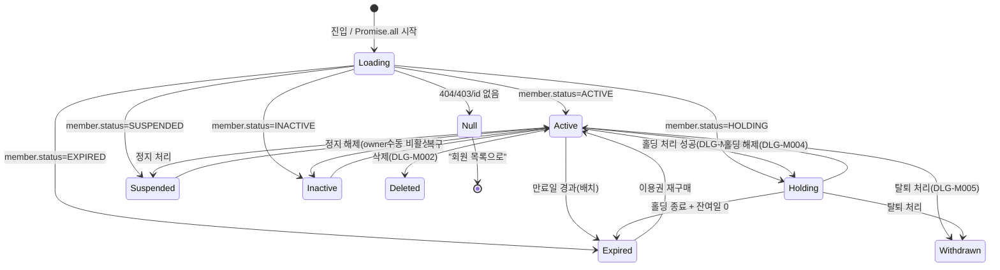

# SCR-M004 회원 상세 — 기본화면 (마스터)

> 이 문서는 **화면 마스터 스펙**입니다. `01~07` 상태 문서는 이 문서를 상속(override/delta)합니다.
> 🚨 **회원 상태별 뷰가 완전히 다른 핵심 화면**: `ACTIVE/HOLDING/EXPIRED/SUSPENDED/INACTIVE/null` 6가지 + `로딩` = 총 7상태. 상태별 배지/배너/액션/탭 가시성이 달라진다. 섹션 §5·§8에서 완전 명세한다.
> 멀티테넌트: `branchId` 컨텍스트 강제 — 본인 지점 회원만 조회 가능(super/primary는 전 지점).

---

## 0. 메타 & 원천 참조

| 항목 | 값 |
|------|----|
| 화면 ID | SCR-M004 |
| 화면명 | 회원 상세 |
| 도메인 | D02-회원관리 |
| 경로 | `/members/detail?id={memberId}&tab={tabKey}` |
| Next.js Route Group | `(app)/members/detail` |
| 파일 경로 | `src/app/members/detail/page.tsx` |
| 페이지 컴포넌트 | `MemberDetail` |
| pageId | 985 |
| 역할 | `superAdmin`, `primary`, `owner`, `manager`, `fc`, `staff`(`trainer`/`front`/`readonly` 제외) |
| 우선순위 | P0 |
| 플랫폼 | 데스크톱(우선) / 태블릿 / 모바일 |
| 탭 수 | **15개** (회원정보/이용권/출석이력/결제이력/결제내역/예약내역/상세내역/체성분/상담메모/레슨/신체정보/종합평가/상담이력/운동프로그램/운동이력) |
| 멀티테넌트 | ✅ `branchId` 서버 스코프 강제 |

### 원천 문서 링크
| 문서 | 경로 | 섹션 |
|---|---|---|
| 화면설계서 | `docs/화면설계서/회원관리.md` | §SCR-M004 회원 상세 (L587~756), §SCR-M004-01~15 탭 상세 |
| 기능명세서 | `docs/기능명세서/회원관리.md` | §3 회원 상세(L529~2115) |
| 상태전이도 | `docs/상태전이도.md` | §1 회원 상태 (ACTIVE/HOLDING/EXPIRED/SUSPENDED/INACTIVE/WITHDRAWN/DORMANT/TRANSFERRED) |
| 에러코드정의서 | `docs/에러코드정의서.md` | §4.2 회원 관리 E400100~E422101, E404100 |
| 권한 매트릭스 | `docs/다이어그램/10_권한매트릭스/R1_역할화면_매트릭스.md` | `/members/detail` |
| 다이어그램 F1 진입 | `docs/다이어그램/D02_회원관리/SCR-M004_회원상세/F1_진입.md` | memberId 유효성 검사 → 데이터 로드 |
| 다이어그램 F2 메인 | `docs/다이어그램/D02_회원관리/SCR-M004_회원상세/F2_메인.md` | Promise.all 6테이블 병렬 조회 |
| 다이어그램 F3 버튼액션 | `docs/다이어그램/D02_회원관리/SCR-M004_회원상세/F3_버튼액션.md` | 9개 액션 버튼 매핑 |
| 다이어그램 F5 모달트리거 | `docs/다이어그램/D02_회원관리/SCR-M004_회원상세/F5_모달트리거.md` | DLG-M002/M003/M004/M005/M022 |
| 다이어그램 F6 상태별 | `docs/다이어그램/D02_회원관리/SCR-M004_회원상세/F6_상태별.md` | **회원 상태별 뷰 핵심** |
| 다이어그램 F7 권한 | `docs/다이어그램/D02_회원관리/SCR-M004_회원상세/F7_권한.md` | 8역할 매트릭스 |
| 다이어그램 F8 에러 | `docs/다이어그램/D02_회원관리/SCR-M004_회원상세/F8_에러.md` | E404100, E422101 등 |
| 다이어그램 F9 토스트 | `docs/다이어그램/D02_회원관리/SCR-M004_회원상세/F9_토스트.md` | 6개 토스트 |
| 탭별 상세 | `docs/다이어그램/D02_회원관리/SCR-M004_회원상세/Tab01~Tab15/*` | 15개 탭 완전 명세 |

---

## 1. 화면 목적 (Why)

개별 회원의 전체 정보를 15개 탭으로 분류하여 **조회·관리**하는 회원관리 도메인의 중심 화면.
- 프로필 헤더 + 만료 알림 배너가 Sticky로 고정, 모든 탭 전환 중에도 회원 기본 정보·액션 버튼에 즉시 접근 가능.
- **회원 상태(ACTIVE/HOLDING/EXPIRED/SUSPENDED/INACTIVE)에 따라 UI·가능 액션·배너·배지가 완전히 달라짐**.
- 회원의 전 라이프사이클(등록→이용→만료/홀딩/정지/탈퇴/이관)을 단일 페이지에서 관리.
- 멀티테넌트: URL `?id=`로 전달된 memberId가 요청자의 `branchId` 범위 밖이면 서버에서 403 → `/forbidden`.

---

## 2. 화면 레이아웃 (Wireframe)

### 2.1 풀뷰 와이어프레임 (데스크톱 1440px, ACTIVE 기준)

```
┌──────────────────────────────────────────────────────────────────────────┐
│ AppLayout                                                                │
│ ┌──Sidebar──┐┌──MainContent (padding 24px)────────────────────────────┐ │
│ │           ││ Breadcrumb: [회원 목록] / 김민준 회원 상세              │ │
│ │ 회원관리   ││                                                         │ │
│ │ ▸ 목록    ││ ┌─ (Sticky top-16) 만료 알림 배너 (D-≤30일) ────────┐ │ │
│ │ ▸ 등록    ││ │ 🔴/🟠 "회원권이 D-{n} 만료 예정입니다."             │ │ │
│ │           ││ └─────────────────────────────────────────────────────┘ │ │
│ │           ││ ┌─ CompactProfile (Sticky top-20) ────────────────────┐ │ │
│ │           ││ │ [img 52x52] [★] 김민준 🥇골드 ● 정상이용중 D-45     │ │ │
│ │           ││ │ 남·010-1234-5678·test@email.com                     │ │ │
│ │           ││ │ 미수금:0원 | 마일리지:500P | 계약:2건 | 락커:A1     │ │ │
│ │           ││ │ [수동출석][수정][상품구매][메시지][지점이관][탈퇴]   │ │ │
│ │           ││ ├─────────────────────────────────────────────────────┤ │ │
│ │           ││ │ TabNav (15탭, scrollable):                           │ │ │
│ │           ││ │ 회원정보│이용권(2)│출석이력│결제이력│결제내역│         │ │ │
│ │           ││ │ 예약내역│상세내역│체성분│상담메모│레슨│신체정보│       │ │ │
│ │           ││ │ 종합평가│상담이력│운동프로그램│운동이력                │ │ │
│ │           ││ └─────────────────────────────────────────────────────┘ │ │
│ │           ││ ┌─ 탭 콘텐츠 (min-h:500px) ──────────────────────────┐ │ │
│ │           ││ │ (선택된 탭 컴포넌트 렌더)                            │ │ │
│ │           ││ └─────────────────────────────────────────────────────┘ │ │
│ │           ││ ┌─ 회원 상태 관리 ────────────────────────────────────┐ │ │
│ │           ││ │ (ACTIVE) [⏸ 홀딩 처리]                              │ │ │
│ │           ││ │ (HOLDING) [▶ 홀딩 해제]  📅 해제 예정: 2026-05-10   │ │ │
│ │           ││ └─────────────────────────────────────────────────────┘ │ │
│ │           ││ (canDelete일 때만)                                       │ │
│ │           ││ ┌─ 위험 구역 (bg-red-50 border-red-200) ──────────────┐ │ │
│ │           ││ │ ⚠ "이 작업은 되돌릴 수 없습니다..."                  │ │ │
│ │           ││ │ [🗑 회원 삭제]                                        │ │ │
│ │           ││ └─────────────────────────────────────────────────────┘ │ │
│ └───────────┘└─────────────────────────────────────────────────────────┘ │
└──────────────────────────────────────────────────────────────────────────┘
```

### 2.2 영역별 치수 / 역할 표

| 영역 | 위치 | 치수 | 역할 |
|------|------|------|------|
| AppLayout | 전체 | - | Sidebar + Main |
| Main padding | Main 내부 | `p-6 lg:p-8` | 안쪽 여백 |
| Breadcrumb | Main 최상단 | 40px h | 네비게이션 경로 |
| 만료 알림 배너 | Sticky `top-16` | 100% × 56px h | D-30 이하일 때만 |
| CompactProfile | Sticky `top-20` | 100% × 160px h | 회원 요약 + 액션 |
| 프로필 이미지 | Profile 좌측 | 52x52 rounded-full | 회원 사진 |
| 관심회원 토글 | 이미지 우상단 | 20x20 | ★ 별 |
| 액션 버튼 바 | Profile 하단 | 각 36px h | 6개 액션 버튼 |
| TabNav | Profile 아래 | 100% × 48px h | 15탭 스크롤 |
| 탭 콘텐츠 | TabNav 아래 | 100% × min-500px | 각 탭 컴포넌트 |
| 상태 관리 | 콘텐츠 아래 | 100% × auto | 홀딩/해제 버튼 |
| 위험 구역 | 최하단 | 100% × auto | 삭제 버튼 (canDelete) |

---

## 3. 디자인 토큰

### 3.1 색상 (Tailwind)

| 역할 | 클래스 | 용도 |
|---|---|---|
| bg.page | `bg-gray-50` | 전체 배경 |
| bg.card | `bg-white rounded-xl shadow-sm ring-1 ring-gray-100` | 프로필/콘텐츠 카드 |
| bg.sticky | `bg-white/95 backdrop-blur supports-[backdrop-filter]:bg-white/80` | Sticky 헤더 |
| **status.ACTIVE** | `text-emerald-700 bg-emerald-50 ring-emerald-200` | 정상이용중 배지 |
| **status.HOLDING** | `text-purple-700 bg-purple-50 ring-purple-200` | 홀딩 배지 |
| **status.EXPIRED** | `text-red-700 bg-red-50 ring-red-200` | 만료 배지 |
| **status.SUSPENDED** | `text-orange-700 bg-orange-50 ring-orange-200` | 정지 배지 |
| **status.INACTIVE** | `text-gray-600 bg-gray-100 ring-gray-200` | 비활성 배지 |
| **status.WITHDRAWN** | `text-stone-700 bg-stone-100 ring-stone-200` | 탈퇴 배지 |
| **status.DORMANT** | `text-slate-600 bg-slate-100 ring-slate-200` | 휴면 배지 |
| banner.expiry.danger | `bg-red-50 border border-red-200 text-red-700` | D-0~7 만료 |
| banner.expiry.warn | `bg-orange-50 border border-orange-200 text-orange-700` | D-8~30 만료 |
| banner.reregister | `bg-red-50 border border-red-200` | EXPIRED 재등록 배너 |
| banner.hold | `bg-purple-50 border border-purple-200` | HOLDING 기간 배너 |
| banner.suspend | `bg-orange-50 border border-orange-200` | SUSPENDED 사유 배너 |
| banner.inactive | `bg-gray-100 border border-gray-300` | INACTIVE 읽기 전용 |
| danger.zone | `bg-red-50 border-red-200` | 위험 구역 |
| btn.primary | `bg-blue-600 text-white hover:bg-blue-700` | 주 액션 |
| btn.outline | `border border-gray-300 text-gray-700 hover:bg-gray-50` | 보조 액션 |
| btn.danger | `bg-red-600 text-white hover:bg-red-700` | 삭제/탈퇴 |
| btn.success | `bg-emerald-600 text-white hover:bg-emerald-700` | 수동출석 |
| tab.active | `border-b-2 border-blue-600 text-blue-600` | 활성 탭 |
| tab.inactive | `text-gray-500 hover:text-gray-700 hover:border-gray-300` | 비활성 탭 |
| grade.bronze | `text-amber-800 bg-amber-100` | 브론즈 |
| grade.silver | `text-slate-600 bg-slate-100` | 실버 |
| grade.gold | `text-yellow-700 bg-yellow-100` | 골드 |
| grade.platinum | `text-indigo-600 bg-indigo-100` | 플래티넘 |
| grade.diamond | `text-cyan-700 bg-cyan-100` | 다이아몬드 |
| fav.on | `text-yellow-400 fill-yellow-400` | ★ 활성 |
| fav.off | `text-gray-300` | ★ 비활성 |

### 3.2 타이포그래피

| 토큰 | 스타일 | 용도 |
|---|---|---|
| profile.name | `text-xl font-bold text-gray-900` | 회원명 |
| profile.meta | `text-sm text-gray-600` | 성별·연락처·이메일 |
| profile.stats | `text-xs text-gray-500 font-medium` | 미수금/마일리지/계약 |
| dday | `text-sm font-semibold tabular-nums` | D-{n} |
| badge.label | `text-xs font-medium px-2 py-0.5 rounded-full` | 상태 배지 |
| tab.label | `text-sm font-medium` | 탭 텍스트 |
| tab.count | `text-xs text-gray-400 ml-1` | 탭 카운트 배지 |
| breadcrumb | `text-sm text-gray-500` | 경로 |
| banner.title | `text-sm font-semibold` | 배너 제목 |
| banner.body | `text-sm` | 배너 본문 |

### 3.3 간격 / 반경 / 그림자

| 토큰 | 값 |
|---|---|
| card.radius | `rounded-xl` (12px) |
| section.gap | `space-y-4 lg:space-y-6` |
| profile.padding | `px-5 py-4` |
| profile.btnGap | `gap-2` |
| banner.padding | `px-4 py-3` |
| tab.padding | `px-4 py-3` |

### 3.4 모션 / 포커스

| 토큰 | 값 |
|---|---|
| motion.tab | `transition-colors duration-150` |
| motion.badge | `transition-all duration-150` |
| motion.expand | `transition-[max-height] duration-200 ease-out` |
| focus.ring | `focus:outline-none focus:ring-2 focus:ring-offset-2 focus:ring-blue-500` |
| sticky.shadow | `shadow-[0_1px_2px_rgba(0,0,0,0.04)]` |

---

## 4. 반응형 규칙

| BP | 폭 | 프로필 | 탭 | 액션 |
|---|---|---|---|---|
| Mobile <640 | 100% | 세로 2행: 이미지+정보 / 액션 버튼 wrap | 가로 스크롤(`overflow-x-auto scrollbar-thin`) | 아이콘만(텍스트 hidden) |
| Tablet 640~1024 | 100% | 가로 1행 | 가로 스크롤, 더 많은 탭 노출 | 아이콘+텍스트 |
| Desktop ≥1024 | Sidebar 펼침+Main | 가로 1행, 액션 버튼 우측 정렬 | 15탭 중 11~13개 동시 노출 + `>` 오버플로 | 아이콘+텍스트 |
| XL ≥1440 | max-w-7xl center | 동일 | 15탭 모두 노출 | 동일 |

Sticky: 모바일에서도 프로필+탭 Sticky 유지(`top-0` + 배경 blur). 탭 콘텐츠가 스크롤 대상.

---

## 5. 🔐 역할별(RBAC) 매트릭스

> `●` = 가능, `○` = 읽기만, `—` = 미표시, `✖` = 접근 차단

### 5.1 역할 × 요소 매트릭스

| 요소 | super/primary | owner | manager | fc | staff | trainer | front | readonly |
|---|:--:|:--:|:--:|:--:|:--:|:--:|:--:|:--:|
| **페이지 접근** | ● | ● | ● | ● | ● | ✖ | ✖ | ✖ |
| **타지점 회원 조회** | ● | — | — | — | — | — | — | — |
| **프로필 헤더** | ● | ● | ● | ● | ● | — | — | — |
| **관심회원 ★ 토글** | ● | ● | ● | ● | ● | — | — | — |
| **[수동출석]** | ● | ● | ● | ● | ● | — | — | — |
| **[수정]** (→ SCR-M003) | ● | ● | ● | — | ● | — | — | — |
| **[상품구매]** (→ POS) | ● | ● | ● | ● | ● | — | — | — |
| **[메시지]** | ● | ● | ● | ● | ● | — | — | — |
| **[지점이관]** (→ SCR-M005) | ● | ● | — | — | — | — | — | — |
| **[탈퇴]** (DLG-M005) | ● | ● | ● | — | — | — | — | — |
| **[홀딩 처리]** (DLG-M003) | ● | ● | ● | — | — | — | — | — |
| **[홀딩 해제]** (DLG-M004) | ● | ● | ● | — | — | — | — | — |
| **[정지 해제]** (owner 전용) | ● | ● | — | — | — | — | — | — |
| **회원 삭제 (위험구역)** | ● | ● | — | — | — | — | — | — |
| **탭: 회원정보** | ● | ● | ● | ● | ● | — | — | — |
| **탭: 이용권** | ● | ● | ● | ● | ○ | — | — | — |
| **탭: 출석이력** | ● | ● | ● | ● | ○ | — | — | — |
| **탭: 결제이력** | ● | ● | ● | ○ | ○ | — | — | — |
| **탭: 결제내역** | ● | ● | ● | ○ | — | — | — | — |
| **탭: 예약내역** | ● | ● | ● | ● | ○ | — | — | — |
| **탭: 상세내역** | ● | ● | ● | ● | — | — | — | — |
| **탭: 체성분** | ● | ● | ● | ● | ○ | — | — | — |
| **탭: 상담메모** | ● | ● | ● | ● | ○ | — | — | — |
| **탭: 레슨/신체정보/종합평가/상담이력/운동프로그램/운동이력** | ● | ● | ● | ● | ○ | — | — | — |

### 5.2 권한 판별 유틸 (예시)

```ts
type Role = 'superAdmin'|'primary'|'owner'|'manager'|'fc'|'trainer'|'staff'|'front'|'readonly';

export const canAccessMemberDetail = (r: Role) =>
  ['superAdmin','primary','owner','manager','fc','staff'].includes(r);

export const canEditMember = (r: Role) =>
  ['superAdmin','primary','owner','manager','staff'].includes(r);  // fc 제외

export const canTransferMember = (r: Role) =>
  ['superAdmin','primary','owner'].includes(r);

export const canWithdrawMember = (r: Role) =>
  ['superAdmin','primary','owner','manager'].includes(r);

export const canDeleteMember = (r: Role) =>
  ['superAdmin','primary','owner'].includes(r);

export const canHoldMember = (r: Role) =>
  ['superAdmin','primary','owner','manager'].includes(r);

export const canUnsuspend = (r: Role) =>
  ['superAdmin','primary','owner'].includes(r); // manager 제외
```

### 5.3 멀티테넌트 강제

1. URL `?id=42` → 서버에서 `members.branchId` 조회 → `jwt.branchId`와 불일치 + 비-superAdmin이면 **403** → `/forbidden`
2. super/primary만 타지점 회원 조회 가능 (감사로그 남김)
3. 모든 sub-쿼리(sale/attendance/bodyComposition/locker/contract)는 `memberId` 제약 → 간접적으로 branchId 스코프 보장

---

## 6. 컴포넌트 트리

```
<AppLayout role={user.role}>
  <main className="p-6 lg:p-8 space-y-4">

    <Breadcrumb items={[{ href:'/members', label:'회원 목록' }, { label: `${member.name} 회원 상세` }]} />

    {/* 만료 알림 배너 - Sticky (D-30 이하) */}
    {shouldShowExpiryBanner(member) && (
      <ExpiryAlertBanner dday={member.dday} severity={member.dday <= 7 ? 'danger' : 'warn'} />
    )}

    {/* 프로필 헤더 + 탭네비 - Sticky top-16 */}
    <section className="sticky top-16 z-20 bg-white/95 backdrop-blur rounded-xl ring-1 ring-gray-100 shadow-sm">
      <CompactProfile
        member={member}
        stats={{ unpaid, mileage, contractCount: contracts.length, lockerNumber: locker?.lockerNumber }}
        favorite={isFavorite(member.id)}
        onToggleFavorite={toggleFavorite}
        actions={<ProfileActionBar
          status={member.status}
          canEdit={canEditMember(role)}
          canTransfer={canTransferMember(role)}
          canWithdraw={canWithdrawMember(role)}
          onManualAttendance={openAttendanceDialog}
          onEdit={() => moveToPage('/members/edit', { id: memberId })}
          onBuy={() => moveToPage('/pos', { memberId })}
          onMessage={() => moveToPage('/messages', { memberId })}
          onTransfer={() => moveToPage('/members/transfer', { memberId })}
          onWithdraw={openWithdrawDialog}
        />}
      />
      <TabNav
        tabs={TABS}
        activeKey={activeTab}
        onChange={setTab}
        scopeForRole={role}  // 역할별 탭 가시성
      />
    </section>

    {/* 상태별 서브 배너 (ACTIVE 제외) */}
    {member.status === 'HOLDING'   && <HoldingStatusBanner endDate={member.holdEndAt} reason={member.holdReason} />}
    {member.status === 'EXPIRED'   && <ExpiredReregisterBanner expiredAt={member.membershipExpiry} />}
    {member.status === 'SUSPENDED' && <SuspendedBanner reason={member.suspendReason} suspendedAt={member.suspendedAt} canUnsuspend={canUnsuspend(role)} />}
    {member.status === 'INACTIVE'  && <InactiveReadOnlyBanner onRecover={canEditMember(role) ? recoverMember : undefined} />}
    {member.status === 'WITHDRAWN' && <WithdrawnMaskedBanner withdrawnAt={member.withdrawnAt} />}
    {member.status === 'DORMANT'   && <DormantBanner lastVisitAt={member.lastVisitAt} />}

    {/* 탭 콘텐츠 */}
    <section className="min-h-[500px]">
      {activeTab === 'info'             && <TabInfo              member={member} />}
      {activeTab === 'tickets'          && <TabTickets           contracts={contracts} member={member} />}
      {activeTab === 'attendance'       && <TabAttendance        attendances={attendances} />}
      {activeTab === 'payment'          && <TabPayment           sales={sales} />}
      {activeTab === 'payment_detail'   && <TabPaymentDetail     sales={sales} />}
      {activeTab === 'reservation'      && <TabReservation       memberId={memberId} />}
      {activeTab === 'detail_history'   && <TabDetailHistory     memberId={memberId} />}
      {activeTab === 'body'             && <TabBody              bodyRecords={bodyRecords} />}
      {activeTab === 'memo'             && <TabMemo              memberId={memberId} />}
      {activeTab === 'lesson'           && <TabLesson            memberId={memberId} />}
      {activeTab === 'bodyInfo'         && <TabBodyInfo          memberId={memberId} />}
      {activeTab === 'evaluation'       && <TabEvaluation        memberId={memberId} />}
      {activeTab === 'consultation'     && <TabConsultation      memberId={memberId} />}
      {activeTab === 'exerciseProgram'  && <TabExerciseProgram   memberId={memberId} />}
      {activeTab === 'exerciseLog'      && <TabExerciseLog       memberId={memberId} />}
    </section>

    {/* 회원 상태 관리 (ACTIVE/HOLDING만 기본 노출, SUSPENDED은 권한자에게) */}
    {showStatusManagement(member.status, role) && (
      <section className="bg-white rounded-xl ring-1 ring-gray-100 p-5">
        <h3 className="text-sm font-semibold text-gray-900 mb-3">회원 상태 관리</h3>
        {member.status === 'ACTIVE'   && canHoldMember(role)   && <Button onClick={openHoldDialog}>⏸ 홀딩 처리</Button>}
        {member.status === 'HOLDING'  && canHoldMember(role)   && <Button onClick={openUnholdDialog}>▶ 홀딩 해제</Button>}
        {member.status === 'SUSPENDED'&& canUnsuspend(role)    && <Button variant="danger" onClick={openUnsuspendDialog}>정지 해제</Button>}
      </section>
    )}

    {/* 위험 구역: 회원 삭제 */}
    {canDeleteMember(role) && (
      <section className="bg-red-50 border border-red-200 rounded-xl p-5">
        <h3 className="text-sm font-semibold text-red-700 mb-1">위험 구역</h3>
        <p className="text-sm text-red-600 mb-3">이 작업은 되돌릴 수 없습니다. 회원의 모든 데이터가 영구 삭제됩니다.</p>
        <Button variant="danger" onClick={openDeleteDialog}><Trash2 className="w-4 h-4"/> 회원 삭제</Button>
      </section>
    )}

    {/* 다이얼로그 (포털) */}
    <ManualAttendanceDialog   open={dlg==='att'} onClose={closeDlg} memberId={memberId} />  {/* DLG-M022 */}
    <HoldRegisterDialog       open={dlg==='hold'} onClose={closeDlg} memberId={memberId} /> {/* DLG-M003 */}
    <HoldReleaseDialog        open={dlg==='unhold'} onClose={closeDlg} memberId={memberId} /> {/* DLG-M004 */}
    <WithdrawDialog           open={dlg==='withdraw'} onClose={closeDlg} memberId={memberId} /> {/* DLG-M005 */}
    <DeleteConfirmDialog      open={dlg==='delete'} onClose={closeDlg} memberId={memberId} /> {/* DLG-M002 */}
  </main>
</AppLayout>
```

### 6.1 핵심 컴포넌트 명세

| 컴포넌트 | 파일 | 핵심 Props |
|---|---|---|
| `CompactProfile` | `src/components/members/CompactProfile.tsx` | `{member, stats, favorite, onToggleFavorite, actions}` |
| `ProfileActionBar` | `src/components/members/ProfileActionBar.tsx` | `{status, canEdit, canTransfer, canWithdraw, on*Handlers}` |
| `StatusBadge` | `src/components/common/StatusBadge.tsx` | `{status: MemberStatus, withDot?:boolean}` |
| `GradeBadge` | `src/components/common/GradeBadge.tsx` | `{grade: 'bronze'|'silver'|'gold'|'platinum'|'diamond'}` |
| `DDayBadge` | `src/components/common/DDayBadge.tsx` | `{days: number, label?: string}` |
| `ExpiryAlertBanner` | `src/components/members/ExpiryAlertBanner.tsx` | `{dday, severity}` |
| `HoldingStatusBanner` | `src/components/members/HoldingStatusBanner.tsx` | `{endDate, reason}` |
| `ExpiredReregisterBanner` | `src/components/members/ExpiredReregisterBanner.tsx` | `{expiredAt}` |
| `SuspendedBanner` | `src/components/members/SuspendedBanner.tsx` | `{reason, suspendedAt, canUnsuspend}` |
| `InactiveReadOnlyBanner` | `src/components/members/InactiveReadOnlyBanner.tsx` | `{onRecover?}` |
| `TabNav` | `src/components/members/TabNav.tsx` | `{tabs, activeKey, onChange, scopeForRole}` |
| `TabInfo~TabExerciseLog` | `src/components/members/tabs/*.tsx` | 탭별 상이 |
| `ManualAttendanceDialog` | `src/components/members/dialogs/ManualAttendanceDialog.tsx` | DLG-M022 |
| `HoldRegisterDialog` | `src/components/members/dialogs/HoldRegisterDialog.tsx` | DLG-M003 |
| `HoldReleaseDialog` | `src/components/members/dialogs/HoldReleaseDialog.tsx` | DLG-M004 |
| `WithdrawDialog` | `src/components/members/dialogs/WithdrawDialog.tsx` | DLG-M005 |
| `DeleteConfirmDialog` | `src/components/members/dialogs/DeleteConfirmDialog.tsx` | DLG-M002 |

---

## 7. 데이터 계약

### 7.1 타입 (TypeScript)

```ts
// src/types/member.ts
export type MemberStatus =
  | 'ACTIVE' | 'INACTIVE' | 'EXPIRED' | 'HOLDING'
  | 'SUSPENDED' | 'WITHDRAWN' | 'DORMANT' | 'TRANSFERRED';

export interface Member {
  id: number;
  branchId: number;
  name: string;
  gender: 'M' | 'F';
  phone: string;
  email?: string | null;
  birthDate?: string | null;
  profileImage?: string | null;
  memberType: '일반' | '기명법인' | '무기명법인';
  memberNumber: number;
  membershipType?: string | null;
  membershipStart?: string | null;
  membershipExpiry?: string | null;
  status: MemberStatus;
  mileage: number;
  adConsent: boolean;
  memo?: string | null;
  registeredAt: string;
  lastVisitAt?: string | null;
  // 상태별 부가 정보
  holdStartAt?: string | null;
  holdEndAt?: string | null;
  holdReason?: string | null;
  suspendedAt?: string | null;
  suspendReason?: string | null;
  withdrawnAt?: string | null;
  withdrawReason?: string | null;
  privacyMaskedAt?: string | null;
  deletedAt?: string | null;
}
export interface Sale { id:number; memberId:number; saleDate:string; amount:number; unpaid:number; status:'COMPLETED'|'PENDING'|'UNPAID'|'REFUNDED'; /* ... */ }
export interface Attendance { id:number; memberId:number; checkInAt:string; /* ... */ }
export interface BodyRecord { id:number; memberId:number; date:string; weight:number; bmi:number; /* ... */ }
export interface Locker { id:number; memberId:number; lockerNumber:string; /* ... */ }
export interface Contract { id:number; memberId:number; createdAt:string; productName:string; status:string; /* ... */ }
```

### 7.2 API 엔드포인트 (병렬 호출)

| # | 엔드포인트 | 메서드 | 파라미터 | 반환 |
|---|---|---|---|---|
| 1 | `GET /members/:id` | GET | `id` | `Member` (branchId 서버 검증) |
| 2 | `GET /sales?memberId=:id` | GET | `memberId`, order `saleDate desc` | `Sale[]` |
| 3 | `GET /attendances?memberId=:id&limit=20` | GET | `memberId`, `limit`, order `checkInAt desc` | `Attendance[]` |
| 4 | `GET /body-composition?memberId=:id` | GET | `memberId`, order `date desc` | `BodyRecord[]` |
| 5 | `GET /lockers?memberId=:id&limit=1` | GET | `memberId` | `Locker\|null` |
| 6 | `GET /contracts?memberId=:id` | GET | `memberId`, order `createdAt desc` | `Contract[]` |

**상태 관리 뮤테이션:**

| 액션 | 엔드포인트 | 페이로드 |
|---|---|---|
| 수동출석 | `POST /attendances` | `{memberId, checkInAt}` |
| 홀딩 시작 | `POST /members/:id/hold` | `{holdDays, holdReason?}` |
| 홀딩 해제 | `POST /members/:id/unhold` | `{reason?}` |
| 정지 해제 | `POST /members/:id/unsuspend` | `{reason?}` |
| 탈퇴 처리 | `POST /members/:id/withdraw` | `{withdrawReason}` |
| 삭제 | `PATCH /members/:id` | `{deletedAt: now(), status:'INACTIVE'}` (soft) |
| 관심회원 토글 | localStorage `branchJson.favorites` + 옵션 동기화 | — |

### 7.3 상태 관리

- **URL 쿼리**: `id`(required), `tab`(default `info`)
- **로컬 state**: `loading`, `member`, `sales`, `attendances`, `bodyRecords`, `locker`, `contracts`, `activeTab`, `dlg`(열린 다이얼로그 키)
- **Store**: `useAuthStore`(role, branchId, user)
- **Fetching**: Promise.all 6개 → React Query로 전환 권장(탭별 필요 시 lazy)
- **Cache**: `staleTime: 30_000`, 탈퇴/삭제/홀딩 성공 시 `invalidate + refetch`
- **관심회원**: `localStorage.getItem('branchJson_'+branchId).favorites: number[]`

---

## 8. 비즈니스 룰

### 8.1 공통 로드/진입

1. URL `?id` 없으면 즉시 `toast.error('잘못된 접근입니다.') + moveToPage('/members')`.
2. `GET /members/:id`가 404/403이면 `03-null-빈화면`으로 이동(return null + 한번만 toast).
3. Promise.all 6개 쿼리 중 회원 본체(1번) 실패 시 전체 null, 서브 쿼리 실패 시 해당 탭만 에러 표시.
4. 회원의 `deletedAt !== null`이면 관리자 예외적 조회(super/primary) 외에는 null 취급.
5. `member.status === 'WITHDRAWN'`이고 `privacyMaskedAt !== null`이면 이름/전화/이메일 `마스킹 표기`(김*민, 010-****-5678, t**@...).

### 8.2 상태별 액션 제어 (핵심)

| status | 수동출석 | 수정 | 상품구매 | 메시지 | 지점이관 | 탈퇴 | 홀딩처리 | 홀딩해제 | 정지해제 | 삭제 |
|---|:--:|:--:|:--:|:--:|:--:|:--:|:--:|:--:|:--:|:--:|
| ACTIVE | ● | ● | ● | ● | ● | ● | ● | — | — | ● |
| HOLDING | ✖* | ● | ● | ● | ●(경고) | ● | — | ● | — | ● |
| EXPIRED | ✖ | ● | ●(권장) | ● | ✖(경고) | ● | — | — | — | ● |
| SUSPENDED | ✖ | ○ | ✖ | ● | ✖ | ● | — | — | ●(권한자) | ● |
| INACTIVE | ✖ | ● | — | ● | — | — | — | — | — | ● |
| WITHDRAWN | — | — | — | — | — | — | — | — | — | ● |
| DORMANT | ● | ● | ● | ● | ● | ● | ● | — | — | ● |

`✖` = 버튼은 노출되나 클릭 시 toast.error(해당 상태에서 불가) 또는 서버 E422101.
`✖*` = 홀딩 중 수동출석은 막지 않는 운영 정책 허용(배지 경고 후 진행).

### 8.3 만료 배너 표시

| D-Day 계산 | 배너 |
|---|---|
| `(expiry - today) <= 7` | 🔴 red 배너 "회원권이 D-{n} 만료 예정입니다." |
| `7 < (expiry - today) <= 30` | 🟠 orange 배너 |
| `today > expiry` (EXPIRED 상태) | 배너 대신 EXPIRED 재등록 배너 |
| `31일 이상` 또는 `null` | 배너 없음 |

### 8.4 홀딩/정지/탈퇴 효과

- 홀딩: `membershipExpiry`가 `holdDays`만큼 자동 연장. 홀딩 종료일 도래 시 자동 `ACTIVE/EXPIRED` 재판정(일 1회 배치).
- 정지: MANAGER 이상이 처리, 해제는 OWNER 이상만.
- 탈퇴: 상태 `WITHDRAWN`, `withdrawnAt`=now, 30일 후 개인정보 마스킹(`privacyMaskedAt` 기록).
- 삭제: 소프트 삭제(`deletedAt`). 회원 목록에서 사라지며 복구는 DB 관리자만.

### 8.5 관심회원 ★

- localStorage `branchJson_{branchId}.favorites: number[]`에 memberId push/pop.
- 회원 상세 진입 시 상태 판정 → ★ 아이콘 on/off.
- 대시보드(SCR-090) "관심회원" 위젯과 동일 키 공유.

### 8.6 탭 가시성 스위치

- 기본: 15탭 전부 렌더 (`scopeForRole`로 hidden 처리).
- 레슨 탭(`lesson`)은 localStorage 기반이라 데이터 없어도 항상 정상 표시.
- URL `?tab=memo` 직접 접근 시 권한 없으면 → `tab=info` 강제 + toast.

### 8.7 감사 로그

- 진입: `AUDIT.MEMBER_VIEW(memberId)`
- 수정 버튼 클릭: `AUDIT.MEMBER_EDIT_INTENT`
- 탈퇴/삭제/홀딩/해제: 각각 전용 audit event

---

## 9. 상태 목록

| 파일 | 상태 코드 | 한글 | 트리거 |
|---|---|---|---|
| `01-로딩중.md` | `member-loading` | 로딩 중 (스켈레톤) | 진입 직후 Promise.all pending |
| `02-ACTIVE-정상이용중.md` | `member-active` | ACTIVE 정상 이용 | 유효 이용권 보유 |
| `03-HOLDING-홀딩중.md` | `member-holding` | HOLDING 기간정지 | 홀딩 시작 완료 |
| `04-EXPIRED-만료.md` | `member-expired` | EXPIRED 만료 | 만료일 경과 |
| `05-SUSPENDED-정지.md` | `member-suspended` | SUSPENDED 이용정지 | 관리자 징계 처리 |
| `06-INACTIVE-비활성.md` | `member-inactive` | INACTIVE 비활성 | 관리자 수동 비활성화 |
| `07-null-빈화면.md` | `member-null` | null 회원 없음 | id 없음/404/403/삭제됨 |

상태 전이 그래프: `docs/상태전이도.md §1` + `docs/다이어그램/D02_회원관리/SCR-M004_회원상세/F6_상태별.md`.

---

## 10. 에러 코드 매핑

| errorCode | HTTP | 사용자 메시지 | 추가 액션 |
|---|---|---|---|
| E404100 | 404 | 회원을 찾을 수 없습니다 | `07-null-빈화면` 전환 + "회원 목록으로" 버튼 |
| E422101 | 422 | 탈퇴한 회원에 대해서는 해당 작업을 수행할 수 없습니다 | 버튼 비활성화 + toast |
| E409101 | 409 | 현재 상태에서는 해당 작업을 수행할 수 없습니다 | toast.error + 상태 재조회 |
| E422100 | 422 | 기간정지 가능 횟수를 초과했습니다 | 홀딩 다이얼로그에서 에러 표시 |
| 403 | 403 | 접근 권한이 없습니다 | `/forbidden` 리다이렉트 |
| 401 | 401 | 세션 만료 | `/login?redirect=<원 경로>` |
| E500001 | 500 | 서버 내부 오류 | 재시도 버튼 |
| NETWORK | — | 네트워크 연결을 확인해주세요 | 재시도 버튼 |

---

## 11. 접근성 (WCAG 2.1 AA)

| 항목 | 요구사항 |
|---|---|
| 대비비율 | 본문 4.5:1, 배지 4.5:1 이상 |
| 탭 내비게이션 | `role="tablist"` + 각 `role="tab"` `aria-selected`, `aria-controls` |
| 탭 패널 | `role="tabpanel"` + `aria-labelledby` |
| Sticky 헤더 | 포커스 이동 시 스크롤 offset 보정(`scroll-margin-top`) |
| 상태 배지 | `aria-label="회원 상태: 정상이용중"` 등 |
| 만료 배너 | `role="alert" aria-live="polite"` (danger), warn은 `aria-live="off"` |
| 관심회원 토글 | `aria-pressed`, `aria-label="관심회원 추가"/"관심회원 해제"` |
| 키보드 단축키 | `Ctrl+1~9` 탭 전환(브라우저 충돌 회피: `⌥+1~9` 대체 옵션) |
| 다이얼로그 | focus trap + `aria-modal="true"` + ESC 닫기 |
| 스크린리더 | 상태 변경 시 `aria-live` 영역에 "회원 상태가 홀딩으로 변경되었습니다" 공지 |
| 감소 모션 | `prefers-reduced-motion`: 탭 전환 애니메이션 제거 |

---

## 12. 진입/이탈 연결

### 진입

| 출처 | 경로 |
|---|---|
| SCR-M001 회원목록 회원명 클릭 | `/members/detail?id={id}` |
| 대시보드 위젯(생일자/홀딩/만료예정/미수금) | `/members/detail?id={id}` |
| URL 직접 | `/members/detail?id={id}&tab={tab}` |
| 알림 클릭(만료임박/홀딩종료) | `/members/detail?id={id}` |

### 이탈

| 액션 | 목적지 |
|---|---|
| [수정] | `/members/edit?id={id}` (SCR-M003) |
| [상품구매] | POS `/pos?memberId={id}` |
| [메시지] | `/messages?memberId={id}` |
| [지점이관] | `/members/transfer?memberId={id}` (SCR-M005) |
| [탈퇴 성공] | `/members` |
| [삭제 성공] | `/members` |
| [회원 없음 → "목록으로"] | `/members` |
| Breadcrumb "회원 목록" | `/members` |
| 탭 전환 | URL `?tab=` 갱신(같은 페이지) |

---

## 13. 다이어그램 통합 뷰



---

## 14. 🧩 바이브코딩 프롬프트 (마스터)

```
Next.js 15 App Router + TypeScript + Tailwind + Supabase + React Query + react-hook-form 기반
'use client' 컴포넌트를 작성하라.

━━ 화면: SCR-M004 회원 상세 (15탭, 회원 상태별 뷰) ━━
파일: src/app/members/detail/page.tsx
보조:
- src/components/members/CompactProfile.tsx
- src/components/members/ProfileActionBar.tsx
- src/components/members/TabNav.tsx
- src/components/members/tabs/{TabInfo,TabTickets,TabAttendance,TabPayment,TabPaymentDetail,TabReservation,TabDetailHistory,TabBody,TabMemo,TabLesson,TabBodyInfo,TabEvaluation,TabConsultation,TabExerciseProgram,TabExerciseLog}.tsx
- src/components/members/{ExpiryAlertBanner,HoldingStatusBanner,ExpiredReregisterBanner,SuspendedBanner,InactiveReadOnlyBanner,WithdrawnMaskedBanner,DormantBanner}.tsx
- src/components/members/dialogs/{ManualAttendanceDialog,HoldRegisterDialog,HoldReleaseDialog,WithdrawDialog,DeleteConfirmDialog,UnsuspendDialog}.tsx
- src/lib/member-access.ts (canEditMember/canTransferMember/canWithdrawMember/canDeleteMember/canHoldMember/canUnsuspend)
- src/hooks/useMemberDetail.ts (Promise.all 6쿼리)

━━ 상태별 뷰 핵심 ━━
member.status 에 따라 배너/버튼/액션이 완전히 달라진다:
- ACTIVE: 배너 없음, 모든 액션 가능, 홀딩처리 버튼 노출
- HOLDING: 보라 배너(홀딩 기간 표시), 홀딩해제 버튼 노출, 수동출석 경고 토스트
- EXPIRED: 빨간 배너 '재등록 유도' + [재등록] CTA, 상품구매 권장, 수동출석/이관 차단
- SUSPENDED: 주황 배너 '정지 사유', 대부분 액션 차단, owner+는 정지해제 버튼
- INACTIVE: 회색 배너 '읽기 전용', 모든 액션 차단, [복구] 버튼(권한자)
- null: 빈 화면 return null + '회원 목록으로' 버튼

━━ 레이아웃 ━━
<AppLayout role={user.role}>
  <main className="p-6 lg:p-8 space-y-4 max-w-7xl mx-auto">
    <Breadcrumb items={[{href:'/members',label:'회원 목록'},{label:`${member.name} 회원 상세`}]} />

    {shouldShowExpiryBanner(member) && <ExpiryAlertBanner dday={dday} severity={dday<=7?'danger':'warn'} />}

    <section className="sticky top-16 z-20 bg-white/95 backdrop-blur rounded-xl ring-1 ring-gray-100 shadow-sm">
      <CompactProfile
        member={member}
        stats={{unpaid, mileage: member.mileage, contractCount: contracts.length, lockerNumber: locker?.lockerNumber}}
        favorite={isFavorite(member.id)}
        onToggleFavorite={toggleFavorite}
        actions={
          <ProfileActionBar
            status={member.status}
            canEdit={canEditMember(role)}
            canTransfer={canTransferMember(role)}
            canWithdraw={canWithdrawMember(role)}
            onManualAttendance={openAttendanceDialog}
            onEdit={() => moveToPage('/members/edit',{id:memberId})}
            onBuy={() => moveToPage('/pos',{memberId})}
            onMessage={() => moveToPage('/messages',{memberId})}
            onTransfer={() => moveToPage('/members/transfer',{memberId})}
            onWithdraw={openWithdrawDialog}
          />
        }
      />
      <TabNav tabs={TABS} activeKey={activeTab} onChange={setTab} scopeForRole={role} />
    </section>

    {/* 상태별 서브 배너 */}
    {member.status==='HOLDING'   && <HoldingStatusBanner endDate={member.holdEndAt} reason={member.holdReason} />}
    {member.status==='EXPIRED'   && <ExpiredReregisterBanner expiredAt={member.membershipExpiry} />}
    {member.status==='SUSPENDED' && <SuspendedBanner reason={member.suspendReason} suspendedAt={member.suspendedAt} canUnsuspend={canUnsuspend(role)} />}
    {member.status==='INACTIVE'  && <InactiveReadOnlyBanner onRecover={canEditMember(role)?recoverMember:undefined} />}

    <section className="min-h-[500px]">
      {/* 활성 탭 렌더 (switch) */}
    </section>

    {showStatusManagement(member.status, role) && (
      <section className="bg-white rounded-xl ring-1 ring-gray-100 p-5">
        <h3 className="text-sm font-semibold text-gray-900 mb-3">회원 상태 관리</h3>
        {member.status==='ACTIVE'    && canHoldMember(role) && <Button onClick={openHoldDialog}>⏸ 홀딩 처리</Button>}
        {member.status==='HOLDING'   && canHoldMember(role) && <Button onClick={openUnholdDialog}>▶ 홀딩 해제</Button>}
        {member.status==='SUSPENDED' && canUnsuspend(role)  && <Button variant="danger" onClick={openUnsuspendDialog}>정지 해제</Button>}
      </section>
    )}

    {canDeleteMember(role) && (
      <section className="bg-red-50 border border-red-200 rounded-xl p-5">
        <h3 className="text-sm font-semibold text-red-700 mb-1">위험 구역</h3>
        <p className="text-sm text-red-600 mb-3">이 작업은 되돌릴 수 없습니다.</p>
        <Button variant="danger" onClick={openDeleteDialog}>회원 삭제</Button>
      </section>
    )}
  </main>
</AppLayout>

━━ 디자인 토큰 (정확히 적용) ━━
bg.page: bg-gray-50
card: bg-white rounded-xl shadow-sm ring-1 ring-gray-100
sticky: bg-white/95 backdrop-blur supports-[backdrop-filter]:bg-white/80
status.ACTIVE:   text-emerald-700 bg-emerald-50 ring-1 ring-emerald-200
status.HOLDING:  text-purple-700  bg-purple-50  ring-1 ring-purple-200
status.EXPIRED:  text-red-700     bg-red-50     ring-1 ring-red-200
status.SUSPENDED:text-orange-700  bg-orange-50  ring-1 ring-orange-200
status.INACTIVE: text-gray-600    bg-gray-100   ring-1 ring-gray-200
banner.expiry.danger: bg-red-50 border border-red-200 text-red-700
banner.expiry.warn:   bg-orange-50 border border-orange-200 text-orange-700
banner.hold:     bg-purple-50 border border-purple-200 text-purple-800
banner.reregister: bg-red-50 border border-red-200 text-red-800
banner.suspend:  bg-orange-50 border border-orange-200 text-orange-800
banner.inactive: bg-gray-100 border border-gray-300 text-gray-700
danger.zone:     bg-red-50 border border-red-200
tab.active:   border-b-2 border-blue-600 text-blue-600
tab.inactive: text-gray-500 hover:text-gray-700 hover:border-gray-300

━━ 데이터 훅 useMemberDetail(memberId) ━━
const res = await Promise.all([
  supabase.from('members').select('*').eq('id', memberId).is('deletedAt', null).single(),
  supabase.from('sale').select('*').eq('memberId', memberId).order('saleDate', {ascending:false}),
  supabase.from('attendance').select('*').eq('memberId', memberId).order('checkInAt', {ascending:false}).limit(20),
  supabase.from('bodyComposition').select('*').eq('memberId', memberId).order('date', {ascending:false}),
  supabase.from('locker').select('*').eq('memberId', memberId).limit(1),
  supabase.from('contract').select('*').eq('memberId', memberId).order('createdAt', {ascending:false}),
])
// 1번(members) 실패 → null 상태 전환 + toast
// 2~6번 실패 → 각 탭에 독립 에러 표시 (error boundary)

━━ 인터랙션 ━━
- 만료 배너(D≤7): role="alert" aria-live="polite"
- 탭 클릭 → setTab + URL ?tab= replace
- 키보드: Ctrl+1~9 또는 ⌥+1~9 탭 전환
- 관심회원 ★ 토글: localStorage branchJson_{branchId}.favorites 배열 푸시/팝
- 액션 버튼: 상태별 차단 규칙 적용, 차단 시 toast.error (§8.2)
- 다이얼로그 오픈/클로즈: URL 변경 없음 (useState)
- 다이얼로그 성공 시: useMemberDetail refetch + 상태 배너 재렌더

━━ 상태별 추가 배너(필수) ━━
ACTIVE:   없음
HOLDING:  <HoldingStatusBanner>  📅 홀딩 중: 2026-05-10까지 • 사유: 부상
EXPIRED:  <ExpiredReregisterBanner> 📛 회원권이 만료되었습니다. <Button>재등록 진행</Button>
SUSPENDED:<SuspendedBanner> ⛔ 이용 정지 • 사유: {reason} • {canUnsuspend && <Button>정지 해제</Button>}
INACTIVE: <InactiveReadOnlyBanner> 💤 이 회원은 비활성 상태입니다. <Button>복구</Button>
null:     return <EmptyState icon={<UserX/>} title="회원을 찾을 수 없습니다" action={<Button onClick={()=>moveToPage('/members')}>회원 목록으로</Button>} />

━━ 접근성 ━━
- <main role="main">
- CompactProfile: role="region" aria-label="회원 요약"
- TabNav: role="tablist", 각 탭 role="tab" aria-selected aria-controls
- 탭 패널: role="tabpanel" aria-labelledby
- 상태 배지: aria-label="회원 상태: 정상이용중"
- 배너: danger는 role="alert", warn은 role="status"
- 위험구역: aria-label="위험 구역" + 버튼에 추가 설명
- 다이얼로그: focus trap, aria-modal, Esc 닫기

━━ 반응형 ━━
모바일: 프로필 세로 스택, 액션 버튼 2×3 그리드, 탭 가로 스크롤
태블릿: 프로필 가로, 탭 8~10개 노출 나머지 오버플로
데스크톱(≥1024): 15탭 노출, Sticky 동작, max-w-7xl 중앙정렬

━━ 유틸 / 의존 ━━
import { useForm } from 'react-hook-form'
import { zodResolver } from '@hookform/resolvers/zod'
import { useAuthStore } from '@/stores/authStore'
import { supabase } from '@/lib/supabase'
import { moveToPage } from '@/internal'
import { canEditMember, canTransferMember, canWithdrawMember, canDeleteMember, canHoldMember, canUnsuspend } from '@/lib/member-access'
import { Star, StarOff, CheckCircle2, Edit, ShoppingBag, MessageSquare, ArrowRightLeft, UserMinus, Pause, Play, Trash2, AlertCircle, Loader2, UserX } from 'lucide-react'
import Link from 'next/link'

━━ QA 체크 ━━
- id 없거나 404 → null 빈 화면(EmptyState) + 목록 이동
- ACTIVE: 홀딩 처리 버튼 노출, 해제 버튼 미노출
- HOLDING: 해제 버튼 노출 + 보라 배너 + 만료일 연장 확인
- EXPIRED: 재등록 배너 + 상품구매 강조 + 수동출석 차단 토스트
- SUSPENDED: 정지 사유 배너 + owner+만 [정지 해제] 노출 + 상품구매 차단
- INACTIVE: 읽기 전용 배너 + 복구 버튼(권한자)
- WITHDRAWN: 개인정보 마스킹 표시(30일 경과 시)
- 관심회원 토글 즉시 반영 + localStorage 반영
- 멀티테넌트: 타지점 id 조작 → /forbidden
- 키보드: Tab 흐름 / Ctrl+숫자 탭 전환
```

---

## 15. QA 체크리스트 (수용 기준)

- [ ] `?id` 없이 접근 시 `/members` 리다이렉트 + 경고 toast
- [ ] 404/403 응답 시 `07-null-빈화면` 전환 + 목록 복귀 버튼
- [ ] ACTIVE: 홀딩 처리 버튼 노출, 홀딩 해제 비노출
- [ ] HOLDING: 보라 배너 + 홀딩 종료 예정일 노출 + 해제 버튼
- [ ] HOLDING: 수동출석 시도 → 경고 toast + 진행 허용(운영 정책)
- [ ] EXPIRED: 빨간 재등록 배너 + 상품구매 CTA 강조
- [ ] EXPIRED: 수동출석/지점이관 시도 → toast.error(차단)
- [ ] SUSPENDED: 주황 배너 + 사유 노출
- [ ] SUSPENDED: owner+만 [정지 해제] 노출, manager는 미노출
- [ ] INACTIVE: 회색 배너 + 모든 수정 액션 disabled + 복구 버튼(권한자)
- [ ] WITHDRAWN: `privacyMaskedAt` 도달 시 개인정보 마스킹(이름/전화/이메일)
- [ ] DORMANT: 휴면 배너 + 재방문 시 자동 복원 (배치)
- [ ] 관심회원 ★ 토글: localStorage branchJson_{branchId}.favorites 반영
- [ ] 탭 전환 시 URL `?tab=` 갱신(뒤로가기로 이전 탭)
- [ ] Ctrl+1~9 탭 전환 동작(브라우저 단축키 충돌 체크)
- [ ] 만료 D-≤7: 빨간 배너, D-8~30: 주황 배너, D-31+: 배너 없음
- [ ] 멀티테넌트: 타지점 memberId URL 조작 → 403 → /forbidden
- [ ] fc 역할: [수정] 버튼 비노출, 수정 탭 클릭 시 경고
- [ ] Promise.all 중 일부 쿼리 실패 시 부분 에러 표시(회원 본체는 정상)
- [ ] DLG-M003 홀딩 처리 성공 → 상태 HOLDING + 만료일 연장 반영
- [ ] DLG-M004 홀딩 해제 성공 → 상태 재판정(ACTIVE/EXPIRED)
- [ ] DLG-M005 탈퇴 처리 성공 → `/members` 복귀 + 토스트
- [ ] DLG-M002 삭제 성공(입력확인 "삭제") → `/members` 복귀
- [ ] 접근성: 탭 role/aria, 배너 aria-live, 포커스 링 가시성
- [ ] `prefers-reduced-motion` 준수(탭 전환 애니 제거)
- [ ] Sticky 프로필/탭: 모바일에서도 정상 고정
