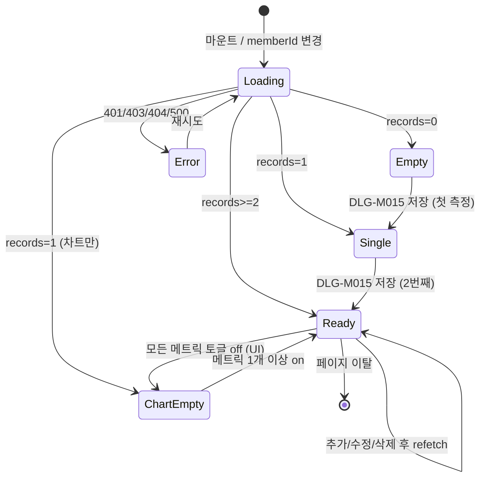

# SCR-M006 체성분 관리 — 기본화면 (마스터)

> 이 문서는 **화면 마스터 스펙**입니다. `01~06` 상태 문서는 이 문서를 상속(override/delta)합니다.
> 상태별 파일은 "변경점(델타)만" 기술하며, 이 문서에 정의된 레이아웃/토큰/컴포넌트/데이터/권한/접근성은 **기본값**으로 적용됩니다.
> 🚨 **데이터 건수 감응형**: 0건/1건/2건+ 케이스에서 StatCard의 `change`, 라인 차트, "비교 대비" 문구 노출 여부가 완전히 달라짐 — §9 상태 목록 참고.

---

## 0. 메타 & 원천 참조

| 항목 | 값 |
|------|----|
| 화면 ID | SCR-M006 |
| 화면명 | 체성분 관리 |
| 도메인 | D02-회원관리 |
| 경로 | `/body-composition?memberId={id}` |
| Next.js Route Group | `(dashboard)` |
| 파일 경로 | `src/app/(dashboard)/body-composition/page.tsx` |
| 페이지 컴포넌트 | `BodyCompositionPage` |
| 역할 | `superAdmin`, `primary`, `owner`, `manager`, `fc` (trainer는 자기 담당 한정 조회 가능, staff/front/readonly 차단) |
| 우선순위 | P0 (회원 상세 타임라인/리텐션 핵심) |
| 플랫폼 | 데스크톱(우선) / 태블릿 / 모바일 |
| 멀티테넌트 | ✅ `branchId` 강제 스코프 (회원 소속 지점 기준) |
| 연계 모듈 | D11 통합운영(IOT 헬스 InBody 자동 수집), SCR-M004 회원 상세 체성분 탭(3.11) |

### 원천 문서 링크
| 문서 | 경로 | 섹션 |
|---|---|---|
| 화면설계서 | `docs/화면설계서/회원관리.md` | §SCR-M006 체성분 관리 (L1778~) |
| 기능명세서 | `docs/기능명세서/회원관리.md` | §5. 체성분 관리 (L2312~) |
| 공통 UI | `docs/화면설계서/공통.md` | §3 공통 UI, §4 다이얼로그 |
| 상태전이도 | `docs/상태전이도.md` | 회원 상태 / 체성분 측정 이벤트 |
| 에러코드 | `docs/에러코드정의서.md` | §4.2 회원 (E4xx100~199), §공통 E40x, E50x |
| KPI 정의서 | `docs/KPI_정의서.md` | 체성분 변화율 / 골격근 증가율 (건강 지표 KPI) |
| 권한 매트릭스 | `docs/다이어그램/10_권한매트릭스/R1_역할화면_매트릭스.md` | `/body-composition` 역할 |
| 다이어그램 F1 진입 | `docs/다이어그램/D02_회원관리/SCR-M006_체성분관리/F1_진입.md` | 사이드바/URL/회원상세 탭 → 권한확인 → 로딩 |
| 다이어그램 F2 메인 | `docs/다이어그램/D02_회원관리/SCR-M006_체성분관리/F2_메인인터랙션.md` | 회원 선택 → 로딩 → 차트/테이블 |
| 다이어그램 F3 버튼액션 | `docs/다이어그램/D02_회원관리/SCR-M006_체성분관리/F3_버튼액션.md` | 측정 추가, 메트릭 토글, 기록 삭제 |
| 다이어그램 F5 모달 | `docs/다이어그램/D02_회원관리/SCR-M006_체성분관리/F5_모달트리거.md` | DLG-M015 체성분 등록, DLG-M016 덮어쓰기 |
| 다이어그램 F6 상태별 | `docs/다이어그램/D02_회원관리/SCR-M006_체성분관리/F6_상태별화면.md` | LOADING/EMPTY/SINGLE/FULL/ERROR/CHART-EMPTY |
| 다이어그램 F7 권한 | `docs/다이어그램/D02_회원관리/SCR-M006_체성분관리/F7_권한분기.md` | staff/readonly 차단 |
| 다이어그램 F8 에러 | `docs/다이어그램/D02_회원관리/SCR-M006_체성분관리/F8_에러예외.md` | 401/403/404/500, 유효범위 오류 |
| 다이어그램 F9 토스트 | `docs/다이어그램/D02_회원관리/SCR-M006_체성분관리/F9_토스트피드백.md` | 저장 성공/실패/덮어쓰기 |

---

## 1. 화면 목적 (Why)

특정 회원의 **체성분(체중 / 골격근량 / 체지방률 / BMI / BMR) 변화 추이**를 시계열 차트와 측정 기록 테이블로 시각화하여, 트레이너/FC/매니저가 회원의 **운동·영양 개선 효과를 판정**하고 재상담/재계약 트리거로 활용한다. InBody 장비 측정값을 수동/자동(D11 IOT 헬스 연동)으로 누적 저장한다.

사용 시나리오:
- 트레이너가 PT 회원의 4주차 InBody 결과 입력 → 체중↓·골격근↑ 확인 → 다음 시즌 계약 제안
- FC가 리텐션 상담 전 회원의 최근 6개월 체지방률 추이 확인
- 센터장이 회원 전체의 체성분 개선 KPI 월별 집계 (→ D11 리포트 연계)

---

## 2. 화면 레이아웃 (Wireframe)

### 2.1 풀뷰 (데스크톱 1440px)

```
┌─────────────────────────────────────────────────────────────────────┐
│ AppLayout (Sidebar + TopBar)                                        │
├─────────────────────────────────────────────────────────────────────┤
│ PageHeader                                                          │
│   ← 뒤로가기  "체성분 관리"                                          │
│   회원 선택: [김민준 ▾] (회원이 미지정이면 프롬프트)                  │
├─────────────────────────────────────────────────────────────────────┤
│ 회원 요약 카드 (Avatar | 이름 | 이용권 | 상태)   [회원 상세 →]       │
├─────────────────────────────────────────────────────────────────────┤
│ TabNav: [측정 기록] [추이 분석]                  [+ 측정 추가]       │
├─────────────────────────────────────────────────────────────────────┤
│ StatCardGrid (4열)                                                  │
│ [현재 체중 75.0kg  ▲0.3kg]  [골격근량 32.5kg  ▲0.8kg]                │
│ [체지방률 18.2%   ▼1.1%p]  [BMI 24.5  변화없음]                      │
├─────────────────────────────────────────────────────────────────────┤
│ LineChart Card                                                      │
│   메트릭 토글 : [체중 ●]  [골격근량 ●]  [체지방률 ●]                  │
│   ┌──────────────── SVG 560×220 ────────────────┐                   │
│   │ PAD_X=48 PAD_Y=28, 격자선 5단계, x축 날짜    │                   │
│   │ 포인트 r=5, 호버 툴팁(#1E293B / opacity .95) │                   │
│   └──────────────────────────────────────────────┘                   │
├─────────────────────────────────────────────────────────────────────┤
│ DataTable "측정 기록" (최신순)                                       │
│ 날짜 | 체중 | 골격근량 | 체지방률 | BMI | BMR | 체수분 | 관리         │
│ 2026-04-18 | 75.0 | 32.5 | 18.2% | 24.5 | 1,720 | 55.3% | ✎ 🗑    │
│ 2026-03-18 | 75.3 | 31.7 | 19.3% | 24.6 | 1,712 | 54.9% | ✎ 🗑    │
│ ...                                                                 │
├─────────────────────────────────────────────────────────────────────┤
│ Footer: "총 N건 측정 기록. 최근 측정일: 2026-04-18"                   │
└─────────────────────────────────────────────────────────────────────┘
```

### 2.2 영역 치수 / 그리드

| 영역 | 그리드 | 치수/패딩 |
|---|---|---|
| PageHeader | `flex items-center justify-between` | `px-6 lg:px-8 pt-6 pb-4` |
| 회원 요약 카드 | `flex items-center gap-4` | `p-4 rounded-xl bg-white ring-1 ring-gray-100` |
| TabNav | `border-b border-gray-200` | `h-12`, 탭 `px-4` |
| StatCardGrid | `grid grid-cols-2 md:grid-cols-4 gap-4` | 카드 `p-5 h-[104px]` |
| LineChart Card | `w-full` | `p-6 rounded-xl bg-white ring-1 ring-gray-100` |
| Chart SVG viewBox | `0 0 560 220` | `chartW=464, chartH=164` |
| DataTable | `w-full overflow-x-auto` | row `h-12` |
| + 측정 추가 버튼 | 탭 우측 고정 | `h-10 px-4 rounded-lg bg-blue-600 text-white` |

---

## 3. 디자인 토큰

### 3.1 색상 (Tailwind)
| 역할 | 클래스 | 용도 |
|---|---|---|
| bg.page | `bg-gray-50` | 페이지 배경 |
| bg.card | `bg-white rounded-xl shadow-sm ring-1 ring-gray-100` | StatCard / 차트 카드 |
| metric.weight | `#FF7F6E` (coral) | 체중 라인/포인트 |
| metric.muscle | `#48D1CC` (mint) | 골격근량 라인/포인트 |
| metric.pbf | `#F59E0B` (amber) | 체지방률 라인/포인트 |
| metric.bmi | `text-gray-700` | BMI 정적 |
| toggle.active | `text-white border-transparent shadow-sm` (+ 해당 metric.color 배경) | 활성 토글 |
| toggle.inactive | `bg-white text-gray-600 border border-gray-200 hover:bg-gray-50` | 비활성 토글 |
| delta.up.muscle | `text-emerald-600` | 골격근 ↑ (긍정) |
| delta.down.weight | `text-emerald-600` | 체중 ↓ (긍정, 다이어트 맥락) |
| delta.down.muscle | `text-rose-600` | 골격근 ↓ (부정) |
| delta.up.pbf | `text-rose-600` | 체지방률 ↑ (부정) |
| delta.neutral | `text-gray-500` | 변화 없음 |
| grid.line | `stroke-gray-200` (0% 라인은 `stroke-gray-300 strokeDasharray=0`) | 격자 |
| tooltip.bg | `fill=#1E293B fillOpacity=0.95` | 호버 툴팁 |
| btn.primary | `bg-blue-600 hover:bg-blue-700 text-white` | 측정 추가 |
| btn.danger | `bg-red-600 hover:bg-red-700 text-white` | 삭제 |
| table.hover | `hover:bg-gray-50` | 행 hover |

### 3.2 타이포그래피
| 토큰 | 클래스 |
|---|---|
| page.title | `text-2xl font-bold tracking-tight text-gray-900` |
| stat.label | `text-xs uppercase tracking-wide font-medium text-gray-500` |
| stat.value | `text-3xl font-bold tabular-nums text-gray-900` |
| stat.unit | `text-base text-gray-500 ml-1` |
| stat.delta | `text-xs font-medium mt-1 inline-flex items-center gap-1` |
| chart.axis | `text-[10px] fill-gray-500` |
| tooltip.text | `text-xs fill-white font-medium` |
| td.mono | `text-sm tabular-nums text-gray-800` |

### 3.3 간격/반경/그림자
| 토큰 | 값 |
|---|---|
| card.radius | `rounded-xl` (12px) |
| card.padding | `p-5` (StatCard), `p-6` (차트) |
| section.gap | `space-y-6` (24px) |
| page.padding | `p-6 lg:p-8` |
| chart.point.r | `5` |
| chart.point.stroke | `stroke=#fff strokeWidth=2` |

### 3.4 모션
- 스켈레톤: `animate-pulse`
- 차트 라인 draw-in: `stroke-dasharray` 애니메이션 800ms ease-out
- 포인트 pop: scale 0.6→1.0 120ms stagger(30ms)
- hover 툴팁 페이드: `opacity 0→1 100ms`
- `prefers-reduced-motion: reduce` 시 애니메이션 전부 제거

---

## 4. 반응형 규칙

| BP | 폭 | StatCard | Chart | Table |
|---|---|---|---|---|
| Mobile <640 | 100% | 2열 | viewBox 유지, `w-full h-52` | 가로 스크롤, 컬럼: 날짜/체중/체지방률/관리 |
| Tablet 640~1024 | 100% | 4열 | `h-56` | 전 컬럼 + 가로 스크롤 허용 |
| Desktop ≥1024 | sidebar+main | 4열 | `h-64` (고정 220 viewBox scale) | 전 컬럼 표시 |
| XL ≥1440 | max `container` | 4열 | `h-72` | 전 컬럼 + 체수분/BMR 노출 |

모바일 TabNav는 sticky bottom 바로 전환 (선택).

---

## 5. 🔐 역할별(RBAC) 매트릭스

> `●` = 사용 가능, `○` = 읽기만, `—` = 미표시/차단
> 원천: 화면설계서 §SCR-M006 §3, 기능명세서 §5.I

### 5.1 역할 × 요소

| 요소 | superAdmin/primary | owner | manager | fc | trainer | staff | front | readonly |
|---|:---:|:---:|:---:|:---:|:---:|:---:|:---:|:---:|
| 페이지 접근 | ● | ● | ● | ● | ●(담당 회원만) | — | — | — |
| 회원 선택 드롭다운 | ● (전 회원) | ● (지점) | ● (지점) | ● (본인 담당 기본) | ● (담당만) | — | — | — |
| StatCard 조회 | ● | ● | ● | ● | ● | — | — | — |
| 라인 차트 | ● | ● | ● | ● | ● | — | — | — |
| 메트릭 토글 | ● | ● | ● | ● | ● | — | — | — |
| 측정 기록 테이블 | ● | ● | ● | ● | ● | — | — | — |
| **+ 측정 추가** (DLG-M015) | ● | ● | ● | ● | ● | — | — | — |
| 측정 기록 **수정** | ● | ● | ● | ● | ●(본인 등록만 24h) | — | — | — |
| 측정 기록 **삭제** | ● | ● | ● | ○(본인 등록 24h) | — | — | — | — |
| InBody 장비 자동 수집(D11) | ● | ● | ● | ○ | ○ | — | — | — |
| CSV 내보내기 | ● | ● | ● | — | — | — | — | — |

### 5.2 데이터 스코프 (멀티테넌트)
- `superAdmin/primary`: 전체 브랜드 → 지점 전환 후 해당 지점 회원
- `owner`: 소속 브랜드 내 지점 전체
- `manager/fc/staff/trainer/front`: 본인 지점 고정 (`branchId = user.branchId` 서버 강제)
- `trainer`: 추가로 `staffId = user.id` 필터 (담당 회원만)
- URL 조작으로 타 지점 memberId 쿼리 시 서버 403 → `/forbidden`

### 5.3 역할 판별 유틸
```ts
const canAccess = (r:Role) => ['superAdmin','primary','owner','manager','fc','trainer'].includes(r);
const canEditRecord = (r:Role, record, user) =>
  ['superAdmin','primary','owner','manager'].includes(r)
  || (r==='fc' && record.createdBy===user.id && within24h(record.createdAt))
  || (r==='trainer' && record.createdBy===user.id && within24h(record.createdAt));
const canDeleteRecord = (r:Role) => ['superAdmin','primary','owner','manager'].includes(r);
const canExportCSV = (r:Role) => ['superAdmin','primary','owner','manager'].includes(r);
```

---

## 6. 컴포넌트 트리

```
<AppLayout role={user.role}>
  <main className="p-6 lg:p-8 space-y-6">
    <PageHeader title="체성분 관리" onBack={() => router.back()}>
      <MemberSelect value={memberId} onChange={setMemberId}
                    branchScope={branchScope(role)} />
    </PageHeader>

    <MemberSummaryCard member={member} onClick={() => moveToPage('/members/detail',{id:memberId})} />

    <TabNav value={tab} onChange={setTab}
            items={[{k:'records',label:'측정 기록'},{k:'trend',label:'추이 분석'}]}>
      {canAdd(role) && <Button onClick={openAddModal}>+ 측정 추가</Button>}
    </TabNav>

    <section aria-label="체성분 현재값"
             className="grid grid-cols-2 md:grid-cols-4 gap-4">
      <StatCard label="현재 체중"   value={latest?.weight}  unit="kg"
                delta={delta('weight')}  variant="weight" />
      <StatCard label="골격근량"    value={latest?.muscle}  unit="kg"
                delta={delta('muscle')}  variant="muscle" />
      <StatCard label="체지방률"    value={latest?.pbf}     unit="%"
                delta={delta('pbf')}     variant="pbf" />
      <StatCard label="BMI"        value={latest?.bmi}     unit=""
                delta={delta('bmi')}     variant="bmi" />
    </section>

    <BodyLineChart records={records}
                   activeMetrics={activeMetrics}
                   onToggleMetric={toggleMetric} />

    <BodyRecordTable rows={records}
                     onEdit={openEditModal}
                     onDelete={confirmDelete}
                     canEdit={canEditRecord(role,/*row*/)}
                     canDelete={canDeleteRecord(role)} />

    {addOpen && <DlgM015BodyCompositionAdd memberId={memberId}
                                           onSubmit={handleSubmit}
                                           onClose={()=>setAddOpen(false)} />}
    {overwriteOpen && <DlgM016OverwriteConfirm date={pendingDate}
                                                onConfirm={handleOverwrite}
                                                onCancel={()=>setOverwriteOpen(false)} />}
  </main>
</AppLayout>
```

### 6.1 핵심 컴포넌트
| 컴포넌트 | 파일 | 핵심 Props |
|---|---|---|
| `BodyCompositionPage` | `src/app/(dashboard)/body-composition/page.tsx` | - |
| `MemberSelect` | `src/components/body/MemberSelect.tsx` | `{value, onChange, branchScope}` |
| `MemberSummaryCard` | `src/components/body/MemberSummaryCard.tsx` | `{member, onClick}` |
| `StatCard` | `src/components/common/StatCard.tsx` (공용) | `{label,value,unit,delta,variant,loading}` |
| `BodyLineChart` | `src/components/body/BodyLineChart.tsx` | `{records, activeMetrics, onToggleMetric}` |
| `BodyRecordTable` | `src/components/body/BodyRecordTable.tsx` | `{rows, onEdit, onDelete, canEdit, canDelete}` |
| `DlgM015BodyCompositionAdd` | `src/components/body/dialogs/DlgM015.tsx` | DLG-M015 |
| `DlgM016OverwriteConfirm` | `src/components/body/dialogs/DlgM016.tsx` | DLG-M016 |
| `BodyCompositionSkeleton` | `src/components/body/BodyCompositionSkeleton.tsx` | `{showChart:boolean}` |
| `BodyCompositionError` | `src/components/body/BodyCompositionError.tsx` | `{errorCode, onRetry}` |

---

## 7. 데이터 계약

### 7.1 타입
```ts
export interface BodyComposition {
  id: number;
  memberId: number;
  branchId: number;
  date: string;               // 'YYYY-MM-DD'
  weight: number;             // kg, 소수 1자리
  muscle: number;             // kg, 소수 1자리
  pbf: number;                // %, 소수 1자리
  fat: number;                // kg = weight * pbf/100
  bmi: number;                // weight / (height/100)^2
  bmr: number;                // 10*weight + 6.25*height - 5*age - 161 (Mifflin-St Jeor)
  bodyWater?: number;         // %, 선택
  createdBy: number;          // staff.id (감사 추적)
  createdAt: string;
  updatedAt?: string;
}

export interface BodyCompositionStats {
  latest: BodyComposition | null;
  previous: BodyComposition | null;       // 2건 이상일 때만
  deltaWeight: number | null;             // kg
  deltaMuscle: number | null;
  deltaPbf: number | null;
  deltaBmi: number | null;
  totalRecords: number;
}

export type MetricKey = 'weight'|'muscle'|'pbf';
```

### 7.2 API 계약
| 엔드포인트 | 메서드 | 파라미터 | 반환 | 에러코드 |
|---|---|---|---|---|
| `GET /body-composition` | GET | `{memberId, branchId}` | `ApiResponse<BodyComposition[]>` (desc by date) | E404100, E403001 |
| `POST /body-composition` | POST | `BodyCompositionRequest` | `ApiResponse<BodyComposition>` | E400100~106, E409100(동일날짜 존재) |
| `PATCH /body-composition/:id` | PATCH | `Partial<BodyCompositionRequest>` | `ApiResponse<BodyComposition>` | E404100, E403001 |
| `DELETE /body-composition/:id` | DELETE | `{id}` | `ApiResponse<null>` | E404100, E403001 |
| `GET /body-composition/stats` | GET | `{memberId}` | `ApiResponse<BodyCompositionStats>` | — |
| `GET /body-composition/export` | GET | `{memberId, from, to}` | CSV blob | E403001 |

**branchId 결정**: `useBranchStore.current` → `user.branchId`. 서버는 jwt role + branchId로 스코프 강제.

### 7.3 상태 관리
- **Store**: `useAuthStore` (role, branchId)
- **Fetching**: React Query — `useBodyCompositions(memberId)`, `useBodyStats(memberId)`
- **Mutation**: `useAddBodyComposition()`, `useUpdateBodyComposition()`, `useDeleteBodyComposition()` — 성공 시 invalidate
- **Cache**: `staleTime: 30_000`, `refetchOnWindowFocus: false`
- **Local**: `activeMetrics: Set<MetricKey>` (초기 `['weight','pbf']`), `tab`, `addOpen`, `editTarget`

### 7.4 자동 계산 공식

| 지표 | 공식 | 반올림 |
|---|---|---|
| BMI | `weight / (height/100)^2` | 소수 1자리 |
| BMR | `10*weight + 6.25*height - 5*age - 161` | 정수 |
| 체지방량 | `weight * (pbf/100)` | 소수 1자리 |

### 7.5 유효 범위
| 필드 | min | max | step |
|---|---|---|---|
| weight | 20 | 300 | 0.1 |
| muscle | 5 | 80 | 0.1 |
| pbf | 3 | 60 | 0.1 |
| bodyWater | 30 | 80 | 0.1 |

---

## 8. 비즈니스 룰

1. **진입 필수 쿼리**: `memberId` 미지정 시 MemberSelect만 렌더 + 안내 배너 "회원을 선택해 주세요".
2. **건수별 분기**:
   - 0건 → StatCard 값 `—`, 차트 "측정 기록이 없습니다" 플레이스홀더, 테이블 빈 상태 (파일: `02-데이터없음-0건`).
   - 1건 → StatCard 현재값만(change 숨김), 차트 "최소 2건부터 표시" 안내 (파일: `03-1건-현재값만`, `06-차트빈상태`).
   - 2건+ → change ± 색상 매핑(§3.1 delta), 차트 렌더.
3. **체중/체지방률 ↓은 긍정**, **골격근량 ↑은 긍정**: delta 색상이 지표별 의미론에 맞게 반전 (§3.1).
4. **동일 날짜 2회 저장** → 서버 409(E409100) → **DLG-M016 덮어쓰기 확인** 모달.
5. **InBody 장비 자동 수집(D11)** 수신 시 `createdBy = SYSTEM`, 태그 `auto=true`. FC/trainer 수정 불가.
6. **수정/삭제 24시간 제한** (FC/trainer 본인 등록분). 초과 시 owner/manager에게 위임.
7. **차트 메트릭 토글**: 최소 1개 유지. 마지막 하나 해제 시 무시.
8. **측정일 미래 날짜 금지**, 2000-01-01 이전 금지.
9. **CSV 내보내기**: owner 이상. 파일명 `body-composition_{memberName}_{YYYYMMDD}.csv`.
10. **탈퇴/삭제 회원**(status='WITHDRAWN' or deletedAt != null) → 조회만 가능(경고 배너), 추가/수정 불가 (E422101).
11. **차트 비었지만 테이블 있음(=1건)** 케이스를 `06-차트빈상태`로 명시 분리.
12. **감사 로그**: 모든 INSERT/UPDATE/DELETE에 `createAuditLog({action:'BODY_COMP_CREATE', targetId, targetType:'bodyComposition'})` 기록.

---

## 9. 상태 목록

| 파일 | 상태 코드 | 한글 | 트리거 |
|---|---|---|---|
| `01-로딩중.md` | `body-loading` | 로딩(스켈레톤) | 페이지 마운트 / memberId 변경 직후 |
| `02-데이터없음-0건.md` | `body-empty-zero` | 측정 기록 0건 | API 성공 + records.length === 0 |
| `03-1건-현재값만.md` | `body-single` | 1건 (현재값만) | records.length === 1 (change 불가) |
| `04-전체-정상.md` | `body-ready-full` | 전체 정상 (차트+테이블+change) | records.length ≥ 2 |
| `05-에러.md` | `body-error` | API 에러 | 401/403/404/500/네트워크 |
| `06-차트빈상태.md` | `body-chart-empty` | 차트 영역 빈 상태 (1건 or 메트릭 모두 off) | 차트 렌더링 조건 불충족 |

상태 전이: `F6_상태별화면.md` 참조.

---

## 10. 에러 코드 매핑

| errorCode | HTTP | 상황 | 표시 | 대응 |
|---|---|---|---|---|
| 401 만료 | 401 | jwt 만료 | 전역 인터셉터 → `/login?redirect=/body-composition` | 자동 |
| 403 권한 | 403 | staff/readonly 접근 또는 타 지점 memberId | `/forbidden` 리다이렉트 | — |
| E404100 | 404 | memberId 없음/탈퇴 | 에러 카드 "회원을 찾을 수 없습니다" | 목록 복귀 |
| E400100~106 | 400 | DLG-M015 유효성 실패 | 모달 인라인 필드 에러 | 재입력 |
| E409100 | 409 | 동일 날짜 중복 | DLG-M016 덮어쓰기 확인 모달 | 확인/취소 |
| E422101 | 422 | 탈퇴 회원 추가 시도 | 토스트 error "탈퇴 회원은 측정 추가할 수 없습니다" | 모달 닫기 |
| E500001 | 500 | 서버 에러 | 에러 상태(`05-에러`) + 재시도 | 재시도 |
| NETWORK | — | 오프라인 | 상단 배너 + 캐시 fallback | 온라인 복귀 시 자동 refetch |

---

## 11. 접근성 (WCAG 2.1 AA)

- `<main role="main">`, 각 섹션 `aria-label`.
- StatCard: `role="group" aria-labelledby`, delta 값에 `aria-live="polite"`.
- 차트: 보조 `<table class="sr-only">`로 (날짜/체중/골격근량/체지방률) 데이터 제공. SVG에 `role="img" aria-label="체성분 추이 라인 차트"`.
- 메트릭 토글: `role="button" aria-pressed={active}`, 키보드 `Space/Enter` 토글.
- 테이블 ✎/🗑 아이콘 버튼: `aria-label="측정 기록 수정"`, `aria-label="측정 기록 삭제"`.
- 측정 추가 모달: `role="dialog" aria-modal="true" aria-labelledby="dlg-title"`. ESC 닫기.
- 대비비율: 본문 4.5:1, delta 텍스트 4.5:1, 차트 라인 대 배경 3:1 이상.
- 포커스 링: `focus-visible:ring-2 ring-blue-500 ring-offset-2`.
- `prefers-reduced-motion`: 라인 draw-in / 포인트 pop 제거.

---

## 12. 진입 / 이탈

### 진입
- 사이드바 > 회원관리 > 체성분 관리
- URL 직접 `/body-composition?memberId=123`
- SCR-M004 회원 상세 > 체성분 탭(body) > "전체 기록 보기" 버튼
- DLG-M015 체성분 등록(다른 화면) 완료 후 옵션으로 이동

### 이탈
| 액션 | 목적지 |
|---|---|
| ← 뒤로가기 | `router.back()` / 없으면 `/members` |
| 회원 상세 버튼 | `/members/detail?id={memberId}` |
| 측정 추가 완료 | 동일 화면 refetch |
| 세션 만료 | `/login?redirect=/body-composition?memberId=...` |
| staff/readonly 접근 | `/forbidden` |

---

## 13. 다이어그램 통합 뷰



---

## 14. 🧩 바이브코딩 프롬프트 (마스터)

```
Next.js 15 App Router + TypeScript + Tailwind + Supabase + React Query 기반
'use client' 컴포넌트를 작성하라.

━━ 화면: SCR-M006 체성분 관리 (마스터) ━━
파일: src/app/(dashboard)/body-composition/page.tsx
보조:
- src/components/body/BodyLineChart.tsx (SVG 순수 구현, viewBox 0 0 560 220)
- src/components/body/BodyRecordTable.tsx
- src/components/body/MemberSelect.tsx
- src/components/body/MemberSummaryCard.tsx
- src/components/body/BodyCompositionSkeleton.tsx
- src/components/body/BodyCompositionError.tsx
- src/components/body/dialogs/DlgM015.tsx (체성분 등록)
- src/components/body/dialogs/DlgM016.tsx (덮어쓰기 확인)
- src/hooks/useBodyComposition.ts (React Query)
- src/lib/body-composition.ts (calcBMI, calcBMR, delta, 유효범위)

━━ 데이터 핵심 ━━
type BodyComposition = {
  id, memberId, branchId, date,
  weight, muscle, pbf, fat, bmi, bmr, bodyWater?,
  createdBy, createdAt, updatedAt?
}
useBodyCompositions(memberId) → useQuery(['body', memberId], fetcher, {staleTime:30_000})
mutation: useAddBodyComposition(), useUpdateBodyComposition(), useDeleteBodyComposition()
성공 시: queryClient.invalidateQueries(['body', memberId])

━━ 레이아웃 (정확히 적용) ━━
<main className="min-h-screen bg-gray-50">
  <AppLayout role={user.role}>
    <div className="p-6 lg:p-8 space-y-6">
      <header className="flex items-center justify-between">
        <div className="flex items-center gap-3">
          <button onClick={()=>router.back()} className="p-2 rounded-lg hover:bg-gray-100">
            <ArrowLeft className="w-5 h-5"/>
          </button>
          <h1 className="text-2xl font-bold tracking-tight text-gray-900">체성분 관리</h1>
        </div>
        <MemberSelect value={memberId} onChange={setMemberId} />
      </header>

      {member && <MemberSummaryCard member={member} />}

      <div className="flex items-center justify-between border-b border-gray-200">
        <TabNav value={tab} onChange={setTab}
                items={[{k:'records',label:'측정 기록'},{k:'trend',label:'추이 분석'}]} />
        {canAdd(role) && (
          <button onClick={()=>setAddOpen(true)}
                  className="h-10 px-4 rounded-lg bg-blue-600 hover:bg-blue-700 text-white text-sm font-medium inline-flex items-center gap-1">
            <Plus className="w-4 h-4"/> 측정 추가
          </button>
        )}
      </div>

      <section aria-label="체성분 현재값"
               className="grid grid-cols-2 md:grid-cols-4 gap-4">
        <StatCard label="현재 체중" value={latest?.weight} unit="kg"
                  delta={delta('weight')} deltaTone={tone('weight', delta('weight'))} />
        <StatCard label="골격근량" value={latest?.muscle} unit="kg"
                  delta={delta('muscle')} deltaTone={tone('muscle', delta('muscle'))} />
        <StatCard label="체지방률" value={latest?.pbf} unit="%"
                  delta={delta('pbf')} deltaTone={tone('pbf', delta('pbf'))} />
        <StatCard label="BMI" value={latest?.bmi} unit=""
                  delta={delta('bmi')} deltaTone="neutral" />
      </section>

      <BodyLineChart records={records} activeMetrics={activeMetrics}
                     onToggleMetric={toggleMetric} />

      <BodyRecordTable rows={records}
                       onEdit={(row)=>openEdit(row)}
                       onDelete={(id)=>confirmDelete(id)}
                       canEdit={(row)=>canEditRecord(role,row,user)}
                       canDelete={canDeleteRecord(role)} />
    </div>
  </AppLayout>

  {addOpen && <DlgM015 memberId={memberId}
                       onSubmit={handleAdd}
                       onClose={()=>setAddOpen(false)} />}
  {overwriteOpen && <DlgM016 date={pendingDate}
                              onConfirm={handleOverwrite}
                              onCancel={()=>setOverwriteOpen(false)} />}
</main>

━━ BodyLineChart SVG 구현 ━━
const PAD_X = 48, PAD_Y = 28, W = 560, H = 220;
const chartW = W - PAD_X*2, chartH = H - PAD_Y*2;
const METRICS = {
  weight: { color:'#FF7F6E', unit:'kg',  label:'체중' },
  muscle: { color:'#48D1CC', unit:'kg',  label:'골격근량' },
  pbf:    { color:'#F59E0B', unit:'%',   label:'체지방률' }
};

<svg viewBox="0 0 560 220" role="img" aria-label="체성분 추이 라인 차트"
     className="w-full h-64">
  {/* 격자선 5단계 */}
  {[0,1,2,3,4].map(i => (
    <line key={i} x1={PAD_X} x2={W-PAD_X}
          y1={PAD_Y + (chartH/4)*i} y2={PAD_Y + (chartH/4)*i}
          stroke="#E5E7EB" strokeDasharray={i===4?'0':'4 4'} />
  ))}
  {/* 각 메트릭 라인 */}
  {Array.from(activeMetrics).map(key => {
    const pts = records.map((r,i)=>({x: PAD_X + (chartW/(records.length-1))*i,
                                     y: PAD_Y + chartH - scale(r[key], key)*chartH}));
    const d = pts.map((p,i)=>`${i?'L':'M'}${p.x},${p.y}`).join(' ');
    return <g key={key}>
      <path d={d} fill="none" stroke={METRICS[key].color} strokeWidth={2.5}/>
      {pts.map((p,i)=>(
        <circle key={i} cx={p.x} cy={p.y} r={5}
                fill={METRICS[key].color} stroke="#fff" strokeWidth={2}
                onMouseEnter={()=>setTooltip({x:p.x,y:p.y,key,value:records[i][key],date:records[i].date})}
                onMouseLeave={()=>setTooltip(null)} />
      ))}
    </g>;
  })}
  {/* x축 날짜 */}
  {records.map((r,i)=>(
    <text key={r.id} x={PAD_X + (chartW/(records.length-1))*i}
          y={H-8} textAnchor="middle" fontSize={10} fill="#6B7280">
      {r.date.slice(5)}
    </text>
  ))}
  {/* 호버 툴팁 */}
  {tooltip && (
    <g transform={`translate(${Math.min(tooltip.x, W-PAD_X-80)}, ${tooltip.y-36})`}>
      <rect rx={8} width={80} height={28} fill="#1E293B" fillOpacity={0.95}/>
      <text x={8} y={18} fill="#fff" fontSize={11} fontWeight="500">
        {tooltip.date.slice(5)} · {tooltip.value}{METRICS[tooltip.key].unit}
      </text>
    </g>
  )}
</svg>

━━ 디자인 토큰 ━━
bg.page: bg-gray-50
card:    bg-white rounded-xl shadow-sm ring-1 ring-gray-100 p-5
stat.label: text-xs uppercase tracking-wide font-medium text-gray-500
stat.value: text-3xl font-bold tabular-nums text-gray-900
stat.unit:  text-base text-gray-500 ml-1
delta.good: text-emerald-600 text-xs font-medium
delta.bad:  text-rose-600 text-xs font-medium
delta.neutral: text-gray-500 text-xs font-medium
toggle.weight.on: bg-[#FF7F6E] text-white border-transparent shadow-sm
toggle.muscle.on: bg-[#48D1CC] text-white border-transparent shadow-sm
toggle.pbf.on:    bg-[#F59E0B] text-white border-transparent shadow-sm
toggle.off: bg-white text-gray-600 border border-gray-200 hover:bg-gray-50
btn.primary: h-10 px-4 rounded-lg bg-blue-600 hover:bg-blue-700 text-white text-sm font-medium

━━ 건수별 렌더 ━━
if (records.length === 0) → BodyEmptyState ("측정 기록이 없습니다. [+ 측정 추가]")
if (records.length === 1) → StatCard 현재값만(change 숨김) + 차트 자리에 "비교 차트는 2건부터 표시됩니다"
if (records.length >= 2) → 전체 렌더

━━ delta 톤 매핑 ━━
tone('weight', d) = d<0 ? 'good' : d>0 ? 'bad' : 'neutral'
tone('muscle', d) = d>0 ? 'good' : d<0 ? 'bad' : 'neutral'
tone('pbf',    d) = d<0 ? 'good' : d>0 ? 'bad' : 'neutral'
tone('bmi',    d) = 'neutral'

━━ 인터랙션 ━━
- 회원 선택 변경 → memberId querystring 갱신 + 데이터 refetch
- + 측정 추가 → DLG-M015 오픈
- DLG-M015 저장: 동일 날짜면 DLG-M016(덮어쓰기) 연쇄
- 메트릭 토글 버튼: Set<MetricKey> 토글. 최소 1개 유지.
- 테이블 ✎ → DLG-M015 prefill (수정 모드)
- 테이블 🗑 → ConfirmDialog ("삭제하시겠습니까?") → DELETE API
- 저장/수정/삭제 성공 → toast.success + invalidate

━━ 접근성 ━━
- section aria-label
- SVG role="img" aria-label, 보조 sr-only <table>
- StatCard delta aria-live="polite"
- 토글 버튼 aria-pressed
- 측정 추가 모달 role="dialog" aria-modal
- focus-visible:ring-2 ring-blue-500 ring-offset-2

━━ 에러 처리 ━━
- 401 → 로그인 리다이렉트
- 403 → /forbidden
- 404 → "회원을 찾을 수 없습니다" 카드
- 5xx → 에러 상태 + 재시도
- 409(E409100) → DLG-M016
- 유효범위 초과 → 필드 인라인 에러

━━ 유틸 import ━━
import { useQuery, useMutation, useQueryClient } from '@tanstack/react-query'
import { useAuthStore } from '@/stores/authStore'
import { useBranchStore } from '@/stores/branchStore'
import { toast } from '@/lib/toast'
import { ArrowLeft, Plus, Pencil, Trash2, Loader2, AlertCircle, Activity, Scale, Zap } from 'lucide-react'
import { calcBMI, calcBMR } from '@/lib/body-composition'

━━ QA ━━
- 0건/1건/2건+ 각 케이스 정확 렌더
- 동일 날짜 저장 시 덮어쓰기 모달
- 권한별 + 버튼 노출/비노출
- 체중↓ 체지방↓은 초록, 골격근↓은 빨강
- 메트릭 모두 off 시 "메트릭을 선택해주세요" (06-차트빈상태)
- 차트 SVG aria-label + sr-only 테이블
- 오프라인 시 캐시 fallback + 경고 배너
- 모바일 해상도에서 테이블 가로 스크롤
```

---

## 15. QA 체크리스트 (수용 기준)

- [ ] 0건/1건/2건+ 상태 각각 정확 렌더
- [ ] staff/front/readonly는 `/forbidden` 리다이렉트
- [ ] trainer는 본인 담당 회원만 memberId 선택 가능
- [ ] + 측정 추가 버튼은 권한 있는 역할만 노출
- [ ] 동일 날짜 중복 저장 시 DLG-M016 덮어쓰기 모달
- [ ] 측정 삭제는 manager 이상 / 24h 내 본인 등록분은 FC도 가능
- [ ] 라인 차트 메트릭 3개 각 토글 (최소 1개 유지)
- [ ] 체중↓/체지방↓ = 초록, 골격근↓/체지방↑ = 빨강 톤
- [ ] SVG 차트에 sr-only 테이블 보조 제공
- [ ] CSV 내보내기 (owner 이상)
- [ ] 유효범위 외 입력 → 인라인 에러
- [ ] 탈퇴/삭제 회원 조회 시 경고 배너 + 추가 불가
- [ ] 오프라인 시 캐시 fallback + 배너
- [ ] 모바일 해상도에서 StatCard 2열, 테이블 가로 스크롤
- [ ] 키보드만으로 전체 조작 가능
- [ ] prefers-reduced-motion 준수 (애니메이션 제거)
- [ ] 401/403/404/500 모두 상태별 대응
