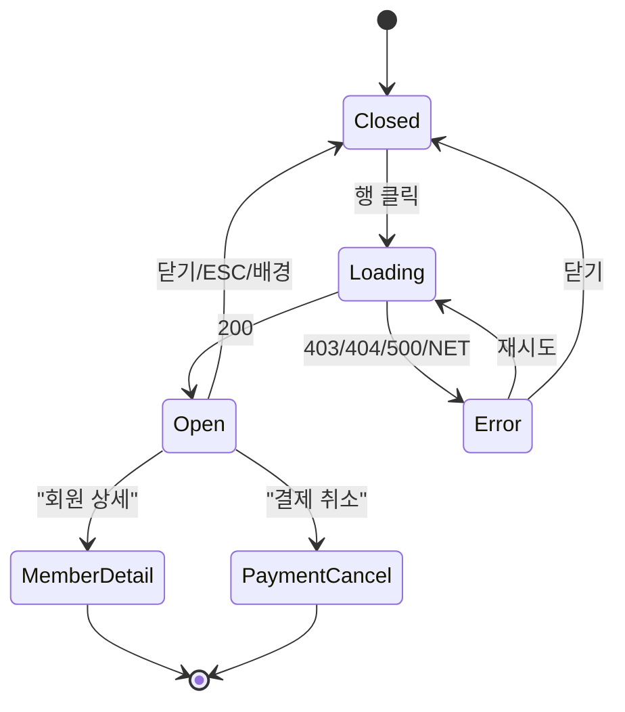

# DLG-S001 매출 상세 — 기본화면 (마스터)

> 이 문서는 **다이얼로그 마스터 스펙**입니다. `01~03` 상태 문서는 이 문서를 상속(override/delta)합니다.
> 매출 목록(SCR-S001, SCR-S006 선수익금, SCR-S011 매출예측)의 테이블 행을 클릭하여 **단일 매출 건의 결제 정보/항목/카드정보/서비스/메모**를 한 화면에 조회하는 상세 모달.
> 조회 전용 + 이동 링크(회원 상세, 결제 취소 페이지) + 영수증 재발행 트리거.

---

## 0. 메타 & 원천 참조

| 항목 | 값 |
|------|----|
| 다이얼로그 ID | DLG-S001 |
| 다이얼로그명 | 매출 상세 |
| 도메인 | D03-매출관리 |
| 부모 화면 | SCR-S001(매출 현황), SCR-S006(선수익금 조회), SCR-S011(매출 예측) |
| 트리거 조건 | TAB-001/006/007 매출 목록 테이블 행 클릭 |
| 확인 레벨 | L0 (조회형 모달) |
| 서버 호출 여부 | ✅ 상세 로드(`GET /sales/:id`), 영수증 재발행(client-side print + audit) |
| 닫기 옵션 | ✅ ESC / 배경 / X / 닫기 버튼 허용 |
| 역할 | manager 이상(조회 제한) — trainer/front 접근 불가 |
| 파일 경로 | `src/components/dialogs/SaleDetailDialog.tsx` |
| 우선순위 | P0 |
| 플랫폼 | 데스크톱(우선) / 태블릿 / 모바일 |

### 원천 문서 링크
| 문서 | 경로 | 참조 섹션 |
|---|---|---|
| 매출 화면설계서 | `docs/화면설계서/매출관리.md` | §[DLG-S001] 매출 상세 모달(L231~286) |
| 매출 기능명세서 | `docs/기능명세서/매출관리.md` | §sales 테이블 계약, §환불/취소, §영수증 |
| 에러코드정의서 | `docs/에러코드정의서.md` | §4.4 매출/결제 E4xx300~399 (E400301, E404300, E409300, E402001) |
| 다이어그램 M1 생명주기 | `docs/다이어그램/D03_매출관리/DLG-S001_매출상세/M1_모달생명주기.md` | STATE_LOADING/OPEN/ERROR |
| 다이어그램 M2 필드검증 | `docs/다이어그램/D03_매출관리/DLG-S001_매출상세/M2_필드검증.md` | 표시 필드 매핑 |
| 다이어그램 M3 결과분기 | `docs/다이어그램/D03_매출관리/DLG-S001_매출상세/M3_결과분기.md` | 버튼 분기 (회원 상세/결제 취소/재발행) |
| 권한 매트릭스 | `docs/다이어그램/10_권한매트릭스/R1_역할화면_매트릭스.md` | D03 매출 모듈 역할별 접근 |
| SCR-S001 마스터 | `docs/화면설계서/D03-매출관리/SCR-S001-매출현황/00-기본화면.md` | 부모 테이블, 트리거 위치 |
| SCR-985 회원 상세 | `docs/화면설계서/D02-회원관리/SCR-005-회원상세/` | `moveToPage(985)` 도착지 |

---

## 1. 다이얼로그 목적 (Why)

매출 목록에서 발생한 궁금증(누가/무엇을/얼마에/어떤 수단으로)을 **한 번의 클릭으로 전부 해소**하고, 필요 시 **결제 취소/영수증 재발행/회원 상세**로 이어 붙이기 위한 상세 허브 모달.
- 매출 데이터의 결제 정보, 카드 정보, 서비스(일수/횟수/포인트), 메모를 상/하 섹션으로 구조화.
- 미수금 존재 시 시각적 경고(빨간 강조).
- 환불된 매출은 배지만 노출하고 "결제 취소" 버튼을 비활성화.

---

## 2. 화면 레이아웃 (Wireframe)

### 2.1 데스크톱 와이어프레임 (모달 520px md)

```
  backdrop: fixed inset-0 bg-black/50 backdrop-blur-sm z-50
  ┌────────────────────────────────────────────────────┐
  │ Dialog 520px                                       │
  │ ┌────────────────────────────────────────────┐     │
  │ │ 💳  매출 상세                        [X]   │     │ ← Header 56px
  │ │ 2026-04-18 14:23   [정상] 배지              │     │ ← 결제일 + 상태 badge
  │ ├────────────────────────────────────────────┤     │
  │ │ [구매 정보] ──────────────────────────────│     │ ← 섹션 타이틀
  │ │  구매자   김지수                             │     │
  │ │  담당자   박트레이너                          │     │
  │ │  상품명   3개월 회원권                        │     │
  │ │  구분     [회원권] [1회차]                   │     │ ← StatusBadge
  │ ├────────────────────────────────────────────┤     │
  │ │ [금액 정보] ──────────────────────────────│     │
  │ │  정가          ₩390,000                      │     │
  │ │  할인          -₩40,000                      │     │
  │ │  판매가         ₩350,000   ← bold primary    │     │
  │ ├────────────────────────────────────────────┤     │
  │ │ [결제 내역] ──────────────────────────────│     │
  │ │  카드         ₩300,000                       │     │
  │ │  현금         ₩50,000                        │     │
  │ │  마일리지      ₩0                             │     │
  │ │  미수금        ₩0  (>0 이면 state-error)      │     │
  │ ├────────────────────────────────────────────┤     │
  │ │ [카드 정보] (카드 결제 시)                    │     │
  │ │  카드사 / 카드번호 / 승인번호                  │     │
  │ ├────────────────────────────────────────────┤     │
  │ │ [서비스]                                     │     │
  │ │  서비스 일수 / 횟수 / 포인트                   │     │
  │ ├────────────────────────────────────────────┤     │
  │ │ [비고]                                       │     │
  │ │  메모 영역 (text or '-')                      │     │
  │ └────────────────────────────────────────────┘     │
  │ Footer (right aligned)                             │
  │ [회원 상세] [결제 취소] [영수증 재발행] [닫기]        │ ← 4 buttons
  └────────────────────────────────────────────────────┘
```

### 2.2 영역 치수표

| 영역 | 위치 | 치수 | 역할 |
|---|---|---|---|
| Backdrop | fixed | `inset-0 bg-black/50 backdrop-blur-sm z-50` | 배경 |
| Modal | 중앙 | `max-w-[520px] w-[calc(100%-32px)]` | 카드 |
| Header | 상단 | 56px h | 아이콘/제목/상태배지/X |
| Body | 스크롤 | auto, `max-h-[72vh]` 스크롤 | 섹션형 상세 정보 |
| Section | body 내부 | `space-y-3` / 구분선 `border-t` | 구매/금액/결제/카드/서비스/비고 |
| Footer | 하단 | 64px h | Ghost + Danger + Ghost + Primary |

---

## 3. 디자인 토큰

### 3.1 색상
| 토큰 | 클래스 | 용도 |
|---|---|---|
| backdrop | `fixed inset-0 bg-black/50 backdrop-blur-sm z-50` | 배경 |
| card | `bg-white rounded-2xl shadow-2xl ring-1 ring-gray-100` | 카드 |
| icon.primary.wrap | `bg-blue-50 size-10 rounded-full` | 헤더 아이콘 래퍼 |
| icon.primary | `text-blue-600 size-5` | CreditCard 아이콘 |
| section.title | `text-xs font-semibold uppercase tracking-wider text-gray-500` | 섹션 제목 |
| label | `text-sm text-gray-500` | 좌측 라벨 |
| value | `text-sm text-gray-900 tabular-nums` | 우측 값 |
| value.strong | `text-base font-semibold text-blue-600 tabular-nums` | 판매가(강조) |
| value.error | `text-sm font-semibold text-rose-600 tabular-nums` | 미수금 > 0 |
| badge.status.success | `bg-emerald-50 text-emerald-700 ring-1 ring-emerald-200` | 정상 |
| badge.status.error | `bg-rose-50 text-rose-700 ring-1 ring-rose-200` | 환불 |
| badge.status.warning | `bg-amber-50 text-amber-800 ring-1 ring-amber-200` | 부분환불 |
| btn.ghost | `border border-gray-300 bg-white hover:bg-gray-50 text-gray-700` | 회원상세/영수증/닫기 |
| btn.danger | `bg-rose-600 hover:bg-rose-700 text-white disabled:bg-rose-300` | 결제 취소 |
| btn.primary | `bg-blue-600 hover:bg-blue-700 text-white` | 닫기(기본 포커스) |

### 3.2 타이포
| 토큰 | 값 |
|---|---|
| title | `text-lg font-semibold text-gray-900` |
| date | `text-xs text-gray-500` |
| section | `text-xs font-semibold uppercase tracking-wider text-gray-500` |
| body | `text-sm text-gray-900` |
| caption | `text-xs text-gray-400` |
| button | `text-sm font-medium` |

### 3.3 간격/반경/모션
- radius: `rounded-2xl` (카드), `rounded-lg` (버튼), `rounded-md` (배지)
- padding: header/body/footer 각 `p-5`, body 내부 섹션 `py-3`
- gap: 섹션 간 `space-y-4`, 한 쌍(라벨-값) `grid grid-cols-[120px_1fr] gap-y-2`
- enter: `animate-[fadeInUp_160ms_ease-out]` · `motion-reduce:animate-none`

---

## 4. 반응형 규칙
| BP | 모달 폭 | 특이사항 |
|---|---|---|
| Mobile <640 | `max-w-[calc(100%-24px)]` | 섹션 라벨-값 컬럼 `grid-cols-[100px_1fr]`로 축소, footer 버튼 2행으로 감쌈(`flex-wrap`) |
| Tablet 640~1024 | `max-w-[520px]` | 기본 레이아웃 |
| Desktop ≥1024 | `max-w-[520px]` | 기본 레이아웃, z-50 |

---

## 5. 🔐 역할별(RBAC) 매트릭스

> 매출 모듈은 **manager 이상 조회 제한** (공통 지침). trainer/front/readonly는 본 다이얼로그 접근 차단.

| 요소 | superAdmin | primary | owner | manager | fc | trainer | staff | front |
|---|:---:|:---:|:---:|:---:|:---:|:---:|:---:|:---:|
| 다이얼로그 오픈(행 클릭) | ● | ● | ● | ● | ○ | — | ○ | — |
| 구매 정보 섹션 조회 | ● | ● | ● | ● | ○ | — | ○ | — |
| 금액/결제 섹션 조회 | ● | ● | ● | ● | — | — | — | — |
| 카드 정보 섹션 조회 | ● | ● | ● | ● | — | — | — | — |
| 메모/비고 섹션 조회 | ● | ● | ● | ● | ○ | — | ○ | — |
| "회원 상세" 버튼 | ● | ● | ● | ● | ● | — | ● | — |
| "결제 취소" 버튼 | ● | ● | ● | ● | — | — | — | — |
| "영수증 재발행" 버튼 | ● | ● | ● | ● | — | — | ● | — |
| "닫기" 버튼 | ● | ● | ● | ● | ● | — | ● | — |

> ● 전체 사용 / ○ 부분 노출(핵심 필드만) / — 숨김 또는 접근 불가

### 5.1 멀티테넌트
- 서버 `GET /sales/:id` 는 `branchId` 스코프 강제. super/primary만 전 지점 조회.
- 다른 지점 매출 ID로 요청 시 **403 E403300** → 다이얼로그 `03-에러` 상태(권한 없음 안내).

---

## 6. 컴포넌트 트리

```tsx
<Portal>
  <div role="dialog" aria-modal="true"
       aria-labelledby="sale-detail-title"
       aria-describedby="sale-detail-desc"
       className="fixed inset-0 z-50 flex items-center justify-center
                  bg-black/50 backdrop-blur-sm px-3">
    <div className="w-full max-w-[520px] bg-white rounded-2xl shadow-2xl
                    ring-1 ring-gray-100 max-h-[86vh] flex flex-col
                    motion-reduce:animate-none animate-[fadeInUp_160ms_ease-out]">
      {/* Header */}
      <header className="flex items-start justify-between gap-3 p-5 border-b border-gray-100">
        <div className="flex items-center gap-3">
          <div className="size-10 rounded-full bg-blue-50 grid place-items-center">
            <CreditCard className="size-5 text-blue-600" aria-hidden />
          </div>
          <div>
            <h2 id="sale-detail-title" className="text-lg font-semibold text-gray-900">매출 상세</h2>
            <p className="text-xs text-gray-500 mt-0.5">{purchaseDate}</p>
          </div>
          <StatusBadge variant={statusVariant}>{statusLabel}</StatusBadge>
        </div>
        <button aria-label="닫기" onClick={onClose}
          className="size-8 grid place-items-center rounded-md hover:bg-gray-100 text-gray-500">
          <X className="size-4" aria-hidden />
        </button>
      </header>

      {/* Body */}
      <div id="sale-detail-desc" className="p-5 space-y-5 overflow-y-auto">
        <Section title="구매 정보">
          <Row label="구매자" value={buyer ?? '-'} />
          <Row label="담당자" value={manager ?? '-'} />
          <Row label="상품명" value={productName ?? '-'} />
          <Row label="구분">
            <StatusBadge>{typeLabel}</StatusBadge>
            {round && <StatusBadge variant="info">{round}회차</StatusBadge>}
          </Row>
        </Section>
        <Section title="금액 정보">
          <Row label="정가"   value={formatKRW(originalPrice)} />
          <Row label="할인"   value={discountPrice > 0 ? `-${formatKRW(discountPrice)}` : '-'} />
          <Row label="판매가" value={formatKRW(salePrice)} strong />
        </Section>
        <Section title="결제 내역">
          <Row label="카드"     value={formatKRW(card)} />
          <Row label="현금"     value={formatKRW(cash)} />
          <Row label="마일리지" value={formatKRW(mileage)} />
          <Row label="미수금"   value={formatKRW(unpaid)} tone={unpaid > 0 ? 'error' : 'default'} />
        </Section>
        {card > 0 && (
          <Section title="카드 정보">
            <Row label="카드사"   value={cardCompany ?? '-'} />
            <Row label="카드번호" value={cardNumber ?? '-'} />
            <Row label="승인번호" value={approvalNo ?? '-'} />
          </Section>
        )}
        <Section title="서비스">
          <Row label="서비스 일수"   value={serviceDays ? `${serviceDays}일` : '-'} />
          <Row label="서비스 횟수"   value={serviceCount ? `${serviceCount}회` : '-'} />
          <Row label="서비스 포인트" value={servicePoints ? `${servicePoints} P` : '-'} />
        </Section>
        <Section title="비고">
          <p className="text-sm text-gray-700 whitespace-pre-line">{memo || '-'}</p>
        </Section>
      </div>

      {/* Footer */}
      <footer className="flex items-center justify-end gap-2 p-5 border-t border-gray-100 flex-wrap">
        <GhostButton onClick={() => moveToPage(985, { id: buyerId })}>회원 상세</GhostButton>
        <DangerButton onClick={onCancelPayment} disabled={isRefunded}>결제 취소</DangerButton>
        <GhostButton onClick={onReprintReceipt}>영수증 재발행</GhostButton>
        <PrimaryButton onClick={onClose} autoFocus>닫기</PrimaryButton>
      </footer>
    </div>
  </div>
</Portal>
```

### 컴포넌트 명세
| 컴포넌트 | Props | 재사용 여부 |
|---|---|---|
| `SaleDetailDialog` | `{ saleId: string; isOpen; onClose }` | 매출 도메인 공용 |
| `Section` | `{ title: string; children }` | 로컬 (DLG-S001~S008 공용) |
| `Row` | `{ label: string; value?: ReactNode; strong?: boolean; tone?: 'default'\|'error'; children? }` | 로컬 |
| `StatusBadge` | `{ variant: 'success'\|'error'\|'warning'\|'info'\|'default' }` | 전역 공용 |

---

## 7. 데이터 계약

### 7.1 API
| 항목 | 값 |
|---|---|
| 엔드포인트 | `GET /sales/:id` |
| 쿼리 | — |
| 성공(200) | `{ success: true, data: Sale }` |
| 실패(403) | `{ success: false, errorCode: 'E403300' }` — 타 지점 매출 |
| 실패(404) | `{ success: false, errorCode: 'E404300', message: '매출 내역을 찾을 수 없습니다' }` |
| 실패(500) | `{ success: false, errorCode: 'E500001' }` |

### 7.2 타입

```ts
// src/types/sales.ts
export type SaleStatus = 'NORMAL' | 'PARTIAL_REFUND' | 'REFUNDED' | 'CANCELLED';

export interface Sale {
  id: string;
  branchId: string;
  purchaseDate: string;               // ISO
  status: SaleStatus;
  buyerId: string | null;
  buyer: string | null;               // 회원명
  manager: string | null;
  productId: string | null;
  productName: string | null;
  type: 'MEMBERSHIP' | 'LESSON' | 'RENTAL' | 'GENERAL';
  round: number | null;               // N회차
  originalPrice: number;
  discountPrice: number;
  salePrice: number;
  card: number;
  cash: number;
  mileage: number;
  unpaid: number;
  cardCompany: string | null;
  cardNumber: string | null;          // 마스킹: '1234-****-****-5678'
  approvalNo: string | null;
  serviceDays: number | null;
  serviceCount: number | null;
  servicePoints: number | null;
  memo: string | null;
}
```

### 7.3 상태 관리
- **Data fetching**: `useQuery(['sale', saleId], () => fetchSaleById(saleId), { enabled: isOpen && !!saleId })`
- **로컬 UI**: `isOpen`(부모), `isReprinting`(재발행 스피너 - 선택)
- **성능**: 같은 saleId 재오픈 시 React Query 캐시 히트

---

## 8. 비즈니스 룰

1. **접근 제어**: `user.role ∈ {superAdmin, primary, owner, manager}` 가 아니면 다이얼로그 자체 **오픈 금지**(부모 테이블 onRowClick 가드).
2. **환불 완료(status=REFUNDED) 매출**: "결제 취소" 버튼 `disabled` + `aria-disabled`. 클릭 시 토스트 "이미 환불된 매출입니다" (E409300).
3. **부분환불(PARTIAL_REFUND)**: 결제 취소 허용(잔여 금액), 배지 `warning`으로 노출.
4. **카드 정보 섹션 조건부 표시**: `card === 0` 인 경우 "카드 정보" 섹션 자체를 숨김.
5. **민감정보 마스킹**: `cardNumber`는 중간 8자리 `*` 마스킹된 상태로 서버에서 제공. 다이얼로그는 그대로 렌더.
6. **영수증 재발행**:
   1) 클라이언트에서 `receiptHtml` 템플릿 주입 → `window.print()`
   2) 성공: 토스트 "영수증 인쇄를 시작합니다."
   3) 실패: 토스트 "영수증 생성에 실패했습니다."
   4) 서버 감사 로그: `AUDIT.RECEIPT_REPRINT` 기록(`POST /audit/receipt`).
7. **회원 상세 이동**: `buyerId` 가 null 이면 버튼 자체 숨김(비회원 매출).
8. **세션 만료 우선**: DLG-000 오픈 시 이 다이얼로그 자동 닫힘.
9. **스크롤 잠금**: 모달 열림 중 `document.body.style.overflow='hidden'`.
10. **URL 동기화(선택)**: `?saleId=XXX` 쿼리로 딥링크 지원. 새로고침/공유 가능.

---

## 9. 상태 목록

| 파일 | 상태 코드 | 한글 | 트리거 |
|---|---|---|---|
| `01-로딩.md` | `sale-detail-loading` | 로딩 | 행 클릭 → fetch 시작 |
| `02-열림.md` | `sale-detail-open` | 열림 (데이터 로드 완료) | 200 응답 |
| `03-에러.md` | `sale-detail-error` | 에러 | 403/404/500/네트워크 |

상태 전이: `closed → loading → open | error → closed`

---

## 10. 에러 코드 매핑

| errorCode | HTTP | 시나리오 | 표시 | 다음 상태 |
|---|---|---|---|---|
| E403300 | 403 | 다른 지점 매출 접근 | 인라인 경고 "해당 매출을 조회할 권한이 없습니다" + 닫기만 노출 | `03-에러` |
| E404300 | 404 | saleId 미존재 | 인라인 경고 "매출 내역을 찾을 수 없습니다" | `03-에러` |
| E409300 | 409 | 결제 취소 클릭 시 이미 환불됨 | 토스트 "이미 환불된 매출입니다" + 다이얼로그 유지 | `02-열림` |
| E500001 | 500 | 서버 오류 | 인라인 경고 + 재시도 버튼 | `03-에러` |
| NETWORK | — | 오프라인 | 인라인 경고 "네트워크 연결을 확인해주세요" + 재시도 | `03-에러` |
| E401002 | 401 | 세션 만료 | DLG-000 우선 | (자동 정리) |

---

## 11. 접근성 (WCAG 2.1 AA)

| 항목 | 요구사항 |
|---|---|
| role/aria | `role="dialog"` + `aria-modal="true"` + `aria-labelledby="sale-detail-title"` + `aria-describedby="sale-detail-desc"` |
| 포커스 | 오픈 시 "닫기"(Primary)에 오토포커스. 에러 상태에서는 재시도/닫기 선호 순 |
| 트랩 | Tab 순환: 닫기(X) → 회원상세 → 결제취소 → 영수증 → 닫기 → ... |
| 키보드 | `Esc`=닫기, `Enter`=포커스 버튼 실행 |
| 스크린리더 | 섹션 제목을 `<h3>` 또는 `role="heading" aria-level="3"`로 마크업 |
| 대비 | 본문 4.5:1, 배지 텍스트 4.5:1 이상 |
| 표 데이터 | 라벨-값 쌍은 `<dl><dt><dd>` 의미 마크업 권장 |
| 모션 | `prefers-reduced-motion:reduce` → 애니메이션 제거 |
| 스크롤 | 모달 내부 스크롤 시 배경 스크롤 잠금 유지 |

---

## 12. 진입 / 이탈 연결

### 진입
- SCR-S001 매출 현황(TAB-001/006/007) 테이블 행 클릭
- SCR-S006 선수익금 조회 테이블 행 클릭
- SCR-S011 매출 예측 상세 트리거(선택)
- 딥링크 `?saleId=XXX` (선택 구현)

### 이탈
| 액션 | 목적지 |
|---|---|
| 닫기 / ESC / 배경 / X | 부모 화면 유지 (focus 복원) |
| "회원 상세" | `moveToPage(985, { id: buyerId })` |
| "결제 취소" | `/payment-cancel?saleId=${id}` (SCR-S012) 이동 |
| "영수증 재발행" | `window.print()` 후 토스트, 다이얼로그 유지 |

---

## 13. 다이어그램 통합 뷰



참조: `docs/다이어그램/D03_매출관리/DLG-S001_매출상세/M1_모달생명주기.md`

---

## 14. 🧩 바이브코딩 프롬프트 (마스터)

```
Next.js 15 App Router + TypeScript + Tailwind + Supabase + React Query + Radix Dialog 기반
'use client' 매출 상세 모달을 작성하라.

━━ 다이얼로그: DLG-S001 매출 상세 ━━
파일:
  src/components/dialogs/SaleDetailDialog.tsx
  src/components/dialogs/_shared/Section.tsx
  src/components/dialogs/_shared/Row.tsx
  src/api/sales.ts             (fetchSaleById)
  src/types/sales.ts           (Sale)

━━ Radix Dialog 기반 구조 ━━
import * as Dialog from '@radix-ui/react-dialog';
import { CreditCard, X } from 'lucide-react';
import { useQuery } from '@tanstack/react-query';
import { StatusBadge } from '@/components/ui/StatusBadge';
import { formatKRW } from '@/lib/format';
import { moveToPage } from '@/internal';
import { toast } from 'sonner';

export function SaleDetailDialog({
  saleId, isOpen, onClose,
}: { saleId: string | null; isOpen: boolean; onClose: () => void }) {
  const q = useQuery({
    queryKey: ['sale', saleId],
    queryFn: () => fetchSaleById(saleId!),
    enabled: isOpen && !!saleId,
  });

  return (
    <Dialog.Root open={isOpen} onOpenChange={(o) => !o && onClose()}>
      <Dialog.Portal>
        <Dialog.Overlay className="fixed inset-0 z-50 bg-black/50 backdrop-blur-sm
                                   motion-reduce:animate-none animate-[fadeIn_120ms_ease-out]" />
        <Dialog.Content
          className="fixed left-1/2 top-1/2 -translate-x-1/2 -translate-y-1/2 z-50
                     w-[calc(100%-24px)] max-w-[520px] max-h-[86vh]
                     bg-white rounded-2xl shadow-2xl ring-1 ring-gray-100
                     flex flex-col
                     motion-reduce:animate-none animate-[fadeInUp_160ms_ease-out]"
          aria-describedby="sale-detail-desc">
          {/* Header */}
          <header className="flex items-start justify-between gap-3 p-5 border-b border-gray-100">
            <div className="flex items-center gap-3">
              <div className="size-10 rounded-full bg-blue-50 grid place-items-center">
                <CreditCard className="size-5 text-blue-600" aria-hidden />
              </div>
              <div>
                <Dialog.Title className="text-lg font-semibold text-gray-900">매출 상세</Dialog.Title>
                {q.data && <p className="text-xs text-gray-500 mt-0.5">{q.data.purchaseDate}</p>}
              </div>
              {q.data && <StatusBadge variant={toVariant(q.data.status)}>{toStatusLabel(q.data.status)}</StatusBadge>}
            </div>
            <Dialog.Close asChild>
              <button aria-label="닫기"
                className="size-8 grid place-items-center rounded-md hover:bg-gray-100 text-gray-500">
                <X className="size-4" aria-hidden />
              </button>
            </Dialog.Close>
          </header>

          {/* Body 상태 분기 */}
          <div id="sale-detail-desc" className="p-5 space-y-5 overflow-y-auto">
            {q.isLoading && <SaleDetailSkeleton />}
            {q.isError && <SaleDetailErrorPanel error={q.error} onRetry={() => q.refetch()} />}
            {q.isSuccess && <SaleDetailBody sale={q.data} />}
          </div>

          {/* Footer */}
          <footer className="flex items-center justify-end gap-2 p-5 border-t border-gray-100 flex-wrap">
            {q.data?.buyerId && (
              <button onClick={() => moveToPage(985, { id: q.data!.buyerId! })}
                className="h-10 px-4 rounded-lg border border-gray-300 bg-white hover:bg-gray-50
                           text-sm font-medium text-gray-700">회원 상세</button>
            )}
            <button onClick={() => router.push(`/payment-cancel?saleId=${saleId}`)}
                    disabled={q.data?.status === 'REFUNDED'}
                    className="h-10 px-4 rounded-lg bg-rose-600 hover:bg-rose-700
                               disabled:bg-rose-300 disabled:cursor-not-allowed
                               text-white text-sm font-medium">결제 취소</button>
            <button onClick={handleReprint}
                    className="h-10 px-4 rounded-lg border border-gray-300 bg-white hover:bg-gray-50
                               text-sm font-medium text-gray-700">영수증 재발행</button>
            <button onClick={onClose} autoFocus
                    className="h-10 px-4 rounded-lg bg-blue-600 hover:bg-blue-700
                               text-white text-sm font-medium
                               focus:outline-none focus:ring-2 focus:ring-offset-2 focus:ring-blue-500">닫기</button>
          </footer>
        </Dialog.Content>
      </Dialog.Portal>
    </Dialog.Root>
  );
}

━━ SaleDetailBody (섹션형) ━━
function SaleDetailBody({ sale }: { sale: Sale }) {
  return (
    <>
      <Section title="구매 정보">
        <Row label="구매자">{sale.buyer ?? '-'}</Row>
        <Row label="담당자">{sale.manager ?? '-'}</Row>
        <Row label="상품명">{sale.productName ?? '-'}</Row>
        <Row label="구분">
          <StatusBadge>{toTypeLabel(sale.type)}</StatusBadge>
          {sale.round && <StatusBadge variant="info">{sale.round}회차</StatusBadge>}
        </Row>
      </Section>
      <Section title="금액 정보">
        <Row label="정가">{formatKRW(sale.originalPrice)}</Row>
        <Row label="할인">{sale.discountPrice > 0 ? `-${formatKRW(sale.discountPrice)}` : '-'}</Row>
        <Row label="판매가" strong>{formatKRW(sale.salePrice)}</Row>
      </Section>
      <Section title="결제 내역">
        <Row label="카드">{formatKRW(sale.card)}</Row>
        <Row label="현금">{formatKRW(sale.cash)}</Row>
        <Row label="마일리지">{formatKRW(sale.mileage)}</Row>
        <Row label="미수금" tone={sale.unpaid > 0 ? 'error' : 'default'}>{formatKRW(sale.unpaid)}</Row>
      </Section>
      {sale.card > 0 && (
        <Section title="카드 정보">
          <Row label="카드사">{sale.cardCompany ?? '-'}</Row>
          <Row label="카드번호">{sale.cardNumber ?? '-'}</Row>
          <Row label="승인번호">{sale.approvalNo ?? '-'}</Row>
        </Section>
      )}
      <Section title="서비스">
        <Row label="서비스 일수">{sale.serviceDays ? `${sale.serviceDays}일` : '-'}</Row>
        <Row label="서비스 횟수">{sale.serviceCount ? `${sale.serviceCount}회` : '-'}</Row>
        <Row label="서비스 포인트">{sale.servicePoints ? `${sale.servicePoints} P` : '-'}</Row>
      </Section>
      <Section title="비고">
        <p className="text-sm text-gray-700 whitespace-pre-line">{sale.memo || '-'}</p>
      </Section>
    </>
  );
}

━━ 영수증 재발행 핸들러 ━━
const handleReprint = () => {
  try {
    const html = renderReceiptHtml(q.data!);
    const w = window.open('', '_blank', 'width=400,height=640');
    if (!w) throw new Error('popup blocked');
    w.document.write(html); w.document.close(); w.focus();
    setTimeout(() => { w.print(); w.close(); }, 200);
    fetch(`/audit/receipt`, { method: 'POST', body: JSON.stringify({ saleId }) }).catch(() => {});
    toast.success('영수증 인쇄를 시작합니다.');
  } catch {
    toast.error('영수증 생성에 실패했습니다.');
  }
};

━━ 디자인 토큰 (정확히) ━━
backdrop:  fixed inset-0 z-50 bg-black/50 backdrop-blur-sm
card:      bg-white rounded-2xl shadow-2xl ring-1 ring-gray-100
title:     text-lg font-semibold text-gray-900
section:   text-xs font-semibold uppercase tracking-wider text-gray-500
label:     text-sm text-gray-500
value:     text-sm text-gray-900 tabular-nums
value.strong: text-base font-semibold text-blue-600 tabular-nums
value.error:  text-sm font-semibold text-rose-600 tabular-nums
btn.ghost: h-10 px-4 rounded-lg border border-gray-300 bg-white hover:bg-gray-50 text-sm font-medium text-gray-700
btn.danger: h-10 px-4 rounded-lg bg-rose-600 hover:bg-rose-700 text-white text-sm font-medium disabled:bg-rose-300 disabled:cursor-not-allowed
btn.primary: h-10 px-4 rounded-lg bg-blue-600 hover:bg-blue-700 text-white text-sm font-medium

━━ QA 체크 ━━
- manager 이상만 오픈 가능, trainer/front 는 행 클릭해도 오픈 안 됨
- 404 수신 시 03-에러 상태 + 재시도 버튼
- REFUNDED 매출 → "결제 취소" disabled
- card === 0 → "카드 정보" 섹션 숨김
- 영수증 재발행 성공 토스트 + 감사 로그 전송
- ESC/배경/X 닫힘 작동
- Tab trap, 오픈 시 "닫기" 오토포커스
- 세션 만료 발생 시 DLG-000 우선
- motion-reduce 준수
```

---

## 15. QA 체크리스트 (수용 기준)

- [ ] manager 이상만 행 클릭 → 다이얼로그 오픈
- [ ] trainer/front 는 행 클릭해도 오픈 안 됨(가드)
- [ ] 오픈 시 loading 상태(스켈레톤) 표시
- [ ] 200 응답 후 섹션별 데이터 정상 표시
- [ ] 404 응답 시 에러 상태 + 재시도/닫기 버튼
- [ ] 403(타지점) 시 권한 안내
- [ ] REFUNDED 매출 시 "결제 취소" 버튼 disabled + aria-disabled
- [ ] card === 0 시 카드 정보 섹션 자동 숨김
- [ ] 미수금 > 0 시 해당 행 텍스트 `text-rose-600 font-semibold` 적용
- [ ] 영수증 재발행 → 팝업 + print 호출 + 성공 토스트
- [ ] 팝업 차단 시 "영수증 생성에 실패했습니다" 토스트
- [ ] 회원 상세 버튼 → `moveToPage(985)` 정상 이동
- [ ] buyerId=null 매출: "회원 상세" 버튼 숨김
- [ ] ESC/배경/X로 닫힘
- [ ] 키보드만으로 모든 버튼 접근 가능
- [ ] 모바일 360px 폭 가독성 유지
- [ ] 세션 만료 발생 시 DLG-000 우선
- [ ] prefers-reduced-motion 준수
