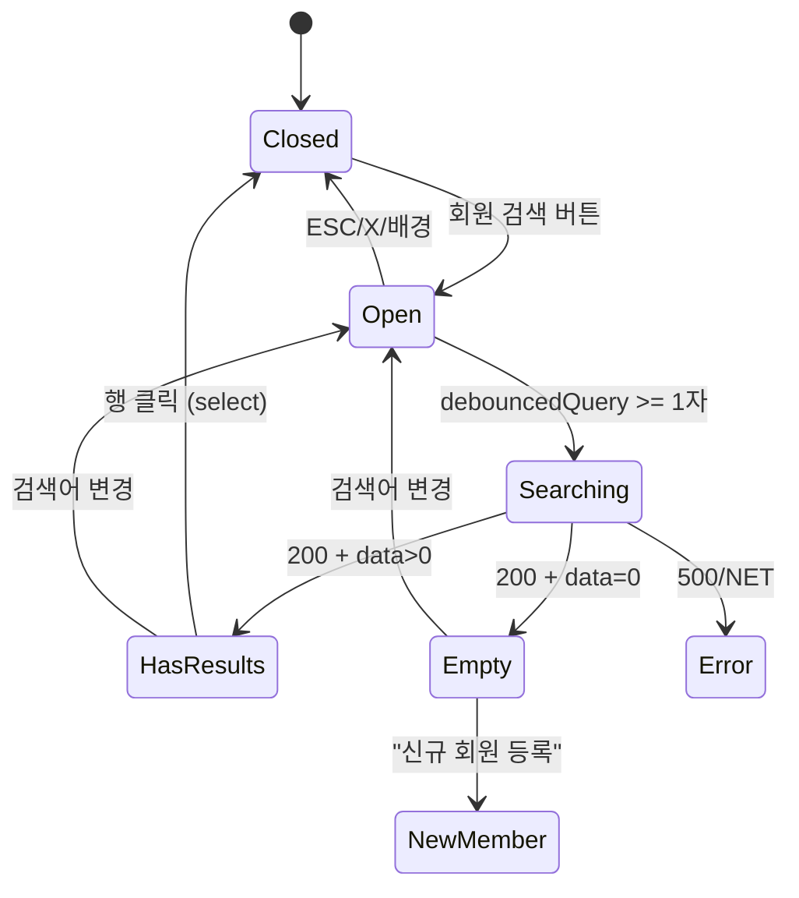

# DLG-S002 구매자 검색 — 기본화면 (마스터)

> 이 문서는 **다이얼로그 마스터 스펙**입니다. `01~03` 상태 문서는 이 문서를 상속(override/delta)합니다.
> POS 판매(SCR-S002) / 결제 처리(SCR-S003) 화면에서 **회원을 검색하여 구매자로 지정**하는 검색 모달.
> 이름/전화번호 부분일치 검색 → 결과 리스트 → 행 클릭 → `setBuyer()` + 자동 닫힘.

---

## 0. 메타 & 원천 참조

| 항목 | 값 |
|------|----|
| 다이얼로그 ID | DLG-S002 |
| 다이얼로그명 | 구매자 검색 |
| 도메인 | D03-매출관리 |
| 부모 화면 | SCR-S002(POS 판매), SCR-S003(결제 처리) |
| 트리거 조건 | "회원 검색" 버튼 클릭 (우측 장바구니 구매자 영역) |
| 확인 레벨 | L0 (선택형) |
| 서버 호출 여부 | ✅ `GET /members?query=&branchId=&limit=10` (디바운스 300ms) |
| 닫기 옵션 | ✅ ESC / 배경 / X / 회원 선택 시 자동 |
| 역할 | 결제 권한 역할: superAdmin/primary/owner/manager/fc/front |
| 파일 경로 | `src/components/dialogs/BuyerSearchDialog.tsx` |
| 우선순위 | P0 |

### 원천 문서 링크
| 문서 | 경로 | 참조 섹션 |
|---|---|---|
| 매출 화면설계서 | `docs/화면설계서/매출관리.md` | §[DLG-S002] 구매자 검색 모달(L415~452) |
| 매출 기능명세서 | `docs/기능명세서/매출관리.md` | §POS 구매자 지정 / §members 검색 계약 |
| 공통 화면설계서 | `docs/화면설계서/공통.md` | §4 공통 다이얼로그, §7 접근성, §13 중복 제출 방지 |
| 에러코드정의서 | `docs/에러코드정의서.md` | §회원 관련 (E404100) / §공통 (E500001, NETWORK) |
| 다이어그램 M1 | `docs/다이어그램/D03_매출관리/DLG-S002_구매자검색/M1_모달생명주기.md` | STATE_OPEN/SEARCHING/EMPTY |
| 다이어그램 M2 | `docs/다이어그램/D03_매출관리/DLG-S002_구매자검색/M2_필드검증.md` | 검색어 유효성 |
| 다이어그램 M3 | `docs/다이어그램/D03_매출관리/DLG-S002_구매자검색/M3_결과분기.md` | 선택 → 닫힘 |
| SCR-S002 마스터 | `docs/화면설계서/D03-매출관리/SCR-S002-POS판매/00-기본화면.md` | 트리거 위치 |

---

## 1. 다이얼로그 목적 (Why)

POS 판매 / 결제 처리 중 **구매자(회원) 지정**을 빠르고 정확하게 수행하기 위한 경량 검색 모달.
- 이름/전화번호로 실시간 부분일치 검색(10건 제한).
- 회원 상태(활성/만료/휴회) 배지로 결제 가능성 즉시 인지.
- 비회원(walk-in) 결제는 이 모달 없이 진행.

---

## 2. 화면 레이아웃 (Wireframe)

### 2.1 데스크톱 와이어프레임 (모달 400×480 sm, fixed height)

```
  backdrop: fixed inset-0 bg-black/40 z-40
  ┌──────────────────────────────────┐
  │ 🔍 구매자 검색             [X]   │ ← Header 52px
  ├──────────────────────────────────┤
  │ ┌──────────────────────────────┐ │
  │ │ 🔍  이름 또는 전화번호 검색   │ │ ← SearchInput h-10
  │ └──────────────────────────────┘ │
  ├──────────────────────────────────┤
  │ Result List (scroll, 360px)      │
  │ ┌──────────────────────────────┐ │
  │ │ 김지수              [활성]   │ │  ← 행 13px semi
  │ │ 010-1234-5678                │ │  ← 12px tertiary
  │ ├──────────────────────────────┤ │
  │ │ 김지영              [만료]   │ │
  │ │ 010-2234-5678                │ │
  │ ├──────────────────────────────┤ │
  │ │ ...                          │ │
  │ └──────────────────────────────┘ │
  │  (검색 전)  "이름 또는 전화번호를│ │
  │   입력하여 회원을 검색하세요"    │ │
  │  (결과 없음) "검색 결과가 없습니다│ │
  │   [+ 신규 회원 등록] 링크"       │ │
  ├──────────────────────────────────┤
  │ Footer (hidden in default)       │ ← 없음 (행 클릭으로 자동 닫힘)
  └──────────────────────────────────┘
```

### 2.2 영역 치수표

| 영역 | 위치 | 치수 | 역할 |
|---|---|---|---|
| Backdrop | fixed | `inset-0 bg-black/40 z-40` | 배경 |
| Modal | 중앙 | `w-[400px] h-[480px]` fixed | 카드 |
| Header | 상단 | 52px h | 아이콘/제목/X |
| Search | 상단 | 64px h | SearchInput + 좌측 아이콘 |
| Result List | 중앙 | auto, `flex-1 overflow-y-auto` | 회원 행 리스트 |
| Empty State | Result 대체 | `flex-1 grid place-items-center` | 빈/결과없음 |
| Footer | (없음) | 0 | 행 클릭 자동 닫힘 |

---

## 3. 디자인 토큰

### 3.1 색상
| 토큰 | 클래스 | 용도 |
|---|---|---|
| backdrop | `fixed inset-0 bg-black/40 z-40` | 배경 |
| card | `bg-white rounded-2xl shadow-xl ring-1 ring-gray-100` | 카드 |
| icon.wrap | `bg-blue-50 size-9 rounded-full` | 헤더 아이콘 래퍼 |
| icon.header | `text-blue-600 size-4` | Search 아이콘 |
| input | `h-10 w-full rounded-lg border border-gray-300 bg-white px-10 text-sm text-gray-900 placeholder-gray-400 focus:ring-2 focus:ring-blue-500 focus:border-blue-500` | 검색 인풋 |
| row | `px-4 py-3 hover:bg-blue-50/40 cursor-pointer data-[focus=true]:bg-blue-50` | 결과 행 |
| row.divider | `border-b border-gray-100` | 행 구분선 |
| name | `text-sm font-semibold text-gray-900` | 이름 |
| phone | `text-xs text-gray-500 tabular-nums` | 전화 |
| badge.active | `bg-emerald-50 text-emerald-700 ring-1 ring-emerald-200` | 활성 |
| badge.expired | `bg-amber-50 text-amber-800 ring-1 ring-amber-200` | 만료 |
| badge.dormant | `bg-gray-100 text-gray-700 ring-1 ring-gray-200` | 휴회 |
| link.newMember | `text-sm text-blue-600 hover:underline` | 신규 회원 등록 링크 |

### 3.2 타이포
| 토큰 | 값 |
|---|---|
| title | `text-base font-semibold text-gray-900` |
| input.placeholder | `placeholder:text-gray-400 text-sm` |
| row.name | `text-sm font-semibold text-gray-900` |
| row.phone | `text-xs text-gray-500 tabular-nums` |
| empty.body | `text-sm text-gray-500 text-center` |

### 3.3 간격/반경/모션
- radius: `rounded-2xl` 카드 / `rounded-lg` 인풋 / `rounded-md` 배지
- padding: header/search `p-4`, row `px-4 py-3`
- enter: `animate-[fadeInUp_140ms_ease-out]` · `motion-reduce:animate-none`

---

## 4. 반응형 규칙

| BP | 모달 |
|---|---|
| Mobile <640 | `w-[calc(100%-24px)] h-[80vh]` fullscreen 근접 |
| Tablet | `w-[400px] h-[480px]` |
| Desktop | `w-[400px] h-[480px]` |

모바일에서 키보드가 열리면 result list 높이 자동 축소(`h-[auto]` flex 사용).

---

## 5. 🔐 역할별(RBAC) 매트릭스

| 요소 | superAdmin | primary | owner | manager | fc | trainer | staff | front |
|---|:---:|:---:|:---:|:---:|:---:|:---:|:---:|:---:|
| 다이얼로그 오픈(회원 검색 버튼) | ● | ● | ● | ● | ● | — | — | ● |
| 검색어 입력 | ● | ● | ● | ● | ● | — | — | ● |
| 회원 행 클릭/선택 | ● | ● | ● | ● | ● | — | — | ● |
| 전 지점 검색 | ● | ● | — | — | — | — | — | — |
| 본 지점 검색 | ● | ● | ● | ● | ● | — | — | ● |
| "신규 회원 등록" 링크 | ● | ● | ● | ● | ● | — | — | ● |

> trainer/staff/readonly 는 결제 권한이 없어 애초에 POS/결제 화면 접근 불가(부모 가드).

### 5.1 멀티테넌트
- 서버 `GET /members?query=&branchId=` — super/primary는 `branchId` 생략 가능(전 지점), 그 외는 `session.user.branchId` 강제 주입.
- 본사(primary) 선택 지점 컨텍스트 기준으로 branchId 치환.

---

## 6. 컴포넌트 트리

```tsx
<Dialog.Root open={isOpen} onOpenChange={(o) => !o && onClose()}>
  <Dialog.Portal>
    <Dialog.Overlay className="fixed inset-0 z-40 bg-black/40" />
    <Dialog.Content
      className="fixed left-1/2 top-1/2 -translate-x-1/2 -translate-y-1/2 z-40
                 w-[calc(100%-24px)] max-w-[400px] h-[480px]
                 bg-white rounded-2xl shadow-xl ring-1 ring-gray-100 flex flex-col
                 motion-reduce:animate-none animate-[fadeInUp_140ms_ease-out]">
      {/* Header */}
      <header className="flex items-center justify-between gap-2 p-4 border-b border-gray-100">
        <div className="flex items-center gap-2">
          <div className="size-9 rounded-full bg-blue-50 grid place-items-center">
            <Users className="size-4 text-blue-600" aria-hidden />
          </div>
          <Dialog.Title className="text-base font-semibold text-gray-900">구매자 검색</Dialog.Title>
        </div>
        <Dialog.Close asChild>
          <button aria-label="닫기"
            className="size-8 grid place-items-center rounded-md hover:bg-gray-100 text-gray-500">
            <X className="size-4" aria-hidden />
          </button>
        </Dialog.Close>
      </header>

      {/* Search */}
      <div className="p-4 border-b border-gray-100">
        <div className="relative">
          <Search className="absolute left-3 top-1/2 -translate-y-1/2 size-4 text-gray-400" aria-hidden />
          <input
            ref={inputRef}
            type="search"
            inputMode="search"
            autoFocus
            value={query}
            onChange={(e) => setQuery(e.target.value)}
            placeholder="이름 또는 전화번호 검색"
            aria-label="구매자 검색어"
            className="h-10 w-full rounded-lg border border-gray-300 bg-white pl-10 pr-3
                       text-sm text-gray-900 placeholder:text-gray-400
                       focus:outline-none focus:ring-2 focus:ring-blue-500 focus:border-blue-500" />
        </div>
      </div>

      {/* Result */}
      <ul ref={listRef} role="listbox"
          aria-label="검색 결과 회원 목록"
          className="flex-1 overflow-y-auto divide-y divide-gray-100">
        {data?.map((m, i) => (
          <li key={m.id} role="option" aria-selected={focusIndex === i}
              tabIndex={-1}
              data-focus={focusIndex === i}
              onClick={() => selectMember(m)}
              onKeyDown={(e) => e.key === 'Enter' && selectMember(m)}
              className="px-4 py-3 cursor-pointer hover:bg-blue-50/40
                         data-[focus=true]:bg-blue-50 focus:outline-none">
            <div className="flex items-center justify-between">
              <div>
                <p className="text-sm font-semibold text-gray-900">{m.name}</p>
                <p className="text-xs text-gray-500 tabular-nums mt-0.5">{formatPhone(m.phone)}</p>
              </div>
              <StatusBadge variant={statusVariant(m.status)}>{statusLabel(m.status)}</StatusBadge>
            </div>
          </li>
        ))}
      </ul>
    </Dialog.Content>
  </Dialog.Portal>
</Dialog.Root>
```

### 컴포넌트 명세
| 컴포넌트 | Props | 재사용 여부 |
|---|---|---|
| `BuyerSearchDialog` | `{ isOpen; onClose; onSelect(member): void; initialQuery? }` | 매출 도메인 공용(POS/결제 공유) |
| `StatusBadge` | `{ variant }` | 전역 공용 |
| `formatPhone(phone)` | util | 전역 공용 |

---

## 7. 데이터 계약

### 7.1 API
| 항목 | 값 |
|---|---|
| 엔드포인트 | `GET /members?query=...&branchId=...&limit=10` |
| 쿼리 파라미터 | `query` (string, 1자 이상), `branchId` (string, 선택), `limit` (number, 기본 10, 최대 20) |
| 성공(200) | `{ success: true, data: MemberSearchResult[] }` |
| 실패(400) | `{ success: false, errorCode: 'E400001' }` — 검색어 형식 오류 |
| 실패(401) | → DLG-000 |
| 실패(500) | `{ success: false, errorCode: 'E500001' }` |

### 7.2 타입

```ts
export type MemberStatus = 'ACTIVE' | 'EXPIRED' | 'DORMANT' | 'SUSPENDED';

export interface MemberSearchResult {
  id: string;
  branchId: string;
  name: string;
  phone: string;                // '010-1234-5678'
  status: MemberStatus;
  mileage?: number;             // 결제 처리 화면에서 마일리지 결제 판단용
}
```

### 7.3 상태 관리
- **Query debounce**: 300ms (`useDebouncedValue(query, 300)`)
- **React Query**: `useQuery(['members-search', debouncedQuery, branchId], fetcher, { enabled: debouncedQuery.length >= 1, staleTime: 30_000 })`
- **로컬 UI**: `focusIndex` (키보드 ↑/↓), `inputRef`

---

## 8. 비즈니스 룰

1. **자동 포커스**: 오픈 시 `inputRef.current?.focus()` → 즉시 검색 가능.
2. **디바운스**: 검색어 변경 300ms 후 fetch. 연속 입력 시 이전 요청 abort.
3. **최소 입력**: 1자 이상이어야 fetch 실행. 1자 미만이면 EmptyHint 노출.
4. **결과 제한**: `limit=10` 고정. 10건 이상이면 리스트 하단에 "더 정확히 검색해주세요" 캡션.
5. **branchId 스코프**: super/primary는 전 지점, 그 외는 `session.user.branchId` 자동 주입.
6. **선택 즉시 닫기**: 행 클릭 → `onSelect(member)` → `onClose()`.
7. **전화번호 매칭**: 서버 측 `phone ILIKE '%query%'` + `name ILIKE '%query%'` OR 조건. 하이픈 제거 후 매칭 허용.
8. **신규 회원 등록**: 결과 없음 상태에서 `moveToPage(914)` (회원 신규 등록) 링크 노출. 클릭 시 현재 카트/구매자 상태 sessionStorage에 보존.
9. **정지(SUSPENDED) 회원**: 검색 결과에 노출되지만, 선택 시 부모 화면에서 "정지된 회원은 결제할 수 없습니다" 토스트. (본 모달은 통과)
10. **세션 만료 우선**: DLG-000 오픈 시 자동 닫힘.

---

## 9. 상태 목록

| 파일 | 상태 코드 | 한글 | 트리거 |
|---|---|---|---|
| `01-열림.md` | `buyer-search-open` | 열림 (초기/입력 대기) | 다이얼로그 오픈, query 비어있거나 <1자 |
| `02-검색중.md` | `buyer-search-loading` | 검색 중 | debouncedQuery >= 1자, fetch 진행 중 |
| `03-결과없음.md` | `buyer-search-empty` | 결과 없음 | fetch 200 + data.length === 0 |

상태 전이: `Closed → Open(입력 대기) → Searching → (Open with results | Empty) → (행 클릭: Closed with selection)`

---

## 10. 에러 코드 매핑

| errorCode | HTTP | 시나리오 | 표시 | 다음 상태 |
|---|---|---|---|---|
| E400001 | 400 | 검색어 형식 오류(특수문자 등) | 인풋 아래 인라인 "검색어를 확인해주세요" | `01-열림` 유지 |
| E500001 | 500 | 서버 오류 | 리스트 영역에 ErrorPanel + 재시도 | — |
| NETWORK | — | 오프라인 | "네트워크 연결을 확인해주세요" + 재시도 | — |
| E401002 | 401 | 세션 만료 | DLG-000 우선 | 자동 닫힘 |

---

## 11. 접근성 (WCAG 2.1 AA)

| 항목 | 요구사항 |
|---|---|
| role | `role="dialog"` + `aria-modal="true"` + `aria-labelledby` |
| 인풋 | `role="searchbox"` (또는 `type="search"`) + `aria-controls="buyer-result"` + `aria-activedescendant` |
| 리스트 | `role="listbox"` + 각 항목 `role="option"` + `aria-selected` |
| 키보드 | `↑/↓` = 포커스 이동, `Enter` = 선택, `Esc` = 닫기, `Tab` = 인풋 → 결과 → 닫기 순환 |
| 포커스 | 오픈 시 인풋 자동 포커스, 결과 키보드 이동 시 `data-focus` 시각 표시 |
| 대비 | 텍스트 4.5:1, 배지 4.5:1 |
| 스크린리더 | 결과 개수 공지: `aria-live="polite"` 로 "N건 검색되었습니다" |
| 모션 | `motion-reduce:animate-none` |

---

## 12. 진입 / 이탈 연결

### 진입
- SCR-S002 POS 판매 > 장바구니 > "회원 검색" 버튼
- SCR-S003 결제 처리 > 회원 검색 영역 > 검색어 입력 (인라인 입력이 아닌 경우)

### 이탈
| 액션 | 목적지 |
|---|---|
| 행 클릭 | `onSelect(member)` → 부모 `setBuyer` → 모달 자동 닫힘 |
| ESC / X / 배경 | 닫힘, 부모 화면 유지 |
| "신규 회원 등록" 링크 | `moveToPage(914)` (카트 sessionStorage 저장 후) |

---

## 13. 다이어그램 통합 뷰



참조: `docs/다이어그램/D03_매출관리/DLG-S002_구매자검색/M1_모달생명주기.md`

---

## 14. 🧩 바이브코딩 프롬프트 (마스터)

```
Next.js 15 App Router + TypeScript + Tailwind + Supabase + React Query + Radix Dialog 기반
'use client' 구매자 검색 모달을 작성하라.

━━ 다이얼로그: DLG-S002 구매자 검색 ━━
파일:
  src/components/dialogs/BuyerSearchDialog.tsx
  src/api/members.ts    (searchMembers)
  src/hooks/useDebouncedValue.ts

━━ Radix Dialog 구조 ━━
import * as Dialog from '@radix-ui/react-dialog';
import { Users, Search, X, UserPlus } from 'lucide-react';
import { useQuery } from '@tanstack/react-query';
import { useEffect, useRef, useState } from 'react';
import { useDebouncedValue } from '@/hooks/useDebouncedValue';
import { formatPhone } from '@/lib/format';
import { StatusBadge } from '@/components/ui/StatusBadge';
import { useAuthStore } from '@/stores/authStore';

type MemberStatus = 'ACTIVE'|'EXPIRED'|'DORMANT'|'SUSPENDED';
type Member = { id:string; name:string; phone:string; status:MemberStatus; branchId:string };

export function BuyerSearchDialog({
  isOpen, onClose, onSelect,
}: { isOpen: boolean; onClose: ()=>void; onSelect: (m: Member)=>void }) {
  const [query, setQuery] = useState('');
  const debounced = useDebouncedValue(query, 300);
  const user = useAuthStore(s => s.user);
  const inputRef = useRef<HTMLInputElement>(null);
  const [focusIndex, setFocusIndex] = useState(0);

  const q = useQuery({
    queryKey: ['members-search', debounced, user?.branchId],
    queryFn: () => searchMembers({ query: debounced, branchId: user?.branchId, limit: 10 }),
    enabled: isOpen && debounced.trim().length >= 1,
    staleTime: 30_000,
  });

  useEffect(() => {
    if (isOpen) { inputRef.current?.focus(); setQuery(''); setFocusIndex(0); }
  }, [isOpen]);

  const handleKey = (e: React.KeyboardEvent) => {
    if (!q.data?.length) return;
    if (e.key === 'ArrowDown') { setFocusIndex(i => Math.min(i+1, q.data!.length-1)); e.preventDefault(); }
    if (e.key === 'ArrowUp')   { setFocusIndex(i => Math.max(i-1, 0)); e.preventDefault(); }
    if (e.key === 'Enter')     { const m = q.data![focusIndex]; if (m) { onSelect(m); onClose(); } }
  };

  return (
    <Dialog.Root open={isOpen} onOpenChange={(o) => !o && onClose()}>
      <Dialog.Portal>
        <Dialog.Overlay className="fixed inset-0 z-40 bg-black/40
                                   motion-reduce:animate-none animate-[fadeIn_120ms_ease-out]" />
        <Dialog.Content
          onKeyDown={handleKey}
          aria-describedby="buyer-search-desc"
          className="fixed left-1/2 top-1/2 -translate-x-1/2 -translate-y-1/2 z-40
                     w-[calc(100%-24px)] max-w-[400px] h-[480px]
                     bg-white rounded-2xl shadow-xl ring-1 ring-gray-100 flex flex-col
                     motion-reduce:animate-none animate-[fadeInUp_140ms_ease-out]">
          <header className="flex items-center justify-between gap-2 p-4 border-b border-gray-100">
            <div className="flex items-center gap-2">
              <div className="size-9 rounded-full bg-blue-50 grid place-items-center">
                <Users className="size-4 text-blue-600" aria-hidden />
              </div>
              <Dialog.Title className="text-base font-semibold text-gray-900">구매자 검색</Dialog.Title>
            </div>
            <Dialog.Close asChild>
              <button aria-label="닫기" className="size-8 grid place-items-center rounded-md hover:bg-gray-100 text-gray-500">
                <X className="size-4" aria-hidden />
              </button>
            </Dialog.Close>
          </header>
          <div className="p-4 border-b border-gray-100">
            <div className="relative">
              <Search className="absolute left-3 top-1/2 -translate-y-1/2 size-4 text-gray-400" aria-hidden />
              <input
                ref={inputRef}
                type="search" inputMode="search"
                value={query}
                onChange={(e) => setQuery(e.target.value)}
                placeholder="이름 또는 전화번호 검색"
                aria-label="구매자 검색어"
                aria-controls="buyer-search-result"
                aria-activedescendant={q.data?.[focusIndex]?.id}
                className="h-10 w-full rounded-lg border border-gray-300 bg-white pl-10 pr-3
                           text-sm text-gray-900 placeholder:text-gray-400
                           focus:outline-none focus:ring-2 focus:ring-blue-500 focus:border-blue-500" />
            </div>
          </div>
          <ul id="buyer-search-result" role="listbox" aria-label="검색 결과 회원 목록"
              className="flex-1 overflow-y-auto divide-y divide-gray-100">
            {/* 상태별 렌더 (01/02/03 델타에서 오버라이드) */}
          </ul>
          <p id="buyer-search-desc" className="sr-only" aria-live="polite">
            {q.data?.length ? `${q.data.length}건 검색되었습니다` : ''}
          </p>
        </Dialog.Content>
      </Dialog.Portal>
    </Dialog.Root>
  );
}

━━ 디자인 토큰 (정확히) ━━
backdrop:  fixed inset-0 z-40 bg-black/40
card:      bg-white rounded-2xl shadow-xl ring-1 ring-gray-100
search:    h-10 w-full rounded-lg border border-gray-300 bg-white pl-10 pr-3 text-sm
row:       px-4 py-3 hover:bg-blue-50/40 cursor-pointer data-[focus=true]:bg-blue-50
row.name:  text-sm font-semibold text-gray-900
row.phone: text-xs text-gray-500 tabular-nums
badge.active:  bg-emerald-50 text-emerald-700 ring-1 ring-emerald-200
badge.expired: bg-amber-50   text-amber-800   ring-1 ring-amber-200
badge.dormant: bg-gray-100   text-gray-700    ring-1 ring-gray-200

━━ 정렬 규칙 ━━
- ACTIVE 우선, EXPIRED/DORMANT/SUSPENDED 후순
- 이름 가나다 오름차순
- 완전 일치(phone 전체 매치) 있을 경우 최상단

━━ 신규 회원 등록 링크 ━━
- Empty 상태에서만 노출, 카트 상태 sessionStorage 에 보존 후 /members/new 이동

━━ QA 체크 ━━
- 오픈 시 인풋 자동 포커스
- 1자 미만 → 안내 텍스트, API 호출 안 함
- 디바운스 300ms
- ↑/↓/Enter 키보드 선택
- 행 클릭 시 onSelect + onClose
- ESC/배경/X 닫기
- super/primary 만 전 지점 검색
- motion-reduce 준수
```

---

## 15. QA 체크리스트

- [ ] 오픈 즉시 검색 인풋 자동 포커스
- [ ] 1자 미만 입력 시 API 미호출 (안내 문구 노출)
- [ ] 300ms 디바운스 동작
- [ ] 최대 10건 결과 표시
- [ ] 이름/전화번호 부분 일치 검색
- [ ] 행 클릭 시 `onSelect(member)` + 자동 닫힘
- [ ] ↑/↓ 키로 포커스 이동, Enter 선택
- [ ] ESC/배경/X 닫힘
- [ ] 결과 없음 시 "검색 결과가 없습니다" + 신규 등록 링크
- [ ] SUSPENDED 회원은 선택 가능(모달 통과) + 부모에서 토스트
- [ ] super/primary 외 역할은 본인 지점만 검색
- [ ] 스크린리더 "N건 검색되었습니다" 공지
- [ ] 모션 감소 설정 준수
- [ ] 모바일 360px 가독성 유지
- [ ] 세션 만료 시 DLG-000 우선
