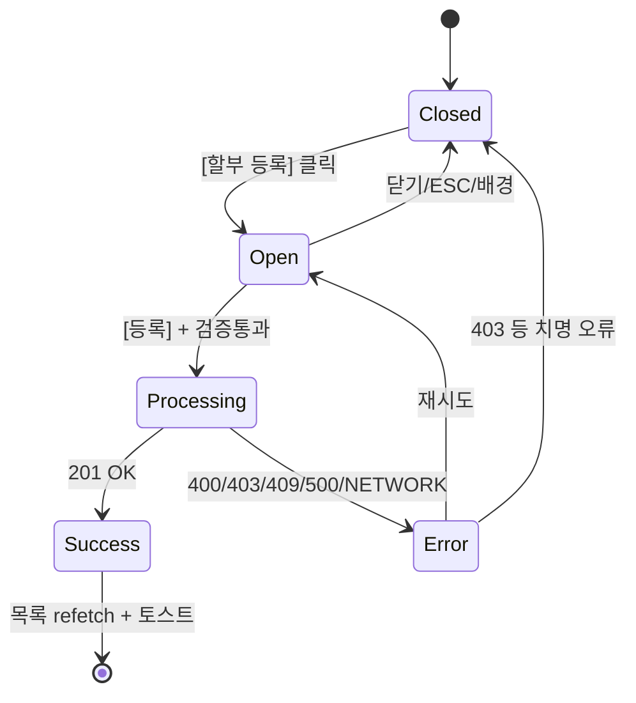

# DLG-S009 할부 등록 — 기본화면 (마스터)

> 이 문서는 **다이얼로그 마스터 스펙**입니다. `01~04` 상태 문서는 이 문서를 상속(override/delta)합니다.
> 상태별 파일은 "변경점(델타)만" 기술하며, 이 문서에 정의된 레이아웃/토큰/컴포넌트/데이터/권한/접근성은 **기본값**으로 적용됩니다.

---

## 0. 메타 & 원천 참조

| 항목 | 값 |
|------|----|
| 다이얼로그 ID | DLG-S009 |
| 다이얼로그명 | 할부 등록 |
| 도메인 | D03-매출관리 |
| 부모 화면 | SCR-S009 할부결제관리 |
| 트리거 조건 | `onClick` [할부 등록] 버튼 + 권한 통과 (owner/manager/fc) |
| 확인 레벨 | L1 (확인형, 신규 INSERT) |
| 서버 호출 여부 | ✅ `POST /installments` (supabase.from('installments').insert) |
| 닫기 옵션 | 🟡 ESC/배경/X = 취소 허용 (단, `02-처리중` 상태에서는 차단) |
| 역할 | owner, manager, fc |
| 파일 경로 | `src/app/installments/page.tsx` 내 `InstallmentRegisterModal` |
| 우선순위 | P1 |

### 원천 문서 링크
| 문서 | 경로 | 섹션 |
|---|---|---|
| 화면설계서(기획) | `docs/화면설계서/매출관리.md` | §할부결제관리 / 할부등록 |
| 기능명세서 | `docs/기능명세서/매출관리.md` | §할부 · §결제관리 |
| 상태전이도 | `docs/상태전이도.md` | installments ACTIVE/COMPLETED/DEFAULTED |
| 에러코드정의서 | `docs/에러코드정의서.md` | §매출 E4xx300~, §공통 E400001/E403001/E500001 |
| 다이어그램 M1 | `docs/다이어그램/D03_매출관리/DLG-S009_할부등록/M1_모달생명주기.md` | 생명주기 |
| 다이어그램 M2 | `docs/다이어그램/D03_매출관리/DLG-S009_할부등록/M2_필드검증.md` | 필드 유효성 |
| 다이어그램 M3 | `docs/다이어그램/D03_매출관리/DLG-S009_할부등록/M3_결과분기.md` | 결과 분기 |
| 권한 매트릭스 | `docs/다이어그램/10_권한매트릭스/R1_역할화면_매트릭스.md` | SCR-S009 접근 |
| DLG-003 참조 | `docs/화면설계서/D01-공통/DLG-003-삭제확인/00-기본화면.md` | 공용 ConfirmDialog 패턴 |
| DLG-004 참조 | `docs/화면설계서/D01-공통/DLG-004-저장확인/00-기본화면.md` | 저장 흐름 공용 패턴 |

---

## 1. 다이얼로그 목적 (Why)

할부 결제 약정을 **회원 · 상품 · 총액 · 개월수 · 첫 납입일**을 한 번에 입력해 **원자적으로 등록**한다.
- 등록 시 회차별 스케줄(JSON 배열)을 자동 생성하여 `installments.schedule` 컬럼에 저장.
- 월 납입액을 실시간 계산하여 사용자가 현금흐름을 사전 검증할 수 있게 한다.
- 기본 정책: **무이자(이자율 0)**, 필요 시 확장 가능 필드로 `interest_rate` 유지(Phase 2).
- `branch_id` 스코프로 멀티테넌트 격리.

---

## 2. 화면 레이아웃 (Wireframe)

### 2.1 풀뷰 (데스크톱 / 태블릿 공통)

```
  backdrop: bg-black/40
  ┌─────────────────────────────────────────────────┐
  │   ┌───────────────────────────────────────┐    │
  │   │ 📅 할부 등록                    [X]   │    │ ← Header 56px
  │   ├───────────────────────────────────────┤    │
  │   │ 회원 *                                │    │
  │   │ ┌─────────────────────┐ [검색]        │    │
  │   │ │ 홍길동 (010-1234..) │                │    │
  │   │ └─────────────────────┘                │    │
  │   │                                        │    │
  │   │ 상품명 *                               │    │
  │   │ ┌──────────────────────────────────┐  │    │
  │   │ │ 예: PT 30회                       │  │    │
  │   │ └──────────────────────────────────┘  │    │
  │   │                                        │    │
  │   │ 총 금액 *        할부 개월 *           │    │
  │   │ ┌─────────────┐ ┌─────────────────┐   │    │
  │   │ │ 3,000,000   │ │ 6개월  ▾         │   │    │
  │   │ └─────────────┘ └─────────────────┘   │    │
  │   │                                        │    │
  │   │ ┌─── 월 납입액 ──────────────┐        │    │
  │   │ │ ₩500,000 / 월             │        │    │ ← bg-blue-50
  │   │ └───────────────────────────┘        │    │
  │   │                                        │    │
  │   │ 첫 납입일 *                           │    │
  │   │ ┌──────────────────┐                  │    │
  │   │ │ 2026-05-01    📅 │                  │    │
  │   │ └──────────────────┘                  │    │
  │   ├───────────────────────────────────────┤    │
  │   │         [ 닫기 ]  [ 등록 ]            │    │ ← Footer 56px
  │   └───────────────────────────────────────┘    │
  └─────────────────────────────────────────────────┘
```

### 2.2 영역/치수표

| 영역 | 치수 | 역할 |
|---|---|---|
| Backdrop | `fixed inset-0 bg-black/40 z-40` | 배경 |
| Modal | `w-full max-w-md` (480px) | 카드 |
| Header | 56px | 아이콘 `Calendar` + 제목 + X |
| Body | auto (max-h 560px scroll) | 폼 6필드 + 월납입액 요약 |
| Footer | 56px | [닫기] [등록] |
| MonthlyBox | `bg-blue-50 p-3 rounded-lg` | 실시간 계산 결과 |

---

## 3. 디자인 토큰

### 3.1 색상

| 토큰 | 클래스 | 용도 |
|---|---|---|
| backdrop | `fixed inset-0 bg-black/40 z-40` | 배경 |
| card | `bg-white rounded-2xl shadow-xl ring-1 ring-gray-100` | 카드 |
| icon.wrap | `bg-blue-50 rounded-full size-10` | 아이콘 래퍼 |
| icon | `text-blue-500` | `Calendar` |
| label | `block text-sm font-medium text-gray-700 mb-1` | 필드 라벨 |
| input | `h-10 w-full rounded-lg border border-gray-300 px-3 text-sm focus:ring-2 focus:ring-blue-500 focus:border-blue-500` | 입력 |
| input.readonly | `bg-gray-50 cursor-default` | 회원 표시 |
| monthly.box | `bg-blue-50 rounded-lg p-3 flex justify-between text-sm` | 월 납입액 박스 |
| monthly.value | `font-bold text-blue-700 tabular-nums` | 계산 결과 |
| btn.cancel | `h-10 px-4 rounded-lg border border-gray-300 bg-white hover:bg-gray-50 text-sm font-medium text-gray-700` | Secondary |
| btn.submit | `h-10 px-4 rounded-lg bg-blue-600 hover:bg-blue-700 text-white text-sm font-medium` | Primary |
| btn.submit.disabled | `disabled:bg-blue-300 disabled:cursor-not-allowed` | disabled |

### 3.2 타이포

| 토큰 | 값 |
|---|---|
| title | `text-lg font-semibold text-gray-900` |
| label | `text-sm font-medium text-gray-700` |
| helper | `text-xs text-gray-500 mt-1` |
| value.amount | `tabular-nums font-medium text-gray-900` |

### 3.3 간격/반경/모션
- radius: `rounded-2xl` 카드, `rounded-lg` 입력/버튼
- padding: header `p-4`, body `p-6 space-y-4`, footer `p-4 border-t`
- enter: `animate-[fadeInUp_140ms_ease-out]`, `motion-reduce:animate-none`

---

## 4. 반응형 규칙

| BP | 모달 폭 | 본문 스크롤 | 비고 |
|---|---|---|---|
| Mobile <640 | `w-[calc(100%-32px)] max-w-sm` | 본문 `max-h-[70vh] overflow-auto` | 총액/개월 2열 → 1열 |
| Tablet | `max-w-md` | 기본 | |
| Desktop | `max-w-md` | 기본 | Footer 하단 고정 |

---

## 5. 🔐 역할별(RBAC) 매트릭스

| 요소 | superAdmin | primary | owner | manager | fc | trainer | staff | front |
|---|:---:|:---:|:---:|:---:|:---:|:---:|:---:|:---:|
| 다이얼로그 오픈 | ● | ● | ● | ● | ● | — | — | — |
| 회원 검색(DLG-S002) | ● | ● | ● | ● | ● | — | — | — |
| 상품명 입력 | ● | ● | ● | ● | ● | — | — | — |
| 총 금액 입력 | ● | ● | ● | ● | ● | — | — | — |
| 할부 개월 선택 | ● | ● | ● | ● | ● | — | — | — |
| 첫 납입일 선택 | ● | ● | ● | ● | ● | — | — | — |
| [등록] 제출 | ● | ● | ● | ● | ● | — | — | — |
| [닫기]/ESC/배경 | ● | ● | ● | ● | ● | ● | ● | ● |

### 멀티테넌트
- `branch_id` 서버에서 세션 branchId로 강제 주입. 클라이언트 값 무시.
- super/primary 는 UI에서 대상 지점을 선택할 수 있게 Phase 2 확장 허용(현재 단일 지점 세션만 지원).

---

## 6. 컴포넌트 트리

```tsx
<Modal isOpen={isOpen} onClose={onClose} title="할부 등록" size="md">
  <form onSubmit={handleSubmit} className="flex flex-col">
    <div className="p-6 space-y-4">
      <MemberPickerField
        value={selectedMember}
        onPick={() => setShowMemberSearch(true)}
        onClear={() => setSelectedMember(null)}
        required
      />
      <TextField label="상품명" required
        value={form.product_name}
        onChange={(v) => update({product_name: v})}
        placeholder="예: PT 30회" />
      <div className="grid grid-cols-2 gap-3">
        <MoneyField label="총 금액" required
          value={form.total_amount}
          onChange={(v) => update({total_amount: v})} />
        <SelectField label="할부 개월" required
          value={String(form.total_months)}
          onChange={(v) => update({total_months: Number(v)})}
          options={MONTH_OPTIONS} />
      </div>
      <MonthlySummary
        total={form.total_amount}
        months={form.total_months} />
      <DateField label="첫 납입일" required
        value={form.start_date}
        onChange={(v) => update({start_date: v})} />
    </div>
    <div className="p-4 border-t flex gap-3">
      <Button variant="outline" className="flex-1"
              onClick={onClose} disabled={isProcessing}>닫기</Button>
      <Button variant="primary" className="flex-1"
              type="submit"
              loading={isProcessing}
              disabled={!canSubmit || isProcessing}>
        {isProcessing ? '등록중...' : '등록'}
      </Button>
    </div>
  </form>
</Modal>
<BuyerSearchModal              // DLG-S002 재사용
  isOpen={showMemberSearch}
  onSelect={setSelectedMember}
  onClose={() => setShowMemberSearch(false)} />
```

### 컴포넌트 명세

| 컴포넌트 | Props | 재사용 여부 |
|---|---|---|
| `Modal` | `{isOpen, onClose, title, size, children}` | 전역 공용 |
| `InstallmentRegisterModal` | `{isOpen, onClose, onSuccess, branchId}` | 전용 |
| `MemberPickerField` | `{value, onPick, onClear, required}` | D02 재사용 |
| `BuyerSearchModal` (DLG-S002) | `{isOpen, onSelect, onClose}` | D03 재사용 |
| `MoneyField` | `{value, onChange, label, required}` (KRW 3자리 포맷) | 공용 |
| `MonthlySummary` | `{total: number, months: number}` | 전용 |

---

## 7. 데이터 계약

### 7.1 폼 타입 (Zod)

```ts
// src/schemas/installment.ts
export const installmentRegisterSchema = z.object({
  member_id: z.number().int().positive({ message: '회원을 선택하세요' }),
  product_name: z.string().min(1, '상품명을 입력하세요').max(120),
  total_amount: z.number().int().positive('총 금액은 0보다 커야 합니다'),
  total_months: z.number().int().refine(
    (n) => [2,3,4,5,6,9,12,18,24].includes(n),
    { message: '2~24개월 내에서 선택하세요' }
  ),
  start_date: z.string().regex(/^\d{4}-\d{2}-\d{2}$/, 'YYYY-MM-DD'),
});
export type InstallmentRegisterForm = z.infer<typeof installmentRegisterSchema>;
```

### 7.2 API 계약

| 항목 | 값 |
|---|---|
| 엔드포인트 | `POST /installments` (Supabase `from('installments').insert(...).select().single()`) |
| 요청 바디 | 아래 §7.3 |
| 성공(201) | `{ data: Installment, error: null }` |
| 실패(400) | `{ error: {code:'23514', message:...} }` — CHECK 제약 위반 |
| 실패(403) | RLS 위반 → `error.code='42501'` |
| 실패(500) | 기타 서버 오류 |

### 7.3 Insert 페이로드

```ts
const monthly_amount = Math.ceil(form.total_amount / form.total_months);
const schedule = Array.from({ length: form.total_months }, (_, i) => {
  const d = new Date(form.start_date);
  d.setMonth(d.getMonth() + i);
  return {
    month: i + 1,
    due_date: d.toISOString().split('T')[0],
    amount: monthly_amount,
    paid: false,
  };
});

await supabase.from('installments').insert({
  branch_id: branchId,
  member_id: selectedMember.id,
  member_name: selectedMember.name,
  product_name: form.product_name,
  total_amount: form.total_amount,
  monthly_amount,
  total_months: form.total_months,
  paid_months: 0,
  remaining_amount: form.total_amount,
  start_date: form.start_date,
  next_due_date: form.start_date,
  status: 'ACTIVE',
  schedule,
  created_by: session.user.id,
});
```

### 7.4 상태 전이

```
closed → open(01) → processing(02) → success(03) | error(04)
                                   ↳ closed(cancel/esc)
```

---

## 8. 비즈니스 룰

1. **권한 가드 이중화**: 클라이언트 `['owner','manager','fc'].includes(role)` + 서버 RLS policy(INSERT on installments).
2. **필수값 검증**: 회원/상품명/총금액/개월수/첫납입일. 하나라도 누락이면 [등록] disabled.
3. **월 납입액 계산**: `Math.ceil(total_amount / total_months)` — 원 단위 올림. 잔액 오차는 마지막 회차에서 보정(서버 트리거).
4. **할부 개월 옵션**: `[2,3,4,5,6,9,12,18,24]` 고정(운영 정책).
5. **첫 납입일 기본값**: `new Date().toISOString().split('T')[0]`(오늘). 과거 날짜도 허용(소급 등록).
6. **스케줄 생성**: `start_date`부터 월 단위로 `total_months` 건 자동 생성. 클라이언트에서 JSON 배열로 조립 후 전송.
7. **멀티테넌트**: `branch_id` 세션 값 사용. 다른 지점 회원 검색 결과는 DLG-S002에서 필터링 책임.
8. **중복 방지**: 같은 `(member_id, product_name, start_date)` 조합에 대한 중복 확인은 서버 CHECK 또는 유니크 인덱스로. 409 시 토스트.
9. **처리 중 닫기 차단**: `isProcessing=true` → ESC/배경/X/취소 버튼 모두 비활성화.
10. **성공 동작**: 모달 닫힘 + `fetchInstallments()` 재호출 + `toast.success('할부가 등록되었습니다.')`.
11. **실패 동작**: 모달 유지 + `toast.error(...)` + [등록] 재활성화, 입력값 보존.
12. **감사로그**: 서버가 `AUDIT.INSTALLMENT_CREATE` 기록 (member_id, total_amount, months).

---

## 9. 상태 목록

| 파일 | 상태 코드 | 한글 | 트리거 |
|---|---|---|---|
| `01-열림.md` | `open` | 열림 | SCR-S009 [할부 등록] 클릭 |
| `02-처리중.md` | `processing` | 처리중 | [등록] 클릭 → INSERT 진행 |
| `03-성공.md` | `success` | 성공 | INSERT 201 응답 |
| `04-에러.md` | `error` | 에러 | 400/403/500/NETWORK |

---

## 10. 에러 코드 매핑

| errorCode / PG code | HTTP | 시나리오 | 표시 | 다음 상태 |
|---|---|---|---|---|
| E400001 / 23502 | 400 | 필수값 누락(서버) | 토스트 "필수 정보를 확인해주세요" | `04` 유지 |
| E400301 / 23514 | 400 | total_amount ≤ 0 | 토스트 "총 금액이 올바르지 않습니다" | `04` 유지 |
| E400302 | 400 | total_months 범위 초과 | 토스트 "할부 개월은 2~24입니다" | `04` 유지 |
| E403001 / 42501 | 403 | RLS 위반(권한) | 토스트 "등록 권한이 없습니다" | 닫힘 |
| E404100 | 404 | 회원 없음(삭제됨) | 토스트 "회원을 다시 선택해주세요" | `01`로 되돌림 |
| E409301 | 409 | 중복 할부 약정 | 토스트 "이미 등록된 약정입니다" | `04` 유지 |
| E500001 | 500 | 서버 오류 | 토스트 "일시적인 오류, 다시 시도해주세요" | `04` 유지 |
| NETWORK | — | 네트워크 단절 | 토스트 "네트워크 오류" | `04` 유지 |
| E401002 | 401 | 세션 만료 | DLG-000 우선 | 자동 정리 |

---

## 11. 접근성 (WCAG 2.1 AA)

| 항목 | 요구사항 |
|---|---|
| role | `role="dialog"` + `aria-modal="true"` |
| 라벨 | `aria-labelledby="dlg-s009-title"` |
| 포커스 | 오픈 시 회원 [검색] 버튼 또는 상품명 input 자동 포커스 |
| Tab trap | 검색 → 상품명 → 총금액 → 개월 → 첫납입일 → 닫기 → 등록 → X |
| 키보드 | `Esc`=닫기(처리중 차단), `Enter`(form submit) |
| 입력 모드 | total_amount `inputmode="numeric"`, 첫납입일 `type="date"` |
| 월 납입액 공지 | `aria-live="polite"` 로 계산 결과 변경을 공지 |
| 필수값 경고 | 인라인 `aria-invalid="true"` + `aria-describedby="err-{field}"` |
| 모션 감소 | `motion-reduce:animate-none` |

---

## 12. 진입/이탈 연결

### 진입
- SCR-S009 `02-정상` 상단 `[+ 할부 등록]` 버튼
- SCR-S001 매출상세 → 할부 전환 액션(Phase 2 예정)

### 이탈

| 액션 | 목적지 |
|---|---|
| [닫기] / ESC / 배경 / X | SCR-S009 (동일) |
| [등록] 성공 | SCR-S009 목록 갱신 + 토스트 |
| 세션 만료(401) | DLG-000 오픈 → 이 다이얼로그 정리 |

---

## 13. 다이어그램 통합 뷰



참조: `docs/다이어그램/D03_매출관리/DLG-S009_할부등록/M1_모달생명주기.md`

---

## 14. 🧩 바이브코딩 프롬프트 (마스터)

```
Next.js 15 App Router + TypeScript + Tailwind v4 + Supabase 기반
'use client' 컴포넌트를 작성하라.

━━ 다이얼로그: DLG-S009 할부 등록 (마스터) ━━
부모: src/app/installments/page.tsx
파일: src/app/installments/_components/InstallmentRegisterModal.tsx
스키마: src/schemas/installment.ts (installmentRegisterSchema)

━━ Props ━━
interface Props {
  isOpen: boolean;
  onClose: () => void;
  onSuccess?: () => void;   // 등록 후 목록 갱신 콜백
  branchId: number;
}

━━ 컴포넌트 트리 ━━
<Modal isOpen={isOpen} onClose={onClose} title="할부 등록" size="md">
  <form onSubmit={onSubmit} className="flex flex-col">
    <div className="p-6 space-y-4">
      { /* 회원 선택 */ }
      <div>
        <label className="block text-sm font-medium text-gray-700 mb-1">회원 *</label>
        <div className="flex gap-2">
          <input readOnly
            value={selectedMember?.name ?? ''}
            placeholder="회원을 선택하세요"
            className="flex-1 h-10 rounded-lg border border-gray-300 bg-gray-50 px-3 text-sm" />
          <Button type="button" variant="outline" size="sm"
                  onClick={() => setShowMemberSearch(true)}>검색</Button>
        </div>
      </div>

      { /* 상품명 */ }
      <div>
        <label className="block text-sm font-medium text-gray-700 mb-1">상품명 *</label>
        <input type="text" value={form.product_name}
          onChange={(e) => setForm(f => ({...f, product_name: e.target.value}))}
          placeholder="예: PT 30회"
          className="w-full h-10 rounded-lg border border-gray-300 px-3 text-sm
                     focus:outline-none focus:ring-2 focus:ring-blue-500 focus:border-blue-500" />
      </div>

      { /* 총 금액 + 개월 */ }
      <div className="grid grid-cols-2 gap-3">
        <div>
          <label className="block text-sm font-medium text-gray-700 mb-1">총 금액 *</label>
          <input type="number" inputMode="numeric" min={0}
            value={form.total_amount}
            onChange={(e) => setForm(f => ({...f, total_amount: Number(e.target.value)}))}
            className="w-full h-10 rounded-lg border border-gray-300 px-3 text-sm tabular-nums
                       focus:outline-none focus:ring-2 focus:ring-blue-500" />
        </div>
        <div>
          <label className="block text-sm font-medium text-gray-700 mb-1">할부 개월 *</label>
          <Select value={String(form.total_months)}
            onChange={(v) => setForm(f => ({...f, total_months: Number(v)}))}
            options={[2,3,4,5,6,9,12,18,24].map(n => ({label:`${n}개월`, value:String(n)}))}
            placeholder="개월 수 선택" />
        </div>
      </div>

      { /* 월 납입액 */ }
      <div aria-live="polite"
           className="bg-blue-50 rounded-lg p-3 flex justify-between text-sm">
        <span className="text-gray-600">월 납입액</span>
        <span className="font-bold text-blue-700 tabular-nums">
          {form.total_months > 0
            ? formatKRW(Math.ceil(form.total_amount / form.total_months))
            : '-'}
        </span>
      </div>

      { /* 첫 납입일 */ }
      <div>
        <label className="block text-sm font-medium text-gray-700 mb-1">첫 납입일 *</label>
        <input type="date" value={form.start_date}
          onChange={(e) => setForm(f => ({...f, start_date: e.target.value}))}
          className="w-full h-10 rounded-lg border border-gray-300 px-3 text-sm
                     focus:outline-none focus:ring-2 focus:ring-blue-500" />
      </div>
    </div>

    <div className="p-4 border-t flex gap-3">
      <Button type="button" variant="outline" className="flex-1"
              onClick={onClose} disabled={isProcessing}>닫기</Button>
      <Button type="submit" variant="primary" className="flex-1"
              loading={isProcessing}
              disabled={!canSubmit || isProcessing}>
        {isProcessing ? '등록중...' : '등록'}
      </Button>
    </div>
  </form>
</Modal>

━━ 상태 ━━
const [form, setForm] = useState<InstallmentRegisterForm>({
  member_id: 0, product_name: '', total_amount: 0, total_months: 0,
  start_date: new Date().toISOString().split('T')[0],
});
const [selectedMember, setSelectedMember] = useState<MemberLite | null>(null);
const [showMemberSearch, setShowMemberSearch] = useState(false);
const [isProcessing, setIsProcessing] = useState(false);

const canSubmit = !!selectedMember && form.product_name.length > 0
  && form.total_amount > 0 && form.total_months > 0 && !!form.start_date;

━━ 제출 ━━
const onSubmit = async (e: FormEvent) => {
  e.preventDefault();
  if (!canSubmit) return;
  setIsProcessing(true);
  const monthly_amount = Math.ceil(form.total_amount / form.total_months);
  const schedule = Array.from({length: form.total_months}, (_, i) => {
    const d = new Date(form.start_date);
    d.setMonth(d.getMonth() + i);
    return { month: i+1, due_date: d.toISOString().split('T')[0],
             amount: monthly_amount, paid: false };
  });
  const { error } = await supabase.from('installments').insert({
    branch_id: branchId,
    member_id: selectedMember!.id,
    member_name: selectedMember!.name,
    product_name: form.product_name,
    total_amount: form.total_amount,
    monthly_amount, total_months: form.total_months,
    paid_months: 0, remaining_amount: form.total_amount,
    start_date: form.start_date, next_due_date: form.start_date,
    status: 'ACTIVE', schedule,
  });
  if (error) {
    toast.error(mapInstallmentError(error));
    setIsProcessing(false);
    return;
  }
  toast.success('할부가 등록되었습니다.');
  onSuccess?.();
  onClose();
};

━━ 디자인 토큰 (정확히) ━━
backdrop:    fixed inset-0 z-40 bg-black/40
card:        bg-white rounded-2xl shadow-xl ring-1 ring-gray-100
header:      p-4 border-b flex items-center
title:       text-lg font-semibold text-gray-900
label:       block text-sm font-medium text-gray-700 mb-1
input:       h-10 w-full rounded-lg border border-gray-300 px-3 text-sm
             focus:outline-none focus:ring-2 focus:ring-blue-500 focus:border-blue-500
input.readonly: bg-gray-50
monthly.box: bg-blue-50 rounded-lg p-3 flex justify-between text-sm
monthly.val: font-bold text-blue-700 tabular-nums
btn.cancel:  h-10 px-4 rounded-lg border border-gray-300 bg-white hover:bg-gray-50
             text-sm font-medium text-gray-700 disabled:opacity-50
btn.primary: h-10 px-4 rounded-lg bg-blue-600 hover:bg-blue-700
             text-white text-sm font-medium disabled:bg-blue-300 disabled:cursor-not-allowed

━━ 에러 매핑 ━━
function mapInstallmentError(err: any): string {
  if (err.code === '23514' || err.code === '23502') return '입력값을 확인해주세요.';
  if (err.code === '42501') return '등록 권한이 없습니다.';
  if (err.code === '23505') return '이미 등록된 약정입니다.';
  return '할부 등록에 실패했습니다.';
}

━━ 의존 ━━
import { supabase } from '@/lib/supabase';
import { useBranch } from '@/stores/branchStore';
import { Modal, Button, Select } from '@/components/ui';
import { BuyerSearchModal } from '@/components/sales/BuyerSearchModal';
import { formatKRW } from '@/lib/format';
import { Calendar, Loader2 } from 'lucide-react';
import toast from 'react-hot-toast';

━━ QA ━━
- 회원 미선택/필수값 누락 시 [등록] 비활성
- 월 납입액 실시간 계산 (aria-live)
- 처리 중 모든 버튼 + ESC/배경 잠금
- 성공 시 목록 refetch + 토스트 + 자동 닫힘
- 실패 시 모달 유지 + 입력값 보존
- RLS 위반(42501) 시 권한 토스트 + 닫힘
```

---

## 15. QA 체크리스트 (수용 기준)

- [ ] owner/manager/fc 만 [할부 등록] 클릭 가능
- [ ] 오픈 시 폼 초기값: 총액=0, 개월=0, 첫 납입일=오늘
- [ ] 회원 미선택/상품명/총액/개월 미입력 시 [등록] disabled
- [ ] 총액/개월 입력 시 월 납입액 실시간 업데이트(`Math.ceil`)
- [ ] 할부 개월 옵션 2,3,4,5,6,9,12,18,24 만 노출
- [ ] [등록] 클릭 → 02-처리중 상태 전환 (버튼/ESC/배경 잠금)
- [ ] INSERT 성공 → 모달 닫힘 + `toast.success` + 부모 refetch
- [ ] INSERT 실패(23514/42501/500) → 모달 유지 + 적절한 토스트
- [ ] 중복(23505) → "이미 등록된 약정" 토스트
- [ ] `branch_id` 세션 값으로 자동 주입 (클라이언트 변경 불가)
- [ ] 스케줄(JSON) 배열 `total_months` 건, 월 단위 `due_date`
- [ ] Tab 순환 정상 / `role="dialog"` aria 정상
- [ ] 모바일 360px 가독성
- [ ] 세션 만료 시 DLG-000 우선
- [ ] 감사로그 `AUDIT.INSTALLMENT_CREATE` 서버 기록
