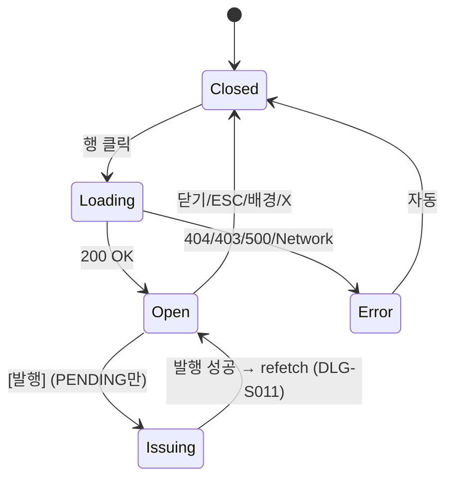

# DLG-S010 세금계산서 상세 — 기본화면 (마스터)

> 이 문서는 **다이얼로그 마스터 스펙**입니다. `01~03` 상태 문서는 이 문서를 상속(override/delta)합니다.
> 세금계산서 1건의 상세 정보를 조회(read-only)하고, 상태가 `PENDING` 인 경우 [발행] 버튼으로 DLG-S011을 트리거한다.

---

## 0. 메타 & 원천 참조

| 항목 | 값 |
|------|----|
| 다이얼로그 ID | DLG-S010 |
| 다이얼로그명 | 세금계산서 상세 |
| 도메인 | D03-매출관리 |
| 부모 화면 | SCR-S010 세금계산서발행 |
| 트리거 조건 | `onClick` 세금계산서 목록 행 클릭 |
| 확인 레벨 | L0 (조회형, 서버 변경 없음) |
| 서버 호출 여부 | ✅ `GET /tax_invoices/:id` (supabase `.select('*').eq('id',id).single()`) |
| 닫기 옵션 | ✅ ESC/배경/X = 즉시 닫힘 (조회 전용이므로 항상 허용) |
| 역할 | owner, manager, fc |
| 파일 경로 | `src/app/tax-invoices/page.tsx` 내 `TaxInvoiceDetailModal` |
| 우선순위 | P1 |
| 중첩 호출 | DLG-S011 세금계산서 발행(상태 `PENDING`일 때만) |

### 원천 문서 링크
| 문서 | 경로 | 섹션 |
|---|---|---|
| 화면설계서(기획) | `docs/화면설계서/매출관리.md` | §세금계산서 |
| 기능명세서 | `docs/기능명세서/매출관리.md` | §세금계산서(국세청 e-Tax 연동) |
| 상태전이도 | `docs/상태전이도.md` | tax_invoices PENDING/ISSUED/CANCELLED |
| 에러코드정의서 | `docs/에러코드정의서.md` | §매출 E4xx310~, §공통 E404001/E500001 |
| 다이어그램 M1 | `docs/다이어그램/D03_매출관리/DLG-S010_세금계산서상세/M1_모달생명주기.md` | 로딩 → 열림 → 닫힘 |
| 다이어그램 M2 | `docs/다이어그램/D03_매출관리/DLG-S010_세금계산서상세/M2_필드검증.md` | — (조회 전용) |
| 다이어그램 M3 | `docs/다이어그램/D03_매출관리/DLG-S010_세금계산서상세/M3_결과분기.md` | 로딩 결과 분기 |
| DLG-S011 | `docs/화면설계서/D03-매출관리/DLG-S011-세금계산서발행/` | 중첩 발행 모달 |

---

## 1. 다이얼로그 목적 (Why)

세금계산서 1건의 **공급자 · 공급받는자 · 금액 · 품목 · 발행 상태**를 통합 표시한다.
- 상태가 `PENDING` 인 건에 대해 직접 **[발행]** 액션을 연결하여 국세청 e-Tax로 전송(via DLG-S011).
- 상태가 `ISSUED`/`CANCELLED` 인 건은 **조회 전용**.
- `supply_amount · tax_amount · total_amount` 의 합계식을 화면상 재검산 가능.

---

## 2. 화면 레이아웃 (Wireframe)

### 2.1 풀뷰 (PENDING 상태 기준)

```
  backdrop: bg-black/40
  ┌─────────────────────────────────────────────────┐
  │   ┌─────────────────────────────────────┐      │
  │   │ 📄 세금계산서 상세             [X] │      │ ← Header 56px
  │   ├─────────────────────────────────────┤      │
  │   │ 발행 번호       2026-04-0000123     │      │
  │   │ 거래처명        (주)핏지니           │      │
  │   │ 사업자번호      123-45-67890          │      │
  │   │ ──────────────────────────────       │      │
  │   │ 공급가액        ₩1,000,000           │      │
  │   │ 세액            ₩100,000             │      │
  │   │ 합계            ₩1,100,000  (bold)   │      │
  │   │ ──────────────────────────────       │      │
  │   │ 발행일          -                    │      │
  │   │ 상태            [대기] (warning)      │      │
  │   ├─────────────────────────────────────┤      │
  │   │ 품목                                 │      │
  │   │  ┌─────────────────────────────┐    │      │
  │   │  │ PT 30회      ₩800,000       │    │      │
  │   │  │ 락커 6개월   ₩200,000       │    │      │
  │   │  └─────────────────────────────┘    │      │
  │   ├─────────────────────────────────────┤      │
  │   │         [ 닫기 ]  [ 발행 ]         │      │ ← PENDING 일 때만
  │   └─────────────────────────────────────┘      │
  └─────────────────────────────────────────────────┘
```

### 2.2 ISSUED / CANCELLED 변형

```
  Footer: [ 닫기 ]   ← 전체폭 버튼, 발행 버튼 숨김
  발행일: 2026-04-18
  상태: [발행완료](success) 또는 [취소](error)
```

### 2.3 영역/치수표

| 영역 | 치수 | 역할 |
|---|---|---|
| Backdrop | `fixed inset-0 bg-black/40 z-40` | 배경 |
| Modal | `w-full max-w-md` (480px) | 카드 |
| Header | 56px | 아이콘 `FileText` + 제목 + X |
| InfoBlock A | auto | 발행번호/거래처/사업자번호 |
| InfoBlock B | auto | 금액(공급/세액/합계) |
| InfoBlock C | auto | 발행일/상태 |
| ItemsBlock | auto (max-h 200px scroll) | 품목 리스트 |
| Footer | 56px | [닫기] / [닫기][발행] |

---

## 3. 디자인 토큰

### 3.1 색상

| 토큰 | 클래스 | 용도 |
|---|---|---|
| backdrop | `fixed inset-0 bg-black/40 z-40` | 배경 |
| card | `bg-white rounded-2xl shadow-xl ring-1 ring-gray-100` | 카드 |
| icon.wrap | `bg-blue-50 rounded-full size-10` | 아이콘 래퍼 |
| info.label | `text-gray-500 text-sm` | 라벨 셀 |
| info.value | `text-gray-900 text-sm font-medium` | 값 셀 |
| info.amount | `text-gray-900 text-sm font-medium tabular-nums` | 금액 셀 |
| info.total | `text-lg font-bold text-gray-900 tabular-nums` | 합계 |
| divider | `border-t border-gray-100 my-3` | 블록 구분 |
| items.row | `flex justify-between p-2 bg-gray-50 rounded text-sm` | 품목 행 |
| badge.pending | `bg-amber-100 text-amber-800` | 상태 대기 |
| badge.issued | `bg-emerald-100 text-emerald-800` | 상태 발행완료 |
| badge.cancelled | `bg-rose-100 text-rose-700` | 상태 취소 |
| btn.close | `h-10 px-4 rounded-lg border border-gray-300 bg-white hover:bg-gray-50 text-sm font-medium text-gray-700` | Secondary |
| btn.issue | `h-10 px-4 rounded-lg bg-blue-600 hover:bg-blue-700 text-white text-sm font-medium` | Primary (PENDING) |

### 3.2 타이포

| 토큰 | 값 |
|---|---|
| title | `text-lg font-semibold text-gray-900` |
| row.label | `text-sm text-gray-500` |
| row.value | `text-sm font-medium text-gray-900` |
| total | `text-lg font-bold text-gray-900 tabular-nums` |

### 3.3 간격/반경/모션
- 카드 `rounded-2xl p-0`, 본문 `p-6 space-y-3`
- enter: `animate-[fadeInUp_140ms_ease-out]`, `motion-reduce:animate-none`

---

## 4. 반응형 규칙

| BP | 모달 폭 |
|---|---|
| Mobile <640 | `w-[calc(100%-32px)] max-w-sm` |
| Tablet/Desktop | `max-w-md` |

품목이 많을 때는 `max-h-[50vh] overflow-auto` 적용.

---

## 5. 🔐 역할별(RBAC) 매트릭스

| 요소 | superAdmin | primary | owner | manager | fc | trainer | staff | front |
|---|:---:|:---:|:---:|:---:|:---:|:---:|:---:|:---:|
| 세금계산서 조회 | ● | ● | ● | ● | ● | — | — | — |
| [발행] 버튼(PENDING) | ● | ● | ● | ● | — | — | — | — |
| [닫기]/ESC/배경 | ● | ● | ● | ● | ● | — | — | — |

### 멀티테넌트
- `branch_id` 스코프로 RLS 적용. 다른 지점 세금계산서 접근 시 404 처리.
- super/primary는 본사 전 지점 조회 가능.

---

## 6. 컴포넌트 트리

```tsx
<Modal isOpen={isOpen} onClose={onClose} title="세금계산서 상세" size="md">
  {isLoading ? (
    <TaxInvoiceDetailSkeleton />
  ) : taxInvoice ? (
    <>
      <section className="p-6 space-y-3 border-b">
        <InfoRow label="발행 번호" value={taxInvoice.invoice_number} mono />
        <InfoRow label="거래처명" value={taxInvoice.company_name} />
        <InfoRow label="사업자번호" value={formatBizNumber(taxInvoice.business_number)} mono />
        <hr className="border-gray-100" />
        <InfoRow label="공급가액" value={formatKRW(taxInvoice.supply_amount)} amount />
        <InfoRow label="세액" value={formatKRW(taxInvoice.tax_amount)} amount />
        <InfoRow label="합계" value={formatKRW(taxInvoice.total_amount)} amount total />
        <hr className="border-gray-100" />
        <InfoRow label="발행일" value={taxInvoice.issued_at ?? '-'} />
        <InfoRow label="상태"
          value={<StatusBadge label={INV_STATUS_KO[taxInvoice.status]}
                              variant={INV_STATUS_VARIANT[taxInvoice.status]} />} />
      </section>
      <section className="p-6">
        <h4 className="text-sm font-semibold mb-3">품목</h4>
        <ul className="space-y-1 text-sm max-h-[200px] overflow-auto">
          {taxInvoice.items?.map((it, i) => (
            <li key={i} className="flex justify-between p-2 bg-gray-50 rounded">
              <span>{it.name}</span>
              <span className="tabular-nums">{formatKRW(it.amount)}</span>
            </li>
          ))}
        </ul>
      </section>
      <footer className="p-4 border-t flex gap-3">
        <Button variant="outline" className="flex-1" onClick={onClose}>닫기</Button>
        {canIssue(taxInvoice, role) && (
          <Button variant="primary" className="flex-1"
                  onClick={() => setShowIssueModal(true)}>발행</Button>
        )}
      </footer>
    </>
  ) : null}
</Modal>

<TaxInvoiceIssueModal         // DLG-S011
  isOpen={showIssueModal}
  taxInvoice={taxInvoice}
  onClose={() => setShowIssueModal(false)}
  onIssued={() => fetchTaxInvoiceDetail(taxInvoice.id)}
/>
```

### 컴포넌트 명세

| 컴포넌트 | Props | 재사용 여부 |
|---|---|---|
| `Modal` | `{isOpen, onClose, title, size}` | 전역 공용 |
| `TaxInvoiceDetailModal` | `{isOpen, onClose, taxInvoiceId}` | 전용 |
| `TaxInvoiceDetailSkeleton` | — | 전용(상태 01-로딩) |
| `InfoRow` | `{label, value, amount?, total?, mono?}` | 전역 공용 |
| `StatusBadge` | `{label, variant: 'warning'|'success'|'error'}` | 전역 공용 |
| `TaxInvoiceIssueModal` (DLG-S011) | 중첩 | D03 전용 |

---

## 7. 데이터 계약

### 7.1 타입

```ts
// src/types/tax-invoice.ts
export type TaxInvoiceStatus = 'PENDING' | 'ISSUED' | 'CANCELLED';

export interface TaxInvoice {
  id: number;
  branch_id: number;
  invoice_number: string;            // "2026-04-0000123"
  company_name: string;              // 공급받는 자
  business_number: string;           // "1234567890" (raw, 포맷 별도)
  supply_amount: number;             // 공급가액
  tax_amount: number;                // 세액 (= supply * 0.1)
  total_amount: number;              // 합계 (= supply + tax)
  issued_at: string | null;          // YYYY-MM-DD
  status: TaxInvoiceStatus;
  items: TaxInvoiceItem[];
  created_at: string;
}

export interface TaxInvoiceItem {
  name: string;
  amount: number;
}
```

### 7.2 API 계약

| 항목 | 값 |
|---|---|
| 엔드포인트 | `GET /tax_invoices/:id` (supabase `.select('*').eq('id', id).single()`) |
| 성공(200) | `{ data: TaxInvoice, error: null }` |
| 실패(404) | `{ data: null, error: { code:'PGRST116' } }` |
| 실패(403) | RLS 위반 |
| 실패(500) | 기타 |

### 7.3 상태 전이

```
closed → loading(01) → open(02) | error(03)
                                ↳ closed (ESC/배경/X)
```

---

## 8. 비즈니스 룰

1. **권한 가드**: 클라이언트 `role ∈ {superAdmin, primary, owner, manager, fc}` + RLS SELECT 정책.
2. **조회 전용**: 본 다이얼로그 자체는 서버 변경을 발생시키지 않는다.
3. **발행 분기**: `taxInvoice.status === 'PENDING' && role ∈ {superAdmin,primary,owner,manager}` 일 때만 [발행] 렌더.
4. **세액 검산**: UI에서 `supply * 0.1 === tax` 및 `supply + tax === total` 검증(불일치 시 경고 배너 옵션).
5. **사업자번호 포맷**: raw 10자리 → `XXX-XX-XXXXX` 하이픈 포맷(공용 `formatBizNumber`).
6. **품목 스크롤**: 10건 초과 시 `max-h-[200px] overflow-auto`.
7. **DLG-S011 연동**: 발행 성공 시 부모(`TaxInvoiceDetailModal`)가 `fetchTaxInvoiceDetail(id)` 재호출하여 상태 갱신.
8. **ISSUED 후 취소 불가**: UI에 "발행 후 취소는 국세청 수정 신고 필요"라는 툴팁 제공(Phase 2).
9. **감사로그**: 조회는 서버에 남기지 않음(비민감). 발행은 DLG-S011에서 처리.

---

## 9. 상태 목록

| 파일 | 상태 코드 | 한글 | 트리거 |
|---|---|---|---|
| `01-로딩.md` | `loading` | 로딩 | SCR-S010 행 클릭 + GET 진행 |
| `02-열림.md` | `open` | 열림 | GET 성공 → 렌더 |
| `03-에러.md` | `error` | 에러 | GET 실패(404/403/500/Network) |

---

## 10. 에러 코드 매핑

| errorCode / PG code | HTTP | 시나리오 | 표시 | 다음 상태 |
|---|---|---|---|---|
| PGRST116 | 404 | 해당 ID 없음 or RLS 필터 | 토스트 "존재하지 않는 항목" | 닫힘 |
| E403001 / 42501 | 403 | 권한 없음 | 토스트 "조회 권한이 없습니다" | 닫힘 |
| E500001 | 500 | 서버 오류 | 토스트 "일시적 오류" | 닫힘 |
| NETWORK | — | 네트워크 | 토스트 "네트워크 오류" | 닫힘 |
| E401002 | 401 | 세션 만료 | DLG-000 우선 | 자동 정리 |

---

## 11. 접근성 (WCAG 2.1 AA)

| 항목 | 요구사항 |
|---|---|
| role | `role="dialog"` + `aria-modal="true"` |
| 라벨 | `aria-labelledby="dlg-s010-title"` |
| 포커스 | 오픈 시 [닫기] 버튼 자동 포커스 |
| Tab trap | 닫기 → (발행) → X → 닫기 |
| 키보드 | `Esc`=닫기 |
| 스크린리더 | 금액 필드 `aria-label="공급가액 백만원"` 형태 |
| 배지 | `role="status"` + 텍스트 라벨 |
| 모션 감소 | `motion-reduce:animate-none` |

---

## 12. 진입/이탈 연결

### 진입
- SCR-S010 `02-정상` 목록 행 클릭
- SCR-S001 매출상세 → 관련 세금계산서 링크(Phase 2)

### 이탈

| 액션 | 목적지 |
|---|---|
| [닫기] / ESC / 배경 / X | SCR-S010 |
| [발행] 클릭 | DLG-S011 오픈(본 다이얼로그 유지) |
| DLG-S011 발행 완료 | 본 다이얼로그 재조회 |
| 404/403 에러 | 자동 닫힘 → SCR-S010 |

---

## 13. 다이어그램 통합 뷰



참조: `docs/다이어그램/D03_매출관리/DLG-S010_세금계산서상세/M1_모달생명주기.md`

---

## 14. 🧩 바이브코딩 프롬프트 (마스터)

```
Next.js 15 App Router + TypeScript + Tailwind v4 + Supabase 기반
'use client' 컴포넌트를 작성하라.

━━ 다이얼로그: DLG-S010 세금계산서 상세 (마스터) ━━
부모: src/app/tax-invoices/page.tsx
파일: src/app/tax-invoices/_components/TaxInvoiceDetailModal.tsx
타입: src/types/tax-invoice.ts

━━ Props ━━
interface Props {
  isOpen: boolean;
  onClose: () => void;
  taxInvoiceId: number | null;
}

━━ 상태 ━━
const [isLoading, setIsLoading] = useState(false);
const [taxInvoice, setTaxInvoice] = useState<TaxInvoice | null>(null);
const [showIssueModal, setShowIssueModal] = useState(false);
const { role } = useAuthStore();

━━ 로드 ━━
useEffect(() => {
  if (!isOpen || !taxInvoiceId) return;
  fetchTaxInvoiceDetail(taxInvoiceId);
}, [isOpen, taxInvoiceId]);

const fetchTaxInvoiceDetail = async (id: number) => {
  setIsLoading(true);
  const { data, error } = await supabase
    .from('tax_invoices')
    .select('*')
    .eq('id', id)
    .single();
  if (error) {
    toast.error(mapInvoiceError(error));
    onClose();
  } else {
    setTaxInvoice(data);
  }
  setIsLoading(false);
};

━━ 발행 가능 판정 ━━
const canIssue = (inv: TaxInvoice, role: Role) =>
  inv.status === 'PENDING'
  && ['superAdmin','primary','owner','manager'].includes(role);

━━ 렌더 (본문 요약, 풀 코드는 §6 참조) ━━
<Modal isOpen={isOpen} onClose={onClose} title="세금계산서 상세" size="md">
  {isLoading
    ? <TaxInvoiceDetailSkeleton />
    : taxInvoice
    ? <DetailView inv={taxInvoice} onIssue={() => setShowIssueModal(true)} role={role} />
    : null}
</Modal>
<TaxInvoiceIssueModal
  isOpen={showIssueModal}
  taxInvoice={taxInvoice!}
  onClose={() => setShowIssueModal(false)}
  onIssued={() => taxInvoice && fetchTaxInvoiceDetail(taxInvoice.id)}
/>

━━ 상태 맵 ━━
const INV_STATUS_KO = { PENDING: '대기', ISSUED: '발행완료', CANCELLED: '취소' };
const INV_STATUS_VARIANT = { PENDING: 'warning', ISSUED: 'success', CANCELLED: 'error' };

━━ 에러 매핑 ━━
function mapInvoiceError(err: any): string {
  if (err?.code === 'PGRST116') return '존재하지 않는 세금계산서입니다.';
  if (err?.code === '42501') return '조회 권한이 없습니다.';
  if (err?.message?.includes('Failed to fetch')) return '네트워크 오류';
  return '데이터를 불러올 수 없습니다.';
}

━━ 디자인 토큰 (정확히) ━━
backdrop:   fixed inset-0 z-40 bg-black/40
card:       bg-white rounded-2xl shadow-xl ring-1 ring-gray-100
header:     p-4 border-b flex items-center
title:      text-lg font-semibold text-gray-900
row:        flex justify-between text-sm
row.label:  text-gray-500
row.value:  font-medium text-gray-900
amount:     font-medium text-gray-900 tabular-nums
total:      text-lg font-bold text-gray-900 tabular-nums
badge.warning: bg-amber-100 text-amber-800 px-2 py-0.5 rounded-full text-xs
badge.success: bg-emerald-100 text-emerald-800 px-2 py-0.5 rounded-full text-xs
badge.error:   bg-rose-100 text-rose-700 px-2 py-0.5 rounded-full text-xs
items.row:  flex justify-between p-2 bg-gray-50 rounded text-sm
btn.close:  h-10 px-4 rounded-lg border border-gray-300 bg-white hover:bg-gray-50 text-sm font-medium text-gray-700
btn.issue:  h-10 px-4 rounded-lg bg-blue-600 hover:bg-blue-700 text-white text-sm font-medium

━━ 의존 ━━
import { supabase } from '@/lib/supabase';
import { useAuthStore } from '@/stores/authStore';
import { formatKRW, formatBizNumber } from '@/lib/format';
import { FileText } from 'lucide-react';
import toast from 'react-hot-toast';

━━ QA ━━
- 로딩 중 스켈레톤 6행 + 품목 박스 skeleton
- PENDING + 권한 있을 때만 [발행] 렌더
- ISSUED/CANCELLED는 [닫기] 전체폭
- 공급가액*0.1 ≠ 세액 시 경고 배너(옵션)
- 404/403/500 자동 닫힘 + 토스트
- ESC/배경/X 즉시 닫힘
- DLG-S011 발행 성공 시 자동 refetch
```

---

## 15. QA 체크리스트 (수용 기준)

- [ ] 목록 행 클릭 시 `01-로딩` → `02-열림` 플로우
- [ ] 로딩 스켈레톤 최소 6행 + 품목 영역 노출
- [ ] `PENDING` 상태 + 권한 시에만 [발행] 버튼 렌더
- [ ] `ISSUED`/`CANCELLED` 상태는 [닫기] 전체폭
- [ ] `supply_amount + tax_amount === total_amount` 자동 검증
- [ ] 사업자번호 `XXX-XX-XXXXX` 포맷
- [ ] 품목 10건 초과 시 내부 스크롤
- [ ] StatusBadge 색상: warning/success/error 정확
- [ ] PGRST116(404) / 42501(403) 시 자동 닫힘 + 토스트
- [ ] ESC/배경/X 즉시 닫힘 (조회 전용)
- [ ] Tab trap + role=dialog 정상
- [ ] 모바일 360px 가독성
- [ ] DLG-S011 발행 성공 시 detail refetch
- [ ] 세션 만료 시 DLG-000 우선
