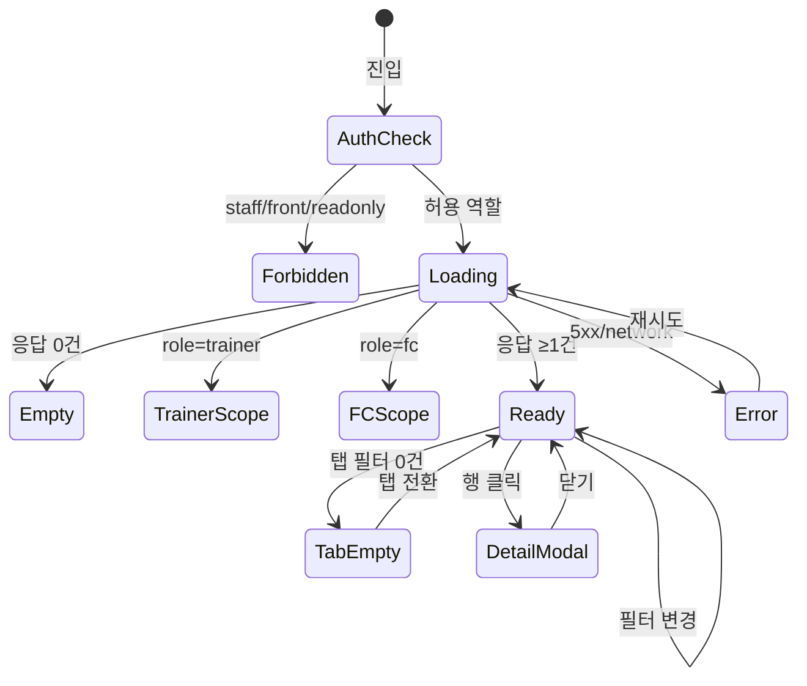

# SCR-S001 매출 현황 — 기본화면 (마스터)

> 이 문서는 **화면 마스터 스펙**입니다. `01~07` 상태 문서는 이 문서를 상속(override/delta)합니다.
> 상태별 파일은 "변경점(델타)만" 기술하며, 이 문서에 정의된 레이아웃/토큰/컴포넌트/데이터/권한/접근성은 **기본값**으로 적용됩니다.

---

## 0. 메타 & 원천 참조

| 항목 | 값 |
|------|----|
| 화면 ID | SCR-S001 (구 SCR-030) |
| 화면명 | 매출 현황 |
| 도메인 | D03-매출관리 |
| 경로 | `/sales` |
| Next.js Route Group | `(dashboard)` |
| 파일 경로 | `src/app/sales/page.tsx` |
| 페이지 컴포넌트 | `Sales` |
| pageId | `970` |
| 역할 | `superAdmin`, `primary`, `owner`, `manager`, `fc`(제한), `trainer`(제한) — `staff`/`front`/`readonly` 접근 불가 |
| 우선순위 | P0 |
| 플랫폼 | 데스크톱(우선) / 태블릿 / 모바일 |
| 멀티테넌트 | ✅ `branchId` 강제 스코프 |
| i18n | ko-KR, 금액 `₩` KRW |

### 원천 문서 링크
| 문서 종류 | 경로 | 참조 섹션 |
|---|---|---|
| 화면설계서 | `docs/화면설계서/매출관리.md` | §SCR-S001 (행 26~228) |
| 기능명세서 | `docs/기능명세서/매출관리.md` | §1 매출 현황 |
| 공통 UI 패턴 | `docs/화면설계서/공통.md` | §2.2 권한 매트릭스, §3 공통 UI |
| 상태전이도 | `docs/상태전이도.md` | §2 결제 상태 전이 (COMPLETED/UNPAID/REFUNDED/PENDING) |
| 에러코드정의서 | `docs/에러코드정의서.md` | §4.4 매출/결제 E4xx300~399, E402001, E402002, E503001, E503002 |
| KPI 정의서 | `docs/KPI_정의서.md` | §매출/결제 자동화 — POS 결제 자동화율, 매출 목표 달성률 |
| 권한 매트릭스 | `docs/다이어그램/10_권한매트릭스/R1_역할화면_매트릭스.md` | `/sales` SCR-030 |
| 다이어그램 F1 진입 | `docs/다이어그램/D03_매출관리/SCR-S001_매출현황/F1_진입.md` | 권한체크 → 로딩 → 정상/빈/에러 |
| 다이어그램 F2 메인 | `docs/다이어그램/D03_매출관리/SCR-S001_매출현황/F2_메인.md` | 탭 전환, 필터 적용, 행 클릭 |
| 다이어그램 F3 버튼액션 | `docs/다이어그램/D03_매출관리/SCR-S001_매출현황/F3_버튼액션.md` | BTN_POS, BTN_EXCEL, BTN_PRESET |
| 다이어그램 F5 모달트리거 | `docs/다이어그램/D03_매출관리/SCR-S001_매출현황/F5_모달트리거.md` | DLG-S001 매출상세 |
| 다이어그램 F6 상태별 | `docs/다이어그램/D03_매출관리/SCR-S001_매출현황/F6_상태별.md` | 7상태 (로딩/정상/빈/탭빈/에러/트레이너/FC) |
| 다이어그램 F7 권한 | `docs/다이어그램/D03_매출관리/SCR-S001_매출현황/F7_권한.md` | 역할별 분기 |
| 다이어그램 F8 에러 | `docs/다이어그램/D03_매출관리/SCR-S001_매출현황/F8_에러.md` | E400300, E402xxx, E404300, E503xxx |

---

## 1. 화면 목적 (Why)

센터의 **모든 매출 거래를 조회·분석**하는 매출 도메인의 진입점.
- 기간/상품/결제수단/담당자별 집계를 탭 단위로 제공 (7개 탭)
- 환불·미납 내역을 별도 탭으로 분리하여 건전성 모니터링
- POS 신규 결제, 엑셀 내보내기, 매출 상세 팝업의 허브 역할
- 트레이너는 본인 담당만, FC는 POS 버튼만, 매니저 이상은 전체 분석 — **권한별 뷰 차등** 필수

---

## 2. 화면 레이아웃 (Wireframe)

### 2.1 풀뷰 와이어프레임 (데스크톱 1440px)

```
┌─ AppLayout ────────────────────────────────────────────────────────────┐
│ ┌─ Sidebar ──┐ ┌─ Main ───────────────────────────────────────────────┐│
│ │ 매출(icon) │ │ [PageHeader]                                         ││
│ │ > 매출현황 │ │  매출 현황                [신규 결제(POS)] [엑셀]    ││
│ │   POS      │ │  센터의 매출 거래 전체를 조회하고 분석합니다.         ││
│ │   통계     │ │ ──────────────────────────────────────────────────── ││
│ │   ...      │ │ [StatCardGrid — 4열]                                 ││
│ │            │ │ ┌─순매출──┐┌─카드결제─┐┌─현금결제─┐┌─미수금───┐   ││
│ │            │ │ │ ₩1.2억  ││ ₩8천만   ││ ₩2천만   ││ ₩1천만   │   ││
│ │            │ │ │+5.3% ↑  ││          ││          ││border-error│  ││
│ │            │ │ └─────────┘└──────────┘└──────────┘└───────────┘   ││
│ │            │ │ ──────────────────────────────────────────────────── ││
│ │            │ │ 기간 [오늘] [이번주] [이번달(active)]                ││
│ │            │ │ [🔍 구매자/상품명…] [유형▼] [상태▼] [시작일]~[종료일]││
│ │            │ │ ──────────────────────────────────────────────────── ││
│ │            │ │ 매출유형(TAB-001): [전체][신규][재등록][휴면복귀]     ││
│ │            │ │                    [종목추가][업그레이드]             ││
│ │            │ │ ──────────────────────────────────────────────────── ││
│ │            │ │ TabNav                                                ││
│ │            │ │ [매출내역][기간별][상품별][결제수단][담당자]           ││
│ │            │ │ [환불내역(N)][미납내역(N)]                            ││
│ │            │ │ ──────────────────────────────────────────────────── ││
│ │            │ │ [DataTable] — 탭별 컬럼 변경 (TAB-001은 22컬럼)       ││
│ │            │ │ No│구매일│유형│상품명│구매자│담당자│금액│결제│...    ││
│ │            │ │ ──────────────────────────────────────────────────── ││
│ │            │ │ [하단 요약바]                                         ││
│ │            │ │ 총매출 ₩X | 순매출 ₩X | 현금 ₩X | 카드 ₩X            ││
│ │            │ │ 마일리지 ₩X | 환불 ₩X | 미납 ₩X | 할인 ₩X            ││
│ │            │ └─────────────────────────────────────────────────────┘│
│ └────────────┘                                                         │
└────────────────────────────────────────────────────────────────────────┘
```

### 2.2 영역별 치수 / 역할

| 영역 | 위치 | 치수/그리드 | 역할 |
|------|------|-------------|------|
| PageHeader | 상단 | `h-auto py-4` | 제목 + 액션 버튼 (POS·엑셀) |
| StatCardGrid | Header 하단 | `grid grid-cols-2 md:grid-cols-4 gap-4` | 4개 통계 카드 |
| 기간 프리셋 | 통계 하단 | `flex gap-2` | [오늘][이번주][이번달] |
| SearchFilter | 프리셋 하단 | `flex flex-wrap gap-2` | 검색·유형·상태·날짜 |
| 매출유형 필터 | TAB-001 전용 | `flex gap-1` | 5개 round 버튼 |
| TabNav | 필터 하단 | `border-b` | 7개 탭 + 환불/미납 배지 |
| DataTable | 본문 | `w-full overflow-x-auto` | 탭별 컬럼 가변 |
| 요약바 | 페이지 하단 | `sticky bottom-0 h-14` | 8개 합계 |

---

## 3. 디자인 토큰

### 3.1 색상
| 역할 | 클래스 | 용도 |
|------|--------|------|
| bg.page | `bg-gray-50` | 전체 배경 |
| bg.card | `bg-white rounded-xl shadow-sm ring-1 ring-gray-100` | StatCard |
| stat.peach | `bg-orange-50 text-orange-700 ring-orange-100` | 순매출 (매출 도메인 대표색) |
| stat.default | `bg-white text-gray-900 ring-gray-100` | 카드/현금 |
| stat.error | `border-state-error/20 bg-white` | 미수금 >0 강조 |
| state.error | `text-state-error` (`text-red-600`) | 미수금 값 >0, 환불금액 |
| state.success | `text-state-success` (`text-green-600`) | 완료 상태 |
| state.warning | `text-state-warning` (`text-amber-600`) | 미납 상태 |
| badge.round.신규 | `bg-blue-100 text-blue-700` | roundBadge |
| badge.round.재등록 | `bg-green-100 text-green-700` | roundBadge |
| badge.round.휴면복귀 | `bg-yellow-100 text-yellow-700` | roundBadge |
| badge.round.종목추가 | `bg-purple-100 text-purple-700` | roundBadge |
| badge.round.업그레이드 | `bg-orange-100 text-orange-700` | roundBadge |
| link.buyer | `text-primary hover:underline` | 구매자/상품명 링크 |
| row.hover | `hover:bg-gray-50` | 행 hover |

### 3.2 타이포그래피
| 토큰 | 스타일 | 용도 |
|------|--------|------|
| page.title | `text-2xl font-bold tracking-tight text-gray-900` | "매출 현황" |
| page.subtitle | `text-sm text-gray-500` | "센터의 매출 거래…" |
| stat.label | `text-xs uppercase tracking-wide font-medium text-gray-500` | 카드 라벨 |
| stat.value | `text-3xl font-bold tabular-nums text-gray-900` | 카드 값 |
| table.th | `text-xs font-semibold text-gray-600 uppercase tracking-wide` | 테이블 헤더 |
| table.td | `text-sm text-gray-900` | 일반 셀 |
| table.money | `text-sm font-semibold tabular-nums text-gray-900` | 금액 셀 |
| table.error | `text-sm text-state-error font-bold` | 미수금 >0 |
| summary.label | `text-xs text-gray-500` | 요약바 라벨 |
| summary.value | `text-sm font-semibold tabular-nums` | 요약바 값 |

### 3.3 간격/반경
| 토큰 | 값 |
|------|----|
| page.padding | `p-6 lg:p-8` |
| section.gap | `space-y-4` |
| card.radius | `rounded-xl` |
| card.padding | `p-5` |
| table.row.height | `h-11` (44px) |
| filter.gap | `gap-2` |

### 3.4 모션
- StatCard enter: `animate-[fadeInUp_150ms_ease-out]`
- 테이블 스켈레톤: `animate-pulse`
- 탭 전환: `transition-colors duration-150`

---

## 4. 반응형 규칙

| BP | 폭 | StatCard | SearchFilter | DataTable | Footer 요약 |
|----|----|----------|--------------|-----------|-------------|
| Mobile <640 | 100% | 2열 | 세로 스택 | 가로 스크롤 (고정 컬럼: No·구매일·상품명·금액) | 2열 그리드 |
| Tablet 640~1024 | 100% | 4열 | 2열 | 가로 스크롤 | 4열 |
| Desktop ≥1024 | sidebar+main | 4열 | 한 줄 | 전체 노출 | 8열 수평 |

모바일에서 요약바는 `sticky bottom-0`, StatCardGrid는 가로 스크롤 옵션 허용.

---

## 5. 🔐 역할별(RBAC) 매트릭스

> `●` = 표시+액션 가능, `○` = 조회만, `—` = 미표시/차단
> 멀티테넌트: `primary/super`는 지점 전환 드롭다운, 그 외는 `branchId` 고정

### 5.1 요소 × 역할

| 요소 | primary/super | owner | manager | fc | trainer | staff | front | readonly |
|---|:---:|:---:|:---:|:---:|:---:|:---:|:---:|:---:|
| **페이지 접근** | ● | ● | ● | ●(제한) | ●(제한) | — | — | — |
| 신규 결제(POS) 버튼 | ● | ● | ● | ● | — | — | — | — |
| 엑셀 다운로드 | ● | ● | ● | — | ○(담당만) | — | — | — |
| **StatCard** | | | | | | | | |
| 순매출 | ● | ● | ● | ○ | ○(담당) | — | — | — |
| 카드/현금 결제 | ● | ● | ● | ○ | ○ | — | — | — |
| 미수금 | ● | ● | ● | — | — | — | — | — |
| **탭 접근** | | | | | | | | |
| TAB-001 매출내역 | ● | ● | ● | ●(담당) | ●(담당) | — | — | — |
| TAB-002 기간별 | ● | ● | ● | ● | — | — | — | — |
| TAB-003 상품별 | ● | ● | ● | ● | — | — | — | — |
| TAB-004 결제수단별 | ● | ● | ● | — | — | — | — | — |
| TAB-005 담당자별 | ● | ● | ● | ● | ○(본인만) | — | — | — |
| TAB-006 환불내역 | ● | ● | ● | ○ | ○(담당) | — | — | — |
| TAB-007 미납내역 | ● | ● | ● | ○ | — | — | — | — |
| **행 액션** | | | | | | | | |
| 행 클릭 → DLG-S001 | ● | ● | ● | ● | ●(담당) | — | — | — |
| 상품명 → 상품 상세 | ● | ● | ● | ● | ○ | — | — | — |
| 구매자 → 회원 상세 | ● | ● | ● | ● | ●(담당) | — | — | — |
| 결제 취소 진입 | ● | ● | ● | — | — | — | — | — |

### 5.2 제한 역할 뷰 요약

- **trainer**: 자동 필터 `staffId = user.id` + "본인 담당 매출만 표시됩니다." info 배너. TAB-004/005 숨김, TAB-007 숨김.
- **fc**: 매출 조회는 가능하나 환불/미납 탭 읽기 전용, 엑셀 다운로드 차단. POS 버튼은 활성.
- **staff/front/readonly**: 라우트 가드 → `/forbidden`.

### 5.3 권한 판별 코드
```ts
type Role = 'superAdmin'|'primary'|'owner'|'manager'|'fc'|'trainer'|'staff'|'front'|'readonly';
export const canAccessSales      = (r: Role) => ['superAdmin','primary','owner','manager','fc','trainer'].includes(r);
export const canSeeRevenueAll    = (r: Role) => ['superAdmin','primary','owner','manager','fc'].includes(r);
export const canExportSalesExcel = (r: Role) => ['superAdmin','primary','owner','manager'].includes(r);
export const canOpenPOS          = (r: Role) => ['superAdmin','primary','owner','manager','fc'].includes(r);
export const isTrainerScope      = (r: Role) => r === 'trainer';
export const canSeeUnpaid        = (r: Role) => ['superAdmin','primary','owner','manager','fc'].includes(r);
```

---

## 6. 컴포넌트 트리

```
<AppLayout role={user.role}>
  <Sidebar active="sales" />
  <MainContent>
    <PageHeader title="매출 현황"
                subtitle="센터의 매출 거래 전체를 조회하고 분석합니다.">
      {canOpenPOS(role) && <Button onClick={() => moveToPage(982)}>신규 결제 (POS)</Button>}
      {canExportSalesExcel(role) && <Button variant="outline" onClick={exportExcel}>엑셀</Button>}
    </PageHeader>

    {isTrainerScope(role) && (
      <Banner tone="info">본인 담당 매출만 표시됩니다.</Banner>
    )}

    <StatCardGrid>
      <StatCard label="순 매출"   value={formatKRW(summary.netTotal)} variant="peach" icon={<DollarSign/>}
                delta={deltas.netTotal} />
      <StatCard label="카드 결제" value={formatKRW(summary.card)}    variant="default" icon={<CreditCard/>} />
      <StatCard label="현금 결제" value={formatKRW(summary.cash)}    variant="default" icon={<Wallet/>} />
      <StatCard label="미수금"    value={formatKRW(summary.unpaid)}  variant="default" icon={<AlertCircle/>}
                className={summary.unpaid > 0 ? 'border-state-error/20' : ''} />
    </StatCardGrid>

    <FilterBar>
      <PresetGroup active={activePreset} onChange={handlePreset} options={['오늘','이번주','이번달']} />
      <SearchFilter
        searchPlaceholder="구매자 또는 상품명 검색..."
        filters={[
          { key: 'dateRange', label: '날짜 범위', type: 'dateRange' },
          { key: 'type',      label: '유형',     type: 'multiSelect', options: ['이용권','PT','상품','기타'] },
          { key: 'status',    label: '상태',     type: 'multiSelect', options: ['완료','환불','미납'] },
        ]}
        values={filterValues} onChange={setFilterValues}
        debounceMs={300} />
    </FilterBar>

    {activeTab === 'TAB-001' && (
      <RoundFilter value={roundFilter}
        onChange={v => setRoundFilter(prev => prev === v ? '' : v)}
        options={['신규','재등록','휴면복귀','종목추가','업그레이드']} />
    )}

    <TabNav tabs={TABS_FOR_ROLE[role]} active={activeTab} onChange={setActiveTab} />

    {activeTab === 'TAB-002' && (
      <PeriodUnitToggle value={periodUnit} onChange={setPeriodUnit} options={['일별','주별','월별']} />
    )}

    <DataTable
      columns={COLUMNS_BY_TAB[activeTab]}
      data={dataByTab[activeTab]}
      loading={isLoading}
      emptyMessage={emptyMessageByTab[activeTab]}
      onRowClick={row => ['TAB-001','TAB-006','TAB-007'].includes(activeTab) && openDetail(row)}
      pagination={{ page, pageSize, total, onChange: setPage }}
    />

    <SummaryBar summary={summary} />

    <DetailModal
      open={showDetail}
      sale={selectedSale}
      onClose={() => setShowDetail(false)}
      onGotoMember={id => moveToPage(985, { id })}
      onCancel={id => moveToPage('/payment-cancel', { saleId: id })}
      onReprintReceipt={() => { ... }}
    />
  </MainContent>
</AppLayout>
```

### 6.1 핵심 컴포넌트
| 컴포넌트 | 파일 | 핵심 Props |
|---|---|---|
| `StatCard` | `src/components/common/StatCard.tsx` | `{label, value, variant, icon, delta, className}` |
| `SearchFilter` | `src/components/common/SearchFilter.tsx` | `{searchPlaceholder, filters, values, onChange, debounceMs}` |
| `TabNav` | `src/components/common/TabNav.tsx` | `{tabs, active, onChange}` (`tabs[i]` 에 `badge?: number`) |
| `DataTable` | `src/components/common/DataTable.tsx` | `{columns, data, loading, emptyMessage, onRowClick, pagination}` |
| `RoundFilter` | `src/components/sales/RoundFilter.tsx` | toggle 5-option |
| `SummaryBar` | `src/components/sales/SummaryBar.tsx` | `{summary}` sticky footer |
| `DetailModal` | `src/components/sales/SaleDetailModal.tsx` | DLG-S001 |

---

## 7. 데이터 계약

### 7.1 TypeScript 타입

```ts
// src/types/sales.ts
export type SaleStatus = 'COMPLETED' | 'PENDING' | 'UNPAID' | 'REFUNDED';
export type PaymentMethod = 'CARD' | 'CASH' | 'TRANSFER' | 'MILEAGE';
export type SaleRound = '신규'|'재등록'|'휴면복귀'|'종목추가'|'업그레이드'|'';

export interface SaleItem {
  id: number;
  no: number;
  purchaseDate: string;        // YYYY-MM-DD
  type: string;                // 이용권/PT/상품/기타
  productName: string;
  manager: string;             // staffName
  buyer: string;               // memberName
  buyerId: number;
  round: SaleRound;
  quantity: number;
  originalPrice: number;
  salePrice: number;
  discountPrice: number;
  paymentMethod: PaymentMethod | '';
  paymentType: string;
  paymentTool: string;         // 한글 매핑
  cash: number;
  card: number;
  mileage: number;             // mileageUsed
  cardCompany: string;
  cardNumber: string;
  approvalNo: string;
  unpaid: number;
  serviceDays: number;
  serviceCount: number;
  servicePoints: number;
  status: '완료'|'미납'|'환불'|'대기'|'';
  category: string;
  memo: string;
}

export interface SalesSummary {
  total: number; netTotal: number;
  card: number; cash: number; mileage: number;
  unpaid: number; discount: number; refund: number;
}
```

### 7.2 API 계약

| 항목 | 값 |
|---|---|
| 엔드포인트 | `GET /sales?branchId={id}&from={YYYY-MM-DD}&to={YYYY-MM-DD}` |
| 내부 | `supabase.from('sales').select(...).eq('branchId', getBranchId()).order('saleDate', {ascending:false})` |
| 성공(200) | `{ success:true, data: SaleItem[] }` |
| 실패(401) | 세션 만료 → `/login?redirect=/sales` |
| 실패(403) | 잘못된 `branchId` → `/forbidden` |
| 실패(404) | E404300 — (정상 응답 0건과 구분) |
| 실패(500) | E500001 |
| 실패(503) | E503001 결제단말기 / E503002 PG 연동 (배너 안내) |

**trainer 자동 필터**: 서버는 `jwt.role === 'trainer'`이면 `staffId = user.id` 강제. 클라는 UX용 배너만.

### 7.3 상태 관리
- **Store**: `useAuthStore(user/role/branchId)`
- **Fetching**: React Query `useSalesQuery(filters)` — `staleTime: 60_000`, `refetchOnWindowFocus: true`
- **로컬 상태**: `searchValue`, `debouncedSearch`, `activePreset`, `filterValues`, `activeTab`, `roundFilter`, `periodUnit`, `sortKey`, `sortDir`, `page`, `selectedSale`, `showDetail`
- **파생값(`useMemo`)**: `filteredData`, `summary`, `periodData`, `productData`, `paymentData`, `staffData`

---

## 8. 비즈니스 룰

### 8.1 매출/환불 기본
1. **stale 데이터 방지**: 진입 시 1회 자동 조회 + 탭 전환/필터 변경 시 **클라이언트 필터**만(재호출 X, 기본).
2. **필터 상태 기본값**: 날짜=이번달 1일~말일, 유형=[], 상태=[], 프리셋=`이번달`.
3. **검색 debounce**: 300ms. `item.buyer.includes(q) || item.productName.includes(q)`.
4. **정렬**: saleDate 내림차순 기본. 금액/상태 토글.
5. **요약바 계산**: §M 기능명세 §L 로직 그대로 — `netTotal = total - refund`.
6. **미수금 강조**: `unpaid > 0`인 셀은 `text-state-error font-bold`.
7. **환불 구분**: `status === '환불'`인 건은 집계 탭에서 제외(총매출 집계에 불포함).
8. **매출유형 토글**: 같은 값 재클릭 시 `''`(전체) 복귀.

### 8.2 권한
9. 서버는 JWT `role`/`branchId`로 스코프 강제. 클라 `role-access`는 UX용.
10. trainer: 데이터 자동 필터 + 매출유형/결제수단/미납 탭 숨김, info 배너.
11. fc: 엑셀 다운로드/환불 처리 차단, POS는 허용.
12. staff/front/readonly: 페이지 진입 시 `/forbidden` 리다이렉트.

### 8.3 엑셀
13. `exportToExcel(filteredData, exportColumns, { filename: '매출내역' })`.
14. 성공 시 `toast.success(\`${N}건 엑셀 다운로드 완료\`)`.
15. 실패 시 `toast.error('엑셀 다운로드에 실패했습니다.')`.

### 8.4 행 액션
16. TAB-001/006/007에서만 `onRowClick` 활성 → DLG-S001 매출상세.
17. 상품명 클릭 → `moveToPage(971)`. 구매자 클릭 → `moveToPage(985,{id:buyerId})`.

---

## 9. 상태 목록

| 파일 | 상태 코드 | 한글 | 트리거 |
|---|---|---|---|
| `01-로딩.md` | `sales-loading` | 로딩 | 진입 직후, API pending |
| `02-정상.md` | `sales-ready` | 정상 | 데이터 수신 완료 (≥1건) |
| `03-빈상태.md` | `sales-empty` | 전체 빈 상태 | 응답 배열 0건 |
| `04-탭-빈상태.md` | `sales-tab-empty` | 탭 빈 상태 | 현재 탭 필터 결과 0건 (다른 탭은 데이터 有) |
| `05-에러.md` | `sales-error` | 에러 | 500/503/네트워크 실패 |
| `06-트레이너-제한.md` | `sales-trainer-scope` | 트레이너 제한 | `role === 'trainer'` 진입 |
| `07-FC-제한.md` | `sales-fc-scope` | FC 제한 | `role === 'fc'` 진입 |

상태 전이: `docs/다이어그램/D03_매출관리/SCR-S001_매출현황/F6_상태별.md`.

---

## 10. 에러 코드 매핑

| errorCode | HTTP | 사용자 메시지 | UI 대응 |
|---|---|---|---|
| E400300 | 400 | 결제 금액 오류 | 행 클릭 시 빨간 인라인 안내 |
| E400301 | 400 | 환불 금액 초과 | DLG-S013/015 인라인 |
| E401001 | 401 | 세션 만료 | `/login?redirect=/sales` |
| E402001 | 402 | 결제 처리 실패 (PG) | 상세 모달 내 배너 |
| E402002 | 402 | 카드 승인 실패 | 상세 모달 내 배너 |
| E404300 | 404 | 매출 내역 없음 | 상세 모달 빈 상태 |
| E409300 | 409 | 이미 환불된 매출 | disabled + toast.warning |
| E500001 | 500 | 서버 오류 | 05-에러 상태 + 재시도 |
| E503001 | 503 | 결제 단말기 연결 실패 | amber 배너 |
| E503002 | 503 | PG사 연동 오류 | amber 배너 |
| NETWORK | — | 네트워크 연결 확인 | 05-에러 + 오프라인 감지 |

---

## 11. 접근성 (WCAG 2.1 AA)

| 항목 | 요구사항 |
|---|---|
| 대비비율 | 본문 4.5:1, 링크 4.5:1, 요약바 3:1 이상 |
| 랜드마크 | `<main>` + 각 `<section aria-label>` |
| 테이블 | `<table role="table">` + `<th scope="col">` + 정렬 버튼 `aria-sort` |
| 탭 | `role="tablist"`, `aria-selected`, 키보드 좌/우 화살표 |
| 필터 | 각 input에 `<label>` 연결, 날짜범위는 `fieldset` |
| 에러 배너 | `role="alert" aria-live="assertive"` |
| 금액 | `tabular-nums` + 스크린리더용 `aria-label="원화"` 유의 |
| 포커스 | `focus-visible:ring-2 ring-blue-500 ring-offset-2` |
| 모션 감소 | `prefers-reduced-motion` 시 fadeInUp 제거 |

---

## 12. 진입/이탈 연결

### 진입
- 사이드바 > 매출관리 > 매출 현황
- 본사대시보드 §B "월별 매출" 차트 → "전체보기" 링크
- POS 결제 완료 화면 → "매출 현황으로" 버튼

### 이탈
| 액션 | 목적지 |
|---|---|
| 신규 결제(POS) | `/pos` (SCR-S002) |
| 상품명 클릭 | `/products/detail?id=` |
| 구매자 클릭 | `/members/detail?id=` |
| 행 클릭 | DLG-S001 (같은 라우트 내) |
| 결제 취소 (모달 내) | `/payment-cancel?saleId=` |
| 사이드바 이동 | 타 도메인 |

---

## 13. 다이어그램 통합 뷰



---

## 14. 🧩 바이브코딩 프롬프트 (마스터)

```
Next.js 15 App Router + TypeScript + Tailwind + Supabase + React Query 기반
'use client' 컴포넌트로 작성하라.

━━ 화면: SCR-S001 매출 현황 (D03 매출관리) ━━
파일: src/app/sales/page.tsx
보조:
- src/components/common/StatCard.tsx, SearchFilter.tsx, TabNav.tsx, DataTable.tsx
- src/components/sales/RoundFilter.tsx, SummaryBar.tsx, SaleDetailModal.tsx
- src/hooks/useSales.ts (React Query)
- src/lib/role-access.ts (canExportSalesExcel, canOpenPOS, isTrainerScope 등)
- src/types/sales.ts (SaleItem, SaleStatus, SalesSummary)
- src/lib/format.ts (formatKRW, formatNumber)

━━ 레이아웃 ━━
<AppLayout role={user.role}>
  <main className="min-h-screen bg-gray-50 p-6 lg:p-8 space-y-4">
    <PageHeader title="매출 현황"
                subtitle="센터의 매출 거래 전체를 조회하고 분석합니다.">
      {canOpenPOS(role) && <Button onClick={() => moveToPage(982)}>신규 결제 (POS)</Button>}
      {canExportSalesExcel(role) && (
        <Button variant="outline" onClick={handleDownloadExcel}>엑셀</Button>
      )}
    </PageHeader>

    {isTrainerScope(role) && (
      <div role="status" className="rounded-lg border border-blue-200 bg-blue-50 p-3 text-sm text-blue-800">
        본인 담당 매출만 표시됩니다.
      </div>
    )}

    <section aria-label="주요 지표" className="grid grid-cols-2 md:grid-cols-4 gap-4">
      <StatCard label="순 매출"   value={formatKRW(summary.netTotal)} variant="peach" icon={<DollarSign/>} />
      <StatCard label="카드 결제" value={formatKRW(summary.card)}    icon={<CreditCard/>} />
      <StatCard label="현금 결제" value={formatKRW(summary.cash)}    icon={<Wallet/>} />
      <StatCard label="미수금"    value={formatKRW(summary.unpaid)}  icon={<AlertCircle/>}
                className={summary.unpaid > 0 ? 'border-state-error/20' : ''} />
    </section>

    <div className="flex items-center gap-2">
      {['오늘','이번주','이번달'].map(p => (
        <button key={p} onClick={() => handlePreset(p)}
          className={cn('h-9 px-3 rounded-lg border text-sm transition-colors',
            activePreset===p ? 'bg-primary text-surface border-primary' : 'bg-white text-gray-700 border-gray-300')}>
          {p}
        </button>
      ))}
    </div>

    <SearchFilter
      searchPlaceholder="구매자 또는 상품명 검색..."
      searchValue={searchValue} onSearchChange={setSearchValue}
      filters={[
        { key:'dateRange', label:'날짜 범위', type:'dateRange' },
        { key:'type',      label:'유형',     type:'multiSelect', options:['이용권','PT','상품','기타'] },
        { key:'status',    label:'상태',     type:'multiSelect', options:['완료','환불','미납'] },
      ]}
      values={filterValues} onChange={setFilterValues}
      onReset={handleResetFilters}
    />

    {activeTab === 'TAB-001' && (
      <div className="flex flex-wrap gap-1">
        {['신규','재등록','휴면복귀','종목추가','업그레이드'].map(r => (
          <button key={r}
            onClick={() => setRoundFilter(prev => prev === r ? '' : r)}
            className={cn('h-8 px-3 rounded-full text-xs font-medium',
              roundFilter===r ? 'bg-primary text-surface' : 'bg-gray-100 text-gray-700')}>
            {r}
          </button>
        ))}
      </div>
    )}

    <TabNav
      tabs={[
        { key:'TAB-001', label:'매출 내역' },
        { key:'TAB-002', label:'기간별 매출' },
        { key:'TAB-003', label:'상품별 내역' },
        { key:'TAB-004', label:'결제수단별' },
        { key:'TAB-005', label:'담당자별' },
        { key:'TAB-006', label:'환불 내역', badge: refundCount },
        { key:'TAB-007', label:'미납 내역', badge: unpaidCount },
      ].filter(t => isTabVisible(t.key, role))}
      active={activeTab} onChange={setActiveTab}
    />

    {activeTab === 'TAB-002' && (
      <div className="flex gap-1">
        {['일별','주별','월별'].map(u => (
          <button key={u} onClick={() => setPeriodUnit(u)}
            className={cn('h-8 px-3 text-xs rounded',
              periodUnit===u ? 'bg-primary text-surface' : 'bg-gray-100 text-gray-700')}>
            {u}
          </button>
        ))}
      </div>
    )}

    <DataTable
      columns={COLUMNS_BY_TAB[activeTab]}
      data={dataByTab[activeTab]}
      loading={isLoading}
      emptyMessage={<EmptyState icon={DollarSign} text="매출 데이터가 없습니다." />}
      onRowClick={['TAB-001','TAB-006','TAB-007'].includes(activeTab) ? handleRowClick : undefined}
      pagination={{ page, pageSize: 50, total: filteredData.length, onChange: setPage }}
    />

    <div className="sticky bottom-0 bg-white border-t border-gray-200 px-6 py-3 flex items-center gap-6 text-sm tabular-nums">
      <span>총매출 <b>{formatKRW(summary.total)}</b></span>
      <span>순매출 <b className="text-primary">{formatKRW(summary.netTotal)}</b></span>
      <span>현금 {formatKRW(summary.cash)}</span>
      <span>카드 {formatKRW(summary.card)}</span>
      <span>마일리지 {formatKRW(summary.mileage)}</span>
      <span className="text-state-error">환불 -{formatKRW(summary.refund)}</span>
      <span className="text-state-warning">미납 {formatKRW(summary.unpaid)}</span>
      <span>할인 -{formatKRW(summary.discount)}</span>
    </div>

    <SaleDetailModal open={showDetail} sale={selectedSale}
      onClose={() => setShowDetail(false)}
      onGotoMember={id => moveToPage(985, { id })}
      onCancel={id => moveToPage('/payment-cancel', { saleId: id })} />
  </main>
</AppLayout>

━━ 디자인 토큰 ━━
bg.page:        bg-gray-50
stat.peach:     bg-orange-50 text-orange-700 ring-1 ring-orange-100 rounded-xl p-5
stat.default:   bg-white ring-1 ring-gray-100 rounded-xl p-5 shadow-sm
stat.label:     text-xs uppercase tracking-wide font-medium text-gray-500
stat.value:     text-3xl font-bold tabular-nums text-gray-900
table.row:      h-11 border-b border-gray-100 hover:bg-gray-50
money.cell:     text-sm font-semibold tabular-nums text-gray-900
money.error:    text-sm font-bold tabular-nums text-state-error
badge.신규:     bg-blue-100 text-blue-700 text-xs px-2 py-0.5 rounded-full
badge.재등록:   bg-green-100 text-green-700 ...
badge.휴면복귀: bg-yellow-100 text-yellow-700 ...
badge.종목추가: bg-purple-100 text-purple-700 ...
badge.업그레이드: bg-orange-100 text-orange-700 ...
status.완료:    variant=success dot
status.환불:    variant=error dot
status.미납:    variant=warning dot
status.대기:    variant=default dot

━━ 데이터 & 훅 ━━
type SaleItem = ...  // §7.1 참조
const { data, isLoading, error } = useSales({ branchId, from, to })
const filteredData = useMemo(() => filterByAll(data, debouncedSearch, filterValues, roundFilter), ...)
const summary = useMemo(() => calcSummary(filteredData), ...)
const periodData = useMemo(() => groupByPeriod(filteredData, periodUnit), ...)
...(productData, paymentData, staffData 동일)

━━ trainer 자동 필터 ━━
if (role === 'trainer') {
  filterValues.staffId = user.id // 서버 강제 + UX 배너
}

━━ 엑셀 다운로드 ━━
const handleDownloadExcel = () => {
  try {
    exportToExcel(filteredData, EXPORT_COLUMNS_22, { filename: '매출내역' });
    toast.success(`${filteredData.length}건 엑셀 다운로드 완료`);
  } catch (e) {
    toast.error('엑셀 다운로드에 실패했습니다.');
  }
};

━━ 에러 처리 ━━
useEffect(() => {
  if (error) {
    console.error('매출 데이터 로드 실패:', error);
    toast.error('매출 데이터를 불러오지 못했습니다.');
  }
}, [error]);

━━ 접근성 ━━
- <main aria-labelledby="sales-title">
- <table role="table"> 각 th scope="col", 정렬 가능 컬럼 aria-sort
- TabNav role="tablist", 각 tab role="tab" aria-selected
- 트레이너 배너 role="status"
- 에러 배너 role="alert" aria-live="assertive"
- 요약바 role="contentinfo" aria-label="매출 요약"

━━ 반응형 ━━
- 모바일: StatCard 2열, 테이블 가로 스크롤(고정 컬럼 No/구매일/상품명/금액), 요약바 2열 그리드
- 태블릿: StatCard 4열, 필터 2열
- 데스크톱: 풀 레이아웃

━━ QA 체크 ━━
- 진입 시 이번달 기본 필터로 로드
- trainer 진입 시 info 배너 + 본인 담당 자동 필터
- staff/front 진입 시 /forbidden
- 탭 전환 시 컬럼 교체 & 행 클릭 조건 변화 (TAB-001/006/007만)
- 매출유형 버튼 토글 동작
- 필터 리셋 시 이번달/공백으로 복귀
- 금액 셀 tabular-nums 정렬
- 미수금 >0 시 error 색 + bold
- 엑셀 다운로드 후 success toast + 건수
- 요약바 sticky 하단 고정
- 네트워크 오류 시 05-에러 상태
```

---

## 15. QA 체크리스트 (수용 기준)

- [ ] 허용 역할 (super/primary/owner/manager/fc/trainer) 진입 가능, 그 외 `/forbidden`
- [ ] trainer 진입 시 info 배너 + staffId 자동 필터 + 숨김 탭(TAB-004/007)
- [ ] fc 진입 시 엑셀 버튼 미노출, POS 버튼 활성
- [ ] 이번달 기본 필터 로드 + 기간 프리셋 3개 동작
- [ ] 검색 300ms debounce, 구매자명·상품명 match
- [ ] 매출유형 버튼 토글 (동일값 재클릭 시 전체 복귀)
- [ ] 7개 탭 전환 + 컬럼 교체 + 집계 탭은 행 클릭 비활성
- [ ] TAB-001/006/007 행 클릭 → DLG-S001 상세 모달
- [ ] 상품명 클릭 → 상품 상세, 구매자 클릭 → 회원 상세
- [ ] 순매출/카드/현금/미수금 StatCard 정확 계산 (환불 제외)
- [ ] 요약바 8개 값 정확, sticky 하단 고정
- [ ] 엑셀 다운로드 22컬럼 + 건수 토스트
- [ ] 미수금 >0 셀 error 색상 + bold
- [ ] 0건 응답 시 03-빈상태, 탭 필터 0건 시 04-탭-빈상태
- [ ] 500/503/NETWORK 시 05-에러 + 재시도
- [ ] 키보드 Tab 흐름, 테이블 정렬 aria-sort, 탭 화살표 키
- [ ] prefers-reduced-motion 준수
