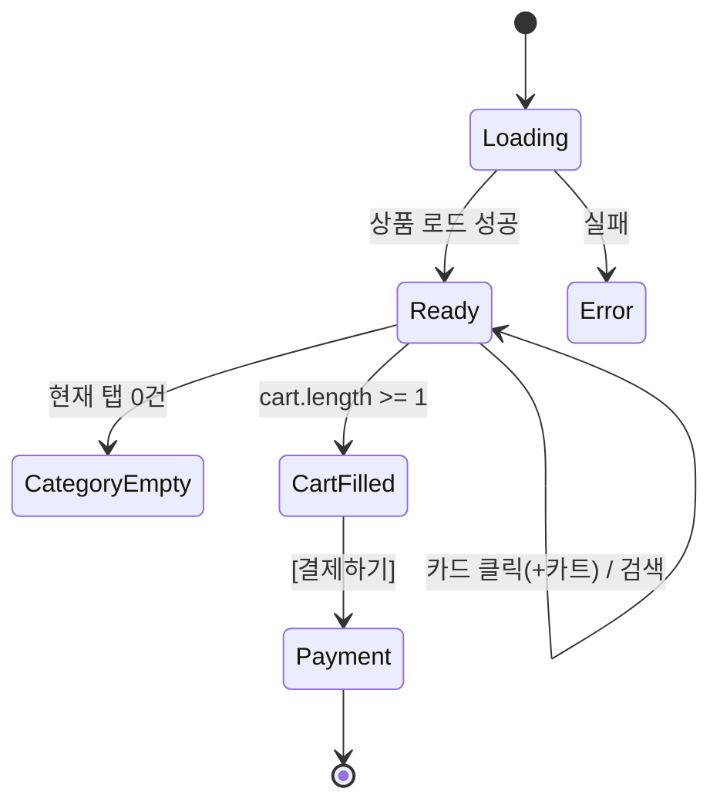

# SCR-S002 POS 판매 — 기본화면 (마스터)

> 이 문서는 **화면 마스터 스펙**입니다. `01~06` 상태 문서는 이 문서를 상속(delta)합니다.

---

## 0. 메타 & 원천 참조

| 항목 | 값 |
|------|----|
| 화면 ID | SCR-S002 (구 SCR-033) |
| 화면명 | POS 판매 |
| 도메인 | D03-매출관리 |
| 경로 | `/pos` |
| 파일 경로 | `src/app/pos/page.tsx` |
| 페이지 컴포넌트 | `SalesPos` |
| pageId | `971` (매출현황에서 참조 982는 `/pos/payment`) |
| 역할 | `superAdmin`, `primary`, `owner`, `manager`, `fc`, `trainer`(제한) — `staff`/`front` 정책 따름 |
| 우선순위 | P0 |
| 플랫폼 | 태블릿/데스크톱 우선 (현장 터치 지원) |
| 멀티테넌트 | ✅ `branchId` 기반 상품/회원 조회 |

### 원천 문서 링크
| 문서 | 경로 | 섹션 |
|---|---|---|
| 화면설계서 | `docs/화면설계서/매출관리.md` | §SCR-S002 |
| 기능명세서 | `docs/기능명세서/매출관리.md` | §2 POS 판매 |
| 공통 UI | `docs/화면설계서/공통.md` | §3 UI 패턴 |
| 에러코드정의서 | `docs/에러코드정의서.md` | §4.4 매출/결제 |
| 권한 매트릭스 | `docs/다이어그램/10_권한매트릭스/R1_역할화면_매트릭스.md` | `/pos` SCR-033 |
| 다이어그램 F1~F8 | `docs/다이어그램/D03_매출관리/SCR-S002_POS판매/` | 전체 |
| 관련 다이얼로그 | DLG-S002 (구매자검색) |

---

## 1. 화면 목적 (Why)

카테고리별 상품을 선택하고 장바구니에 담아 결제 페이지로 이동하는 **POS 인터페이스**.
- 피트니스 센터 프론트 데스크 현장 판매를 위한 터치 친화적 UI
- 상품 카드 클릭 한 번으로 장바구니 담기
- 회원 검색 → 구매자 지정 (마일리지 결제 준비)
- 결제 페이지(`SCR-S003`)로 `sessionStorage` 경유 데이터 전달

---

## 2. 화면 레이아웃 (Wireframe)

```
┌─ AppLayout ─────────────────────────────────────────────────────────────┐
│ [PageHeader] POS 판매                         [+ 상품 등록]             │
│ 카테고리별 상품을 선택하고 장바구니에 담아 결제로 이동합니다.             │
├──────────────────────────────┬──────────────────────────────────────────┤
│ 좌측 (flex-1)                │ 우측 (360px, sticky top-6)              │
│ ┌─ TabNav ──────────────┐   │ ┌─ CartPanel ──────────────────────┐   │
│ │ [이용권(N)][PT(N)]     │   │ │ 🛒 장바구니 (3)    [전체삭제]    │   │
│ │ [GX(N)][기타(N)]       │   │ ├───────────────────────────────────┤   │
│ │ [🔍 상품명 검색...]    │   │ │ 구매자: [김철수 010-1234 ✕]      │   │
│ └───────────────────────┘   │ │         또는 [🔍 회원 검색]       │   │
│ ┌─ ProductGrid ──────────┐  │ ├───────────────────────────────────┤   │
│ │ ┌─ ProductCard ─┐ ...   │  │ │ ┌─ CartItem ───────────────────┐ │   │
│ │ │[회원권] 재고3 │       │  │ │ │ 헬스 3개월          [✕]      │ │   │
│ │ │헬스 3개월     │       │  │ │ │ [-] 1 [+]  [현금][카드]      │ │   │
│ │ │📅30일 ⏱ -    │       │  │ │ │                     150,000원 │ │   │
│ │ │현금 150,000원 │       │  │ │ └───────────────────────────────┘ │   │
│ │ │카드 158,000원 │       │  │ │ ┌─ CartItem ───────────────────┐ │   │
│ │ │      [+ hover]│       │  │ │ │ PT 10회             [✕]      │ │   │
│ │ └───────────────┘       │  │ │ │ [-] 2 [+]  [현금][카드]      │ │   │
│ │ [다른 카드들...]         │  │ │ │                     800,000원 │ │   │
│ └─────────────────────────┘  │ │ └───────────────────────────────┘ │   │
│                              │ ├───────────────────────────────────┤   │
│                              │ │ 총 합계          950,000원        │   │
│                              │ │ [💳 결제하기]                     │   │
│                              │ └───────────────────────────────────┘   │
└──────────────────────────────┴──────────────────────────────────────────┘
```

### 영역 그리드
| 영역 | 그리드 | 비고 |
|---|---|---|
| ProductGrid | `grid grid-cols-2 md:grid-cols-3 lg:grid-cols-4 gap-4` | 카드 2~4열 반응형 |
| CartPanel | `w-[360px] sticky top-6 self-start` | 데스크톱 사이드 고정 |
| 모바일 CartPanel | `fixed bottom-0 left-0 right-0` drawer | 하단 시트 |

---

## 3. 디자인 토큰

### 3.1 색상
| 역할 | 클래스 | 용도 |
|---|---|---|
| bg.page | `bg-gray-50` | 전체 배경 |
| card.product | `bg-white rounded-xl ring-1 ring-gray-200 hover:ring-primary hover:shadow-md transition-all` | 상품 카드 |
| card.outofstock | `opacity-50 grayscale cursor-not-allowed` | 품절 |
| badge.MEMBERSHIP | `bg-blue-100 text-blue-700` | 회원권 |
| badge.LESSON | `bg-green-100 text-green-700` | 수강권 |
| badge.RENTAL | `bg-orange-100 text-orange-700` | 대여권 |
| badge.GENERAL | `bg-gray-100 text-gray-600` | 일반 |
| badge.stock.ok | `bg-green-100 text-green-700` | 재고 N개 |
| badge.stock.low | `bg-amber-100 text-amber-700` | 재고 부족 |
| badge.stock.out | `bg-red-100 text-red-700` | 품절 |
| price.cash | `text-primary font-bold` | 현금가 |
| price.card | `text-gray-600 font-medium` | 카드가 |
| cart.item | `bg-white rounded-lg border border-gray-100 p-3` | 카트 아이템 |
| cart.price.selected | `bg-primary text-surface` | 현금/카드 토글 선택 |

### 3.2 타이포
| 토큰 | 스타일 | 용도 |
|---|---|---|
| product.name | `text-sm/5 font-semibold text-gray-900 truncate` | 상품명 |
| product.meta | `text-xs text-gray-500` | 기간/횟수 |
| cart.name | `text-sm/5 font-semibold text-gray-900 truncate` | 카트 상품명 |
| cart.subtotal | `text-sm font-bold tabular-nums` | 소계 |
| total.label | `text-xs uppercase text-gray-500` | "총 합계" |
| total.value | `text-2xl font-bold tabular-nums text-primary` | 합계 값 |

### 3.3 간격
| 토큰 | 값 |
|---|---|
| page.padding | `p-6 lg:p-8` |
| card.padding | `p-4` |
| cart.padding | `p-5` |

### 3.4 모션
- 카드 hover: `transition-all duration-150` (+hover Plus 아이콘 fadeIn)
- 카트 추가: 카드가 카트 패널로 이동하는 스프링 애니 (prefers-reduced-motion 준수)
- 수량 변경: `transition-colors` 토글

---

## 4. 반응형 규칙
| BP | 폭 | ProductGrid | CartPanel |
|---|---|---|---|
| Mobile <640 | 100% | 2열 | **하단 시트** (Floating "장바구니 N" 버튼, 탭 시 펼침) |
| Tablet 640~1024 | 100% | 3열 | 하단 시트 or 우측 패널(가로) |
| Desktop ≥1024 | flex | 4열 | 우측 360px sticky |

---

## 5. 🔐 역할별 매트릭스

| 요소 | super/primary | owner | manager | fc | trainer | staff | front |
|---|:---:|:---:|:---:|:---:|:---:|:---:|:---:|
| 페이지 접근 | ● | ● | ● | ● | ●(제한) | — | — |
| [+ 상품 등록] 버튼 | ● | ● | ● | — | — | — | — |
| 카테고리 탭 전환 | ● | ● | ● | ● | ● | — | — |
| 상품 카드 클릭 | ● | ● | ● | ● | ● | — | — |
| 회원 검색 (DLG-S002) | ● | ● | ● | ● | ● | — | — |
| 결제하기 버튼 | ● | ● | ● | ● | ●(할인불가) | — | — |

권한 코드:
```ts
export const canOpenPOS       = (r: Role) => ['superAdmin','primary','owner','manager','fc','trainer'].includes(r);
export const canCreateProduct = (r: Role) => ['superAdmin','primary','owner','manager'].includes(r);
export const canApplyDiscount = (r: Role) => ['superAdmin','primary','owner','manager','fc'].includes(r);
```

---

## 6. 컴포넌트 트리

```
<AppLayout role={user.role}>
  <MainContent>
    <PageHeader title="POS 판매" subtitle="...">
      {canCreateProduct(role) && <Button onClick={() => moveToPage(997)}><Plus/> 상품 등록</Button>}
    </PageHeader>

    <div className="grid lg:grid-cols-[1fr_360px] gap-6">
      <div>
        <TabNav tabs={CATEGORY_TABS} active={activeTab} onChange={setActiveTab} />
        <SearchInput placeholder="상품명 검색..." value={q} onChange={setQ} />
        {isLoading ? <ProductGridSkeleton /> :
         products.length === 0 ? <CategoryEmpty /> :
         <ProductGrid>
           {filteredProducts.map(p => (
             <ProductCard key={p.id} product={p}
               onClick={() => !isOutOfStock(p) && handleAddToCart(p)} />
           ))}
         </ProductGrid>}
      </div>

      <CartPanel>
        <CartHeader count={cart.length} onClear={() => setCart([])} />
        <BuyerSection buyer={buyer} onSearch={openBuyerModal} onClear={() => setBuyer(null)} />
        <CartList>
          {cart.length === 0
            ? <EmptyCart />
            : cart.map(item => (
                <CartItem key={item.cartId} item={item}
                  onQuantityChange={handleQuantityChange}
                  onPriceType={handlePriceType}
                  onRemove={handleRemove} />
              ))}
        </CartList>
        <CartFooter>
          <TotalRow label="총 합계" value={formatNumber(subtotal)} />
          <Button fullWidth size="lg" disabled={cart.length === 0} onClick={handleCheckout}>
            결제하기
          </Button>
        </CartFooter>
      </CartPanel>
    </div>

    <BuyerSearchModal open={showBuyer} onClose={closeBuyer} onPick={setBuyer} /> {/* DLG-S002 */}
  </MainContent>
</AppLayout>
```

---

## 7. 데이터 계약

### 7.1 타입
```ts
export interface Product {
  id: number; name: string;
  category: '이용권'|'PT'|'GX'|'기타';
  cashPrice: number; cardPrice: number;
  period: string; count: string;
  productType: 'MEMBERSHIP'|'LESSON'|'RENTAL'|'GENERAL'|null;
  kiosk: boolean;
  stock: number | null;
}
export interface CartItem extends Product {
  cartId: string;
  priceType: 'cash'|'card';
  quantity: number;
}
export interface Member { id: number; name: string; phone: string; status?: string; }
```

### 7.2 API
| 항목 | 값 |
|---|---|
| 상품 조회 | `supabase.from('products').select(...).eq('branchId', getBranchId()).eq('active', true)` |
| 회원 검색 | `supabase.from('members').select('id,name,phone,status').eq('branchId', ...).or('name.ilike.%q%,phone.ilike.%q%').limit(10)` |
| 결제 | 본 화면 X. SCR-S003에서 처리 |
| sessionStorage | `posCart`, `posBuyer` 키로 결제 페이지 인계 |

### 7.3 상태 관리
- **로컬 상태**: `activeTab`, `q` (검색어), `cart: CartItem[]`, `buyer: Member | null`, `showBuyer`
- **Fetching**: React Query `useProducts(branchId, category)`
- **Cart Persistence**: 세션 중 메모리만. 새로고침 시 리셋 (sessionStorage 동기화 옵션)

---

## 8. 비즈니스 룰

1. **동일 상품 추가**: `cart`에 `(id, priceType='cash')` 동일 키 있으면 수량 +1. 다른 priceType은 별도 CartItem.
2. **수량 감소 0 이하**: 아이템 자동 제거 (`handleQuantityChange` 내부).
3. **품절 클릭**: `stock === 0` 시 `toast.warning('품절된 상품입니다.')`, 카드 opacity-50.
4. **재고 분기**: `null` 무제한, `>5` success 배지, `1~5` warning, `0` 품절.
5. **전체 삭제 확인**: 카트 3개 이상일 때 confirm 다이얼로그 "장바구니를 비우시겠습니까?".
6. **결제 이동**:
   - `cart.length === 0` 이면 버튼 disabled.
   - 클릭 시 `cartData` 변환 + `sessionStorage.setItem('posCart', JSON.stringify(cartData))`.
   - `buyer`가 있으면 `posBuyer` 저장, 없으면 제거.
   - `moveToPage(982)` → `/pos/payment`.
7. **마일리지 결제 준비**: 회원 미선택 시에도 POS에서는 경고 없음. 결제 페이지에서 유효성 검사.
8. **할인 적용**: 카트 아이템별 할인 드롭다운 (`canApplyDiscount` true에서만), trainer는 숨김.
9. **검색**: 클라이언트 필터 (실시간, `name.toLowerCase().includes(q.toLowerCase())`).
10. **탭 전환 시 검색어 유지** (세션).

---

## 9. 상태 목록

| 파일 | 상태 코드 | 한글 | 트리거 |
|---|---|---|---|
| `01-로딩.md` | `pos-loading` | 로딩 | 마운트 직후 |
| `02-정상-상품있음.md` | `pos-ready` | 상품 표시 | 응답 ≥1 |
| `03-카테고리-빈상태.md` | `pos-category-empty` | 카테고리 빈 | 해당 카테고리만 0건 |
| `04-품절-카드.md` | `pos-soldout-card` | 품절 카드 상태 | `stock === 0` 포함 |
| `05-장바구니-채워짐.md` | `pos-cart-filled` | 장바구니 채워짐 | `cart.length >= 1` |
| `06-빈장바구니.md` | `pos-cart-empty` | 장바구니 비어있음 | `cart.length === 0` |

---

## 10. 에러 코드 매핑

| errorCode | 시나리오 | 대응 |
|---|---|---|
| E401001 | 세션 만료 | `/login` |
| E403 | 권한 없음 | `/forbidden` |
| E500001 | 상품 로드 실패 | `toast.error` + 재시도 버튼 |
| E503001 | 키오스크/단말기 | 배너 안내 |
| NETWORK | 오프라인 | 배너 + 자동 재연결 감지 |

---

## 11. 접근성
- ProductCard: `role="button" tabIndex={0}`, Enter/Space = 장바구니 추가
- 품절 카드: `aria-disabled="true"` + 포커스 불가
- CartItem: 수량 `aria-label="수량 N"`, [-][+] 각각 aria-label
- CartPanel: `role="region" aria-label="장바구니"`
- BuyerSearch 모달: focus trap, ESC 닫기

---

## 12. 진입/이탈
### 진입
- 사이드바 > POS
- SCR-S001 매출 현황 [신규 결제 (POS)]

### 이탈
| 액션 | 목적지 |
|---|---|
| 결제하기 | `/pos/payment` (SCR-S003) |
| [+ 상품 등록] | `/products/new` |
| 회원 검색 | DLG-S002 |
| 사이드바 이동 | 타 도메인 |

---

## 13. 다이어그램 뷰


---

## 14. 🧩 바이브코딩 프롬프트 (마스터)

```
Next.js 15 App Router + TypeScript + Tailwind + Supabase 기반 'use client' 컴포넌트.

━━ 화면: SCR-S002 POS 판매 ━━
파일: src/app/pos/page.tsx
보조:
- src/components/pos/ProductCard.tsx, ProductGrid.tsx
- src/components/pos/CartPanel.tsx, CartItem.tsx
- src/components/pos/BuyerSearchModal.tsx (DLG-S002)
- src/hooks/useProducts.ts
- src/lib/role-access.ts (canCreateProduct, canApplyDiscount)

━━ 레이아웃 ━━
<main className="min-h-screen bg-gray-50 p-6 lg:p-8">
  <PageHeader title="POS 판매"
              subtitle="카테고리별 상품을 선택하고 장바구니에 담아 결제로 이동합니다.">
    {canCreateProduct(role) && <Button onClick={() => moveToPage(997)}><Plus/> 상품 등록</Button>}
  </PageHeader>

  <div className="grid lg:grid-cols-[1fr_360px] gap-6 mt-6">
    <div className="space-y-4">
      <TabNav tabs={[
        { key:'이용권', label:`이용권 (${count.이용권})` },
        { key:'PT',    label:`PT (${count.PT})` },
        { key:'GX',    label:`GX (${count.GX})` },
        { key:'기타',  label:`기타 (${count.기타})` },
      ]} active={activeTab} onChange={setActiveTab} />
      <Input leftIcon={<Search/>} placeholder="상품명 검색..." value={q} onChange={setQ} />
      <div className="grid grid-cols-2 md:grid-cols-3 lg:grid-cols-4 gap-4">
        {filteredProducts.map(p => <ProductCard key={p.id} product={p} onClick={handleAddToCart}/>)}
      </div>
    </div>

    <aside className="sticky top-6 self-start rounded-xl bg-white ring-1 ring-gray-200 p-5 space-y-4">
      <header className="flex items-center justify-between">
        <h2 className="text-sm font-semibold">🛒 장바구니 ({cart.length})</h2>
        {cart.length > 0 && (
          <button onClick={() => setCart([])} className="text-xs text-gray-500 hover:text-red-600">전체삭제</button>
        )}
      </header>
      <BuyerSection buyer={buyer} onSearch={openBuyerModal} onClear={() => setBuyer(null)} />
      <div className="space-y-2 max-h-[50vh] overflow-y-auto">
        {cart.length === 0 ? <EmptyCart /> : cart.map(item => <CartItem key={item.cartId} item={item} ... />)}
      </div>
      <div className="border-t border-gray-200 pt-3 flex items-baseline justify-between">
        <span className="text-xs uppercase text-gray-500">총 합계</span>
        <span className="text-2xl font-bold tabular-nums text-primary">{formatNumber(subtotal)}원</span>
      </div>
      <Button fullWidth size="lg" disabled={cart.length === 0} onClick={handleCheckout}>
        <CreditCard/> 결제하기
      </Button>
    </aside>
  </div>
</main>

━━ ProductCard ━━
<button role="button" aria-disabled={isOutOfStock}
  className={cn('bg-white rounded-xl ring-1 ring-gray-200 p-4 text-left relative group',
    'hover:ring-primary hover:shadow-md transition-all',
    isOutOfStock && 'opacity-50 grayscale cursor-not-allowed pointer-events-none')}>
  <div className="flex gap-1 mb-2">
    {PRODUCT_TYPE_BADGE[product.productType] && (
      <span className={cn('text-xs px-2 py-0.5 rounded-full', PRODUCT_TYPE_BADGE[product.productType].className)}>
        {PRODUCT_TYPE_BADGE[product.productType].label}
      </span>
    )}
    {stock !== null && <StockBadge stock={stock} />}
  </div>
  <h3 className="text-sm font-semibold truncate">{product.name}</h3>
  <p className="text-xs text-gray-500 flex items-center gap-1"><Calendar className="size-3"/>기간: {period}</p>
  <p className="text-xs text-gray-500 flex items-center gap-1"><Clock className="size-3"/>횟수: {count}</p>
  <div className="mt-2">
    <div className="text-sm font-bold text-primary tabular-nums">{formatNumber(cashPrice)}원</div>
    <div className="text-xs text-gray-600 tabular-nums">{formatNumber(cardPrice)}원</div>
  </div>
  <div className="absolute inset-0 flex items-center justify-center opacity-0 group-hover:opacity-100 transition">
    <div className="size-10 rounded-full bg-primary text-surface grid place-items-center"><Plus/></div>
  </div>
</button>

━━ 인터랙션 ━━
handleAddToCart(p): 동일 (id, priceType='cash') 존재하면 quantity+1, 아니면 새 CartItem 추가
handleQuantityChange(cartId, delta): q = max(1, q+delta), 0이면 remove
handlePriceType(cartId, type): 해당 아이템 priceType 교체
handleRemove(cartId): filter out
handleCheckout():
  const cartData = cart.map(c => ({
    id:c.id, name:c.name, category:c.category,
    price: c.priceType === 'cash' ? c.cashPrice : c.cardPrice,
    quantity: c.quantity,
  }));
  sessionStorage.setItem('posCart', JSON.stringify(cartData));
  if (buyer) sessionStorage.setItem('posBuyer', JSON.stringify(buyer));
  else sessionStorage.removeItem('posBuyer');
  moveToPage(982); // /pos/payment

━━ 접근성 ━━
- ProductCard role="button" tabIndex={0} onKeyDown Enter/Space 처리
- CartPanel role="region" aria-label="장바구니"
- 수량 표시 aria-label="수량 {N}"
- 품절 카드 aria-disabled="true"

━━ 디자인 토큰 ━━
badge.MEMBERSHIP: bg-blue-100 text-blue-700
badge.LESSON:     bg-green-100 text-green-700
badge.RENTAL:     bg-orange-100 text-orange-700
badge.GENERAL:    bg-gray-100 text-gray-600
badge.stock.ok:   bg-green-100 text-green-700
badge.stock.low:  bg-amber-100 text-amber-700
badge.stock.out:  bg-red-100 text-red-700
price.cash:       text-primary font-bold tabular-nums
price.card:       text-gray-600 font-medium tabular-nums
```

---

## 15. QA 체크리스트
- [ ] 권한 역할별 진입 가능/차단
- [ ] 4개 카테고리 탭 + 상품 수 배지
- [ ] 검색어 실시간 필터링
- [ ] 동일 상품 클릭 시 수량 증가
- [ ] 품절 카드 클릭 차단 + 토스트
- [ ] 재고 배지 3단계 (ok/low/out)
- [ ] 수량 [-][+] 동작, 1 이하로 감소 시 제거
- [ ] 현금/카드 토글 시 소계 재계산
- [ ] 회원 검색 모달 열림 + 선택 후 표시
- [ ] 장바구니 비어있을 때 결제 버튼 disabled
- [ ] 결제 클릭 시 sessionStorage 저장 + `/pos/payment` 이동
- [ ] 전체 삭제 → 3개 이상일 때 confirm
- [ ] 모바일에서 CartPanel이 하단 시트로 전환
- [ ] 접근성: 카드 키보드 조작, 장바구니 SR 라벨
