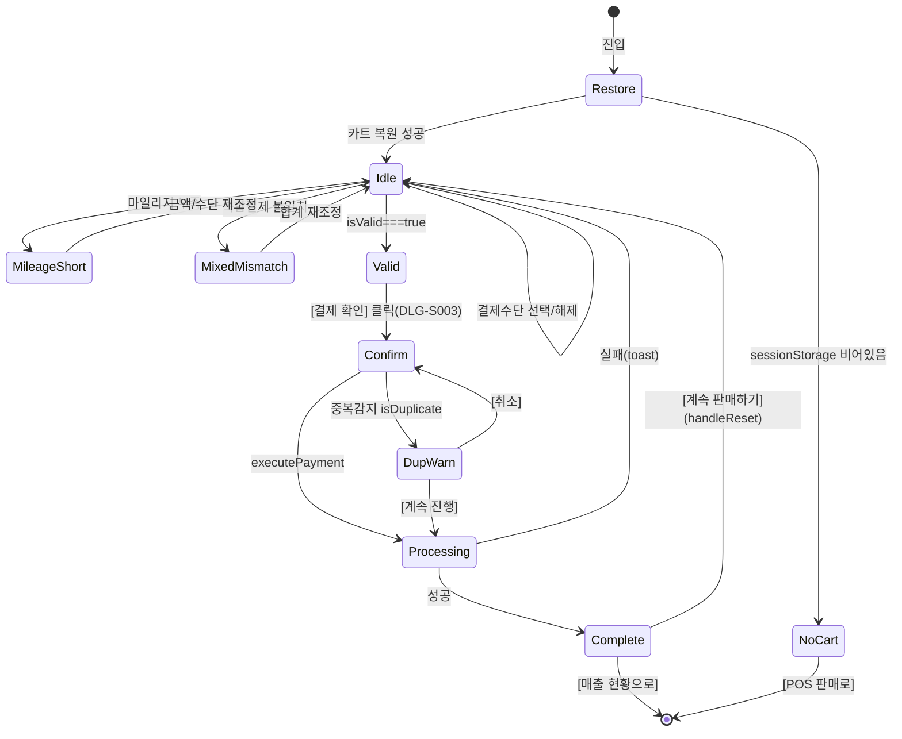

# SCR-S003 결제 처리 — 기본화면 (마스터)

> 이 문서는 **화면 마스터 스펙**입니다. `01~07` 상태 문서는 이 문서를 상속(override/delta)합니다.

---

## 0. 메타 & 원천 참조

| 항목 | 값 |
|------|----|
| 화면 ID | SCR-S003 |
| 화면명 | 결제 처리 |
| 도메인 | D03-매출관리 |
| 경로 | `/pos/payment` |
| Next.js Route Group | `(dashboard)` |
| 파일 경로 | `src/app/pos/payment/page.tsx` |
| 페이지 컴포넌트 | `PosPayment` |
| pageId | `982` |
| 역할 | `superAdmin`, `primary`, `owner`, `manager`, `fc`, `trainer`(제한) — `staff`/`front`/`readonly` 차단 |
| 우선순위 | P0 |
| 플랫폼 | 태블릿/데스크톱 우선 (프론트 데스크 현장) |
| 멀티테넌트 | ✅ `branchId` 강제 스코프 (sales INSERT 시) |
| i18n | ko-KR, 금액 `₩` KRW, 마일리지 `P` |

### 원천 문서 링크
| 문서 | 경로 | 섹션 |
|---|---|---|
| 화면설계서 | `docs/화면설계서/매출관리.md` | §SCR-S003 (행 455~662) |
| 기능명세서 | `docs/기능명세서/매출관리.md` | §3. POS 결제 처리 (`/pos/payment`) |
| 공통 UI | `docs/화면설계서/공통.md` | §3 공통 UI, §2.2 권한 매트릭스 |
| 상태전이도 | `docs/상태전이도.md` | §2 결제 상태 (PENDING/COMPLETED/UNPAID/REFUNDED) |
| 에러코드정의서 | `docs/에러코드정의서.md` | §4.4 매출/결제 E4xx300~399, E402001, E402002, E503001, E503002 |
| KPI 정의서 | `docs/KPI_정의서.md` | §매출/결제 자동화 — POS 결제 자동화율 |
| 권한 매트릭스 | `docs/다이어그램/10_권한매트릭스/R1_역할화면_매트릭스.md` | `/pos/payment` SCR-033 |
| 다이어그램 F1 진입 | `docs/다이어그램/D03_매출관리/SCR-S003_결제처리/F1_진입.md` | sessionStorage 복원 |
| 다이어그램 F2 메인 | `docs/다이어그램/D03_매출관리/SCR-S003_결제처리/F2_메인.md` | 결제수단 선택, 복합결제 |
| 다이어그램 F3 버튼액션 | `docs/다이어그램/D03_매출관리/SCR-S003_결제처리/F3_버튼액션.md` | BTN_PAY_CONFIRM, BTN_RESET |
| 다이어그램 F5 모달트리거 | `docs/다이어그램/D03_매출관리/SCR-S003_결제처리/F5_모달트리거.md` | DLG-S003, DLG-S004 |
| 다이어그램 F6 상태별 | `docs/다이어그램/D03_매출관리/SCR-S003_결제처리/F6_상태별.md` | 7상태(대기/유효성통과/처리중/완료/마일리지부족/복합불일치/장바구니없음) |
| 다이어그램 F7 권한 | `docs/다이어그램/D03_매출관리/SCR-S003_결제처리/F7_권한.md` | 역할별 할인적용/접근 |
| 다이어그램 F8 에러 | `docs/다이어그램/D03_매출관리/SCR-S003_결제처리/F8_에러.md` | E402xxx, E503xxx |
| 관련 다이얼로그 | DLG-S003 결제 확인, DLG-S004 중복 결제 경고 |

---

## 1. 화면 목적 (Why)

POS(SCR-S002)에서 담은 **장바구니 데이터를 결제로 마감**하는 결제 단계 화면.
- 결제수단 4종 (카드 / 현금 / 마일리지 / 복합결제) 선택 및 금액 분배 UI
- 회원 검색 → 구매자 지정 (마일리지 결제 시 필수)
- 할인 정책 드롭다운 (fc 이상 활성, trainer 비활성)
- 결제 확인 모달(DLG-S003) → 중복결제 검사(DLG-S004) → sales INSERT + 마일리지 적립
- 완료 화면: 영수증 출력 / 문자 발송 / 계속 판매 / 매출 현황 이동

---

## 2. 화면 레이아웃 (Wireframe)

### 2.1 결제 대기 화면 (2-컬럼 레이아웃)

```
┌─ AppLayout ─────────────────────────────────────────────────────────┐
│ [PageHeader] 결제 처리                                   [초기화]   │
│ 결제 정보를 확인하고 결제를 완료합니다.                              │
├─ 좌측 (flex-1) ──────────────────┬─ 우측 (380px sticky top-6) ─────┤
│ ┌─ 결제 상품 목록 ─────────────┐ │ ┌─ 결제수단 선택 ──────────────┐│
│ │ [이용권] 헬스 3개월 x1 150,000│ │ │ [💳 카드][💰 현금]           ││
│ │ [PT]    PT 10회     x2 800,000│ │ │ [🎁 마일리지][🔀 복합결제]   ││
│ │ ─────────────────────────────│ │ │                              ││
│ │ 총 결제 금액       ₩950,000  │ │ │ (복합결제 선택 시 분배 UI)    ││
│ └─────────────────────────────┘ │ │ 카드:     [_______] 원        ││
│ ┌─ 회원 검색 ───────────────────┐│ │ 현금:     [_______] 원        ││
│ │ [김철수 010-1234-5678  ✕]     ││ │ 마일리지: [_______] P         ││
│ │ 또는 [🔍 회원 검색]            ││ │ (잔액: 3,200P / 부족: 500P)  ││
│ │ * 마일리지 결제 시 필수         ││ │                              ││
│ └─────────────────────────────┘ │ │ 합계: 950,000원 (일치✓)       ││
│ ┌─ 할인 적용 🆕 ───────────────┐│ │ ─────────────────────────────  ││
│ │ [할인 정책 선택 ▼]            ││ │ 최종 결제 금액: ₩930,000       ││
│ │ 할인 금액: -20,000원           ││ │ [💳 결제 확인 ]                ││
│ └─────────────────────────────┘ │ │ [← 이전으로 돌아가기]          ││
│                                 │ └──────────────────────────────┘ │
└─────────────────────────────────┴───────────────────────────────────┘
```

### 2.2 결제 완료 화면 (단일 컬럼)

```
┌─ 결제 완료 화면 ────────────────────────────────────────────────────┐
│                                                                      │
│                          ✓ (emerald-500, 64px)                       │
│                  결제가 완료되었습니다 (24px bold)                    │
│              김철수 회원님의 결제가 정상 처리되었습니다 (14px muted)  │
│ ─────────────────────────────────────────────────────────────────── │
│ [결제 내역 요약 카드]                                                 │
│   헬스 3개월 x1                              150,000원               │
│   PT 10회 x2                                 800,000원               │
│   할인                                        -20,000원               │
│   ─────────────────────                                              │
│   총 결제금액                                930,000원               │
│   결제수단                                    복합결제                │
│    · 카드                                    500,000원               │
│    · 현금                                    300,000원               │
│    · 마일리지                                130,000P                │
│   마일리지 적립                                 +8,000P              │
│ ─────────────────────────────────────────────────────────────────── │
│ [🖨 영수증 출력]    [📱 문자 발송]                                   │
│ [🛒 계속 판매하기]  [📊 매출 현황으로]                                │
└──────────────────────────────────────────────────────────────────────┘
```

### 2.3 영역 치수 / 역할

| 영역 | 위치 | 치수/그리드 | 역할 |
|---|---|---|---|
| PageHeader | 상단 | `py-4` | 제목 + 초기화 버튼 |
| 좌측 패널 | 좌 flex-1 | `flex-1 space-y-4` | 상품목록 / 회원검색 / 할인 |
| 우측 패널 | 우 고정 | `w-[380px] sticky top-6 self-start` | 결제수단 + 합계 + CTA |
| 모바일 | 전체 | `flex-col` (우측 패널 하단) | 세로 스택 |
| 결제수단 그리드 | 우측 상단 | `grid grid-cols-2 gap-2` | 2×2 |
| 복합결제 분배 | 결제수단 하단 | `space-y-2` | 3행 입력 |
| 완료화면 | 전체 | `max-w-xl mx-auto text-center` | 단일 컬럼 |

---

## 3. 디자인 토큰

### 3.1 색상
| 토큰 | 클래스 | 용도 |
|---|---|---|
| bg.page | `bg-gray-50` | 전체 배경 |
| bg.panel | `bg-white rounded-xl shadow-sm ring-1 ring-gray-100` | 패널 카드 |
| pm.card.idle | `bg-white ring-1 ring-gray-200 hover:ring-primary` | 결제수단 대기 |
| pm.card.active | `bg-primary text-surface ring-2 ring-primary shadow-md` | 결제수단 선택됨 |
| pm.icon | `text-primary size-6` | 결제수단 아이콘 |
| split.input | `h-10 rounded-lg border-gray-300 focus:ring-2 focus:ring-primary` | 복합결제 입력 |
| match.ok | `text-state-success font-semibold` | 금액 일치 |
| match.short | `text-state-error font-semibold` | 부족 |
| match.over | `text-state-warning font-semibold` | 초과 |
| mileage.insufficient | `bg-rose-50 text-rose-700 ring-1 ring-rose-200 rounded p-2` | 마일리지 부족 배너 |
| final.amount | `text-3xl font-bold tabular-nums text-primary` | 최종 결제 금액 |
| cta.primary | `bg-primary text-surface h-12 w-full rounded-xl font-semibold` | 결제 확인 |
| cta.disabled | `bg-gray-200 text-gray-400 cursor-not-allowed` | 결제 불가 |
| success.icon | `text-emerald-500 size-16` | 완료 체크 |
| success.title | `text-2xl font-bold text-gray-900` | "결제 완료" |
| success.subtitle | `text-sm text-gray-500` | 회원 메시지 |

### 3.2 타이포그래피
| 토큰 | 스타일 | 용도 |
|---|---|---|
| page.title | `text-2xl font-bold tracking-tight text-gray-900` | "결제 처리" |
| page.subtitle | `text-sm text-gray-500` | 부제 |
| section.title | `text-sm font-semibold text-gray-900 mb-2` | 섹션 제목 |
| list.item.name | `text-sm font-medium text-gray-900` | 상품명 |
| list.item.qty | `text-xs text-gray-500` | `x1` 수량 |
| list.item.price | `text-sm font-semibold tabular-nums` | 금액 |
| total.label | `text-xs uppercase text-gray-500 tracking-wide` | "총 결제 금액" |
| total.value | `text-2xl font-bold tabular-nums text-primary` | 합계 |
| split.label | `text-xs text-gray-600` | 카드/현금/마일리지 라벨 |

### 3.3 간격/반경
| 토큰 | 값 |
|---|---|
| page.padding | `p-6 lg:p-8` |
| panel.padding | `p-5` |
| panel.gap | `space-y-4` |
| pm.grid.gap | `gap-2` |
| success.padding | `py-12 px-6` |

### 3.4 모션
- 결제수단 선택: `transition-all duration-150`
- 완료 화면 진입: `animate-[fadeInUp_300ms_ease-out]`
- 체크 아이콘: `animate-[pop_400ms_cubic-bezier(.17,.67,.4,1.4)]`
- 처리중 spinner: `animate-spin`
- `prefers-reduced-motion` 시 모두 off

---

## 4. 반응형 규칙

| BP | 폭 | 레이아웃 | 결제수단 그리드 | 복합결제 UI |
|---|---|---|---|---|
| Mobile <640 | 100% | 세로 스택, 우측 패널 하단 고정 | 2열 | 세로 3행 |
| Tablet 640~1024 | 100% | 세로 또는 2열 | 2열 | 2열 |
| Desktop ≥1024 | 2-col | 좌(flex-1) + 우(380px sticky) | 2열 | 1열 3행 |

모바일: 우측 패널을 `fixed bottom-0` 하단 시트로 전환(접힘·펼침 토글). `결제 확인` 버튼은 항상 하단 노출.

---

## 5. 🔐 역할별(RBAC) 매트릭스

> `●` = 표시+액션, `○` = 조회만, `—` = 미표시/차단

### 5.1 요소 × 역할

| 요소 | super/primary | owner | manager | fc | trainer | staff | front | readonly |
|---|:---:|:---:|:---:|:---:|:---:|:---:|:---:|:---:|
| **페이지 접근** | ● | ● | ● | ● | ●(제한) | — | — | — |
| 초기화 버튼 | ● | ● | ● | ● | ● | — | — | — |
| 카드 결제 | ● | ● | ● | ● | ● | — | — | — |
| 현금 결제 | ● | ● | ● | ● | ● | — | — | — |
| 마일리지 결제 | ● | ● | ● | ● | ● | — | — | — |
| 복합결제 | ● | ● | ● | ● | ● | — | — | — |
| **할인 정책 적용** | ● | ● | ● | ● | — | — | — | — |
| 회원 검색 (DLG-S002) | ● | ● | ● | ● | ● | — | — | — |
| 결제 확인 (DLG-S003) | ● | ● | ● | ● | ● | — | — | — |
| **중복 결제 경고 통과 (DLG-S004)** | ● | ● | ● | ● | — | — | — | — |
| 영수증 출력 | ● | ● | ● | ● | ● | — | — | — |
| 문자 발송 | ● | ● | ● | ● | ● | — | — | — |
| 계속 판매하기 | ● | ● | ● | ● | ● | — | — | — |
| 매출 현황으로 | ● | ● | ● | ● | ● | — | — | — |

> ⚠ **중요 원칙**: 기획 기준 SCR-S003은 **manager까지 전권(●)**, **fc도 결제 가능**, **trainer는 할인 불가**, **staff/front/readonly는 접근 불가**. 본 SCR는 매출관리 도메인의 예외(POS 결제 현장성) — 일반 조회 화면과 달리 fc도 결제할 수 있다.

### 5.2 제한 역할 뷰 요약

- **trainer**: 할인 드롭다운 숨김 (`canApplyDiscount === false`). 결제 확인 시 서버가 `discount=0` 강제.
- **staff/front/readonly**: 라우트 가드 → `/forbidden`. (POS 판매(SCR-S002)도 동일)
- **fc**: 모든 결제수단 가능, 할인 가능.

### 5.3 권한 판별 코드

```ts
type Role = 'superAdmin'|'primary'|'owner'|'manager'|'fc'|'trainer'|'staff'|'front'|'readonly';
export const canAccessPayment   = (r: Role) => ['superAdmin','primary','owner','manager','fc','trainer'].includes(r);
export const canApplyDiscount   = (r: Role) => ['superAdmin','primary','owner','manager','fc'].includes(r);
export const canOverrideDupWarn = (r: Role) => ['superAdmin','primary','owner','manager','fc'].includes(r);
// trainer는 결제는 되지만 할인 불가 & 중복 경고 강제 통과 불가
```

---

## 6. 컴포넌트 트리

```
<AppLayout role={user.role}>
  <MainContent>
    <PageHeader title="결제 처리" subtitle="결제 정보를 확인하고 결제를 완료합니다.">
      <Button variant="outline" onClick={handleReset}>초기화</Button>
    </PageHeader>

    {!isCartRestored && <NoCartState onGotoPos={() => moveToPage(971)} />}

    {isComplete ? (
      <PaymentCompleteView
        sale={completedSale}
        buyer={selectedMember}
        mileageAccrued={mileageAccrued}
        onPrint={handlePrintReceipt}
        onSendSms={handleSendSms}
        onContinue={handleReset}
        onGotoSales={() => moveToPage(970)}
      />
    ) : (
      <div className="grid lg:grid-cols-[1fr_380px] gap-6">
        <section className="space-y-4" aria-label="결제 정보">
          <CartSummary items={cartItems} subtotal={subtotal} />
          <BuyerSelect
            member={selectedMember}
            onOpen={() => setShowBuyerModal(true)}
            onClear={() => setSelectedMember(null)}
            required={paymentMethod === 'mileage'}
          />
          {canApplyDiscount(role) && (
            <DiscountPanel
              policies={discountPolicies}
              selected={discountId}
              onSelect={setDiscountId}
              discount={discount}
            />
          )}
        </section>

        <aside className="sticky top-6 self-start bg-white rounded-xl ring-1 ring-gray-100 shadow-sm p-5 space-y-4">
          <PaymentMethodGrid value={paymentMethod} onChange={setPaymentMethod} />
          {paymentMethod === 'mixed' && (
            <MixedPaymentPanel
              subtotal={finalAmount}
              card={mixedCard} cash={mixedCash} mileage={mixedMileage}
              onChange={setMixed}
              memberMileage={memberMileage}
            />
          )}
          {paymentMethod === 'mileage' && !selectedMember && (
            <Banner tone="info">마일리지 결제는 회원 검색 후 이용 가능합니다.</Banner>
          )}
          {paymentMethod === 'mileage' && selectedMember && memberMileage < finalAmount && (
            <Banner tone="error">마일리지가 부족합니다. (부족: {formatNumber(finalAmount - memberMileage)}P)</Banner>
          )}
          <FinalAmountRow label="최종 결제 금액" value={finalAmount} />
          <Button fullWidth size="lg"
            disabled={!isValid || isProcessing}
            loading={isProcessing}
            onClick={() => setShowConfirm(true)}>
            {isProcessing ? '처리 중...' : '결제 확인'}
          </Button>
          <Button fullWidth variant="outline" onClick={() => moveToPage(971)}>
            이전으로 돌아가기
          </Button>
        </aside>
      </div>
    )}

    <BuyerSearchModal open={showBuyerModal} onClose={() => setShowBuyerModal(false)} onPick={setSelectedMember} />
    <PaymentConfirmModal
      open={showConfirm}
      sale={{items: cartItems, subtotal, discount, finalAmount, paymentMethod, mixed, member: selectedMember}}
      onClose={() => setShowConfirm(false)}
      onConfirm={handlePaymentConfirm}
    />
    <DuplicatePaymentDialog
      open={showDupDialog}
      message={dupMessage}
      onCancel={() => setShowDupDialog(false)}
      onProceed={executePayment}
    />
  </MainContent>
</AppLayout>
```

### 6.1 핵심 컴포넌트

| 컴포넌트 | 파일 | 핵심 Props |
|---|---|---|
| `CartSummary` | `src/components/pos/CartSummary.tsx` | `{items: CartLine[], subtotal: number}` |
| `BuyerSelect` | `src/components/pos/BuyerSelect.tsx` | `{member, onOpen, onClear, required?}` |
| `DiscountPanel` | `src/components/pos/DiscountPanel.tsx` | `{policies, selected, onSelect, discount}` |
| `PaymentMethodGrid` | `src/components/pos/PaymentMethodGrid.tsx` | `{value: PaymentMethod, onChange}` 2×2 카드 |
| `MixedPaymentPanel` | `src/components/pos/MixedPaymentPanel.tsx` | `{subtotal, card, cash, mileage, onChange, memberMileage}` |
| `FinalAmountRow` | `src/components/pos/FinalAmountRow.tsx` | `{label, value}` |
| `PaymentConfirmModal` | `src/components/pos/PaymentConfirmModal.tsx` | DLG-S003 |
| `DuplicatePaymentDialog` | `src/components/pos/DuplicatePaymentDialog.tsx` | DLG-S004 ConfirmDialog variant="danger" |
| `PaymentCompleteView` | `src/components/pos/PaymentCompleteView.tsx` | 완료 화면 전체 |
| `BuyerSearchModal` | `src/components/pos/BuyerSearchModal.tsx` | DLG-S002 (공용) |

---

## 7. 데이터 계약

### 7.1 타입
```ts
// src/types/payment.ts
export type PaymentMethod = 'card' | 'cash' | 'mileage' | 'mixed';

export interface CartLine {
  id: number;
  name: string;
  category: '이용권'|'PT'|'GX'|'기타';
  price: number;
  quantity: number;
  productId?: number;
}

export interface MixedAmounts {
  card: number;
  cash: number;
  mileage: number;
}

export interface DiscountPolicy {
  id: string;
  name: string;
  type: 'percent' | 'fixed';
  value: number;        // percent: 0~100, fixed: 원 단위
  minAmount?: number;   // 최소 적용 금액
  active: boolean;
}

export interface PaymentPayload {
  branchId: number;
  memberId: number | null;
  items: CartLine[];
  subtotal: number;
  discount: number;
  finalAmount: number;
  paymentMethod: PaymentMethod;
  card?: number;
  cash?: number;
  mileage?: number;
  discountPolicyId?: string;
  memo?: string;
}
```

### 7.2 API
| 항목 | 값 |
|---|---|
| 회원 검색 | DLG-S002 (공용) — `supabase.from('members').select().eq('branchId',$).ilike('name','%q%')` |
| 할인 정책 조회 | `supabase.from('discount_policies').select().eq('branchId',$).eq('active',true)` |
| 중복결제 검사 | `checkDuplicatePayment({memberId, subtotal, within: '10min'})` → `{isDuplicate, message}` |
| 마일리지 차감 | `deductPoints({memberId, amount})` → 실패 시 E402003 |
| 매출 저장 | `supabase.from('sales').insert({...})` |
| 할인 사용 이력 | `supabase.from('discount_usage').insert({memberId, policyId, amount, saleId})` |
| 마일리지 적립 | `accruePoints({memberId, baseAmount: finalAmount-mileageUsed, rate:0.01})` |
| 영수증 | 없음 — `window.print()` 직접 호출 |

### 7.3 세션 복원 (sessionStorage)
- 진입 시: `JSON.parse(sessionStorage.getItem('posCart'))` → `cartItems` 세팅
- `JSON.parse(sessionStorage.getItem('posBuyer'))` → `selectedMember` 초기값
- 둘 다 없으면: `!isCartRestored` → NoCartState 렌더
- 결제 완료 시: `sessionStorage.removeItem('posCart')` + `sessionStorage.removeItem('posBuyer')`

### 7.4 상태 관리
- **Store**: `useAuthStore(user/role/branchId)`
- **로컬 상태**: `cartItems`, `selectedMember`, `paymentMethod`, `mixedCard/Cash/Mileage`, `discountId`, `discount`, `isProcessing`, `isComplete`, `completedSale`, `showBuyerModal`, `showConfirm`, `showDupDialog`, `dupMessage`, `mileageAccrued`, `memberMileage`
- **파생값 (`useMemo`)**:
  - `subtotal = sum(items.price * items.quantity)`
  - `finalAmount = max(0, subtotal - discount)`
  - `mixedSum = mixedCard + mixedCash + mixedMileage`
  - `mixedMatch = mixedSum === finalAmount ? 'ok' : mixedSum < finalAmount ? 'short' : 'over'`
  - `isValid` (§8.1)

---

## 8. 비즈니스 룰

### 8.1 결제 유효성 (`isValid`)
```
isValid = true 기본값이며, 아래 중 하나라도 해당하면 false.
1. cart.length === 0
2. paymentMethod === 'mileage' && (selectedMember === null || memberMileage < finalAmount)
3. paymentMethod === 'mixed':
   - mixedCard + mixedCash + mixedMileage !== finalAmount
   - mixedMileage > 0 && selectedMember === null
   - mixedMileage > 0 && memberMileage < mixedMileage
4. finalAmount < 0 (할인이 상품가 초과)
5. isProcessing === true
```

### 8.2 결제 실행 플로우 (executePayment)
1. 🔒 `setIsProcessing(true)` — 중복 클릭 방지
2. `checkDuplicatePayment` — isDuplicate==true && !isDupAcknowledged → DLG-S004 표시 후 return
3. 마일리지 사용 > 0 → `deductPoints(memberId, mileageUsed)` (실패 시 toast.error 'E402003 마일리지 차감에 실패했습니다.')
4. `sales.insert` — `{branchId, memberId, items, subtotal, discount, finalAmount, paymentMethod, card, cash, mileage, staffId: user.id, saleDate: now, status: 'COMPLETED'}`
5. 마일리지 결제가 아닌 부분에 대해 적립: `accruePoints({memberId, baseAmount: finalAmount - mileageUsed, rate: 0.01})` → `setMileageAccrued(N)`
6. `discount_usage.insert` (할인 적용 시)
7. `sessionStorage.removeItem('posCart'/'posBuyer')`
8. `setIsComplete(true)` + `setCompletedSale(response)`
9. 🔓 `setIsProcessing(false)`
10. 실패 시 `toast.error('결제 저장에 실패했습니다.')` + rollback(마일리지 복구)

### 8.3 초기화 (handleReset)
- `setCartItems([])`, `setSelectedMember(null)`, `setPaymentMethod(null)`, `setMixedCard/Cash/Mileage(0)`, `setDiscountId(null)`, `setDiscount(0)`, `setIsComplete(false)`, `setCompletedSale(null)`, `setMileageAccrued(0)`
- sessionStorage는 건드리지 않음 (이미 결제 완료 시 제거됨)

### 8.4 권한
- `canAccessPayment(role) === false` → `/forbidden`
- `canApplyDiscount(role) === false` (trainer) → `DiscountPanel` 숨김, 서버 `discount=0` 강제
- 서버 `sales.insert` 시 JWT `branchId`, `role` 검증

### 8.5 마일리지 적립 비율
- 기본 1% (설정값, branch_settings에서 조회 가능)
- 마일리지로 결제한 부분은 적립 제외: `baseAmount = finalAmount - mileageUsed`
- 적립 반올림: `Math.floor(baseAmount * 0.01)`

### 8.6 복합결제 제약
- 카드/현금/마일리지 각각 ≥ 0
- 마일리지 사용 시 회원 필수
- 합계 === 최종 결제 금액 (정확히)

### 8.7 중복결제 검사
- 동일 memberId + 동일 subtotal 결제가 10분 이내 존재 시 isDuplicate=true
- DLG-S004 경고 표시 → 사용자 [계속 진행] 클릭 시 강제 통과

### 8.8 완료 화면 액션
- 영수증 출력: 200ms 딜레이 후 `window.print()`, toast.info "영수증 인쇄를 시작합니다."
- 문자 발송: toast.info "문자 영수증을 발송합니다." (실제 SMS API는 Phase 2)
- 계속 판매: `handleReset()` → 대기 화면 복귀
- 매출 현황으로: `moveToPage(970)` → `/sales`

---

## 9. 상태 목록

| 파일 | 상태 코드 | 한글 | 트리거 |
|---|---|---|---|
| `01-대기-결제수단선택.md` | `pay-idle` | 결제수단 선택 대기 | 진입 + 카트 복원 성공 + paymentMethod===null |
| `02-유효성-통과.md` | `pay-valid` | 유효성 통과 | isValid===true, 결제 확인 버튼 활성 |
| `03-처리중.md` | `pay-processing` | 처리중 | isProcessing===true, 결제 API 중 |
| `04-완료.md` | `pay-complete` | 결제 완료 | isComplete===true, 영수증 화면 |
| `05-마일리지부족.md` | `pay-mileage-short` | 마일리지 부족 | paymentMethod==='mileage' && memberMileage<finalAmount |
| `06-복합결제-불일치.md` | `pay-mixed-mismatch` | 복합결제 불일치 | paymentMethod==='mixed' && mixedSum !== finalAmount |
| `07-장바구니없음.md` | `pay-no-cart` | 장바구니 없음 | sessionStorage posCart 없음 또는 cartItems.length===0 |

상태 전이 그래프: `docs/다이어그램/D03_매출관리/SCR-S003_결제처리/F6_상태별.md`

---

## 10. 에러 코드 매핑

| errorCode | HTTP | 사용자 메시지 | UI 대응 |
|---|---|---|---|
| E400300 | 400 | 결제 금액 오류 | 결제 확인 버튼 disabled + 인라인 안내 |
| E400301 | 400 | 환불 금액 초과 | (결제 화면에선 미사용, 환불 흐름에서) |
| E400302 | 400 | 할인 금액 초과 | `DiscountPanel` 에 inline error "할인 금액이 상품가를 초과합니다." |
| E401001~003 | 401 | 세션 만료 | `/login?redirect=/pos/payment` |
| E402001 | 402 | 결제 실패 (PG) | toast.error, 처리중 해제, 다시 시도 가능 |
| E402002 | 402 | 카드 승인 실패 | toast.error, 다른 결제수단 안내 |
| E402003 | 402 | 마일리지 차감 실패 | toast.error "마일리지 차감에 실패했습니다." |
| E403001 | 403 | 권한 없음 | `/forbidden` |
| E404301 | 404 | 상품 없음 (장바구니 stale) | `handleReset` + toast "상품 정보가 유효하지 않습니다." |
| E409300 | 409 | 이미 환불된 매출 | (결제 화면에선 미발생) |
| E500001 | 500 | 서버 오류 | toast.error, 재시도 안내 |
| E503001 | 503 | 결제 단말기 연결 실패 | amber 배너 "단말기를 확인해주세요" |
| E503002 | 503 | PG사 연동 오류 | amber 배너 "결제 서비스 점검 중" |
| NETWORK | - | 네트워크 오류 | toast.error + `isProcessing=false` |

---

## 11. 접근성 (WCAG 2.1 AA)

| 항목 | 요구사항 |
|---|---|
| 랜드마크 | `<main aria-labelledby="pay-title">`, 결제수단 `role="radiogroup"` |
| 결제수단 카드 | `role="radio" aria-checked aria-label="카드 결제"` 등 |
| 복합결제 입력 | `<label>` 연결, 금액 입력 `inputmode="numeric"` |
| 금액 일치 표시 | `role="status" aria-live="polite"` |
| 마일리지 부족 배너 | `role="alert" aria-live="assertive"` |
| 결제 확인 버튼 | `aria-disabled={!isValid}`, 처리중 `aria-busy="true"` |
| 완료 화면 | `role="status" aria-live="polite"` + focus 자동 이동 (체크 아이콘) |
| 키보드 | Tab: 섹션 순회, Enter: 결제 확인, Esc: 모달 닫기 |
| 포커스 | `focus-visible:ring-2 ring-primary ring-offset-2` |
| 모션감소 | `prefers-reduced-motion` 시 pop/fadeInUp 제거 |
| 대비 | 본문 4.5:1 이상, `cta.disabled` 3:1 이상 |

---

## 12. 진입/이탈 연결

### 진입
- SCR-S002 POS 판매 > "결제하기" 버튼 (`/pos/payment`) + sessionStorage(`posCart`, `posBuyer`)
- 직접 URL 접근 시: sessionStorage 비어 있으면 `07-장바구니없음` 상태

### 이탈
| 액션 | 목적지 |
|---|---|
| 이전으로 돌아가기 | `/pos` (SCR-S002) |
| 계속 판매하기 | `/pos` (상태 초기화 후) 또는 현재 페이지 대기 전환 |
| 매출 현황으로 | `/sales` (SCR-S001) |
| 회원 상세 (완료화면 회원명 링크) | `/members/detail?id=` |
| 초기화 | 현재 페이지 대기 상태 |

---

## 13. 다이어그램 통합 뷰



---

## 14. 🧩 바이브코딩 프롬프트 (마스터)

```
Next.js 15 App Router + TypeScript + Tailwind + Supabase 기반 'use client' 컴포넌트로 작성.

━━ 화면: SCR-S003 결제 처리 (D03 매출관리) ━━
파일: src/app/pos/payment/page.tsx
보조:
- src/components/pos/{CartSummary,BuyerSelect,DiscountPanel,PaymentMethodGrid,MixedPaymentPanel,FinalAmountRow,PaymentConfirmModal,DuplicatePaymentDialog,PaymentCompleteView,BuyerSearchModal}.tsx
- src/hooks/usePayment.ts
- src/lib/role-access.ts (canApplyDiscount, canAccessPayment)
- src/lib/payment/validators.ts (computeValidity)
- src/lib/payment/checkDuplicate.ts
- src/lib/mileage/{deductPoints,accruePoints}.ts
- src/types/payment.ts

━━ 레이아웃 (결제 대기) ━━
<AppLayout role={user.role}>
  <main className="min-h-screen bg-gray-50 p-6 lg:p-8 space-y-4"
        aria-labelledby="pay-title">
    <PageHeader title="결제 처리" id="pay-title"
                subtitle="결제 정보를 확인하고 결제를 완료합니다.">
      <Button variant="outline" onClick={handleReset}>초기화</Button>
    </PageHeader>

    {!isCartRestored ? <NoCartState /> : isComplete ? <PaymentCompleteView ... /> : (
      <div className="grid lg:grid-cols-[1fr_380px] gap-6">
        <section className="space-y-4" aria-label="결제 정보">
          <CartSummary items={cartItems} subtotal={subtotal} />
          <BuyerSelect member={selectedMember} required={paymentMethod==='mileage'}
                       onOpen={() => setShowBuyerModal(true)}
                       onClear={() => setSelectedMember(null)} />
          {canApplyDiscount(role) && (
            <DiscountPanel policies={discountPolicies}
                           selected={discountId} onSelect={handleSelectDiscount}
                           discount={discount} />
          )}
        </section>

        <aside className="sticky top-6 self-start bg-white rounded-xl ring-1 ring-gray-100 shadow-sm p-5 space-y-4"
               aria-label="결제수단 및 결제">
          <PaymentMethodGrid value={paymentMethod} onChange={setPaymentMethod} />
          {paymentMethod === 'mixed' && <MixedPaymentPanel ... />}
          {paymentMethod === 'mileage' && !selectedMember && (
            <div role="status" className="rounded bg-blue-50 text-blue-800 p-2 text-xs">
              마일리지 결제는 회원 검색 후 이용 가능합니다.
            </div>
          )}
          {paymentMethod === 'mileage' && selectedMember && memberMileage < finalAmount && (
            <div role="alert" className="rounded bg-rose-50 text-rose-700 p-2 text-xs">
              마일리지가 부족합니다. (부족: {formatNumber(finalAmount - memberMileage)}P)
            </div>
          )}
          <FinalAmountRow label="최종 결제 금액" value={finalAmount} />
          <Button fullWidth size="lg" disabled={!isValid || isProcessing}
                  loading={isProcessing}
                  onClick={() => setShowConfirm(true)}>
            {isProcessing ? '처리 중...' : '결제 확인'}
          </Button>
          <Button fullWidth variant="outline" onClick={() => moveToPage(971)}>
            ← 이전으로 돌아가기
          </Button>
        </aside>
      </div>
    )}

    <BuyerSearchModal open={showBuyerModal} onClose={closeBuyerModal} onPick={setSelectedMember} />
    <PaymentConfirmModal open={showConfirm} sale={saleDraft}
                         onClose={() => setShowConfirm(false)}
                         onConfirm={handlePaymentConfirm} />
    <DuplicatePaymentDialog open={showDupDialog} message={dupMessage}
                            onCancel={() => setShowDupDialog(false)}
                            onProceed={executePayment} />
  </main>
</AppLayout>

━━ 결제수단 카드(PaymentMethodGrid) ━━
<div role="radiogroup" aria-label="결제수단" className="grid grid-cols-2 gap-2">
  {[
    {key:'card',    label:'카드',    icon:<CreditCard/>},
    {key:'cash',    label:'현금',    icon:<Wallet/>},
    {key:'mileage', label:'마일리지',icon:<Gift/>},
    {key:'mixed',   label:'복합결제',icon:<Shuffle/>},
  ].map(pm => (
    <button key={pm.key} role="radio" aria-checked={value===pm.key}
      onClick={() => onChange(pm.key)}
      className={cn('h-16 rounded-lg flex items-center justify-center gap-2 text-sm font-medium transition-all',
        value===pm.key
          ? 'bg-primary text-surface ring-2 ring-primary shadow-md'
          : 'bg-white text-gray-700 ring-1 ring-gray-200 hover:ring-primary')}>
      {pm.icon}{pm.label}
    </button>
  ))}
</div>

━━ 복합결제 패널(MixedPaymentPanel) ━━
const match = card+cash+mileage === subtotal ? 'ok' : card+cash+mileage < subtotal ? 'short' : 'over';
<div className="space-y-2">
  <MixedRow label="카드"     value={card}    onChange={v => onChange({card:v,cash,mileage})} />
  <MixedRow label="현금"     value={cash}    onChange={v => onChange({card,cash:v,mileage})} />
  <MixedRow label="마일리지" value={mileage} suffix="P" max={memberMileage}
            onChange={v => onChange({card,cash,mileage:v})} />
  <div role="status" aria-live="polite" className={cn('text-xs text-right',
      match==='ok'&&'text-state-success', match==='short'&&'text-state-error', match==='over'&&'text-state-warning')}>
    {match==='ok' && '금액 일치 ✓'}
    {match==='short' && `${formatNumber(subtotal-(card+cash+mileage))}원 부족`}
    {match==='over'  && `${formatNumber((card+cash+mileage)-subtotal)}원 초과`}
  </div>
</div>

━━ 유효성 함수(validators.ts) ━━
export function computeValidity({
  cart, paymentMethod, mixed, selectedMember, memberMileage, finalAmount, isProcessing,
}): boolean {
  if (isProcessing) return false;
  if (cart.length === 0) return false;
  if (finalAmount < 0) return false;
  if (!paymentMethod) return false;
  if (paymentMethod === 'mileage') {
    if (!selectedMember) return false;
    if (memberMileage < finalAmount) return false;
  }
  if (paymentMethod === 'mixed') {
    const sum = mixed.card + mixed.cash + mixed.mileage;
    if (sum !== finalAmount) return false;
    if (mixed.mileage > 0 && !selectedMember) return false;
    if (mixed.mileage > 0 && memberMileage < mixed.mileage) return false;
  }
  return true;
}

━━ 결제 실행(handlePaymentConfirm → executePayment) ━━
const handlePaymentConfirm = async () => {
  const dup = await checkDuplicatePayment({memberId: selectedMember?.id, subtotal: finalAmount});
  if (dup.isDuplicate) { setDupMessage(dup.message); setShowDupDialog(true); return; }
  await executePayment();
};
const executePayment = async () => {
  setShowDupDialog(false); setShowConfirm(false);
  setIsProcessing(true);
  try {
    if (mileageUsed > 0) await deductPoints(selectedMember!.id, mileageUsed);
    const { data: saved, error } = await supabase.from('sales').insert({
      branchId, memberId: selectedMember?.id ?? null,
      items: cartItems, subtotal, discount, finalAmount,
      paymentMethod, card: mixed.card, cash: mixed.cash, mileage: mixed.mileage,
      discountPolicyId: discountId, staffId: user.id, status: 'COMPLETED',
    }).select().single();
    if (error) throw error;
    const accrual = paymentMethod==='mileage' ? 0 : Math.floor((finalAmount - mileageUsed) * 0.01);
    if (accrual > 0 && selectedMember) {
      await accruePoints({memberId: selectedMember.id, amount: accrual});
      toast.success(`${accrual}P 마일리지가 적립되었습니다.`);
      setMileageAccrued(accrual);
    }
    if (discountId) await supabase.from('discount_usage').insert({...});
    sessionStorage.removeItem('posCart');
    sessionStorage.removeItem('posBuyer');
    setCompletedSale(saved);
    setIsComplete(true);
  } catch (e: any) {
    console.error('결제 저장 실패', e);
    toast.error(e.code==='E402003' ? '마일리지 차감에 실패했습니다.' : '결제 저장에 실패했습니다.');
  } finally {
    setIsProcessing(false);
  }
};

━━ 디자인 토큰 ━━
pm.card.idle:   bg-white ring-1 ring-gray-200 hover:ring-primary
pm.card.active: bg-primary text-surface ring-2 ring-primary shadow-md
match.ok:       text-state-success font-semibold
match.short:    text-state-error font-semibold
match.over:     text-state-warning font-semibold
mileage.banner: bg-rose-50 text-rose-700 ring-1 ring-rose-200 rounded p-2 text-xs
final.amount:   text-3xl font-bold tabular-nums text-primary
cta.primary:    bg-primary text-surface h-12 w-full rounded-xl font-semibold
cta.disabled:   bg-gray-200 text-gray-400 cursor-not-allowed
success.icon:   text-emerald-500 size-16
success.title:  text-2xl font-bold text-gray-900

━━ 접근성 ━━
- <main aria-labelledby="pay-title">
- 결제수단: role="radiogroup" 각 버튼 role="radio" aria-checked
- 마일리지 부족 배너: role="alert" aria-live="assertive"
- 금액 일치 표시: role="status" aria-live="polite"
- 결제 확인 버튼: aria-disabled={!isValid}, 처리중 aria-busy="true"
- 완료 화면: role="status" + 체크 아이콘에 focus 자동이동

━━ 반응형 ━━
- 모바일: 우측 aside를 fixed bottom-0 시트로 전환, 결제 확인 버튼 항상 노출
- 태블릿: 세로 스택 or 2열
- 데스크톱: 풀 레이아웃

━━ QA 체크 ━━
- sessionStorage posCart 없으면 NoCartState + [POS 판매로] 이동
- 4가지 결제수단 토글 동작, 2×2 그리드
- 마일리지 선택 + 회원 없음 → info 배너, 결제 확인 disabled
- 마일리지 선택 + 잔액 부족 → error 배너 "부족: NP"
- 복합결제 합계 !== finalAmount → match 배지 (부족/초과/일치)
- 할인 적용 시 finalAmount = subtotal - discount, 0 미만이면 유효성 실패
- trainer: DiscountPanel 숨김, 서버 discount=0
- 결제 확인 → DLG-S003 → 중복검사 → DLG-S004(필요시) → executePayment
- 결제 완료 → 체크 아이콘 + 영수증/문자/계속/매출현황 버튼
- 영수증 출력: 200ms 딜레이 후 window.print() + toast.info
- 마일리지 적립 1% (마일리지 결제분 제외, Math.floor)
- [초기화] 버튼: 대기 상태 복귀, sessionStorage 유지하지 않음
```

---

## 15. QA 체크리스트 (수용 기준)

- [ ] 허용 역할 진입 가능, staff/front/readonly → `/forbidden`
- [ ] trainer 진입 시 할인 패널 숨김, 서버 discount=0 강제
- [ ] sessionStorage(posCart) 복원 성공 시 상품 목록 렌더
- [ ] sessionStorage 없음 시 NoCartState + [POS 판매로] 버튼
- [ ] 결제수단 4종 (카드/현금/마일리지/복합결제) 2×2 그리드
- [ ] 결제수단 선택 시 `aria-checked=true`, 스타일 primary 반전
- [ ] 마일리지 결제 시 회원 미선택 → info 배너 + 결제 확인 disabled
- [ ] 마일리지 잔액 부족 시 "부족: NP" error 배너
- [ ] 복합결제 합계 불일치 시 "N원 부족" 또는 "N원 초과" 표시
- [ ] 복합결제 합계 일치 시 success "금액 일치 ✓"
- [ ] 할인 드롭다운 선택 시 finalAmount 재계산
- [ ] 할인으로 finalAmount<0 이면 결제 확인 disabled
- [ ] 결제 확인 버튼 → DLG-S003 결제 확인 모달
- [ ] 중복결제 감지 시 DLG-S004 ConfirmDialog variant=danger
- [ ] 결제 진행 중 isProcessing=true → 버튼 disabled + 'loading'
- [ ] 결제 성공 시 완료 화면 전환 + 체크 아이콘 + 합계/결제수단/적립P 요약
- [ ] 마일리지 적립: (finalAmount - mileageUsed) × 1% Math.floor
- [ ] 적립 후 toast.success `NP 마일리지가 적립되었습니다.`
- [ ] 영수증 출력: 200ms 딜레이 + `window.print()` + toast.info
- [ ] 계속 판매하기: handleReset → 대기 화면
- [ ] 매출 현황으로: `/sales` 이동
- [ ] 초기화 버튼: 모든 상태 리셋
- [ ] E402001/002 → toast.error, isProcessing=false, 재시도 가능
- [ ] E503001/002 → amber 배너, 결제 확인 disabled
- [ ] 접근성: radiogroup, aria-live, Tab/Enter/Esc
- [ ] prefers-reduced-motion 준수
