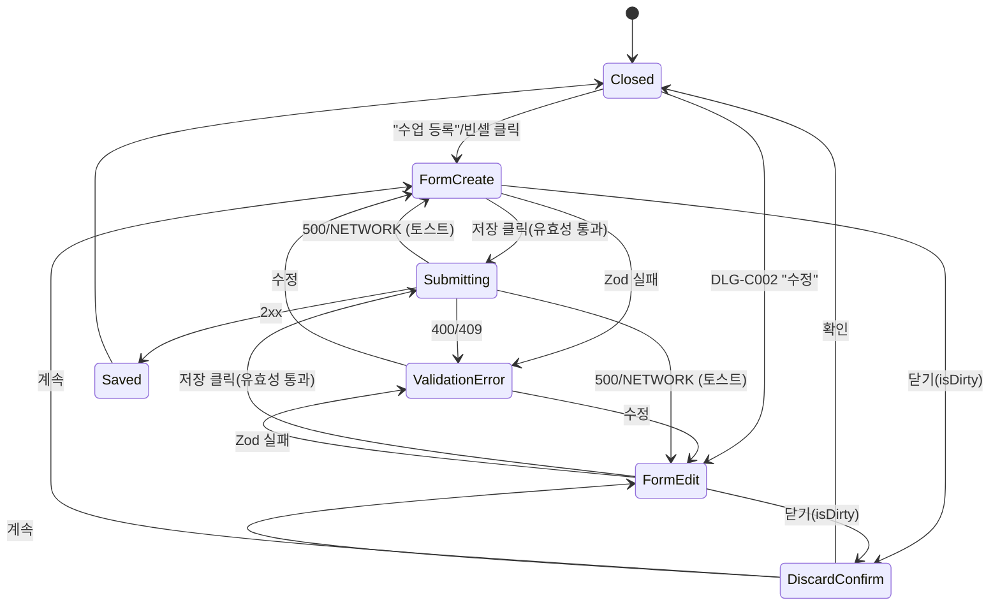

# DLG-C001 수업 등록/수정 (캘린더) — 기본화면 (마스터)

> 이 문서는 **다이얼로그 마스터 스펙**입니다. `01~06` 상태 문서는 이 문서를 상속(override/delta)합니다.
> 🔗 **컨텍스트**: 이 모달은 캘린더(SCR-C001) 위에서 오픈되며, 풍부한 예약/좌석/대상/참여자/일정분류까지 관리하는 **"풀 폼"**이다. 관리 뷰(DLG-C003)의 "축약 폼"과 구분된다.

---

## 0. 메타 & 원천 참조

| 항목 | 값 |
|------|----|
| 다이얼로그 ID | DLG-C001 |
| 다이얼로그명 | 수업 등록/수정 (캘린더 컨텍스트) |
| 도메인 | D04-수업관리 |
| 부모 화면 | SCR-C001 수업캘린더 (`/calendar`) |
| 트리거 | (1) PageHeader "수업 등록" 버튼 · (2) 캘린더 빈 셀 클릭 · (3) DLG-C002 "수정" 버튼 |
| 서버 호출 | ✅ `INSERT/UPDATE classes` (Supabase) |
| 크기 | `max-w-[800px] max-h-[90vh]` (lg, 2열 그리드 내부) |
| 닫기 | ESC/X/취소 (변경 있을 시 DLG-004 확인) |
| 역할 | owner, manager, fc, trainer (본인 수업 한정) |
| 파일 경로 | `src/components/classes/LessonCalendarModal.tsx` |
| 우선순위 | P0 (캘린더 핵심 액션) |

### 원천 문서 링크
| 문서 | 경로 | 섹션 |
|---|---|---|
| 화면설계서 | `docs/화면설계서/수업관리.md` | §DLG-C001 (1.트리거~6.닫기조건) |
| 기능명세서 | `docs/기능명세서/수업관리.md` | §1.11 수업 추가 모달, §1.15 시간 충돌 |
| 에러코드정의서 | `docs/에러코드정의서.md` | §수업 E5xxxxx (E501xxx, E502xxx) |
| 다이어그램 M1 생명주기 | `docs/다이어그램/D04_수업관리/DLG/DLG-C001_수업등록수정_캘린더/M1_생명주기.md` | 오픈→저장/닫기 전이 |
| 다이어그램 M2 필드검증 | `docs/다이어그램/D04_수업관리/DLG/DLG-C001_수업등록수정_캘린더/M2_필드검증.md` | 필수 필드 · 유효성 순서 |
| 다이어그램 M3 결과분기 | `docs/다이어그램/D04_수업관리/DLG/DLG-C001_수업등록수정_캘린더/M3_결과분기.md` | 성공/충돌/실패 분기 |
| 권한 매트릭스 | `docs/다이어그램/10_권한매트릭스/R1_역할화면_매트릭스.md` | `/calendar` 역할 매트릭스 |
| 공통 DLG-004 | `docs/화면설계서/D01-공통/DLG-004-저장확인/` | 미저장 확인 흐름 |

---

## 1. 다이얼로그 목적 (Why)

캘린더 위에서 **하나의 수업(classes 레코드)** 을 풀 스펙으로 등록/수정한다.
- 기본 정보(수업명·유형·강사·정원·날짜·시간·장소)
- 예약 오픈 설정(FN-034: 최대 예약 인원, 예약 마감일)
- 좌석 배치(FN-037: 행×열 그리드)
- 일정 분류(#17: 상담/OT/체성분/방문/수업/PT/기타)
- 대상(#16: 회원/비회원/직원)
- 참여자 목록(검색 기반 추가)
- 수업 색상(10색 팔레트), 메모
- 저장 시 **동일 강사 시간 충돌 검사** → confirm 후 진행.

---

## 2. 화면 레이아웃 (Wireframe)

### 2.1 기본 레이아웃 (mode: create/edit)

```
 backdrop: fixed inset-0 bg-black/50 z-50
 ┌──────────────────────────────────────────────────────────────┐
 │  ┌────────────────────────────────────────────────────────┐  │
 │  │ ● 새 수업 등록 / 수업 수정                       [X]  │  │ sticky header (56px)
 │  ├────────────────────────────────────────────────────────┤  │
 │  │ ▼ 본문 (scrollable, max-h-[calc(90vh-112px)])        │  │
 │  │                                                        │  │
 │  │ ── 기본 정보 (grid-cols-1 md:grid-cols-2 gap-lg) ──   │  │
 │  │ 좌:                           우:                      │  │
 │  │  [수업 템플릿 ▼]             [수업 날짜  📅]           │  │
 │  │  [수업명 *________]          [시작 시간 ⏰]            │  │
 │  │  [수업 유형 ▼]               [종료 시간 ⏰]            │  │
 │  │  [정원수 (14)]               [장소(룸) ▼  GX룸]        │  │
 │  │  [담당 강사 ▼]               [반복: 월화수목금토일]    │  │
 │  │                                                        │  │
 │  │ ── 예약 오픈 설정 (border rounded-xl p-lg) ──         │  │
 │  │  [최대 예약 인원 0]   [예약 마감일 📅]                  │  │
 │  │  (0 입력 시 정원수와 동일)                             │  │
 │  │                                                        │  │
 │  │ ── 좌석 배치 설정 ──                                   │  │
 │  │  [행 0] [열 0]  → "총 0석 그리드 생성"                 │  │
 │  │                                                        │  │
 │  │ ── 일정 분류 ──                                        │  │
 │  │  [없음][상담][OT][체성분][방문][수업][PT][기타]        │  │
 │  │                                                        │  │
 │  │ ── 대상 설정 ──                                        │  │
 │  │  [회원][비회원][직원]   ← 유형 선택                    │  │
 │  │  (회원)  [회원명________]                              │  │
 │  │  (비회원) [이름] [연락처 010-0000-0000]                │  │
 │  │  (직원)  [직원 선택 ▼]                                 │  │
 │  │  [+ 참여자 추가]                                       │  │
 │  │   └─ [🔍 이름/전화 검색 ___] → dropdown               │  │
 │  │   └─ 추가된: [홍길동 010-...  ✕]                       │  │
 │  │                                                        │  │
 │  │ ── 수업 색상 ──                                        │  │
 │  │  ● ● ● ● ● ● ● ● ● ●  (10색)                          │  │
 │  │                                                        │  │
 │  │ ── 수업 메모 (textarea rows=3) ──                     │  │
 │  │                                                        │  │
 │  ├────────────────────────────────────────────────────────┤  │
 │  │                         [ 취소 ]    [ 등록 / 수정 ]   │  │ sticky footer (56px)
 │  └────────────────────────────────────────────────────────┘  │
 └──────────────────────────────────────────────────────────────┘
```

### 2.2 영역별 치수

| 영역 | 값 | 역할 |
|------|----|------|
| Backdrop | `fixed inset-0 bg-black/50 z-50` | 배경 |
| Modal | `max-w-[800px] max-h-[90vh] w-[calc(100%-32px)]` | 컨테이너 |
| Header | sticky top-0, 56px, `border-b border-line bg-white` | 제목 + X |
| Body | `flex-1 overflow-y-auto p-lg space-y-lg` | 폼 그리드 |
| Footer | sticky bottom-0, 56px, `border-t border-line bg-white` | [취소][저장] |

---

## 3. 디자인 토큰

### 3.1 색상

| 토큰 | 클래스 | 용도 |
|---|---|---|
| backdrop | `bg-black/50 z-50` | 배경 |
| card | `bg-white rounded-xl shadow-xl ring-1 ring-gray-100` | 모달 |
| section.box | `border border-line rounded-xl p-lg` | 섹션 박스 |
| label | `text-[13px] font-semibold text-content` | 필드 라벨 |
| helper | `text-[11px] text-content-secondary` | 도움말 |
| helper.info | `text-[12px] text-state-info` | 좌석 생성 안내 |
| input.default | `h-10 rounded-lg border border-line bg-surface px-3 text-[13px] focus:border-primary focus:ring-2 focus:ring-primary/20` | Input |
| input.error | `border-state-error focus:ring-state-error/20` | 에러 상태 |
| select | input과 동일 + `appearance-none bg-chevron` | Select |
| chip.day | `w-9 h-9 rounded-full text-[12px] font-bold border` | 요일 |
| chip.day.on | `bg-primary text-white border-primary` | 선택 |
| chip.day.off | `bg-surface border-line text-content-secondary hover:border-primary hover:text-primary` | 미선택 |
| chip.cat | `h-8 px-md rounded-full text-[12px] font-semibold border` | 카테고리 |
| chip.target | `h-9 px-lg rounded-lg text-[12px] font-semibold border` | 대상 유형 |
| color.swatch | `w-8 h-8 rounded-full` | 색상 버튼 |
| color.swatch.on | `ring-2 ring-offset-2 ring-primary + 체크 SVG` | 선택 |
| btn.primary | `h-10 px-lg rounded-lg bg-primary hover:bg-primary/90 text-white text-[13px] font-bold disabled:opacity-50` | 저장 |
| btn.ghost | `h-10 px-lg rounded-lg text-content-secondary hover:bg-surface-secondary text-[13px]` | 취소 |
| err.text | `text-[12px] text-state-error mt-1` | 인라인 에러 |

### 3.2 타이포

| 토큰 | 스타일 |
|---|---|
| modal.title | `text-[16px] font-bold text-content` |
| section.title | `text-[13px] font-semibold text-content` |
| section.sub | `text-[11px] text-content-secondary ml-xs` |
| input.value | `text-[13px] text-content` |
| participant.name | `text-[13px] font-semibold` |
| participant.phone | `text-[12px] text-content-secondary` |

### 3.3 간격/반경/모션

| 토큰 | 값 |
|---|---|
| modal.radius | `rounded-xl` (12px) |
| section.radius | `rounded-xl` |
| input.radius | `rounded-lg` (8px) |
| modal.padding | `p-lg` (16px 내부) |
| section.gap | `space-y-lg` (16px) |
| grid.gap | `gap-lg` |
| enter | `animate-in fade-in zoom-in duration-200` |
| motion-reduce | `motion-reduce:animate-none` |

---

## 4. 반응형 규칙

| BP | 폭 | 내부 그리드 | 비고 |
|---|---|---|---|
| Mobile <640 | `w-[calc(100%-16px)] max-w-[480px]` | 1열 | 섹션 세로 스택, 캘린더 위에 전체 덮기 |
| Tablet 640~1024 | `max-w-[640px]` | 2열 (기본 정보만) | 좌석/대상은 1열 유지 |
| Desktop ≥1024 | `max-w-[800px]` | 2열 그리드 전부 | 표준 |
| Landscape h<700 | height 제한 | `max-h-[calc(100vh-32px)]` | 내부 스크롤 |

---

## 5. 🔐 역할별(RBAC) 매트릭스

> `●` = 실행 가능, `○` = 보기만, `—` = 미노출
> 멀티테넌트: `branchId` 스코프, trainer 는 `instructorId=user.id` 필터.

| 요소 | superAdmin/primary | owner | manager | fc | trainer | staff | front | readonly |
|---|:---:|:---:|:---:|:---:|:---:|:---:|:---:|:---:|
| **모달 오픈(등록 버튼)** | ● | ● | ● | ● | ●(본인) | — | — | — |
| **모달 오픈(빈 셀 클릭)** | ● | ● | ● | ● | ●(본인) | — | — | — |
| **모달 오픈(DLG-C002 수정)** | ● | ● | ● | ● | ●(본인 수업만, 과거 제외) | — | — | ○ |
| 수업 템플릿 선택 | ● | ● | ● | ● | ● | — | — | — |
| 수업명/유형/정원/색상 | ● | ● | ● | ● | ● | — | — | — |
| 담당 강사 변경 | ● | ● | ● | ● | ○(본인만 선택) | — | — | — |
| 예약 오픈 설정 | ● | ● | ● | ● | ●(담당만) | — | — | — |
| 좌석 배치 설정 | ● | ● | ● | ● | ●(담당만) | — | — | — |
| 일정 분류 | ● | ● | ● | ● | ● | — | — | — |
| 대상 설정 | ● | ● | ● | ● | ● | — | — | — |
| 참여자 검색/추가 | ● | ● | ● | ● | ● | — | — | — |
| 수업 색상/메모 | ● | ● | ● | ● | ● | — | — | — |
| 저장 버튼 | ● | ● | ● | ● | ●(본인 수업) | — | — | — |
| 시간 충돌 confirm 우회 | ● | ● | ● | ○(항상 확인) | ○ | — | — | — |

### 역할별 분기 규칙
```ts
canOpenLessonModal(role) = ['superAdmin','primary','owner','manager','fc','trainer'].includes(role)
canChangeInstructor(role) = role !== 'trainer'
canEditForeignLesson(role, lesson, userId) = role !== 'trainer' || lesson.instructorId === userId
```

---

## 6. 컴포넌트 트리

```tsx
<LessonCalendarModal
  isOpen={isOpen}
  mode={mode} /* 'create' | 'edit' */
  initial={selectedEvent ?? defaults}
  instructors={instructors}
  templates={CLASS_TYPES}
  rooms={ROOMS}
  onClose={handleClose}
  onSaved={(saved) => { events.mutate(saved); toast.success(...); }}
>
  <ModalPortal backdrop onBackdrop={handleClose} role="dialog" aria-labelledby="lc-title">
    <Card>
      <StickyHeader>
        <h2 id="lc-title">{mode==='edit' ? '수업 수정' : '새 수업 등록'}</h2>
        <IconButton aria-label="닫기" onClick={handleClose}><X/></IconButton>
      </StickyHeader>

      <ScrollBody>
        <Section title="기본 정보" variant="grid-2">
          <Field label="수업 템플릿"><Select {...register('template')} /></Field>
          <Field label="수업 날짜" required error={errors.date}><Input type="date" {...register('date')} /></Field>
          <Field label="수업명" required error={errors.name}><Input {...register('name')} /></Field>
          <Field label="시작 시간" required error={errors.startTime}><Input type="time" {...register('startTime')} /></Field>
          <Field label="수업 유형" required><Select {...register('type')} /></Field>
          <Field label="종료 시간" required error={errors.endTime}><Input type="time" {...register('endTime')} /></Field>
          <Field label="정원수" required><Input type="number" min={1} {...register('capacity',{valueAsNumber:true})} /></Field>
          <Field label="장소(룸)" required><Select {...register('room')} /></Field>
          <Field label="담당 강사" required error={errors.instructor}><Select {...register('instructor')} /></Field>
          <Field label="반복 설정" span={2}><DayButtonGroup value={days} onChange={setDays} /></Field>
        </Section>

        <Section title="예약 오픈 설정" helper="(FN-034)" box>
          <Field label="최대 예약 인원" helper="0 입력 시 정원수와 동일"><Input type="number" min={0} {...register('maxCapacity',{valueAsNumber:true})} /></Field>
          <Field label="예약 마감일"><Input type="date" {...register('reservationDeadline')} /></Field>
        </Section>

        <Section title="좌석 배치 설정" helper="(스피닝/GX 좌석 예약)" box>
          <Field label="행 수 (Rows)"><Input type="number" min={0} max={10} {...register('seatRows',{valueAsNumber:true})} /></Field>
          <Field label="열 수 (Cols)"><Input type="number" min={0} max={10} {...register('seatCols',{valueAsNumber:true})} /></Field>
          {rows>0 && cols>0 && <Hint tone="info">총 {rows*cols}석 좌석 그리드가 생성됩니다.</Hint>}
        </Section>

        <Section title="일정 분류" box>
          <CategoryChipGroup options={["","상담","OT","체성분","방문","수업","PT","기타"]}
                             value={scheduleCategory} onChange={setScheduleCategory} />
        </Section>

        <Section title="대상 설정" box>
          <TargetTypeToggle value={targetType} onChange={setTargetType} />
          {targetType==='회원'   && <Input placeholder="회원명을 입력하세요" {...register('targetName')} />}
          {targetType==='비회원' && <div className="grid grid-cols-2 gap-md">
                                       <Input placeholder="이름" {...register('targetName')} />
                                       <Input placeholder="010-0000-0000" {...register('targetPhone')} />
                                     </div>}
          {targetType==='직원'   && <Select {...register('targetStaff')} />}
          <ParticipantSection participants={participants}
                              onSearch={searchMembers} onAdd={addParticipant} onRemove={removeParticipant} />
        </Section>

        <Section title="수업 색상" box>
          <ColorPalette colors={LESSON_COLORS} value={color} onChange={setColor} />
        </Section>

        <Section title="수업 메모">
          <Textarea rows={3} placeholder="강사나 회원에게 전달할 메모를 입력하세요" {...register('memo')} />
        </Section>
      </ScrollBody>

      <StickyFooter>
        <Button variant="ghost" onClick={handleClose}>취소</Button>
        <Button variant="primary" loading={isSaving}
                disabled={!isValid || isSaving}
                onClick={handleSubmit(onSubmit)}>
          {isSaving ? (mode==='edit' ? '수정 중...' : '등록 중...') : (mode==='edit' ? '수업 수정 완료' : '수업 등록')}
        </Button>
      </StickyFooter>
    </Card>
  </ModalPortal>
</LessonCalendarModal>
```

### 컴포넌트 명세
| 컴포넌트 | Props | 위치 |
|---|---|---|
| `LessonCalendarModal` | `{isOpen, mode, initial, instructors, templates, rooms, onClose, onSaved}` | `src/components/classes/LessonCalendarModal.tsx` |
| `DayButtonGroup` | `{value: boolean[7], onChange}` | `src/components/classes/DayButtonGroup.tsx` |
| `CategoryChipGroup` | `{options, value, onChange}` | `src/components/classes/CategoryChipGroup.tsx` |
| `TargetTypeToggle` | `{value: '회원'\|'비회원'\|'직원', onChange}` | 내부 |
| `ParticipantSection` | `{participants, onSearch, onAdd, onRemove}` | 내부 |
| `ColorPalette` | `{colors, value, onChange}` | `src/components/ui/ColorPalette.tsx` |

---

## 7. 데이터 계약

### 7.1 폼 스키마 (Zod)

```ts
// src/schemas/lesson-calendar.ts
export const lessonCalendarSchema = z.object({
  template: z.string().optional(),
  name: z.string().min(1, '수업명을 입력해주세요.'),
  type: z.enum(['그룹 수업','PT / OT','개인 레슨']),
  capacity: z.number().int().positive(),
  instructor: z.string().min(1, '강사를 선택해주세요.'),
  date: z.string().min(1, '수업 날짜를 선택해주세요.'),
  startTime: z.string().min(1, '시작/종료 시간을 입력해주세요.'),
  endTime: z.string().min(1, '시작/종료 시간을 입력해주세요.'),
  room: z.string().min(1),
  selectedDays: z.array(z.boolean()).length(7),
  maxCapacity: z.number().int().min(0),
  reservationDeadline: z.string().optional(),
  seatRows: z.number().int().min(0).max(10),
  seatCols: z.number().int().min(0).max(10),
  scheduleCategory: z.string().optional(),
  targetType: z.enum(['회원','비회원','직원']),
  targetName: z.string().optional(),
  targetPhone: z.string().optional(),
  targetStaff: z.string().optional(),
  participants: z.array(z.object({ id: z.number(), name: z.string(), phone: z.string() })),
  color: z.string().regex(/^#[0-9a-fA-F]{6}$/),
  memo: z.string().max(500).optional(),
}).refine(v => v.endTime > v.startTime, { path:['endTime'], message:'종료 시간은 시작 시간 이후여야 합니다.' });
export type LessonCalendarForm = z.infer<typeof lessonCalendarSchema>;
```

### 7.2 API 계약

| 동작 | 메서드/쿼리 | 파라미터 |
|---|---|---|
| 등록 | `supabase.from('classes').insert({ ...form, branchId, status:'ACTIVE' })` | form |
| 수정 | `supabase.from('classes').update({ ...form }).eq('id', initial.id)` | id+form |
| 충돌 검사 | 로컬 `[...events, ...localEvents].filter(e => e.instructorId===form.instructor && e.id!==initial?.id)` | — |
| 강사 목록 | `supabase.from('staff').select('id,name').eq('role','instructor').eq('branch_id',branchId)` | — |
| 참여자 검색 | `supabase.from('members').select('id,name,phone').ilike('name','%{q}%').limit(5)` | 300ms debounce |

### 7.3 상태 관리

- `react-hook-form` + `zodResolver(lessonCalendarSchema)`
- 로컬 state: `isSaving`, `showDiscardConfirm`, `conflictFound`, `participantResults`, `showParticipantDropdown`
- 저장 성공 → 부모 캘린더에 `{saved}` 전달 → `setEvents(prev=>...)` 또는 React Query `invalidateQueries(['calendar-events'])`

### 7.4 상태 전이

```
closed → open(mode:create|edit)(02 or 03) → [사용자 입력] → 저장 클릭
   → [conflict confirm] → submitting → 05(success) | 06(validation) | error(toast) → open
   → 닫기(변경 있음) → 04-미저장확인 → 01-닫힘 | open
   → 닫기(변경 없음) → 01-닫힘
```

---

## 8. 비즈니스 룰

1. **모드 분기**: `initial.id`가 있으면 `edit`, 없으면 `create`. 제목/버튼 라벨/API 자동 전환.
2. **템플릿 자동 채움**: 수업 템플릿 선택 시 `name`, `capacity`, `room`을 템플릿 기본값으로 채움 (사용자가 이후 수정 가능).
3. **종료 시간 자동 제안**: 시작 시간 입력 후 종료가 비어 있으면 `+1시간`으로 프리필 (사용자가 수정 가능).
4. **최대 예약 인원 0**: `maxCapacity === 0`이면 저장 시 `capacity`로 대체.
5. **좌석 미사용**: `seatRows*seatCols === 0`이면 좌석 배치 비활성.
6. **시간 충돌 감지 (A-36, 124-21)**: 저장 직전, `formInstructor` 선택 시만 수행.
   - 비교: `[...events, ...localEvents]` 중 `instructorId === formInstructor` 이고 `id !== initial?.id`
   - 판정: `newStart < existEnd && newEnd > existStart`
   - 발견 시 `window.confirm("{강사명}의 {시작}~{종료} 수업과 겹칩니다.\n계속 등록하시겠습니까?")`
   - 확인 → 저장 계속 / 취소 → 저장 중단.
7. **과거 수업 수정 제한**: `isEventEditable(initial.start) === false` 이면 모달 오픈은 되지만 저장은 불가(trainer 엄격, 관리자는 경고 후 허용).
8. **폼 변경 감지**: `formState.isDirty === true`일 때 취소/배경/ESC → `04-미저장확인`.
9. **로컬 이벤트 구분**: `id.startsWith('local-')`인 수업은 서버 저장 없이 `localEvents`만 업데이트.
10. **감사 로그**: 저장 성공 시 `AUDIT.CLASS_CREATE/UPDATE` 서버 기록.
11. **반복 설정**: `selectedDays` 중 true가 있으면 시작일 기준 N개 `classes`를 생성(백엔드에서 처리). 본 모달은 단일 저장 시 무시, 일괄 생성은 SCR-C003 경로 권장.
12. **참여자 상한**: 5명까지 UI 상한 (`participants.length >= 5` 시 추가 버튼 disabled).
13. **충돌 우회 권한**: `role === 'fc' | 'trainer'`는 반드시 confirm, 관리자(superAdmin/primary/owner/manager)는 동일 UX(일관성) 하지만 서버에서는 무조건 허용.

---

## 9. 상태 목록

| 파일 | 상태 코드 | 한글 | 트리거 |
|---|---|---|---|
| `01-닫힘.md` | `lc-closed` | 닫힘 | 초기 / 저장 성공 후 |
| `02-신규폼.md` | `lc-form-create` | 신규 폼 | 등록 버튼/빈 셀 클릭 |
| `03-수정폼.md` | `lc-form-edit` | 수정 폼 | DLG-C002 "수정" 클릭 |
| `04-미저장확인.md` | `lc-discard-confirm` | 미저장 확인 | 변경 있는 상태에서 닫기 시도 |
| `05-저장성공.md` | `lc-saved` | 저장 성공 | API 2xx |
| `06-유효성에러.md` | `lc-validation-error` | 유효성 에러 | Zod 실패 / 서버 400 |

상태 전이: `docs/다이어그램/D04_수업관리/DLG/DLG-C001_수업등록수정_캘린더/M1_생명주기.md`

---

## 10. 에러 코드 매핑

| errorCode | HTTP | 시나리오 | 표시 | 다음 상태 |
|---|---|---|---|---|
| E501001 | 400 | 필수 필드 누락 | 인라인 에러 | `06-유효성에러` |
| E501002 | 400 | 종료<시작 | 인라인 "종료 시간은 시작 시간 이후" | `06-유효성에러` |
| E501010 | 409 | 동일 강사 동시간 충돌 (서버) | confirm 거쳤어도 409 → 배너 | `06-유효성에러` |
| E403001 | 403 | trainer가 타인 수업 수정 시도 | 토스트 "수정 권한이 없습니다" | 닫기 |
| E404050 | 404 | 수정 대상 수업 삭제됨 | 토스트 "이미 삭제된 수업" + 캘린더 refetch | 닫기 |
| E500001 | 500 | 서버 오류 | 토스트 "수업 등록/수정에 실패했습니다." | 유지 + 재시도 |
| NETWORK | — | 네트워크 | 토스트 "네트워크 오류" | 유지 |
| E401002 | 401 | 세션 만료 | DLG-000 오픈 | 이 모달 정리 |

---

## 11. 접근성 (WCAG 2.1 AA)

| 항목 | 요구사항 |
|---|---|
| role | `role="dialog" aria-modal="true"` |
| 라벨 | `aria-labelledby="lc-title"`, `aria-describedby="lc-desc"` |
| 포커스 | 오픈 시 첫 필드(수업명) 자동 포커스. 닫힐 때 트리거 버튼으로 복귀. |
| Tab trap | 제목→X→필드 순차→저장→취소→제목 순환 |
| 키보드 | `Esc`=닫기(변경없음) 또는 확인 분기, `Enter` in form=저장 |
| 라이브리전 | 인라인 에러 `aria-live="polite"`, 서버 에러 배너 `role="alert"` |
| 색상 대비 | 라벨 4.5:1, primary 버튼 4.5:1, 색상 swatch 선택 시 3px ring 추가 |
| 스크린리더 | 좌석 그리드 생성 안내 `aria-live="polite"` |
| 참여자 검색 | `combobox` 패턴, 결과 드롭다운 `role="listbox"`, 각 항목 `role="option"` |
| 모션 | `motion-reduce:animate-none` 적용 |

---

## 12. 진입 / 이탈

### 진입
- SCR-C001 "수업 등록" 버튼 (date 사전 입력 X)
- 캘린더 빈 셀 클릭 (date/startTime/endTime 사전 입력)
- DLG-C002 "수정" 클릭 (initial.id 전달, edit 모드)

### 이탈

| 액션 | 목적지 |
|---|---|
| 취소/ESC/배경(변경없음) | `01-닫힘` |
| 취소/ESC/배경(변경있음) | `04-미저장확인` → 확정 시 `01-닫힘`, 계속 시 폼 유지 |
| 저장 성공 | `05-저장성공` → 200ms 토스트 → `01-닫힘` + 캘린더 리프레시 |
| 저장 실패(E4xx) | `06-유효성에러` + 필드/배너 |
| 저장 실패(500/Net) | 모달 유지 + 토스트 + 재시도 가능 |
| 401 | DLG-000(세션만료) 오픈, 이 모달 자동 정리 |

---

## 13. 다이어그램 통합 뷰



---

## 14. 🧩 바이브코딩 프롬프트 (마스터)

```
Next.js 15 App Router + TypeScript + Tailwind v4 + Supabase + react-hook-form + zod 기반
'use client' 모달 컴포넌트를 작성하라.

━━ 다이얼로그: DLG-C001 수업 등록/수정 (캘린더) ━━
파일: src/components/classes/LessonCalendarModal.tsx
보조:
- src/schemas/lesson-calendar.ts (lessonCalendarSchema)
- src/components/classes/DayButtonGroup.tsx
- src/components/classes/CategoryChipGroup.tsx
- src/components/ui/ColorPalette.tsx
- src/hooks/useTimeConflict.ts
- src/lib/lesson-constants.ts (LESSON_COLORS, CLASS_TYPES, ROOMS)

━━ Props ━━
interface Props {
  isOpen: boolean;
  mode: 'create' | 'edit';
  initial?: Partial<ScheduleEvent> & { id?: string | number };
  events: ScheduleEvent[];          // 충돌 검사용 DB
  localEvents: ScheduleEvent[];     // 로컬 (id: 'local-*')
  instructors: Staff[];
  templates: ClassTemplate[];
  rooms: { name: string }[];
  onClose: () => void;
  onSaved: (saved: ScheduleEvent) => void;
}

━━ 레이아웃 ━━
- Portal 로 body 에 렌더
- Backdrop: <div className="fixed inset-0 bg-black/50 z-50 flex items-center justify-center px-4">
- Card:     <div className="w-full max-w-[800px] max-h-[90vh] flex flex-col bg-white rounded-xl
                             shadow-xl ring-1 ring-gray-100 animate-in fade-in zoom-in duration-200
                             motion-reduce:animate-none">
- Sticky header (border-b border-line px-lg h-14 flex items-center justify-between)
- Scroll body (flex-1 overflow-y-auto p-lg space-y-lg)
- Sticky footer (border-t border-line px-lg h-14 flex items-center justify-end gap-sm)

━━ 기본 정보 (2열 grid) ━━
grid-cols-1 md:grid-cols-2 gap-lg
좌: [수업템플릿 ▼][수업명*][수업유형*][정원수*][담당강사*]
우: [수업날짜*][시작시간*][종료시간*][장소*][반복 요일버튼 7개]

━━ 예약 오픈 / 좌석 / 분류 / 대상 / 색상 / 메모 ━━
§본문 §2.1 와이어프레임 정확히 반영.
- 각 섹션 박스: border border-line rounded-xl p-lg space-y-md
- 일정 분류: "없음" + SCHEDULE_COLORS 7개 키
  const CATS=["","상담","OT","체성분","방문","수업","PT","기타"];
- 대상 유형: "회원"|"비회원"|"직원" 3단 토글
- 참여자: 300ms debounce, supabase.from("members").ilike, 결과 5건, 항목 클릭 → participants 추가
- 색상: LESSON_COLORS 10개, 선택 시 ring-2 ring-offset-2 ring-primary + 체크 SVG

━━ 상태 훅 ━━
const { register, handleSubmit, watch, setValue, formState:{errors,isDirty,isValid} }
  = useForm<LessonCalendarForm>({ resolver: zodResolver(lessonCalendarSchema),
    defaultValues: mode==='edit' ? toFormValues(initial) : DEFAULTS });
const [isSaving, setIsSaving] = useState(false);
const [showDiscard, setShowDiscard] = useState(false);

━━ 저장 로직 ━━
async function onSubmit(v: LessonCalendarForm) {
  // 시간 충돌 검사
  const conflict = findConflict(events, localEvents, v, initial?.id);
  if (conflict && !window.confirm(
        `${instructorName(v.instructor)}의 ${conflict.label} 수업과 겹칩니다.\n계속 등록하시겠습니까?`
      )) return;

  setIsSaving(true);
  try {
    if (mode==='edit') {
      const { data, error } = await supabase.from('classes')
        .update(toRowValues(v)).eq('id', initial!.id!).select().single();
      if (error) throw error;
      onSaved(fromRow(data));
      toast.success('수업이 수정되었습니다.');
    } else {
      const { data, error } = await supabase.from('classes')
        .insert({ ...toRowValues(v), branch_id: branchId }).select().single();
      if (error) throw error;
      onSaved(fromRow(data));
      toast.success('수업이 등록되었습니다.');
    }
    onClose();
  } catch (e:any) {
    if (e.code==='PGRST204' || e.status===404) {
      toast.error('이미 삭제된 수업입니다.');
      onClose();
    } else {
      toast.error(mode==='edit' ? '수업 수정에 실패했습니다.' : '수업 등록에 실패했습니다.');
    }
  } finally { setIsSaving(false); }
}

━━ 닫기 흐름 ━━
function handleClose() {
  if (isDirty && !isSaving) setShowDiscard(true);
  else onClose();
}
// Esc/배경 → handleClose

━━ 디자인 토큰 (Tailwind v4, 정확히) ━━
backdrop: fixed inset-0 z-50 bg-black/50
card:     bg-white rounded-xl shadow-xl ring-1 ring-gray-100
header:   sticky top-0 border-b border-line bg-white h-14 px-lg
footer:   sticky bottom-0 border-t border-line bg-white h-14 px-lg
section.box: border border-line rounded-xl p-lg space-y-md
label:    text-[13px] font-semibold text-content mb-xs
input:    h-10 w-full rounded-lg border border-line bg-surface px-3 text-[13px]
          focus:border-primary focus:ring-2 focus:ring-primary/20
input.err: border-state-error focus:ring-state-error/20
select:   input + appearance-none
day.on:  bg-primary text-white border-primary w-9 h-9 rounded-full text-[12px] font-bold
day.off: bg-surface border-line text-content-secondary hover:border-primary w-9 h-9 rounded-full
cat.on:  bg-primary/10 text-primary border-primary h-8 px-md rounded-full text-[12px]
cat.off: bg-surface border-line text-content-secondary h-8 px-md rounded-full
target.on:  bg-primary text-white border-primary h-9 px-lg rounded-lg text-[12px] font-semibold
target.off: bg-surface-secondary text-content-secondary border-line h-9 px-lg rounded-lg
color.swatch: w-8 h-8 rounded-full
color.on:     ring-2 ring-offset-2 ring-primary + 체크 SVG
btn.primary: h-10 px-lg rounded-lg bg-primary hover:bg-primary/90 text-white text-[13px] font-bold disabled:opacity-50
btn.ghost:   h-10 px-lg rounded-lg text-content-secondary hover:bg-surface-secondary text-[13px]
err.text:    text-[12px] text-state-error mt-1

━━ 접근성 ━━
role="dialog" aria-modal="true" aria-labelledby="lc-title"
첫 포커스: 수업명 Input
X 버튼 aria-label="닫기"
에러 aria-live="polite"; 서버에러 role="alert"
참여자 드롭다운 role="listbox" / role="option"

━━ 충돌 헬퍼 ━━
import { toMinutes, findConflict } from '@/lib/time-conflict';
function findConflict(all, loc, v, selfId) {
  return [...all, ...loc]
    .filter(e => e.instructorId === v.instructor && e.id !== selfId)
    .find(e => toDateTime(v.date, v.startTime) < e.end && toDateTime(v.date, v.endTime) > e.start);
}

━━ QA 체크 ━━
- 빈 셀 클릭 시 날짜/시간 프리필
- 종료 < 시작 → 인라인 에러
- 반복 설정 0개면 단일 저장, 1개 이상이면 백엔드 시리즈 생성
- 좌석 행×열 0이면 좌석 UI 접힘
- 참여자 5명 상한
- isDirty 상태에서 닫기 시 DLG-004 오픈
- 저장 중 버튼 disabled + "등록 중..." 표시
```

---

## 15. QA 체크리스트

- [ ] 등록 버튼/빈 셀 클릭/DLG-C002 수정 3개 진입점 모두 오픈 정상
- [ ] mode='create' 시 제목 "새 수업 등록", 'edit' 시 "수업 수정"
- [ ] 빈 셀 클릭 시 date/startTime/endTime 사전 입력 확인
- [ ] 종료 < 시작 인라인 에러
- [ ] 필수 필드 누락 → `06-유효성에러`
- [ ] 동일 강사 시간 충돌 confirm → 취소 시 저장 중단
- [ ] 반복 요일 선택 + 저장 → 시리즈 생성(백엔드)
- [ ] 좌석 행×열 > 0 시 "총 N석 그리드 생성" 안내
- [ ] 참여자 검색 300ms 디바운스 + 최대 5명
- [ ] isDirty 상태에서 닫기 시 `04-미저장확인` 진입
- [ ] 저장 성공 시 토스트 + 캘린더 리프레시 + 모달 자동 닫힘
- [ ] trainer는 타인 수업 수정 시 403 토스트 후 자동 닫힘
- [ ] 401 세션 만료 시 DLG-000 우선, 본 모달 정리
- [ ] ESC/배경 닫기 규칙 (isDirty 시 확인)
- [ ] 키보드 Tab 순환 및 포커스 복귀
- [ ] 모바일 폭 360px 섹션 가독성
- [ ] 접근성: role, aria-labelledby, live region 공지
- [ ] 모션 감소 선호 시 애니메이션 비활성
