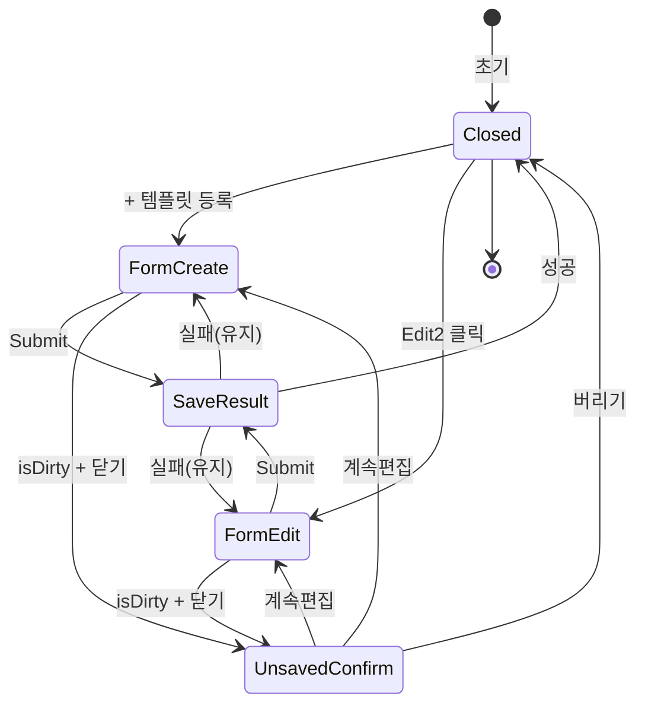

# DLG-C009 템플릿 등록/수정 — 기본화면 (마스터)

> 이 문서는 **다이얼로그 마스터 스펙**입니다. `01~05` 상태 문서는 이 문서를 상속(override/delta)합니다.
> 상태별 파일은 "변경점(델타)만" 기술하며, 이 문서에 정의된 레이아웃/토큰/컴포넌트/데이터/권한/접근성은 **기본값**으로 적용됩니다.

---

## 0. 메타 & 원천 참조

| 항목 | 값 |
|------|----|
| 다이얼로그 ID | DLG-C009 |
| 다이얼로그명 | 그룹수업 템플릿 등록/수정 |
| 도메인 | D04-수업관리 |
| 부모 화면 | SCR-C004 그룹수업템플릿 (`/class-templates`) |
| 트리거 | PageHeader `+ 템플릿 등록` / 액션열 `Edit2` |
| 컴포넌트 경로 | `src/components/classes/ClassTemplateModal.tsx` |
| 모달 타입 | Radix Dialog (controlled, modal=true) |
| 크기 | 480px (md) |
| 역할 | manager, owner (primary은 전 지점, 그 외 본 지점 강제) |
| 우선순위 | P1 |
| 플랫폼 | 데스크톱(우선) / 태블릿 / 모바일(fullscreen 변환) |

### 원천 문서 링크

| 문서 | 경로 | 섹션 |
|---|---|---|
| 화면설계서 | `docs/화면설계서/수업관리.md` | §SCR-C004, §DLG-C009 |
| 기능명세서 | `docs/기능명세서/수업관리.md` | §3 수업 템플릿, 1.11.ClassTemplate |
| 다이어그램 F1~F9 | `docs/다이어그램/D04_수업관리/DLG/DLG-C009_템플릿등록수정/` | 진입/메인/버튼/모달/상태/권한/에러 |
| 에러코드 | `docs/에러코드정의서.md` | E400, E403001, E404, E409, E500 |
| 권한 매트릭스 | `docs/다이어그램/10_권한매트릭스/R1_역할화면_매트릭스.md` | manager/owner 행 |

---

## 1. 다이얼로그 목적 (Why)

그룹수업 운영에서 반복적으로 사용되는 **수업 스펙(수업명/분류/기본시간/정원/색상/반복요일)을 템플릿으로 사전 정의**하여, SCR-C001 캘린더/SCR-C003 시간표 일괄등록/DLG-C001 수업등록 시 재사용할 수 있도록 한다.
- 빠른 재등록: 반복 수업을 매번 동일 값 입력하지 않도록 한다.
- 브랜드 일관성: 지점별 템플릿을 공유하여 운영 품질을 유지.
- 감사 추적: 누가 언제 템플릿을 생성/수정했는지 로그로 남긴다.

---

## 2. 다이얼로그 레이아웃 (Wireframe)

### 2.1 기본 와이어프레임 (신규 등록, 480px)

```
┌──────────────────────────────────────────────────────┐
│ 그룹수업 템플릿 등록                              [×] │ ← Header 56px
├──────────────────────────────────────────────────────┤
│                                                       │
│  템플릿명 *                                           │
│  ┌───────────────────────────────────────────────┐   │
│  │ 예) 저녁 필라테스 기초반                     │   │
│  └───────────────────────────────────────────────┘   │
│                                                       │
│  분류 *                                               │
│  ┌───────────────────────────────────────────────┐   │
│  │ GX                                         ▼ │   │
│  └───────────────────────────────────────────────┘   │
│                                                       │
│  수업 시간 *         정원 *                           │
│  ┌─────────────┐    ┌─────────────┐                  │
│  │ 60분      ▼ │    │ 10          │                  │
│  └─────────────┘    └─────────────┘                  │
│                                                       │
│  색상                                                 │
│  [🟣][🔵][🟢][🟡][🟠][🔴][⚪][⚫][🟤][🩷]           │
│                                                       │
│  반복 요일                                            │
│  [일][월][화][수][목][금][토]                         │
│                                                       │
│  설명                                                 │
│  ┌───────────────────────────────────────────────┐   │
│  │                                                │   │
│  │                                                │   │
│  └───────────────────────────────────────────────┘   │
│                                                       │
│  ☑ 활성                                              │
│                                                       │
├──────────────────────────────────────────────────────┤
│                              [ 취소 ]  [ 저장 ]      │ ← Footer 64px
└──────────────────────────────────────────────────────┘
```

### 2.2 영역별 치수 / 역할

| 영역 | 위치 | 치수 | 역할 |
|---|---|---|---|
| Overlay | viewport | `fixed inset-0 bg-black/40 backdrop-blur-[2px]` | 모달 배경 |
| Dialog Content | 중앙 | `w-[480px] max-h-[90vh]` | 폼 컨테이너 |
| Header | 상단 | 56px, `p-5 border-b` | 제목 + 닫기 |
| Body | 중앙 | `p-6 space-y-4`, `overflow-y-auto` | 폼 필드 |
| Footer | 하단 | 64px, `p-4 border-t flex justify-end gap-2` | 액션 버튼 |
| Close Btn | Header 우상 | 32×32 | `aria-label="닫기"` |

---

## 3. 디자인 토큰

### 3.1 색상
| 역할 | Tailwind | Hex | 용도 |
|---|---|---|---|
| overlay | `bg-black/40` | — | 배경 오버레이 |
| dialog.bg | `bg-white` | #FFFFFF | 다이얼로그 표면 |
| dialog.shadow | `shadow-2xl ring-1 ring-gray-200` | — | 엘리베이션 |
| header.border | `border-b border-gray-200` | #E5E7EB | 헤더 구분선 |
| footer.border | `border-t border-gray-200` | #E5E7EB | 푸터 구분선 |
| label | `text-gray-700` | #374151 | 라벨 |
| input.border | `border-gray-300` | #D1D5DB | 인풋 기본 |
| input.focus | `focus:ring-2 focus:ring-blue-500 focus:border-blue-500` | #3B82F6 | 포커스 |
| input.error | `border-red-300 focus:ring-red-500` | #FCA5A5 | 에러 |
| primary | `bg-blue-600 hover:bg-blue-700 text-white` | #2563EB | 저장 버튼 |
| outline | `border border-gray-300 text-gray-700 hover:bg-gray-50` | — | 취소 버튼 |
| palette | 10색 `#6366f1 #3b82f6 #10b981 #f59e0b #f97316 #ef4444 #6b7280 #0ea5e9 #8b5cf6 #ec4899` | — | 색상 팔레트 |

### 3.2 타이포 / 간격 / 반경 / 모션
| 토큰 | 값 |
|---|---|
| title | `text-lg font-semibold text-gray-900` |
| label | `text-sm font-medium text-gray-700` |
| input | `h-10 text-sm px-3 rounded-lg` |
| radius.dialog | `rounded-xl` (12px) |
| radius.input | `rounded-lg` (8px) |
| spacing.field | `space-y-4` |
| spacing.section | `space-y-6` |
| motion.enter | `data-[state=open]:animate-in fade-in-0 zoom-in-95 duration-150` |
| motion.exit | `data-[state=closed]:animate-out fade-out-0 zoom-out-95 duration-100` |
| focus.ring | `focus-visible:ring-2 ring-blue-500 ring-offset-2` |

---

## 4. 반응형 규칙

| 브레이크포인트 | 폭 | 다이얼로그 폭 | 패딩 | 특이사항 |
|---|---|---|---|---|
| Mobile | <640px | `w-[calc(100%-32px)]` | `p-4` | 푸터 sticky, body 스크롤 |
| Tablet | 640~1024 | `w-[480px]` | `p-6` | 중앙 정렬 |
| Desktop | ≥1024 | `w-[480px]` | `p-6` | 기본 |
| Height <600 | | | | body `max-h-[calc(100vh-120px)] overflow-y-auto` |

키보드 오픈 시(모바일): body scroll 허용, footer는 sticky bottom.

---

## 5. 🔐 역할별 (RBAC) 매트릭스

| 요소 / 역할 | superAdmin | owner | manager | fc | trainer | staff | front | readonly |
|---|:-:|:-:|:-:|:-:|:-:|:-:|:-:|:-:|
| 모달 열기 | ● | ● | ● | — | — | — | ○ | ○ |
| 템플릿 신규 등록 | ● | ● | ● | — | — | — | — | — |
| 템플릿 수정 | ● | ● | ● | — | — | — | — | — |
| 활성 토글 변경 | ● | ● | ● | — | — | — | — | — |
| 저장(Submit) | ● | ● | ● | — | — | — | — | — |
| 조회(읽기) | ● | ● | ● | ○ | ○ | ○ | ○ | ○ |
| `branchId` 강제 주입 | 선택 (전 지점) | 본 지점 | 본 지점 | 본 지점 | 본 지점 | 본 지점 | 본 지점 | 본 지점 |

● 전부 가능 / ○ 읽기만 / — 접근 불가 (모달 자체가 뜨지 않거나 submit 버튼 disabled)

권한 실패 시: `E403001` 토스트 + 모달 유지.

---

## 6. 컴포넌트 트리

```tsx
<Dialog open={isOpen} onOpenChange={handleOpenChange}>
  <DialogOverlay className="fixed inset-0 bg-black/40 backdrop-blur-[2px]" />
  <DialogContent
    className="fixed left-1/2 top-1/2 -translate-x-1/2 -translate-y-1/2
               w-[480px] max-h-[90vh] bg-white rounded-xl shadow-2xl
               ring-1 ring-gray-200 flex flex-col overflow-hidden
               data-[state=open]:animate-in fade-in-0 zoom-in-95"
    aria-labelledby="dlg-c009-title"
  >
    <DialogHeader>                                  {/* src/components/ui/Dialog.tsx */}
      <DialogTitle id="dlg-c009-title">
        {mode === 'create' ? '그룹수업 템플릿 등록' : '그룹수업 템플릿 수정'}
      </DialogTitle>
      <DialogClose aria-label="닫기" />
    </DialogHeader>

    <form onSubmit={handleSubmit(onSubmit)} className="flex flex-col flex-1 overflow-hidden">
      <div className="flex-1 overflow-y-auto p-6 space-y-4">
        <FormField label="템플릿명" required error={errors.name?.message}>
          <Input maxLength={50} {...register('name')} />
        </FormField>
        <FormField label="분류" required error={errors.category?.message}>
          <Select {...register('category')}>
            <option value="GX">GX</option>
            <option value="PT">PT</option>
            <option value="PILATES">필라테스</option>
            <option value="YOGA">요가</option>
            <option value="ETC">기타</option>
          </Select>
        </FormField>
        <div className="grid grid-cols-2 gap-3">
          <FormField label="수업 시간(분)" required error={errors.duration?.message}>
            <Input type="number" min={10} {...register('duration', { valueAsNumber: true })} />
          </FormField>
          <FormField label="정원" required error={errors.capacity?.message}>
            <Input type="number" min={1} max={100} {...register('capacity', { valueAsNumber: true })} />
          </FormField>
        </div>
        <ColorPalette value={watch('color')} onChange={(v)=>setValue('color', v)} />
        <RepeatDayGroup value={watch('repeatDays')} onChange={(v)=>setValue('repeatDays', v)} />
        <FormField label="설명" error={errors.description?.message}>
          <Textarea rows={3} maxLength={500} {...register('description')} />
        </FormField>
        <Switch label="활성" {...register('isActive')} />
      </div>

      <DialogFooter className="p-4 border-t flex justify-end gap-2">
        <Button type="button" variant="outline" onClick={handleClose}>취소</Button>
        <Button type="submit" variant="primary" loading={isSubmitting} disabled={!isValid || isSubmitting}>
          {mode === 'create' ? '저장' : '수정 저장'}
        </Button>
      </DialogFooter>
    </form>
  </DialogContent>
</Dialog>
```

### 컴포넌트 명세
| 컴포넌트 | Props | 재사용 |
|---|---|---|
| `Dialog` (Radix) | `open`, `onOpenChange`, `modal` | 전역 |
| `FormField` | `label`, `required`, `error`, `children` | 전역 공용 |
| `ColorPalette` | `value`, `onChange`, `colors[]` | D04 공용 |
| `RepeatDayGroup` | `value: number[]`, `onChange` | D04 공용 |
| `Switch` | `label`, `checked`, `onChange` | 전역 공용 |

---

## 7. 데이터 계약

### 7.1 Zod 스키마
```ts
// src/schemas/lesson-template.ts
export const lessonTemplateSchema = z.object({
  name: z.string().min(1, '템플릿명을 입력해주세요.').max(50, '50자 이내로 입력해주세요.'),
  category: z.enum(['GX','PT','PILATES','YOGA','ETC'], { required_error: '분류를 선택해주세요.' }),
  duration: z.number().int().min(10, '수업 시간은 10분 이상이어야 합니다.').max(300),
  capacity: z.number().int().min(1).max(100, '정원은 1~100명이어야 합니다.'),
  color: z.string().regex(/^#[0-9a-fA-F]{6}$/).default('#6366f1'),
  repeatDays: z.array(z.number().int().min(0).max(6)).default([]),
  description: z.string().max(500).optional().or(z.literal('')),
  isActive: z.boolean().default(true),
});
export type LessonTemplateForm = z.infer<typeof lessonTemplateSchema>;
```

### 7.2 API 계약
| 항목 | 값 |
|---|---|
| 등록 | `POST /api/lesson-templates` → `class_templates` INSERT |
| 수정 | `PUT /api/lesson-templates/{id}` → `class_templates` UPDATE |
| 조회(수정 진입) | `GET /api/lesson-templates/{id}` |
| 성공 | `201/200 { success:true, data:{ id, ... } }` |
| 에러 | `400 E400001 / 403 E403001 / 404 E404001 / 409 E409001 동일 템플릿명 / 500 E500001` |

### 7.3 상태 관리
- `react-hook-form + zodResolver` 로컬 폼
- `useMutation(templateMutationFn)` for POST/PUT
- 성공 시 `queryClient.invalidateQueries(['lesson-templates', branchId])`
- 낙관적 업데이트 사용 안 함(충돌 리스크)

---

## 8. 비즈니스 룰

1. **branchId 강제**: `superAdmin`이 아닌 경우 `session.branchId` 주입 (`owner`도 동일).
2. **중복명 검사**: 같은 지점 내 동일 `name`은 `E409001` 반환.
3. **미저장 변경 감지**: `formState.isDirty===true` 상태에서 닫기 요청 시 `04-미저장확인` 확인 다이얼로그.
4. **수정 모드 프리필**: `mode==='edit'`일 때 `useEffect`로 `reset(template)` 호출. `isDirty`는 이후 변경에만 반응.
5. **감사 로그**: 성공 시 `AUDIT.LESSON_TEMPLATE.CREATE` / `.UPDATE`, 실패 시 사유 코드 포함.
6. **제출 중 잠금**: `isSubmitting=true`일 때 모든 인풋 `readOnly`, 버튼 `disabled`.
7. **ESC / Overlay 클릭**: `isDirty===true`이면 `04-미저장확인`, 아니면 즉시 `01-닫힘`.
8. **반복 요일 초기값**: `[]` (없음). 값이 있으면 DLG-C001/C003 에서 요일 프리필 힌트로 사용.

---

## 9. 상태 목록

| 파일 | 상태 코드 | 한글 | 트리거 |
|---|---|---|---|
| `01-닫힘.md` | `closed` | 모달 닫힘 (부모 화면 노출) | 초기 / 저장성공 / 취소 |
| `02-신규폼.md` | `form-create` | 신규 폼 (빈 폼) | `+ 템플릿 등록` 클릭 |
| `03-수정폼.md` | `form-edit` | 수정 폼 (프리필) | 행 `Edit2` 클릭 |
| `04-미저장확인.md` | `unsaved-confirm` | 미저장 변경 확인 | `isDirty`+닫기 시도 |
| `05-저장결과.md` | `save-result` | 저장 결과 (성공 토스트/실패 유지) | Submit |

상태 전이: `§13` 다이어그램 참조.

---

## 10. 에러 코드 매핑

| errorCode | HTTP | 메시지 | 액션 |
|---|---|---|---|
| E400001 | 400 | 필수 입력 항목을 확인해주세요 | 필드 인라인 에러 |
| E400002 | 400 | 입력 형식이 올바르지 않습니다 | 필드 인라인 |
| E400003 | 400 | 허용된 범위를 초과했습니다 | `capacity`/`duration` 인라인 |
| E403001 | 403 | 접근 권한이 없습니다 | 토스트 + 모달 유지 |
| E404001 | 404 | 요청한 데이터를 찾을 수 없습니다 | (수정 진입) 토스트 + 모달 닫힘 |
| E409001 | 409 | 동일한 템플릿명이 존재합니다 | `name` 필드 인라인 에러 |
| E500001 | 500 | 일시적인 오류가 발생했습니다 | error 토스트 + 재시도 허용 |
| NETWORK | — | 네트워크 연결을 확인해주세요 | 재시도 허용 |

---

## 11. 접근성 (WCAG 2.1 AA)

| 항목 | 요구 |
|---|---|
| Focus Trap | Radix Dialog 기본 지원. 첫 포커스=템플릿명 Input. |
| `aria-labelledby` | `"dlg-c009-title"` |
| `aria-describedby` | 에러 메시지 `"err-{field}"` |
| `aria-invalid` | 필드 에러 시 `true` |
| 에러 공지 | `role="alert" aria-live="polite"` |
| 대비비율 | label/text 4.5:1, placeholder 3:1 |
| 키보드 | `Tab` 순환, `Esc`=닫기(미저장 시 확인), `Enter`=Submit |
| 스크린리더 | 색상 팔레트 각 버튼 `aria-label="색상 #6366F1 선택"` |
| 모션 감소 | `prefers-reduced-motion:reduce` → 애니메이션 제거 |

---

## 12. 진입/이탈 연결

### 진입
- `SCR-C004 그룹수업템플릿` 페이지
  - 헤더 `+ 템플릿 등록` → `02-신규폼`
  - 행 액션 `Edit2` → `03-수정폼`

### 이탈
| 액션 | 목적지 |
|---|---|
| 저장 성공 (create) | `01-닫힘` + 부모 목록 리프레시 + success 토스트 |
| 저장 성공 (edit) | `01-닫힘` + 부모 목록 리프레시 + success 토스트 |
| 409 중복 | `02-신규폼`/`03-수정폼` 유지 + 인라인 에러 |
| 취소 (isDirty=false) | `01-닫힘` |
| 취소 (isDirty=true) | `04-미저장확인` |
| ESC / Overlay | isDirty에 따라 분기 |

---

## 13. 다이어그램 통합 뷰



---

## 14. 🧩 바이브코딩 프롬프트 마스터

```
Next.js 15 App Router + TypeScript + Tailwind + Radix UI Dialog + react-hook-form + zod + @tanstack/react-query + Supabase 기반
'use client' 컴포넌트를 작성하라.

━━ 다이얼로그: DLG-C009 그룹수업 템플릿 등록/수정 (마스터) ━━
파일: src/components/classes/ClassTemplateModal.tsx
부모: src/app/(classes)/class-templates/page.tsx
스키마: src/schemas/lesson-template.ts

━━ Props ━━
interface Props {
  isOpen: boolean
  onClose: () => void
  mode: 'create' | 'edit'
  template?: ClassTemplate  // edit 모드에서만
  onSuccess: () => void     // 저장 성공 시 부모 목록 리프레시
}

━━ 레이아웃 / 구조 ━━
import * as Dialog from '@radix-ui/react-dialog'
<Dialog.Root open={isOpen} onOpenChange={(o)=>!o && handleClose()} modal>
  <Dialog.Portal>
    <Dialog.Overlay className="fixed inset-0 bg-black/40 backdrop-blur-[2px]
                               data-[state=open]:animate-in fade-in-0" />
    <Dialog.Content
      className="fixed left-1/2 top-1/2 -translate-x-1/2 -translate-y-1/2
                 w-[480px] max-h-[90vh] bg-white rounded-xl shadow-2xl
                 ring-1 ring-gray-200 flex flex-col overflow-hidden
                 data-[state=open]:animate-in fade-in-0 zoom-in-95 duration-150
                 data-[state=closed]:animate-out fade-out-0 zoom-out-95 duration-100"
      aria-labelledby="dlg-c009-title"
      onEscapeKeyDown={(e)=>{ if(isDirty){ e.preventDefault(); setShowUnsaved(true) } }}
      onPointerDownOutside={(e)=>{ if(isDirty){ e.preventDefault(); setShowUnsaved(true) } }}
    >
      <header className="h-14 px-5 border-b flex items-center justify-between">
        <Dialog.Title id="dlg-c009-title" className="text-lg font-semibold text-gray-900">
          {mode === 'create' ? '그룹수업 템플릿 등록' : '그룹수업 템플릿 수정'}
        </Dialog.Title>
        <Dialog.Close aria-label="닫기"
          className="size-8 rounded-md hover:bg-gray-100 focus-visible:ring-2 ring-blue-500
                     focus:outline-none inline-flex items-center justify-center">
          <X className="size-4 text-gray-500" />
        </Dialog.Close>
      </header>

      <form onSubmit={handleSubmit(onSubmit)} className="flex flex-col flex-1 overflow-hidden">
        <div className="flex-1 overflow-y-auto p-6 space-y-4">
          {/* 템플릿명 */}
          <div>
            <label htmlFor="tpl-name" className="block text-sm font-medium text-gray-700">
              템플릿명 <span className="text-red-500">*</span>
            </label>
            <input id="tpl-name" maxLength={50} {...register('name')}
              aria-invalid={!!errors.name} aria-describedby="err-name"
              className={`mt-1 h-10 w-full rounded-lg border px-3 text-sm
                          ${errors.name ? 'border-red-300 focus:ring-red-500' : 'border-gray-300 focus:ring-blue-500'}
                          focus:outline-none focus:ring-2`} />
            {errors.name && <p id="err-name" role="alert" className="mt-1 text-xs text-red-600">{errors.name.message}</p>}
          </div>

          {/* 분류 */}
          <div>
            <label className="block text-sm font-medium text-gray-700">분류 <span className="text-red-500">*</span></label>
            <select {...register('category')}
              className="mt-1 h-10 w-full rounded-lg border border-gray-300 px-3 text-sm focus:outline-none focus:ring-2 focus:ring-blue-500">
              <option value="GX">GX</option>
              <option value="PT">PT</option>
              <option value="PILATES">필라테스</option>
              <option value="YOGA">요가</option>
              <option value="ETC">기타</option>
            </select>
          </div>

          {/* 시간/정원 */}
          <div className="grid grid-cols-2 gap-3">
            <div>
              <label className="block text-sm font-medium text-gray-700">수업 시간(분) *</label>
              <input type="number" min={10} max={300} {...register('duration', { valueAsNumber: true })}
                className="mt-1 h-10 w-full rounded-lg border border-gray-300 px-3 text-sm focus:outline-none focus:ring-2 focus:ring-blue-500" />
            </div>
            <div>
              <label className="block text-sm font-medium text-gray-700">정원 *</label>
              <input type="number" min={1} max={100} {...register('capacity', { valueAsNumber: true })}
                className="mt-1 h-10 w-full rounded-lg border border-gray-300 px-3 text-sm focus:outline-none focus:ring-2 focus:ring-blue-500" />
            </div>
          </div>

          {/* 색상 */}
          <div>
            <label className="block text-sm font-medium text-gray-700 mb-2">색상</label>
            <div className="flex gap-2">
              {PALETTE.map(c => (
                <button type="button" key={c} onClick={()=>setValue('color', c, { shouldDirty: true })}
                  aria-pressed={watch('color')===c} aria-label={`색상 ${c} 선택`}
                  className={`size-7 rounded-full border-2 focus-visible:ring-2 ring-blue-500
                              ${watch('color')===c ? 'border-gray-900 scale-110' : 'border-white'}`}
                  style={{ backgroundColor: c }} />
              ))}
            </div>
          </div>

          {/* 반복 요일 */}
          <div>
            <label className="block text-sm font-medium text-gray-700 mb-2">반복 요일</label>
            <div className="flex gap-1">
              {['일','월','화','수','목','금','토'].map((d,i) => {
                const on = (watch('repeatDays')||[]).includes(i)
                return (
                  <button type="button" key={i}
                    onClick={()=>toggleDay(i)}
                    aria-pressed={on}
                    className={`h-9 w-9 rounded-full text-xs font-medium transition-colors
                                ${on ? 'bg-blue-600 text-white' : 'bg-gray-100 text-gray-700 hover:bg-gray-200'}`}>
                    {d}
                  </button>
                )
              })}
            </div>
          </div>

          {/* 설명 */}
          <div>
            <label className="block text-sm font-medium text-gray-700">설명</label>
            <textarea rows={3} maxLength={500} {...register('description')}
              className="mt-1 w-full rounded-lg border border-gray-300 px-3 py-2 text-sm focus:outline-none focus:ring-2 focus:ring-blue-500" />
          </div>

          {/* 활성 */}
          <label className="flex items-center gap-2 text-sm text-gray-700">
            <input type="checkbox" {...register('isActive')}
              className="size-4 rounded border-gray-300 text-blue-600 focus:ring-blue-500" />
            활성
          </label>
        </div>

        <footer className="h-16 px-4 border-t flex items-center justify-end gap-2">
          <button type="button" onClick={handleClose}
            className="h-10 px-4 rounded-lg border border-gray-300 text-sm text-gray-700 hover:bg-gray-50">
            취소
          </button>
          <button type="submit" disabled={!isValid || isSubmitting}
            className="h-10 px-4 rounded-lg bg-blue-600 hover:bg-blue-700 text-white text-sm font-medium
                       disabled:bg-blue-400 disabled:cursor-not-allowed inline-flex items-center gap-2">
            {isSubmitting && <Loader2 className="size-4 animate-spin" />}
            {mode === 'create' ? '저장' : '수정 저장'}
          </button>
        </footer>
      </form>
    </Dialog.Content>
  </Dialog.Portal>
</Dialog.Root>

━━ 데이터 ━━
const { register, handleSubmit, reset, watch, setValue, formState: { errors, isDirty, isValid, isSubmitting } }
  = useForm<LessonTemplateForm>({
    resolver: zodResolver(lessonTemplateSchema),
    mode: 'onChange',
    defaultValues: { name:'', category:'GX', duration:60, capacity:10, color:'#6366f1', repeatDays:[], description:'', isActive:true },
  })

// 수정 모드 프리필
useEffect(() => {
  if (mode === 'edit' && template) reset(template)
}, [mode, template, reset])

const onSubmit = async (data: LessonTemplateForm) => {
  try {
    const branchId = useAuthStore.getState().branchId
    const payload = { ...data, branchId }
    if (mode === 'create') {
      await api.post('/api/lesson-templates', payload)
      toast.success('템플릿이 등록되었습니다.')
    } else {
      await api.put(`/api/lesson-templates/${template!.id}`, payload)
      toast.success('템플릿이 수정되었습니다.')
    }
    queryClient.invalidateQueries({ queryKey: ['lesson-templates', branchId] })
    onSuccess()
    onClose()
  } catch (e: any) {
    const code = e?.response?.data?.errorCode
    if (code === 'E409001') setError('name', { message: '동일한 템플릿명이 존재합니다.' })
    else if (code === 'E403001') toast.warning('권한이 없습니다.')
    else toast.error('처리에 실패했습니다.')
  }
}

━━ 닫기 처리 ━━
const [showUnsaved, setShowUnsaved] = useState(false)
const handleClose = () => { if (isDirty) setShowUnsaved(true); else onClose() }
// 04-미저장확인 AlertDialog 컴포넌트 별도 렌더

━━ 접근성 ━━
- Dialog.Title id="dlg-c009-title" + aria-labelledby
- 첫 인풋 autoFocus (Radix 자동)
- Esc: onEscapeKeyDown (isDirty 체크)
- 필드 에러: aria-invalid, aria-describedby="err-{field}", role="alert"

━━ 의존 ━━
import * as Dialog from '@radix-ui/react-dialog'
import { useForm } from 'react-hook-form'
import { zodResolver } from '@hookform/resolvers/zod'
import { useQueryClient } from '@tanstack/react-query'
import { X, Loader2 } from 'lucide-react'
import { lessonTemplateSchema, type LessonTemplateForm } from '@/schemas/lesson-template'
import { useAuthStore } from '@/stores/authStore'
import { api } from '@/lib/api'
import { toast } from 'sonner'

━━ QA 체크 ━━
- 템플릿명 빈값 → 인라인 에러
- 정원 0/101 → 인라인 에러 "1~100명"
- 중복 템플릿명 → 409 → name 인라인 에러
- 저장 성공 → 모달 닫힘 + 부모 목록 리프레시 + success 토스트
- 수정 모드 진입 시 폼이 기존 값으로 프리필
- isDirty=true에서 Esc/Overlay → 미저장 확인 다이얼로그
- 권한 없음(readonly/front) → 모달 열기 불가 또는 Submit 버튼 disabled
```

---

## 15. QA 체크리스트

- [ ] 신규 등록: 필수 필드 검증 → 성공 → 목록 리프레시 + 토스트
- [ ] 수정: 프리필 확인 → `isDirty=false` 시 저장 버튼 disabled
- [ ] 중복 템플릿명(409) → name 인라인 에러
- [ ] isDirty=true + Esc/Overlay → `04-미저장확인` 표시
- [ ] `readonly`/`front` 역할 → 접근 불가 (버튼 숨김)
- [ ] 권한 없음(403) → 토스트 + 모달 유지
- [ ] 네트워크 오류 → 재시도 가능
- [ ] 키보드만으로 전체 흐름 완료 (Tab + Enter)
- [ ] 스크린리더로 에러 공지 수신
- [ ] 모바일 <640 시 카드 풀폭 + 푸터 sticky
