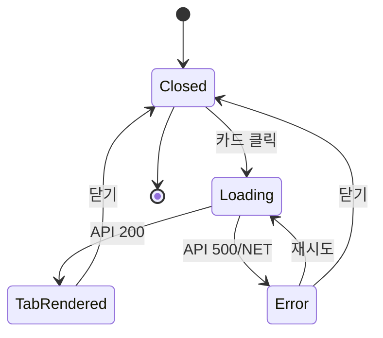

# DLG-C010 강사 상세 — 기본화면 (마스터)

> 이 문서는 **다이얼로그 마스터 스펙**입니다. `01~04` 상태 문서는 이 문서를 상속(override/delta)합니다.

---

## 0. 메타 & 원천 참조

| 항목 | 값 |
|------|----|
| 다이얼로그 ID | DLG-C010 |
| 다이얼로그명 | 강사 근무 상세 |
| 도메인 | D04-수업관리 |
| 부모 화면 | SCR-C006 강사근무현황 (`/instructor-status`) |
| 트리거 | 강사 카드 클릭 |
| 컴포넌트 경로 | `src/components/classes/InstructorDetailModal.tsx` |
| 모달 타입 | Radix Dialog (read-only, modal=true) |
| 크기 | 560px (md) |
| 역할 | superAdmin, owner, manager, trainer(본인만), fc(조회) |
| 우선순위 | P2 |

### 원천 문서 링크

| 문서 | 경로 | 섹션 |
|---|---|---|
| 화면설계서 | `docs/화면설계서/수업관리.md` | §SCR-C006, §DLG-C010 |
| 기능명세서 | `docs/기능명세서/수업관리.md` | §5 강사 근무 현황 |
| 다이어그램 | `docs/다이어그램/D04_수업관리/DLG/DLG-C010_강사상세/` | F1~F9 |
| 권한 매트릭스 | `docs/다이어그램/10_권한매트릭스/R1_역할화면_매트릭스.md` | trainer 본인한정 |

---

## 1. 다이얼로그 목적 (Why)

강사별 담당 수업/근무시간/출석률/노쇼율/매출 기여도를 한눈에 확인하여 **강사 배분 최적화 및 성과 모니터링**을 지원한다.
- 관리자: 강사 퍼포먼스 기반 수업 배정 조정
- 트레이너: 본인 근무 현황 확인(self-service)
- FC: 상담 시 강사 정보 참고

---

## 2. 다이얼로그 레이아웃

```
┌──────────────────────────────────────────────────────┐
│ [아바타] 김강사 · 트레이너                       [×] │
├──────────────────────────────────────────────────────┤
│                                                       │
│  [ 수업 목록 ]  [ 근무 통계 ]   ← Tab header          │
│                                                       │
│  ── 요약 카드 3개 ──                                  │
│  ┌──────┐ ┌──────┐ ┌──────┐                          │
│  │수업수│ │근무시간│ │출석률│                          │
│  │ 12회 │ │ 48h  │ │ 85% │                          │
│  └──────┘ └──────┘ └──────┘                          │
│                                                       │
│  ── 탭 콘텐츠 ──                                       │
│  [수업 목록 테이블 또는 통계 차트]                      │
│                                                       │
├──────────────────────────────────────────────────────┤
│                                      [ 닫기 ]        │
└──────────────────────────────────────────────────────┘
```

### 영역별 치수

| 영역 | 치수 | 역할 |
|---|---|---|
| Dialog | `w-[560px] max-h-[90vh]` | 컨테이너 |
| Header | 64px | 아바타(32px) + 이름 + 역할 + Close |
| Tab Nav | 44px | Radix Tabs.List |
| Summary Cards | `grid-cols-3 gap-3` | 핵심 지표 3개 |
| Tab Content | `min-h-[280px]` | 테이블/차트 |
| Footer | 56px | 닫기 |

---

## 3. 디자인 토큰

| 토큰 | 값 |
|---|---|
| dialog.bg | `bg-white rounded-xl shadow-2xl ring-1 ring-gray-200` |
| header.border | `border-b border-gray-200` |
| tab.active | `border-b-2 border-blue-600 text-blue-700 font-semibold` |
| tab.inactive | `text-gray-500 hover:text-gray-700` |
| card.bg | `bg-gray-50 rounded-lg p-3` |
| card.value | `text-xl font-bold text-gray-900` |
| card.label | `text-xs text-gray-500` |
| rate.good | `text-emerald-600` (>=80) |
| rate.warn | `text-amber-600` (>=60) |
| rate.bad | `text-red-600` (<60) |
| skeleton | `bg-gray-200 rounded animate-pulse` |
| error.banner | `bg-red-50 border border-red-200 text-red-700 rounded-lg p-3 text-sm` |

---

## 4. 반응형

| BP | 폭 | 치수 | 특이 |
|---|---|---|---|
| Mobile | <640 | `w-[calc(100%-32px)]` | 요약 카드 `grid-cols-2`, 차트 높이 200 |
| Tablet | 640~1024 | `w-[560px]` | 기본 |
| Desktop | ≥1024 | `w-[560px]` | 기본 |

---

## 5. 🔐 역할별 (RBAC) 매트릭스

| 요소 / 역할 | superAdmin | owner | manager | fc | trainer | staff | front | readonly |
|---|:-:|:-:|:-:|:-:|:-:|:-:|:-:|:-:|
| 모달 열기 | ● | ● | ● | ○ | ○(본인) | — | — | — |
| 수업 목록 탭 | ● | ● | ● | ○ | ○(본인) | — | — | — |
| 근무 통계 탭 | ● | ● | ● | ○(일부) | ○(본인) | — | — | — |
| 매출 기여 수치 | ● | ● | ● | — | — | — | — | — |
| 타 강사 조회 | ● | ● | ● | ○ | — | — | — | — |
| 지점 범위 | 전체 | 본 지점 | 본 지점 | 본 지점 | 본인 | — | — | — |

매출 기여는 trainer/fc에게 숨김(영업 정보 보호).

---

## 6. 컴포넌트 트리

```tsx
<Dialog.Root open={isOpen} onOpenChange={(o) => !o && onClose()}>
  <Dialog.Portal>
    <Dialog.Overlay className="fixed inset-0 bg-black/40" />
    <Dialog.Content
      className="fixed left-1/2 top-1/2 -translate-x-1/2 -translate-y-1/2
                 w-[560px] max-h-[90vh] bg-white rounded-xl shadow-2xl flex flex-col"
      aria-labelledby="dlg-c010-title">
      <header className="h-16 px-5 border-b flex items-center gap-3">
        <Avatar src={instructor.avatar} size={32} name={instructor.name} />
        <div className="flex-1">
          <Dialog.Title id="dlg-c010-title" className="text-base font-semibold">
            {instructor.name}
          </Dialog.Title>
          <p className="text-xs text-gray-500">{instructor.role}</p>
        </div>
        <Dialog.Close aria-label="닫기" />
      </header>

      <Tabs.Root defaultValue="lessons" className="flex-1 flex flex-col">
        <Tabs.List className="h-11 px-5 border-b flex gap-4">
          <Tabs.Trigger value="lessons">수업 목록</Tabs.Trigger>
          <Tabs.Trigger value="stats">근무 통계</Tabs.Trigger>
        </Tabs.List>
        <div className="flex-1 overflow-y-auto p-5 space-y-4">
          <SummaryCards data={data} />
          <Tabs.Content value="lessons"><LessonList lessons={data.lessons} /></Tabs.Content>
          <Tabs.Content value="stats"><WorkStatsChart stats={data.stats} /></Tabs.Content>
        </div>
      </Tabs.Root>

      <footer className="h-14 px-4 border-t flex justify-end">
        <Button variant="outline" onClick={onClose}>닫기</Button>
      </footer>
    </Dialog.Content>
  </Dialog.Portal>
</Dialog.Root>
```

### 컴포넌트 명세

| 컴포넌트 | Props | 재사용 |
|---|---|---|
| `Avatar` | `src`, `size`, `name` (이니셜 폴백) | 전역 |
| `SummaryCards` | `{ lessonCount, workHours, attendRate, noshowRate, revenue }` | D04 전용 |
| `LessonList` | `lessons: LessonRow[]` | D04 전용 |
| `WorkStatsChart` | `stats: MonthStat[]` (recharts BarChart) | D04 전용 |

---

## 7. 데이터 계약

### 7.1 TypeScript 타입

```ts
interface InstructorDetail {
  id: string
  name: string
  role: '트레이너' | '매니저' | '강사'
  avatar?: string
  summary: {
    lessonCount: number
    workHours: number
    memberCount: number
    attendRate: number  // 0~100
    noshowRate: number  // 0~100
    revenue?: number    // 권한자만 응답에 포함
  }
  lessons: Array<{
    id: string
    date: string       // YYYY-MM-DD
    time: string       // HH:mm~HH:mm
    title: string
    room: string
    status: '예약' | '완료' | '취소'
    capacity: number
    currentCount: number
  }>
  stats: Array<{ month: string; count: number; hours: number }>
}
```

### 7.2 API 계약

| 항목 | 값 |
|---|---|
| 엔드포인트 | `GET /api/instructors/{id}/work-status?from=YYYY-MM-DD&to=YYYY-MM-DD` |
| 성공 | `200 { success:true, data: InstructorDetail }` |
| 에러 | `403 E403001 / 404 E404200 / 500 E500001` |
| 쿼리키 | `['instructor-work-status', id, from, to]` |

### 7.3 상태 관리

- `useQuery` for fetch
- 로컬 탭 상태 `useState`
- 부모에서 `instructorId`, `period` props 전달

---

## 8. 비즈니스 룰

1. **본인 데이터 보호**: `trainer`는 본인 `instructorId`만 조회. 서버 측 RLS + 클라 가드.
2. **기간 범위**: 기본 `period === 'month'` (부모 페이지 필터 연동).
3. **지점 격리**: `branchId` 조건 RLS. superAdmin만 교차 지점.
4. **수치 라운딩**: 출석률/노쇼율은 소수점 0자리, 표시 `${n}%`.
5. **매출 마스킹**: 권한 없는 역할은 필드 자체가 응답에 포함되지 않음.
6. **기간 변경**: 부모가 `period` 변경 시 쿼리 무효화 → 로딩 상태 전환.
7. **빈 상태 2단계**:
   - 전체 빈(수업 목록 없음): "담당 수업이 없습니다."
   - 탭별 빈(통계만 있고 목록 없음): 해당 탭 빈상태 표시

---

## 9. 상태 목록

| 파일 | 상태 코드 | 한글 | 트리거 |
|---|---|---|---|
| `01-닫힘.md` | `closed` | 모달 닫힘 | 초기/닫기 클릭 |
| `02-로딩중.md` | `loading` | 로딩 (스켈레톤) | 열기 직후 |
| `03-정상-탭표시.md` | `tab-rendered` | 정상 렌더 | API 200 |
| `04-에러.md` | `error` | 에러 배너 + 재시도 | API 500/네트워크 |

---

## 10. 에러 코드 매핑

| errorCode | HTTP | 메시지 | 액션 |
|---|---|---|---|
| E403001 | 403 | 접근 권한이 없습니다 | 토스트 + 모달 닫힘 |
| E404200 | 404 | 직원을 찾을 수 없습니다 | 토스트 + 모달 닫힘 |
| E500001 | 500 | 일시적인 오류가 발생했습니다 | `04-에러` + 재시도 |
| NETWORK | — | 네트워크 연결을 확인해주세요 | `04-에러` + 재시도 |

---

## 11. 접근성 (WCAG 2.1 AA)

- `role="dialog"` + `aria-labelledby`
- Tabs: Radix 기본 접근성 (ArrowLeft/Right 탭 이동)
- 차트: `<title>`/`<desc>` + `aria-label="월별 수업 건수 차트"`
- 스켈레톤: `aria-busy="true" aria-live="polite"`
- 출석률/노쇼율 색상 단독 의미 전달 금지: 아이콘 + 텍스트 병기
- Focus trap, Esc 닫기 (변경 없음 → 즉시 닫힘)

---

## 12. 진입/이탈 연결

### 진입
- `SCR-C006 강사근무현황` 강사 카드 클릭

### 이탈
| 액션 | 목적지 |
|---|---|
| 닫기 버튼 / X / Esc / Overlay | `01-닫힘` |
| 404/403 | 토스트 + 자동 닫힘 |

---

## 13. 다이어그램 통합 뷰



---

## 14. 🧩 바이브코딩 프롬프트 마스터

```
Next.js 15 + TS + Tailwind + Radix Dialog + Radix Tabs + @tanstack/react-query + recharts 기반
'use client' 컴포넌트 작성.

파일: src/components/classes/InstructorDetailModal.tsx

Props:
interface Props {
  isOpen: boolean
  instructorId: string | null
  period: { from: string; to: string }
  onClose: () => void
}

━━ 구조 ━━
import * as Dialog from '@radix-ui/react-dialog'
import * as Tabs from '@radix-ui/react-tabs'

const { data, isLoading, isError, refetch } = useQuery({
  queryKey: ['instructor-work-status', instructorId, period.from, period.to],
  queryFn: () => api.get(`/api/instructors/${instructorId}/work-status`, { params: period }).then(r => r.data.data),
  enabled: !!instructorId && isOpen,
})

<Dialog.Root open={isOpen} onOpenChange={(o)=>!o && onClose()}>
  <Dialog.Portal>
    <Dialog.Overlay className="fixed inset-0 bg-black/40 data-[state=open]:animate-in fade-in-0" />
    <Dialog.Content
      className="fixed left-1/2 top-1/2 -translate-x-1/2 -translate-y-1/2
                 w-[560px] max-h-[90vh] bg-white rounded-xl shadow-2xl
                 ring-1 ring-gray-200 flex flex-col overflow-hidden
                 data-[state=open]:animate-in fade-in-0 zoom-in-95 duration-150"
      aria-labelledby="dlg-c010-title">
      {/* Header */}
      <header className="h-16 px-5 border-b flex items-center gap-3">
        {data ? (
          <>
            <div className="size-8 rounded-full bg-gradient-to-br from-blue-400 to-blue-600 text-white inline-flex items-center justify-center text-sm font-semibold">
              {data.name.slice(0,1)}
            </div>
            <div className="flex-1 min-w-0">
              <Dialog.Title id="dlg-c010-title" className="text-base font-semibold text-gray-900 truncate">
                {data.name}
              </Dialog.Title>
              <p className="text-xs text-gray-500">{data.role}</p>
            </div>
          </>
        ) : (
          <div className="flex-1 h-5 bg-gray-200 rounded animate-pulse" />
        )}
        <Dialog.Close aria-label="닫기"
          className="size-8 rounded-md hover:bg-gray-100 inline-flex items-center justify-center">
          <X className="size-4 text-gray-500" />
        </Dialog.Close>
      </header>

      {/* Body */}
      {isLoading && <LoadingBody />}
      {isError  && <ErrorBody onRetry={refetch} />}
      {data     && <DataBody data={data} />}

      <footer className="h-14 px-4 border-t flex justify-end">
        <button onClick={onClose}
          className="h-9 px-4 rounded-lg border border-gray-300 text-sm text-gray-700 hover:bg-gray-50">
          닫기
        </button>
      </footer>
    </Dialog.Content>
  </Dialog.Portal>
</Dialog.Root>

━━ DataBody ━━
function DataBody({ data }: { data: InstructorDetail }) {
  return (
    <Tabs.Root defaultValue="lessons" className="flex-1 flex flex-col overflow-hidden">
      <Tabs.List className="h-11 px-5 border-b flex gap-4">
        <Tabs.Trigger value="lessons"
          className="h-full text-sm text-gray-500 border-b-2 border-transparent
                     data-[state=active]:border-blue-600 data-[state=active]:text-blue-700 data-[state=active]:font-semibold">
          수업 목록
        </Tabs.Trigger>
        <Tabs.Trigger value="stats"
          className="h-full text-sm text-gray-500 border-b-2 border-transparent
                     data-[state=active]:border-blue-600 data-[state=active]:text-blue-700 data-[state=active]:font-semibold">
          근무 통계
        </Tabs.Trigger>
      </Tabs.List>

      <div className="flex-1 overflow-y-auto p-5 space-y-4">
        <div className="grid grid-cols-3 gap-3">
          <SumCard label="담당 수업" value={`${data.summary.lessonCount}회`} />
          <SumCard label="근무시간" value={`${data.summary.workHours}h`} />
          <SumCard label="출석률" value={`${data.summary.attendRate}%`}
            tone={data.summary.attendRate >= 80 ? 'good' : data.summary.attendRate >= 60 ? 'warn' : 'bad'} />
        </div>

        <Tabs.Content value="lessons" className="focus:outline-none">
          {data.lessons.length === 0 ? (
            <div className="h-48 flex flex-col items-center justify-center text-gray-400">
              <BookOpen className="size-8 mb-2" />
              담당 수업이 없습니다.
            </div>
          ) : (
            <table className="w-full text-sm">
              <thead>
                <tr className="text-xs text-gray-500 border-b">
                  <th className="text-left py-2 font-medium">날짜</th>
                  <th className="text-left font-medium">수업명</th>
                  <th className="text-left font-medium">시간</th>
                  <th className="text-center font-medium">상태</th>
                </tr>
              </thead>
              <tbody>
                {data.lessons.map(l => (
                  <tr key={l.id} className="border-b last:border-0">
                    <td className="py-2 text-gray-600">{l.date}</td>
                    <td className="text-gray-900 font-medium">{l.title}</td>
                    <td className="text-gray-600">{l.time}</td>
                    <td className="text-center"><StatusBadge status={l.status} /></td>
                  </tr>
                ))}
              </tbody>
            </table>
          )}
        </Tabs.Content>

        <Tabs.Content value="stats" className="focus:outline-none">
          <div className="h-56">
            <ResponsiveContainer width="100%" height="100%">
              <BarChart data={data.stats}>
                <XAxis dataKey="month" fontSize={12} />
                <YAxis fontSize={12} />
                <Tooltip />
                <Bar dataKey="count" fill="#2563eb" radius={[4,4,0,0]} />
              </BarChart>
            </ResponsiveContainer>
          </div>
        </Tabs.Content>
      </div>
    </Tabs.Root>
  )
}

━━ 의존 ━━
import { useQuery } from '@tanstack/react-query'
import { BarChart, Bar, XAxis, YAxis, Tooltip, ResponsiveContainer } from 'recharts'
import { X, BookOpen } from 'lucide-react'

━━ QA 체크 ━━
- 로딩 중: 스켈레톤 노출 + aria-busy
- 데이터 없음: 빈 상태 메시지
- API 에러: 재시도 버튼 포함 에러 배너
- trainer 본인 아닌 id로 요청 → 403 응답 → 토스트 + 닫힘
- superAdmin만 매출 기여 확인 가능
- Esc/Overlay 닫기
- Tab Arrow Left/Right 키보드 탐색
```

---

## 15. QA 체크리스트

- [ ] 로딩 스켈레톤 (본문 영역, 3카드)
- [ ] 정상 데이터 → 수업 목록 테이블 + 요약 카드
- [ ] 근무 통계 탭 → 월별 BarChart
- [ ] 담당 수업 0건 → 빈 상태
- [ ] 출석률 80/60 기준 색상
- [ ] 403/404 → 토스트 + 자동 닫힘
- [ ] 500 → 에러 배너 + 재시도
- [ ] trainer가 타인 id로 열기 차단
- [ ] superAdmin 외 매출 필드 미노출
- [ ] 키보드 Tab 순환, Esc 닫힘
- [ ] 모바일 w-[calc(100%-32px)] + grid-cols-2
