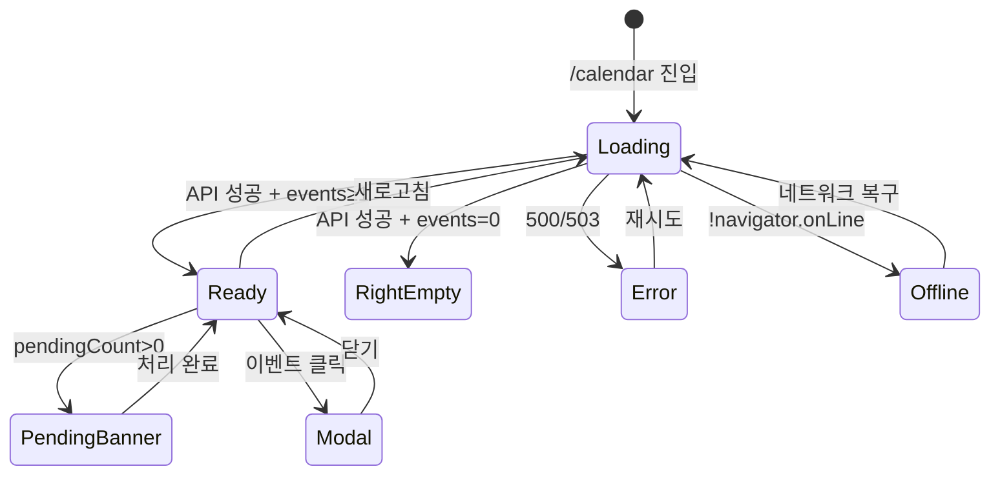

# SCR-C001 수업 캘린더 — 기본화면 (마스터)

> 이 문서는 **화면 마스터 스펙**입니다. `01~06` 상태 문서는 이 문서를 상속(override/delta)합니다.
> 🚨 **trainer 역할 핵심 화면**: trainer 로그인 시 자동 리다이렉트 대상. manager 이상 CRUD, fc/staff ○, front/readonly ✕.

---

## 0. 메타 & 원천 참조

| 항목 | 값 |
|------|----|
| 화면 ID | SCR-C001 |
| 화면명 | 수업/캘린더 |
| 도메인 | D04-수업관리 |
| 경로 | `/calendar` |
| Next.js Route Group | `(lessons)` |
| 파일 경로 | `src/app/(lessons)/calendar/page.tsx` |
| 페이지 컴포넌트 | `CalendarPage` |
| 역할 | `superAdmin`, `primary`, `owner`, `manager`, `fc`, `trainer`, `staff`, `front` (전 역할, 권한 상이) |
| 우선순위 | P0 (trainer 메인 화면) |
| 플랫폼 | 데스크톱(우선) / 태블릿 / 모바일 |
| 멀티테넌트 | ✅ `branchId` 강제 |

### 원천 문서 링크
| 문서 | 경로 | 섹션 |
|---|---|---|
| 화면설계서 | `docs/화면설계서/수업관리.md` | §SCR-C001 수업/캘린더 |
| 기능명세서 | `docs/기능명세서/수업관리.md` | §1 캘린더 (`/calendar`) |
| 상태전이도 | `docs/상태전이도.md` | 예약/수업 상태 전이 |
| 에러코드정의서 | `docs/에러코드정의서.md` | §4.6 수업/스케줄 (E4xx500~599) |
| KPI 정의서 | `docs/KPI_정의서.md` | §PT 완료율/노쇼율, §GX 출석률 |
| 권한 매트릭스 | `docs/다이어그램/10_권한매트릭스/R1_역할화면_매트릭스.md` | `/calendar` 전 역할 |
| 다이어그램 F1 | `docs/다이어그램/D04_수업관리/SCR-C001_수업캘린더/F1_진입.md` | 진입 → 데이터 로드 |
| 다이어그램 F2 | `docs/다이어그램/D04_수업관리/SCR-C001_수업캘린더/F2_메인.md` | 캘린더 렌더 |
| 다이어그램 F3 | `docs/다이어그램/D04_수업관리/SCR-C001_수업캘린더/F3_버튼액션.md` | BTN_ADD_CLASS, BTN_BULK, BTN_APPROVE |
| 다이어그램 F4 | `docs/다이어그램/D04_수업관리/SCR-C001_수업캘린더/F4_네비게이션.md` | 탭 전환 |
| 다이어그램 F5 | `docs/다이어그램/D04_수업관리/SCR-C001_수업캘린더/F5_모달트리거.md` | DLG-C001, DLG-C002 |
| 다이어그램 F6 | `docs/다이어그램/D04_수업관리/SCR-C001_수업캘린더/F6_상태별.md` | 로딩/정상/빈/미승인/에러/오프라인 |
| 다이어그램 F7 | `docs/다이어그램/D04_수업관리/SCR-C001_수업캘린더/F7_권한.md` | **8역할 분기** |
| 다이어그램 F8 | `docs/다이어그램/D04_수업관리/SCR-C001_수업캘린더/F8_에러.md` | E400500, E400501, E422500 |

---

## 1. 화면 목적 (Why)

PT 및 그룹 수업 스케줄을 **FullCalendar 기반 캘린더**로 관리하는 수업관리 도메인의 **메인 허브**.
- trainer는 로그인 직후 이 화면으로 자동 리다이렉트.
- 수업 등록/수정/삭제, 드래그앤드롭 일정 이동, 좌석 배치, 미승인 일정 처리를 통합 제공.
- 센터의 모든 수업 일정을 월/주/일/목록 4뷰로 조망.
- 멀티테넌트: `branchId` 컨텍스트로 필터링 (super/primary는 지점 전환 가능).

---

## 2. 화면 레이아웃 (Wireframe)

### 2.1 공통 골격

```
┌───────────────────────────────────────────────────────────────────────┐
│ PageHeader                                                             │
│  "수업/캘린더"              [스케줄 일괄변경] [+ 수업 등록]                │
│  "PT 및 그룹 수업 스케줄을 관리합니다."                                    │
├───────────────────────────────────────────────────────────────────────┤
│ TabNav                                                                 │
│  [일정표] [수업 관리] [횟수 관리] [페널티 관리] [유효 수업 목록]             │
├───────────────────────────────────────────────────────────────────────┤
│ (미승인 건 존재시 — 상태 04)                                              │
│ ┌────────────────────────────────────────────────────────────────┐    │
│ │ 🔔 미승인 일정 N건이 있습니다.                         [처리하기]  │    │
│ └────────────────────────────────────────────────────────────────┘    │
├───────────────────────────────────────────────────────────────────────┤
│ FilterBar                                                              │
│  [강사 ▼] [수업명 ▼] [전체|여유|마감]                                   │
│  분류: [전체] [상담] [OT] [체성분] [방문] [수업] [PT] [기타]             │
├───────────────────────────────────────────────────────────────────────┤
│ ┌─── FullCalendar (flex-1) ───────┐ ┌── RightPanel (280px sticky) ──┐ │
│ │ Toolbar                          │ │ [< 4/12(토) >]                │ │
│ │ [< prev] [오늘] [next >] 2026/4 │ │ 조회 일정 3건                   │ │
│ │ [월] [주] [일] [목록]            │ │                               │ │
│ │                                  │ │ ● 필라테스                    │ │
│ │  MON TUE WED THU FRI SAT SUN    │ │   09:00~10:00                 │ │
│ │  [날짜셀]                         │ │   김강사  8/14[여유]           │ │
│ │  (월간: 카운트 배지)              │ │                               │ │
│ │  (주·일: 30분 그리드 06~22시)      │ │ ● PT 수업                     │ │
│ │  (목록: 주 단위 리스트)            │ │   10:00~11:00                 │ │
│ │  (드래그·리사이즈 지원)            │ │   이강사  2/2[마감]            │ │
│ └───────────────────────────────┘ │                                  │ │
│                                    └───────────────────────────────┘ │
└───────────────────────────────────────────────────────────────────────┘
```

### 2.2 영역 그리드
| 영역 | 그리드 | 비고 |
|---|---|---|
| PageHeader | `flex items-center justify-between` | 우측 액션 버튼 2개 |
| TabNav | `flex gap-2 border-b` | 5개 탭 |
| 미승인 배너 | `rounded-lg bg-amber-50 border border-amber-200 p-3` | 조건부 |
| FilterBar | `flex flex-wrap gap-2 items-center` | 2행 |
| Body | `flex gap-4` | lg:flex-row, md:flex-col |
| FullCalendar | `flex-1 min-w-0` | viewport에 맞춰 리사이즈 |
| RightPanel | `w-[280px] shrink-0 sticky top-20` | 모바일은 하단 스택 |

---

## 3. 디자인 토큰

### 3.1 색상
| 역할 | 클래스 | 용도 |
|---|---|---|
| bg.page | `bg-gray-50` | 전체 배경 |
| bg.card | `bg-white rounded-xl shadow-sm ring-1 ring-gray-100` | 섹션 카드 |
| banner.warn | `bg-amber-50 border-amber-200 text-amber-800` | 미승인 배너 |
| calendar.today | `bg-blue-50` | FullCalendar today 셀 |
| calendar.now | `#EF4444` | nowIndicator (주·일) |
| event.pending | `opacity-70` + `after:content-['미승인']` | 미승인 이벤트 |
| category.방문 | `#3B82F6` | 이벤트 보더, dot |
| category.OT | `#10B981` | |
| category.상담 | `#F59E0B` | |
| category.체성분 | `#8B5CF6` | |
| category.수업 | `#EF4444` | |
| category.PT | `#F97316` | |
| category.기타 | `#6B7280` | |
| badge.여유 | `bg-emerald-100 text-emerald-800` | |
| badge.마감 | `bg-rose-100 text-rose-800` | |
| bar.<=100% | `bg-rose-500` | 예약 현황 |
| bar.>=80% | `bg-amber-500` | |
| bar.<80% | `bg-emerald-500` | |

### 3.2 타이포그래피
| 토큰 | 스타일 | 용도 |
|---|---|---|
| page.title | `text-2xl font-bold tracking-tight text-gray-900` | PageHeader 제목 |
| page.subtitle | `text-sm text-gray-500` | PageHeader 서브 |
| tab.label | `text-sm font-medium text-gray-700` | TabNav 라벨 |
| tab.active | `text-blue-600 border-b-2 border-blue-600` | 활성 탭 |
| event.title | `text-xs font-semibold text-gray-900` | 월간 이벤트 제목 |
| event.time | `text-[10px] tabular-nums text-gray-600` | 이벤트 시간 |
| event.pending | `text-[8px] text-amber-600 font-medium` | 미승인 표시 |
| panel.title | `text-sm font-semibold text-gray-900` | 우측 패널 제목 |
| panel.card | `text-sm text-gray-900` | 패널 카드 텍스트 |

### 3.3 간격/반경/그림자
| 토큰 | 값 |
|---|---|
| page.padding | `p-4 md:p-6 lg:p-8` |
| section.gap | `space-y-4` |
| card.radius | `rounded-xl` |
| card.padding | `p-4 md:p-5` |
| calendar.cell.min-h | `min-h-24` (월간) |
| event.radius | `rounded` (2px) |
| event.border.left | `border-l-[3px]` (카테고리 색상) |

### 3.4 모션
- 탭 전환: `transition-colors duration-150`
- 이벤트 hover: `hover:brightness-95 transition`
- 드래그 중: `cursor-grabbing` + opacity-80
- 미승인 배너: 진입 시 `animate-[slideDown_200ms_ease-out]`
- 새로고침 아이콘: `animate-spin`
- `prefers-reduced-motion`: 모든 애니메이션 비활성

---

## 4. 반응형 규칙

| BP | 폭 | 레이아웃 | 캘린더 기본뷰 | RightPanel |
|---|---|---|---|---|
| Mobile <640 | 100% | 세로 스택 | `listWeek` (목록) | 하단 스택 |
| Tablet 640~1024 | 100% | 세로 스택 | `timeGridWeek` | 캘린더 아래 |
| Desktop ≥1024 | Sidebar+main | `flex-row` | `dayGridMonth` | 우측 280px |
| XL ≥1440 | max | `flex-row` | `dayGridMonth` | 우측 320px |

FilterBar: mobile에서는 접힘(Disclosure) → "필터" 버튼으로 토글.

---

## 5. 🔐 역할별(RBAC) 매트릭스

> `●` = 표시+CRUD 가능, `○` = 표시만(읽기), `—` = 미표시

| 요소 | primary/super | owner | manager | fc | trainer | staff | front | readonly |
|---|:---:|:---:|:---:|:---:|:---:|:---:|:---:|:---:|
| **페이지 접근** | ● (전 지점) | ● | ● | ● | ● (로그인 직후 리다이렉트) | ○ | ○ | ○ |
| **[+ 수업 등록] 버튼** | ● | ● | ● | ● | ● (본인 수업만) | — | — | — |
| **[스케줄 일괄변경]** | ● | ● | ● | — | — | — | — | — |
| **미승인 배너** (존재 시) | ● | ● | ● | ● | ● (본인 대상만) | — | — | — |
| [처리하기] 버튼 | ● | ● | ● | ● (본인 영역) | ● (본인) | — | — | — |
| **FilterBar 강사 필터** | ● (전체) | ● | ● | ● | ● (본인 고정) | ● | ● | ● |
| **FilterBar 수업명/상태/분류** | ● | ● | ● | ● | ● | ● | ● | ● |
| **지점 전환 드롭다운** | ● | ● (브랜드 한정) | — | — | — | — | — | — |
| **캘린더 뷰 전환** | ● | ● | ● | ● | ● | ● | ● | ● |
| **이벤트 클릭** (DLG-C002 열기) | ● | ● | ● | ● | ● | ○ | ○ | ○ |
| **시간셀 클릭** (DLG-C001 신규) | ● | ● | ● | ● | ● (본인) | — | — | — |
| **드래그앤드롭 이동** | ● | ● | ● | ● | ● (본인 수업만) | — | — | — |
| **리사이즈** (시간 변경) | ● | ● | ● | ● | ● (본인) | — | — | — |
| **승인/거절** | ● | ● | ● | ● | — | — | — | — |
| **삭제** | ● | ● | ● | ● | ● (본인) | — | — | — |
| **탭: 수업 관리 / 횟수 / 페널티 / 유효** | ● | ● | ● | ● | ● (제한) | ○ (조회) | — | — |

### 5.1 역할별 요약 레이아웃 차이
```
primary/super: BranchSwitcher 노출, 전 지점 수업, 일괄변경 ●
owner       : 본인 지점 고정, 일괄변경 ●
manager     : 본인 지점 고정, 일괄변경 ●
fc          : 본인 지점, 상담/OT/체성분 위주, 일괄변경 숨김
trainer     : 본인 담당 수업 강조(컬러 강조), 다른 강사 수업은 faded
staff/front : 조회 전용, CRUD 버튼 숨김, 드래그 비활성
```

### 5.2 역할 판별 코드
```ts
type Role = 'superAdmin'|'primary'|'owner'|'manager'|'fc'|'trainer'|'staff'|'front'|'readonly';
const canCreateClass = (r: Role) => ['superAdmin','primary','owner','manager','fc','trainer'].includes(r);
const canBulkEdit    = (r: Role) => ['superAdmin','primary','owner','manager'].includes(r);
const canApprove     = (r: Role) => ['superAdmin','primary','owner','manager','fc'].includes(r);
const canEditEvent   = (r: Role, event: ScheduleEvent, userId: number) =>
  canCreateClass(r) && (r !== 'trainer' || event.instructorId === userId)
  && isEventEditable(event);
const isViewOnly     = (r: Role) => ['staff','front','readonly'].includes(r);
```

---

## 6. 컴포넌트 트리

```tsx
<AppLayout role={user.role}>
  <div className="p-6 lg:p-8 space-y-4">
    <PageHeader
      title="수업/캘린더"
      subtitle="PT 및 그룹 수업 스케줄을 관리합니다."
      actions={
        <>
          {canBulkEdit(role) && <Button variant="secondary" onClick={openBulkChange}>스케줄 일괄 변경</Button>}
          {canCreateClass(role) && <Button variant="primary" onClick={openAddModal}>+ 수업 등록</Button>}
        </>
      }
    />

    <TabNav items={TABS} active="schedule" onChange={goToTab} />

    {pendingCount > 0 && canApprove(role) && (
      <PendingBanner count={pendingCount} onClick={() => moveToPage('/schedule-requests')} />
    )}

    <FilterBar>
      <Select label="강사" value={filter.staffId} options={staffOptions} disabled={role==='trainer'} />
      <Select label="수업명" value={filter.lessonId} options={lessonOptions} />
      <ButtonGroup value={filter.capacity} options={[{v:'all',l:'전체'},{v:'available',l:'여유'},{v:'full',l:'마감'}]} />
      <MultiPill label="분류" value={filter.categories} options={CATEGORY_OPTIONS} />
    </FilterBar>

    <div className="flex gap-4 flex-col lg:flex-row">
      <div className="flex-1 min-w-0 bg-white rounded-xl shadow-sm ring-1 ring-gray-100 p-4">
        <FullCalendar
          plugins={[dayGridPlugin, timeGridPlugin, listPlugin, interactionPlugin]}
          initialView={defaultView}
          events={filteredEvents}
          editable={canCreateClass(role) && !isViewOnly(role)}
          eventDrop={handleEventDrop}
          eventResize={handleEventResize}
          dateClick={handleDateClick}
          eventClick={handleEventClick}
          eventContent={renderEventContent}
          slotMinTime="06:00:00" slotMaxTime="22:00:00"
          nowIndicator locale="ko"
        />
      </div>

      <aside className="w-full lg:w-[280px] shrink-0 lg:sticky lg:top-20 bg-white rounded-xl shadow-sm ring-1 ring-gray-100 p-4">
        <RightPanel date={selectedDate} events={eventsOfDate} onEventClick={openEventDetail} />
      </aside>
    </div>

    {/* Modals */}
    {addModalOpen && <ClassFormModal mode={editingId?'edit':'create'} initial={initialForm} onClose={closeAdd} />}
    {detailOpen && <EventDetailModal event={selectedEvent} onClose={closeDetail} onEdit={openEditFromDetail} onDelete={handleDelete} onApprove={handleApprove} onReject={handleReject} />}
    {bulkOpen && <BulkChangeModal ids={selectedIds} onClose={closeBulk} />}
  </div>
</AppLayout>
```

### 6.1 핵심 컴포넌트
| 컴포넌트 | 파일 | 주요 Props |
|---|---|---|
| `PageHeader` | `src/components/common/PageHeader.tsx` | `{title, subtitle, actions}` |
| `TabNav` | `src/components/common/TabNav.tsx` | `{items, active, onChange}` |
| `PendingBanner` | `src/components/calendar/PendingBanner.tsx` | `{count, onClick}` |
| `FilterBar` | `src/components/calendar/FilterBar.tsx` | `{filter, onChange}` |
| `FullCalendar` | `@fullcalendar/react` | — |
| `RightPanel` | `src/components/calendar/RightPanel.tsx` | `{date, events, onEventClick}` |
| `ClassFormModal` | `src/components/calendar/ClassFormModal.tsx` | `{mode, initial, onClose}` (DLG-C001) |
| `EventDetailModal` | `src/components/calendar/EventDetailModal.tsx` | `{event, onClose, onEdit, onDelete, onApprove, onReject}` (DLG-C002) |
| `BulkChangeModal` | `src/components/calendar/BulkChangeModal.tsx` | `{ids, onClose}` (DLG-C004) |

---

## 7. 데이터 계약

### 7.1 타입
```ts
// src/types/class.ts
export interface ScheduleEvent {
  id: number;
  branchId: number;
  lessonId?: number;
  title: string;
  lessonType: 'GROUP'|'PERSONAL'|'SEMI';
  category?: '방문'|'OT'|'상담'|'체성분'|'수업'|'PT'|'기타';
  startTime: string;   // ISO
  endTime: string;     // ISO
  instructorId: number;
  instructorName: string;
  room?: string;
  capacity: number;
  currentCount: number;
  color: string;       // HEX
  approvalStatus: 'approved'|'pending'|'rejected';
  targetType: 'member'|'nonmember'|'staff';
  memberId?: number;
  memberName?: string;
  seatsRow?: number;
  seatsCol?: number;
  reservedSeats?: number[];
  memo?: string;
  createdBy: number;
}

export type CategoryKey = ScheduleEvent['category'];
export const CATEGORY_COLORS: Record<CategoryKey & string, string> = {
  '방문':'#3B82F6', 'OT':'#10B981', '상담':'#F59E0B', '체성분':'#8B5CF6',
  '수업':'#EF4444', 'PT':'#F97316', '기타':'#6B7280',
};
```

### 7.2 API 엔드포인트
| 엔드포인트 | 메서드 | 파라미터 | 반환 |
|---|---|---|---|
| `GET /classes` | GET | `{branchId, from, to, staffId?, lessonId?}` | `ScheduleEvent[]` |
| `POST /classes` | POST | `ClassFormDto` | `ScheduleEvent` |
| `PATCH /classes/:id` | PATCH | `Partial<ClassFormDto>` | `ScheduleEvent` |
| `DELETE /classes/:id` | DELETE | — | `{success}` |
| `PATCH /classes/:id/approval` | PATCH | `{status: 'approved'\|'rejected'}` | `ScheduleEvent` |
| `POST /classes/bulk` | POST | `{ids, action, patch}` | `{updated: number}` |
| `GET /staff` | GET | `{branchId}` | `Instructor[]` |
| `GET /lessons` | GET | `{branchId}` | `Lesson[]` |
| `GET /schedule-requests/pending-count` | GET | `{branchId, userId?}` | `{count: number}` |

**권한별 API 스코프**:
- super/primary: branchId 쿼리 선택, 미지정 시 전 지점
- owner/manager/fc/staff/front: `branchId = user.branchId` 서버 강제
- trainer: `branchId = user.branchId`, 쓰기 시 `instructorId = user.id` 서버 검증

### 7.3 상태 관리
- **Store**: `useAuthStore`, `useBranchStore`, `useCalendarFilterStore`(강사/수업/상태/분류)
- **Fetching**: React Query. Key: `['classes', branchId, from, to, filters]`
- **Cache**: `staleTime: 30_000`, `refetchOnWindowFocus: true`
- **Mutation**: INSERT/UPDATE/DELETE/APPROVE 후 `invalidateQueries(['classes'])`
- **Optimistic UI**: 드래그앤드롭은 optimistic, 실패 시 rollback + toast

### 7.4 멀티테넌트 branchId 규칙
1. URL `?branch=<id>` 우선 (super/primary만)
2. `useBranchStore.current`
3. `user.branchId`
4. 서버는 jwt role + branchId로 행 단위 RLS 강제

---

## 8. 비즈니스 룰

### 8.1 편집 가능 여부 (`isEventEditable`)
1. **과거 날짜**: `endTime < now` → 수정 불가. 메시지 "과거 일정은 수정할 수 없습니다."
2. **이미 시작됨**: `startTime <= now < endTime` → 수정 불가. "이미 시작된 수업은 수정할 수 없습니다."
3. **시작 2시간 이내**: `startTime - now < 2h` → 수정 불가. "수업 시작 2시간 전까지만 수정할 수 있습니다."
4. **그 외**: 수정 가능

### 8.2 시간 충돌 감지
- 같은 강사가 같은 시간대에 다른 수업이 있으면 `window.confirm` 경고
- 메시지: `"${instructorName}의 ${HH:mm}~${HH:mm} 수업과 겹칩니다. 계속 등록하시겠습니까?"`
- 서버에서도 재검증 (E400501 수업 시간 충돌)

### 8.3 정원 검증
- `currentCount >= capacity` → 추가 예약 불가 (E400502 정원 초과)
- 예약 현황 바 색상: ≥100% error, ≥80% warning, <80% success

### 8.4 미승인 일정 처리
- `approvalStatus='pending'` 이벤트: opacity-70 + "미승인" 배지
- 배너는 pending 건수 > 0일 때만 노출
- [처리하기] → `/schedule-requests` 이동

### 8.5 드래그앤드롭 / 리사이즈
- `eventDrop`: optimistic UI → `PATCH /classes/:id` with new startTime/endTime
- 실패 시: 원복 + toast error
- 토스트: 성공 "일정이 이동되었습니다." / "시간이 변경되었습니다."

### 8.6 멀티테넌트/권한
1. URL 조작으로 다른 지점 id 접근 시 403 → `/forbidden`
2. trainer는 instructorId 필터 강제 (`staffId = user.id`)
3. staff/front는 드래그 비활성 + CRUD 버튼 숨김

### 8.7 접근성/i18n
- 캘린더 이벤트 `aria-label="{title} {HH:mm}~{HH:mm} {instructor} {N}/{M}명"`
- 날짜는 ko-KR 로케일 (moment/date-fns-tz + Asia/Seoul)

---

## 9. 상태 목록

| 파일 | 상태 코드 | 한글 | 트리거 |
|---|---|---|---|
| `01-로딩.md` | `calendar-loading` | 로딩 | 진입, API 응답 전 |
| `02-정상-데이터있음.md` | `calendar-ready` | 정상 (데이터 있음) | API 성공 + 이벤트 ≥ 1 |
| `03-우측패널-빈상태.md` | `calendar-right-empty` | 우측 패널 빈 | 선택 날짜 이벤트 0 |
| `04-미승인배너.md` | `calendar-pending-banner` | 미승인 배너 | `pendingCount > 0` |
| `05-에러.md` | `calendar-error` | API 에러 | 500/503/E4xx |
| `06-오프라인.md` | `calendar-offline` | 오프라인 | `navigator.onLine=false` |

상태 전이: `docs/다이어그램/D04_수업관리/SCR-C001_수업캘린더/F6_상태별.md` 참조.

---

## 10. 에러 코드 매핑

| errorCode | 시나리오 | 표시 | 대응 |
|---|---|---|---|
| E400500 | 수업 정보 누락 | 폼 인라인 에러 | 필드 하이라이트 |
| E400501 | 수업 시간 충돌 | 폼 경고 + confirm | 사용자 선택 |
| E400502 | 정원 초과 | 예약 불가 안내 | 대기열 제안 |
| E404500 | 수업 없음 | 상세 모달 에러 | 목록 리프레시 |
| E422500 | 잔여 횟수 부족 | 회원 선택 시 경고 | 수강권 안내 |
| E401 | 세션 만료 | `/login?redirect=/calendar` | 자동 |
| E403 | 권한 없음 (다른 지점) | `/forbidden` | 자동 |
| E500001 | 서버 오류 | 전체 에러 화면 (05-에러) | 재시도 |
| E503001 | 서비스 점검 | 점검 배너 | 대기 |
| NETWORK | 오프라인 | 06-오프라인 | 캐시 fallback |

---

## 11. 접근성 (WCAG 2.1 AA)

- `<main role="main">` + 섹션별 `aria-label`
- FullCalendar: ARIA 랜드마크 활성 (`a11y-plugin`)
- 이벤트 클릭: 키보드 Enter/Space
- 날짜 네비: 키보드 화살표 지원
- 미승인 배너: `role="status" aria-live="polite"`
- 드래그앤드롭 접근성: 키보드 대체(아직 unsupported 시 버튼 제공)
- `prefers-reduced-motion`: 이벤트 호버 애니메이션 비활성
- 대비비 AA: 이벤트 텍스트 > 4.5:1

---

## 12. 진입 / 이탈

### 진입
- 사이드바 > 수업/캘린더 > 캘린더
- **trainer 로그인 직후 자동 리다이렉트**
- 미승인 알림 클릭
- 회원 상세 > 수업 내역 > 캘린더에서 보기

### 이탈
| 액션 | 목적지 |
|---|---|
| 탭 전환 | `/lessons`, `/lesson-counts`, `/penalties`, `/valid-lessons` |
| 이벤트 클릭 | 상세 모달 (같은 경로) |
| 미승인 [처리하기] | `/schedule-requests` |
| 이벤트 상세 > 회원 링크 | `/members/detail?id={memberId}` |
| 수업 관리 버튼 | `/lessons` |

---

## 13. 다이어그램 통합 뷰



---

## 14. 🧩 바이브코딩 프롬프트 (마스터)

```
Next.js 15 App Router + TypeScript + Tailwind + React Query + Supabase + @fullcalendar/react 기반
'use client' 컴포넌트를 작성하라.

━━ 화면: SCR-C001 수업 캘린더 (수업관리 도메인 메인, 8역할 RBAC) ━━
파일: src/app/(lessons)/calendar/page.tsx
보조:
- src/components/calendar/{PendingBanner, FilterBar, RightPanel, ClassFormModal, EventDetailModal, BulkChangeModal}.tsx
- src/hooks/useCalendar.ts (React Query 훅 집합)
- src/lib/class-access.ts (canCreateClass/canBulkEdit/canApprove/canEditEvent/isEventEditable)
- src/types/class.ts (ScheduleEvent, CATEGORY_COLORS)

━━ 8역할 RBAC ━━
canCreateClass: super|primary|owner|manager|fc|trainer (trainer는 본인 수업만)
canBulkEdit   : super|primary|owner|manager
canApprove    : super|primary|owner|manager|fc
canEditEvent  : canCreateClass && (role!==trainer || event.instructorId===user.id) && isEventEditable(event)
staff/front/readonly: 조회 전용, CRUD 버튼 숨김, editable=false

━━ 레이아웃 ━━
<div className="p-4 md:p-6 lg:p-8 space-y-4">
  <PageHeader title="수업/캘린더" subtitle="PT 및 그룹 수업 스케줄을 관리합니다."
    actions={canCreateClass(role) && <>
      {canBulkEdit(role) && <Button variant="secondary">스케줄 일괄 변경</Button>}
      <Button variant="primary" onClick={openAdd}>+ 수업 등록</Button>
    </>}
  />
  <TabNav items={TABS} active="schedule" />
  {pendingCount>0 && canApprove(role) && <PendingBanner count={pendingCount} onClick={goApproval} />}
  <FilterBar filter={filter} onChange={setFilter} trainerLocked={role==='trainer'} />

  <div className="flex flex-col lg:flex-row gap-4">
    <div className="flex-1 min-w-0 bg-white rounded-xl shadow-sm ring-1 ring-gray-100 p-4">
      <FullCalendar {...fcProps} />
    </div>
    <aside className="w-full lg:w-[280px] shrink-0 lg:sticky lg:top-20
                      bg-white rounded-xl shadow-sm ring-1 ring-gray-100 p-4">
      <RightPanel date={selectedDate} events={eventsOfDate} />
    </aside>
  </div>
</div>

━━ FullCalendar 설정 ━━
const fcProps = {
  plugins: [dayGridPlugin, timeGridPlugin, listPlugin, interactionPlugin],
  initialView: isMobile?'listWeek':'dayGridMonth',
  headerToolbar: { left:'prev,next today', center:'title', right:'dayGridMonth,timeGridWeek,timeGridDay,listWeek' },
  locale: 'ko', nowIndicator: true,
  slotMinTime:'06:00:00', slotMaxTime:'22:00:00', slotDuration:'00:30:00',
  dayMaxEvents: 3,
  events: filteredEvents.map(toFullCalendarEvent),
  editable: canCreateClass(role) && !isViewOnly(role),
  eventClick: e => openDetail(e.event.extendedProps as ScheduleEvent),
  dateClick: (d) => canCreateClass(role) && openAdd({ date:d.dateStr, startTime:d.dateStr }),
  eventDrop: handleEventDrop,  // 2시간 이내 경고, optimistic update
  eventResize: handleEventResize,
  eventContent: renderEventContent,  // 월/주/일/목록별 분기
};

━━ 디자인 토큰 (정확히) ━━
category 색상 HEX (CATEGORY_COLORS): 방문 #3B82F6, OT #10B981, 상담 #F59E0B,
 체성분 #8B5CF6, 수업 #EF4444, PT #F97316, 기타 #6B7280
이벤트 좌측 border-l-[3px] solid {categoryColor}
미승인 이벤트: opacity-70, 하단에 <span className="text-[8px] text-amber-600">미승인</span>
배너: rounded-lg bg-amber-50 border border-amber-200 p-3 flex items-center justify-between
우측패널 카드: rounded-md hover:bg-gray-50 px-3 py-2 cursor-pointer
예약현황 바: h-1.5 rounded-full bg-gray-200 → fill bg-[emerald|amber|rose]-500

━━ 데이터 훅 ━━
useCalendar({branchId, from, to, filters}) → {
  events, staff, lessons, pendingCount,
  isLoading, isError, refetch,
  mutations: { add, update, remove, approve, reject, bulkUpdate }
}

━━ 인터랙션 ━━
- 탭 클릭 → router.push(tabHref)
- + 수업 등록 → ClassFormModal(mode='create')
- 일괄변경 → 체크박스 선택 후 BulkChangeModal
- 미승인 [처리하기] → /schedule-requests
- 이벤트 클릭 → EventDetailModal 오픈
- 시간셀 클릭 → ClassFormModal(mode='create', initial={date,startTime})
- 드래그앤드롭 → optimistic PATCH, 실패 시 rollback + toast
- 리사이즈 → optimistic PATCH, 실패 시 rollback
- 승인/거절 → PATCH approval, toast, 목록 리프레시
- 삭제 → window.confirm("이 수업을 삭제하시겠습니까?") → DELETE

━━ 인터널 유틸 ━━
isEventEditable(e) { now=Date.now(); if e.endTime<now return false; if e.startTime<=now return false; if e.startTime-now<2*3600*1000 return false; return true; }
detectConflict(staffId, start, end) { return events.some(x => x.instructorId===staffId && overlap(x,{start,end})); }
formatKRDateTime(d) { return format(d, 'yyyy-MM-dd HH:mm', {locale: ko}); }

━━ 접근성 ━━
- 이벤트 aria-label: "{title} {HH:mm}~{HH:mm} {instructor} {current}/{capacity}명 {status==='pending'?'미승인':''}"
- 미승인 배너 role="status" aria-live="polite"
- RightPanel 빈 상태 role="status"
- 모든 버튼 text-label 또는 aria-label
- reduced-motion 시 이벤트 hover 애니메이션 제거

━━ 반응형 ━━
모바일(<640): 세로 스택, 기본 뷰 listWeek, FilterBar 접힘
태블릿(640~1024): 세로 스택, timeGridWeek
데스크톱(≥1024): flex-row, dayGridMonth, RightPanel sticky

━━ 에러/부분실패 ━━
- events 쿼리 실패 → 전체 에러 화면 (05-에러)
- staff/lessons만 실패 → 필터 드롭다운만 비활성 + 경고
- network offline → 06-오프라인 배너 + 캐시 fallback
- E400501 시간충돌 → confirm 허용 시 서버 재시도 or 취소
- E422500 회원 잔여 없음 → 회원 필드 인라인 에러
```

---

## 15. QA 체크리스트 (수용 기준)

- [ ] trainer 로그인 직후 `/calendar` 자동 리다이렉트
- [ ] 8역할별 버튼·이벤트 CRUD 가능/불가 정확히 구분
- [ ] trainer는 본인 수업만 수정·삭제 가능 (다른 강사 이벤트 editable=false)
- [ ] 과거/시작됨/2시간 이내 이벤트 편집 불가 + 토스트
- [ ] 시간 충돌 감지 confirm 정상 작동
- [ ] 드래그앤드롭 optimistic UI + 실패 시 rollback
- [ ] 4개 뷰(월/주/일/목록) 전환 정상
- [ ] 우측 패널: 선택 날짜 변경 시 이벤트 목록 갱신
- [ ] 선택 날짜에 이벤트 없으면 03-우측패널-빈상태
- [ ] 미승인 건 존재 시 04-미승인배너 노출
- [ ] 필터 적용 시 즉시 캘린더 재렌더
- [ ] super/primary BranchSwitcher 노출 + 전환 시 refetch
- [ ] 403 권한 없음 시 `/forbidden` 리다이렉트
- [ ] E400501 시간충돌 confirm 후 서버 반영
- [ ] 오프라인 시 06-오프라인 + 캐시 fallback
- [ ] 접근성: Tab 흐름(헤더→탭→필터→캘린더→패널), aria-label 완성
- [ ] reduced-motion: 애니메이션 비활성
- [ ] 멀티테넌트 데이터 누수 없음 (trainer=본인, owner=본인지점)
