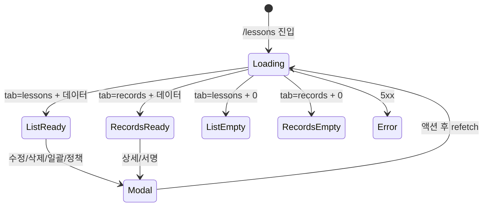

# SCR-C002 수업 관리 — 기본화면 (마스터)

> 이 문서는 **화면 마스터 스펙**입니다. `01~06` 상태 문서는 이 문서를 상속(override/delta)합니다.
> 🚨 수업 정의(Lesson) CRUD + classes 테이블의 **수업 기록** 관리. 서명 기반 완료 처리, 노쇼/취소 정책 설정.

---

## 0. 메타 & 원천 참조

| 항목 | 값 |
|------|----|
| 화면 ID | SCR-C002 |
| 화면명 | 수업 관리 |
| 도메인 | D04-수업관리 |
| 경로 | `/lessons` |
| Next.js Route Group | `(lessons)` |
| 파일 경로 | `src/app/(lessons)/lessons/page.tsx` |
| 페이지 컴포넌트 | `LessonsPage` |
| 역할 | `super/primary/owner/manager/fc/trainer`(CRUD), `staff/front`(조회) |
| 우선순위 | P0 |
| 플랫폼 | 데스크톱(우선) / 태블릿 / 모바일 |
| 멀티테넌트 | ✅ `branchId` 강제 |

### 원천 문서 링크
| 문서 | 경로 | 섹션 |
|---|---|---|
| 화면설계서 | `docs/화면설계서/수업관리.md` | §SCR-C002 수업 관리 |
| 기능명세서 | `docs/기능명세서/수업관리.md` | §1.6 수업 관리 탭 |
| 상태전이도 | `docs/상태전이도.md` | 수업 상태 (예정/진행중/완료/노쇼/취소) |
| 에러코드정의서 | `docs/에러코드정의서.md` | §4.6 E4xx500~599 |
| KPI 정의서 | `docs/KPI_정의서.md` | §PT 완료율, §GX 출석률, §노쇼율 |
| 권한 매트릭스 | `docs/다이어그램/10_권한매트릭스/R1_역할화면_매트릭스.md` | `/lessons` |
| 다이어그램 F1~F8 | `docs/다이어그램/D04_수업관리/SCR-C002_수업관리/` | 전 flow |

---

## 1. 화면 목적 (Why)

수업 정의(Lesson) CRUD 및 classes 테이블의 수업 기록(수업 인스턴스)을 관리.
- 상단 통계카드로 운영 현황 요약
- 상단 탭: [수업 목록] (정의) / [수업 기록] (실제 인스턴스)
- 서명 기반 완료 처리, 노쇼/취소 정책 관리
- 체크박스 일괄 변경 (선택 N개 수정·취소)

---

## 2. 화면 레이아웃 (Wireframe)

```
┌──────────────────────────────────────────────────────────────────┐
│ PageHeader: "수업 관리"                                            │
│  "수업을 등록하고 강사를 배정합니다."                               │
│                    [N개 선택-일괄변경] [노쇼/취소정책] [수업 등록]  │
├──────────────────────────────────────────────────────────────────┤
│ StatCardGrid (4열)                                                 │
│ [전체수업 12] [활성수업 10] [강사수 5] [오늘완료 3]                 │
├──────────────────────────────────────────────────────────────────┤
│ TabNav: [수업 목록] [수업 기록]                                     │
├──────────────────────────────────────────────────────────────────┤
│ (수업 목록 탭)                                                     │
│ ┌──┬──┬────────────┬────┬──────┬────┬────┬────┬──────────┐      │
│ │☐ │No│수업명       │유형│강사명│정원│시간│상태│액션        │      │
│ ├──┼──┼────────────┼────┼──────┼────┼────┼────┼──────────┤      │
│ │☑ │1 │●그룹필라    │그룹│김강사│14 │60  │활성│[수정][삭제] │      │
│ └──┴──┴────────────┴────┴──────┴────┴────┴────┴──────────┘      │
├──────────────────────────────────────────────────────────────────┤
│ (수업 기록 탭)                                                     │
│ ┌──┬────────────┬──────────┬──────┬──────┬────┬────┬────┐       │
│ │No│수업명       │일시       │강사  │회원  │상태│서명│액션 │       │
│ ├──┼────────────┼──────────┼──────┼──────┼────┼────┼────┤       │
│ │1 │그룹필라    │4/12 09:00│김강사│-    │예정│대기│[상세]│       │
│ │2 │1:1 PT     │4/12 10:00│이강사│홍길동│완료│서명│[상세]│       │
│ └──┴────────────┴──────────┴──────┴──────┴────┴────┴────┘       │
└──────────────────────────────────────────────────────────────────┘
```

### 2.2 영역 그리드
| 영역 | 그리드 | 비고 |
|---|---|---|
| PageHeader | `flex items-center justify-between` | 3개 버튼 우측 |
| StatCard | `grid grid-cols-2 md:grid-cols-4 gap-4` | 4개 |
| TabNav | `flex gap-2 border-b` | 2개 탭 |
| DataTable | `w-full` | sticky header |

---

## 3. 디자인 토큰

### 3.1 색상
| 역할 | 클래스 | 용도 |
|---|---|---|
| bg.page | `bg-gray-50` | 전체 |
| bg.card | `bg-white rounded-xl shadow-sm ring-1 ring-gray-100` | 섹션 |
| stat.default | `bg-white text-gray-900` | 기본 카드 |
| stat.mint | `bg-emerald-50 text-emerald-700 ring-emerald-100` | 활성수업/완료 |
| stat.peach | `bg-orange-50 text-orange-700 ring-orange-100` | 강사 |
| badge.scheduled | `bg-blue-100 text-blue-700` | 예정 |
| badge.in_progress | `bg-yellow-100 text-yellow-700` | 진행중 |
| badge.completed | `bg-green-100 text-green-700` | 완료 |
| badge.no_show | `bg-red-100 text-red-700` | 노쇼 |
| badge.cancelled | `bg-gray-100 text-gray-500` | 취소 |
| badge.active | `bg-emerald-100 text-emerald-800` | ACTIVE |
| badge.inactive | `bg-gray-100 text-gray-500` | INACTIVE |
| type.GROUP | `bg-sky-100 text-sky-800` | 그룹 |
| type.PERSONAL | `bg-orange-100 text-orange-800` | 1:1 |
| type.SEMI | `bg-emerald-100 text-emerald-800` | 세미 |

### 3.2 타이포그래피
| 토큰 | 스타일 |
|---|---|
| page.title | `text-2xl font-bold tracking-tight text-gray-900` |
| table.header | `text-xs uppercase tracking-wide text-gray-500 bg-gray-50` |
| table.cell | `text-sm text-gray-900` |
| stat.label | `text-xs uppercase text-gray-500` |
| stat.value | `text-3xl font-bold tabular-nums text-gray-900` |

### 3.3 간격/반경
| 토큰 | 값 |
|---|---|
| page.padding | `p-6 lg:p-8` |
| card.padding | `p-5` |
| section.gap | `space-y-4` |
| table.row.height | `h-12` |

---

## 4. 반응형 규칙

| BP | 폭 | KPI | 테이블 |
|---|---|---|---|
| Mobile <640 | 100% | 2열 | 가로스크롤 또는 카드 |
| Tablet 640~1024 | 100% | 3열 | 가로스크롤 |
| Desktop ≥1024 | sidebar+main | 4열 | full |
| XL ≥1440 | max | 4열 | full |

---

## 5. 🔐 역할별(RBAC) 매트릭스

| 요소 | primary/super | owner | manager | fc | trainer | staff | front | readonly |
|---|:---:|:---:|:---:|:---:|:---:|:---:|:---:|:---:|
| **페이지 접근** | ● | ● | ● | ● | ● (본인 수업만 CRUD) | ○ | ○ | ○ |
| **[+ 수업 등록]** | ● | ● | ● | ● | ● | — | — | — |
| **[일괄변경]** | ● | ● | ● | ● | — | — | — | — |
| **[노쇼/취소정책]** | ● | ● | ● | — | — | — | — | — |
| **체크박스 선택** | ● | ● | ● | ● | — | — | — | — |
| **수업 목록 수정** | ● | ● | ● | ● | ● (본인) | — | — | — |
| **수업 목록 삭제** | ● | ● | ● | ● | ● (본인) | — | — | — |
| **수업 기록 상세** | ● | ● | ● | ● | ● (본인) | ○ | ○ | ○ |
| **상태 변경** (시작/완료/노쇼/취소) | ● | ● | ● | ● | ● (본인) | — | — | — |
| **서명 입력** (DLG-C006) | ● | ● | ● | ● | ● (본인) | — | — | — |
| **엑셀 다운로드** | ● | ● | ● | ● | ● (본인만) | ● | ● | — |

### 5.1 역할 판별 코드
```ts
type Role = 'superAdmin'|'primary'|'owner'|'manager'|'fc'|'trainer'|'staff'|'front'|'readonly';
const canCreateLesson = (r: Role) => ['superAdmin','primary','owner','manager','fc','trainer'].includes(r);
const canBulkEdit     = (r: Role) => ['superAdmin','primary','owner','manager','fc'].includes(r);
const canSetPolicy    = (r: Role) => ['superAdmin','primary','owner','manager'].includes(r);
const canEditRecord   = (r: Role, rec: ClassRecord, userId: number) =>
  canCreateLesson(r) && (r!=='trainer' || rec.instructorId===userId);
const canViewOnly     = (r: Role) => ['staff','front','readonly'].includes(r);
```

---

## 6. 컴포넌트 트리

```tsx
<AppLayout role={user.role}>
  <div className="p-6 lg:p-8 space-y-4">
    <PageHeader
      title="수업 관리"
      subtitle="수업을 등록하고 강사를 배정합니다."
      actions={<>
        {canBulkEdit(role) && selectedIds.length>0 && (
          <Button variant="secondary" onClick={openBulk}>{selectedIds.length}개 선택 · 일괄변경</Button>
        )}
        {canSetPolicy(role) && <Button variant="secondary" onClick={openPolicy}>노쇼/취소 정책</Button>}
        {canCreateLesson(role) && <Button variant="primary" onClick={openAdd}>+ 수업 등록</Button>}
      </>}
    />

    <StatCardGrid cols={4}>
      <StatCard label="전체 수업" value={stats.total} icon={<BookOpen/>} />
      <StatCard label="활성 수업" value={stats.active} icon={<CalendarCheck/>} variant="mint" />
      <StatCard label="강사 수" value={stats.staffCount} icon={<Users/>} variant="peach" />
      <StatCard label="오늘 완료" value={stats.todayCompleted} icon={<Clock/>} variant="mint" />
    </StatCardGrid>

    <TabNav items={[{k:'lessons',l:'수업 목록'},{k:'records',l:'수업 기록'}]} active={tab} onChange={setTab} />

    {tab==='lessons' ? (
      <DataTable columns={LESSON_COLUMNS} data={lessons}
        loading={lessons.isLoading}
        selectable={canBulkEdit(role)}
        selectedIds={selectedIds} onSelect={setSelectedIds}
        emptyState={<BookOpen />} />
    ) : (
      <DataTable columns={RECORD_COLUMNS} data={records}
        loading={records.isLoading}
        onRowClick={canViewOnly(role)?undefined:openRecordDetail}
        emptyState="수업 기록이 없습니다." />
    )}

    {addOpen && <LessonFormModal mode={editing?'edit':'create'} initial={initial} onClose={closeAdd} />}
    {bulkOpen && <BulkChangeModal ids={selectedIds} onClose={closeBulk} />}
    {policyOpen && <PolicyModal onClose={closePolicy} />}
    {recordDetailOpen && <RecordDetailModal id={recId} onClose={closeDetail} />}
    {signatureOpen && <SignatureModal recId={recId} onClose={closeSig} />}
  </div>
</AppLayout>
```

### 6.1 핵심 컴포넌트
| 컴포넌트 | 파일 | Props |
|---|---|---|
| `LessonFormModal` (DLG-C003) | `src/components/lessons/LessonFormModal.tsx` | `{mode, initial, onClose}` |
| `BulkChangeModal` (DLG-C004) | `src/components/lessons/BulkChangeModal.tsx` | `{ids, onClose}` |
| `RecordDetailModal` (DLG-C005) | `src/components/lessons/RecordDetailModal.tsx` | `{id, onClose}` |
| `SignatureModal` (DLG-C006) | `src/components/lessons/SignatureModal.tsx` | `{recId, onClose}` |
| `PolicyModal` (DLG-C007) | `src/components/lessons/PolicyModal.tsx` | `{onClose}` |

---

## 7. 데이터 계약

### 7.1 타입
```ts
// src/types/lessons.ts
export interface Lesson {
  id: number; branchId: number;
  name: string;
  type: 'GROUP'|'PERSONAL'|'SEMI';
  instructorId: number; instructorName: string;
  capacity: number; durationMin: number;
  color: string;
  status: 'ACTIVE'|'INACTIVE';
  createdAt: string; updatedAt: string;
}
export interface ClassRecord {
  id: number; branchId: number; lessonId: number;
  title: string;
  startTime: string; endTime: string;
  staffId: number; staffName: string;
  memberId?: number; memberName?: string;
  lesson_status: 'scheduled'|'in_progress'|'completed'|'no_show'|'cancelled';
  signature_url?: string; signature_at?: string;
  room?: string; memo?: string;
}
export interface LessonStats {
  total: number; active: number; staffCount: number; todayCompleted: number;
}
```

### 7.2 API
| 엔드포인트 | 메서드 | 파라미터 | 반환 |
|---|---|---|---|
| `GET /lessons/stats` | GET | `{branchId}` | `LessonStats` |
| `GET /lessons` | GET | `{branchId, q?}` | `Lesson[]` |
| `POST /lessons` | POST | `LessonFormDto` | `Lesson` |
| `PATCH /lessons/:id` | PATCH | partial | `Lesson` |
| `DELETE /lessons/:id` | DELETE | — | `{success}` |
| `POST /lessons/bulk` | POST | `{ids, action, patch}` | `{updated}` |
| `GET /classes/records` | GET | `{branchId, page, size}` | `Page<ClassRecord>` |
| `PATCH /classes/:id/status` | PATCH | `{status}` | `ClassRecord` |
| `POST /classes/:id/signature` | POST | `{signature}` (base64 dataURL) | `ClassRecord` |
| `POST /branch/policy/lesson` | POST | `LessonPolicy` | `LessonPolicy` |

### 7.3 상태 관리
- React Query: `['lessons', branchId]`, `['records', branchId, page]`
- mutation: 성공 시 `invalidateQueries`
- `useSelection` 훅으로 체크박스 관리

---

## 8. 비즈니스 룰

### 8.1 수업 상태 전이
- `scheduled` → `in_progress` (수업 시작)
- `scheduled|in_progress` → `completed` (서명 필요, DLG-C006)
- `scheduled|in_progress` → `no_show` (세션 차감 + 페널티 policy 시)
- `scheduled|in_progress` → `cancelled`
- `completed|no_show|cancelled` → terminal (상태 변경 버튼 숨김)

### 8.2 서명 기반 완료
- `POST /classes/:id/signature` body: `{signature: 'data:image/png;base64,...'}`
- 서버: Supabase Storage `signatures/{branchId}/{classId}_{timestamp}.png` 업로드
- 이후 `lesson_status='completed'`, `signature_url`, `signature_at` 업데이트
- 서명 실패 시 상태 변경 롤백

### 8.3 일괄 변경
- 작업 선택: 수업 수정 / 수업 취소
- 수정: 강사, 시작/종료 시간, 장소/룸
- 취소: 확인 경고 ("복구할 수 없습니다") + 빨간 경고 박스
- `POST /lessons/bulk` + toast "${N}개 수업이 변경/취소되었습니다."

### 8.4 노쇼/취소 정책 (branchStorage `lesson_policy`)
- 취소 마감 시간 (기본 3h)
- 노쇼 시 세션 차감 (toggle, 기본 ON)
- 자동 완료 시간 (기본 24h)
- 지각 취소 페널티 (toggle, 기본 ON)
- 최대 노쇼 횟수 (기본 3)
- 예약 자동 오픈 (기본 48h)
- 대기열 / 대기열 자동 승격 (toggle, 기본 ON)

### 8.5 멀티테넌트
- `branchId = user.branchId` 서버 강제
- trainer의 수업 기록: `instructorId=user.id` 필터
- URL 조작 시 403 → `/forbidden`

---

## 9. 상태 목록

| 파일 | 상태 코드 | 한글 | 트리거 |
|---|---|---|---|
| `01-로딩.md` | `lessons-loading` | 로딩 | API pending |
| `02-수업목록-정상.md` | `lessons-list-ready` | 수업 목록 정상 | tab=lessons + 데이터 있음 |
| `03-수업기록-정상.md` | `lessons-records-ready` | 수업 기록 정상 | tab=records + 데이터 있음 |
| `04-수업목록-빈상태.md` | `lessons-list-empty` | 수업 목록 빈 | tab=lessons + 데이터 0 |
| `05-수업기록-빈상태.md` | `lessons-records-empty` | 수업 기록 빈 | tab=records + 데이터 0 |
| `06-에러.md` | `lessons-error` | 에러 | 500/503 |

상태 전이: `docs/다이어그램/D04_수업관리/SCR-C002_수업관리/F6_상태별.md`

---

## 10. 에러 코드 매핑

| errorCode | 시나리오 | 표시 | 대응 |
|---|---|---|---|
| E400500 | 정보 누락 | 폼 인라인 | 필드 하이라이트 |
| E400501 | 시간 충돌 | 폼 경고 | confirm 후 강제 |
| E422500 | 잔여 횟수 부족 | 경고 | 회원 안내 |
| E404500 | 수업 없음 | 토스트 | 목록 리프레시 |
| E500001 | 서버 오류 | 06-에러 | 재시도 |
| E503001 | 점검 | 점검 배너 | 대기 |

---

## 11. 접근성 (WCAG 2.1 AA)
- 체크박스: `aria-label="수업 선택"`
- 테이블: `<caption className="sr-only">수업 목록</caption>`
- 행 클릭: `<button>` 또는 `<tr role="button" tabIndex=0>`
- 상태 배지: 색상+텍스트 병기 (색맹 대응)
- 스크린리더 status 전환 안내
- reduce-motion 준수

---

## 12. 진입 / 이탈

### 진입
- 사이드바 > 수업/캘린더 > 수업 관리
- 캘린더 탭 [수업 관리]

### 이탈
| 액션 | 목적지 |
|---|---|
| 상세 클릭 | DLG-C005 (모달) |
| 수정 클릭 | DLG-C003 |
| 삭제 | confirm → DELETE |
| 캘린더 이동 | `/calendar` |

---

## 13. 다이어그램 통합



---

## 14. 🧩 바이브코딩 프롬프트 (마스터)

```
Next.js 15 App Router + TypeScript + Tailwind + React Query + Supabase 기반
'use client' 컴포넌트를 작성하라.

━━ 화면: SCR-C002 수업 관리 (수업 정의 + 수업 기록 2탭) ━━
파일: src/app/(lessons)/lessons/page.tsx
보조:
- src/components/lessons/{LessonFormModal, BulkChangeModal, RecordDetailModal, SignatureModal, PolicyModal}.tsx
- src/hooks/useLessons.ts, useRecords.ts, useSignature.ts
- src/lib/lesson-access.ts (canCreateLesson/canBulkEdit/canSetPolicy/canEditRecord)

━━ RBAC ━━
canCreateLesson: super|primary|owner|manager|fc|trainer (trainer 본인만)
canBulkEdit: super|primary|owner|manager|fc
canSetPolicy: super|primary|owner|manager
staff/front: 조회 전용

━━ 레이아웃 ━━
<div className="p-6 lg:p-8 space-y-4">
  <PageHeader title="수업 관리" subtitle="..." actions={<>
    {selectedIds.length>0 && canBulkEdit(role) && <Button variant="secondary">{selectedIds.length}개 선택 · 일괄변경</Button>}
    {canSetPolicy(role) && <Button variant="secondary">노쇼/취소 정책</Button>}
    {canCreateLesson(role) && <Button variant="primary">+ 수업 등록</Button>}
  </>} />
  <StatCardGrid cols={4}>...</StatCardGrid>
  <TabNav items={TABS} active={tab} />
  <DataTable ... />
</div>

━━ 수업 목록 컬럼 ━━
select(checkbox 40), No(50), 수업명(flex, dot+name), 유형(90 StatusBadge GROUP/PERSONAL/SEMI),
강사명(100), 정원(70, '${v}명'), 시간(70, '${v}분'),
상태(80 ACTIVE=success/INACTIVE=default), 액션(100 Edit2/Trash2)

━━ 수업 기록 컬럼 ━━
No(50), 수업명(flex font-medium), 일시(130 'M/D HH:mm'), 강사(100), 회원(100 or '-'),
상태(80 LessonStatusBadge scheduled/in_progress/completed/no_show/cancelled),
서명(80 ✓서명완료 or 대기), 액션(60 Eye)

━━ 상태 전이 (수업 기록) ━━
scheduled → in_progress: 수업 시작 (lesson_status PATCH)
scheduled|in_progress → completed: SignatureModal(DLG-C006) 오픈
scheduled|in_progress → no_show: PATCH + (policy.autoDeduct ON이면) lesson_counts -1
scheduled|in_progress → cancelled: PATCH
terminal: 상태 변경 버튼 숨김

━━ 디자인 토큰 ━━
statusBadge 색:
  scheduled     blue-100/blue-700
  in_progress   yellow-100/yellow-700
  completed     green-100/green-700
  no_show       red-100/red-700
  cancelled     gray-100/gray-500

typeBadge:
  GROUP     sky-100/sky-800
  PERSONAL  orange-100/orange-800
  SEMI      emerald-100/emerald-800

━━ 서명 ━━
SignatureModal: SignaturePad (react-signature-canvas) → dataURL
POST /classes/:id/signature body:{signature} → Supabase Storage signatures/ 업로드
성공: lesson_status='completed', signature_url, signature_at 업데이트, toast "수업이 완료 처리되었습니다."

━━ 정책 ━━
branchStorage.setItem('lesson_policy', JSON.stringify(policy))
또는 POST /branch/policy/lesson (multi-branch 환경)

━━ 일괄변경 ━━
<BulkChangeModal ids={selectedIds} ...>
- 작업: 수업 수정 | 수업 취소 (ButtonGroup)
- 취소 선택 시 빨간 경고 박스
- 확인 → POST /lessons/bulk
- toast `${N}개 수업이 변경/취소되었습니다.`

━━ 접근성 ━━
- 체크박스 aria-label="수업 {name} 선택"
- 테이블 caption sr-only
- 상태 변경 결과 aria-live="polite" 안내
- 모달 focus trap
```

---

## 15. QA 체크리스트
- [ ] 권한별 버튼 노출 정확
- [ ] trainer는 본인 수업만 수정/삭제 가능
- [ ] 체크박스 N개 선택 시 [일괄변경] 활성
- [ ] 서명 입력 후 completed 상태 + signature_url 저장
- [ ] 노쇼 시 policy.autoDeduct ON이면 lesson_counts 차감
- [ ] 취소 시 "복구 불가" 경고 정확
- [ ] 수업 기록 페이지네이션 20건/page
- [ ] 수업 목록 수업명 오름차순 기본
- [ ] 수업 기록 일시 내림차순 기본
- [ ] 엑셀 다운로드 권한별 정확
- [ ] staff/front 상태 변경 버튼 숨김
- [ ] 에러 시 적절한 errorCode 표시
- [ ] 접근성: Tab/Enter/Space 동작
- [ ] 멀티테넌트 데이터 누수 없음
