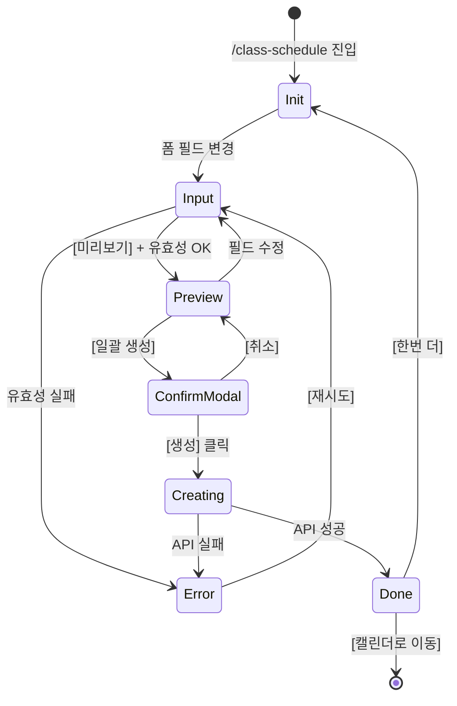

# SCR-C003 시간표 일괄 등록 — 기본화면 (마스터)

> 이 문서는 **화면 마스터 스펙**입니다. `01~06` 상태 문서는 이 문서를 상속(override/delta)합니다.
> 🚨 **manager 이상 전용**: 트레이너·프론트·staff 접근 차단. 그룹수업 템플릿을 기반으로 기간·요일·시간 패턴으로 수업을 **일괄 생성**하는 관리자 도구.

---

## 0. 메타 & 원천 참조

| 항목 | 값 |
|------|----|
| 화면 ID | SCR-C003 |
| 화면명 | 시간표 일괄 등록 |
| 도메인 | D04-수업관리 |
| 경로 | `/class-schedule` |
| Next.js Route Group | `(classes)` |
| 파일 경로 | `src/app/(classes)/class-schedule/page.tsx` |
| 페이지 컴포넌트 | `ClassSchedulePage` |
| 역할 | `superAdmin`, `primary`, `owner`, `manager` (읽기/쓰기) · 그 외 차단 |
| 우선순위 | P1 (수업관리 핵심 도구) |
| 플랫폼 | 데스크톱(우선) / 태블릿 |
| 멀티테넌트 | ✅ `branchId` 강제 |

### 원천 문서 링크
| 문서 | 경로 | 섹션 |
|---|---|---|
| 화면설계서 | `docs/화면설계서/수업관리.md` | §SCR-C003 시간표 일괄 등록 |
| 기능명세서 | `docs/기능명세서/수업관리.md` | §2 시간표 일괄 등록 (`/class-schedule`) |
| 상태전이도 | `docs/상태전이도.md` | 수업 생성 상태 전이 |
| 에러코드정의서 | `docs/에러코드정의서.md` | §4.6 수업/스케줄 (E400500, E400501) |
| KPI 정의서 | `docs/KPI_정의서.md` | §GX 출석률, §수업 대기자 발생률 |
| 권한 매트릭스 | `docs/다이어그램/10_권한매트릭스/R1_역할화면_매트릭스.md` | `/class-schedule` manager 이상 |
| 다이어그램 F1 | `docs/다이어그램/D04_수업관리/SCR-C003_시간표일괄등록/F1_진입.md` | 진입 → 템플릿/강사 로드 |
| 다이어그램 F2 | `docs/다이어그램/D04_수업관리/SCR-C003_시간표일괄등록/F2_메인.md` | 폼 입력 + 미리보기 흐름 |
| 다이어그램 F3 | `docs/다이어그램/D04_수업관리/SCR-C003_시간표일괄등록/F3_버튼액션.md` | BTN_PREVIEW, BTN_BULK_CREATE |
| 다이어그램 F5 | `docs/다이어그램/D04_수업관리/SCR-C003_시간표일괄등록/F5_모달트리거.md` | DLG-C008 일괄 생성 확인 |
| 다이어그램 F6 | `docs/다이어그램/D04_수업관리/SCR-C003_시간표일괄등록/F6_상태별.md` | init/input/preview/creating/done/error |
| 다이어그램 F7 | `docs/다이어그램/D04_수업관리/SCR-C003_시간표일괄등록/F7_권한.md` | trainer/fc/staff/front 403 |
| 다이어그램 F8 | `docs/다이어그램/D04_수업관리/SCR-C003_시간표일괄등록/F8_에러.md` | E400500, E400501, E422500 |

---

## 1. 화면 목적 (Why)

그룹수업 템플릿을 선택하고 **기간/요일/시간 패턴**을 설정하여 수업을 일괄 생성한다. 반복 수업 스케줄(예: "매주 월·수·금 09:00~10:00 필라테스, 2026-04-15 ~ 2026-06-30")을 효율적으로 등록하는 관리자 도구.
- **좌측 폼** + **우측 미리보기** 2열 레이아웃.
- 미리보기 단계에서 생성 예정 수업 건수/일자를 확인 후 DLG-C008 확인 → 서버 bulk INSERT.
- 시간 충돌(E400501)은 사전 미리보기에서 경고하고, 서버에서 재검증.
- 멀티테넌트: `branchId` 강제, super/primary만 지점 전환 가능.

---

## 2. 화면 레이아웃 (Wireframe)

### 2.1 풀뷰 와이어프레임 (데스크톱 1440px 기준)

```
┌──────────────────────────────────────────────────────────────────────┐
│ AppLayout Sidebar                                                     │
├──────────────────────────────────────────────────────────────────────┤
│ PageHeader                                                            │
│  "시간표 일괄 등록"                                                    │
│  "그룹수업 템플릿을 선택하고 요일/기간을 설정해 수업을 일괄 생성합니다."  │
├──────────────────────────────────────────────────────────────────────┤
│ 2열 그리드 (lg:grid-cols-2 gap-4)                                      │
│ ┌─── 좌측: 수업 설정 ─────────────┐ ┌─── 우측: 미리보기 ────────────┐  │
│ │ 수업 템플릿 *                   │ │ 생성 예정 수업 미리보기 (12건)   │  │
│ │ [템플릿 선택 ▼]                 │ │                               │  │
│ │                                 │ │  ┌──┬──┬────────┬──┬──┐     │  │
│ │ 담당 강사                       │ │  │날│요│시간    │강│정│     │  │
│ │ [강사 선택 ▼]                    │ │  ├──┼──┼────────┼──┼──┤     │  │
│ │                                 │ │  │15│월│09~10   │김│14│     │  │
│ │ 요일 *                          │ │  │16│화│09~10   │김│14│     │  │
│ │ (월)(화)(수)(목)(금)(토)(일)      │ │  │17│수│09~10   │김│14│     │  │
│ │                                 │ │  │...│  │       │  │  │     │  │
│ │ 시작시간 *     종료시간 *         │ │  └──┴──┴────────┴──┴──┘     │  │
│ │ [09:00]        [10:00]          │ │                               │  │
│ │                                 │ │  (충돌 경고 있을 시 상단 배너)  │  │
│ │ 시작일 *       종료일 *          │ │                               │  │
│ │ [2026-04-15]   [2026-06-30]     │ │                               │  │
│ │                                 │ │                               │  │
│ │ 정원 (명)      장소/룸            │ │                               │  │
│ │ [14]           [1스튜디오]        │ │                               │  │
│ │                                 │ │                               │  │
│ │ [미리보기] [일괄 생성]            │ │                               │  │
│ └────────────────────────────────┘ └──────────────────────────────┘  │
└──────────────────────────────────────────────────────────────────────┘
```

### 2.2 영역 그리드
| 영역 | 그리드 | 비고 |
|---|---|---|
| PageHeader | `flex items-center justify-between` | 서브타이틀 1줄 |
| Body Grid | `grid grid-cols-1 lg:grid-cols-2 gap-4` | 모바일/태블릿은 세로 스택 |
| 좌측 폼 카드 | `bg-white rounded-xl shadow-sm ring-1 ring-gray-100 p-6 space-y-4` | form |
| 우측 미리보기 카드 | `bg-white rounded-xl shadow-sm ring-1 ring-gray-100 p-6 space-y-3` | 초기: 가이드 / preview=true: 테이블 |
| 요일 선택 | `flex gap-2 flex-wrap` | 7개 Toggle |
| 버튼 그룹 | `flex gap-2 justify-end pt-2` | [미리보기] secondary, [일괄 생성] primary |

---

## 3. 디자인 토큰

### 3.1 색상
| 역할 | 클래스 | 용도 |
|---|---|---|
| bg.page | `bg-gray-50` | 전체 |
| bg.card | `bg-white rounded-xl shadow-sm ring-1 ring-gray-100` | 좌·우 카드 |
| weekday.idle | `bg-white border border-gray-300 text-gray-700 hover:bg-gray-50` | 요일 Off |
| weekday.active | `bg-blue-600 border-blue-600 text-white` | 요일 On |
| btn.primary | `bg-blue-600 hover:bg-blue-700 text-white` | 일괄 생성 |
| btn.secondary | `bg-white border-gray-300 hover:bg-gray-50 text-gray-700` | 미리보기 |
| row.conflict | `bg-rose-50 text-rose-800` | 미리보기 충돌 행 |
| row.normal | `bg-white hover:bg-gray-50` | 미리보기 정상 행 |
| badge.count | `bg-blue-50 text-blue-700 ring-1 ring-blue-200` | 생성 예정 건수 |

### 3.2 타이포그래피
| 토큰 | 스타일 | 용도 |
|---|---|---|
| page.title | `text-2xl font-bold tracking-tight text-gray-900` | |
| page.subtitle | `text-sm text-gray-500` | |
| section.title | `text-base font-semibold text-gray-900` | "생성 예정 수업 미리보기" |
| label | `text-sm font-medium text-gray-700` | 폼 라벨 |
| required | `text-rose-500` after label | * |
| helper | `text-xs text-gray-500` | 힌트 |
| error | `text-xs text-rose-600` | 인라인 에러 |
| preview.date | `text-sm tabular-nums text-gray-900` | |
| preview.time | `text-xs tabular-nums text-gray-600` | |

### 3.3 간격/반경/그림자
| 토큰 | 값 |
|---|---|
| page.padding | `p-4 md:p-6 lg:p-8` |
| card.padding | `p-6` |
| field.gap | `space-y-4` |
| weekday.btn | `h-9 min-w-9 px-3 rounded-full text-sm font-medium transition-colors` |
| input | `h-10 w-full rounded-lg border-gray-300 focus:ring-2 focus:ring-blue-500` |

### 3.4 모션
- 요일 토글: `transition-colors duration-150`
- 미리보기 열림: `animate-[slideDown_200ms_ease-out]`
- 생성 중 프로그레스 바: `animate-pulse` + 실제 % (서버 스트림 가용 시)
- `prefers-reduced-motion`: 모든 애니메이션 비활성

---

## 4. 반응형 규칙

| BP | 폭 | 레이아웃 | 비고 |
|---|---|---|---|
| Mobile <640 | 100% | 세로 스택 | 미리보기는 폼 아래 Accordion. 요일 버튼 2줄 wrap |
| Tablet 640~1024 | 100% | 세로 스택 | 폼 → 미리보기 순 |
| Desktop ≥1024 | Sidebar+main | `grid-cols-2` | 좌 폼 / 우 미리보기 |

---

## 5. 🔐 역할별(RBAC) 매트릭스

> `●` = 표시+CRUD, `○` = 조회만, `—` = 미표시/차단

| 요소 | super/primary | owner | manager | fc | trainer | staff | front | readonly |
|---|:---:|:---:|:---:|:---:|:---:|:---:|:---:|:---:|
| **페이지 접근** | ● (전 지점) | ● | ● | — (403) | — (403) | — (403) | — (403) | — (403) |
| 템플릿 선택 | ● | ● | ● | — | — | — | — | — |
| 강사 선택 | ● (전 지점) | ● | ● | — | — | — | — | — |
| 요일/시간/기간 입력 | ● | ● | ● | — | — | — | — | — |
| 정원·장소 입력 | ● | ● | ● | — | — | — | — | — |
| [미리보기] 버튼 | ● | ● | ● | — | — | — | — | — |
| [일괄 생성] 버튼 | ● | ● | ● | — | — | — | — | — |
| DLG-C008 확인 | ● | ● | ● | — | — | — | — | — |
| 지점 전환 드롭다운 | ● | ● (브랜드 한정) | — | — | — | — | — | — |
| 감사 로그 | 자동 기록 | 자동 기록 | 자동 기록 | — | — | — | — | — |

### 5.1 접근 차단 시 동작
- `fc/trainer/staff/front/readonly`가 URL 직접 접근 → `/forbidden` 리다이렉트 + 감사 로그 `AUDIT.UNAUTHORIZED_ACCESS`.
- 사이드바에서도 해당 메뉴 항목 숨김.

### 5.2 역할 판별 코드
```ts
type Role = 'superAdmin'|'primary'|'owner'|'manager'|'fc'|'trainer'|'staff'|'front'|'readonly';
const canBulkSchedule = (r: Role) => ['superAdmin','primary','owner','manager'].includes(r);
```

---

## 6. 컴포넌트 트리

```tsx
<AppLayout role={user.role}>
  <Guard allow={canBulkSchedule(role)}>
    <div className="p-4 md:p-6 lg:p-8 space-y-4">
      <PageHeader
        title="시간표 일괄 등록"
        subtitle="그룹수업 템플릿을 선택하고 요일/기간을 설정해 수업을 일괄 생성합니다."
      />

      <div className="grid grid-cols-1 lg:grid-cols-2 gap-4">
        {/* 좌측 폼 */}
        <form onSubmit={onPreview} className="bg-white rounded-xl shadow-sm ring-1 ring-gray-100 p-6 space-y-4">
          <FormField label="수업 템플릿" required htmlFor="templateId" error={errors.templateId}>
            <Select id="templateId" options={templateOptions}
                    onChange={applyTemplate} placeholder="템플릿 선택" />
          </FormField>

          <FormField label="담당 강사" htmlFor="instructorId">
            <Select id="instructorId" options={instructorOptions} placeholder="강사 선택" />
          </FormField>

          <FormField label="요일" required error={errors.weekdays}>
            <WeekdayPicker value={form.weekdays} onChange={setWeekdays} />
          </FormField>

          <div className="grid grid-cols-2 gap-3">
            <FormField label="시작시간" required><TimeInput {...register('startTime')} /></FormField>
            <FormField label="종료시간" required><TimeInput {...register('endTime')} /></FormField>
          </div>

          <div className="grid grid-cols-2 gap-3">
            <FormField label="시작일" required><DateInput {...register('startDate')} /></FormField>
            <FormField label="종료일" required><DateInput {...register('endDate')} /></FormField>
          </div>

          <div className="grid grid-cols-2 gap-3">
            <FormField label="정원 (명)"><NumberInput min={1} max={200} {...register('capacity')} /></FormField>
            <FormField label="장소/룸"><Input {...register('room')} /></FormField>
          </div>

          <div className="flex items-center justify-end gap-2 pt-2">
            <Button type="submit" variant="secondary" onClick={handlePreview}>미리보기</Button>
            <Button type="button" variant="primary"
                    disabled={!canSubmit} onClick={openConfirm}>일괄 생성</Button>
          </div>
        </form>

        {/* 우측 미리보기 */}
        <section className="bg-white rounded-xl shadow-sm ring-1 ring-gray-100 p-6 space-y-3">
          {!showPreview ? (
            <EmptyGuide icon={<CalendarPlus className="size-12" />} message="좌측에서 설정 후 미리보기를 클릭하세요." />
          ) : (
            <>
              <header className="flex items-center justify-between">
                <h2 className="text-base font-semibold text-gray-900">생성 예정 수업 미리보기</h2>
                <span className="inline-flex items-center rounded-full bg-blue-50 ring-1 ring-blue-200 px-2.5 py-0.5 text-xs font-medium text-blue-700">
                  {previewRows.length}건
                </span>
              </header>
              {conflictCount > 0 && (
                <div role="alert" className="flex items-start gap-2 rounded-lg bg-amber-50 border border-amber-200 p-3 text-sm text-amber-800">
                  <AlertTriangle className="size-4 mt-0.5" />
                  <p>{conflictCount}건이 기존 수업과 시간 충돌합니다. 확인 후 계속 진행하세요.</p>
                </div>
              )}
              <PreviewTable rows={previewRows} />
            </>
          )}
        </section>
      </div>

      {confirmOpen && (
        <BulkCreateConfirmModal
          rows={previewRows}
          onCancel={closeConfirm}
          onConfirm={handleBulkCreate}
          isCreating={isCreating}
          progress={progress}
        />
      )}
    </div>
  </Guard>
</AppLayout>
```

### 6.1 핵심 컴포넌트
| 컴포넌트 | 파일 | 주요 Props |
|---|---|---|
| `PageHeader` | `src/components/common/PageHeader.tsx` | `{title, subtitle, actions}` |
| `Guard` | `src/components/auth/Guard.tsx` | `{allow, fallback=/forbidden}` |
| `WeekdayPicker` | `src/components/class/WeekdayPicker.tsx` | `{value: number[], onChange}` 0=일~6=토 |
| `TimeInput` | `src/components/ui/TimeInput.tsx` | HH:mm |
| `DateInput` | `src/components/ui/DateInput.tsx` | YYYY-MM-DD |
| `PreviewTable` | `src/components/class/SchedulePreviewTable.tsx` | `{rows}` |
| `BulkCreateConfirmModal` | `src/components/class/BulkCreateConfirmModal.tsx` | DLG-C008 |

---

## 7. 데이터 계약

### 7.1 타입
```ts
// src/types/class-schedule.ts
export interface ClassTemplate {
  id: number;
  branchId: number;
  name: string;
  type: 'GX'|'PT'|'PILATES'|'YOGA'|'ETC';
  defaultCapacity: number;
  defaultDurationMin: number;
  color: string;
  repeatDays: number[];   // 0~6
  isActive: boolean;
}

export interface BulkScheduleForm {
  templateId: number;
  instructorId?: number;
  weekdays: number[];      // 0=일~6=토
  startTime: string;       // HH:mm
  endTime: string;         // HH:mm
  startDate: string;       // YYYY-MM-DD
  endDate: string;         // YYYY-MM-DD
  capacity?: number;
  room?: string;
}

export interface PreviewRow {
  date: string;            // YYYY-MM-DD
  weekday: string;         // 월~일
  startTime: string;
  endTime: string;
  instructorName?: string;
  capacity: number;
  hasConflict: boolean;    // 서버 검증 결과
  conflictWith?: { classId: number; title: string; instructorName: string };
}
```

### 7.2 API 엔드포인트
| 엔드포인트 | 메서드 | 파라미터 | 반환 |
|---|---|---|---|
| `GET /class-templates` | GET | `{branchId, isActive=true}` | `ClassTemplate[]` |
| `GET /staff` | GET | `{branchId, role: IN (trainer,manager,owner,primary,superAdmin)}` | `Instructor[]` |
| `POST /classes/preview` | POST | `BulkScheduleForm` | `{rows: PreviewRow[], conflictCount: number}` |
| `POST /classes/bulk` | POST | `BulkScheduleForm` | `{created: number, failed: number, errors?: any[]}` |

**권한별 스코프**:
- super/primary: `branchId` 쿼리 선택 가능, 미지정 시 현재 컨텍스트
- owner/manager: `branchId = user.branchId` 서버 강제
- 그 외: 401/403

### 7.3 상태 관리
- **Store**: `useAuthStore`, `useBranchStore`
- **Form**: `react-hook-form` + `zodResolver(bulkScheduleSchema)`
- **Fetching**: React Query
  - `['class-templates', branchId]`
  - `['staff', branchId, 'instructor']`
  - preview는 mutation (`POST /classes/preview`) — staleTime 0
- **Mutation**: `POST /classes/bulk` → `invalidateQueries(['classes'])` 전체 캘린더 refetch
- **Local state**: `showPreview`, `confirmOpen`, `isCreating`, `progress (0~100)`

### 7.4 Zod 스키마
```ts
export const bulkScheduleSchema = z.object({
  templateId: z.number({ required_error: '템플릿을 선택하세요.' }).int().positive(),
  instructorId: z.number().int().positive().optional(),
  weekdays: z.array(z.number().min(0).max(6)).min(1, '요일을 하나 이상 선택하세요.'),
  startTime: z.string().regex(/^\d{2}:\d{2}$/, '시작 시간을 입력하세요.'),
  endTime: z.string().regex(/^\d{2}:\d{2}$/, '종료 시간을 입력하세요.'),
  startDate: z.string().regex(/^\d{4}-\d{2}-\d{2}$/, '시작일을 입력하세요.'),
  endDate: z.string().regex(/^\d{4}-\d{2}-\d{2}$/, '종료일을 입력하세요.'),
  capacity: z.number().int().positive().optional(),
  room: z.string().max(50).optional(),
}).refine(d => d.endTime > d.startTime, { path:['endTime'], message:'종료 시간은 시작 시간 이후여야 합니다.' })
  .refine(d => d.endDate >= d.startDate, { path:['endDate'], message:'종료일은 시작일 이후여야 합니다.' });
```

---

## 8. 비즈니스 룰

### 8.1 템플릿 적용
- 템플릿 선택 시 `defaultCapacity`, `defaultDurationMin`, `color`, `repeatDays`가 폼에 **프리필**.
- `defaultDurationMin`을 기준으로 `endTime = startTime + duration` 자동 계산(최초 1회).
- 이후 사용자가 수동 변경하면 그대로 유지.

### 8.2 미리보기 생성 로직
1. 클라이언트는 `startDate ~ endDate` 사이의 날짜 중 `weekdays`에 해당하는 날짜만 추출.
2. 각 날짜에 대해 `startTime ~ endTime`으로 Row 생성.
3. 서버 `POST /classes/preview`가 동일 강사/시간 충돌 여부를 검증(E400501).
4. `hasConflict=true` 행은 rose 배경으로 하이라이트.

### 8.3 일괄 생성 실행
- [일괄 생성] 클릭 → DLG-C008 확인 모달 오픈.
- 확인 모달 상단 20건 + "외 N개 더..." 표시.
- 확인 버튼: `POST /classes/bulk` → 서버는 트랜잭션으로 생성, 진행률은 Server-Sent Event 또는 응답 최종.
- 성공: 토스트 `${N}개 수업이 생성되었습니다.` + 폼 초기화 + `invalidateQueries(['classes'])`.
- 부분 실패: 에러 행 리스트 모달로 전환 + `created/failed` 통계.

### 8.4 시간 충돌 규칙
- 동일 강사, 시간 겹침(`startA < endB && endA > startB`) → 충돌.
- 같은 시간대 다른 강사는 허용(룸 충돌은 별도 검증 가능 — Phase 2).

### 8.5 유효성 및 제한
- 기간 최대 6개월, 한 번에 생성 최대 500건.
- 500건 초과 시 경고: "생성 건수가 많습니다(N건). 기간/요일을 좁혀주세요."
- 템플릿 비활성(`isActive=false`) 항목은 드롭다운에서 제외.

### 8.6 멀티테넌트/권한
1. `branchId`는 `useBranchStore.current`로 확정, 서버 RLS로 재검증.
2. `trainer/fc/staff/front/readonly` 접근 시 `Guard` → `/forbidden`.
3. 감사 로그: 미리보기 `AUDIT.SCHEDULE_PREVIEW`, 일괄 생성 `AUDIT.SCHEDULE_BULK_CREATE`.

---

## 9. 상태 목록

| 파일 | 상태 코드 | 한글 | 트리거 |
|---|---|---|---|
| `01-초기상태.md` | `schedule-init` | 초기 상태 | 진입 직후 |
| `02-입력중.md` | `schedule-input` | 입력 중 | 폼 값 변경 |
| `03-미리보기활성.md` | `schedule-preview` | 미리보기 활성 | [미리보기] 성공 |
| `04-생성중.md` | `schedule-creating` | 생성 중 | [일괄 생성] 확인 |
| `05-완료.md` | `schedule-done` | 완료 | bulk 응답 성공 |
| `06-에러.md` | `schedule-error` | 에러 | preview/bulk 실패 |

상태 전이: `docs/다이어그램/D04_수업관리/SCR-C003_시간표일괄등록/F6_상태별.md`

---

## 10. 에러 코드 매핑

| errorCode | 시나리오 | 표시 | 대응 |
|---|---|---|---|
| E400500 | 수업 정보 누락 | 폼 인라인 에러 | 필드 하이라이트 + focus |
| E400501 | 수업 시간 충돌 | 미리보기 행 rose 하이라이트 + 배너 | 사용자 선택(강행/수정) |
| E400502 | 정원 초과 (템플릿 기본값 > 룸 정원) | 정원 필드 경고 | 수정 유도 |
| E404500 | 템플릿/강사 없음 | 드롭다운 "없음" + 토스트 | 새로고침 |
| E422500 | 범위 초과 (500건 초과) | 경고 모달 | 기간 축소 |
| E401 | 세션 만료 | `/login?redirect=/class-schedule` | 자동 |
| E403 | 권한 없음 | `/forbidden` | 즉시 |
| E500001 | 서버 오류 | 06-에러 | 재시도 |
| E503001 | 서비스 점검 | 06-에러 warn 톤 | 대기 |
| NETWORK | 오프라인 | 06-에러 offline 톤 | 네트워크 확인 |

---

## 11. 접근성 (WCAG 2.1 AA)

| 항목 | 요구사항 |
|---|---|
| 폼 구조 | `<form aria-labelledby="schedule-title">` + 모든 FormField `htmlFor` 연결 |
| 필수 표시 | `<span aria-hidden>*</span>` + `aria-required="true"` |
| WeekdayPicker | `role="group" aria-labelledby="weekday-label"`, 각 토글 `aria-pressed` |
| 시간/날짜 | 네이티브 `type="time"`, `type="date"` 사용 (스크린리더 자동 안내) |
| 미리보기 테이블 | `<table>` + `<caption>` "생성 예정 수업 N건" |
| 충돌 배너 | `role="alert" aria-live="assertive"` |
| 생성 중 프로그레스 | `<progress aria-label="일괄 생성 진행률" value={progress} max={100}>` |
| 포커스 순서 | 템플릿 → 강사 → 요일 → 시작시간 → 종료시간 → 시작일 → 종료일 → 정원 → 장소 → 미리보기 → 일괄생성 |
| 대비 | 본문 4.5:1, 요일 버튼 3:1(비활성 포함) |
| 모션 감소 | `prefers-reduced-motion`: 슬라이드/펄스 제거 |

---

## 12. 진입 / 이탈

### 진입
- 사이드바 > 수업/캘린더 > 시간표 등록
- 캘린더 PageHeader > [스케줄 일괄변경] 메뉴 (Phase 2 연계)
- 일괄 생성 완료 후 "한번 더" → 폼 초기화 상태로 잔류

### 이탈
| 액션 | 목적지 |
|---|---|
| 일괄 생성 성공 | 같은 화면, 폼 초기화 / 또는 "캘린더로 이동" 옵션 → `/calendar` |
| DLG-C008 취소 | 미리보기 상태 유지 |
| TabNav 다른 탭 | `/lessons` 등 |
| 변경사항 있는 상태 이탈 | DLG-000 이탈경고 |

---

## 13. 다이어그램 통합 뷰



---

## 14. 🧩 바이브코딩 프롬프트 (마스터)

```
Next.js 15 App Router + TypeScript + Tailwind v4 + React Query + Supabase + react-hook-form + zod
'use client' 컴포넌트를 작성하라.

━━ 화면: SCR-C003 시간표 일괄 등록 (manager 이상 전용) ━━
파일: src/app/(classes)/class-schedule/page.tsx
보조:
- src/components/class/{WeekdayPicker, SchedulePreviewTable, BulkCreateConfirmModal}.tsx
- src/schemas/class-schedule.ts (bulkScheduleSchema)
- src/hooks/useBulkSchedule.ts
- src/types/class-schedule.ts
- src/lib/schedule-preview.ts (generatePreviewRows)

━━ 권한 가드 ━━
const canBulkSchedule = (r: Role) => ['superAdmin','primary','owner','manager'].includes(r);
if (!canBulkSchedule(user.role)) return redirect('/forbidden');

━━ 레이아웃 ━━
<AppLayout role={user.role}>
  <div className="p-4 md:p-6 lg:p-8 space-y-4">
    <PageHeader title="시간표 일괄 등록"
                subtitle="그룹수업 템플릿을 선택하고 요일/기간을 설정해 수업을 일괄 생성합니다." />
    <div className="grid grid-cols-1 lg:grid-cols-2 gap-4">
      <form className="bg-white rounded-xl shadow-sm ring-1 ring-gray-100 p-6 space-y-4"
            onSubmit={handleSubmit(handlePreview)}>
        {/* 템플릿/강사/요일/시간/기간/정원/장소 */}
        <div className="flex items-center justify-end gap-2 pt-2">
          <Button type="submit" variant="secondary">미리보기</Button>
          <Button type="button" variant="primary"
                  disabled={!showPreview || conflictOverLimit} onClick={openConfirm}>
            일괄 생성
          </Button>
        </div>
      </form>
      <section className="bg-white rounded-xl shadow-sm ring-1 ring-gray-100 p-6 space-y-3">
        {/* showPreview=false: 가이드 / true: 배너 + 테이블 */}
      </section>
    </div>
  </div>
</AppLayout>

━━ 디자인 토큰 (정확히) ━━
weekday.idle:   bg-white border border-gray-300 text-gray-700 hover:bg-gray-50
weekday.active: bg-blue-600 border-blue-600 text-white
btn.primary:    h-10 px-4 rounded-lg bg-blue-600 hover:bg-blue-700 text-white
                disabled:bg-blue-300 disabled:cursor-not-allowed
btn.secondary:  h-10 px-4 rounded-lg bg-white border border-gray-300 hover:bg-gray-50 text-gray-700
conflict.row:   bg-rose-50
count.badge:    inline-flex items-center rounded-full bg-blue-50 ring-1 ring-blue-200
                px-2.5 py-0.5 text-xs font-medium text-blue-700
warn.banner:    rounded-lg bg-amber-50 border border-amber-200 p-3 text-sm text-amber-800

━━ 데이터 ━━
스키마(src/schemas/class-schedule.ts): bulkScheduleSchema (§7.4 그대로)
useForm<BulkScheduleForm>({ resolver: zodResolver(bulkScheduleSchema),
  defaultValues: { templateId: null, weekdays: [], startTime:'09:00', endTime:'10:00',
                   startDate: todayStr(), endDate: addMonths(today,1) } })

훅:
- useClassTemplates({ branchId, isActive: true }) → React Query
- useInstructors({ branchId }) → React Query
- usePreviewSchedule() → mutation POST /classes/preview
- useBulkCreateClasses() → mutation POST /classes/bulk

핸들러:
- handlePreview(values): previewMutation.mutateAsync(values) → setPreviewRows(res.rows)
- handleBulkCreate(): bulkMutation.mutateAsync(form) → toast success + form.reset() + invalidateQueries(['classes'])

━━ 미리보기 클라이언트 선계산(서버 실패 시 폴백) ━━
generatePreviewRows(form): PreviewRow[] {
  const rows=[]; const d=new Date(form.startDate); const end=new Date(form.endDate);
  for (;d<=end; d.setDate(d.getDate()+1)) {
    if (form.weekdays.includes(d.getDay())) {
      rows.push({ date: fmt(d,'yyyy-MM-dd'), weekday: WEEKDAY_KO[d.getDay()],
                  startTime: form.startTime, endTime: form.endTime,
                  instructorName: instructorById(form.instructorId)?.name,
                  capacity: form.capacity ?? template.defaultCapacity, hasConflict: false });
    }
  }
  return rows;
}

━━ 인터랙션 ━━
- 템플릿 선택 → setValue('capacity', template.defaultCapacity);
  setValue('endTime', addMin(startTime, template.defaultDurationMin))
- 요일 토글 → setValue('weekdays', toggleSet(current, day))
- 시작일 > 종료일 → 인라인 에러
- [미리보기] → 유효성 → previewMutation → showPreview=true
- 충돌 배너 표시 + rose 하이라이트
- [일괄 생성] → BulkCreateConfirmModal 오픈
- 생성 중: 진행률 바 + 버튼 disabled + ESC/배경클릭 비활성
- 성공: toast `${N}개 수업이 생성되었습니다.` + form.reset() + 05-완료 화면
- 실패: toast error + 상태 06-에러

━━ 접근성 ━━
- <form aria-labelledby="schedule-title">
- WeekdayPicker role="group", 각 버튼 aria-pressed={on}
- 미리보기 테이블 <caption>, 생성 건수 badge aria-live="polite"
- 충돌 배너 role="alert"
- DLG-C008 role="dialog" aria-modal="true"
- progress aria-label="일괄 생성 진행률" value={progress} max={100}
- prefers-reduced-motion: 애니메이션 off

━━ 반응형 ━━
- 모바일(<640): 세로 스택, 미리보기는 Accordion
- 태블릿(640~1024): 세로 스택
- 데스크톱(≥1024): grid-cols-2

━━ 에러/부분실패 ━━
- templates/staff 로드 실패 → 드롭다운 비활성 + 재시도 버튼
- preview 실패 → 토스트 + 상태 유지
- bulk 실패 → 에러 모달에 에러 행 리스트 + 성공 N건/실패 M건
- E400501 → 서버는 실패 행 반환, 클라이언트는 "N건 충돌로 건너뜀"
- E422500 > 500건 → 경고 모달 + 기간 축소 제안
- 401/403 → 전역 인터셉터
```

---

## 15. QA 체크리스트 (수용 기준)

- [ ] `fc/trainer/staff/front/readonly` URL 직접 접근 시 `/forbidden` 리다이렉트
- [ ] 템플릿 선택 시 `defaultCapacity`, `defaultDurationMin`, `color` 프리필
- [ ] 요일 0개 선택 시 미리보기 인라인 에러
- [ ] `endTime > startTime`, `endDate >= startDate` 인라인 에러
- [ ] 기간 내 요일 날짜만 미리보기 Row 생성 정확성
- [ ] 충돌 행 rose 하이라이트 + 상단 배너 건수 일치
- [ ] 500건 초과 시 경고 및 생성 불가
- [ ] DLG-C008 상위 20건 + "외 N개 더..." 표시
- [ ] 생성 중 버튼 disabled, 프로그레스 바 가시화
- [ ] 생성 성공 시 토스트 + 폼 초기화 + 캘린더 쿼리 invalidate
- [ ] 생성 부분 실패 시 에러 리스트 + 재시도 옵션
- [ ] 네트워크 오프라인 시 06-에러 offline 톤
- [ ] super/primary BranchSwitcher 동작
- [ ] 키보드만으로 전체 플로우 완수 (Tab + Enter + Space)
- [ ] 스크린리더: 충돌 배너 즉시 공지 (`role="alert"`)
- [ ] `prefers-reduced-motion` 애니메이션 비활성
- [ ] 감사 로그 `AUDIT.SCHEDULE_BULK_CREATE` 적재
- [ ] 멀티테넌트: 다른 지점 데이터 누수 없음
