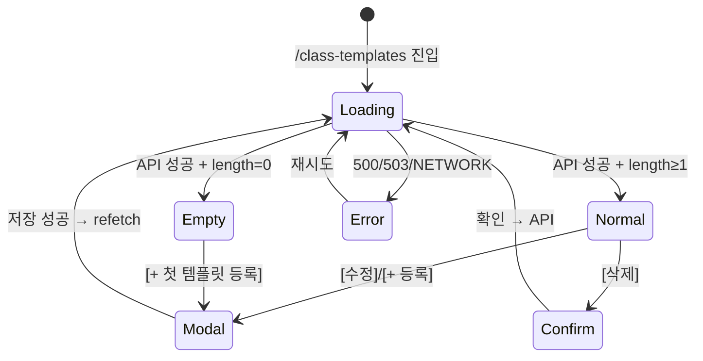

# SCR-C004 그룹수업 템플릿 관리 — 기본화면 (마스터)

> 이 문서는 **화면 마스터 스펙**입니다. `01~04` 상태 문서는 이 문서를 상속(override/delta)합니다.
> 🚨 **manager 이상 CRUD**, **trainer 조회만**, **fc/staff/front/readonly 차단**. 그룹수업의 기본 설정(유형/정원/시간/색상/반복요일)을 템플릿으로 저장해 시간표 일괄 등록·캘린더에서 재사용하는 관리 화면.

---

## 0. 메타 & 원천 참조

| 항목 | 값 |
|------|----|
| 화면 ID | SCR-C004 |
| 화면명 | 그룹수업 템플릿 관리 |
| 도메인 | D04-수업관리 |
| 경로 | `/class-templates` |
| Next.js Route Group | `(classes)` |
| 파일 경로 | `src/app/(classes)/class-templates/page.tsx` |
| 페이지 컴포넌트 | `ClassTemplatesPage` |
| 역할 | `superAdmin/primary/owner/manager` (CRUD), `trainer` (조회), `fc/staff/front/readonly` (차단) |
| 우선순위 | P1 |
| 플랫폼 | 데스크톱(우선) / 태블릿 / 모바일 |
| 멀티테넌트 | ✅ `branchId` 강제 |

### 원천 문서 링크
| 문서 | 경로 | 섹션 |
|---|---|---|
| 화면설계서 | `docs/화면설계서/수업관리.md` | §SCR-C004 그룹수업 템플릿 관리 |
| 기능명세서 | `docs/기능명세서/수업관리.md` | §3 그룹수업 템플릿 (`/class-templates`) |
| 상태전이도 | `docs/상태전이도.md` | 템플릿 활성/비활성 |
| 에러코드정의서 | `docs/에러코드정의서.md` | §4.6 수업/스케줄 (E400500, E404500) |
| 권한 매트릭스 | `docs/다이어그램/10_권한매트릭스/R1_역할화면_매트릭스.md` | `/class-templates` |
| 다이어그램 F1 | `docs/다이어그램/D04_수업관리/SCR-C004_그룹수업템플릿/F1_진입.md` | 템플릿 목록 로드 |
| 다이어그램 F2 | `docs/다이어그램/D04_수업관리/SCR-C004_그룹수업템플릿/F2_메인.md` | StatCards + 테이블 |
| 다이어그램 F3 | `docs/다이어그램/D04_수업관리/SCR-C004_그룹수업템플릿/F3_버튼액션.md` | BTN_ADD, BTN_EDIT, BTN_DELETE |
| 다이어그램 F4 | `docs/다이어그램/D04_수업관리/SCR-C004_그룹수업템플릿/F4_필터검색.md` | 템플릿명 검색 |
| 다이어그램 F5 | `docs/다이어그램/D04_수업관리/SCR-C004_그룹수업템플릿/F5_모달트리거.md` | DLG-C009 |
| 다이어그램 F6 | `docs/다이어그램/D04_수업관리/SCR-C004_그룹수업템플릿/F6_상태별.md` | loading/normal/empty/error |
| 다이어그램 F7 | `docs/다이어그램/D04_수업관리/SCR-C004_그룹수업템플릿/F7_권한.md` | trainer 조회만 |

---

## 1. 화면 목적 (Why)

그룹수업의 **기본 설정**(유형/정원/시간/색상/반복요일/활성여부)을 템플릿으로 저장하여:
- **SCR-C003 시간표 일괄 등록**에서 템플릿 선택만으로 프리필.
- **SCR-C001 수업 캘린더**에서 빠른 수업 등록에 활용.
- 반복 수업 구조의 일관성 유지 및 휴먼 에러 감소.

3열 StatCards(전체/활성/비활성) + 검색 + DataTable(No/템플릿명/유형/기본정원/기본시간/상태/액션).

---

## 2. 화면 레이아웃 (Wireframe)

### 2.1 풀뷰 와이어프레임

```
┌──────────────────────────────────────────────────────────────────────┐
│ PageHeader                                                            │
│  "그룹수업 템플릿 관리"                         [+ 템플릿 등록]         │
│  "수업 템플릿을 등록하고 시간표에 활용합니다."                           │
├──────────────────────────────────────────────────────────────────────┤
│ StatCardGrid (3열)                                                    │
│ ┌──────────────┐ ┌──────────────┐ ┌──────────────┐                   │
│ │ 전체 템플릿   │ │ 활성 템플릿   │ │ 비활성 템플릿  │                   │
│ │ N개 [LayoutTmpl] │ N개 [CheckCircle]│ N개 [XCircle]   │             │
│ └──────────────┘ └──────────────┘ └──────────────┘                   │
├──────────────────────────────────────────────────────────────────────┤
│ SearchFilter                                                          │
│ [🔍 템플릿명/유형 검색]                                                │
├──────────────────────────────────────────────────────────────────────┤
│ DataTable                                                             │
│ ┌──┬──────────┬────┬──────┬──────┬──────┬───────────────┐            │
│ │No│템플릿명   │유형│기본정원│기본시간│상태  │액션           │            │
│ │  │● 필라테스 │PILATES│14명 │60분   │활성  │[수정] [삭제]  │            │
│ │  │● 요가    │YOGA  │10명  │60분   │활성  │[수정] [삭제]  │            │
│ └──┴──────────┴────┴──────┴──────┴──────┴───────────────┘            │
└──────────────────────────────────────────────────────────────────────┘
```

### 2.2 영역 그리드
| 영역 | 그리드 | 비고 |
|---|---|---|
| PageHeader | `flex items-center justify-between` | 우측 Primary 버튼 |
| StatCardGrid | `grid grid-cols-1 sm:grid-cols-3 gap-4` | |
| SearchFilter | `flex items-center gap-2` | debounce 300ms |
| DataTable | full-width, `rounded-xl ring-1 ring-gray-100 bg-white` | pagination 없음 |

---

## 3. 디자인 토큰

### 3.1 색상
| 역할 | 클래스 | 용도 |
|---|---|---|
| bg.page | `bg-gray-50` | 전체 |
| bg.card | `bg-white rounded-xl shadow-sm ring-1 ring-gray-100` | StatCard/Table |
| stat.default | `text-gray-500 bg-gray-100` | 아이콘 배경 |
| stat.mint | `text-emerald-600 bg-emerald-50` | 활성 |
| stat.peach | `text-rose-600 bg-rose-50` | 비활성 |
| badge.GX | `bg-sky-50 text-sky-700 ring-1 ring-sky-200` | |
| badge.PT | `bg-orange-50 text-orange-700 ring-1 ring-orange-200` | |
| badge.PILATES | `bg-emerald-50 text-emerald-700 ring-1 ring-emerald-200` | |
| badge.YOGA | `bg-amber-50 text-amber-700 ring-1 ring-amber-200` | |
| badge.ETC | `bg-gray-50 text-gray-700 ring-1 ring-gray-200` | |
| status.active | `bg-emerald-100 text-emerald-800` | |
| status.inactive | `bg-gray-100 text-gray-600` | |
| row.hover | `hover:bg-gray-50` | |

### 3.2 타이포그래피
| 토큰 | 스타일 |
|---|---|
| page.title | `text-2xl font-bold tracking-tight text-gray-900` |
| stat.value | `text-2xl font-bold text-gray-900 tabular-nums` |
| stat.label | `text-sm text-gray-500` |
| table.name | `text-sm font-medium text-gray-900` |
| table.cell | `text-sm text-gray-700 tabular-nums` |
| badge | `text-xs font-medium` |

### 3.3 간격/반경
| 토큰 | 값 |
|---|---|
| page.padding | `p-4 md:p-6 lg:p-8` |
| stat.padding | `p-4` |
| table.cell | `px-4 py-3` |
| color.dot | `size-2 rounded-full` |

---

## 4. 반응형 규칙

| BP | 폭 | StatCardGrid | 테이블 | 검색 |
|---|---|---|---|---|
| Mobile <640 | 100% | 1열 | 주요 컬럼만(템플릿명/유형/액션), 나머지 carousel | 전폭 |
| Tablet 640~1024 | 100% | 3열 | 정상 | 우측 정렬 |
| Desktop ≥1024 | Sidebar+main | 3열 | 정상 | 우측 정렬 |

---

## 5. 🔐 역할별(RBAC) 매트릭스

> `●` = 표시+CRUD, `○` = 조회만, `—` = 미표시/차단

| 요소 | super/primary | owner | manager | fc | trainer | staff | front | readonly |
|---|:---:|:---:|:---:|:---:|:---:|:---:|:---:|:---:|
| **페이지 접근** | ● (전 지점) | ● | ● | — (403) | ○ (조회) | — (403) | — (403) | ○ |
| StatCards | ● | ● | ● | — | ● | — | — | ● |
| SearchFilter | ● | ● | ● | — | ● | — | — | ● |
| DataTable 조회 | ● | ● | ● | — | ● | — | — | ● |
| **[+ 템플릿 등록]** | ● | ● | ● | — | — | — | — | — |
| **[수정]** 액션 | ● | ● | ● | — | — | — | — | — |
| **[삭제]** 액션 | ● | ● | ● | — | — | — | — | — |
| **활성 토글** | ● | ● | ● | — | — | — | — | — |
| 지점 전환 | ● | ● (브랜드) | — | — | — | — | — | — |

### 5.1 trainer 조회 정책
- trainer는 **조회만** (액션 열에 [수정]/[삭제] 미표시, 행 클릭 시 상세 읽기 전용 모달 — Phase 2).
- trainer의 본인 지점 템플릿만 표시.

### 5.2 역할 판별 코드
```ts
const canViewTemplates = (r: Role) => ['superAdmin','primary','owner','manager','trainer','readonly'].includes(r);
const canEditTemplates = (r: Role) => ['superAdmin','primary','owner','manager'].includes(r);
```

---

## 6. 컴포넌트 트리

```tsx
<AppLayout role={user.role}>
  <Guard allow={canViewTemplates(role)}>
    <div className="p-4 md:p-6 lg:p-8 space-y-4">
      <PageHeader
        title="그룹수업 템플릿 관리"
        subtitle="수업 템플릿을 등록하고 시간표에 활용합니다."
        actions={canEditTemplates(role) && (
          <Button variant="primary" onClick={openAddModal}>+ 템플릿 등록</Button>
        )}
      />

      <StatCardGrid stats={[
        { label: '전체 템플릿', value: total, icon: <LayoutTemplate />, variant: 'default' },
        { label: '활성 템플릿', value: activeCount, icon: <CheckCircle />, variant: 'mint' },
        { label: '비활성 템플릿', value: inactiveCount, icon: <XCircle />, variant: 'peach' },
      ]} />

      <SearchFilter
        value={query}
        onChange={setQuery}
        placeholder="템플릿명 또는 유형 검색"
        debounceMs={300}
      />

      <DataTable
        columns={columns(role)}
        rows={filteredTemplates}
        loading={isLoading}
        emptyState={<EmptyState icon={<LayoutTemplate />} message="등록된 템플릿이 없습니다." />}
        rowKey="id"
      />

      {addModalOpen && (
        <TemplateFormModal mode="create" onClose={closeAdd}
                           onSubmit={handleCreate} />
      )}
      {editingTemplate && (
        <TemplateFormModal mode="edit" initial={editingTemplate}
                           onClose={closeEdit} onSubmit={handleUpdate} />
      )}
      <ConfirmDialog open={deleteId != null} title="템플릿 삭제"
                     message="이 템플릿을 삭제하시겠습니까?"
                     onConfirm={handleDelete} onCancel={() => setDeleteId(null)} />
    </div>
  </Guard>
</AppLayout>
```

### 6.1 핵심 컴포넌트
| 컴포넌트 | 파일 | Props |
|---|---|---|
| `PageHeader` | `src/components/common/PageHeader.tsx` | `{title, subtitle, actions}` |
| `StatCardGrid` | `src/components/common/StatCardGrid.tsx` | `{stats[]}` |
| `SearchFilter` | `src/components/common/SearchFilter.tsx` | `{value, onChange, placeholder, debounceMs}` |
| `DataTable` | `src/components/common/DataTable.tsx` | `{columns, rows, loading, emptyState, rowKey}` |
| `TemplateFormModal` | `src/components/class/TemplateFormModal.tsx` | `DLG-C009` |
| `ConfirmDialog` | `src/components/common/ConfirmDialog.tsx` | `{open,title,message,onConfirm,onCancel}` |

### 6.2 컬럼 정의
```ts
const columns = (role: Role): Column<ClassTemplate>[] => [
  { key: 'no', label: 'No', width: 50, align: 'center',
    render: (_, __, i) => i + 1 },
  { key: 'name', label: '템플릿명', align: 'left',
    render: (v, row) => (
      <span className="flex items-center gap-2">
        <span className="size-2 rounded-full" style={{ background: row.color }} />
        <span className="font-medium text-gray-900">{v}</span>
      </span>
    )},
  { key: 'type', label: '유형', width: 90, align: 'center',
    render: v => <StatusBadge tone={TYPE_TONE[v]}>{v}</StatusBadge> },
  { key: 'defaultCapacity', label: '기본정원', width: 80, align: 'center',
    render: v => `${v}명` },
  { key: 'defaultDurationMin', label: '기본시간', width: 80, align: 'center',
    render: v => `${v}분` },
  { key: 'isActive', label: '상태', width: 80, align: 'center',
    render: v => <StatusBadge tone={v ? 'success' : 'default'}>{v ? '활성' : '비활성'}</StatusBadge> },
  ...(canEditTemplates(role) ? [{
    key: 'actions', label: '액션', width: 100, align: 'center',
    render: (_, row) => (
      <div className="flex items-center justify-center gap-1">
        <IconButton icon={<Edit2 />} aria-label="수정" onClick={() => openEdit(row)} />
        <IconButton icon={<Trash2 />} aria-label="삭제" onClick={() => setDeleteId(row.id)} tone="danger" />
      </div>
    )
  }] : []),
];
```

---

## 7. 데이터 계약

### 7.1 타입
```ts
export interface ClassTemplate {
  id: number;
  branchId: number;
  name: string;                         // "필라테스 초급"
  type: 'GX'|'PT'|'PILATES'|'YOGA'|'ETC';
  defaultCapacity: number;              // 기본정원(명)
  defaultDurationMin: number;           // 기본시간(분)
  description?: string;
  color: string;                        // HEX "#6366f1"
  repeatDays?: number[];                // 0~6
  isActive: boolean;
  createdAt: string;
  updatedAt: string;
}
```

### 7.2 API 엔드포인트
| 엔드포인트 | 메서드 | 파라미터 | 반환 |
|---|---|---|---|
| `GET /class-templates` | GET | `{branchId, q?, type?}` | `ClassTemplate[]` |
| `POST /class-templates` | POST | `Omit<ClassTemplate,'id'>` | `ClassTemplate` |
| `PATCH /class-templates/:id` | PATCH | `Partial<ClassTemplate>` | `ClassTemplate` |
| `DELETE /class-templates/:id` | DELETE | — | `{success}` |

### 7.3 상태 관리
- React Query key: `['class-templates', branchId, query]`
- `staleTime: 60_000`, `refetchOnWindowFocus: false`
- Mutation 성공 후 `invalidateQueries(['class-templates', branchId])`

### 7.4 Zod 스키마 (폼)
```ts
export const templateSchema = z.object({
  name: z.string().min(1, '템플릿 이름을 입력하세요.').max(50),
  type: z.enum(['GX','PT','PILATES','YOGA','ETC']).default('GX'),
  defaultCapacity: z.coerce.number().int().min(1).max(200).default(10),
  defaultDurationMin: z.coerce.number().int().min(10).max(300).default(60),
  description: z.string().max(500).optional(),
  color: z.string().regex(/^#[0-9a-f]{6}$/i).default('#6366f1'),
  repeatDays: z.array(z.number().min(0).max(6)).default([]),
  isActive: z.boolean().default(true),
});
```

---

## 8. 비즈니스 룰

### 8.1 검색
- `name ILIKE %q%` OR `type ILIKE %q%` (클라이언트 필터 + 서버 검색 겸용).
- 300ms debounce.

### 8.2 등록/수정 (DLG-C009)
- 중복 `name` 허용(경고만): `이미 같은 이름의 템플릿이 있습니다. 계속 진행하시겠습니까?`
- 색상 팔레트 10개 프리셋(`#6366f1, #0ea5e9, #10b981, #f59e0b, #ef4444, #8b5cf6, #ec4899, #14b8a6, #f97316, #6b7280`).
- `defaultDurationMin`는 `10~300`분 제한.

### 8.3 삭제
- 참조 중인 수업이 있는 경우(E400500 서버 검증) 삭제 거부 + 토스트 `이 템플릿을 사용 중인 수업이 있습니다. 비활성화를 권장합니다.`
- 연관 없으면 soft delete(`isActive=false`) 또는 hard delete(정책 선택).

### 8.4 정렬
- 기본: 템플릿명 오름차순.

### 8.5 멀티테넌트/권한
- `branchId`는 `user.branchId` (owner/manager) 또는 `useBranchStore.current` (super/primary).
- trainer는 조회만 + 본인 지점.
- 다른 지점 템플릿 URL 파라미터 접근 시 403.

### 8.6 감사 로그
- 생성 `AUDIT.TEMPLATE_CREATE` / 수정 `AUDIT.TEMPLATE_UPDATE` / 삭제 `AUDIT.TEMPLATE_DELETE`.

---

## 9. 상태 목록

| 파일 | 상태 코드 | 한글 | 트리거 |
|---|---|---|---|
| `01-로딩.md` | `template-loading` | 로딩 | 진입, refetch |
| `02-정상.md` | `template-normal` | 정상 | 성공 + length≥1 |
| `03-빈상태.md` | `template-empty` | 빈 상태 | 성공 + length=0 |
| `04-에러.md` | `template-error` | 에러 | 500/503/NETWORK |

상태 전이: `docs/다이어그램/D04_수업관리/SCR-C004_그룹수업템플릿/F6_상태별.md`

---

## 10. 에러 코드 매핑

| errorCode | 시나리오 | 표시 | 대응 |
|---|---|---|---|
| E400500 | 필수 필드 누락 | 폼 인라인 | 포커스 |
| E404500 | 템플릿 없음(수정/삭제 동시 충돌) | 토스트 + 목록 리프레시 | 자동 |
| E409000 | 삭제 불가(참조 중) | 토스트 경고 | 비활성 권장 |
| E401 | 세션 만료 | `/login?redirect=/class-templates` | 자동 |
| E403 | 권한 없음 | `/forbidden` | 즉시 |
| E500001 | 서버 오류 | 04-에러 | 재시도 |
| E503001 | 점검 | 04-에러 warn | 대기 |
| NETWORK | 오프라인 | 04-에러 offline | 네트워크 확인 |

---

## 11. 접근성 (WCAG 2.1 AA)

| 항목 | 요구사항 |
|---|---|
| StatCards | `role="group" aria-label="템플릿 통계"` |
| SearchFilter | `<label>` 연결, `aria-describedby="search-hint"` |
| DataTable | `<table role="table">`, `<caption>` "그룹수업 템플릿 목록", 헤더 `scope="col"` |
| 색상 dot | `aria-hidden` (색상만으로 의미 전달 금지 — 텍스트 동반) |
| 액션 버튼 | `aria-label="수정: {name}"`, `aria-label="삭제: {name}"` |
| DLG-C009 | `role="dialog" aria-modal="true"`, 포커스 트랩, ESC 닫기 |
| 삭제 confirm | `role="alertdialog" aria-describedby` |
| 포커스 순서 | 등록 → 검색 → 행 액션 순 |
| 대비 | 모든 뱃지 텍스트 4.5:1 |
| 모션 | `prefers-reduced-motion` 준수 |

---

## 12. 진입 / 이탈

### 진입
- 사이드바 > 수업/캘린더 > 수업 템플릿
- SCR-C003 시간표 일괄 등록 > "템플릿 관리" 링크

### 이탈
| 액션 | 목적지 |
|---|---|
| [+ 템플릿 등록] | DLG-C009 (같은 경로) |
| [수정] | DLG-C009 (프리필, 같은 경로) |
| [삭제] | ConfirmDialog → API |
| 다른 탭 | `/lessons`, `/class-schedule` 등 |

---

## 13. 다이어그램 통합 뷰



---

## 14. 🧩 바이브코딩 프롬프트 (마스터)

```
Next.js 15 App Router + TypeScript + Tailwind v4 + React Query + Supabase + react-hook-form + zod
'use client' 컴포넌트를 작성하라.

━━ 화면: SCR-C004 그룹수업 템플릿 관리 (manager 이상 CRUD, trainer 조회) ━━
파일: src/app/(classes)/class-templates/page.tsx
보조:
- src/components/class/TemplateFormModal.tsx (DLG-C009)
- src/components/common/{StatCardGrid, SearchFilter, DataTable, ConfirmDialog}.tsx
- src/schemas/class-template.ts (templateSchema)
- src/hooks/useClassTemplates.ts
- src/types/class-template.ts

━━ 권한 ━━
const canViewTemplates = (r: Role) => ['superAdmin','primary','owner','manager','trainer','readonly'].includes(r);
const canEditTemplates = (r: Role) => ['superAdmin','primary','owner','manager'].includes(r);

━━ 레이아웃 ━━
<AppLayout role={role}>
  <div className="p-4 md:p-6 lg:p-8 space-y-4">
    <PageHeader
      title="그룹수업 템플릿 관리"
      subtitle="수업 템플릿을 등록하고 시간표에 활용합니다."
      actions={canEditTemplates(role) && (
        <Button variant="primary" onClick={openAdd}>+ 템플릿 등록</Button>
      )} />
    <StatCardGrid className="grid grid-cols-1 sm:grid-cols-3 gap-4"
      stats={[
        { label:'전체 템플릿', value:total, icon:<LayoutTemplate/>, variant:'default' },
        { label:'활성 템플릿', value:active, icon:<CheckCircle/>, variant:'mint' },
        { label:'비활성 템플릿', value:inactive, icon:<XCircle/>, variant:'peach' },
      ]} />
    <SearchFilter value={q} onChange={setQ} debounceMs={300}
      placeholder="템플릿명 또는 유형 검색" />
    <DataTable columns={columns(role)} rows={filtered} loading={isLoading}
      emptyState={<EmptyState icon={<LayoutTemplate/>} message="등록된 템플릿이 없습니다." />}
      rowKey="id" />
  </div>
</AppLayout>

━━ 디자인 토큰 ━━
badge.tone:
  GX → sky, PT → orange, PILATES → emerald, YOGA → amber, ETC → gray
status.active:   bg-emerald-100 text-emerald-800
status.inactive: bg-gray-100 text-gray-600
color.dot:       size-2 rounded-full (inline-block with template.color)
card:            bg-white rounded-xl shadow-sm ring-1 ring-gray-100 p-4
table.row:       hover:bg-gray-50 transition-colors
table.cell:      px-4 py-3 text-sm

━━ 데이터 ━━
스키마: templateSchema (§7.4 그대로)
React Query:
  key: ['class-templates', branchId, q]
  queryFn: supabase.from('class_templates')
    .select('*').eq('branch_id', branchId)
    .order('name', {ascending: true});
  클라이언트 필터: (q === '' || t.name.toLowerCase().includes(q) || t.type.toLowerCase().includes(q))

Mutations:
  create: POST /class-templates → invalidateQueries(['class-templates'])
  update: PATCH /class-templates/:id
  delete: DELETE /class-templates/:id (409 시 토스트 "사용 중, 비활성 권장")

━━ DLG-C009 (TemplateFormModal) ━━
너비 480px, 헤더 "템플릿 등록"/"템플릿 수정"
필드: name, type(Select), defaultCapacity(Number), defaultDurationMin(Number),
     description(Textarea), color(팔레트 10), repeatDays(WeekdayPicker), isActive(Toggle)
버튼: [취소] / [등록]|[수정]
성공 토스트: "템플릿이 등록/수정되었습니다."

━━ 인터랙션 ━━
- 행 hover bg-gray-50
- [수정] 클릭 → 현재 행을 editingTemplate에 세팅, DLG-C009 오픈
- [삭제] 클릭 → ConfirmDialog → 확인 → DELETE
  · 409 에러 → "이 템플릿을 사용 중인 수업이 있습니다. 비활성화를 권장합니다." + 비활성 토글 제안
- 검색어 300ms debounce 후 필터 재실행
- 빈 상태에서 [+ 첫 템플릿 등록] → DLG-C009(create)

━━ 접근성 ━━
- table caption "그룹수업 템플릿 목록"
- 아이콘 버튼 aria-label: "수정: {name}", "삭제: {name}"
- 색상 dot aria-hidden=true (유형 텍스트가 정답)
- DLG role="dialog" aria-modal, ESC 닫기, 포커스 트랩
- 삭제 Confirm role="alertdialog"
- prefers-reduced-motion: 애니메이션 off

━━ 반응형 ━━
모바일: StatCardGrid 1열, 테이블은 주요 컬럼만(템플릿명/유형/액션), 나머지는 상세 모달
태블릿/데스크톱: 3열 + 정상 테이블

━━ 에러/부분실패 ━━
- 쿼리 실패 → 04-에러
- 생성/수정 중 네트워크 끊김 → 토스트 + 폼 유지
- 삭제 409 → 경고 토스트 + 비활성 권장
- 401/403 → 전역 인터셉터
```

---

## 15. QA 체크리스트 (수용 기준)

- [ ] trainer는 [수정]/[삭제] 버튼 노출 안 됨, 조회만 가능
- [ ] fc/staff/front URL 직접 접근 시 `/forbidden`
- [ ] StatCards: 전체/활성/비활성 집계 정확
- [ ] 검색 300ms debounce 후 필터 반영
- [ ] 색상 dot + 템플릿명 + 유형 뱃지 정확 렌더
- [ ] 유형별 뱃지 색상 정확: GX=sky, PT=orange, PILATES=emerald, YOGA=amber, ETC=gray
- [ ] [+ 등록] → DLG-C009 빈 폼, 색상 팔레트 10색, 반복요일 선택
- [ ] [수정] → DLG-C009 프리필, 같은 이름 중복 시 경고 후 진행
- [ ] [삭제] → ConfirmDialog, 409 시 비활성 권장 토스트
- [ ] 저장 성공 시 목록 즉시 갱신(invalidateQueries)
- [ ] 빈 상태에서 [+ 첫 템플릿 등록] 버튼 노출
- [ ] 키보드: Tab 흐름 + Enter로 모달 열기/저장
- [ ] 스크린리더: 테이블 caption, 아이콘 버튼 aria-label
- [ ] prefers-reduced-motion 준수
- [ ] 멀티테넌트: 다른 지점 데이터 누수 없음
- [ ] 감사 로그 적재 확인
