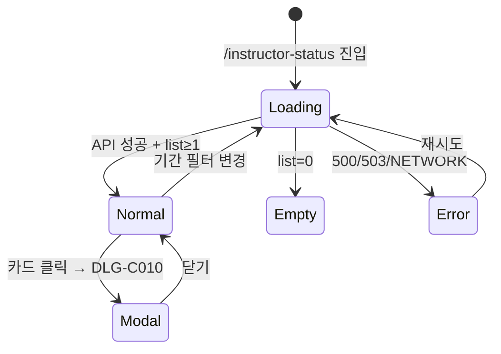

# SCR-C006 강사 근무 현황 — 기본화면 (마스터)

> 이 문서는 **화면 마스터 스펙**입니다. `01~04` 상태 문서는 이 문서를 상속(override/delta)합니다.
> 🚨 **강사별 KPI 카드 대시보드**: manager 이상 전체 강사, **trainer는 본인 카드만**, fc/staff/front 차단. 수업 수·근무시간·출석률·노쇼율·매출 기여를 카드 그리드로 시각화.

---

## 0. 메타 & 원천 참조

| 항목 | 값 |
|------|----|
| 화면 ID | SCR-C006 |
| 화면명 | 강사 근무 현황 |
| 도메인 | D04-수업관리 |
| 경로 | `/instructor-status` |
| Next.js Route Group | `(classes)` |
| 파일 경로 | `src/app/(classes)/instructor-status/page.tsx` |
| 페이지 컴포넌트 | `InstructorStatusPage` |
| 역할 | `superAdmin/primary/owner/manager` (전체) · `trainer` (본인 카드만) · `fc/staff/front` (차단) · `readonly` (조회) |
| 우선순위 | P1 |
| 플랫폼 | 데스크톱(우선) / 태블릿 / 모바일 |
| 멀티테넌트 | ✅ `branchId` 강제 |

### 원천 문서 링크
| 문서 | 경로 | 섹션 |
|---|---|---|
| 화면설계서 | `docs/화면설계서/수업관리.md` | §SCR-C006 강사 근무 현황 |
| 기능명세서 | `docs/기능명세서/수업관리.md` | §5 강사 근무 현황 (`/instructor-status`) |
| KPI 정의서 | `docs/KPI_정의서.md` | §PT 트레이너(노쇼율, 완료율), §GX 출석률 |
| 에러코드정의서 | `docs/에러코드정의서.md` | §4.6 수업/스케줄 |
| 권한 매트릭스 | `docs/다이어그램/10_권한매트릭스/R1_역할화면_매트릭스.md` | `/instructor-status` |
| 다이어그램 F1 | `docs/다이어그램/D04_수업관리/SCR-C006_강사근무현황/F1_진입.md` | 진입 → 기간 집계 |
| 다이어그램 F2 | `docs/다이어그램/D04_수업관리/SCR-C006_강사근무현황/F2_메인.md` | StatCards + 강사 카드 |
| 다이어그램 F3 | `docs/다이어그램/D04_수업관리/SCR-C006_강사근무현황/F3_버튼액션.md` | BTN_CARD_CLICK(DLG-C010), BTN_QUERY |
| 다이어그램 F4 | `docs/다이어그램/D04_수업관리/SCR-C006_강사근무현황/F4_필터검색.md` | 기간 필터 |
| 다이어그램 F5 | `docs/다이어그램/D04_수업관리/SCR-C006_강사근무현황/F5_모달트리거.md` | DLG-C010 강사 상세 |
| 다이어그램 F6 | `docs/다이어그램/D04_수업관리/SCR-C006_강사근무현황/F6_상태별.md` | loading/normal/empty/error |
| 다이어그램 F7 | `docs/다이어그램/D04_수업관리/SCR-C006_강사근무현황/F7_권한.md` | trainer 본인 |

---

## 1. 화면 목적 (Why)

강사별 담당 수업 수·근무시간·회원 수·출석률·노쇼율·매출 기여를 한 눈에 파악:
- 5개 StatCards(총 강사/총 수업/총 근무시간/평균 출석률/평균 노쇼율)
- 기간 필터(이번 달/지난달/커스텀)
- 강사 카드 그리드(sm:2, lg:3, xl:4)에서 카드 클릭 → DLG-C010 상세.
- 트레이너는 본인 카드만, manager 이상 전체 노출.

---

## 2. 화면 레이아웃 (Wireframe)

### 2.1 풀뷰 와이어프레임

```
┌──────────────────────────────────────────────────────────────────────┐
│ PageHeader                                                            │
│  "강사 근무 현황"                                                       │
│  "강사별 수업, 근무시간, 담당 회원 현황을 확인합니다."                   │
├──────────────────────────────────────────────────────────────────────┤
│ StatCardGrid (5열)                                                    │
│ ┌──────┐ ┌──────┐ ┌──────┐ ┌──────┐ ┌──────┐                        │
│ │총강사│ │총수업│ │총근무│ │평균출석│ │평균노쇼│                      │
│ │ N명  │ │ N회  │ │ Nh  │ │ N%    │ │ N%    │                        │
│ └──────┘ └──────┘ └──────┘ └──────┘ └──────┘                        │
├──────────────────────────────────────────────────────────────────────┤
│ 기간 필터: [이번 달●] [지난달]  커스텀: [시작일]~[종료일] [조회]        │
├──────────────────────────────────────────────────────────────────────┤
│ 강사 카드 그리드 (grid-cols-1 sm:grid-cols-2 lg:grid-cols-3 xl:grid-cols-4) │
│ ┌─────────────┐ ┌─────────────┐ ┌─────────────┐                      │
│ │ [아바타]     │ │ [아바타]     │ │ [아바타]     │                      │
│ │ 김강사       │ │ 이강사       │ │ 박강사       │                      │
│ │ 트레이너     │ │ 트레이너     │ │ 매니저       │                      │
│ │ ─────────── │ │ ─────────── │ │ ─────────── │                      │
│ │ 수업12 48h  │ │ 수업8  32h  │ │ 수업15 60h  │                      │
│ │ 회원 25     │ │ 회원 18     │ │ 회원 30     │                      │
│ │ ─────────── │ │ ─────────── │ │ ─────────── │                      │
│ │ 출석률 85%  │ │ 출석률 92%  │ │ 출석률 78%  │                      │
│ │ 노쇼율 5%   │ │ 노쇼율 2%   │ │ 노쇼율 8%   │                      │
│ │ ─────────── │ │ ─────────── │ │ ─────────── │                      │
│ │ 매출 ₩1,234만│ │ 매출 ₩892만 │ │ 매출 ₩1,567만│                     │
│ └─────────────┘ └─────────────┘ └─────────────┘                      │
└──────────────────────────────────────────────────────────────────────┘
```

### 2.2 영역 그리드
| 영역 | 그리드 | 비고 |
|---|---|---|
| StatCardGrid | `grid grid-cols-1 md:grid-cols-3 lg:grid-cols-5 gap-4` | |
| 기간 필터 | `flex flex-wrap items-center gap-2` | 프리셋 + 커스텀 |
| 강사 카드 그리드 | `grid grid-cols-1 sm:grid-cols-2 lg:grid-cols-3 xl:grid-cols-4 gap-4` | |
| 강사 카드 | `bg-white rounded-xl ring-1 ring-gray-100 shadow-sm p-4 hover:ring-blue-300 cursor-pointer` | clickable |

---

## 3. 디자인 토큰

### 3.1 색상
| 역할 | 클래스 | 용도 |
|---|---|---|
| bg.page | `bg-gray-50` | |
| card | `bg-white rounded-xl shadow-sm ring-1 ring-gray-100` | |
| card.hover | `hover:ring-blue-300 hover:shadow-md transition-all duration-150` | |
| avatar.bg | `bg-blue-100 text-blue-700 font-semibold` | 이니셜 폴백 |
| stat.mint | `text-emerald-600` | |
| stat.peach | `text-rose-600` | |
| metric.attend.good (≥80) | `text-emerald-700` | |
| metric.attend.mid (≥60) | `text-amber-700` | |
| metric.attend.bad (<60) | `text-rose-700` | |
| metric.noshow.good (≤5) | `text-emerald-700` | |
| metric.noshow.mid (≤10) | `text-amber-700` | |
| metric.noshow.bad (>10) | `text-rose-700` | |
| revenue | `text-gray-900 font-semibold` | |
| divider | `border-t border-gray-100` | 카드 내 구분 |

### 3.2 타이포그래피
| 토큰 | 스타일 |
|---|---|
| page.title | `text-2xl font-bold tracking-tight text-gray-900` |
| card.name | `text-sm font-semibold text-gray-900` |
| card.role | `text-xs text-gray-500` |
| card.metric.label | `text-xs text-gray-500` |
| card.metric.value | `text-sm font-medium tabular-nums` |
| card.revenue | `text-base font-semibold tabular-nums text-gray-900` |
| filter.label | `text-sm text-gray-600` |

### 3.3 간격/반경
| 토큰 | 값 |
|---|---|
| avatar.size | `size-10 rounded-full` (40px) |
| card.padding | `p-4` |
| card.section.gap | `space-y-3` |
| card.section.divider | `border-t border-gray-100 pt-3` |

---

## 4. 반응형 규칙

| BP | StatCardGrid | 강사 카드 그리드 | 기간 필터 |
|---|---|---|---|
| Mobile <640 | 1열 | 1열 | 세로 스택 |
| Tablet 640~1024 | 3열 | 2열 | 2행 wrap |
| Desktop 1024~1440 | 5열 | 3열 | 1행 |
| XL ≥1440 | 5열 | 4열 | 1행 |

---

## 5. 🔐 역할별(RBAC) 매트릭스

| 요소 | super/primary | owner | manager | fc | trainer | staff | front | readonly |
|---|:---:|:---:|:---:|:---:|:---:|:---:|:---:|:---:|
| **페이지 접근** | ● (전 지점) | ● | ● | — (403) | ◐ (본인 카드) | — | — | ○ |
| StatCards | ● | ● | ● | — | ◐ (본인 지표) | — | — | ○ |
| 기간 필터 | ● | ● | ● | — | ● | — | — | ● |
| 강사 카드 목록 | ● | ● | ● | — | ◐ (본인만) | — | — | ○ |
| 카드 클릭(DLG-C010) | ● | ● | ● | — | ● (본인) | — | — | ○ |
| 매출 기여 표시 | ● | ● | ● | — | ● (본인) | — | — | — (숨김) |
| 지점 전환 | ● | ● (브랜드) | — | — | — | — | — | — |

### 5.1 trainer 스코프
- 서버가 role=trainer → `instructor_id=user.id` 강제.
- StatCards는 본인 카드 1장 기준으로 재집계(총 강사 1, 기타는 본인 수치).

### 5.2 readonly 매출 숨김
- readonly는 `salesContribution` 필드를 마스킹(`****`) 또는 필드 전체 미표시.

### 5.3 역할 판별
```ts
const canViewInstructorStatus = (r: Role) =>
  ['superAdmin','primary','owner','manager','trainer','readonly'].includes(r);
const canSeeRevenue = (r: Role) =>
  ['superAdmin','primary','owner','manager','trainer'].includes(r);
```

---

## 6. 컴포넌트 트리

```tsx
<AppLayout role={user.role}>
  <Guard allow={canViewInstructorStatus(role)}>
    <div className="p-4 md:p-6 lg:p-8 space-y-4">
      <PageHeader
        title="강사 근무 현황"
        subtitle="강사별 수업, 근무시간, 담당 회원 현황을 확인합니다."
      />

      <StatCardGrid stats={[
        { label:'총 강사 수', value:`${summary.totalInstructors}명`, icon:<Users/>, variant:'default' },
        { label:'총 수업 수', value:`${summary.totalClasses}회`, icon:<CalendarCheck/>, variant:'mint' },
        { label:'총 근무시간', value:`${summary.totalHours}h`, icon:<Clock/>, variant:'peach' },
        { label:'평균 출석률', value:`${summary.avgAttendRate}%`, icon:<Activity/>, variant:'default' },
        { label:'평균 노쇼율', value:`${summary.avgNoshowRate}%`, icon:<AlertTriangle/>, variant:'peach' },
      ]} />

      <InstructorFilterBar value={period} onChange={setPeriod} />

      <div className="grid grid-cols-1 sm:grid-cols-2 lg:grid-cols-3 xl:grid-cols-4 gap-4">
        {instructors.map(i => (
          <InstructorCard key={i.id} data={i}
                          showRevenue={canSeeRevenue(role)}
                          onClick={() => openDetail(i.id)} />
        ))}
      </div>

      {detailId != null && (
        <InstructorDetailModal
          instructorId={detailId}
          period={period}
          onClose={closeDetail}
        />
      )}
    </div>
  </Guard>
</AppLayout>
```

### 6.1 핵심 컴포넌트
| 컴포넌트 | 파일 | Props |
|---|---|---|
| `InstructorFilterBar` | `src/components/class/InstructorFilterBar.tsx` | `{value, onChange}` — month/lastMonth/custom |
| `InstructorCard` | `src/components/class/InstructorCard.tsx` | `{data, showRevenue, onClick}` |
| `InstructorDetailModal` | `src/components/class/InstructorDetailModal.tsx` | `DLG-C010`, `{instructorId, period, onClose}` |
| `Avatar` | `src/components/ui/Avatar.tsx` | `{src?, name, size}` — 이니셜 폴백 |

### 6.2 InstructorCard 스켈레톤
```tsx
<button onClick={onClick}
        className="w-full text-left bg-white rounded-xl shadow-sm ring-1 ring-gray-100
                   hover:ring-blue-300 hover:shadow-md transition-all duration-150
                   p-4 space-y-3 focus-visible:ring-2 focus-visible:ring-blue-500">
  <header className="flex items-center gap-3">
    <Avatar src={data.photoUrl} name={data.name} size={40} />
    <div className="min-w-0">
      <div className="text-sm font-semibold text-gray-900 truncate">{data.name}</div>
      <div className="text-xs text-gray-500">{ROLE_KO[data.role]}</div>
    </div>
  </header>
  <div className="border-t border-gray-100 pt-3 grid grid-cols-2 gap-y-1">
    <dt className="text-xs text-gray-500">수업</dt><dd className="text-sm font-medium text-right tabular-nums">{data.classCount}회</dd>
    <dt className="text-xs text-gray-500">근무</dt><dd className="text-sm font-medium text-right tabular-nums">{data.workHours}h</dd>
    <dt className="text-xs text-gray-500">회원</dt><dd className="text-sm font-medium text-right tabular-nums">{data.memberCount}명</dd>
  </div>
  <div className="border-t border-gray-100 pt-3 grid grid-cols-2 gap-y-1">
    <dt className="text-xs text-gray-500">출석률</dt>
    <dd className={cn('text-sm font-medium text-right tabular-nums', attendToneClass(data.attendRate))}>
      {data.attendRate}%
    </dd>
    <dt className="text-xs text-gray-500">노쇼율</dt>
    <dd className={cn('text-sm font-medium text-right tabular-nums', noshowToneClass(data.noshowRate))}>
      {data.noshowRate}%
    </dd>
  </div>
  {showRevenue && (
    <div className="border-t border-gray-100 pt-3 flex items-center justify-between">
      <span className="text-xs text-gray-500">매출 기여</span>
      <span className="text-base font-semibold text-gray-900 tabular-nums">
        ₩{formatManWon(data.revenue)}만
      </span>
    </div>
  )}
</button>
```

---

## 7. 데이터 계약

### 7.1 타입
```ts
export type InstructorPeriod = 'month' | 'lastMonth' | { from: string; to: string };

export interface InstructorStat {
  id: number;
  branchId: number;
  name: string;
  role: 'trainer'|'manager'|'owner'|'staff';
  photoUrl?: string;
  classCount: number;
  workHours: number;
  memberCount: number;
  attendRate: number;    // 0~100
  noshowRate: number;    // 0~100
  revenue: number;       // KRW
}

export interface InstructorSummary {
  totalInstructors: number;
  totalClasses: number;
  totalHours: number;
  avgAttendRate: number;
  avgNoshowRate: number;
}

export interface InstructorDetail extends InstructorStat {
  classes: Array<{
    id: number;
    title: string;
    date: string;        // YYYY-MM-DD
    startTime: string;
    endTime: string;
    room?: string;
    capacity: number;
    bookedCount: number;
    attendeeCount: number;
  }>;
}
```

### 7.2 API 엔드포인트
| 엔드포인트 | 메서드 | 파라미터 | 반환 |
|---|---|---|---|
| `GET /instructor-status/summary` | GET | `{branchId, period}` | `InstructorSummary` |
| `GET /instructor-status/list` | GET | `{branchId, period}` | `InstructorStat[]` |
| `GET /instructor-status/:id` | GET | `{period}` | `InstructorDetail` (DLG-C010) |

**권한별 스코프**:
- super/primary: 전 지점 또는 지점 선택
- owner/manager: `branchId = user.branchId`
- trainer: `id` 파라미터 무시, 강제로 `user.id` 반환
- fc/staff/front: 401/403

### 7.3 상태 관리
- React Query keys:
  - `['instructor-summary', branchId, period]`
  - `['instructor-list', branchId, period]`
  - `['instructor-detail', id, period]` (DLG-C010)
- `staleTime: 60_000`

---

## 8. 비즈니스 룰

### 8.1 기간 계산
- `month`: 이번 달 1일~오늘
- `lastMonth`: 지난 달 1일~말일
- `custom`: 사용자 선택, 시작일 ≤ 종료일 유효성

### 8.2 색상 임계값
| 지표 | good | mid | bad |
|---|---|---|---|
| 출석률 | ≥80 emerald | ≥60 amber | <60 rose |
| 노쇼율 | ≤5 emerald | ≤10 amber | >10 rose |

### 8.3 매출 단위
- 원 단위 → "만원" 단위(`formatManWon(v) = Math.round(v/10000)`).
- 1000만 초과 시 "억" 자동 포매팅 가능(Phase 2).

### 8.4 trainer 제한
- 서버가 강제 필터. 클라이언트는 요청에 id를 보내지 않아도 본인 카드 1장만 수신.
- StatCards도 본인 기준 단일 집계.

### 8.5 읽기 전용 매출
- readonly 역할: `revenue` 필드가 서버에서 null로 반환 또는 클라이언트가 `showRevenue=false`로 섹션 숨김.

### 8.6 멀티테넌트
- `branchId`는 `user.branchId` 또는 super/primary의 `BranchSwitcher` 선택.

---

## 9. 상태 목록

| 파일 | 상태 코드 | 한글 | 트리거 |
|---|---|---|---|
| `01-로딩.md` | `instructor-loading` | 로딩 | 진입, 기간 변경 |
| `02-정상.md` | `instructor-normal` | 정상 | 성공 + list≥1 |
| `03-빈상태.md` | `instructor-empty` | 빈 상태 | 성공 + list=0 |
| `04-에러.md` | `instructor-error` | 에러 | 500/503/NETWORK |

---

## 10. 에러 코드 매핑

| errorCode | 시나리오 | 표시 | 대응 |
|---|---|---|---|
| E500001 | 서버 오류 | 04-에러 | 재시도 |
| E503001 | 점검 | 04-에러 warn | 대기 |
| E401 | 세션 만료 | `/login?redirect=/instructor-status` | 자동 |
| E403 | 권한 없음 | `/forbidden` | 즉시 |
| E404500 | 강사 데이터 0 | 03-빈상태 | — |
| NETWORK | 오프라인 | 04-에러 offline | — |

---

## 11. 접근성 (WCAG 2.1 AA)

| 항목 | 요구사항 |
|---|---|
| StatCards | `role="group" aria-label="강사 요약 지표"` |
| 기간 필터 | `role="tablist"` 프리셋, 커스텀 DateRange |
| 강사 카드 | `<button>` 또는 `role="button" tabindex="0"`, `aria-label="강사 상세: {name}"` |
| Avatar | `alt={`${name} 프로필 사진`}` 또는 `aria-hidden` + 이니셜 텍스트 |
| 지표 색상 | 색상만으로 판단 금지 — 수치 동반 |
| DLG-C010 | `role="dialog" aria-modal="true"`, 포커스 트랩 |
| 포커스 링 | 카드 hover/focus 시 `ring-2 ring-blue-500` |
| 모션 감소 | `prefers-reduced-motion` 준수 |

---

## 12. 진입 / 이탈

### 진입
- 사이드바 > 수업/캘린더 > 강사 현황
- SCR-C005 수업 현황 > 특정 강사 수업 > "강사 상세" 링크(Phase 2)

### 이탈
| 액션 | 목적지 |
|---|---|
| 카드 클릭 | DLG-C010 (같은 경로) |
| 모달 > 수업 클릭 | `/calendar?classId=X` (Phase 2) |
| 기간 변경 | 같은 경로, refetch |

---

## 13. 다이어그램 통합 뷰



---

## 14. 🧩 바이브코딩 프롬프트 (마스터)

```
Next.js 15 App Router + TypeScript + Tailwind v4 + React Query + Supabase
'use client' 컴포넌트를 작성하라.

━━ 화면: SCR-C006 강사 근무 현황 (trainer 본인, manager+ 전체) ━━
파일: src/app/(classes)/instructor-status/page.tsx
보조:
- src/components/class/{InstructorFilterBar, InstructorCard, InstructorDetailModal}.tsx
- src/hooks/useInstructorStatus.ts
- src/types/instructor-status.ts
- src/lib/instructor-metrics.ts (attendToneClass, noshowToneClass, formatManWon)

━━ 권한 ━━
const canViewInstructorStatus = (r: Role) => ['superAdmin','primary','owner','manager','trainer','readonly'].includes(r);
const canSeeRevenue = (r: Role) => ['superAdmin','primary','owner','manager','trainer'].includes(r);

━━ 레이아웃 ━━
<AppLayout role={role}>
  <div className="p-4 md:p-6 lg:p-8 space-y-4">
    <PageHeader title="강사 근무 현황" subtitle="강사별 수업, 근무시간, 담당 회원 현황을 확인합니다." />
    <StatCardGrid
      className="grid grid-cols-1 md:grid-cols-3 lg:grid-cols-5 gap-4"
      stats={[
        { label:'총 강사 수', value:`${s.totalInstructors}명`, icon:<Users/>, variant:'default' },
        { label:'총 수업 수', value:`${s.totalClasses}회`, icon:<CalendarCheck/>, variant:'mint' },
        { label:'총 근무시간', value:`${s.totalHours}h`, icon:<Clock/>, variant:'peach' },
        { label:'평균 출석률', value:`${s.avgAttendRate}%`, icon:<Activity/>, variant:'default' },
        { label:'평균 노쇼율', value:`${s.avgNoshowRate}%`, icon:<AlertTriangle/>, variant:'peach' },
      ]} />
    <InstructorFilterBar value={period} onChange={setPeriod} />
    <div className="grid grid-cols-1 sm:grid-cols-2 lg:grid-cols-3 xl:grid-cols-4 gap-4">
      {instructors.map(i => (
        <InstructorCard key={i.id} data={i} showRevenue={canSeeRevenue(role)}
                        onClick={() => openDetail(i.id)} />
      ))}
    </div>
  </div>
</AppLayout>

━━ 디자인 토큰 ━━
card:       bg-white rounded-xl shadow-sm ring-1 ring-gray-100 p-4
card.hover: hover:ring-blue-300 hover:shadow-md transition-all duration-150
avatar:     size-10 rounded-full bg-blue-100 text-blue-700 font-semibold flex items-center justify-center
divider:    border-t border-gray-100 pt-3
attend.good: text-emerald-700 / mid: text-amber-700 / bad: text-rose-700
noshow.good: text-emerald-700 / mid: text-amber-700 / bad: text-rose-700

━━ 데이터 ━━
React Query:
  useQuery(['instructor-summary', branchId, period], ...)
  useQuery(['instructor-list', branchId, period], ...)
  useQuery(['instructor-detail', id, period], ...) // 모달 진입 시 활성화

trainer 처리: 서버가 role=trainer면 list는 본인 1건만 응답, summary도 본인 기준.

━━ DLG-C010 (InstructorDetailModal, 560px) ━━
<Dialog role="dialog" aria-modal>
  <header>
    <Avatar size={56} />
    <h2>{detail.name}</h2> <p>{ROLE_KO[detail.role]}</p>
  </header>
  <section className="grid grid-cols-2 gap-3">  // 기간 요약 5지표
    {수업수, 근무시간, 회원수, 출석률, 노쇼율, 매출기여?}
  </section>
  <section className="mt-4">
    <h3>담당 수업 ({classes.length}건)</h3>
    <ul className="divide-y">
      {classes.map(c => <li>
        <BookOpen/> <span>{c.title}</span>
        <span className="text-xs text-gray-500">{c.date} {c.startTime}~{c.endTime} {c.room} {c.bookedCount}/{c.capacity}명</span>
      </li>)}
    </ul>
  </section>
  <footer><Button onClick={onClose}>닫기</Button></footer>
</Dialog>

━━ 인터랙션 ━━
- 카드 hover: ring-blue-300 + shadow-md
- 카드 클릭 → setDetailId(id) → DLG-C010 쿼리 fetch
- 기간 필터: month/lastMonth 버튼 segmented, custom DateRange + [조회]
- 커스텀 [조회]: 유효성(from<=to) → setPeriod({from,to}) → invalidateQueries
- 출석률/노쇼율 숫자 색상 동적(attendToneClass/noshowToneClass)
- 매출: formatManWon(revenue) + '만'

━━ 접근성 ━━
- 카드 <button> 사용, aria-label="{name} 상세 보기"
- Avatar aria-hidden (텍스트에 이름 존재)
- 기간 필터 role="tablist"
- 모달 role="dialog" aria-modal, ESC 닫기, 포커스 트랩
- prefers-reduced-motion 준수

━━ 반응형 ━━
모바일: StatCards 1열, 카드 그리드 1열, 필터 세로 스택
태블릿: 3열 StatCards, 2열 카드
데스크톱: 5열/3열
XL: 5열/4열

━━ 에러/부분실패 ━━
- summary 실패 → 상단 에러 배너 + 재시도
- list 실패 → 카드 그리드 자리에 04-에러
- detail 실패 → 모달 내 에러 + 재시도
- NETWORK → 04-에러 offline
- 401/403 → 전역 인터셉터
```

---

## 15. QA 체크리스트 (수용 기준)

- [ ] trainer 로그인 시 본인 카드 1장만 + StatCards 본인 기준 재집계
- [ ] manager 이상 지점 전체 강사 카드 + 전체 집계
- [ ] super/primary BranchSwitcher 전환 시 refetch
- [ ] fc/staff/front URL 직접 접근 시 `/forbidden`
- [ ] readonly: 매출 기여 섹션 숨김 또는 마스킹
- [ ] 카드 hover: ring-blue-300 + shadow-md, 포커스 링 표시
- [ ] 카드 클릭 → DLG-C010 열림, 수업 목록 시간순 표시
- [ ] 기간 필터 이번 달/지난달/커스텀 정확 동작
- [ ] 커스텀 기간 유효성(from<=to)
- [ ] 출석률 색상: ≥80 emerald, ≥60 amber, <60 rose
- [ ] 노쇼율 색상: ≤5 emerald, ≤10 amber, >10 rose
- [ ] 매출 "만원" 단위 정확 포매팅
- [ ] 빈 데이터 → 03-빈상태 EmptyState
- [ ] 500/503 → 04-에러, 재시도 동작
- [ ] NETWORK → 04-에러 offline
- [ ] 카드 키보드 포커스 + Enter로 모달 열기
- [ ] 모달 ESC 닫기, 포커스 트랩
- [ ] prefers-reduced-motion: 애니메이션 off
- [ ] 멀티테넌트: 다른 지점 강사 누수 없음
