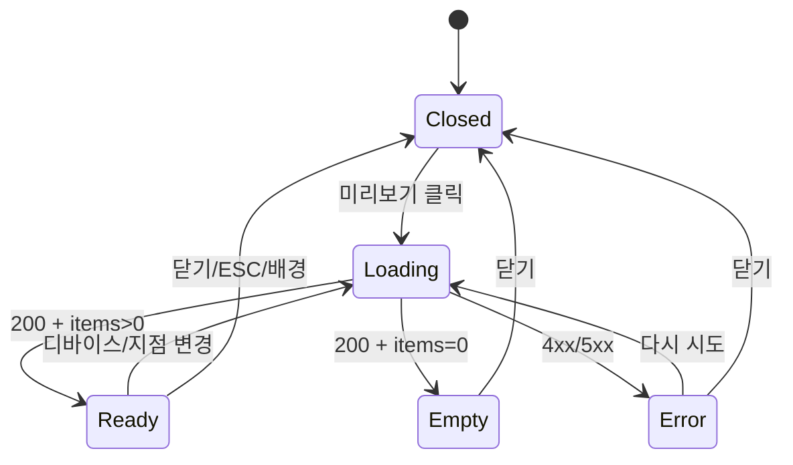

# DLG-P009 카탈로그 미리보기 — 기본화면 (마스터)

> 이 문서는 **다이얼로그 마스터 스펙**입니다. `01~04` 상태 문서는 이 문서를 상속(override/delta)합니다.
> 🎨 **모바일 시뮬레이션 모달**: 회원 앱/키오스크에 노출될 공개 카탈로그를 375×667 뷰포트로 미리본다.
> 부모 화면은 `SCR-P005 상품 카탈로그(/catalog)`.

---

## 0. 메타 & 원천 참조

| 항목 | 값 |
|------|----|
| 다이얼로그 ID | DLG-P009 |
| 다이얼로그명 | 카탈로그 미리보기 |
| 도메인 | D05-상품관리 |
| 부모 화면 | SCR-P005 상품 카탈로그 (`/catalog`) |
| 트리거 | PageHeader "미리보기" 버튼 클릭 |
| 확인 레벨 | L0 (조회 전용) |
| 서버 호출 | ✅ `GET /catalog/preview` (공개 상품만) |
| 닫기 옵션 | X · 닫기 버튼 · ESC · 배경 클릭 |
| 역할 | superAdmin, primary, owner, manager, fc, trainer, staff, front (readonly 포함 전역 조회 가능) |
| 파일 경로 | `src/components/dialogs/CatalogPreviewDialog.tsx` |
| 우선순위 | P1 (마케팅 콘텐츠 검수) |

### 원천 문서 링크
| 문서 | 경로 | 섹션 |
|---|---|---|
| 상품관리 화면설계서 | `docs/화면설계서/상품관리.md` | §SCR-P005, §DLG-P009 카탈로그 미리보기 |
| 상품관리 기능명세서 | `docs/기능명세서/상품관리.md` | 상품 카탈로그 부록 |
| 에러코드정의서 | `docs/에러코드정의서.md` | §4.4 상품 (E4xx3xx), §4.1 공통 (E5xx001 서버) |
| 상태전이도 | `docs/상태전이도.md` | §카탈로그 공개 |
| 다이어그램 M1 생명주기 | `docs/다이어그램/D05_상품관리/DLG/DLG-P009_카탈로그미리보기/M1_모달생명주기.md` | — |
| 다이어그램 M2 필드검증 | `docs/다이어그램/D05_상품관리/DLG/DLG-P009_카탈로그미리보기/M2_필드검증.md` | — |
| 다이어그램 M3 결과분기 | `docs/다이어그램/D05_상품관리/DLG/DLG-P009_카탈로그미리보기/M3_결과분기.md` | — |
| 권한 매트릭스 | `docs/다이어그램/10_권한매트릭스/R1_역할화면_매트릭스.md` | SCR-P005 |
| 부모 마스터 | `docs/화면설계서/D05-상품관리/SCR-P005-상품카탈로그/00-기본화면.md` | §8 버튼 매핑 |

---

## 1. 다이얼로그 목적 (Why)

- 카탈로그 공개 전 **실제 회원 앱 화면을 시뮬레이션**하여 노출 순서/이미지/설명을 검수한다.
- 공개/비공개 토글과 카탈로그 편집의 결과를 즉시 확인하여 QA 주기를 줄인다.
- 본사 관리자(primary/superAdmin)는 지점별 카탈로그 품질을 원격으로 점검할 수 있다.

---

## 2. 화면 레이아웃 (Wireframe)

```
  배경: fixed inset-0 bg-black/50 backdrop-blur-sm z-50
  ┌──────────────────────────────────────────────────────────────┐
  │ ┌────────────────────────────────────────────────────────┐   │
  │ │ 🖼  카탈로그 미리보기               [지점▾][다시로드][×] │  ← Header 56px
  │ ├────────────────────────────────────────────────────────┤   │
  │ │                    ┌─────────────────────┐              │
  │ │                    │ ▁ 393x667 iframe ▁  │              │ ← Phone frame
  │ │                    │ ┌─────────────────┐ │              │
  │ │  ┌──────────────┐  │ │ 🏋 FitGenie 피트│ │              │
  │ │  │ 디바이스     │  │ │────────────────│ │              │
  │ │  │ [📱 모바일]  │  │ │ [이용권]...[PT]│ │              │
  │ │  │ [🖥 데스크톱] │  │ │────────────────│ │              │
  │ │  │ [🖨 키오스크]│  │ │ ┌───┐ ┌───┐   │ │              │
  │ │  └──────────────┘  │ │ │상품│ │상품│  │ │              │
  │ │                    │ │ └───┘ └───┘   │ │              │
  │ │                    │ │      스크롤    │ │              │
  │ │                    │ └─────────────────┘ │              │
  │ │                    └─────────────────────┘              │
  │ ├────────────────────────────────────────────────────────┤   │
  │ │ 💡 회원 앱에 노출되는 화면과 동일합니다.   [닫기]       │  ← Footer 56px
  │ └────────────────────────────────────────────────────────┘   │
  └──────────────────────────────────────────────────────────────┘
```

### 영역 치수표

| 영역 | 위치 | 치수 | 역할 |
|---|---|---|---|
| Backdrop | 전역 | `fixed inset-0` | 배경 차단 |
| Modal | 화면 중앙 | `max-w-4xl w-[min(92vw,960px)] max-h-[90vh]` | 다이얼로그 카드 |
| Header | 상단 | 56px h | 타이틀 + 지점 전환 + 닫기 |
| Device Toolbar | 좌측 | 120px w | 디바이스 프리셋 버튼 |
| Phone Frame | 중앙 | 393×667 / 1280×720 / 1024×768 | iframe 뷰포트 |
| Footer | 하단 | 56px h | 안내 문구 + 닫기 CTA |

---

## 3. 디자인 토큰

### 3.1 색상
| 토큰 | 클래스 | 용도 |
|---|---|---|
| backdrop | `fixed inset-0 bg-black/50 backdrop-blur-sm z-50` | 배경 |
| modal.card | `bg-white rounded-2xl shadow-2xl ring-1 ring-gray-100` | 카드 |
| header.fg | `text-gray-900` | 타이틀 |
| device.frame | `bg-gray-900 rounded-[36px] p-3` | 폰 베젤 |
| device.screen | `bg-white rounded-[28px]` | 화면 영역 |
| btn.device.active | `bg-blue-50 text-blue-700 ring-1 ring-blue-200` | 활성 디바이스 |
| btn.device.idle | `text-gray-600 hover:bg-gray-50` | 비활성 디바이스 |
| empty.bg | `bg-gray-50 text-gray-500` | 공개 상품 없음 |
| error.bg | `bg-red-50 text-red-700` | 로드 실패 |
| btn.primary | `bg-blue-600 hover:bg-blue-700 text-white` | "닫기" |

### 3.2 타이포
| 토큰 | 값 |
|---|---|
| title | `text-lg font-semibold tracking-tight` |
| body | `text-sm leading-relaxed` |
| footer.hint | `text-xs text-gray-500` |
| button | `text-sm font-medium` |

### 3.3 간격/반경
| 토큰 | 값 |
|---|---|
| modal.radius | `rounded-2xl` (16px) |
| modal.padding | `p-0` (헤더/바디/푸터 3단) |
| body.padding | `p-6` |
| device.radius | `rounded-[36px]` |

### 3.4 모션
| 토큰 | 값 |
|---|---|
| backdrop.enter | `animate-[fadeIn_120ms_ease-out]` |
| modal.enter | `animate-[fadeInUp_180ms_ease-out]` |
| iframe.swap | 디바이스 변경 시 160ms crossfade |
| motion.reduced | `motion-reduce:animate-none` |

---

## 4. 반응형 규칙

| BP | 폭 | 모달 | 디바이스 바 | 비고 |
|---|---|---|---|---|
| Mobile <640 | 100% | `w-[calc(100%-24px)] max-h-[92vh]` | 상단 가로 스크롤 | 폰 프레임 스케일 0.9 |
| Tablet 640~1024 | center | `max-w-2xl` | 세로 | 기본 |
| Desktop ≥1024 | center | `max-w-4xl` | 세로 | 권장 |

---

## 5. 🔐 역할별(RBAC) 매트릭스

| 요소 | superAdmin | primary | owner | manager | fc | trainer | staff | front | readonly |
|---|:---:|:---:|:---:|:---:|:---:|:---:|:---:|:---:|:---:|
| 미리보기 버튼 노출 | ● | ● | ● | ● | ● | ● | ● | ● | ● |
| 모달 오픈 | ● | ● | ● | ● | ● | ● | ● | ● | ● |
| 지점 선택 드롭다운 | ● | ● | — | — | — | — | — | — | — |
| 디바이스 전환(모/데/키) | ● | ● | ● | ● | ● | ● | ● | ● | ● |
| "다시 로드" | ● | ● | ● | ● | ● | ● | ● | ● | ● |
| "카탈로그 설정으로" 이동 | ● | ● | ● | ● | — | — | — | — | — |
| ESC/배경 닫기 | ● | ● | ● | ● | ● | ● | ● | ● | ● |

### 5.1 멀티테넌트
- superAdmin/primary: 상단에 **지점 선택** 드롭다운 노출. `branchId` 선택 → preview API에 `X-Branch-Id` 헤더 동봉.
- owner 이하: `useBranchStore().currentBranchId` 자동 주입 (본인 지점 고정).
- 지점 컨텍스트가 없으면 (super가 아직 미선택) "지점을 먼저 선택하세요" 상태 표시.

---

## 6. 컴포넌트 트리

```tsx
<Dialog.Root open={open} onOpenChange={onClose}>
  <Dialog.Overlay className="fixed inset-0 z-50 bg-black/50 backdrop-blur-sm" />
  <Dialog.Content
    role="dialog"
    aria-labelledby="cat-preview-title"
    aria-describedby="cat-preview-desc"
    className="fixed left-1/2 top-1/2 -translate-x-1/2 -translate-y-1/2
               w-[min(92vw,960px)] max-h-[90vh]
               bg-white rounded-2xl shadow-2xl ring-1 ring-gray-100
               flex flex-col overflow-hidden">
    <CatalogPreviewHeader
      branchId={branchId}
      onBranchChange={setBranchId}
      onReload={reload}
      onClose={onClose}
    />
    <div className="flex flex-1 min-h-0">
      <DevicePresetSidebar value={device} onChange={setDevice} />
      <div className="flex-1 flex items-center justify-center bg-gray-50 p-6">
        {status === 'loading' && <PreviewSkeleton />}
        {status === 'empty'   && <EmptyCatalogState />}
        {status === 'error'   && <PreviewErrorState onRetry={reload} />}
        {status === 'ready'   && <DeviceFrame device={device}>
          <iframe src={previewUrl} title="카탈로그 미리보기" />
        </DeviceFrame>}
      </div>
    </div>
    <CatalogPreviewFooter onClose={onClose} />
  </Dialog.Content>
</Dialog.Root>
```

### 컴포넌트 명세
| 컴포넌트 | Props | 재사용 |
|---|---|---|
| `CatalogPreviewDialog` | `{ isOpen, onClose, initialBranchId? }` | D05 전용 |
| `DevicePresetSidebar` | `{ value: 'mobile'|'desktop'|'kiosk', onChange }` | 공용 |
| `DeviceFrame` | `{ device }` children | 공용 |
| `EmptyCatalogState` | — | 공용 EmptyState |
| `PreviewSkeleton` | — | 공용 Skeleton |

---

## 7. 데이터 계약

### 7.1 Props/State
```ts
interface CatalogPreviewDialogProps {
  isOpen: boolean;
  onClose: () => void;
  initialBranchId?: string;    // super/primary에서 지정 시
}

type PreviewDevice = 'mobile' | 'desktop' | 'kiosk';
type PreviewStatus = 'loading' | 'ready' | 'empty' | 'error';

interface CatalogPreviewResponse {
  branchId: string;
  settings: CatalogSettings;
  items: CatalogItem[];   // catalogVisible === true, catalogOrder ASC
  totalCount: number;
  generatedAt: string;
}
```

### 7.2 API
| 메소드 | 엔드포인트 | 권한 | 설명 |
|---|---|---|---|
| GET | `/catalog/preview?branchId={id}` | all | 공개 상품 목록 + 설정 |
| GET | `/catalog/preview/html?branchId={id}&device={d}` | all | iframe 렌더용 SSR HTML |

### 7.3 쿼리 (react-query)
```ts
useQuery({
  queryKey: ['catalog-preview', branchId, device],
  queryFn: () => api.get(`/catalog/preview`, { params: { branchId, device }}),
  staleTime: 30_000,
  enabled: Boolean(branchId) && isOpen,
});
```

---

## 8. 비즈니스 룰

1. **공개 상품만 노출**: `catalogVisible === true` && `status === 'ACTIVE'` 만 렌더.
2. **정렬**: `catalogOrder ASC`, 동일값은 `createdAt DESC`.
3. **지점 컨텍스트**: owner 이하는 본인 지점 강제. super/primary는 드롭다운 선택 필수.
4. **총 0개 처리**: items.length === 0 → `03-공개상품없음` 상태.
5. **에러 처리**: 네트워크/서버 500 → `04-에러` + 재시도 버튼.
6. **리로드**: "다시 로드" 클릭 시 쿼리 무효화(`queryClient.invalidateQueries`).
7. **iframe sandbox**: `sandbox="allow-same-origin allow-scripts"` 만 허용 (폼 제출/팝업 차단).
8. **캐시 갱신 시점**: 카탈로그 편집 모달(DLG-P011) 저장 성공 후 자동 invalidate.
9. **감사로그**: `AUDIT.CATALOG_PREVIEW_OPEN` 비동기 전송 (branchId, actorId, device).

---

## 9. 상태 목록

| 파일 | 상태 코드 | 한글 | 트리거 |
|---|---|---|---|
| `01-로딩.md` | `preview-loading` | 로딩 | 모달 오픈 직후 / 디바이스/지점 변경 |
| `02-시뮬표시.md` | `preview-ready` | 시뮬 표시 | API 200 + items.length > 0 |
| `03-공개상품없음.md` | `preview-empty` | 공개 상품 없음 | API 200 + items.length === 0 |
| `04-에러.md` | `preview-error` | 에러 | 네트워크/500/403 |

상태 전이: `01-로딩` → (200+data) → `02-시뮬표시` / (200+빈) → `03-공개상품없음` / (err) → `04-에러` → (재시도) → `01-로딩`

---

## 10. 에러 코드 매핑

| errorCode | HTTP | 시나리오 | 표시 |
|---|---|---|---|
| E404301 | 404 | 상품 없음 (카탈로그 세팅은 있으나 상품 id 조회 실패) | 공개 상품 없음 상태 + 토스트 제거 |
| E403001 | 403 | 지점 접근 권한 없음 (super가 잘못된 branchId 지정) | 에러 상태 + "해당 지점에 접근할 수 없습니다." |
| E5xx001 | 500 | 서버 오류 | 에러 상태 + "다시 시도" |
| E-NET | — | 오프라인/타임아웃 | 에러 상태 + 재시도 |

---

## 11. 접근성 (WCAG 2.1 AA)

| 항목 | 요구사항 |
|---|---|
| role/aria | `role="dialog"` + `aria-modal="true"` + `aria-labelledby="cat-preview-title"` |
| 포커스 트랩 | 열림 시 닫기 버튼 오토포커스, Tab 순환 제한 |
| 키보드 | `Esc`=닫기, `Alt+R`=다시로드, `1/2/3`=디바이스 전환 |
| 대비 | 디바이스 토글 4.5:1 이상 |
| iframe 접근성 | `<iframe title="카탈로그 미리보기 ...">` 필수 |
| 스크린리더 | 디바이스 전환 시 `aria-live="polite"` 공지 "모바일 뷰로 전환됨" |
| reduced-motion | 애니메이션 생략, 즉시 표시 |

---

## 12. 진입 / 이탈 연결

### 진입
- SCR-P005 PageHeader "미리보기" 버튼
- 키보드 단축키 `P` (SCR-P005에서, manager+)
- URL hash `#preview` (딥링크)

### 이탈
| 액션 | 목적지 |
|---|---|
| 닫기/ESC/배경 | SCR-P005 (상태 유지) |
| "카탈로그 설정으로" | DLG-P010 오픈 (super/primary/owner/manager) |
| 지점 드롭다운 변경 | 현재 모달 유지, API 재호출 |

---

## 13. 다이어그램 통합 뷰



참조: `docs/다이어그램/D05_상품관리/DLG/DLG-P009_카탈로그미리보기/M1_모달생명주기.md`, `M3_결과분기.md`

---

## 14. 🧩 바이브코딩 프롬프트 (마스터)

```
Next.js 15 App Router + TypeScript + Tailwind + Radix Dialog + TanStack Query + Supabase 기반
'use client' 다이얼로그 컴포넌트 작성.

━━ 다이얼로그: DLG-P009 카탈로그 미리보기 ━━
파일:
  src/components/dialogs/CatalogPreviewDialog.tsx
  src/components/dialogs/catalog/DevicePresetSidebar.tsx
  src/components/dialogs/catalog/DeviceFrame.tsx
  src/api/endpoints/catalog.ts
  src/stores/branchStore.ts (기존)

━━ Types ━━
import { z } from 'zod';

export const CatalogPreviewSchema = z.object({
  branchId: z.string(),
  settings: z.object({
    title: z.string(),
    description: z.string().nullable(),
    themeColor: z.string().nullable(),
    showPrice: z.boolean(),
  }),
  items: z.array(z.object({
    productId: z.string(),
    productName: z.string(),
    catalogTitle: z.string(),
    catalogDescription: z.string().nullable(),
    imageUrl: z.string().nullable(),
    cashPrice: z.number(),
    catalogOrder: z.number(),
    catalogVisible: z.literal(true),
  })),
  totalCount: z.number(),
  generatedAt: z.string(),
});
export type CatalogPreview = z.infer<typeof CatalogPreviewSchema>;
export type PreviewDevice = 'mobile' | 'desktop' | 'kiosk';

━━ API ━━
// src/api/endpoints/catalog.ts
export const getCatalogPreview = async (branchId: string, device: PreviewDevice) => {
  const res = await api.get('/catalog/preview', { params: { branchId, device }});
  return CatalogPreviewSchema.parse(res.data);
};

━━ Hook ━━
export function useCatalogPreview(branchId: string | null, device: PreviewDevice, enabled: boolean) {
  return useQuery({
    queryKey: ['catalog-preview', branchId, device],
    queryFn: () => getCatalogPreview(branchId!, device),
    enabled: enabled && Boolean(branchId),
    staleTime: 30_000,
    retry: 1,
  });
}

━━ Dialog ━━
'use client';
import * as Dialog from '@radix-ui/react-dialog';
import { X, RotateCw, Smartphone, Monitor, Tv } from 'lucide-react';
import { useState, useEffect, useMemo } from 'react';
import { useCatalogPreview } from '@/api/hooks/useCatalog';
import { useAuthStore } from '@/stores/authStore';
import { useBranchStore } from '@/stores/branchStore';

export default function CatalogPreviewDialog({ isOpen, onClose, initialBranchId }: Props) {
  const role = useAuthStore(s => s.user?.role);
  const defaultBranch = useBranchStore(s => s.currentBranchId);
  const [branchId, setBranchId] = useState<string | null>(initialBranchId ?? defaultBranch);
  const [device, setDevice] = useState<PreviewDevice>('mobile');

  const isSuper = role === 'superAdmin' || role === 'primary';
  const { data, status, refetch } = useCatalogPreview(branchId, device, isOpen);

  const viewState: PreviewStatus =
    status === 'pending' ? 'loading'
    : status === 'error' ? 'error'
    : (data?.items.length ?? 0) === 0 ? 'empty'
    : 'ready';

  return (
    <Dialog.Root open={isOpen} onOpenChange={(o) => !o && onClose()}>
      <Dialog.Portal>
        <Dialog.Overlay className="fixed inset-0 z-50 bg-black/50 backdrop-blur-sm
                                   motion-reduce:animate-none animate-[fadeIn_120ms]" />
        <Dialog.Content
          className="fixed left-1/2 top-1/2 z-50 -translate-x-1/2 -translate-y-1/2
                     w-[min(92vw,960px)] max-h-[90vh]
                     bg-white rounded-2xl shadow-2xl ring-1 ring-gray-100
                     flex flex-col overflow-hidden
                     motion-reduce:animate-none animate-[fadeInUp_180ms]">
          {/* Header */}
          <header className="h-14 px-5 flex items-center justify-between border-b border-gray-100">
            <Dialog.Title id="cat-preview-title" className="text-lg font-semibold text-gray-900">
              카탈로그 미리보기
            </Dialog.Title>
            <div className="flex items-center gap-2">
              {isSuper && (
                <BranchSelect value={branchId} onChange={setBranchId} />
              )}
              <button onClick={() => refetch()} aria-label="다시 로드"
                className="h-9 w-9 grid place-items-center rounded-lg hover:bg-gray-100">
                <RotateCw className="size-4 text-gray-600" />
              </button>
              <Dialog.Close asChild>
                <button aria-label="닫기"
                  className="h-9 w-9 grid place-items-center rounded-lg hover:bg-gray-100">
                  <X className="size-4 text-gray-600" />
                </button>
              </Dialog.Close>
            </div>
          </header>
          {/* Body */}
          <div className="flex flex-1 min-h-0">
            <nav className="w-28 border-r border-gray-100 p-3 space-y-1" aria-label="디바이스">
              {[
                { v: 'mobile',  label: '모바일',   icon: Smartphone },
                { v: 'desktop', label: '데스크톱', icon: Monitor },
                { v: 'kiosk',   label: '키오스크', icon: Tv },
              ].map(({ v, label, icon: Icon }) => (
                <button key={v} onClick={() => setDevice(v as PreviewDevice)}
                  aria-pressed={device === v}
                  className={`w-full flex items-center gap-2 px-3 py-2 rounded-lg text-sm
                              ${device === v
                                ? 'bg-blue-50 text-blue-700 ring-1 ring-blue-200'
                                : 'text-gray-600 hover:bg-gray-50'}`}>
                  <Icon className="size-4" /> {label}
                </button>
              ))}
            </nav>
            <div className="flex-1 flex items-center justify-center bg-gray-50 p-6 overflow-auto"
                 aria-live="polite" id="cat-preview-desc">
              {viewState === 'loading' && <PreviewSkeleton device={device} />}
              {viewState === 'empty'   && <EmptyCatalogState />}
              {viewState === 'error'   && <PreviewErrorState onRetry={() => refetch()} />}
              {viewState === 'ready'   && (
                <DeviceFrame device={device}>
                  <iframe
                    title="카탈로그 미리보기"
                    sandbox="allow-same-origin allow-scripts"
                    src={`/api/catalog/preview/html?branchId=${branchId}&device=${device}`}
                    className="w-full h-full border-0"
                  />
                </DeviceFrame>
              )}
            </div>
          </div>
          {/* Footer */}
          <footer className="h-14 px-5 flex items-center justify-between border-t border-gray-100">
            <p className="text-xs text-gray-500">💡 회원 앱/키오스크 노출 화면과 동일합니다.</p>
            <Dialog.Close asChild>
              <button autoFocus
                className="h-10 px-5 rounded-lg bg-blue-600 hover:bg-blue-700
                           text-white text-sm font-medium
                           focus:outline-none focus:ring-2 focus:ring-offset-2 focus:ring-blue-500">
                닫기
              </button>
            </Dialog.Close>
          </footer>
        </Dialog.Content>
      </Dialog.Portal>
    </Dialog.Root>
  );
}

━━ DeviceFrame ━━
const sizes: Record<PreviewDevice, { w: number; h: number; radius: string }> = {
  mobile:  { w: 393,  h: 667, radius: 'rounded-[36px]' },
  desktop: { w: 800,  h: 500, radius: 'rounded-xl' },
  kiosk:   { w: 600,  h: 780, radius: 'rounded-2xl' },
};
export function DeviceFrame({ device, children }: { device: PreviewDevice; children: ReactNode }) {
  const { w, h, radius } = sizes[device];
  return (
    <div className={`bg-gray-900 p-3 ${radius} shadow-xl`}
         style={{ width: w + 24, height: h + 24 }}>
      <div className={`overflow-hidden bg-white ${radius === 'rounded-[36px]' ? 'rounded-[28px]' : radius}`}
           style={{ width: w, height: h }}>
        {children}
      </div>
    </div>
  );
}

━━ 디자인 토큰 (정확히) ━━
backdrop: fixed inset-0 z-50 bg-black/50 backdrop-blur-sm
card:     bg-white rounded-2xl shadow-2xl ring-1 ring-gray-100 w-[min(92vw,960px)] max-h-[90vh]
header:   h-14 px-5 border-b border-gray-100
sidebar:  w-28 border-r border-gray-100 p-3
body:     flex-1 bg-gray-50 p-6 overflow-auto
footer:   h-14 px-5 border-t border-gray-100
button.primary: h-10 px-5 rounded-lg bg-blue-600 hover:bg-blue-700 text-white text-sm font-medium
icon-button: h-9 w-9 rounded-lg hover:bg-gray-100

━━ 키보드 ━━
- Esc: 닫기
- Alt+R: 다시 로드
- 1/2/3: 모바일/데스크톱/키오스크 전환

━━ QA ━━
- super/primary만 지점 드롭다운이 보임
- items.length === 0일 때 EmptyState 렌더
- 네트워크 실패 시 "다시 시도" 동작
- iframe sandbox 지정, form submit/popups 차단
- DLG-P011 저장 후 자동 invalidate
- prefers-reduced-motion 준수
```

---

## 15. QA 체크리스트 (수용 기준)

- [ ] 모달 오픈 시 `GET /catalog/preview?branchId=...&device=mobile` 호출
- [ ] super/primary만 상단 지점 드롭다운 노출
- [ ] owner 이하는 currentBranchId 자동 주입
- [ ] 디바이스 전환 3종 동작 (모바일/데스크톱/키오스크)
- [ ] items.length === 0 → 공개 상품 없음 상태 표시
- [ ] 4xx/5xx → 에러 상태 + 다시 시도 버튼
- [ ] iframe `sandbox="allow-same-origin allow-scripts"` 유지
- [ ] DLG-P011 저장 성공 후 자동 re-fetch
- [ ] ESC/배경/X/닫기 버튼 모두 닫힘
- [ ] role="dialog" + aria-labelledby + aria-describedby 적용
- [ ] 키보드 단축키 1/2/3 동작
- [ ] 모바일 360px에서 폰 프레임이 overflow 되지 않음
- [ ] 감사로그 `CATALOG_PREVIEW_OPEN` 전송
