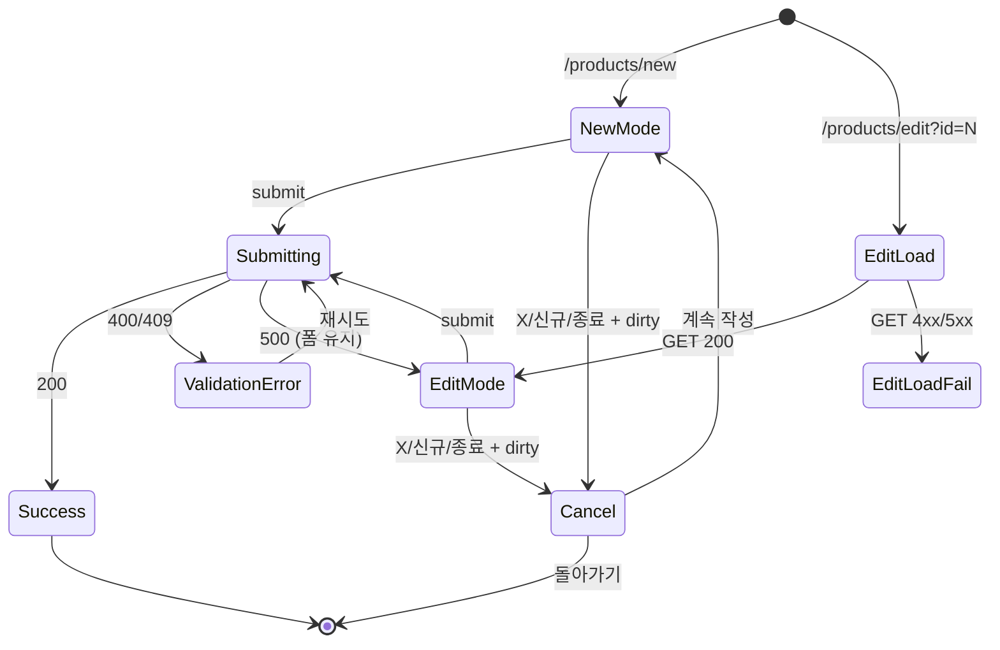

# SCR-P002 상품 등록/수정 (레거시 폼) — 기본화면 (마스터)

> 이 문서는 **화면 마스터 스펙**입니다. `01~05` 상태 문서는 이 문서를 상속(override/delta)합니다.
> 상태별 파일은 "변경점(델타)만" 기술하며, 이 문서에 정의된 레이아웃/토큰/컴포넌트/데이터/권한/접근성은 **기본값**으로 적용됩니다.

---

## 0. 메타 & 원천 참조

| 항목 | 값 |
|------|----|
| 화면 ID | SCR-P002 |
| 화면명 | 상품 등록/수정 (레거시 풀페이지 폼) |
| 도메인 | D05-상품관리 |
| 경로 | `/products/new` (신규), `/products/edit?id=N` (수정) |
| Next.js Route Group | `(app)` |
| 파일 경로 | `src/app/(app)/products/new/page.tsx`, `src/app/(app)/products/edit/page.tsx` |
| 페이지 컴포넌트 | `ProductNewPage`, `ProductEditPage` (edit는 new를 재사용) |
| 역할 | **owner 이상만 편집** (trainer/staff/front 접근 불가 → 상품 목록 리다이렉트) |
| 우선순위 | P1 (SCR-P003 패널이 신규 주 채널, P002는 호환용) |
| 멀티테넌트 스코프 | 현재 `branchId`(owner/manager) / 전 지점(super/primary) |
| 플랫폼 | 데스크톱 우선, 태블릿 대응 |

### 원천 문서 링크
| 문서 | 경로 | 참조 섹션 |
|---|---|---|
| 화면설계서 | `docs/화면설계서/상품관리.md` | §SCR-P002 (L225~400) |
| 기능명세서 | `docs/기능명세서/상품관리.md` | §2 상품 상세/등록/수정 패널 · 부록 B (렌더링), 부록 C-1 (products API) |
| 에러코드정의서 | `docs/에러코드정의서.md` | §공통 E400001/E400002/E403001, §상품 (상품은 공통 규칙 적용), E404301 |
| 상태전이도 | `docs/상태전이도.md` | §상품 활성/비활성 (`isActive`) |
| 다이어그램 F1 진입 | `docs/다이어그램/D05_상품관리/SCR-P002_상품등록수정_레거시/F1_진입.md` | new/edit 진입, editId 로드 |
| 다이어그램 F2 메인 | `.../F2_메인인터랙션.md` | 폼 입력, 요일/시간 체크, 패키지 |
| 다이어그램 F3 버튼액션 | `.../F3_버튼액션.md` | BTN_SAVE, BTN_NEW, BTN_CLOSE, BTN_IMPORT |
| 다이어그램 F5 모달트리거 | `.../F5_모달트리거.md` | DLG-P002 취소 확인 |
| 다이어그램 F6 상태별 | `.../F6_상태별화면.md` | new-mode/edit-mode/edit-load-fail/saving/validation-error |
| 다이어그램 F7 권한 | `.../F7_권한RBAC.md` | owner/manager만 편집, trainer/staff/front 리다이렉트 |
| 다이어그램 F8 에러 | `.../F8_에러예외복구.md` | 로드 실패, 저장 실패, 중복 상품명 |
| 다이어그램 F9 토스트 | `.../F9_토스트피드백.md` | success/error 메시지 |
| 권한 매트릭스 R1 | `docs/다이어그램/10_권한매트릭스/R1_역할화면_매트릭스.md` | `/products` 편집: owner 이상 |

---

## 1. 화면 목적 (Why)

센터 운영자가 **레슨/이용/락커/판매 상품을 등록하거나 기존 상품을 수정**하기 위한 전통적인 풀페이지 폼 화면.
- 레슨북(클래식) 호환을 위해 유지되는 레거시 UI. 신규 주 채널은 SCR-P003 마스터-디테일 패널.
- 상품 구분별 조건부 필드(레슨시간/횟수제한/시설이용/요일·시간)를 단일 폼에서 제어.
- react-hook-form + zod 유효성 검증. 실패 시 인라인 에러 + 하단 에러 배너.
- 수정 모드(`?id=N`)는 진입 즉시 상품 데이터를 prefill, 로드 실패 시 전용 에러 상태로 분기.

---

## 2. 화면 레이아웃 (Wireframe)

### 2.1 풀뷰 와이어프레임 (데스크톱 1440px 기준)

```
┌────────────────────────────────────────────────────────────────────────┐
│ AppLayout Sidebar: 상품 관리 > 상품 등록/수정 (하이라이트)              │
│ ┌── Main Content ─────────────────────────────────────────────────────┐│
│ │ ┌── Accent bar (3px, brand-600) ──────────────────────────────────┐││
│ │ │ [📦] 상품등록 / 상품수정                                   [✕]    │││
│ │ └─────────────────────────────────────────────────────────────────┘││
│ │ ┌── Card (ring-gray-200 rounded-xl) ──────────────────────────────┐││
│ │ │ 상품구분: (●레슨)(○이용)(○락커)(○판매)   사용인원: [1명 ▼]        │││
│ │ │ 상품명:  [_____________________________________]                 │││
│ │ │ 금액:    [_____원]  레슨시간:[선택▼]  레슨유효기간:[선택▼]          │││
│ │ │ 수업구분:(●개인)(○정규클래스) │ 이용구분:(●기간)(○횟수)(○포인트)   │││
│ │ │ 횟수/포인트: [____]                                               │││
│ │ ├─ 세부설정 ─────────────────────────────────────────────────────┤││
│ │ │ [✓] 횟수 제한   [제한없음 ▼]  [1회 ▼]                            │││
│ │ ├─ 요일/시간설정 (left col) ─┬─ 옵션 (right col) ──────────────────┤││
│ │ │ [✓]월 [09:00]~[18:00]     │ [✓] 강사변경가능                     │││
│ │ │ [✓]화 [09:00]~[18:00]     │ [✓] 레슨예약시 시설선택 필수          │││
│ │ │ [✓]수 [09:00]~[18:00]     │ [✓] 양도가능                         │││
│ │ │ [✓]목 [09:00]~[18:00]     │ [✓] 매출기대가능                     │││
│ │ │ [✓]금 [09:00]~[18:00]     │ [✓] 재추가점 이용가능                 │││
│ │ │ [○]토                      │ [✓] 이용시간 자동연장                 │││
│ │ │ [○]일                      │ [✓] 키오스크 예약판매 가능            │││
│ │ ├────────────────────────────┴─────────────────────────────────────┤││
│ │ │ [✓] 시설이용가능     시설이용시간 [기본 ▼]                        │││
│ │ │ [✓] 시설예약가능     시설예약가능일 [당일 ▼]                      │││
│ │ │ [✓] 회원직접휴회가능 휴회횟수 [선택 ▼]                            │││
│ │ │    예약시간간격 [10분 ▼]   휴회기간 [선택 ▼]                      │││
│ │ ├──────────────────────────────────────────────────────────────────┤││
│ │ │ 유효기간: [___] 이용횟수: [___]                                   │││
│ │ │ 설명:     [___________________] 태그: [_____________]              │││
│ │ └──────────────────────────────────────────────────────────────────┘││
│ │ ┌── Sticky Footer Bar (sticky bottom, border-t) ─────────────────┐││
│ │ │ [📥 상품정보가져오기]                      [신규] [등록] [종료]   │││
│ │ └──────────────────────────────────────────────────────────────────┘││
│ └──────────────────────────────────────────────────────────────────────┘│
└────────────────────────────────────────────────────────────────────────┘
```

### 2.2 영역별 치수 / 역할

| 영역 | 위치 | 치수 | 역할 |
|------|------|------|------|
| Accent bar | 페이지 최상단 | 100% × 3px | 브랜드 식별 (brand-600) |
| Title bar | 그 아래 | 100% × 56px | 화면 제목 + 닫기 |
| Form card | 타이틀 아래 | max-w-[1200px] × auto | 메인 폼 |
| 기본 블럭 | 카드 상단 | 2컬럼 (4/8 split) | productKind/이름/금액/레슨 옵션 |
| 세부설정 | 중단 | 1컬럼 | 횟수제한 |
| 요일/시간 + 옵션 | 그 아래 | 2컬럼 (6/6) | 파란 테두리 두 박스 |
| 시설 블럭 | 그 아래 | 1컬럼 | 시설/예약/휴회 |
| 부가 정보 | 카드 하단 | 2컬럼 | 유효기간/설명/태그 |
| Sticky footer | 뷰포트 하단 고정 | 100% × 64px | 액션 버튼 |

---

## 3. 디자인 토큰

### 3.1 색상 (Tailwind)
| 역할 | 클래스 | 용도 |
|------|--------|------|
| bg.page | `bg-gray-50` | 페이지 배경 |
| bg.card | `bg-white rounded-xl ring-1 ring-gray-200 shadow-sm` | 폼 카드 |
| accent.bar | `bg-brand-600` (blue-600) | 상단 3px 바 |
| border.box.blue | `border-2 border-blue-200 rounded-lg bg-blue-50/30` | 요일/시간 박스 |
| label | `text-sm font-medium text-gray-700` | 폼 라벨 |
| input.base | `h-10 w-full rounded-lg border border-gray-300 px-3 text-sm focus:ring-2 focus:ring-blue-500 focus:border-blue-500` | 기본 input |
| input.error | `border-red-300 bg-red-50 focus:ring-red-500 focus:border-red-500` | 에러 필드 |
| radio.active | `bg-blue-600 border-blue-600 text-white` | 선택된 라디오 |
| checkbox.active | `bg-blue-600 border-blue-600 text-white` | 체크된 체크박스 |
| button.primary | `h-10 px-4 rounded-lg bg-blue-600 hover:bg-blue-700 text-white text-sm font-medium` | 등록/저장 |
| button.secondary | `h-10 px-4 rounded-lg border border-gray-300 bg-white hover:bg-gray-50 text-sm` | 신규/종료/취소 |
| error.banner | `rounded-lg border border-red-200 bg-red-50 p-3 text-sm text-red-700` | 하단 에러 배너 |
| saving.overlay | `absolute inset-0 bg-white/60 backdrop-blur-[1px] flex items-center justify-center` | 저장 중 오버레이 |

### 3.2 타이포그래피
| 토큰 | 값 |
|---|---|
| page.title | `text-xl font-semibold text-gray-900` |
| section.title | `text-sm font-semibold text-gray-900 uppercase tracking-wide` |
| label | `text-sm font-medium text-gray-700` |
| input | `text-sm text-gray-900 placeholder-gray-400` |
| error.inline | `text-xs text-red-600 mt-1` |
| helper | `text-xs text-gray-500` |

### 3.3 간격 / 반경
- card radius: `rounded-xl`
- input radius: `rounded-lg`
- 섹션 gap: `space-y-6`
- 필드 gap: `space-y-3` (수직) / `gap-3` (수평)
- 카드 padding: `p-6`

---

## 4. 반응형 규칙

| BP | 폭 | 2컬럼 | 요일/옵션 | 비고 |
|---|---|---|---|---|
| Mobile <768 | 1컬럼 | 수직 적층 | 요일→옵션 | Sticky footer 고정 |
| Tablet 768~1024 | 2컬럼(6/6) | 1:1 | 1:1 | sidebar 접힘 |
| Desktop ≥1024 | 2컬럼(4/8) | 1:1 | 1:1 | 기본 레이아웃 |

---

## 5. 🔐 역할별(RBAC) 매트릭스

| 역할 | 접근 | 저장 | 수정 | 취소→목록 | 상품정보가져오기 | 전지점배포 연계 |
|------|:---:|:---:|:---:|:---:|:---:|:---:|
| superAdmin/primary | ● | ● | ● | ● | ● | ● (SCR-P001에서) |
| owner | ● | ● | ● | ● | ● | — |
| manager | ● | ● | ● | ● | ● | — |
| fc | — (리다이렉트 `/products`) | — | — | — | — | — |
| trainer | — (리다이렉트) | — | — | — | — | — |
| staff | — (리다이렉트) | — | — | — | — | — |
| front | — (리다이렉트) | — | — | — | — | — |
| readonly | — (리다이렉트) | — | — | — | — | — |

### 서버 가드
- `middleware.ts` 또는 page-level server action에서 `role ∈ ['superAdmin','primary','owner','manager']` 체크
- 실패 시 `redirect('/products?reason=forbidden')` + toast `접근 권한이 없습니다` (E403001)
- 저장 시 API에서 branchId 재검증 (멀티테넌트 격리)

---

## 6. 컴포넌트 트리

```
<AppLayout role={user.role} branchContext={branch}>
  <main className="min-h-screen bg-gray-50 pb-24">
    <div className="h-[3px] w-full bg-blue-600" aria-hidden />
    <header className="flex items-center justify-between h-14 px-6 border-b bg-white">
      <h1 className="flex items-center gap-2 text-xl font-semibold text-gray-900">
        <Package className="size-5 text-blue-600"/>
        {mode === 'edit' ? '상품 수정' : '상품 등록'}
      </h1>
      <button onClick={handleCloseRequest} aria-label="닫기" className="p-2 rounded hover:bg-gray-50">
        <X className="size-5" />
      </button>
    </header>

    <form onSubmit={handleSubmit(onSubmit)}
          className="max-w-[1200px] mx-auto p-6">
      <div className="bg-white rounded-xl ring-1 ring-gray-200 shadow-sm p-6 space-y-6">
        <ProductKindRow        control={control} />      {/* 레슨/이용/락커/판매 */}
        <BasicInfoRow          register={register} errors={errors} /> {/* 이름/금액/레슨시간 */}
        <ConditionalKindFields kind={kind} control={control} /> {/* 수업구분/이용구분 */}
        <CountLimitSection     control={control} />
        <div className="grid grid-cols-1 md:grid-cols-2 gap-6">
          <WeekdayHoursBox     control={control} />     {/* 파란 박스 */}
          <OptionCheckboxBox   control={control} />     {/* 파란 박스 */}
        </div>
        <FacilityRow           control={control} />
        <ExtraInfoRow          register={register} />   {/* 유효기간/설명/태그 */}
        <ValidationBanner      errors={errors} />
      </div>
    </form>

    <StickyFooter>
      <button type="button" onClick={openImportModal}>📥 상품정보가져오기</button>
      <div className="flex gap-2">
        <button type="button" onClick={handleNewRequest}>신규</button>
        <button type="submit" form="product-form" disabled={saving}>
          {saving ? '저장중...' : (mode === 'edit' ? '수정' : '등록')}
        </button>
        <button type="button" onClick={handleCloseRequest}>종료</button>
      </div>
    </StickyFooter>

    {confirmCancelOpen && <DLG_P002 onKeep={...} onDiscard={...} />}
    {saving && <SavingOverlay />}
  </main>
</AppLayout>
```

### 컴포넌트 명세
| 컴포넌트 | 파일 | 핵심 props |
|---|---|---|
| `ProductKindRow` | `src/components/products/legacy/ProductKindRow.tsx` | `{ control }` (radio x4) |
| `WeekdayHoursBox` | `src/components/products/legacy/WeekdayHoursBox.tsx` | `{ control }` (7 rows) |
| `OptionCheckboxBox` | `src/components/products/legacy/OptionCheckboxBox.tsx` | `{ control }` |
| `StickyFooter` | `src/components/common/StickyFooter.tsx` | children 슬롯 |
| `ValidationBanner` | `src/components/common/ValidationBanner.tsx` | `{ errors }` — 상단 요약 |
| `DLG_P002` | `src/components/products/DLG-P002-CancelConfirm.tsx` | 작업 취소 확인 |
| `SavingOverlay` | `src/components/common/SavingOverlay.tsx` | 저장중 차단 오버레이 |

---

## 7. 데이터 계약

### 7.1 폼 스키마 (Zod)
```ts
// src/schemas/product.ts
export const productLegacySchema = z.object({
  productKind: z.enum(['lesson','membership','locker','product']),
  occupancy: z.number().int().min(1).max(4).default(1),
  name: z.string().min(1, '상품명을 입력해주세요.').max(100),
  priceCash: z.coerce.number().int().min(1, '가격은 1원 이상이어야 합니다.'),
  priceCard: z.coerce.number().int().min(0).optional(),
  lessonDuration: z.number().int().optional(),
  lessonValidity: z.number().int().optional(),
  classMode: z.enum(['personal','group']).optional(),
  useCategory: z.enum(['duration','count','point']).optional(),
  useAmount: z.coerce.number().int().min(0).optional(),
  countLimitEnabled: z.boolean().default(false),
  useLimit: z.enum(['none','1','2','3','5','10']).optional(),
  dayRows: z.array(z.object({
    enabled: z.boolean(),
    from: z.string().optional(),
    to: z.string().optional(),
  })).length(7),
  instructorReview: z.boolean().default(false),
  lessonReservationRequired: z.boolean().default(false),
  transferable: z.boolean().default(false),
  salesExpectable: z.boolean().default(false),
  staffAddition: z.boolean().default(false),
  autoExtendUseTime: z.boolean().default(false),
  kioskUsage: z.boolean().default(false),
  lockerAvailable: z.boolean().default(false),
  facilityUseTime: z.enum(['default','am','pm','all']).optional(),
  reservationAvailable: z.boolean().default(false),
  reservationOpenDate: z.enum(['today','d1','d3','d7','d14','d30']).optional(),
  memberDirectPause: z.boolean().default(false),
  pauseCount: z.enum(['none','1','2','3']).optional(),
  reservationTimeGap: z.enum(['10','20','30','40','50','60']).optional(),
  pausePeriod: z.enum(['none','3','7','15','30','60']).optional(),
  period: z.coerce.number().int().optional(),
  count: z.coerce.number().int().optional(),
  description: z.string().max(2000).optional(),
  tags: z.string().max(500).optional(),
  isActive: z.boolean().default(true),
});
export type ProductLegacyForm = z.infer<typeof productLegacySchema>;
```

### 7.2 API 계약
| 항목 | 값 |
|---|---|
| 목록 로드 (수정시 단건) | `GET /products/:id` → `{ success, data: Product }` |
| 생성 | `POST /products` body: ProductLegacyForm + `{ branchId }` |
| 수정 | `PATCH /products/:id` body: ProductLegacyForm |
| 중복 체크 | `GET /products/check-name?name=&branchId=&excludeId=` |
| 카테고리 매핑 | 클라이언트: `lesson→PT`, `membership→이용권`, `locker/product→기타` |
| productType 매핑 | `이용권→MEMBERSHIP`, `PT/GX→LESSON`, `기타→GENERAL` |
| 실패 응답 | `{ success:false, errorCode:'E400001'\|'E409xxx'\|'E500001', message }` |

### 7.3 상태 관리
- `useForm<ProductLegacyForm>({ resolver: zodResolver(productLegacySchema) })`
- `useQuery(['product', id])` (수정 모드 prefill, `staleTime: 0`)
- `useMutation` (create/update) — 성공 시 `invalidate(['products'])` + `moveToPage('/products')`
- Local: `isSubmitting`, `isDirty`, `confirmCancelOpen`, `loadFailed`

---

## 8. 비즈니스 룰

1. **진입 가드**: role not in `[superAdmin,primary,owner,manager]` → `/products?reason=forbidden`.
2. **수정 모드 prefill**: `?id=N` 진입 시 즉시 `GET /products/:id` → 성공 시 `applyProductToForm(data)`, 실패 시 `03-수정모드-로드실패`.
3. **상품구분별 조건부 표시**:
   - `lesson` → 레슨시간/레슨유효기간/수업구분 노출
   - `membership` → 이용구분 노출, `useCategory==='count'`면 횟수제한 활성
   - `locker`/`product` → 기본 필드만
4. **중복 상품명**: 제출 전 `check-name` 호출. 중복 시 인라인 에러 + 토스트 `'{name}' 상품명이 이미 존재합니다.` (E409).
5. **가격 포맷**: 입력 시 `formatKRW`로 thousand separator 표시, 제출 시 숫자 파싱.
6. **요일/시간**: 각 요일 `enabled=true` 시 `from<to` 검증. 위반 시 인라인 에러.
7. **중복 제출 방지**: `saving=true` 시 footer 버튼 disabled + SavingOverlay 전체 차단.
8. **취소 → DLG-P002**: X / 신규 / 종료 버튼 모두 `isDirty` 체크 → 변경 있으면 DLG-P002, 없으면 즉시 `moveToPage('/products')`.
9. **저장 성공**: toast `상품이 등록/수정되었습니다.` + `invalidate(['products'])` + `moveToPage('/products')`.
10. **저장 실패(409)**: 중복 상품명 분기. 그 외 `등록/수정에 실패했습니다.` 토스트 + 폼 유지.
11. **브라우저 뒤로가기**: `isDirty && !saving` 시 `beforeunload` + DLG-P002 트리거.
12. **멀티테넌트**: `branchId`는 서버 세션에서 강제 주입 (클라 변조 불가).

---

## 9. 상태 목록

| 파일 | 상태 코드 | 한글 | 트리거 |
|---|---|---|---|
| `01-신규모드.md` | `new-mode` | 신규 모드 | `/products/new` 진입, 폼 초기화 |
| `02-수정모드.md` | `edit-mode` | 수정 모드 | `/products/edit?id=N` 진입 + 로드 성공 |
| `03-수정모드-로드실패.md` | `edit-load-fail` | 수정-로드 실패 | `GET /products/:id` 실패 |
| `04-저장중.md` | `saving` | 저장 중 | 등록/수정 버튼 → mutation pending |
| `05-유효성에러.md` | `validation-error` | 유효성 에러 | submit 시 zod 또는 서버 검증 실패 |

상태 전이: `new-mode|edit-mode` → (submit) → `saving` → (성공) `/products` / (실패) `validation-error`.

---

## 10. 에러 코드 매핑

| errorCode | HTTP | 시나리오 | 사용자 메시지 | UI 처리 |
|---|---|---|---|---|
| E400001 | 400 | 필수값 누락 | 필수 입력 항목을 확인해주세요 | 인라인 + ValidationBanner |
| E400002 | 400 | 형식 오류 | 입력 형식이 올바르지 않습니다 | 인라인 |
| E400302 | 400 | 할인금액 > 상품가 | 할인 금액이 상품 금액을 초과합니다 | 인라인 (할인 연동시) |
| E401002 | 401 | 세션 만료 | 세션이 만료되었습니다 | `/login` 리다이렉트 |
| E403001 | 403 | 권한 없음 | 접근 권한이 없습니다 | 목록 리다이렉트 + toast |
| E404301 | 404 | 상품 없음(수정) | 상품을 찾을 수 없습니다 | `03-수정모드-로드실패` |
| E409xxx | 409 | 상품명 중복 | '{name}' 상품명이 이미 존재합니다. | 인라인 + toast |
| E500001 | 500 | 서버 오류 | 일시적인 오류가 발생했습니다 | toast + 재시도 가능 |

---

## 11. 접근성 (WCAG 2.1 AA)

| 항목 | 요구사항 |
|---|---|
| 구조 | `<form aria-labelledby="product-form-title">` + section별 `aria-labelledby` |
| 라벨 | 모든 input에 `<label htmlFor>` 또는 `aria-label` |
| 에러 | 인라인: `role="alert" aria-live="polite"` + `aria-invalid="true"` + `aria-describedby` |
| 포커스 | submit 실패 시 첫 에러 필드로 자동 포커스 |
| 대비 | 본문 4.5:1, placeholder 3:1 |
| 키보드 | Tab 순서: 상품구분 → 이름 → 금액 → 세부 → 요일/시간 → 옵션 → 시설 → 부가 → 하단 버튼 |
| Esc | DLG-P002 열림 시 닫기 |
| 스크린리더 | 저장 중 SavingOverlay: `role="status" aria-live="polite"` "저장 중" |

---

## 12. 진입/이탈 연결

### 진입
- SCR-P001 상품 목록 "상품 등록" 버튼
- POS에서 `moveToPage(997)` (레거시)
- 행 클릭 시 일부 브랜치에서 `/products/edit?id=N` 이동

### 이탈
| 액션 | 목적지 |
|---|---|
| 등록/수정 성공 | `/products` (SCR-P001) + toast |
| 종료/신규/X | DLG-P002 → `/products` 또는 폼 유지 |
| 403 | `/products?reason=forbidden` |
| 404 (수정) | `03-수정모드-로드실패` |

---

## 13. 다이어그램 통합 뷰



---

## 14. 🧩 바이브코딩 프롬프트 (마스터)

```
Next.js 15 App Router + TypeScript + Tailwind + react-hook-form + zod + React Query + Supabase 기반
'use client' 컴포넌트 세트를 작성하라.

━━ 화면: SCR-P002 상품 등록/수정 (레거시 폼) ━━
파일:
- src/app/(app)/products/new/page.tsx       (ProductNewPage)
- src/app/(app)/products/edit/page.tsx      (edit 모드, new를 재사용)
- src/components/products/legacy/ProductLegacyForm.tsx  (공통 폼)
- src/components/products/legacy/ProductKindRow.tsx
- src/components/products/legacy/WeekdayHoursBox.tsx
- src/components/products/legacy/OptionCheckboxBox.tsx
- src/components/products/DLG-P002-CancelConfirm.tsx
- src/schemas/product.ts (productLegacySchema)
- src/api/endpoints/products.ts (getProduct, createProduct, updateProduct, checkProductName)
- src/hooks/useProductLegacyForm.ts

━━ 접근 가드 (서버) ━━
// app/(app)/products/new/page.tsx (server component wrapper)
export default async function Page() {
  const user = await getServerUser();
  if (!user) redirect('/login');
  if (!['superAdmin','primary','owner','manager'].includes(user.role)) {
    redirect('/products?reason=forbidden');
  }
  return <ProductNewClient />;
}

━━ 레이아웃 ━━
<AppLayout role={user.role}>
  <main className="min-h-screen bg-gray-50 pb-24">
    <div className="h-[3px] w-full bg-blue-600" aria-hidden />
    <header className="flex items-center justify-between h-14 px-6 border-b bg-white sticky top-0 z-20">
      <h1 id="product-form-title" className="flex items-center gap-2 text-xl font-semibold text-gray-900">
        <Package className="size-5 text-blue-600"/>
        {mode==='edit' ? '상품 수정' : '상품 등록'}
      </h1>
      <button type="button" aria-label="닫기" onClick={handleCloseRequest}
              className="p-2 rounded hover:bg-gray-50">
        <X className="size-5" />
      </button>
    </header>

    <form id="product-form" aria-labelledby="product-form-title"
          onSubmit={handleSubmit(onSubmit)}
          className="max-w-[1200px] mx-auto p-6 space-y-6">
      <section aria-labelledby="sec-basic"
               className="bg-white rounded-xl ring-1 ring-gray-200 shadow-sm p-6 space-y-6">
        <h2 id="sec-basic" className="sr-only">기본 정보</h2>

        <ProductKindRow control={control} />
        <BasicInfoRow register={register} errors={errors} />
        <ConditionalKindFields kind={kind} control={control} />
        <CountLimitSection control={control} />

        <div className="grid grid-cols-1 md:grid-cols-2 gap-6">
          <div className="rounded-lg border-2 border-blue-200 bg-blue-50/30 p-4">
            <h3 className="text-sm font-semibold text-blue-800 mb-3">요일 / 시간 설정</h3>
            <WeekdayHoursBox control={control} />
          </div>
          <div className="rounded-lg border-2 border-blue-200 bg-blue-50/30 p-4">
            <h3 className="text-sm font-semibold text-blue-800 mb-3">옵션</h3>
            <OptionCheckboxBox control={control} />
          </div>
        </div>

        <FacilityRow control={control} />
        <ExtraInfoRow register={register} />

        {Object.keys(errors).length > 0 && (
          <div role="alert" aria-live="polite"
               className="rounded-lg border border-red-200 bg-red-50 p-3 text-sm text-red-700">
            <p className="font-semibold mb-1">입력 오류를 확인해주세요</p>
            <ul className="list-disc pl-5 space-y-0.5">
              {Object.entries(errors).map(([k,e]) => (
                <li key={k}>{(e as any).message}</li>
              ))}
            </ul>
          </div>
        )}
      </section>
    </form>

    <footer className="fixed bottom-0 inset-x-0 h-16 bg-white border-t z-30
                       flex items-center justify-between px-6">
      <button type="button" onClick={() => setImportOpen(true)}
              className="h-10 px-4 rounded-lg border border-gray-300 bg-white hover:bg-gray-50 text-sm">
        📥 상품정보가져오기
      </button>
      <div className="flex gap-2">
        <button type="button" onClick={handleNewRequest}
                className="h-10 px-4 rounded-lg border border-gray-300 bg-white hover:bg-gray-50 text-sm">
          신규
        </button>
        <button type="submit" form="product-form" disabled={saving}
                className="h-10 px-4 rounded-lg bg-blue-600 hover:bg-blue-700 disabled:bg-blue-400 text-white text-sm font-medium">
          {saving ? '저장중...' : (mode==='edit' ? '수정' : '등록')}
        </button>
        <button type="button" onClick={handleCloseRequest}
                className="h-10 px-4 rounded-lg border border-gray-300 bg-white hover:bg-gray-50 text-sm">
          종료
        </button>
      </div>
    </footer>

    {saving && (
      <div role="status" aria-live="polite"
           className="fixed inset-0 bg-white/60 backdrop-blur-[1px] flex items-center justify-center z-40">
        <Loader2 className="size-6 animate-spin text-blue-600" aria-hidden />
        <span className="ml-2 text-sm text-gray-700">저장 중...</span>
      </div>
    )}

    <DLG_P002 open={confirmCancelOpen}
              onKeep={() => setConfirmCancelOpen(false)}
              onDiscard={() => moveToPage('/products')} />
  </main>
</AppLayout>

━━ 디자인 토큰 (마스터 §3 그대로) ━━
bg.card: bg-white rounded-xl ring-1 ring-gray-200 shadow-sm p-6
input.base: h-10 w-full rounded-lg border border-gray-300 px-3 text-sm
            focus:ring-2 focus:ring-blue-500 focus:border-blue-500 transition-colors duration-150
input.error: border-red-300 bg-red-50 focus:ring-red-500 focus:border-red-500
button.primary: h-10 px-4 rounded-lg bg-blue-600 hover:bg-blue-700 active:bg-blue-800
                disabled:bg-blue-400 text-white text-sm font-medium
                focus:outline-none focus:ring-2 focus:ring-offset-2 focus:ring-blue-500
error.banner: rounded-lg border border-red-200 bg-red-50 p-3 text-sm text-red-700
blue.box: rounded-lg border-2 border-blue-200 bg-blue-50/30 p-4

━━ 데이터 훅 ━━
function useProductLegacyForm(id?: number) {
  const isEdit = !!id;
  const form = useForm<ProductLegacyForm>({
    resolver: zodResolver(productLegacySchema),
    defaultValues: DEFAULT_PRODUCT_FORM,
  });

  const loadQ = useQuery({
    queryKey: ['product', id],
    queryFn: () => getProduct(id!),
    enabled: isEdit,
    staleTime: 0,
  });

  useEffect(() => {
    if (loadQ.data) applyProductToForm(form, loadQ.data);
  }, [loadQ.data]);

  const mutation = useMutation({
    mutationFn: (values: ProductLegacyForm) =>
      isEdit ? updateProduct(id!, values) : createProduct(values),
    onSuccess: () => {
      qc.invalidateQueries({ queryKey: ['products'] });
      toast.success(isEdit ? '상품이 수정되었습니다.' : '상품이 등록되었습니다.');
      moveToPage('/products');
    },
    onError: (e: ApiError) => {
      if (e.errorCode?.startsWith('E409')) {
        form.setError('name', { message: `'${form.getValues('name')}' 상품명이 이미 존재합니다.` });
      } else {
        toast.error('등록/수정에 실패했습니다.');
      }
    },
  });

  return {
    form, isEdit,
    isLoading: loadQ.isLoading, isLoadError: loadQ.isError,
    saving: mutation.isPending,
    onSubmit: form.handleSubmit((v) => mutation.mutate(v)),
  };
}

━━ 인터랙션 ━━
- X / 신규 / 종료 → isDirty && !saving 시 DLG-P002, 아니면 즉시 이동/초기화
- submit: 중복 상품명 409 → 인라인 에러 + 토스트
- 저장 중: 모든 입력 disabled, SavingOverlay 표시
- 수정 모드 로드 실패: 전용 에러 상태 (다시 시도 버튼)
- 브라우저 뒤로가기: isDirty 시 beforeunload 경고

━━ 접근성 ━━
- form aria-labelledby="product-form-title"
- 각 섹션 aria-labelledby/aria-label
- 인라인 에러 role="alert" aria-live="polite"
- submit 실패 시 첫 에러로 포커스 이동
- prefers-reduced-motion 시 transition 제거

━━ 반응형 ━━
- <768: 1컬럼, 요일/옵션 수직 적층
- 768~1024: 2컬럼 (6/6)
- ≥1024: 기본 (4/8)

━━ QA 체크 ━━
- trainer/staff/front 접근 시 즉시 /products 리다이렉트
- 수정 모드 진입 → prefill 성공 시 헤더 "상품 수정"
- 404 로드 실패 → 03 상태
- 상품명 빈값/중복 → 인라인 에러 + 토스트
- 가격 1원 미만 → "가격은 1원 이상이어야 합니다."
- 저장 중 버튼 disabled + SavingOverlay
- X / 신규 / 종료 → dirty 시 DLG-P002
- 키보드만으로 전체 폼 완결 가능
```

---

## 15. QA 체크리스트

- [ ] trainer/staff/front/fc/readonly 접근 시 `/products?reason=forbidden` 리다이렉트
- [ ] 신규 모드: 폼 초기화, 헤더 "상품 등록"
- [ ] 수정 모드: prefill 성공, 헤더 "상품 수정", isActive 배지 반영
- [ ] 수정 모드 로드 실패: `03-수정모드-로드실패` 상태 전환
- [ ] 상품명 빈값 제출 → 인라인 에러 + ValidationBanner
- [ ] 상품명 중복 제출 → 409 → 인라인 에러 + 토스트
- [ ] 가격 1원 미만 → 인라인 에러
- [ ] 저장 중 → 버튼 disabled + SavingOverlay + 폼 readOnly
- [ ] 성공 → toast + `/products` 이동 + invalidate
- [ ] X/신규/종료 + isDirty → DLG-P002, 미변경 시 즉시 이동
- [ ] 브라우저 뒤로가기 isDirty → beforeunload 경고
- [ ] 요일/시간 enabled=true 시 from<to 검증
- [ ] 상품구분별 조건부 필드 표시 (lesson→레슨시간, membership→이용구분)
- [ ] 키보드만으로 제출 가능 (Tab + Enter)
- [ ] 스크린리더로 에러 배너 공지
- [ ] prefers-reduced-motion 준수
- [ ] 모바일 <768 1컬럼 레이아웃 깨지지 않음
