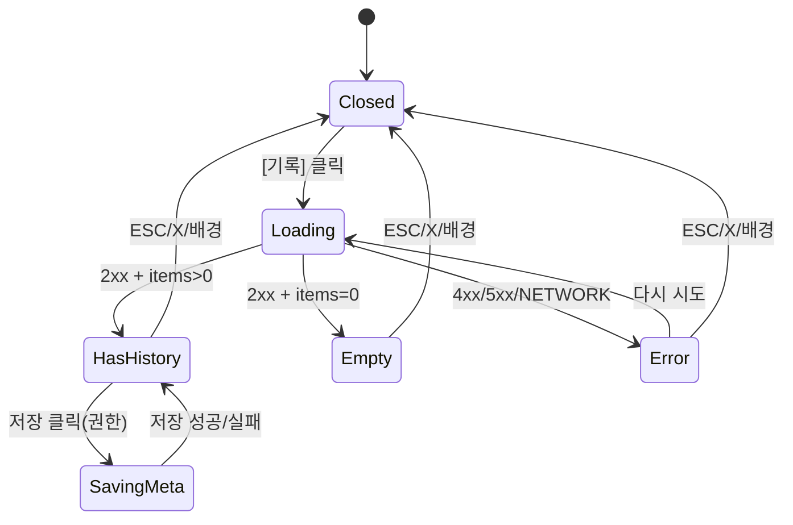

# DLG-050-001 락커 기록 모달 — 기본화면 (마스터)

> 이 문서는 **다이얼로그 마스터 스펙**입니다. `01~04` 상태 문서는 이 문서를 상속(override/delta)합니다.
> 🔎 **조회형(read-only)**: 특정 락커의 이용/배정/회수 이력을 `audit_logs`에서 조회하여 타임라인 형태로 표시. 비밀번호/메모 편집은 본 다이얼로그에서 부가 기능으로 제공(권한 충족 시).

---

## 0. 메타 & 원천 참조

| 항목 | 값 |
|------|----|
| 다이얼로그 ID | DLG-050-001 |
| 다이얼로그명 | 락커 기록 모달 |
| 도메인 | D06-시설관리 |
| 부모 화면 | SCR-050 락커 관리 (`/locker`) |
| 트리거 조건 | 락커 셀 호버 오버레이 > `[기록]` 버튼 클릭 |
| 확인 레벨 | L0 (조회형, 비파괴) — 부가 편집(비밀번호/메모) 저장 시 L1 |
| 서버 호출 여부 | ✅ `supabase.from('audit_logs').select(...).eq('target_type','locker').eq('target_id', lockerId)` / 편집 시 `supabase.from('lockers').update({ password, memo })` |
| 닫기 옵션 | 🟢 ESC/배경/X = 자유 허용 (로딩 중에도 허용, 저장 중에는 차단) |
| 역할 | `superAdmin`, `primary`, `owner`, `manager`, `staff` (● 전권) / `front` (○ 조회) / `trainer`, `fc` (—) |
| 파일 경로 | `src/components/facilities/locker/LockerHistoryModal.tsx` |
| 공용 베이스 | `Radix UI Dialog` (`@radix-ui/react-dialog`) + 내부 스킨 |
| 우선순위 | P0 (운영 필수: 분실/민원 대응) |
| 감사로그 | READ 이벤트 기록 (비밀번호 열람 시 `AUDIT.LOCKER_PW_VIEW` 강제) |

### 원천 문서 링크

| 문서 | 경로 | 섹션 |
|---|---|---|
| 화면설계서 | `docs/화면설계서/시설관리.md` | §SCR-050 §9 DLG-050-001 기록 모달 |
| 기능명세서 | `docs/기능명세서/시설관리.md` | §1.G-1 락커 상세 / §1.G-2 기록 모달 |
| 에러코드정의서 | `docs/에러코드정의서.md` | §4.7 시설/락커 E404600, §공통 E403001, E500001 |
| 상태전이도 | `docs/상태전이도.md` | §7 락커 (AVAILABLE/IN_USE/MAINTENANCE) |
| 다이어그램 M1 | `docs/다이어그램/D06_시설관리/DLG/DLG-050-001_락커기록/M1_생명주기.md` | 모달 생명주기 |
| 다이어그램 M2 | `docs/다이어그램/D06_시설관리/DLG/DLG-050-001_락커기록/M2_필드검증.md` | 필드 검증 |
| 다이어그램 M3 | `docs/다이어그램/D06_시설관리/DLG/DLG-050-001_락커기록/M3_결과분기.md` | 결과 분기 |
| 권한 매트릭스 | `docs/다이어그램/10_권한매트릭스/R1_역할화면_매트릭스.md` | `/locker` 락커 기록 |
| 부모 마스터 | `docs/화면설계서/D06-시설관리/SCR-050-락커관리/00-기본화면.md` | 부모 화면 |
| 공용 삭제 다이얼로그 | `docs/화면설계서/D01-공통/DLG-003-삭제확인/00-기본화면.md` | ConfirmDialog 패턴 참조 |

---

## 1. 다이얼로그 목적 (Why)

센터 관리자가 특정 락커의 **이용 이력(배정/회수/이동/고장/복구/비밀번호 변경 등)**을 시간순으로 확인하여
- 회원 분실/민원 대응 시 **언제 누가 무슨 작업을 했는지** 근거 제시
- 해당 락커의 **현재 비밀번호/메모**(있을 경우) 확인
- 장기 미사용·반복 고장 락커의 **패턴 식별**
- 내부 **감사 추적**(오남용 점검)

---

## 2. 화면 레이아웃 (Wireframe)

### 2.1 풀뷰 (데스크톱 기준, `max-w-md` Radix Dialog)

```
  backdrop: bg-black/50
  ┌───────────────────────────────────────────┐
  │  ┌──────────────────────────────────┐     │
  │  │ 📜 12번 락커 이용 이력       [X] │     │ ← Header (info tone)
  │  │ "A구역 · 현재: 사용중 (홍길동)"    │     │ ← 서브타이틀
  │  ├──────────────────────────────────┤     │
  │  │ 🔒 비밀번호  [  1234  ] [눈]     │     │ ← 비밀번호/메모 (권한있을 때)
  │  │ 📝 메모      [__________________]│     │
  │  │            [저장]                │     │
  │  ├──────────────────────────────────┤     │
  │  │ 이용 이력 (최근 20건)             │     │
  │  │ ─────────────────────────────── │     │
  │  │ 2026-04-22 09:14  배정          │     │
  │  │   └ 담당자: 김매니저  홍길동님   │     │
  │  │ 2026-04-10 18:22  회수          │     │
  │  │   └ 담당자: 박프론트  이영희님   │     │
  │  │ 2026-04-09 10:00  이동 12→07    │     │
  │  │   └ 담당자: 시스템                │     │
  │  │ ...                              │     │
  │  │                                  │     │
  │  │ [더보기]  (페이지네이션 선택)     │     │
  │  ├──────────────────────────────────┤     │
  │  │                         [닫기]   │     │ ← Footer (L0 단일 버튼)
  │  └──────────────────────────────────┘     │
  └───────────────────────────────────────────┘
```

### 2.2 영역 그리드

| 영역 | 치수 | 역할 |
|---|---|---|
| Backdrop | `fixed inset-0 bg-black/50 z-40` | Radix DialogOverlay |
| Modal | `max-w-md` (448px) | Radix DialogContent |
| Header | 48px | 아이콘/제목/X |
| Sub (meta) | 24px | 구역 + 현재 상태 배지 |
| EditSection | auto (조건부) | 비밀번호/메모 편집(권한 있음 + 사용중일 때) |
| ListSection | max-h: 50vh, `overflow-y-auto` | 이력 타임라인 |
| Footer | 56px | [닫기] (단일) |

### 2.3 상태별 본문 영역 변형

| 상태 | EditSection | ListSection |
|---|---|---|
| 01-이력로드중 | skeleton | Spinner + skeleton row x 5 |
| 02-이력있음 | 표시 | 카드/테이블 N행 |
| 03-이력없음 | 표시 | EmptyState "이용 이력이 없습니다" |
| 04-에러 | 숨김 | ErrorState + [다시 시도] |

---

## 3. 디자인 토큰

### 3.1 색상 (Tailwind)

| 토큰 | 클래스 | 용도 |
|---|---|---|
| backdrop | `fixed inset-0 bg-black/50 z-40` | 배경 |
| card | `bg-white rounded-2xl shadow-xl ring-1 ring-gray-100` | 카드 |
| icon.info.wrap | `bg-blue-50 rounded-full size-10` | `History` 아이콘 래퍼 |
| icon.info | `text-blue-500` | 아이콘 컬러 |
| badge.in_use | `bg-blue-50 text-blue-700 ring-1 ring-blue-200` | 현재 상태 배지 (사용중) |
| badge.available | `bg-gray-50 text-gray-700 ring-1 ring-gray-200` | 빈 락커 |
| badge.broken | `bg-rose-50 text-rose-700 ring-1 ring-rose-200` | 고장 |
| badge.expiring | `bg-amber-50 text-amber-700 ring-1 ring-amber-200` | 만료임박 |
| row.even | `bg-gray-50/50` | 지브라 행 |
| row.hover | `hover:bg-gray-50` | 호버 |
| action.badge.assign | `text-blue-700 bg-blue-50 border border-blue-200` | 배정 태그 |
| action.badge.reclaim | `text-orange-700 bg-orange-50 border border-orange-200` | 회수 태그 |
| action.badge.move | `text-purple-700 bg-purple-50 border border-purple-200` | 이동 태그 |
| action.badge.broken | `text-rose-700 bg-rose-50 border border-rose-200` | 고장 태그 |
| action.badge.repair | `text-emerald-700 bg-emerald-50 border border-emerald-200` | 복구 태그 |
| btn.close | `border border-gray-300 bg-white hover:bg-gray-50 text-gray-700` | 닫기(Secondary) |
| btn.save | `bg-blue-600 hover:bg-blue-700 disabled:bg-blue-300 text-white` | 저장(Primary) |
| input | `h-10 w-full rounded-lg border border-gray-300 px-3 text-sm focus:ring-2 focus:ring-blue-500` | 비밀번호/메모 |
| input.pw.mono | `font-mono tracking-widest` | 비밀번호 전용 |
| error.banner | `rounded-md bg-rose-50 border border-rose-200 text-rose-700 p-3 text-sm` | 에러 |

### 3.2 타이포

| 토큰 | 값 |
|---|---|
| title | `text-lg font-semibold text-gray-900` |
| subtitle | `text-xs text-gray-500` |
| section.label | `text-xs font-medium text-gray-700 uppercase tracking-wide` |
| row.time | `text-xs text-gray-500 tabular-nums` |
| row.action | `text-sm font-medium text-gray-900` |
| row.operator | `text-xs text-gray-500` |
| empty | `text-sm text-gray-500` |

### 3.3 간격 / 반경 / 모션

- radius: `rounded-2xl` (card), `rounded-lg` (input/btn), `rounded-md` (badge)
- padding: `p-6` (card), `px-4 py-3` (list row)
- enter: `data-[state=open]:animate-[fadeInUp_160ms_ease-out]`
- close: `data-[state=closed]:animate-[fadeOutDown_120ms_ease-in]`
- `motion-reduce:animate-none`

---

## 4. 반응형 규칙

| BP | 모달 | 리스트 |
|---|---|---|
| Mobile <640 | `max-w-[calc(100vw-32px)]` | `max-h-[60vh]` |
| Tablet 640~1024 | `max-w-md` | `max-h-[50vh]` |
| Desktop ≥1024 | `max-w-md` | `max-h-[50vh]` |

---

## 5. 🔐 역할별(RBAC) 매트릭스

| 요소 | superAdmin | primary | owner | manager | fc | trainer | staff | front |
|---|:---:|:---:|:---:|:---:|:---:|:---:|:---:|:---:|
| 모달 오픈(기록 버튼 노출) | ● | ● | ● | ● | — | — | ● | ○ |
| 이력 조회 | ● | ● | ● | ● | — | — | ● | ○ |
| 비밀번호 열람 (눈 토글) | ● | ● | ● | ● | — | — | ● | — |
| 비밀번호 편집/저장 | ● | ● | ● | ● | — | — | — | — |
| 메모 편집/저장 | ● | ● | ● | ● | — | — | ● | — |
| 이력 엑셀 내보내기(옵션) | ● | ● | ● | ○ | — | — | — | — |
| ESC/배경/닫기 | ● | ● | ● | ● | ● | ● | ● | ● |

범례: ● 가능 / ○ 제한(자기 지점만) / — 불가

### 멀티테넌트

- `supabase.from('audit_logs').select(...).eq('target_id', lockerId)` 호출 전 부모 화면이 `lockers.branchId === currentBranchId`를 확인.
- 서버 RLS: `audit_logs` 조회에 `branchId` RLS 정책 적용(타 지점 404).
- `superAdmin`/`primary` 는 `branchId` 필터 해제 가능하되, 현재 컨텍스트 지점 우선.

---

## 6. 컴포넌트 트리

```tsx
<Dialog open={isOpen} onOpenChange={(o) => !o && onClose()}>
  <DialogPortal>
    <DialogOverlay className="fixed inset-0 z-40 bg-black/50 data-[state=open]:animate-fadeIn" />
    <DialogContent
      aria-labelledby="lhm-title"
      aria-describedby="lhm-desc"
      className="fixed left-1/2 top-1/2 z-50 w-[calc(100vw-32px)] max-w-md -translate-x-1/2 -translate-y-1/2
                 bg-white rounded-2xl shadow-xl ring-1 ring-gray-100 p-6 space-y-4
                 motion-reduce:animate-none data-[state=open]:animate-[fadeInUp_160ms_ease-out]">

      <header className="flex items-start gap-3">
        <span className="flex size-10 items-center justify-center rounded-full bg-blue-50 shrink-0">
          <History className="text-blue-500 size-5" aria-hidden />
        </span>
        <div className="flex-1 min-w-0">
          <DialogTitle id="lhm-title" className="text-lg font-semibold text-gray-900 truncate">
            {locker.number}번 락커 이용 이력
          </DialogTitle>
          <DialogDescription id="lhm-desc" className="text-xs text-gray-500 mt-1 flex items-center gap-2">
            <span>{locker.zone}구역</span>
            <span>·</span>
            <StatusBadge status={locker.status} memberName={locker.memberName} />
          </DialogDescription>
        </div>
        <DialogClose asChild>
          <button aria-label="닫기"
            className="size-8 grid place-items-center rounded-md hover:bg-gray-100 text-gray-500">
            <X className="size-4" />
          </button>
        </DialogClose>
      </header>

      {/* 비밀번호/메모 편집 (권한 있을 때) */}
      {canEditMeta && (
        <section aria-label="락커 비밀번호/메모" className="space-y-3 border-t pt-4">
          <LockerMetaForm
            lockerId={locker.id}
            defaultValues={{ password: locker.password ?? '', memo: locker.memo ?? '' }}
            onSaved={(v) => onMetaSaved(v)}
          />
        </section>
      )}

      {/* 이력 리스트 */}
      <section aria-label="이용 이력" className="border-t pt-4 space-y-2">
        <h3 className="text-xs font-medium text-gray-700 uppercase tracking-wide">
          이용 이력 {total > 0 && `(${total}건)`}
        </h3>

        {isLoading && <HistorySkeleton rows={5} />}
        {isError && <HistoryErrorState onRetry={refetch} errorCode={errorCode} />}
        {isSuccess && items.length === 0 && <HistoryEmptyState />}
        {isSuccess && items.length > 0 && (
          <ol className="max-h-[50vh] overflow-y-auto divide-y divide-gray-100" role="list">
            {items.map((row) => <HistoryRow key={row.id} row={row} />)}
          </ol>
        )}
      </section>

      <footer className="flex items-center justify-end gap-2 pt-2 border-t">
        <DialogClose asChild>
          <button className="h-10 px-4 rounded-lg border border-gray-300 bg-white hover:bg-gray-50
                             text-sm font-medium text-gray-700">
            닫기
          </button>
        </DialogClose>
      </footer>
    </DialogContent>
  </DialogPortal>
</Dialog>
```

### 컴포넌트 명세

| 컴포넌트 | Props | 파일 |
|---|---|---|
| `LockerHistoryModal` | `{ isOpen, locker, onClose }` | `src/components/facilities/locker/LockerHistoryModal.tsx` |
| `LockerMetaForm` | `{ lockerId, defaultValues, onSaved }` | 동일 경로 서브 |
| `HistoryRow` | `{ row: AuditLogRow }` | 동일 경로 서브 |
| `HistorySkeleton` | `{ rows?: number }` | 공용 `ui/SkeletonList` 재사용 |
| `HistoryEmptyState` | — | 공용 `ui/EmptyState` 래퍼 |
| `HistoryErrorState` | `{ errorCode, onRetry }` | 공용 `ui/ErrorState` 래퍼 |
| `StatusBadge` | `{ status, memberName }` | `src/components/facilities/locker/StatusBadge.tsx` |

---

## 7. 데이터 계약

### 7.1 타입

```ts
// src/types/locker.ts
export type LockerStatus = 'available' | 'in_use' | 'expiring' | 'broken';
export type LockerAction =
  | 'assign' | 'reclaim' | 'move' | 'broken' | 'repair'
  | 'password_change' | 'memo_change' | 'bulk_assign' | 'bulk_release';

export interface LockerData {
  id: string;          // uuid
  number: number;      // 락커 번호
  zone: 'A' | 'B' | 'C';
  status: LockerStatus;
  memberId: string | null;
  memberName: string | null;
  assignedAt: string | null; // ISO
  expiresAt: string | null;  // ISO
  password: string | null;
  memo: string | null;
  branchId: string;
}

export interface AuditLogRow {
  id: string;
  created_at: string;       // ISO
  action: LockerAction;
  details: {
    member_id?: string;
    member_name?: string;
    from_number?: number;
    to_number?: number;
    reason?: string;
  };
  operator: {
    user_id: string;
    user_name: string;
    role: string;
  } | null;              // null = 시스템
  target_type: 'locker';
  target_id: string;
}

export interface LockerHistoryResponse {
  items: AuditLogRow[];
  total: number;
  hasMore: boolean;
}
```

### 7.2 Props

```ts
interface LockerHistoryModalProps {
  isOpen: boolean;
  locker: LockerData;        // 부모가 전달
  onClose: () => void;
  onMetaSaved?: (v: { password?: string; memo?: string }) => void;
}
```

### 7.3 API

| 동작 | 호출 | 응답 |
|---|---|---|
| 이력 조회 | `supabase.from('audit_logs').select('id, created_at, action, details, operator:operator_id(user_name, role)').eq('target_type','locker').eq('target_id', locker.id).order('created_at',{ascending:false}).limit(50)` | `AuditLogRow[]` |
| 비밀번호/메모 저장 | `supabase.from('lockers').update({ password, memo, updated_at: new Date() }).eq('id', locker.id)` | `{ data, error }` |
| 비밀번호 열람 감사 | `supabase.from('audit_logs').insert({ target_type:'locker', target_id:lockerId, action:'password_view', operator_id })` | 204 |

### 7.4 상태 관리

- **원격**: `useQuery(['locker-history', lockerId], fetchHistory)` (staleTime 30s, 다이얼로그 오픈 시 재요청)
- **로컬**: `isPwVisible`, `editingMeta`, `savingMeta`
- **Form**: `react-hook-form` + `lockerMetaSchema` (메타 편집)
- **Toast**: 저장 성공/실패 시 `toast.success/error`
- **Query Key**: 저장 성공 시 `qc.invalidateQueries({queryKey:['lockers', branchId]})` + `['locker-history', lockerId]`

### 7.5 상태 전이

```
closed → open(01: loading)
         → 02: has-history (success + items.length>0)
         → 03: empty (success + items.length===0)
         → 04: error (load error)
01 → closed (ESC/배경/X 허용)
02/03/04 → closed (자유 허용)
04 → 01 (재시도 버튼)
```

---

## 8. 비즈니스 룰

1. **조회 스코프**: `target_type='locker'` + `target_id=locker.id` 고정. 다른 락커 이력 누수 금지.
2. **멀티테넌트**: 부모 화면에서 `locker.branchId === currentBranchId` 전제. 서버는 RLS로 이중 방어.
3. **정렬**: `created_at DESC` 최신순. 페이지네이션 선택(기본 50건 로드).
4. **액션 한글화**: `action` 값을 `getActionLabel(action)` 헬퍼로 한글 라벨 + 컬러 배지 매핑.
   - `assign` → "배정" (blue)
   - `reclaim` → "회수" (orange)
   - `move` → "이동" (purple, details.from→to 표기)
   - `broken` → "고장 처리" (rose)
   - `repair` → "고장 해제" (emerald)
   - `password_change` → "비밀번호 변경" (gray, 값 미표시)
   - `memo_change` → "메모 변경" (gray)
   - `bulk_assign` → "일괄 배정" (blue)
   - `bulk_release` → "일괄 해제" (orange)
5. **비밀번호 표시**:
   - 기본 마스킹 (`••••`)
   - 눈 토글 클릭 시 3초간 평문 → 자동 재마스킹
   - 열람 시 `AUDIT.LOCKER_PW_VIEW` 즉시 기록 (본 모달이 직접)
   - `front` 역할은 눈 토글 자체 비노출
6. **메타 저장**:
   - `password`: 4~8자리 숫자만 허용 (Zod `regex(/^\d{4,8}$/)`)
   - `memo`: 200자 이내
   - 저장 전 `canEditMeta` 가드 (클라이언트) + RLS (서버)
   - 성공 시 `action='password_change'`/`'memo_change'` 감사 이벤트 자동 생성 (Postgres trigger)
7. **닫기 정책**:
   - 로딩 중에도 ESC/배경/X 허용 (취소만 하면 됨)
   - **저장 중**에는 ESC/배경/X 차단 (버튼만 가능)
8. **시스템 이벤트**: `operator IS NULL`인 행은 "시스템" 배지 + 회색.
9. **부모 동기화**: 메타 저장 성공 시 `onMetaSaved` 콜백으로 부모 Locker 캐시 갱신 (낙관적 업데이트 가능).
10. **감사 롤백**: 이력 조회 실패는 다이얼로그 내 `04-에러` 로컬 상태로만 처리, 부모 그리드에 영향 없음.

---

## 9. 상태 목록

| 파일 | 상태 코드 | 한글 | 트리거 |
|---|---|---|---|
| `01-열림-이력로드중.md` | `lhm-loading` | 열림-이력로드중 | 모달 오픈 + API pending |
| `02-이력있음.md` | `lhm-has-history` | 이력있음 | 2xx + `items.length > 0` |
| `03-이력없음.md` | `lhm-empty` | 이력없음 | 2xx + `items.length === 0` |
| `04-에러.md` | `lhm-error` | 에러 | 4xx/5xx/NETWORK |

---

## 10. 에러 코드 매핑

| errorCode | HTTP | 시나리오 | 표시 | 다음 상태 |
|---|---|---|---|---|
| E403001 | 403 | 권한 없음/타 지점 | 토스트 "접근 권한이 없습니다" + 모달 자동 닫기 | closed |
| E404600 | 404 | 락커 미존재(삭제됨) | 토스트 "락커를 찾을 수 없습니다" + 부모 refetch + 모달 닫기 | closed |
| E500001 | 500 | 서버 오류 | ErrorState + [다시 시도] | 04 유지 |
| NETWORK | — | 네트워크 | ErrorState + [다시 시도] | 04 유지 |
| E401002 | 401 | 세션 만료 | DLG-000 오픈 + 본 모달 정리 | closed |
| E400001 | 400 | 비밀번호 형식 | 인라인 `password` 에러 + 포커스 | 02 유지 (메타 편집) |

---

## 11. 접근성 (WCAG 2.1 AA)

| 항목 | 요구사항 |
|---|---|
| role | `role="dialog"` (조회형, Radix DialogContent 기본) |
| 라벨 | `aria-labelledby="lhm-title"`, `aria-describedby="lhm-desc"` |
| 포커스 | 오픈 시 `닫기` 버튼 자동 포커스 (안전 기본) |
| Tab trap | Radix DialogContent 내장 focus trap 사용 |
| 키보드 | `Esc`=취소(저장 중 차단), `Enter`=포커스 버튼 확정 |
| 리스트 | `role="list"` + `<li>` 시맨틱 |
| 로딩 공지 | `<div role="status" aria-live="polite">이력 불러오는 중</div>` |
| 에러 공지 | `role="alert" aria-live="assertive"` |
| 시간 표기 | `<time dateTime={iso}>` 절대시각 + 툴팁에 상대시각 |
| 비밀번호 토글 | `aria-pressed={isPwVisible}`, `aria-label={isPwVisible ? '비밀번호 숨기기' : '비밀번호 표시'}` |
| 대비 | 본문 4.5:1, 배지 3:1 이상 |
| 모션 감소 | `motion-reduce:animate-none` |

---

## 12. 진입 / 이탈 연결

### 진입

- **부모**: SCR-050 락커 관리 → 락커 셀 호버 오버레이 > `[기록]` 버튼 클릭
- **조건**: 권한 통과(`canViewHistory(role)`) + `locker.branchId === currentBranchId`

### 이탈

| 액션 | 목적지 |
|---|---|
| X / ESC / 배경 클릭 | 닫힘, SCR-050 그대로 유지 |
| 닫기 버튼 | 동일 |
| 메타 저장 성공 | 모달 유지 + 부모 락커 캐시 갱신 |
| 락커 404 감지 | 토스트 + 부모 refetch + 모달 닫기 |
| 세션 만료 | DLG-000 우선 |

---

## 13. 다이어그램 통합 뷰



참조: `docs/다이어그램/D06_시설관리/DLG/DLG-050-001_락커기록/M1_생명주기.md`

---

## 14. 🧩 바이브코딩 프롬프트 (마스터)

```
Next.js 15 App Router + TypeScript + Tailwind + @radix-ui/react-dialog + Supabase + React Query + react-hook-form + zod 기반
'use client' 모달 컴포넌트를 작성하라.

━━ 파일 구조 ━━
src/components/facilities/locker/LockerHistoryModal.tsx  (메인)
src/components/facilities/locker/LockerMetaForm.tsx
src/components/facilities/locker/HistoryRow.tsx
src/components/facilities/locker/StatusBadge.tsx
src/schemas/locker.ts   (lockerMetaSchema)
src/hooks/useLockerHistory.ts  (useQuery 래퍼)

━━ 의존성 ━━
import * as Dialog from '@radix-ui/react-dialog';
import { useQuery, useMutation, useQueryClient } from '@tanstack/react-query';
import { useForm } from 'react-hook-form';
import { zodResolver } from '@hookform/resolvers/zod';
import { History, X, Eye, EyeOff, Loader2, AlertCircle, Inbox } from 'lucide-react';
import { supabase } from '@/lib/supabase';
import { useAuthStore } from '@/stores/authStore';
import { toast } from 'sonner';

━━ 스키마 ━━
export const lockerMetaSchema = z.object({
  password: z.string().regex(/^\d{4,8}$/, '4~8자리 숫자').or(z.literal('')),
  memo:     z.string().max(200, '200자 이내').optional().default(''),
});

━━ 컴포넌트 트리 ━━
<Dialog.Root open={isOpen} onOpenChange={(o) => !o && onClose()}>
  <Dialog.Portal>
    <Dialog.Overlay className="fixed inset-0 z-40 bg-black/50 data-[state=open]:animate-[fadeIn_140ms_ease-out]" />
    <Dialog.Content
      className="fixed left-1/2 top-1/2 z-50 w-[calc(100vw-32px)] max-w-md -translate-x-1/2 -translate-y-1/2
                 bg-white rounded-2xl shadow-xl ring-1 ring-gray-100 p-6 space-y-4
                 motion-reduce:animate-none data-[state=open]:animate-[fadeInUp_160ms_ease-out]"
      onEscapeKeyDown={(e) => { if (savingMeta) e.preventDefault(); }}
      onPointerDownOutside={(e) => { if (savingMeta) e.preventDefault(); }}
    >
      <header className="flex items-start gap-3">
        <span className="flex size-10 items-center justify-center rounded-full bg-blue-50 shrink-0">
          <History className="text-blue-500 size-5" aria-hidden />
        </span>
        <div className="flex-1 min-w-0">
          <Dialog.Title className="text-lg font-semibold text-gray-900 truncate">
            {locker.number}번 락커 이용 이력
          </Dialog.Title>
          <Dialog.Description className="text-xs text-gray-500 mt-1 flex items-center gap-2">
            <span>{locker.zone}구역</span><span>·</span>
            <StatusBadge status={locker.status} memberName={locker.memberName} />
          </Dialog.Description>
        </div>
        <Dialog.Close asChild>
          <button aria-label="닫기" className="size-8 grid place-items-center rounded-md hover:bg-gray-100 text-gray-500">
            <X className="size-4" />
          </button>
        </Dialog.Close>
      </header>

      {canEditMeta && <LockerMetaForm lockerId={locker.id} defaults={{password:locker.password??'', memo:locker.memo??''}} />}

      <section className="border-t pt-4 space-y-2">
        <h3 className="text-xs font-medium text-gray-700 uppercase tracking-wide">
          이용 이력 {query.data?.total ? `(${query.data.total}건)` : ''}
        </h3>
        {query.isLoading && <SkeletonList rows={5} />}
        {query.isError && (
          <div role="alert" className="rounded-md bg-rose-50 border border-rose-200 p-3 text-sm text-rose-700 flex items-start gap-2">
            <AlertCircle className="size-4 mt-0.5" />
            <div className="flex-1">이력을 불러오지 못했습니다.
              <button onClick={() => query.refetch()} className="ml-2 underline">다시 시도</button>
            </div>
          </div>
        )}
        {query.isSuccess && query.data.items.length === 0 && (
          <div role="status" className="flex flex-col items-center gap-2 py-8 text-sm text-gray-500">
            <Inbox className="size-8 text-gray-300" aria-hidden />
            이용 이력이 없습니다.
          </div>
        )}
        {query.isSuccess && query.data.items.length > 0 && (
          <ol role="list" className="max-h-[50vh] overflow-y-auto divide-y divide-gray-100">
            {query.data.items.map((row) => <HistoryRow key={row.id} row={row} />)}
          </ol>
        )}
      </section>

      <footer className="flex items-center justify-end gap-2 pt-2 border-t">
        <Dialog.Close asChild>
          <button className="h-10 px-4 rounded-lg border border-gray-300 bg-white hover:bg-gray-50 text-sm font-medium text-gray-700">
            닫기
          </button>
        </Dialog.Close>
      </footer>
    </Dialog.Content>
  </Dialog.Portal>
</Dialog.Root>

━━ 디자인 토큰 (정확히) ━━
backdrop:     fixed inset-0 z-40 bg-black/50
card:         bg-white rounded-2xl shadow-xl ring-1 ring-gray-100 p-6
title:        text-lg font-semibold text-gray-900
subtitle:     text-xs text-gray-500
section.lbl:  text-xs font-medium text-gray-700 uppercase tracking-wide
row.time:     text-xs text-gray-500 tabular-nums
row.action:   text-sm font-medium text-gray-900
btn.close:    h-10 px-4 rounded-lg border border-gray-300 bg-white hover:bg-gray-50 text-sm font-medium text-gray-700
btn.save:     h-10 px-4 rounded-lg bg-blue-600 hover:bg-blue-700 disabled:bg-blue-300 text-white text-sm font-medium
input:        h-10 w-full rounded-lg border border-gray-300 px-3 text-sm focus:ring-2 focus:ring-blue-500
input.pw:     font-mono tracking-widest
badge.assign: text-blue-700 bg-blue-50 border border-blue-200 rounded px-1.5 py-0.5 text-[10px]
badge.reclaim:text-orange-700 bg-orange-50 border border-orange-200
badge.move:   text-purple-700 bg-purple-50 border border-purple-200
badge.broken: text-rose-700 bg-rose-50 border border-rose-200
badge.repair: text-emerald-700 bg-emerald-50 border border-emerald-200

━━ 데이터 (React Query) ━━
const query = useQuery({
  queryKey: ['locker-history', locker.id],
  enabled: isOpen && !!locker.id,
  staleTime: 30_000,
  queryFn: async () => {
    const { data, error } = await supabase
      .from('audit_logs')
      .select('id, created_at, action, details, operator:operator_id(user_name, role), target_id, target_type')
      .eq('target_type', 'locker')
      .eq('target_id', locker.id)
      .order('created_at', { ascending: false })
      .limit(50);
    if (error) throw error;
    return { items: data as AuditLogRow[], total: data.length, hasMore: data.length >= 50 };
  },
});

━━ 메타 저장 (Mutation) ━━
const saveMeta = useMutation({
  mutationFn: async (v: z.infer<typeof lockerMetaSchema>) => {
    const { error } = await supabase.from('lockers')
      .update({ password: v.password || null, memo: v.memo || null })
      .eq('id', locker.id);
    if (error) throw error;
  },
  onSuccess: () => {
    toast.success('락커 정보가 저장되었습니다.');
    qc.invalidateQueries({queryKey:['lockers', branchId]});
    qc.invalidateQueries({queryKey:['locker-history', locker.id]});
  },
  onError: (e:any) => {
    if (e.code === 'E403001') toast.error('권한이 없습니다.');
    else toast.error('저장에 실패했습니다.');
  },
});

━━ 비밀번호 토글 + 감사 로깅 ━━
- 눈 토글 onClick: setVisible(true) + audit_logs insert(action='password_view')
- 3초 setTimeout으로 자동 재마스킹
- aria-pressed, aria-label 동적 전환

━━ 권한 계산 ━━
const canEditMeta = ['superAdmin','primary','owner','manager'].includes(role);
const canViewPw   = ['superAdmin','primary','owner','manager','staff'].includes(role);

━━ 한글 라벨 헬퍼 ━━
const ACTION_LABEL: Record<LockerAction, string> = {
  assign:'배정', reclaim:'회수', move:'이동', broken:'고장 처리',
  repair:'고장 해제', password_change:'비밀번호 변경', memo_change:'메모 변경',
  bulk_assign:'일괄 배정', bulk_release:'일괄 해제'
};
const ACTION_TONE: Record<LockerAction, string> = { ... 위 배지 토큰 매핑 ... };

━━ 접근성 ━━
- Radix DialogContent 자체가 role="dialog", aria-modal, focus trap 제공
- 닫기 버튼 ref 포커스 (ref + onOpenAutoFocus)
- 로딩 중 <div role="status" aria-live="polite">
- 에러 <div role="alert" aria-live="assertive">
- 시간 <time dateTime={iso}>{formatKst(iso)}</time>

━━ QA 체크 ━━
- 모달 오픈 시 쿼리 자동 실행
- 로딩/성공/빈/에러 4상태 정확히 분기
- 50건 초과 시 스크롤 가능, 포커스 이탈 안 함
- 비밀번호 토글 3초 후 자동 숨김
- 권한 없는 역할은 메타 편집 영역 비노출
- 저장 중 ESC/배경 차단
- 타 지점 락커 시 403/404 적절히 처리
- 세션 만료 시 DLG-000 우선
```

---

## 15. QA 체크리스트

- [ ] 모달 오픈 시 `audit_logs` 쿼리 자동 실행
- [ ] 로딩 스켈레톤 5행 표시
- [ ] 이력 있음 시 시간/액션/담당자/상세 정확히 표시
- [ ] 이력 없음 시 EmptyState "이용 이력이 없습니다"
- [ ] 에러 시 ErrorState + [다시 시도] 동작
- [ ] 타 지점 락커 접근 시 403 → 토스트 + 닫기
- [ ] 락커 삭제됨(404) → 부모 refetch + 닫기
- [ ] 비밀번호 눈 토글 3초 후 자동 재마스킹
- [ ] 비밀번호 열람 시 `AUDIT.LOCKER_PW_VIEW` 기록 확인
- [ ] `front` 역할은 눈 토글 비노출
- [ ] 비밀번호 4~8자리 숫자 외 저장 차단 (인라인 에러)
- [ ] 메모 200자 초과 저장 차단
- [ ] 저장 성공 시 부모 `['lockers']` 쿼리 무효화
- [ ] 저장 중 ESC/배경/X 차단
- [ ] 닫기 버튼 기본 포커스
- [ ] `role="dialog"`, `aria-labelledby`, `aria-describedby` 정확히 바인딩
- [ ] 모션 감소 설정 시 애니메이션 비활성
- [ ] 모바일 360px 폭 가독성 (카드 `calc(100vw-32px)`)
- [ ] 세션 만료 시 DLG-000 우선
