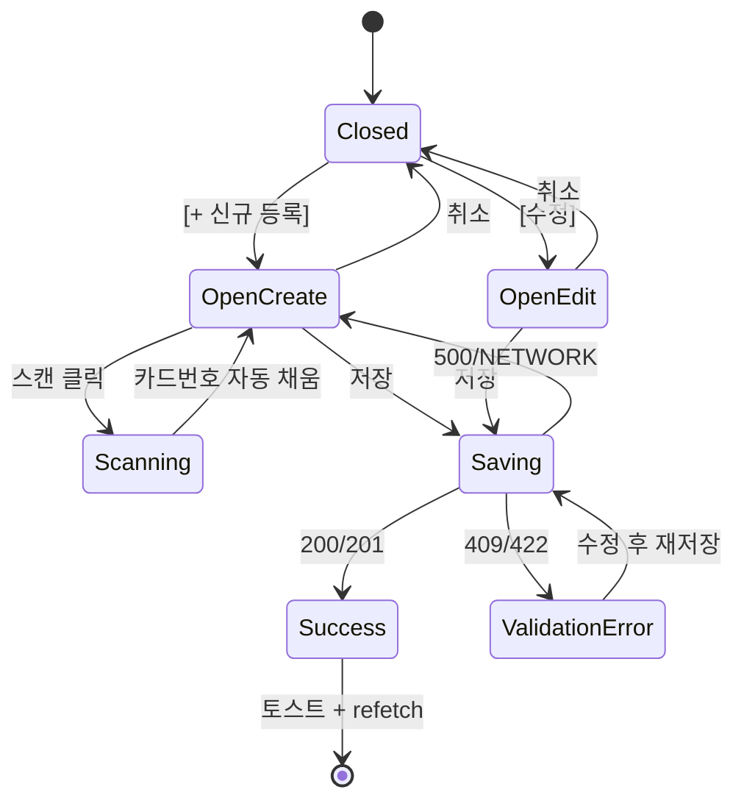

# DLG-052-001 RFID 등록/수정 — 기본화면 (마스터)

> 이 문서는 **다이얼로그 마스터 스펙**입니다. `01~04` 상태 문서는 이 문서를 상속(override/delta)합니다.
> 🎯 **건설적 액션(primary)**: RFID 밴드/카드를 신규 등록하거나 기존 카드의 회원/직원 매핑을 수정하는 공용 다이얼로그.

---

## 0. 메타 & 원천 참조

| 항목 | 값 |
|------|----|
| 다이얼로그 ID | DLG-052-001 |
| 다이얼로그명 | RFID 등록/수정 |
| 도메인 | D06-시설관리 |
| 부모 화면 | `SCR-052 밴드/카드 관리` (`/rfid`) |
| 트리거 조건 | `[+ 신규 등록]` / 행 `[수정]` 클릭 + 권한 검증 통과 |
| 확인 레벨 | L1 (건설적) — 표준 폼 저장 |
| 서버 호출 여부 | ✅ `POST /rfid` (등록) / `PUT /rfid/:id` (수정) |
| 닫기 옵션 | 🟡 ESC/배경/X = 취소 허용 (단, `03-저장중` 상태에서는 차단) |
| 역할 | `superAdmin/primary/owner/manager/front` (RFID 등록·수정 권한) |
| 파일 경로 | `src/components/rfid/CardModal.tsx` |
| 우선순위 | P1 |

### 원천 문서 링크
| 문서 | 경로 | 섹션 |
|---|---|---|
| 화면설계서 | `docs/화면설계서/시설관리.md` | §SCR-052, §다이얼로그 DLG-052-001 |
| 기능명세서 | `docs/기능명세서/시설관리.md` | §3 밴드/카드 관리 — G-1. 등록/수정 모달 (UI-108, UI-109) |
| 다이어그램 M1 생명주기 | `docs/다이어그램/D06_시설관리/DLG/DLG-052-001_RFID등록수정/M1_생명주기.md` | OPEN_NEW/OPEN_EDIT → SaveAPI → SUCCESS/FAIL |
| 다이어그램 M2 필드검증 | `docs/다이어그램/D06_시설관리/DLG/DLG-052-001_RFID등록수정/M2_필드검증.md` | 카드번호/유형 검증 |
| 다이어그램 M3 결과분기 | `docs/다이어그램/D06_시설관리/DLG/DLG-052-001_RFID등록수정/M3_결과분기.md` | 결과별 후속 처리 |
| 에러코드정의서 | `docs/에러코드정의서.md` | §시설 E422052, E409052, E500001 |
| 권한 매트릭스 | `docs/다이어그램/10_권한매트릭스/R1_역할화면_매트릭스.md` | SCR-052 |
| 공용 저장 확인 | `docs/화면설계서/D01-공통/DLG-004-저장확인/00-기본화면.md` | 변경 후 닫기 전 확인 |

---

## 1. 다이얼로그 목적 (Why)

RFID 밴드/카드 신규 등록과 기존 카드 수정(회원 매핑 변경, 사물함 연결 변경)을 **단일 다이얼로그**에서 수행해 일관된 UX 제공.
- 스캔 입력과 수동 입력 **듀얼 모드** — 하드웨어 리더 유무에 무관한 운영 가능
- 회원/직원 두 유형의 사용자 매핑을 단일 폼에서 분기 처리
- 중복 카드번호 서버 검증 + 인라인 에러로 즉시 피드백

---

## 2. 화면 레이아웃 (Wireframe)

### 2.1 기본 레이아웃 — 등록 모드

```
  backdrop: bg-black/50
  ┌──────────────────────────────────────┐
  │  ┌──────────────────────────────┐    │
  │  │ 📶 RFID 카드 등록         [X]│    │ ← Header (primary tone)
  │  │                              │    │
  │  │ 카드 번호 *                  │    │
  │  │ ┌──────────────────┐ [📡스캔]│    │ ← Input + Scan btn
  │  │ │ RF-          │ │           │    │
  │  │ └──────────────────┘          │    │
  │  │ ⓘ 리더기에 카드를 대주세요     │    │
  │  │                              │    │
  │  │ 사용자 유형 *                 │    │
  │  │ ( ● 회원 )  ( ○ 직원 )        │    │ ← RadioGroup
  │  │                              │    │
  │  │ 회원 선택 *                   │    │
  │  │ ┌─────────────────────┐       │    │ ← AutoComplete
  │  │ │ 🔍 이름/전화 검색   │       │    │
  │  │ └─────────────────────┘       │    │
  │  │                              │    │
  │  │ 연결 사물함 (선택)            │    │
  │  │ ┌──────────────────┐           │    │
  │  │ │ A-102            │           │    │
  │  │ └──────────────────┘           │    │
  │  │                              │    │
  │  │         [ 취소 ]  [ 저장 ]   │    │
  │  └──────────────────────────────┘    │
  └──────────────────────────────────────┘
```

### 2.2 수정 모드 변형

```
  📶 RFID 카드 수정
  카드 번호: [ RF-10293857 ] (readonly, font-mono)
  사용자 유형 *   ( ● 회원 )  ( ○ 직원 )
  회원 선택 *     [홍길동 ×]
  연결 사물함     [A-102]
  상태            [활성 ▼]  ← 수정 모드만 노출
                                   [ 취소 ]  [ 저장 ]
```

| 영역 | 치수 | 역할 |
|---|---|---|
| Backdrop | `fixed inset-0 bg-black/50 z-40` | 배경 |
| Modal | `max-w-md` | 카드 |
| Header | 48px | 아이콘/제목/X |
| Body | auto | 폼 필드 4~5개 |
| Footer | 56px | [취소][저장(primary)] |

---

## 3. 디자인 토큰

### 3.1 색상

| 토큰 | 클래스 | 용도 |
|---|---|---|
| backdrop | `fixed inset-0 bg-black/50 z-40` | 배경 |
| card | `bg-white rounded-2xl shadow-xl ring-1 ring-gray-100` | 카드 |
| icon.primary.wrap | `bg-blue-50 rounded-full size-10` | 아이콘 래퍼 |
| icon.primary | `text-blue-600` | `Wifi`/`CreditCard` |
| scan.idle | `bg-blue-50 text-blue-700 border-blue-200` | 스캔 버튼 기본 |
| scan.pulsing | `animate-pulse bg-blue-100 text-blue-800` | 스캔 대기 중 |
| btn.cancel | `border border-gray-300 bg-white hover:bg-gray-50 text-gray-700` | Secondary |
| btn.save | `bg-blue-600 hover:bg-blue-700 text-white` | Primary |
| btn.save.disabled | `bg-blue-300 cursor-not-allowed` | 검증 실패 시 |
| input | `h-10 w-full rounded-lg border border-gray-300 px-3 text-sm focus:ring-2 focus:ring-blue-500 focus:border-blue-500` | 텍스트 입력 |
| input.mono | `font-mono tracking-wider` | 카드번호 입력 |
| input.error | `border-rose-300 focus:ring-rose-500` | 검증 에러 |
| helper.text | `text-xs text-gray-500 mt-1` | 보조 설명 |
| radio.selected | `border-blue-600 bg-blue-50 text-blue-700` | 선택된 RadioCard |

### 3.2 타이포

| 토큰 | 값 |
|---|---|
| title | `text-lg font-semibold text-gray-900` |
| label | `text-sm/5 font-medium text-gray-700` |
| helper | `text-xs text-gray-500` |
| field.error | `text-xs text-rose-600` |

### 3.3 간격/반경/모션
- radius: `rounded-2xl`
- padding: `p-6`, 필드 간 `space-y-4`
- enter: `animate-[fadeInUp_140ms_ease-out]`
- 스캔 펄스: `animate-pulse duration-1000`

---

## 4. 반응형 규칙

| BP | 모달 | 레이아웃 |
|---|---|---|
| Mobile <640 | `max-w-xs w-[calc(100%-32px)]` | 필드 세로 스택, 스캔 버튼 full-width 아래 배치 |
| Tablet | `max-w-md` | 기본 |
| Desktop | `max-w-md` | 기본 |

---

## 5. 🔐 역할별(RBAC) 매트릭스

| 요소 | superAdmin | primary | owner | manager | fc | trainer | staff | front | readonly |
|---|:---:|:---:|:---:|:---:|:---:|:---:|:---:|:---:|:---:|
| 다이얼로그 열기 | ● | ● | ● | ● | — | — | ○ | ● | — |
| 카드번호 편집 | ● | ● | ● | ● | — | — | — | ● | — |
| 스캔 버튼 | ● | ● | ● | ● | — | — | — | ● | — |
| 사용자 유형 "직원" 선택 | ● | ● | ● | ● | — | — | — | — | — |
| 회원 AutoComplete | 모든 지점 | 브랜드 | 본인 지점 | 본인 지점 | — | — | — | 본인 지점 | — |
| 사물함 연결 | ● | ● | ● | ● | — | — | — | ● | — |
| 상태 변경(수정 모드) | ● | ● | ● | ● | — | — | — | — | — |
| "취소" | ● | ● | ● | ● | ● | ● | ● | ● | ● |
| "저장" | ● | ● | ● | ● | — | — | — | ● | — |

**표기**: ● 가능 · ○ 제한적 가능 · — 불가

### 멀티테넌트
- `branchId` 강제: 서버는 `POST /rfid` 시 현재 세션의 `branchId` 기준으로 스코프 저장
- 다른 지점 회원 매핑 시 403
- 슈퍼/primary는 제목에 지점명 부기: `📶 [{branchName}] RFID 카드 등록`

---

## 6. 컴포넌트 트리

```tsx
<Dialog open={isOpen} onOpenChange={onClose}>
  <DialogContent className="max-w-md">
    <DialogHeader>
      <DialogTitle>{mode === 'create' ? 'RFID 카드 등록' : 'RFID 카드 수정'}</DialogTitle>
    </DialogHeader>

    <form onSubmit={handleSubmit(onSubmit)} className="space-y-4">
      {/* 카드번호 + 스캔 */}
      <FormField label="카드 번호" required error={errors.cardNo?.message}>
        <div className="flex gap-2">
          <Input {...register('cardNo')} className="font-mono" placeholder="RF-00000000"
                 disabled={mode === 'edit'} />
          {mode === 'create' && (
            <button type="button" onClick={simulateScan}
                    className="shrink-0 h-10 px-3 rounded-lg border border-blue-200 bg-blue-50 text-blue-700">
              <Wifi className="size-4" /> 스캔
            </button>
          )}
        </div>
      </FormField>

      <FormField label="사용자 유형" required>
        <RadioGroup value={userType} onValueChange={v => setValue('userType', v)}>
          <RadioCard value="member" label="회원" />
          <RadioCard value="staff"  label="직원" />
        </RadioGroup>
      </FormField>

      {userType === 'member'
        ? <FormField label="회원 선택" required><MemberAutoComplete {...} /></FormField>
        : <FormField label="직원 선택" required><StaffAutoComplete  {...} /></FormField>}

      <FormField label="연결 사물함 (선택)">
        <Input {...register('lockerNo')} placeholder="예: A-102" />
      </FormField>

      {mode === 'edit' && (
        <FormField label="상태">
          <Select {...register('status')}>
            <option value="active">활성</option>
            <option value="lost">분실</option>
            <option value="released">해제</option>
          </Select>
        </FormField>
      )}
    </form>

    <DialogFooter>
      <Button variant="secondary" onClick={onClose}>취소</Button>
      <Button type="submit" variant="primary" loading={isSubmitting} disabled={!isValid}>저장</Button>
    </DialogFooter>
  </DialogContent>
</Dialog>
```

### 컴포넌트 명세
| 컴포넌트 | Props | 재사용 |
|---|---|---|
| `CardModal` | `{ isOpen, mode:'create'|'edit', initialData?, onClose, onSaved }` | 전용 |
| `MemberAutoComplete` | `{ value, onChange, branchId }` | 전역 공용 |
| `StaffAutoComplete` | `{ value, onChange, branchId, role? }` | 전역 공용 |
| `RadioCard` | `{ value, label, icon? }` | 전역 공용 |

---

## 7. 데이터 계약

### 7.1 폼 스키마 (Zod)

```ts
// src/schemas/rfid.ts
export const cardTypes = ['member', 'staff'] as const;
export const cardStatuses = ['active', 'lost', 'released'] as const;

export const cardSchema = z.object({
  cardNo:   z.string().regex(/^RF-\d{8}$/, '형식: RF-00000000'),
  userType: z.enum(cardTypes),
  memberId: z.number().nullable(),
  staffId:  z.number().nullable(),
  lockerNo: z.string().max(10).optional().nullable(),
  status:   z.enum(cardStatuses).default('active'),
}).refine(v => v.userType === 'member' ? !!v.memberId : !!v.staffId, {
  message: '사용자를 선택하세요', path: ['memberId'],
});
export type CardForm = z.infer<typeof cardSchema>;
```

### 7.2 API 계약

| 항목 | 등록 | 수정 |
|---|---|---|
| 엔드포인트 | `POST /rfid` | `PUT /rfid/:id` |
| 요청 | `{ cardNo, userType, memberId?, staffId?, lockerNo?, branchId }` | 동일 (+ `status`) |
| 성공(201/200) | `{ success:true, data: RfidCard }` | `{ success:true, data: RfidCard }` |
| 실패(409) | `{ errorCode:'E409052', message:'이미 등록된 카드번호입니다' }` | — |
| 실패(422) | `{ errorCode:'E422052', message:'카드번호 형식이 올바르지 않습니다' }` | 동일 |
| 실패(403) | `{ errorCode:'E403001', message:'권한이 없습니다' }` | 동일 |
| 실패(500) | `{ errorCode:'E500001' }` | 동일 |

### 7.3 상태 전이

```
closed → 01-열림-등록모드 | 02-열림-수정모드
                             ↓ (저장)
                         검증실패 → 03-검증에러 (필드 인라인)
                         검증통과 → saving → 04-성공
                                         ↘ 실패(409/422/500/NETWORK) → 열림 유지(필드/배너 에러)
```

---

## 8. 비즈니스 룰

1. **스캔 시뮬레이션**: `mode='create'`에서만 노출. 클릭 시 800ms 딜레이 후 `"RF-" + randomDigits(8)` 자동 채움.
2. **카드번호 readonly**: 수정 모드에서는 `cardNo` 편집 불가 (백엔드 PK 안정성).
3. **회원/직원 스위치**: `userType` 변경 시 상대편 ID 자동 null 처리. 직원 모드는 `role !== 'front'` 역할만 허용.
4. **중복 검증**: `cardNo` blur 시 `GET /rfid?cardNo=...` 조회 — 충돌이면 인라인 에러 선표시(서버 저장 전).
5. **사물함 연결**: 존재하지 않는 번호여도 저장 허용(단순 메타). 락커 실시간 매핑은 SCR-050에서 관리.
6. **저장 중 닫기 차단**: `isSubmitting=true` 동안 ESC/배경/X 무력화.
7. **변경 사항 유무**: 수정 모드에서 변경 없음 상태로 저장 시 API 호출 생략하고 즉시 닫기(`isDirty===false`).
8. **이탈 경고**: `isDirty===true`에서 취소 시 DLG-002 이탈 경고 연결.
9. **감사로그**: 서버 `AUDIT.RFID_CREATE` / `AUDIT.RFID_UPDATE` 자동 기록.

---

## 9. 상태 목록

| 파일 | 상태 코드 | 한글 | 트리거 |
|---|---|---|---|
| `01-열림-등록모드.md` | `rfid-create-open` | 열림 — 등록 모드 | `[+ 신규 등록]` 클릭 |
| `02-열림-수정모드.md` | `rfid-edit-open` | 열림 — 수정 모드 | 행 `[수정]` 클릭 |
| `03-검증에러.md` | `rfid-validation-error` | 검증 에러 | 필드 검증/409/422 응답 |
| `04-성공.md` | `rfid-save-success` | 저장 성공 | 200/201 응답 |

---

## 10. 에러 코드 매핑

| errorCode | HTTP | 시나리오 | 표시 | 다음 상태 |
|---|---|---|---|---|
| E422052 | 422 | 카드번호 형식 오류 | 필드 인라인 "형식: RF-00000000" | 03-검증에러 |
| E409052 | 409 | 카드번호 중복 | 필드 인라인 "이미 등록된 카드번호" | 03-검증에러 |
| E404052 | 404 | 수정 대상 없음 | 토스트 + 닫기 + 목록 refetch | closed |
| E403001 | 403 | 권한 없음 | 토스트 + 닫기 | closed |
| E500001 | 500 | 서버 오류 | 배너 에러 + 재시도 가능 | 열림 유지 |
| NETWORK | — | 네트워크 | 배너 "네트워크 오류" | 열림 유지 |
| E401002 | 401 | 세션 만료 | DLG-000 오픈 | 자동 정리 |

---

## 11. 접근성 (WCAG 2.1 AA)

| 항목 | 요구사항 |
|---|---|
| role | `role="dialog"` (비파괴적) |
| 라벨 | `aria-labelledby="dlg-title"`, `aria-describedby="dlg-desc"` |
| 포커스 | 오픈 시 첫 입력(`cardNo`) 자동 포커스 (등록 모드) / 첫 에러 필드 (수정 모드) |
| Tab trap | 카드번호 → 스캔 → 유형 → 회원 → 사물함 → 상태 → 취소 → 저장 → X |
| 키보드 | `Enter`=저장, `Esc`=취소(단 저장 중 차단), `Tab` 정상 |
| 에러 전달 | 필드 `aria-invalid=true`, `aria-describedby="err-{field}"`, 배너 `role="alert" aria-live="assertive"` |
| 스캔 버튼 | `aria-label="RFID 카드 스캔"`, 펄싱 중 `aria-busy=true` |
| 모션 감소 | `motion-reduce:animate-none` 적용 (스캔 펄스 포함) |

---

## 12. 진입 / 이탈 연결

### 진입
- SCR-052 `[+ 신규 등록]` 버튼
- SCR-052 행 메뉴 `[수정]` 버튼
- 빈 상태 CTA `첫 카드 등록하기`

### 이탈
| 액션 | 목적지 |
|---|---|
| 취소 / ESC / 배경 / X | 닫힘 (변경 시 DLG-002 경고 선행) |
| 저장 성공 | `04-성공` → 토스트 + 목록 refetch + 닫기 |
| 저장 실패(치명) | 열림 유지 + 배너 에러 |
| 세션 만료 | DLG-000 오픈 |

---

## 13. 다이어그램 통합 뷰



참조: `docs/다이어그램/D06_시설관리/DLG/DLG-052-001_RFID등록수정/M1_생명주기.md`

---

## 14. 🧩 바이브코딩 프롬프트 (마스터)

```
Next.js 15 App Router + TypeScript + Tailwind + Supabase + React Query + react-hook-form + zod + Radix Dialog 기반
'use client' RFID 등록/수정 다이얼로그를 작성하라.

━━ 파일 ━━
- src/components/rfid/CardModal.tsx
- src/schemas/rfid.ts
- src/hooks/useRfidMutation.ts

━━ 외부 의존 ━━
import { Dialog, DialogContent, DialogHeader, DialogTitle, DialogFooter } from '@/components/ui/dialog';
import { useForm } from 'react-hook-form';
import { zodResolver } from '@hookform/resolvers/zod';
import { cardSchema, type CardForm, cardTypes, cardStatuses } from '@/schemas/rfid';
import { useMutation, useQueryClient } from '@tanstack/react-query';
import { supabase } from '@/lib/supabase';
import { useAuthStore } from '@/stores/authStore';
import { Wifi, CreditCard, X, Loader2, AlertCircle } from 'lucide-react';
import { toast } from '@/lib/toast';
import { useState, useEffect, useRef } from 'react';

━━ Props ━━
type Mode = 'create' | 'edit';
interface Props {
  isOpen: boolean;
  mode: Mode;
  initialData?: RfidCard;
  onClose: () => void;
  onSaved?: (card: RfidCard) => void;
}

━━ 레이아웃 ━━
<Dialog open={isOpen} onOpenChange={(o) => !o && onClose()}>
  <DialogContent className="max-w-md bg-white rounded-2xl shadow-xl p-6
                            motion-reduce:animate-none animate-[fadeInUp_140ms_ease-out]">
    <DialogHeader className="flex items-start gap-3">
      <span className="flex size-10 items-center justify-center rounded-full bg-blue-50">
        {mode === 'create' ? <Wifi className="text-blue-600 size-5" /> : <CreditCard className="text-blue-600 size-5" />}
      </span>
      <DialogTitle id="dlg-title" className="text-lg font-semibold text-gray-900">
        {mode === 'create' ? 'RFID 카드 등록' : 'RFID 카드 수정'}
      </DialogTitle>
    </DialogHeader>

    <form id="rfid-form" onSubmit={handleSubmit(onSubmit)} className="space-y-4 pt-2">
      <label className="block space-y-1.5">
        <span className="text-sm font-medium text-gray-700">카드 번호 <em className="text-rose-500">*</em></span>
        <div className="flex gap-2">
          <input {...register('cardNo')} disabled={mode === 'edit' || isSubmitting}
                 placeholder="RF-00000000"
                 className={`h-10 flex-1 rounded-lg border px-3 text-sm font-mono tracking-wider
                             focus:outline-none focus:ring-2 focus:ring-blue-500 focus:border-blue-500
                             ${errors.cardNo ? 'border-rose-300 focus:ring-rose-500' : 'border-gray-300'}
                             disabled:bg-gray-50 disabled:text-gray-500`} />
          {mode === 'create' && (
            <button type="button" onClick={simulateScan} disabled={scanning}
              aria-label="RFID 카드 스캔" aria-busy={scanning}
              className={`shrink-0 h-10 px-3 rounded-lg border text-sm inline-flex items-center gap-1
                          ${scanning ? 'animate-pulse bg-blue-100 text-blue-800 border-blue-200'
                                     : 'bg-blue-50 text-blue-700 border-blue-200 hover:bg-blue-100'}`}>
              <Wifi className="size-4" /> {scanning ? '대기…' : '스캔'}
            </button>
          )}
        </div>
        {errors.cardNo
          ? <p id="err-cardNo" className="text-xs text-rose-600">{errors.cardNo.message}</p>
          : <p className="text-xs text-gray-500">형식: RF-00000000 (스캔 시 자동 입력)</p>}
      </label>

      <fieldset className="block space-y-1.5">
        <legend className="text-sm font-medium text-gray-700">사용자 유형 <em className="text-rose-500">*</em></legend>
        <div className="grid grid-cols-2 gap-2">
          {cardTypes.map(t => (
            <label key={t} className={`cursor-pointer rounded-lg border px-3 py-2 text-sm text-center
                                       ${watch('userType') === t
                                         ? 'border-blue-600 bg-blue-50 text-blue-700 font-medium'
                                         : 'border-gray-300 bg-white text-gray-700 hover:bg-gray-50'}`}>
              <input type="radio" value={t} {...register('userType')} className="sr-only" />
              {t === 'member' ? '회원' : '직원'}
            </label>
          ))}
        </div>
      </fieldset>

      {userType === 'member'
        ? <MemberPicker value={memberId} onChange={v => setValue('memberId', v)} branchId={branchId} />
        : <StaffPicker  value={staffId}  onChange={v => setValue('staffId',  v)} branchId={branchId} />}

      <label className="block space-y-1.5">
        <span className="text-sm font-medium text-gray-700">연결 사물함 (선택)</span>
        <input {...register('lockerNo')} placeholder="예: A-102"
               className="h-10 w-full rounded-lg border border-gray-300 px-3 text-sm
                          focus:outline-none focus:ring-2 focus:ring-blue-500 focus:border-blue-500" />
      </label>

      {mode === 'edit' && (
        <label className="block space-y-1.5">
          <span className="text-sm font-medium text-gray-700">상태</span>
          <select {...register('status')}
                  className="h-10 w-full rounded-lg border border-gray-300 px-3 text-sm focus:ring-2 focus:ring-blue-500">
            <option value="active">활성</option>
            <option value="lost">분실</option>
            <option value="released">해제</option>
          </select>
        </label>
      )}

      {saveError && (
        <div role="alert" className="rounded-md bg-rose-50 border border-rose-200 p-3 text-xs text-rose-700">
          <AlertCircle className="inline size-3.5 mr-1" /> {saveError}
        </div>
      )}
    </form>

    <DialogFooter className="flex items-center justify-end gap-2 pt-4">
      <button onClick={onClose} disabled={isSubmitting}
        className="h-10 px-4 rounded-lg border border-gray-300 bg-white hover:bg-gray-50 text-sm font-medium text-gray-700 disabled:opacity-50">
        취소
      </button>
      <button type="submit" form="rfid-form" disabled={!isValid || isSubmitting}
        className={`h-10 px-4 rounded-lg text-white text-sm font-medium inline-flex items-center gap-2
                    bg-blue-600 hover:bg-blue-700 disabled:bg-blue-300 disabled:cursor-not-allowed`}>
        {isSubmitting && <Loader2 className="size-4 animate-spin" />}
        {isSubmitting ? '저장 중...' : '저장'}
      </button>
    </DialogFooter>
  </DialogContent>
</Dialog>

━━ 데이터 / 스키마 ━━
// src/schemas/rfid.ts
export const cardTypes = ['member','staff'] as const;
export const cardStatuses = ['active','lost','released'] as const;
export const cardSchema = z.object({
  cardNo:   z.string().regex(/^RF-\d{8}$/, '형식: RF-00000000'),
  userType: z.enum(cardTypes),
  memberId: z.number().int().nullable(),
  staffId:  z.number().int().nullable(),
  lockerNo: z.string().max(10).nullable().optional(),
  status:   z.enum(cardStatuses).default('active'),
}).refine(v => v.userType==='member' ? !!v.memberId : !!v.staffId,
  { message: '사용자를 선택하세요', path: ['memberId'] });

━━ 저장 로직 ━━
const saveMutation = useMutation({
  mutationFn: async (data: CardForm) => {
    const payload = { ...data, branchId: currentBranchId };
    return mode === 'create'
      ? supabase.from('rfid_cards').insert(payload).select().single()
      : supabase.from('rfid_cards').update(payload).eq('id', initialData!.id).select().single();
  },
  onSuccess: ({ data }) => {
    toast.success(mode === 'create' ? '카드가 등록되었습니다' : '카드가 수정되었습니다');
    qc.invalidateQueries({ queryKey: ['rfid-cards', currentBranchId] });
    onSaved?.(data);
    onClose();
  },
  onError: (e: any) => {
    if (e.code === 'E409052') setError('cardNo', { message: '이미 등록된 카드번호입니다' });
    else if (e.code === 'E422052') setError('cardNo', { message: '카드번호 형식이 올바르지 않습니다' });
    else setSaveError(e.message || '저장에 실패했습니다');
  },
});

━━ 스캔 시뮬레이션 ━━
function simulateScan() {
  setScanning(true);
  setTimeout(() => {
    const code = 'RF-' + Math.floor(Math.random() * 1e8).toString().padStart(8, '0');
    setValue('cardNo', code, { shouldValidate: true, shouldDirty: true });
    setScanning(false);
  }, 800);
}

━━ 디자인 토큰 (정확히) ━━
backdrop:      fixed inset-0 z-40 bg-black/50
card:          bg-white rounded-2xl shadow-xl ring-1 ring-gray-100 p-6
icon.wrap:     flex size-10 items-center justify-center rounded-full bg-blue-50
input:         h-10 w-full rounded-lg border border-gray-300 px-3 text-sm
               focus:outline-none focus:ring-2 focus:ring-blue-500 focus:border-blue-500
input.mono:    font-mono tracking-wider
input.error:   border-rose-300 focus:ring-rose-500
radio.card:    cursor-pointer rounded-lg border px-3 py-2 text-sm text-center
radio.selected: border-blue-600 bg-blue-50 text-blue-700 font-medium
btn.cancel:    h-10 px-4 rounded-lg border border-gray-300 bg-white hover:bg-gray-50 text-sm font-medium text-gray-700
btn.primary:   h-10 px-4 rounded-lg bg-blue-600 hover:bg-blue-700 disabled:bg-blue-300 text-white text-sm font-medium
scan.idle:     bg-blue-50 text-blue-700 border-blue-200
scan.pulsing:  animate-pulse bg-blue-100 text-blue-800

━━ QA 체크 ━━
- 등록 모드: 카드번호 미입력 상태에서 저장 disabled
- 스캔 버튼: 800ms 펄싱 → RF-XXXXXXXX 자동 채움
- 수정 모드: 카드번호 readonly + 상태 select 노출
- 사용자 유형 스위치 시 반대편 ID 초기화
- 중복 카드번호 저장 → E409052 → 필드 인라인
- 저장 중 ESC/배경 차단
- 네트워크 에러 → 배너 유지 + 재시도 가능
- 변경 사항 있을 때 취소 → DLG-002 이탈 경고
```

---

## 15. QA 체크리스트

- [ ] `[+ 신규 등록]` 클릭 시 등록 모드 오픈
- [ ] 행 `[수정]` 클릭 시 기존 데이터 채워진 수정 모드
- [ ] 등록 모드: 카드번호 필드 첫 포커스
- [ ] 스캔 버튼 클릭 시 800ms 펄싱 + 자동 번호 채움
- [ ] 수정 모드: 카드번호 readonly + 상태 select 노출
- [ ] 사용자 유형 전환 시 상대 ID 자동 초기화
- [ ] 회원 AutoComplete 이름/전화 검색 동작
- [ ] 필수 필드 미입력 시 저장 disabled
- [ ] 저장 성공 시 토스트 + 목록 refetch + 닫힘
- [ ] 중복 카드번호 (409) 시 필드 인라인 에러
- [ ] 422 검증 에러 시 필드 인라인
- [ ] 500/NETWORK 시 배너 + 재시도 가능
- [ ] 변경 있는 상태에서 취소 → DLG-002 경고
- [ ] 저장 중 ESC/배경/X 차단
- [ ] Tab 순서 정상
- [ ] 스캔 버튼 `aria-busy` 동적 전환
- [ ] 세션 만료 시 DLG-000 우선
- [ ] 모바일 360px 가독성
- [ ] 감사로그 `AUDIT.RFID_CREATE/UPDATE` 서버 기록
