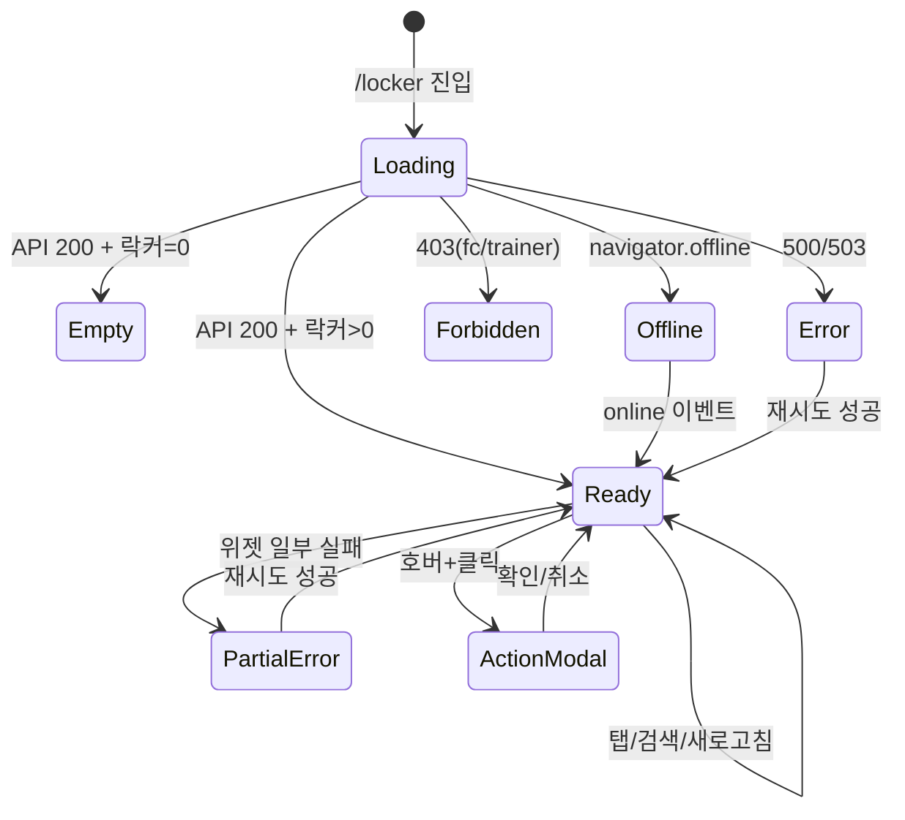

# SCR-050 락커 관리 — 기본화면 (마스터)

> 이 문서는 **화면 마스터 스펙**입니다. `01~07` 상태 문서는 이 문서를 상속(override/delta)합니다.
> 상태별 파일은 "변경점(델타)만" 기술하며, 이 문서에 정의된 레이아웃/토큰/컴포넌트/데이터/권한/접근성은 **기본값**으로 적용됩니다.
> 🔐 멀티테넌트: `branchId` 강제. 🆕 IoT 연동: 락커 오프라인 감지 지원.

---

## 0. 메타 & 원천 참조

| 항목 | 값 |
|------|----|
| 화면 ID | SCR-050 |
| 화면명 | 락커 관리 |
| 도메인 | D06-시설관리 |
| 경로 | `/locker` |
| Next.js Route Group | `(facilities)` |
| 파일 경로 | `src/app/(facilities)/locker/page.tsx` |
| 페이지 컴포넌트 | `Locker` (default export) |
| 역할 | `superAdmin`, `primary`, `owner`, `manager`, `staff` (● 전 권한) / `front` (○ 조회) / `trainer`, `fc` (—) |
| 우선순위 | P0 (시설 관리 핵심) |
| 플랫폼 | 데스크톱(우선) / 태블릿 / 모바일 |
| 멀티테넌트 | ✅ `branchId` 컨텍스트 필터링 |
| IoT 연동 | ✅ 락커 스마트 태그 상태 감지 (MAINTENANCE/오프라인) |

### 원천 문서 링크
| 문서 | 경로 | 섹션 |
|---|---|---|
| 화면설계서 | `docs/화면설계서/시설관리.md` | §SCR-050 락커 관리 |
| 기능명세서 | `docs/기능명세서/시설관리.md` | §1. 락커 관리 |
| 상태전이도 | `docs/상태전이도.md` | §7. 락커 상태 (AVAILABLE/IN_USE/MAINTENANCE) |
| 에러코드 | `docs/에러코드정의서.md` | §4.7 시설/락커 (E404600, E409600, E409601, E409602) |
| 권한매트릭스 | `docs/다이어그램/10_권한매트릭스/R1_역할화면_매트릭스.md` | `/locker` 역할별 |
| 다이어그램 F1 | `docs/다이어그램/D06_시설관리/SCR-050_락커관리/F1_진입.md` | 진입 플로우 |
| 다이어그램 F2 | `docs/다이어그램/D06_시설관리/SCR-050_락커관리/F2_메인.md` | 메인 인터랙션 |
| 다이어그램 F3 | `docs/다이어그램/D06_시설관리/SCR-050_락커관리/F3_버튼액션.md` | 버튼 액션 |
| 다이어그램 F5 | `docs/다이어그램/D06_시설관리/SCR-050_락커관리/F5_모달트리거.md` | 모달 (DLG-050-001~007) |
| 다이어그램 F6 | `docs/다이어그램/D06_시설관리/SCR-050_락커관리/F6_상태별.md` | 7상태 전이 |
| 다이어그램 F7 | `docs/다이어그램/D06_시설관리/SCR-050_락커관리/F7_권한.md` | 8역할 분기 |
| 다이어그램 F8 | `docs/다이어그램/D06_시설관리/SCR-050_락커관리/F8_에러.md` | 에러 매핑 |
| KPI | `docs/KPI_정의서.md` | 락커 가동률 (목표 70%+) |

---

## 1. 화면 목적 (Why)

센터 내 모든 락커의 배정 현황을 **A/B/C 구역별로 시각적 그리드**와 리스트 뷰로 관리한다.
- 락커 셀 호버 시 **기록/이동/회수/배정/고장 토글** 액션 제공
- **일괄 배정** 및 **만료임박 일괄 해제** 지원 (운영 효율)
- IoT 연동: 스마트 락커의 오프라인 상태 자동 감지
- 만료임박(D-7 이내) 자동 하이라이트 + 일괄 처리 지원
- 멀티테넌트: `branchId` 기준 필터링, URL 조작 방지

---

## 2. 화면 레이아웃 (Wireframe)

### 2.1 풀뷰 (데스크톱 1440px 기준)

```
┌──────────────────────────────────────────────────────────────────────────┐
│ AppLayout                                                                 │
│ ┌ Sidebar ─┐ ┌ Main ────────────────────────────────────────────────────┐│
│ │           │ │ ┌ PageHeader ────────────────────────────────────────┐ ││
│ │  시설관리 │ │ │ 락커 관리                                          │ ││
│ │  ▸ 락커   │ │ │ "센터 내 모든 락커의 배정 현황 및 상태를 관리합니다."│ ││
│ │           │ │ │          [🔄새로고침][📥엑셀][👤일괄배정][+락커추가]│ ││
│ │           │ │ └────────────────────────────────────────────────────┘ ││
│ │           │ │ ┌ StatCardGrid (4열) ─────────────────────────────────┐││
│ │           │ │ │[전체 96][사용중 72][만료임박 8][고장 2]             │││
│ │           │ │ └────────────────────────────────────────────────────┘││
│ │           │ │ ┌ TabNav + 일괄해제 ──────────────────────────────────┐││
│ │           │ │ │ [A구역][B구역][C구역]     [☑만료임박 일괄 해제]    │││
│ │           │ │ ├────────────────────────────────────────────────────┤││
│ │           │ │ │ 🔍 [락커 번호 또는 회원명 검색              ]      │││
│ │           │ │ │                                                    │││
│ │           │ │ │ +---++---++---++---++---++---++---++---+           │││
│ │           │ │ │ | 1 || 2 || 3 || 4 || 5 || 6 || 7 || 8 |  4x8그리드│││
│ │           │ │ │ |홍길||김민||빈 ||빈 ||이영||빈 ||빈 || ✗ |           │││
│ │           │ │ │ |D-5 ||D-12||   ||   ||D-0 ||   ||   ||고장|           │││
│ │           │ │ │ +---++---++---++---++---++---++---++---+           │││
│ │           │ │ │ ... 4행 x 8열                                       │││
│ │           │ │ │                                                    │││
│ │           │ │ │ 호버 오버레이:                                       │││
│ │           │ │ │  [기록][이동][회수/배정][고장/복구]                  │││
│ │           │ │ │                                                    │││
│ │           │ │ │ 범례: [■사용중][□빈락커][■만료임박][■고장]         │││
│ │           │ │ └────────────────────────────────────────────────────┘││
│ │           │ └──────────────────────────────────────────────────────┘ │
│ └───────────┘                                                            │
└──────────────────────────────────────────────────────────────────────────┘
```

### 2.2 영역 그리드

| 영역 | 그리드 | 치수 | 비고 |
|---|---|---|---|
| PageHeader | `flex justify-between` | 64px h | 제목 + 액션 버튼 4개 |
| StatCardGrid | `grid grid-cols-2 md:grid-cols-4 gap-4` | 108px h | 4 카드 |
| TabNav 헤더 | `flex items-center justify-between` | 48px h | 구역 탭 + 일괄해제 |
| SearchBar | `w-full` | 40px h | placeholder 검색 |
| LockerGrid | `grid grid-cols-4 md:grid-cols-6 lg:grid-cols-8 gap-2` | 80px cell | 셀 80x80 |
| Legend | `flex gap-4` | 32px h | 범례 4개 |

---

## 3. 디자인 토큰

### 3.1 색상 (Tailwind)
| 역할 | 클래스 | 용도 |
|---|---|---|
| bg.page | `bg-gray-50` | 전체 배경 |
| bg.card | `bg-white rounded-xl shadow-sm ring-1 ring-gray-100` | StatCard/Panel |
| tab.active | `bg-white border-b-2 border-blue-600 text-blue-700` | 구역 탭 활성 |
| tab.idle | `text-gray-600 hover:text-gray-900` | 비활성 |
| cell.available | `bg-surface-tertiary border-line text-content-secondary` | 빈 락커 |
| cell.in_use | `bg-state-info/10 border-state-info text-state-info` | 사용중 |
| cell.expiring | `bg-amber-50 border-amber-400 text-amber-700` | 만료임박(D-7 이내) |
| cell.broken | `bg-state-error/5 border-state-error text-state-error opacity-70` | 고장 (사선 표시) |
| cell.selected | `ring-2 ring-primary ring-offset-1` | 일괄 선택 시 |
| dday.critical | `text-state-error` | D-Day ≤ 0 |
| dday.warn | `text-amber-600` | D-Day 1~7 |
| dday.normal | `opacity-60` | D-Day > 7 |
| banner.amber | `bg-amber-50 border-amber-200 text-amber-700` | 만료해제 모드 안내 |
| banner.primary | `bg-primary/5 border-primary/30 text-primary` | 일괄배정 모드 안내 |
| btn.primary | `bg-primary text-white hover:bg-primary/90` | 주요 액션 |
| btn.danger | `bg-state-error/10 text-state-error hover:bg-state-error/20` | 일괄해제 실행 |

### 3.2 타이포그래피
| 토큰 | 스타일 | 용도 |
|---|---|---|
| page.title | `text-2xl font-bold text-gray-900` | "락커 관리" |
| page.desc | `text-sm text-gray-500` | 설명 |
| stat.label | `text-xs uppercase tracking-wide font-medium text-gray-500` | 카드 라벨 |
| stat.value | `text-3xl font-bold tabular-nums text-gray-900` | 카드 값 |
| cell.number | `text-[13px] font-bold` | 셀 번호 |
| cell.member | `text-[11px] truncate max-w-[60px]` | 회원명 |
| cell.dday | `text-[10px]` | D-Day 라벨 |
| cell.empty | `text-[10px] opacity-60` | "빈 락커" |

### 3.3 간격/반경/그림자
| 토큰 | 값 |
|---|---|
| card.radius | `rounded-xl` (12px) |
| cell.radius | `rounded-md` (6px) |
| cell.size | `80x80px` (`w-20 h-20`) |
| page.padding | `p-6 lg:p-8` |
| section.gap | `space-y-6` |

### 3.4 모션
- 셀 진입: `transition-all duration-150`
- 호버 오버레이: `opacity-0 group-hover:opacity-100 transition-opacity`
- 고장 사선: CSS `background: linear-gradient(45deg, transparent 49%, currentColor 49%, currentColor 51%, transparent 51%)`
- 로딩 스켈레톤: `animate-pulse`

---

## 4. 반응형 규칙

| BP | 폭 | 그리드 | 카드 | Sidebar |
|---|---|---|---|---|
| Mobile <640 | 100% | 4열 | 2열 | 드로어 |
| Tablet 640~1024 | 100% | 6열 | 4열 | 축약 |
| Desktop ≥1024 | sidebar+main | 8열 | 4열 | 펼침(240px) |
| XL ≥1440 | max container | 8열 | 4열 | 펼침(260px) |

---

## 5. 🔐 역할별(RBAC) 매트릭스

> `●` = 전 권한, `○` = 읽기만, `—` = 비표시
> fc/trainer는 시설 관리에서 **제외** (fc = 상담 중심, trainer = 수업 중심)

### 5.1 역할 × 요소 매트릭스

| 요소 | super/primary | owner | manager | fc | trainer | staff | front | readonly |
|---|:---:|:---:|:---:|:---:|:---:|:---:|:---:|:---:|
| **페이지 접근** | ● | ● | ● | — | — | ● | ○ | ○ |
| **지점 전환 드롭다운** | ● | ●(소속) | — | — | — | — | — | — |
| **새로고침** | ● | ● | ● | — | — | ● | ● | ● |
| **엑셀 다운로드** | ● | ● | ● | — | — | ● | — | — |
| **+ 락커 추가** | ● | ● | ● | — | — | — | — | — |
| **일괄 배정 (PageHeader)** | ● | ● | ● | — | — | ● | — | — |
| **만료임박 일괄 해제** | ● | ● | ● | — | — | ● | — | — |
| **셀 호버: 기록** | ● | ● | ● | — | — | ● | ● | ○ |
| **셀 호버: 이동** | ● | ● | ● | — | — | ● | — | — |
| **셀 호버: 회수** | ● | ● | ● | — | — | ● | — | — |
| **셀 호버: 배정** | ● | ● | ● | — | — | ● | — | — |
| **셀 호버: 고장 토글** | ● | ● | ● | — | — | ● | — | — |
| **비밀번호/메모 수정** | ● | ● | ● | — | — | ● | — | — |
| **일괄 삭제(관리자)** | ● | ● | — | — | — | — | — | — |

### 5.2 역할별 요약 뷰

```
┌── super/primary — "전 지점 락커 통합" ──┐
│ [지점전환▼] 전 액션 활성                 │
│ 감사로그: 전 이벤트                      │
└─────────────────────────────────────────┘
┌── owner — "센터장" ──┐
│ 본인 지점 고정 / 전 액션 활성            │
└─────────────────────────────────────────┘
┌── manager — "운영 매니저" ──┐
│ 본인 지점 / 삭제 제외 전 액션            │
└─────────────────────────────────────────┘
┌── staff — "스탭(기본값)" ──┐
│ 락커 접근은 staff까지 ● (출입 기본)      │
│ 배정/회수/고장/기록/이동 모두 가능       │
│ 엑셀 다운로드까지                        │
└─────────────────────────────────────────┘
┌── front — "프론트(읽기)" ──┐
│ 락커 현황 조회만                         │
│ 기록 모달 조회(수정 불가)                │
└─────────────────────────────────────────┘
┌── fc/trainer — "접근 불가" ──┐
│ /forbidden 리다이렉트                    │
└─────────────────────────────────────────┘
```

### 5.3 role-access.ts 스니펫
```ts
export const canAccessLocker = (r: Role) =>
  ['superAdmin','primary','owner','manager','staff','front','readonly'].includes(r);
export const canEditLocker = (r: Role) =>
  ['superAdmin','primary','owner','manager','staff'].includes(r);
export const canBulkAssignLocker = (r: Role) =>
  ['superAdmin','primary','owner','manager','staff'].includes(r);
export const canDeleteLocker = (r: Role) =>
  ['superAdmin','primary','owner','manager'].includes(r);
export const canAddLocker = (r: Role) =>
  ['superAdmin','primary','owner','manager'].includes(r);
```

---

## 6. 컴포넌트 트리

```tsx
<AppLayout role={user.role}>
  <main className="bg-gray-50 p-6 lg:p-8 space-y-6">
    <PageHeader
      title="락커 관리"
      description="센터 내 모든 락커의 배정 현황 및 상태를 관리합니다."
      actions={[
        <Button variant="ghost" onClick={refetch}><RefreshCcw/>새로고침</Button>,
        <Button variant="ghost" onClick={exportToExcel}><Download/>엑셀 다운로드</Button>,
        canBulkAssignLocker(role) && <Button variant="outline-primary" onClick={enterBulkAssignMode}><UserPlus/>일괄 배정</Button>,
        canAddLocker(role) && <Button variant="primary" onClick={openAddLocker}><Plus/>락커 추가</Button>,
      ]}
    />

    <StatCardGrid cols={4}>
      <StatCard label="전체 락커" value={total} icon={<Lock/>} variant="default" />
      <StatCard label="사용중" value={inUseCount} icon={<User/>} variant="mint" />
      <StatCard label="만료임박" value={expiringCount} icon={<Clock/>} variant="peach" description="7일 이내 만료" />
      <StatCard label="고장" value={brokenCount} icon={<XCircle/>} variant="default" />
    </StatCardGrid>

    <Panel>
      <div className="flex items-center justify-between px-4 pt-4">
        <TabNav value={activeZone} onChange={setActiveZone}
                tabs={[{key:'A',label:'A구역'},{key:'B',label:'B구역'},{key:'C',label:'C구역'}]} />
        {canBulkAssignLocker(role) && !bulkMode && (
          <Button variant="amber" onClick={enterBulkReleaseMode}>
            <CheckSquare/>만료임박 일괄 해제
          </Button>
        )}
        {bulkMode && (
          <Button variant="danger" onClick={()=>setIsBulkDialogOpen(true)}>
            <Trash2/>{selectedBulkIds.size}개 일괄 해제
          </Button>
        )}
      </div>

      {bulkMode && !bulkAssignOpen && (
        <Banner tone="amber">만료임박 락커를 클릭하여 선택하세요.</Banner>
      )}
      {bulkMode && bulkAssignOpen && (
        <Banner tone="primary">빈 락커를 클릭하여 선택하세요.</Banner>
      )}

      <SearchBar value={searchQuery} onChange={setSearchQuery}
                 placeholder="락커 번호 또는 회원명 검색" />

      <LockerGrid
        lockers={filteredLockers}
        onCellHover={(l)=>setHovered(l)}
        onCellClick={handleCellClick}
        bulkMode={bulkMode}
        selectedIds={selectedBulkIds}
        renderOverlay={(l)=><HoverActions locker={l} onAction={openAction} />}
      />

      <Legend items={[
        {dot:'bg-state-info', label:'사용중'},
        {dot:'bg-surface-tertiary', label:'빈 락커'},
        {dot:'bg-amber-400', label:'만료임박'},
        {dot:'bg-state-error', label:'고장'},
      ]}/>
    </Panel>

    {/* 액션 모달 (DLG-050-001~007) */}
    {actionModal?.action === 'history'  && <LockerHistoryModal  locker={actionModal.locker} onClose={close} />}
    {actionModal?.action === 'move'     && <LockerMoveModal     locker={actionModal.locker} onClose={close} />}
    {actionModal?.action === 'reclaim'  && <LockerReclaimDialog locker={actionModal.locker} onClose={close} />}
    {actionModal?.action === 'assign'   && <LockerAssignModal   locker={actionModal.locker} onClose={close} />}
    {actionModal?.action === 'broken'   && <LockerBrokenDialog  locker={actionModal.locker} onClose={close} />}
    {bulkAssignOpen                     && <LockerBulkAssignModal selectedIds={selectedBulkIds} onClose={close} />}
    {isBulkDialogOpen                   && <LockerBulkReleaseDialog selectedIds={selectedBulkIds} onClose={close} />}
  </main>
</AppLayout>
```

### 6.1 컴포넌트 명세
| 컴포넌트 | 파일 | 핵심 Props |
|---|---|---|
| `StatCard` | `src/components/common/StatCard.tsx` | `{label, value, unit, variant, icon, description}` |
| `LockerGrid` | `src/components/facilities/LockerGrid.tsx` | `{lockers, bulkMode, selectedIds, onCellClick, onCellHover, renderOverlay}` |
| `LockerCell` | `src/components/facilities/LockerCell.tsx` | `{locker, selected, bulkMode, onClick, onHover}` |
| `HoverActions` | `src/components/facilities/HoverActions.tsx` | `{locker, onAction(action, locker)}` |
| `LockerHistoryModal` | `src/components/facilities/LockerHistoryModal.tsx` | `{locker, onClose}` |
| `LockerMoveModal` | `src/components/facilities/LockerMoveModal.tsx` | `{locker, onClose}` |
| `LockerReclaimDialog` | `src/components/facilities/LockerReclaimDialog.tsx` | `{locker, onClose}` |
| `LockerAssignModal` | `src/components/facilities/LockerAssignModal.tsx` | `{locker, onClose}` |
| `LockerBrokenDialog` | `src/components/facilities/LockerBrokenDialog.tsx` | `{locker, onClose}` |
| `LockerBulkAssignModal` | `src/components/facilities/LockerBulkAssignModal.tsx` | `{selectedIds, onClose}` |
| `LockerBulkReleaseDialog` | `src/components/facilities/LockerBulkReleaseDialog.tsx` | `{selectedIds, onClose}` |
| `Legend` | `src/components/ui/Legend.tsx` | `{items:{dot,label}[]}` |

---

## 7. 데이터 계약

### 7.1 타입
```ts
// src/types/locker.ts
export type LockerDBStatus = 'AVAILABLE' | 'IN_USE' | 'MAINTENANCE';
export type LockerStatus = 'available' | 'in_use' | 'expiring' | 'broken';
export type Zone = 'A' | 'B' | 'C';
export type LockerAction = 'history' | 'move' | 'reclaim' | 'broken' | 'assign';

export interface LockerData {
  id: string;
  number: number;
  zone: Zone;
  status: LockerStatus;
  memberName?: string;
  memberId?: string;
  assignedDate?: string;        // ISO
  expiryDate?: string;          // ISO
  password?: string;
  memo?: string;
  history?: LockerHistory[];
  iotOnline?: boolean;          // IoT 태그 오프라인 감지
  lastSyncedAt?: string;
}
export interface LockerHistory {
  date: string;                 // ISO
  action: 'assigned' | 'reclaimed' | 'moved' | 'broken' | 'repaired';
  member: string;
  handler: string;
}
export interface MemberOption {
  id: string;
  name: string;
  contact: string;
  memberNo: string;
}
```

### 7.2 API 엔드포인트

| 엔드포인트 | 메서드 | 파라미터 | 반환 |
|---|---|---|---|
| `GET /lockers` | GET | `{branchId, zone?}` | `LockerData[]` |
| `GET /members?status=ACTIVE` | GET | `{branchId}` | `MemberOption[]` |
| `GET /lockers/:id/history` | GET | `{id}` | `LockerHistory[]` |
| `PATCH /lockers/:id` | PATCH | `{number, password, memo, ...}` | `LockerData` |
| `POST /lockers/:id/assign` | POST | `{memberId, expiryDate}` | `LockerData` |
| `POST /lockers/:id/reclaim` | POST | - | `LockerData` |
| `POST /lockers/:id/broken` | POST | `{broken: boolean}` | `LockerData` |
| `POST /lockers/bulk-assign` | POST | `{ids[], memberId, expiryDate}` | `{ updated: number }` |
| `POST /lockers/bulk-release` | POST | `{ids[]}` | `{ updated: number }` |
| `POST /lockers` | POST | `{number, zone}` | `LockerData` |

### 7.3 상태 관리
- **Store**: `useAuthStore`(user/role/branchId), `useBranchStore`(branches)
- **Fetching**: React Query `useLockers(branchId, zone)` — staleTime 60s, refetchOnWindowFocus
- **Optimistic update**: 액션 성공 시 cache invalidate + 즉시 UI 반영
- **IoT 폴링**: 60초마다 `/iot/locker-status` GET으로 오프라인 플래그 갱신

### 7.4 서버 권한 스코프
- JWT의 `role`과 `branchId`로 서버가 강제 필터링
- `branchId != user.branchId` && !canSwitchBranch → 403 `E403003`

---

## 8. 비즈니스 룰

### 8.1 락커 상태 매핑
1. DB `AVAILABLE` → UI `available`
2. DB `IN_USE` + (만료일 - 오늘 ≤ 7일 && ≥ 0) → UI `expiring` (자동 판정)
3. DB `IN_USE` + 기타 → UI `in_use`
4. DB `MAINTENANCE` → UI `broken`

### 8.2 D-Day 계산
```ts
function getDDay(expiryDate?: string): number | null {
  if (!expiryDate) return null;
  const today = new Date(); today.setHours(0,0,0,0);
  const exp = new Date(expiryDate); exp.setHours(0,0,0,0);
  return Math.floor((exp.getTime() - today.getTime()) / 86_400_000);
}
```
- D-0 이하: `text-state-error` + D+N 표기
- D-1~7: `text-amber-600`
- D > 7: `opacity-60`

### 8.3 검색
- `String(l.number).includes(q) || l.memberName?.includes(q)`

### 8.4 일괄 모드
- **만료임박 일괄 해제**: 진입 시 `bulkMode=true`. `status === 'expiring'` 셀만 선택 가능. 선택한 N개 → 확인 다이얼로그 → `POST /lockers/bulk-release`
- **일괄 배정**: 진입 시 `bulkMode=true, bulkAssignOpen=true`. `status === 'available'` 셀만 선택 가능. 회원 + 만료일 입력 → `POST /lockers/bulk-assign`

### 8.5 중복 배정 차단
- 한 회원이 이미 다른 락커 사용 중이면 `E409600` → 토스트 "이미 사용 중인 락커가 있습니다"

### 8.6 IoT 오프라인
- `iotOnline === false`인 락커: 셀 우측 상단 `WifiOff` 배지 + opacity 50%. 클릭 가능하되 액션 시 `toast.warning("IoT 연결 끊김 — 물리 확인 필요")`

### 8.7 엑셀 다운로드
- 현재 구역 + 검색 필터 결과만 내보냄. 열: 번호, 구역, 상태, 회원명, 연락처, 배정일, 만료일, D-Day

### 8.8 멀티테넌트
- super/primary는 BranchSwitcher로 지점 전환 → URL `?branch=` 갱신 + 전체 refetch
- owner(다지점)도 BranchSwitcher 노출 (본인 소유 지점만)

---

## 9. 상태 목록

| 파일 | 상태 코드 | 한글 | 트리거 |
|---|---|---|---|
| `01-로딩.md` | `locker-loading` | 로딩 (스켈레톤) | 진입 직후, API pending |
| `02-정상-데이터있음.md` | `locker-ready` | 정상 (데이터 있음) | API 성공 + 락커 존재 |
| `03-빈상태.md` | `locker-empty` | 빈 상태 (락커 0개) | API 성공 + 락커 없음 |
| `04-부분에러.md` | `locker-partial-error` | 부분 에러 | 일부 위젯/액션만 실패 |
| `05-에러.md` | `locker-error` | 전체 에러 | 메인 API 실패 (500/503) |
| `06-오프라인.md` | `locker-offline` | 네트워크 오프라인 | `navigator.onLine=false` |
| `07-권한없음.md` | `locker-forbidden` | 권한 없음 | fc/trainer 접근 시도 → `E403001` |

---

## 10. 에러 코드 매핑

| errorCode | HTTP | 시나리오 | 대응 |
|---|---|---|---|
| E400001 | 400 | 필수값 누락 (배정 회원 미선택 등) | 인라인 에러 |
| E401002 | 401 | 세션 만료 | `/login?redirect=/locker` |
| E403001 | 403 | 권한 없음 (fc/trainer) | `/forbidden` |
| E403003 | 403 | 타 지점 접근 | `/forbidden` |
| E404600 | 404 | 락커 없음 | `toast.error("락커를 찾을 수 없습니다")` |
| E409600 | 409 | 락커 중복 배정 | `toast.error("이미 사용 중인 락커입니다")` |
| E409601 | 409 | RFID 중복 | (DLG-052 처리) |
| E409602 | 409 | 점검중 락커 배정 시도 | `toast.error("점검 중인 락커는 배정할 수 없습니다")` |
| E500001 | 500 | 서버 오류 | 전체 에러 배너 + 재시도 |
| E503001 | 503 | 서비스 점검 | 점검 배너 |
| NETWORK | — | 오프라인 | 06-오프라인 상태 전환 |

---

## 11. 접근성 (WCAG 2.1 AA)

- `<main role="main" aria-label="락커 관리">`
- StatCardGrid: `role="group" aria-label="락커 통계"`
- 구역 탭: `role="tablist"` + 탭 `role="tab" aria-selected`
- 락커 셀: `role="button" tabIndex={0}` + `aria-label="${zone}구역 ${number}번 락커 ${statusLabel} ${memberName ?? ''} ${ddayLabel ?? ''}"`
- `onKeyDown`: Enter/Space → 클릭. ← → ↑ ↓ → 셀 이동 (옵션)
- bulkMode에서 비대상 셀: `tabIndex=-1 aria-disabled="true"`
- 호버 오버레이: `aria-hidden="true"` (키보드 시 대체로 셀 클릭 시 메뉴 열기)
- SR용 테이블: `<table class="sr-only">`로 락커 목록 제공
- 포커스 링: `focus-visible:ring-2 ring-primary ring-offset-2`
- `prefers-reduced-motion`: 셀 호버 transition 제거

---

## 12. 진입/이탈

### 진입
- 사이드바 "시설관리 > 락커 관리" 클릭
- URL 직접 접근 `/locker`
- 대시보드(SCR-090)의 락커 위젯 → 락커관리

### 이탈
| 액션 | 목적지 |
|---|---|
| 셀 클릭 | 상세 모달 (UI-056) / 액션 모달 (DLG-050-001~005) |
| 일괄배정 | DLG-050-006 |
| 일괄해제 | DLG-050-007 |
| 사이드바 메뉴 | 역할별 접근 가능 경로 |

---

## 13. 다이어그램 통합 뷰



---

## 14. 🧩 바이브코딩 프롬프트 (마스터)

```
Next.js 15 App Router + TypeScript + Tailwind + React Query + Supabase + react-hook-form + zod 기반
'use client' 컴포넌트를 작성하라.

━━ 화면: SCR-050 락커 관리 (시설관리, 멀티테넌트, 역할별 뷰) ━━
파일: src/app/(facilities)/locker/page.tsx
보조 파일:
- src/components/facilities/LockerGrid.tsx
- src/components/facilities/LockerCell.tsx
- src/components/facilities/HoverActions.tsx
- src/components/facilities/LockerHistoryModal.tsx
- src/components/facilities/LockerMoveModal.tsx
- src/components/facilities/LockerReclaimDialog.tsx
- src/components/facilities/LockerAssignModal.tsx
- src/components/facilities/LockerBrokenDialog.tsx
- src/components/facilities/LockerBulkAssignModal.tsx
- src/components/facilities/LockerBulkReleaseDialog.tsx
- src/hooks/useLockers.ts
- src/lib/locker-utils.ts (getDDay, mapStatus)
- src/lib/role-access.ts (canAccessLocker/canEditLocker/canBulkAssignLocker 등)

━━ 멀티테넌트 & 권한 ━━
- 역할 8종: superAdmin/primary/owner/manager/fc/trainer/staff/front
- fc/trainer 접근 시 /forbidden 리다이렉트
- staff까지 풀 권한 (●), front는 조회만 (○)
- branchId는 useAuthStore에서 가져와 서버에 강제 전달

━━ 레이아웃 ━━
<AppLayout role={user.role}>
  <main className="bg-gray-50 p-6 lg:p-8 space-y-6">
    <PageHeader title="락커 관리"
                description="센터 내 모든 락커의 배정 현황 및 상태를 관리합니다."
                actions={[/* 새로고침/엑셀/일괄배정/락커추가 */]}/>
    <StatCardGrid cols={4}>
      <StatCard label="전체 락커" value={total} icon={<Lock/>} variant="default" />
      <StatCard label="사용중" value={inUseCount} icon={<User/>} variant="mint" />
      <StatCard label="만료임박" value={expiringCount} icon={<Clock/>} variant="peach" description="7일 이내 만료"/>
      <StatCard label="고장" value={brokenCount} icon={<XCircle/>} variant="default" />
    </StatCardGrid>
    <Panel>
      <div className="flex items-center justify-between px-4 pt-4">
        <TabNav tabs={[{key:'A',label:'A구역'},{key:'B',label:'B구역'},{key:'C',label:'C구역'}]}
                value={activeZone} onChange={setActiveZone}/>
        {canBulkAssignLocker(role) && (!bulkMode
          ? <Button variant="amber" onClick={enterBulkReleaseMode}><CheckSquare size={13}/>만료임박 일괄 해제</Button>
          : <Button variant="danger" onClick={()=>setIsBulkDialogOpen(true)}><Trash2 size={13}/>{selectedBulkIds.size}개 일괄 해제</Button>)}
      </div>
      {bulkMode && !bulkAssignOpen && <Banner tone="amber">만료임박 락커를 클릭하여 선택하세요.</Banner>}
      {bulkMode && bulkAssignOpen && <Banner tone="primary">빈 락커를 클릭하여 선택하세요.</Banner>}
      <SearchBar placeholder="락커 번호 또는 회원명 검색"
                 value={searchQuery} onChange={setSearchQuery}/>
      <LockerGrid lockers={filteredLockers} bulkMode={bulkMode}
                  selectedIds={selectedBulkIds}
                  onCellClick={handleCellClick}
                  renderOverlay={(l)=><HoverActions locker={l} onAction={openAction}/>}/>
      <Legend items={[
        {dot:'bg-state-info',label:'사용중'},
        {dot:'bg-surface-tertiary',label:'빈 락커'},
        {dot:'bg-amber-400',label:'만료임박'},
        {dot:'bg-state-error',label:'고장'},
      ]}/>
    </Panel>
    {/* 액션 모달들 — DLG-050-001~007 */}
  </main>
</AppLayout>

━━ 디자인 토큰 (정확히 이 값 사용) ━━
bg.page:        bg-gray-50
card:           bg-white rounded-xl shadow-sm ring-1 ring-gray-100 p-5
cell.size:      w-20 h-20 rounded-md border
cell.available: bg-surface-tertiary border-line text-content-secondary
cell.in_use:    bg-state-info/10 border-state-info text-state-info
cell.expiring:  bg-amber-50 border-amber-400 text-amber-700
cell.broken:    bg-state-error/5 border-state-error text-state-error opacity-70
                [배경 사선 linear-gradient(45deg,transparent 49%,currentColor 49%,currentColor 51%,transparent 51%)]
cell.selected:  ring-2 ring-primary ring-offset-1
cell.number:    text-[13px] font-bold text-center
cell.member:    text-[11px] truncate max-w-[60px]
cell.dday:      text-[10px]
dday.critical:  text-state-error font-bold
dday.warn:      text-amber-600 font-semibold
dday.normal:    opacity-60
banner.amber:   bg-amber-50 border border-amber-200 text-amber-700 px-4 py-2 rounded-md
banner.primary: bg-primary/5 border border-primary/30 text-primary px-4 py-2 rounded-md
btn.primary:    bg-primary hover:bg-primary/90 text-white px-4 py-2 rounded-md
btn.danger:     bg-state-error/10 text-state-error hover:bg-state-error/20 px-3 py-1.5 rounded-md
btn.amber:      bg-amber-50 border border-amber-200 text-amber-700 hover:bg-amber-100 px-3 py-1.5 rounded-md

━━ 데이터 훅 ━━
useLockers(branchId, zone) → {
  lockers, isLoading, isError, refetch,
  assign(lockerId, payload), reclaim(id), toggleBroken(id),
  move(id, targetNumber), savePasswordMemo(id, payload),
  bulkAssign(ids, payload), bulkRelease(ids)
}
- React Query: staleTime 60_000, refetchOnWindowFocus: true
- IoT 폴링: 60초마다 오프라인 플래그 갱신
- branchId 변경 → queryKey에 포함 → 자동 refetch

━━ 비즈니스 룰 ━━
- 상태 매핑: AVAILABLE→available, IN_USE+D<=7→expiring, IN_USE→in_use, MAINTENANCE→broken
- D-Day: Math.floor((expiry-today)/86_400_000), D<=0:critical, 1<=D<=7:warn, D>7:normal
- 검색: number.includes(q) || memberName?.includes(q)
- 일괄 해제: expiring만 선택 허용
- 일괄 배정: available만 선택 허용
- 권한: role-access.ts에서 canAccessLocker/canEditLocker 검사, fc/trainer는 /forbidden

━━ 인터랙션 ━━
- 셀 호버 → HoverActions 오버레이 opacity-0→100
  - 기록: 항상 노출 (DLG-050-001)
  - 이동: 항상 노출 (DLG-050-002)
  - 회수: status !== 'available'일 때 (DLG-050-003)
  - 배정: status === 'available'일 때 (DLG-050-004)
  - 고장/복구: 항상 (DLG-050-005, 토글 텍스트)
- 일괄 배정 버튼 → bulkMode=true + bulkAssignOpen=true → 그리드에서 빈 락커 선택 → 모달 (DLG-050-006)
- 만료임박 일괄 해제 버튼 → bulkMode=true → expiring 셀 선택 → 실행 버튼 → ConfirmDialog (DLG-050-007)
- 새로고침: refetch() + toast
- 엑셀 다운로드: exportToExcel() + toast
- 락커 추가: toast.info("락커 추가 기능은 준비 중입니다") 또는 추가 모달

━━ 접근성 ━━
- 셀: role="button" tabIndex={0} aria-label="A구역 1번 락커 사용중 홍길동 D-5"
- Enter/Space=클릭
- bulkMode 비대상: tabIndex=-1 aria-disabled
- 호버 오버레이는 aria-hidden, 키보드 유저는 셀 클릭 시 ActionSheet 표시
- sr-only 테이블로 전체 데이터 제공
- focus-visible:ring-2 ring-primary ring-offset-2
- prefers-reduced-motion: transition 제거

━━ 반응형 ━━
모바일(<640): 그리드 4열, 카드 2열, Sidebar 드로어
태블릿(640~1024): 그리드 6열, 카드 4열
데스크톱(≥1024): 그리드 8열, 카드 4열

━━ 에러/부분실패 ━━
- 각 위젯 ErrorBoundary로 감쌈
- 메인 fetch 실패 → 전체 에러 배너 + 재시도
- navigator.onLine=false → 06-오프라인 상태 (캐시 fallback)
- 403 (fc/trainer/타 지점) → /forbidden 리다이렉트

━━ 토스트 메시지 (정확한 문구) ━━
- 이동 성공: `락커가 ${targetNum}번으로 이동되었습니다.`
- 회수 성공: `락커가 회수되었습니다.`
- 고장 처리: `고장 처리되었습니다.`
- 고장 해제: `고장 해제되었습니다.`
- 개별 배정: `${number}번 락커가 ${name}님께 배정되었습니다.`
- 일괄 배정: `${N}개 락커가 ${name}님께 배정되었습니다.`
- 일괄 해제: `${N}개 락커가 일괄 해제되었습니다.`
- 비밀번호 저장: `비밀번호/메모가 저장되었습니다.`
- 엑셀: `${N}건 엑셀 다운로드 완료`
- 락커 추가: `락커 추가 기능은 준비 중입니다.`
- 배정 회원 미선택: `배정할 회원을 선택해주세요.`
- 이동 번호 미입력: `이동할 락커 번호를 입력해주세요.`
- 데이터 로드 실패: `락커 데이터를 불러오지 못했습니다.`
```

---

## 15. QA 체크리스트

- [ ] `/locker` 진입 시 스켈레톤 → 정상/빈/에러/오프라인 상태 전환
- [ ] fc/trainer 접근 시 /forbidden 리다이렉트
- [ ] 4개 StatCard 표시 (전체/사용중/만료임박/고장)
- [ ] 구역 탭 A/B/C 전환 시 해당 구역 락커만 표시
- [ ] 검색: 번호/회원명 부분 일치 필터
- [ ] 셀 호버 시 [기록][이동][회수/배정][고장] 오버레이 노출
- [ ] 빈 락커 호버: [배정] 노출, 사용중: [회수] 노출
- [ ] 만료임박(D-7 이내) 셀 amber 배경
- [ ] D-0 셀 text-state-error
- [ ] 고장 셀 사선 표시 + opacity-70
- [ ] IoT 오프라인 락커 WifiOff 배지
- [ ] 일괄 배정: 빈 락커만 선택 가능 → DLG-050-006 모달
- [ ] 만료임박 일괄 해제: expiring만 선택 → DLG-050-007 확인
- [ ] 엑셀 다운로드 toast + 파일 생성
- [ ] 새로고침: refetch + 데이터 갱신
- [ ] 락커 추가 (manager 이상): 모달 또는 안내
- [ ] 키보드: Tab 흐름, Enter/Space로 셀 클릭
- [ ] sr-only 테이블로 전체 데이터 SR 접근
- [ ] 멀티테넌트: 다른 지점 branchId 조작 → 403
- [ ] super/primary: BranchSwitcher로 지점 전환 + refetch
- [ ] prefers-reduced-motion 준수
- [ ] 네트워크 단절 시 오프라인 배너 + 캐시 fallback
