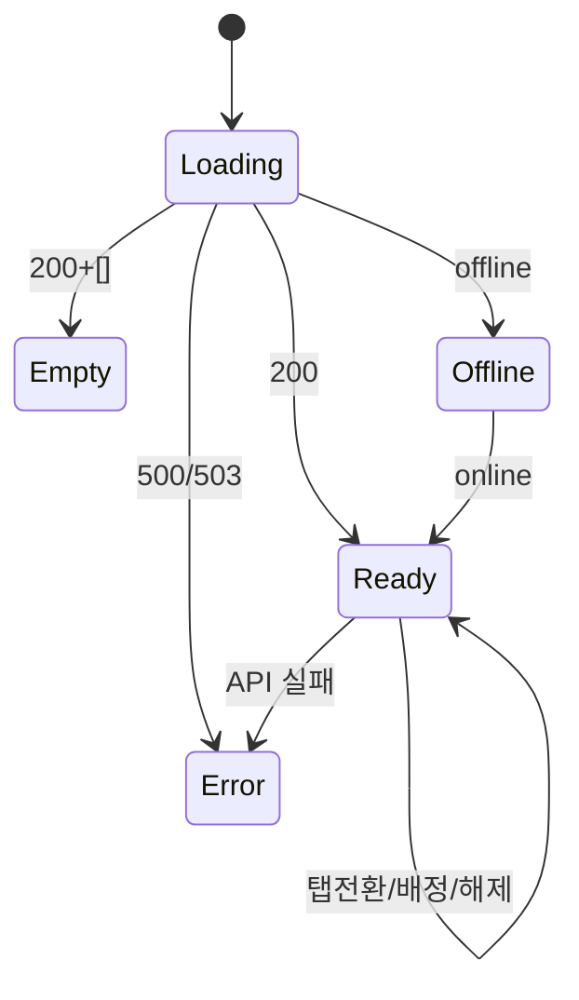

# SCR-051 사물함 배정 관리 — 기본화면 (마스터)

> 이 문서는 **화면 마스터 스펙**입니다. `01~05` 상태 문서는 이 문서를 상속(override/delta)합니다.
> 🔐 멀티테넌트: `branchId` 강제. 🏷️ 사물함 타입 3종: 일일/개인/골프.

---

## 0. 메타 & 원천 참조

| 항목 | 값 |
|------|----|
| 화면 ID | SCR-051 |
| 화면명 | 사물함 배정 관리 |
| 도메인 | D06-시설관리 |
| 경로 | `/locker/management` |
| Next.js Route Group | `(facilities)` |
| 파일 경로 | `src/app/(facilities)/locker/management/page.tsx` |
| 페이지 컴포넌트 | `LockerManagement` |
| 역할 | super/primary/owner/manager/staff (●), front (○), fc/trainer (—) |
| 우선순위 | P0 |
| 플랫폼 | 데스크톱(우선) / 태블릿 / 모바일 |
| 멀티테넌트 | ✅ `branchId` |

### 원천 문서 링크
| 문서 | 경로 | 섹션 |
|---|---|---|
| 화면설계서 | `docs/화면설계서/시설관리.md` | §SCR-051 |
| 기능명세서 | `docs/기능명세서/시설관리.md` | §2. 사물함 배정 관리 |
| 상태전이도 | `docs/상태전이도.md` | §7 락커 상태 |
| 에러코드 | `docs/에러코드정의서.md` | §4.7 시설/락커 |
| 다이어그램 | `docs/다이어그램/D06_시설관리/SCR-051_사물함배정관리/F1~F8*.md` | 진입~에러 |
| 권한매트릭스 | `docs/다이어그램/10_권한매트릭스/R1_역할화면_매트릭스.md` | `/locker/management` |

---

## 1. 화면 목적 (Why)

일일/개인/골프 사물함의 실시간 현황을 **그리드로 시각화**하고, 회원 검색 AutoComplete + 빈 락커 선택으로 배정한다.
- 추천 락커 자동 표시 (사용 가능 중 최소 번호)
- 만료 락커 일괄 해제
- 상태 동기화 (외부 IoT + DB 재동기)

---

## 2. 화면 레이아웃 (Wireframe)

### 2.1 풀뷰
```
┌ PageHeader ─────────────────────────────────────────────────────┐
│ 사물함 배정 관리                                                  │
│ "시설 내 일일/개인/골프 사물함의 이용 현황을 실시간으로 관리"    │
│                 [+ 락커추가][↗밴드/카드][🔄상태동기화][📥엑셀]  │
├──────────────────────────────────────────────────────────────────┤
│ StatCardGrid (5열)                                               │
│ [총사물함 N][사용가능 N][사용중 N][시간초과 N][상태비정상 N]    │
├──────────────────────────────────────────────────────────────────┤
│ [일일 사물함(N)] [개인 사물함(N)] [골프 사물함(N)]  탭           │
├──────────────────────────────────────────────────────────────────┤
│ ┌ 락커 배정 영역 ─────────────────────────────────────────────┐ │
│ │ 회원 검색*: [🔍 회원명/번호]  추천 락커: [N번]              │ │
│ │ 만료일: [2026-07-12]  [✅ 배정하기] (disabled:!canAssign)   │ │
│ └────────────────────────────────────────────────────────────┘ │
│ ┌ 사물함 그리드 ──────────────────────────────────────────────┐ │
│ │ [1][2][3][4][5][6][7][8][9][10]...                          │ │
│ └────────────────────────────────────────────────────────────┘ │
│ 만료 {N}건  [🗑 만료 락커 일괄 해제]                             │
└──────────────────────────────────────────────────────────────────┘
```

### 2.2 영역 그리드
| 영역 | 그리드 | 치수 |
|---|---|---|
| StatCardGrid | `grid-cols-2 md:grid-cols-5 gap-4` | 108px h |
| TabNav | `flex gap-2` | 48px h |
| AssignPanel | `grid-cols-1 md:grid-cols-2 gap-4` | 160px h |
| LockerGrid | `grid-cols-6 md:grid-cols-10 lg:grid-cols-14 gap-2` | 72x72 cell |

---

## 3. 디자인 토큰

### 3.1 색상 (셀)
| 상태 | 클래스 |
|---|---|
| available | `bg-surface border-line hover:border-primary hover:bg-primary/5 cursor-pointer` |
| in_use | `bg-state-info/10 border-state-info text-state-info cursor-pointer` |
| overtime | `bg-primary/10 border-primary text-primary cursor-pointer animate-pulse(AlertTriangle)` |
| abnormal | `bg-state-error/5 border-state-error text-state-error cursor-not-allowed` |
| disabled | `bg-surface-secondary grayscale opacity-50 cursor-not-allowed` |

### 3.2 타이포그래피
| 토큰 | 스타일 |
|---|---|
| page.title | `text-2xl font-bold text-gray-900` |
| stat.value | `text-3xl font-bold tabular-nums` |
| cell.number | `text-sm font-bold text-center` |
| success.msg | `text-state-success text-sm font-medium` (3초 후 페이드) |

### 3.3 간격/반경
- cell: `w-[72px] h-[72px] rounded-md border-2`
- panel: `rounded-xl p-6 bg-white`

---

## 4. 반응형

| BP | 그리드 | 카드 | 배정패널 |
|---|---|---|---|
| Mobile <640 | 6열 | 2열 | 1열 세로 |
| Tablet 640~1024 | 10열 | 3열 | 2열 |
| Desktop ≥1024 | 14열 | 5열 | 2열 |

---

## 5. 🔐 역할별(RBAC) 매트릭스

| 요소 | super/primary | owner | manager | fc | trainer | staff | front | readonly |
|---|:---:|:---:|:---:|:---:|:---:|:---:|:---:|:---:|
| 페이지 접근 | ● | ● | ● | — | — | ● | ○ | ○ |
| BranchSwitcher | ● | ●(다지점) | — | — | — | — | — | — |
| + 락커 추가 | ● | ● | ● | — | — | — | — | — |
| 밴드/카드 관리 링크 | ● | ● | ● | — | — | ● | — | — |
| 상태 동기화 | ● | ● | ● | — | — | ● | — | — |
| 엑셀 다운로드 | ● | ● | ● | — | — | ● | — | — |
| 탭 전환 (daily/personal/golf) | ● | ● | ● | — | — | ● | ○ | ○ |
| 회원 검색 + 배정 | ● | ● | ● | — | — | ● | — | — |
| 그리드 셀 클릭 | ● | ● | ● | — | — | ● | ○ | ○ |
| 만료 일괄 해제 | ● | ● | ● | — | — | ● | — | — |

---

## 6. 컴포넌트 트리

```tsx
<AppLayout role={user.role}>
  <main className="bg-gray-50 p-6 lg:p-8 space-y-6">
    <PageHeader title="사물함 배정 관리"
                description="시설 내 일일/개인/골프 사물함의 이용 현황을 실시간으로 관리합니다."
                actions={[...addLocker, linkRfid, syncStatus, exportExcel]}/>
    <StatCardGrid cols={5}>{/* 5 cards */}</StatCardGrid>
    <TabNav value={activeTab} tabs={[
      {key:'daily',label:`일일 사물함 (${dailyCount})`},
      {key:'personal',label:`개인 사물함 (${personalCount})`},
      {key:'golf',label:`골프 사물함 (${golfCount})`},
    ]}/>
    <AssignPanel
      memberSearch={...} onMemberChange={...}
      recommendedLocker={recommendedLocker}
      expiryDate={expiryDate} onExpiryChange={setExpiryDate}
      canAssign={!!selectedMember && !!selectedLockerId}
      onAssign={handleAssign}
      isSuccess={isAssignSuccess}
    />
    <LockerTypeGrid lockers={currentTabLockers}
                    selectedId={selectedLockerId}
                    onCellClick={handleCellClick}/>
    <BulkReleaseBar overtimeCount={overtimeCount}
                    onRelease={()=>setIsBulkDialogOpen(true)}/>
    {isBulkDialogOpen && <BulkReleaseConfirm onClose={close}/>}
    {isAddModalOpen && <AddLockerModal onClose={close}/>}
  </main>
</AppLayout>
```

### 컴포넌트 명세
| 컴포넌트 | 파일 | Props |
|---|---|---|
| `AssignPanel` | `src/components/facilities/AssignPanel.tsx` | `{memberSearch, onMemberChange, recommendedLocker, expiryDate, onExpiryChange, canAssign, onAssign, isSuccess}` |
| `LockerTypeGrid` | `src/components/facilities/LockerTypeGrid.tsx` | `{lockers, selectedId, onCellClick}` |
| `MemberAutoComplete` | `src/components/members/MemberAutoComplete.tsx` | `{value, onChange, members}` |
| `BulkReleaseBar` | `src/components/facilities/BulkReleaseBar.tsx` | `{overtimeCount, onRelease}` |
| `AddLockerModal` | `src/components/facilities/AddLockerModal.tsx` | `{onClose}` |

---

## 7. 데이터 계약

### 7.1 타입
```ts
export type LockerType = 'daily' | 'personal' | 'golf';
export type LockerStatus051 = 'available' | 'in_use' | 'overtime' | 'abnormal' | 'disabled';
export interface Locker {
  id: string;
  number: string;
  type: LockerType;
  status: LockerStatus051;
  gender?: 'M' | 'F';
  userName: string | null;
  expiryDate: string | null;
}
export interface Member {
  id: string;
  name: string;
  contact: string;
  memberNo: string;
}
```

### 7.2 API
| 엔드포인트 | 메서드 | 반환 |
|---|---|---|
| `GET /lockers?branchId&type` | GET | `Locker[]` |
| `GET /members?status=ACTIVE&branchId` | GET | `Member[]` |
| `POST /lockers/:id/assign` | POST | `Locker` |
| `POST /lockers/bulk-release-overtime` | POST | `{updated}` |
| `POST /lockers/sync` | POST | `{synced}` |
| `POST /lockers` | POST | `Locker` |

### 7.3 상태 매핑 (DB→UI)
- DB `MAINTENANCE` → `disabled`
- DB `AVAILABLE` → `available`
- DB `IN_USE` + 만료 경과 → `overtime`
- DB `IN_USE` → `in_use`

---

## 8. 비즈니스 룰

1. 추천 락커: `availableLockers.reduce(min by number)`
2. 배정 조건: `!!selectedMember && !!selectedLockerId` → `canAssign=true`
3. 기본 만료일: 오늘 + 3개월
4. 배정 성공 3초간 "배정 완료!" 메시지
5. 상태 동기화: IoT 하드웨어 ping + DB 재조회 + toast
6. 만료 일괄 해제: overtime 상태 전부 available로 변경 (회원 정보 초기화)
7. 중복 배정 방지: 같은 회원이 이미 해당 type에 배정 → toast "이미 배정된 사물함이 있습니다"

---

## 9. 상태 목록

| 파일 | 상태 코드 | 한글 | 트리거 |
|---|---|---|---|
| `01-로딩.md` | `locker-mgmt-loading` | 로딩 | 진입 |
| `02-정상-데이터있음.md` | `locker-mgmt-ready` | 정상 | 데이터 있음 |
| `03-빈상태.md` | `locker-mgmt-empty` | 빈 상태 | 전 타입 0건 |
| `04-에러.md` | `locker-mgmt-error` | 에러 | 500/503 |
| `05-오프라인.md` | `locker-mgmt-offline` | 오프라인 | navigator.offline |

---

## 10. 에러 코드 매핑

| errorCode | HTTP | 시나리오 |
|---|---|---|
| E404600 | 404 | 락커 없음 |
| E409600 | 409 | 중복 배정 |
| E409602 | 409 | 점검중 락커 배정 |
| E500001 | 500 | 서버 오류 |
| E503001 | 503 | 서비스 점검 |

---

## 11. 접근성

- `<main role="main" aria-label="사물함 배정 관리">`
- TabNav: `role="tablist"` + 탭 `aria-selected`
- 그리드 셀: `role="button" tabIndex={0}` + `aria-label`
- MemberAutoComplete: `role="combobox" aria-expanded`
- 포커스 링: `focus-visible:ring-2 ring-primary`
- 성공 메시지: `role="status" aria-live="polite"` 3초 표시 후 제거

---

## 12. 진입/이탈

### 진입
- 사이드바 "시설관리 > 사물함 배정"
- 락커관리(SCR-050)에서 "관리 전환" 링크 (옵션)

### 이탈
| 액션 | 목적지 |
|---|---|
| 밴드/카드 관리 링크 | `/rfid` (SCR-052) |
| 락커 추가 | 추가 모달 |
| 만료 일괄 해제 | ConfirmDialog |

---

## 13. 다이어그램 통합



---

## 14. 🧩 바이브코딩 프롬프트 (마스터)

```
Next.js 15 App Router + TypeScript + Tailwind + React Query + Supabase + react-hook-form + zod.
'use client' 컴포넌트를 작성하라.

━━ 화면: SCR-051 사물함 배정 관리 ━━
파일: src/app/(facilities)/locker/management/page.tsx
보조 파일:
- src/components/facilities/AssignPanel.tsx
- src/components/facilities/LockerTypeGrid.tsx
- src/components/facilities/BulkReleaseBar.tsx
- src/components/facilities/AddLockerModal.tsx
- src/components/members/MemberAutoComplete.tsx
- src/hooks/useLockerManagement.ts
- src/lib/role-access.ts

━━ 레이아웃 ━━
<AppLayout role={user.role}>
  <main className="bg-gray-50 p-6 lg:p-8 space-y-6">
    <PageHeader title="사물함 배정 관리"
                description="시설 내 일일/개인/골프 사물함의 이용 현황을 실시간으로 관리합니다."
                actions={[
                  canAddLocker && <Button onClick={openAdd}><Plus size={15}/>락커 추가</Button>,
                  <Button variant="ghost" onClick={()=>moveToPage('/rfid')}><ExternalLink size={15}/>밴드/카드 관리</Button>,
                  <Button variant="ghost" onClick={syncStatus}><RefreshCw size={15}/>상태 동기화</Button>,
                  <Button variant="ghost" onClick={exportExcel}><Download size={15}/>엑셀</Button>,
                ]}/>
    <StatCardGrid cols={5}>
      <StatCard label="총 사물함" value={total}/>
      <StatCard label="사용가능" value={availableCount} variant="mint"/>
      <StatCard label="사용중" value={inUseCount} variant="info"/>
      <StatCard label="시간초과" value={overtimeCount} variant="peach"/>
      <StatCard label="상태비정상" value={abnormalCount} variant="error"/>
    </StatCardGrid>
    <TabNav value={activeTab} onChange={setActiveTab} tabs={[
      {key:'daily',label:`일일 사물함 (${dailyCount})`},
      {key:'personal',label:`개인 사물함 (${personalCount})`},
      {key:'golf',label:`골프 사물함 (${golfCount})`},
    ]}/>
    <Panel>
      <header className="font-semibold text-base">락커 배정</header>
      <div className="grid grid-cols-1 md:grid-cols-2 gap-4">
        <div>
          <label>회원 검색 *</label>
          <MemberAutoComplete value={selectedMember} onChange={setSelectedMember} members={members}/>
        </div>
        <div>
          <label>추천 락커</label>
          <div className="font-mono text-primary text-lg">{recommendedLocker?.number ?? '사용 가능한 락커 없음'}</div>
        </div>
      </div>
      <div className="flex items-center gap-4">
        <label>만료일: <input type="date" value={expiryDate} onChange={e=>setExpiryDate(e.target.value)}/></label>
        <Button variant="primary" size="lg" disabled={!canAssign} onClick={handleAssign}>
          <CheckSquare size={16}/> 배정하기
        </Button>
        {isAssignSuccess && <span role="status" className="text-state-success">✅ 배정 완료!</span>}
      </div>
    </Panel>
    <Panel>
      <header className="font-semibold text-base">사물함 그리드</header>
      <LockerTypeGrid lockers={currentTabLockers} selectedId={selectedLockerId} onCellClick={handleCellClick}/>
    </Panel>
    <BulkReleaseBar overtimeCount={overtimeCount} onRelease={()=>setIsBulkDialogOpen(true)}/>
    {isBulkDialogOpen && <ConfirmDialog
      title="만료 락커 일괄 해제"
      description={`만료된 ${overtimeCount}개 락커를 일괄 해제합니다. 배정된 회원 정보가 초기화됩니다.`}
      variant="danger" confirmLabel={`${overtimeCount}개 해제`}
      onConfirm={handleBulkRelease} onClose={()=>setIsBulkDialogOpen(false)}/>}
    {isAddModalOpen && <AddLockerModal onClose={()=>setIsAddModalOpen(false)}/>}
  </main>
</AppLayout>

━━ 디자인 토큰 ━━
cell.available: bg-surface border-line hover:border-primary hover:bg-primary/5 cursor-pointer
cell.in_use:    bg-state-info/10 border-state-info text-state-info cursor-pointer
cell.overtime:  bg-primary/10 border-primary text-primary cursor-pointer + <AlertTriangle className="animate-pulse"/>
cell.abnormal:  bg-state-error/5 border-state-error text-state-error cursor-not-allowed + <XCircle/>
cell.disabled:  bg-surface-secondary grayscale opacity-50 cursor-not-allowed
cell.size:      w-[72px] h-[72px] rounded-md border-2
btn.primary:    bg-primary hover:bg-primary/90 text-white

━━ 데이터 훅 ━━
useLockerManagement(branchId, activeTab) → {
  dailyLockers, personalLockers, golfLockers,
  members, isLoading, isError,
  assign(memberId, lockerId, expiryDate),
  bulkReleaseOvertime(),
  syncStatus(),
  addLocker(number, zone)
}

━━ 인터랙션 ━━
- MemberAutoComplete: 이름/연락처/회원번호 검색, onBlur 150ms 딜레이
- 추천 락커: availableLockers 최소 번호 자동 선택
- 빈 셀 클릭: setSelectedLockerId(id)
- 배정: handleAssign() → POST /lockers/:id/assign → isAssignSuccess=true 3초간 메시지
- 만료 일괄 해제: ConfirmDialog → POST bulk-release-overtime
- 상태 동기화: syncStatus() + toast "락커 상태를 동기화했습니다."
- 락커 추가: AddLockerModal (번호/구역 입력)

━━ 토스트 메시지 ━━
- 상태 동기화 성공: "락커 상태를 동기화했습니다."
- 락커 추가: `락커 ${N}번이 추가되었습니다.`
- 엑셀 다운로드: "엑셀 다운로드가 완료되었습니다."
- 데이터 로드 실패: "락커 데이터를 불러오지 못했습니다."
- 락커 번호 미입력: "락커 번호를 입력해주세요."

━━ 반응형 ━━
모바일: 그리드 6열, 카드 2열, 탭 가로 스크롤
태블릿: 그리드 10열, 카드 3열
데스크톱: 그리드 14열, 카드 5열

━━ 접근성 ━━
- TabNav: role="tablist"
- 셀: role="button" tabIndex=0 aria-label="{N}번 사물함 {status}"
- MemberAutoComplete: role="combobox" aria-expanded
- 성공 메시지: role="status" aria-live="polite"
```

---

## 15. QA 체크리스트

- [ ] `/locker/management` 진입 시 로딩 → 정상
- [ ] 탭 3종 전환 시 해당 타입 락커만 표시
- [ ] 회원 AutoComplete 이름/전화/회원번호 검색
- [ ] 추천 락커 자동 표시 (최소 번호)
- [ ] 빈 셀 클릭 → 선택 시각화 (파란 링)
- [ ] 배정 조건 충족 시 버튼 활성
- [ ] 배정 성공: 3초간 "✅ 배정 완료!" + DB 상태 변경
- [ ] 만료 일괄 해제: ConfirmDialog → 전 overtime → available
- [ ] 상태 동기화: refetch + toast
- [ ] 락커 추가 (manager+): 번호/구역 입력 → 등록
- [ ] 엑셀 다운로드 toast
- [ ] overtime 셀 AlertTriangle 펄스 애니메이션
- [ ] abnormal 셀 XCircle + cursor-not-allowed
- [ ] fc/trainer 접근 차단 (/forbidden)
- [ ] front 읽기 전용
- [ ] 키보드 Tab 순서: 검색 → 만료일 → 배정 → 셀들
- [ ] 모바일: 그리드 6열, 탭 가로 스크롤
- [ ] reduced-motion: 펄스 애니메이션 제거
