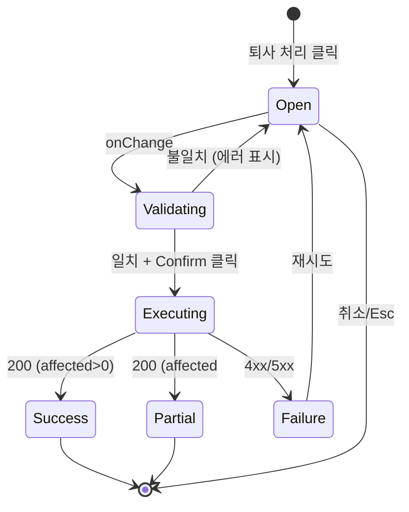

# DLG-060-001 퇴사처리확인 — 기본화면 (마스터)

> 이 문서는 **다이얼로그 마스터 스펙**입니다. `01~03` 상태 문서는 이 문서를 상속(override/delta)합니다.
> 상태별 파일은 "변경점(델타)만" 기술하며, 이 문서에 정의된 레이아웃/토큰/컴포넌트/데이터/권한/접근성은 **기본값**으로 적용됩니다.

---

## 0. 메타 & 원천 참조

| 항목 | 값 |
|------|----|
| 다이얼로그 ID | DLG-060-001 |
| 다이얼로그명 | 직원 퇴사 처리 확인 |
| 도메인 | D07-직원관리 |
| 트리거 화면 | SCR-060 직원 목록 (`/staff`) |
| 컴포넌트 | `ConfirmDialog` (variant="danger") |
| 파일 경로 | `src/components/staff/ResignConfirmDialog.tsx` |
| 역할 | `superAdmin`(=primary) / `owner` |
| 우선순위 | P0 (필수, 위험 액션 확인 게이트) |
| 확정 타이핑 | `"퇴사처리"` (한글 정확 일치) |
| 파괴성 | **비가역(계정 비활성)** — 복구는 관리자 수동 |

### 원천 문서 링크
| 문서 | 경로 | 섹션 |
|---|---|---|
| 화면설계서 | `docs/화면설계서/직원관리.md` | §9.DLG-060-001 |
| 기능명세서 | `docs/기능명세서/직원관리.md` | §1.G.G-1 퇴사 처리 확인 |
| 에러코드 | `docs/에러코드정의서.md` | §4.3 직원(E400200~E409200) |
| 상태전이도 | `docs/상태전이도.md` | staffStatus ACTIVE → RESIGNED |
| 다이어그램 M1 | `docs/다이어그램/D07_직원관리/DLG/DLG-060-001/M1_모달생명주기.md` | open → validate → confirm/close |
| 다이어그램 M2 | `docs/다이어그램/D07_직원관리/DLG/DLG-060-001/M2_필드검증.md` | confirmText === "퇴사처리" |
| 다이어그램 M3 | `docs/다이어그램/D07_직원관리/DLG/DLG-060-001/M3_결과분기.md` | success / fail / partial |
| 권한 매트릭스 | `docs/다이어그램/10_권한매트릭스/R1_역할화면_매트릭스.md` | R1 Staff 섹션 |

---

## 1. 다이얼로그 목적 (Why)

SCR-060에서 선택된 N명의 직원에 대해 **계정 비활성(staffStatus=RESIGNED)** 을 적용하기 직전, 파괴적 액션을 막기 위한 **명시 확인 게이트**. 다음 두 가드를 동시에 통과해야 실제 업데이트가 실행된다.

1. **텍스트 타이핑 확인**: `"퇴사처리"` 정확 일치
2. **권한 확인**: `role ∈ {superAdmin, owner}`

추가로 대상 직원 목록·경고 문구·비가역성 안내를 같은 모달에 노출해 실수를 줄인다.

---

## 2. 레이아웃 (Wireframe)

### 2.1 풀뷰 와이어프레임

```
┌──────────── Overlay (bg-black/40 backdrop-blur-sm) ───────────┐
│                                                                │
│          ┌──────────────────────────────────────────┐          │
│          │  ⚠  퇴사 처리                       [×]   │ Header │
│          │  선택하신 {N}명을 퇴사 처리합니다.          │        │
│          ├──────────────────────────────────────────┤          │
│          │ ┌──────────────────────────────────────┐ │          │
│          │ │ 📋 대상 직원 (N명)                    │ │ Target │
│          │ │ · 홍길동 (트레이너)                   │ │ list   │
│          │ │ · 김민수 (FC)                         │ │        │
│          │ │ · 박지훈 (매니저)                     │ │        │
│          │ └──────────────────────────────────────┘ │          │
│          │                                            │          │
│          │ 확인을 위해 "퇴사처리"를 입력하세요.        │ Confirm│
│          │ ┌──────────────────────────────────────┐ │          │
│          │ │ 퇴사처리                             │ │ input  │
│          │ └──────────────────────────────────────┘ │          │
│          │  ⚠ 처리 후 해당 계정은 즉시 비활성됩니다.   │          │
│          ├──────────────────────────────────────────┤          │
│          │                    [취소]  [퇴사 처리]     │ Footer │
│          └──────────────────────────────────────────┘          │
└────────────────────────────────────────────────────────────────┘
```

### 2.2 영역별 치수 / 역할 표

| 영역 | 위치 | 치수 | 역할 |
|---|---|---|---|
| Overlay | fixed inset-0 | `bg-black/40 backdrop-blur-sm` | 포커스 트랩 |
| Modal Card | center | `max-w-md w-full` (480px) | 컨테이너 |
| Header | top | `px-6 py-4` + 아이콘 `AlertTriangle` | 제목·경고 |
| Target List | body | `max-h-40 overflow-y-auto rounded-lg bg-red-50 p-3` | 대상 요약 |
| Confirm Input | body | `h-10 w-full` | 확정 타이핑 |
| Hint Error | below input | `text-xs text-red-600` | 불일치 시 표시 |
| Footer | bottom | `px-6 py-4 flex justify-end gap-3` | 취소/확정 |

---

## 3. 디자인 토큰

### 3.1 색상
| 토큰 | 클래스 | 용도 |
|---|---|---|
| overlay | `fixed inset-0 bg-black/40 backdrop-blur-sm z-40` | 배경 |
| modal.card | `bg-white rounded-2xl shadow-xl ring-1 ring-gray-100` | 카드 |
| header.danger.icon | `text-red-600` | AlertTriangle |
| header.title | `text-lg font-semibold text-gray-900` | 제목 |
| target.bg | `bg-red-50 border border-red-200 rounded-lg` | 대상 목록 배경 |
| target.row | `text-sm text-gray-700` | 행 |
| input.default | `h-10 w-full rounded-lg border border-gray-300 px-3 text-sm` | 입력 |
| input.focus | `focus:ring-2 focus:ring-red-500 focus:border-red-500 focus:outline-none` | 포커스(danger) |
| input.error | `border-red-300` | 불일치 |
| hint.error | `text-xs text-red-600` | 안내 에러 |
| btn.cancel | `border border-gray-300 bg-white text-gray-700 hover:bg-gray-50` | 취소 |
| btn.danger | `bg-red-600 hover:bg-red-700 active:bg-red-800 text-white disabled:bg-red-300 disabled:cursor-not-allowed` | 확정 |

### 3.2 타이포 / 간격 / 모션
| 토큰 | 값 |
|---|---|
| title | `text-lg/6 font-semibold` |
| desc | `text-sm/5 text-gray-600` |
| label | `text-sm/5 font-medium text-gray-700` |
| input | `text-sm/5 text-gray-900 placeholder-gray-400` |
| spacing.body | `space-y-4 p-6` |
| radius.card | `rounded-2xl` |
| motion.enter | `animate-[fadeInScale_150ms_ease-out]` |
| focus.ring | `focus-visible:ring-2 focus-visible:ring-red-500 focus-visible:ring-offset-2` |

---

## 4. 반응형 규칙

| 브레이크포인트 | 폭 | 특이사항 |
|---|---|---|
| Mobile <640 | `w-[calc(100vw-2rem)] max-w-md` | 좌우 16px 여백, 버튼 stack 허용 |
| Tablet/Desktop ≥640 | `max-w-md` | 중앙 정렬, 버튼 가로 배치 |

소프트 키보드 오픈 시: 모달을 뷰포트 상단에 고정 (`justify-start pt-[10vh]`).

---

## 5. 🔐 역할별(RBAC) 매트릭스

| 역할 | 모달 오픈 | 대상 목록 조회 | 확정 타이핑 | 퇴사 처리 실행 | 비고 |
|------|:-:|:-:|:-:|:-:|---|
| superAdmin | ● | ● (전 지점) | ● | ● | 본사 감사 전용 |
| owner | ● | ● (본 지점) | ● | ● | **표준 처리자** |
| manager | — | — | — | — | 퇴사 처리 버튼 자체 hidden |
| fc | — | — | — | — | 동일 |
| trainer | — | — | — | — | 동일 |
| staff | — | — | — | — | 동일 |
| front | — | — | — | — | 동일 |
| readonly | — | — | — | — | 동일 |

● 가능 / ○ 조건부 / — 불가

우회 시도(직접 API 호출) 차단: RLS + 서버 사이드 `role` 검증 필수.

---

## 6. 컴포넌트 트리

```
<ResignConfirmDialog>                       src/components/staff/ResignConfirmDialog.tsx
  <Dialog open={open} onOpenChange={onClose}>
    <DialogOverlay />
    <DialogContent variant="danger" size="md">
      <DialogHeader>
        <DangerIcon />                      <AlertTriangle className="text-red-600" />
        <DialogTitle>퇴사 처리</DialogTitle>
        <DialogDescription>
          선택하신 {targets.length}명을 퇴사 처리합니다.
        </DialogDescription>
      </DialogHeader>
      <div className="space-y-4 p-6">
        <TargetList items={targets} />
        <ConfirmTextInput
          expected="퇴사처리"
          value={confirmText}
          onChange={setConfirmText}
          error={confirmError}
          autoFocus
        />
        <IrreversibleNotice>
          ⚠ 처리 후 해당 계정은 즉시 비활성됩니다. 복구는 관리자 문의가 필요합니다.
        </IrreversibleNotice>
      </div>
      <DialogFooter>
        <Button variant="outline" onClick={onClose}>취소</Button>
        <Button
          variant="danger"
          disabled={!isValid || isProcessing}
          onClick={handleConfirm}
          loading={isProcessing}
        >
          {isProcessing ? '처리 중...' : '퇴사 처리'}
        </Button>
      </DialogFooter>
    </DialogContent>
  </Dialog>
</ResignConfirmDialog>
```

### 컴포넌트 명세
| 컴포넌트 | Props | 재사용 |
|---|---|---|
| `Dialog` / `DialogContent` | `open, onOpenChange, variant, size` | 전역 (`src/components/ui/Dialog.tsx`) |
| `TargetList` | `items: {id, name, role}[]` | DLG-060 전용 |
| `ConfirmTextInput` | `expected, value, onChange, error` | 파괴 액션 공용 |
| `IrreversibleNotice` | 없음 | 파괴 액션 공용 |

---

## 7. 데이터 계약

### 7.1 Props
```ts
// src/components/staff/ResignConfirmDialog.tsx
export interface ResignTarget {
  id: number;
  name: string;
  role: 'owner'|'manager'|'fc'|'trainer'|'staff'|'front';
  position?: string | null;
}

export interface ResignConfirmDialogProps {
  open: boolean;
  onClose: () => void;
  targets: ResignTarget[];              // SCR-060 selectedRows 매핑
  onSuccess?: (affected: number) => void;
  onError?: (code: string, message: string) => void;
}
```

### 7.2 API 계약
| 항목 | 값 |
|---|---|
| 메서드 | `PATCH` (Supabase `update().in('id', ids)`) |
| 테이블 | `staff` |
| 페이로드 | `{ isActive: false, staffStatus: 'RESIGNED', resignedAt: new Date().toISOString() }` |
| 필터 | `.in('id', ids).eq('branchId', getBranchId())` |
| 성공(200) | `{ success: true, data: { affected: number } }` |
| 실패(404) | `{ success: false, errorCode: 'E404200', message: '직원을 찾을 수 없습니다' }` |
| 실패(409) | `{ success: false, errorCode: 'E409200', message: '이미 퇴사 처리된 직원입니다' }` |
| 실패(403) | `{ success: false, errorCode: 'E403001', message: '권한이 없습니다' }` |
| 실패(500) | `{ success: false, errorCode: 'E500001', message: '서버 오류' }` |

### 7.3 상태 관리
- **Local state**: `confirmText: string`, `confirmError: string|null`, `isProcessing: boolean`
- **파생값**: `isValid = confirmText.trim() === '퇴사처리' && targets.length > 0`
- **Invalidate**: 성공 시 `queryClient.invalidateQueries(['staff', branchId])` + 선택 리셋

---

## 8. 비즈니스 룰

1. **타이핑 가드**: `confirmText.trim() === '퇴사처리'` 만 통과. 공백·영문·부분 일치 모두 거부.
2. **이중 제출 방지**: `isProcessing=true` 동안 버튼 `disabled`, Enter 키 무시.
3. **중복 퇴사 검증**: 대상 중 `staffStatus === 'RESIGNED'` 가 1명이라도 있으면 모달 오픈 전에 차단 (`toast.error("이미 퇴사 처리된 직원이 포함되어 있습니다")`).
4. **권한 재검증**: 서버에서 `role ∈ {superAdmin, owner}` + `branchId` 일치 확인. 미통과 시 E403001.
5. **부분 실패**: `in().update()` 결과 `affected < targets.length` 일 때 `toast.warning(`${affected}/${targets.length}명 처리`)`로 명시.
6. **감사 로그**: 성공 시 `AUDIT.STAFF_RESIGN`(ids, actor, branchId) 기록.
7. **세션 만료**: 401 수신 시 DLG-000 세션만료 다이얼로그로 위임.
8. **ESC/Overlay Click**: 정상 닫힘(단, `isProcessing=true` 동안은 무시).

---

## 9. 상태 목록

| 파일 | 상태 코드 | 한글 | 트리거 |
|---|---|---|---|
| `01-모달오픈.md` | `dlg-resign-open` | 모달 오픈 (기본) | SCR-060 `08-선택있음` + 퇴사 처리 버튼 클릭 |
| `02-검증.md` | `dlg-resign-validating` | 타이핑 검증 중 | 입력값 onChange/onBlur |
| `03-결과분기.md` | `dlg-resign-result` | 실행 결과 분기 | onClick Confirm → API 응답 |

상태 전이 그래프: `docs/다이어그램/D07_직원관리/DLG/DLG-060-001/M1_모달생명주기.md` 참조.

---

## 10. 에러 코드 매핑

| errorCode | HTTP | 사용자 메시지 | UI 반응 |
|---|---|---|---|
| E400200 | 400 | 필수 직원 정보를 입력해주세요 | `toast.error` + 모달 유지 |
| E403001 | 403 | 권한이 없습니다 | `toast.error` + 모달 강제 닫힘 |
| E404200 | 404 | 직원을 찾을 수 없습니다 | `toast.error` + 대상 목록 재조회 |
| E409200 | 409 | 이미 퇴사 처리된 직원입니다 | `toast.error` + 해당 id 제외 후 재시도 안내 |
| E500001 | 500 | 서버 오류가 발생했습니다 | `toast.error` + 재시도 가능 상태 유지 |
| NETWORK | — | 네트워크 연결을 확인해주세요 | `toast.error` + `isProcessing=false` |

---

## 11. 접근성 (WCAG 2.1 AA)

| 항목 | 요구사항 |
|---|---|
| 역할 | `role="alertdialog"` + `aria-modal="true"` + `aria-labelledby` + `aria-describedby` |
| 포커스 | 오픈 시 확인 입력 필드로 이동, 닫힘 시 트리거(퇴사 처리 버튼)로 복귀 |
| 키보드 | `Tab` 트랩, `Esc` 닫기, `Enter` 유효 시 확정, 유효 아닐 때 무시 |
| 라이브 영역 | 에러 메시지 `role="alert" aria-live="assertive"` |
| 대비비율 | 본문 4.5:1, danger 버튼 4.5:1 |
| 모션 감소 | `prefers-reduced-motion` 시 enter 애니메이션 제거 |

---

## 12. 진입/이탈 연결

### 진입
- SCR-060 `08-선택있음` + "퇴사 처리" 버튼 클릭
- 키보드 단축: 선택 행 있을 때 `Shift+Delete`(선택)

### 이탈
| 액션 | 목적지 |
|---|---|
| 취소 / Esc / Overlay click | SCR-060 `08-선택있음` (선택 유지) |
| 성공 | SCR-060 `02-정상-데이터있음` (새로고침 + 선택 초기화 + 성공 토스트) |
| 403 | SCR-060 + `toast.error` |
| 500 | 모달 유지 (재시도 가능) |

---

## 13. 다이어그램 통합 뷰



---

## 14. 바이브코딩 프롬프트 (마스터)

```
Next.js 15 App Router + TypeScript + Tailwind + Supabase + React Query 기반
'use client' 컴포넌트를 작성하라.

━━ 다이얼로그: DLG-060-001 퇴사처리확인 (마스터) ━━
파일: src/components/staff/ResignConfirmDialog.tsx

━━ Props ━━
{
  open: boolean,
  onClose: () => void,
  targets: { id:number, name:string, role:string, position?:string|null }[],
  onSuccess?: (affected:number) => void,
  onError?: (code:string, message:string) => void,
}

━━ 레이아웃 ━━
- Radix Dialog 기반
- Overlay: fixed inset-0 bg-black/40 backdrop-blur-sm z-40
- Content: fixed left-1/2 top-1/2 -translate-x-1/2 -translate-y-1/2
           w-[calc(100vw-2rem)] max-w-md bg-white rounded-2xl shadow-xl
           ring-1 ring-gray-100 z-50 animate-[fadeInScale_150ms_ease-out]
- Header: px-6 pt-6 pb-2 flex items-start gap-3
    <AlertTriangle className="mt-0.5 h-5 w-5 text-red-600" />
    <div>
      <h2 className="text-lg/6 font-semibold text-gray-900">퇴사 처리</h2>
      <p className="mt-1 text-sm text-gray-600">선택하신 {targets.length}명을 퇴사 처리합니다.</p>
    </div>
- Body: px-6 py-4 space-y-4
  1) TargetList:
     <ul className="max-h-40 overflow-y-auto rounded-lg bg-red-50 border border-red-200 p-3 space-y-1">
       {targets.map(t => <li key={t.id} className="text-sm text-gray-700">· {t.name} ({ROLE_LABEL[t.role]})</li>)}
     </ul>
  2) Confirm Input:
     <label className="block text-sm font-medium text-gray-700">
       확인을 위해 <strong className="text-red-600">"퇴사처리"</strong>를 입력하세요.
     </label>
     <input
       type="text"
       autoFocus
       value={confirmText}
       onChange={(e)=>{ setConfirmText(e.target.value); setConfirmError(null); }}
       className="mt-1 h-10 w-full rounded-lg border border-gray-300 px-3 text-sm
                  focus:outline-none focus:ring-2 focus:ring-red-500 focus:border-red-500
                  aria-invalid:border-red-300"
       aria-invalid={!!confirmError}
       aria-describedby="resign-hint"
     />
     {confirmError && <p id="resign-hint" role="alert" className="mt-1 text-xs text-red-600">{confirmError}</p>}
  3) IrreversibleNotice:
     <p className="text-xs text-gray-500">⚠ 처리 후 해당 계정은 즉시 비활성됩니다. 복구는 관리자 문의가 필요합니다.</p>
- Footer: px-6 pb-6 flex justify-end gap-3
    <Button variant="outline" onClick={onClose} disabled={isProcessing}>취소</Button>
    <Button
      variant="danger"
      disabled={!isValid || isProcessing}
      loading={isProcessing}
      onClick={handleConfirm}>
      {isProcessing ? '처리 중...' : '퇴사 처리'}
    </Button>

━━ 디자인 토큰 ━━
overlay:      fixed inset-0 bg-black/40 backdrop-blur-sm z-40
card:         bg-white rounded-2xl shadow-xl ring-1 ring-gray-100
title:        text-lg/6 font-semibold text-gray-900
desc:         text-sm text-gray-600
target.bg:    bg-red-50 border border-red-200 rounded-lg
input:        h-10 w-full rounded-lg border border-gray-300 px-3 text-sm
input.focus:  focus:ring-2 focus:ring-red-500 focus:border-red-500
btn.danger:   h-10 rounded-lg bg-red-600 hover:bg-red-700 active:bg-red-800
              text-white disabled:bg-red-300 disabled:cursor-not-allowed
btn.outline:  h-10 rounded-lg border border-gray-300 bg-white text-gray-700
              hover:bg-gray-50

━━ 로직 ━━
const [confirmText, setConfirmText] = useState('');
const [confirmError, setConfirmError] = useState<string|null>(null);
const isValid = confirmText.trim() === '퇴사처리' && targets.length > 0;

const mutation = useMutation({
  mutationFn: async () => {
    const ids = targets.map(t => t.id);
    const { data, error, count } = await supabase
      .from('staff')
      .update({ isActive: false, staffStatus: 'RESIGNED', resignedAt: new Date().toISOString() }, { count: 'exact' })
      .in('id', ids)
      .eq('branchId', getBranchId())
      .select('id');
    if (error) throw error;
    return { affected: count ?? data?.length ?? 0 };
  },
  onSuccess: ({ affected }) => {
    queryClient.invalidateQueries({ queryKey: ['staff', getBranchId()] });
    if (affected === targets.length) toast.success(`${affected}명의 퇴사 처리가 완료되었습니다.`);
    else toast.warning(`${affected}/${targets.length}명 처리. 일부 실패`);
    onSuccess?.(affected);
    onClose();
  },
  onError: (err:any) => {
    const code = mapSupabaseError(err);
    toast.error(ERROR_MESSAGE[code] ?? '퇴사 처리에 실패했습니다.');
    onError?.(code, err.message);
  },
});

const handleConfirm = () => {
  if (!isValid) { setConfirmError('"퇴사처리"를 정확히 입력하세요'); return; }
  mutation.mutate();
};

━━ 인터랙션 ━━
- Esc/Overlay click: onClose() (단, mutation.isPending이면 무시)
- Enter: isValid && !isPending 시 handleConfirm()
- 입력 변경 시 confirmError 초기화

━━ 접근성 ━━
- DialogContent role="alertdialog" aria-modal="true"
- aria-labelledby, aria-describedby 연결
- autoFocus=input, close → trigger button 포커스 복귀(Radix 기본)
- 에러: role="alert" aria-live="assertive"
- prefers-reduced-motion:reduce → 애니메이션 제거

━━ 의존 ━━
import { Dialog, DialogOverlay, DialogContent, DialogHeader, DialogTitle,
         DialogDescription, DialogFooter } from '@/components/ui/Dialog'
import { AlertTriangle } from 'lucide-react'
import { Button } from '@/components/ui/Button'
import { supabase } from '@/lib/supabase'
import { getBranchId } from '@/lib/tenant'
import { useMutation, useQueryClient } from '@tanstack/react-query'
import { toast } from 'sonner'
import { ROLE_LABEL, ERROR_MESSAGE, mapSupabaseError } from '@/constants'

━━ QA ━━
- manager/fc/trainer/staff/front/readonly 는 트리거 버튼이 없어 도달 불가
- 대상 N명 목록 노출 + N=1도 동일 UI
- "퇴사처리" 정확 일치만 통과 (공백/영문/부분 거부)
- 부분 실패 시 warning 토스트로 구분
- 409(중복 퇴사) 시 안내 후 목록 재조회 유도
```

---

## 15. QA 체크리스트

- [ ] superAdmin/owner 외 역할에서 트리거 버튼이 hidden (도달 불가)
- [ ] 대상 1명/5명 모두 UI 깨지지 않음 (max-h-40 스크롤)
- [ ] "퇴사처리" 정확 일치만 버튼 활성
- [ ] 공백/영문/부분 입력 거부
- [ ] 확정 중 이중 클릭 방지 (disabled + loading)
- [ ] 성공: invalidate + 선택 초기화 + 성공 토스트
- [ ] 부분 성공: warning 토스트로 명시
- [ ] 409 수신 시 안내 + 리스트 재조회
- [ ] 403 수신 시 강제 닫힘 + 에러 토스트
- [ ] 500/Network 시 재시도 가능
- [ ] Esc/Overlay click 닫힘 (단, 처리 중은 무시)
- [ ] Tab 트랩 + 오픈 시 입력 필드 포커스
- [ ] 스크린리더로 경고/에러 즉시 공지
