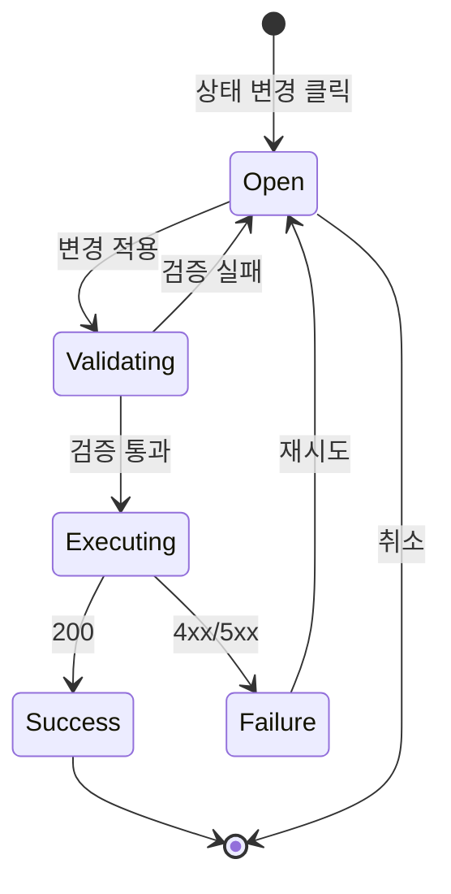

# DLG-060-002 상태 변경 — 기본화면 (마스터)

> 이 문서는 **다이얼로그 마스터 스펙**입니다. `01~03` 상태 문서는 이 문서를 상속(override/delta)합니다.

---

## 0. 메타 & 원천 참조

| 항목 | 값 |
|---|---|
| 다이얼로그 ID | DLG-060-002 |
| 다이얼로그명 | 직원 상태 변경 |
| 도메인 | D07-직원관리 |
| 트리거 화면 | SCR-060 (`/staff`) |
| 컴포넌트 | `StatusChangeDialog` (variant="primary") |
| 파일 경로 | `src/components/staff/StatusChangeDialog.tsx` |
| 역할 | `superAdmin` / `owner` (표준), `manager` (부분) |
| 우선순위 | P0 |
| 취급 상태 | `ACTIVE`, `ON_LEAVE`, `TRANSFERRED`, `LOCKED` — **RESIGNED 제외** |

### 원천 문서
| 문서 | 경로 | 섹션 |
|---|---|---|
| 화면설계서 | `docs/화면설계서/직원관리.md` | §9.DLG-060-002 상태 변경 |
| 기능명세서 | `docs/기능명세서/직원관리.md` | §1.G.G-2 상태 변경 |
| 상태전이도 | `docs/상태전이도.md` | staffStatus 전이 매트릭스 |
| 에러코드 | `docs/에러코드정의서.md` | §4.3 직원(E400200~E409200) |
| 다이어그램 M1~M3 | `docs/다이어그램/D07_직원관리/DLG/DLG-060-002/` | 모달 생명주기·검증·결과 |
| 권한 매트릭스 | `docs/다이어그램/10_권한매트릭스/R1_역할화면_매트릭스.md` | R1 Staff |

---

## 1. 목적

선택된 직원 N명의 `staffStatus`를 재직·휴직·전보·잠금 중 하나로 변경한다. **RESIGNED(퇴사)** 는 DLG-060-001 전용이므로 옵션에서 제외한다. 휴직·전보는 사유 텍스트 + 기간(휴직) 입력을 필수로 한다.

---

## 2. 레이아웃 (Wireframe)

```
┌──────── Modal (max-w-md) ──────────────────────────┐
│ 🔄 직원 상태 변경                           [×]     │
│ 선택된 직원 {N}명의 상태를 변경합니다.              │
├────────────────────────────────────────────────────┤
│ [단일 선택 시] 현재 상태: [StatusBadge 재직]        │
│                                                    │
│ 변경할 상태                                         │
│ ┌─────────────────────────────────────────────┐    │
│ │ ( ) [재직]      정상 근무 중                 │    │
│ │ (●) [휴직]      휴직 중 (사유+기간 필수)      │    │
│ │ ( ) [전보]      다른 지점으로 이동 (사유 필수)│    │
│ │ ( ) [잠금]      일시적 접근 차단              │    │
│ └─────────────────────────────────────────────┘    │
│                                                    │
│ [휴직 선택 시]                                      │
│ ┌────── 휴직 시작일* ┐ ┌── 휴직 종료일* ──┐         │
│ │ 📅 2026-05-01      │ │ 📅 2026-08-01    │         │
│ └────────────────────┘ └──────────────────┘         │
│                                                    │
│ [ON_LEAVE/TRANSFERRED 선택 시] 사유 *                │
│ ┌─────────────────────────────────────────────┐    │
│ │ 휴직 사유를 입력하세요 (최소 5자)            │    │
│ └─────────────────────────────────────────────┘    │
├────────────────────────────────────────────────────┤
│                          [취소]  [변경 적용]        │
└────────────────────────────────────────────────────┘
```

### 치수
| 영역 | 치수 |
|---|---|
| Modal | `max-w-md w-full` |
| Radio Group | `grid gap-2` 각 카드 `rounded-lg border p-3` |
| 사유 Textarea | `min-h-[80px] w-full` |
| DateRange | `grid grid-cols-2 gap-3` |

---

## 3. 디자인 토큰

| 토큰 | 클래스 | 용도 |
|---|---|---|
| radio.card | `rounded-lg border border-gray-200 p-3 cursor-pointer hover:border-gray-300` | 기본 |
| radio.card.active | `border-blue-500 bg-blue-50` | 선택됨 |
| radio.input | `size-4 text-blue-600 focus:ring-blue-500` | 라디오 |
| label.req | `text-red-500 after:content-['*']` | 필수 표시 |
| textarea | `min-h-[80px] w-full rounded-lg border border-gray-300 p-3 text-sm focus:ring-2 focus:ring-blue-500` | 사유 |
| btn.primary | `bg-blue-600 hover:bg-blue-700 text-white` | 변경 적용 |
| status.badge | `StatusBadge` 컴포넌트 | 현재/예비 상태 |

---

## 4. 🔐 RBAC 매트릭스

| 역할 | 모달 오픈 | ACTIVE | ON_LEAVE | TRANSFERRED | LOCKED |
|---|:-:|:-:|:-:|:-:|:-:|
| superAdmin | ● | ● | ● | ● (cross-branch) | ● |
| owner | ● | ● | ● | ● (out-going) | ● |
| manager | ● | ● | ● | — | — |
| fc / trainer / staff / front / readonly | — | — | — | — | — |

- TRANSFERRED: `owner` 는 자 지점에서 **내보내기**만 가능. 받는 지점은 본사 승인(별도 플로우).
- LOCKED: 관리자 긴급 차단용. 해제는 superAdmin/owner만.

---

## 5. 컴포넌트 트리

```
<StatusChangeDialog>                src/components/staff/StatusChangeDialog.tsx
  <Dialog open onOpenChange>
    <DialogContent size="md">
      <DialogHeader>
        <RefreshCw /> <DialogTitle>직원 상태 변경</DialogTitle>
        <DialogDescription>선택된 직원 {N}명의 상태를 변경합니다.</DialogDescription>
      </DialogHeader>
      <Body>
        {N === 1 && <CurrentStatusBadge status={currentStatus} />}
        <RadioGroup
          value={selectedStatus}
          onValueChange={setSelectedStatus}
          options={STATUS_OPTIONS}
          role="radiogroup"
          aria-label="변경할 상태 선택"
        />
        {selectedStatus === 'ON_LEAVE' && (
          <LeaveDateRange
            start={leaveStart} end={leaveEnd}
            onChange={setLeaveRange}
            errors={leaveErrors}
          />
        )}
        {requiresReason && (
          <ReasonTextarea
            value={reason}
            onChange={setReason}
            min={5}
            error={reasonError}
            placeholder={`${label(selectedStatus)} 사유를 입력하세요 (최소 5자)`}
          />
        )}
      </Body>
      <DialogFooter>
        <Button variant="outline" onClick={onClose}>취소</Button>
        <Button variant="primary" disabled={!isValid || isPending} loading={isPending}
                onClick={handleApply}>
          {isPending ? '변경 중...' : '변경 적용'}
        </Button>
      </DialogFooter>
    </DialogContent>
  </Dialog>
</StatusChangeDialog>
```

---

## 6. 데이터 계약

### 6.1 상수
```ts
export const STATUS_OPTIONS = [
  { value: 'ACTIVE',      label: '재직',   description: '정상 근무 중',              roles: ['superAdmin','owner','manager'] },
  { value: 'ON_LEAVE',    label: '휴직',   description: '휴직 중 (사유·기간 필수)',  roles: ['superAdmin','owner','manager'] },
  { value: 'TRANSFERRED', label: '전보',   description: '다른 지점으로 이동 (사유 필수)', roles: ['superAdmin','owner'] },
  { value: 'LOCKED',      label: '잠금',   description: '일시적 접근 차단',          roles: ['superAdmin','owner'] },
] as const;

export type StaffStatus = typeof STATUS_OPTIONS[number]['value'];
```

### 6.2 Props
```ts
export interface StatusChangeDialogProps {
  open: boolean;
  onClose: () => void;
  targets: { id:number; name:string; staffStatus: StaffStatus }[];
  onSuccess?: (affected:number) => void;
}
```

### 6.3 API 계약
| 항목 | 값 |
|---|---|
| 메서드 | `PATCH` (Supabase `update().in('id', ids)`) |
| 테이블 | `staff` |
| 페이로드 (ACTIVE) | `{ staffStatus:'ACTIVE', leaveStartAt:null, leaveEndAt:null, leaveReason:null }` |
| 페이로드 (ON_LEAVE) | `{ staffStatus:'ON_LEAVE', leaveStartAt, leaveEndAt, leaveReason }` |
| 페이로드 (TRANSFERRED) | `{ staffStatus:'TRANSFERRED', transferReason:reason, transferredFromBranchId:branchId, transferredAt:new Date().toISOString() }` |
| 페이로드 (LOCKED) | `{ staffStatus:'LOCKED', isActive:false, lockReason:reason }` |
| 필터 | `.in('id', ids).eq('branchId', getBranchId())` |
| 에러 | 400(E400200) / 403(E403001) / 409(E409200) / 500(E500001) |

---

## 7. 비즈니스 룰

1. **RESIGNED 제외**: 옵션에 노출 안 함. 퇴사는 DLG-060-001 전용.
2. **동일 상태 차단**: 단일 대상에서 `selectedStatus === currentStatus` 이면 `disabled`.
3. **복수 대상 복합 상태**: N>1 시 현재 상태 표시 생략. "일부는 이미 같은 상태일 수 있습니다" 설명 노출.
4. **사유 필수**: `ON_LEAVE`, `TRANSFERRED`, `LOCKED` → 5자 이상 텍스트.
5. **휴직 기간**: `ON_LEAVE` → `leaveStartAt <= leaveEndAt`, 시작일 `>=` 오늘.
6. **전보 권한**: `manager` 는 TRANSFERRED·LOCKED 옵션 hidden.
7. **감사 로그**: `AUDIT.STAFF_STATUS_CHANGE`(ids, from, to, reason, actor).
8. **자기 자신 차단**: `targets` 에 `user.staffId` 포함 시 경고 + 차단.

---

## 8. 상태 목록

| 파일 | 상태 코드 | 한글 | 트리거 |
|---|---|---|---|
| `01-모달오픈.md` | `dlg-statuschange-open` | 모달 오픈 | "상태 변경" 버튼 |
| `02-검증.md` | `dlg-statuschange-validating` | 선택/사유 검증 | 변경 적용 클릭 또는 onBlur |
| `03-결과분기.md` | `dlg-statuschange-result` | 실행 결과 | API 응답 |

---

## 9. 에러 코드

| errorCode | HTTP | 메시지 | UI |
|---|---|---|---|
| E400200 | 400 | 필수 직원 정보를 입력해주세요 | 배너 + 모달 유지 |
| E403001 | 403 | 권한이 없습니다 | toast + 강제 닫힘 |
| E409200 | 409 | 이미 동일한 상태입니다 | 배너 + 목록 재조회 |
| E500001 | 500 | 서버 오류 | 배너 + 재시도 |

---

## 10. 접근성

| 항목 | 요구사항 |
|---|---|
| dialog | `role="dialog" aria-modal="true" aria-labelledby aria-describedby` |
| radiogroup | `role="radiogroup" aria-label="변경할 상태 선택"` |
| 필수 필드 | `aria-required="true"` |
| 에러 | `role="alert" aria-live="assertive" aria-describedby` |
| 포커스 트랩 | Tab/Shift-Tab 순환, 닫힘 시 트리거 복귀 |

---

## 11. 진입/이탈

- 진입: SCR-060 `08-선택있음` → "상태 변경" 클릭
- 이탈: 취소/Esc → SCR-060 유지 / 성공 → SCR-060 갱신 + 선택 리셋

---

## 12. 다이어그램



---

## 13. 바이브코딩 프롬프트 (마스터)

```
Next.js 15 App Router + TypeScript + Tailwind + Supabase + React Query + RHF/Zod

━━ 다이얼로그: DLG-060-002 상태 변경 (마스터) ━━
파일: src/components/staff/StatusChangeDialog.tsx

━━ Props ━━
{
  open: boolean,
  onClose: () => void,
  targets: { id:number, name:string, staffStatus: StaffStatus }[],
  onSuccess?: (affected:number)=>void,
}

━━ 상수 ━━
const STATUS_OPTIONS = [
  { value: 'ACTIVE',      label: '재직',   description: '정상 근무 중' },
  { value: 'ON_LEAVE',    label: '휴직',   description: '휴직 중 (사유·기간 필수)' },
  { value: 'TRANSFERRED', label: '전보',   description: '다른 지점으로 이동 (사유 필수)' },
  { value: 'LOCKED',      label: '잠금',   description: '일시적 접근 차단' },
];

━━ 스키마 (Zod) ━━
const schema = z.discriminatedUnion('status', [
  z.object({ status: z.literal('ACTIVE') }),
  z.object({
    status: z.literal('ON_LEAVE'),
    startAt: z.string().min(1, '휴직 시작일'),
    endAt:   z.string().min(1, '휴직 종료일'),
    reason:  z.string().min(5, '사유 5자 이상'),
  }).refine(v => v.startAt <= v.endAt, { message: '시작일≤종료일', path: ['endAt'] }),
  z.object({ status: z.literal('TRANSFERRED'), reason: z.string().min(5) }),
  z.object({ status: z.literal('LOCKED'),      reason: z.string().min(5) }),
]);

━━ 로직 ━━
const form = useForm({ resolver: zodResolver(schema) });
const status = form.watch('status');
const requiresReason = ['ON_LEAVE','TRANSFERRED','LOCKED'].includes(status);
const requiresDateRange = status === 'ON_LEAVE';

const options = STATUS_OPTIONS.filter(o => canSelect(o.value, user.role));
const isDisabled = targets.length === 1
  ? targets[0].staffStatus === status
  : false;

const mutation = useMutation({
  mutationFn: async (v) => {
    const payload = buildPayload(v); // status별 분기
    const { data, count } = await supabase.from('staff')
      .update(payload, { count:'exact' })
      .in('id', targets.map(t=>t.id))
      .eq('branchId', getBranchId())
      .select('id');
    return { affected: count ?? data?.length ?? 0 };
  },
  onSuccess: ({ affected }) => {
    queryClient.invalidateQueries({ queryKey: ['staff'] });
    toast.success(`${affected}명의 상태가 변경되었습니다.`);
    onSuccess?.(affected);
    onClose();
  },
  onError: (err:any) => toast.error(ERROR_MESSAGE[mapSupabaseError(err)] ?? '상태 변경 실패'),
});

━━ 레이아웃 ━━
<Dialog open={open} onOpenChange={(v)=>!v && !mutation.isPending && onClose()}>
  <DialogContent className="max-w-md">
    <DialogHeader>
      <RefreshCw className="text-blue-600 size-5" />
      <DialogTitle>직원 상태 변경</DialogTitle>
      <DialogDescription>선택된 직원 {targets.length}명의 상태를 변경합니다.</DialogDescription>
    </DialogHeader>

    <form onSubmit={form.handleSubmit(v => mutation.mutate(v))} className="space-y-4 p-6">
      {targets.length === 1 && <CurrentStatusBadge status={targets[0].staffStatus} />}

      <Controller name="status" control={form.control}
        render={({ field }) => (
          <div role="radiogroup" aria-label="변경할 상태 선택" className="grid gap-2">
            {options.map(opt => (
              <label key={opt.value}
                className={`flex items-center gap-3 rounded-lg border p-3 cursor-pointer
                  ${field.value===opt.value ? 'border-blue-500 bg-blue-50' : 'border-gray-200 hover:border-gray-300'}`}>
                <input type="radio" {...field} value={opt.value}
                       checked={field.value===opt.value}
                       className="size-4 text-blue-600 focus:ring-blue-500" />
                <StatusBadge status={opt.value} />
                <span className="text-sm text-gray-700">{opt.description}</span>
              </label>
            ))}
          </div>
        )} />

      {requiresDateRange && (
        <div className="grid grid-cols-2 gap-3">
          <FormField label="휴직 시작일" name="startAt" type="date" required />
          <FormField label="휴직 종료일" name="endAt"   type="date" required />
        </div>
      )}

      {requiresReason && (
        <FormField label="사유" name="reason" as="textarea" rows={3} required
          placeholder={`${label(status)} 사유를 입력하세요 (최소 5자)`} />
      )}

      <DialogFooter>
        <Button type="button" variant="outline" onClick={onClose} disabled={mutation.isPending}>취소</Button>
        <Button type="submit" variant="primary"
                disabled={isDisabled || mutation.isPending || !form.formState.isValid}
                loading={mutation.isPending}>
          {mutation.isPending ? '변경 중...' : '변경 적용'}
        </Button>
      </DialogFooter>
    </form>
  </DialogContent>
</Dialog>

━━ 접근성 ━━
- role="dialog" aria-modal aria-labelledby aria-describedby
- radiogroup 포커스 ArrowUp/ArrowDown 이동
- 필수 필드 aria-required aria-invalid aria-describedby
- 에러 role="alert" aria-live="assertive"
- prefers-reduced-motion: 애니메이션 제거

━━ QA ━━
- manager 로그인 시 TRANSFERRED/LOCKED hidden
- 단일 대상 + 동일 상태 선택 시 버튼 disabled
- ON_LEAVE 시작일>종료일 에러
- 사유 5자 미만 거부
- 성공 시 invalidate + 선택 리셋 + 토스트
- 403 시 toast + 강제 닫힘
```

---

## 14. QA 체크리스트

- [ ] RESIGNED 옵션 미노출
- [ ] 단일 대상 + 동일 상태 차단
- [ ] 사유 5자 미만 거부
- [ ] 휴직 기간 대소 검증
- [ ] manager 에게 TRANSFERRED/LOCKED 미노출
- [ ] 감사 로그 전이(from→to) 기록
- [ ] 성공 시 SCR-060 invalidate + 선택 리셋
- [ ] 403/409/500 시 적절 배너·토스트
- [ ] 실행 중 Esc/Overlay 무시
