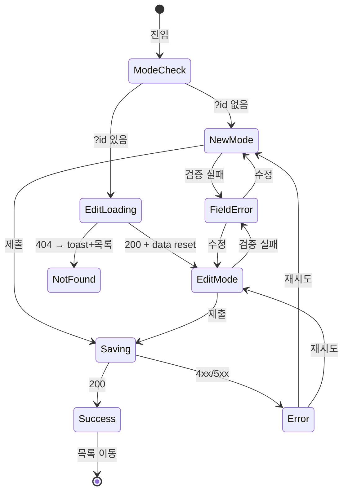

# SCR-061 직원 등록/수정 — 기본화면 (마스터)

> 이 문서는 **화면 마스터 스펙**입니다. `01~08` 상태 문서는 이 문서를 상속(override/delta)합니다.
> 🔐 **권한**: owner 이상만 접근. URL 쿼리 `?id`로 등록/수정 모드 분기.
> 🧩 **폼 기반**: `react-hook-form` + `zod` + `onBlur` 검증. 역할별 권한 미리보기 내장.

---

## 0. 메타 & 원천 참조

| 항목 | 값 |
|---|---|
| 화면 ID | SCR-061 |
| 화면명 | 직원 등록/수정 |
| 도메인 | D07-직원관리 |
| 경로 | `/staff/new` (등록), `/staff/new?id={staffId}` (수정) |
| 파일 경로 | `src/app/staff/new/page.tsx` |
| 페이지 컴포넌트 | `StaffFormPage` → `StaffForm` (Suspense) |
| 역할 | superAdmin, primary, owner, manager |
| 우선순위 | P0 |
| 플랫폼 | 데스크톱/태블릿/모바일 |
| 멀티테넌트 | ✅ 서버가 branchId 강제 |

### 원천 문서
| 문서 | 경로 | 섹션 |
|---|---|---|
| 화면설계서 | `docs/화면설계서/직원관리.md` | §SCR-061 |
| 기능명세서 | `docs/기능명세서/직원관리.md` | §2. 직원 등록/수정 |
| 에러코드정의서 | `docs/에러코드정의서.md` | §4.3 직원(E400200, E404200, E409*, E422*) |
| 공통 UI | `docs/화면설계서/공통.md` | §3 공통 UI, §2.2 권한 |
| 다이어그램 F1 | `docs/다이어그램/D07_직원관리/SCR-061_직원등록수정/F1_진입.md` | 등록/수정 분기 |
| 다이어그램 F2 | `docs/다이어그램/D07_직원관리/SCR-061_직원등록수정/F2_메인인터랙션.md` | 폼 입력 흐름 |
| 다이어그램 F3 | `docs/다이어그램/D07_직원관리/SCR-061_직원등록수정/F3_버튼액션.md` | BTN_SAVE, BTN_CANCEL |
| 다이어그램 F5 | `docs/다이어그램/D07_직원관리/SCR-061_직원등록수정/F5_모달트리거.md` | DLG-061-001 |
| 다이어그램 F6 | `docs/다이어그램/D07_직원관리/SCR-061_직원등록수정/F6_상태별화면.md` | 등록/수정/저장중/에러/완료 |
| 다이어그램 F7 | `docs/다이어그램/D07_직원관리/SCR-061_직원등록수정/F7_권한분기.md` | owner 이상 |
| 다이어그램 F8 | `docs/다이어그램/D07_직원관리/SCR-061_직원등록수정/F8_에러예외복구.md` | 검증/저장 실패 |
| 다이어그램 F9 | `docs/다이어그램/D07_직원관리/SCR-061_직원등록수정/F9_토스트피드백.md` | 성공/실패 메시지 |

---

## 1. 화면 목적 (Why)

신규 직원 등록과 기존 직원 수정을 **단일 폼**으로 처리.
- zod 스키마 + react-hook-form 으로 필드별 검증 (onBlur).
- 역할 Select 선택 시 권한 미리보기 박스 표시 (사용자 교육).
- 연락처 자동 포맷(010-0000-0000) + 이메일 형식 + 입사일 필수.
- 수정 모드: URL `?id`로 기존 데이터 reset.
- 감사 로그: AUDIT.CREATE / AUDIT.UPDATE 기록.

---

## 2. 화면 레이아웃 (Wireframe)

```
┌──────────────────────────────────────────────────────────────────┐
│ PageHeader                                                       │
│ title = "직원 등록" | "직원 정보 수정"                           │
│ description = "새로운 직원 정보를 입력하고 역할을 설정합니다."    │
│              | "직원의 정보를 수정하고 저장합니다."              │
│ actions = [취소] [💾 저장하기 / 수정 저장]                       │
├──────────────────────────────────────────────────────────────────┤
│ Content (max-w-[860px] mx-auto space-y-6)                        │
│                                                                  │
│ ┌─ FormSection: "기본 정보" ──────────────────────────────────┐  │
│ │ description = "직원의 이름, 역할, 연락처를 입력합니다."     │  │
│ │                                                              │  │
│ │ 이름 *            [👤 홍길동                              ] │  │
│ │ 역할 *            [트레이너                            ▼ ] │  │
│ │   ┌ 권한 미리보기 박스 (watchedRole 존재 시) ───────────┐  │  │
│ │   │ 🛡 {roleInfo.label} 권한                             │  │  │
│ │   │ {roleInfo.desc}                                      │  │  │
│ │   │ [회원관리] [직원관리] [급여확정] [매출] [설정]       │  │  │
│ │   └──────────────────────────────────────────────────────┘  │  │
│ │ 연락처 *          [📞 010-0000-0000                       ] │  │
│ │ 입사일 *          [📅 2026-04-22                          ] │  │
│ │ 기본급            [원 단위                                ] │  │
│ └────────────────────────────────────────────────────────────┘  │
│                                                                  │
│ ┌─ FormSection: "추가 정보" ──────────────────────────────────┐  │
│ │ description = "이메일과 메모는 선택 항목입니다."            │  │
│ │ 이메일            [✉️ example@center.com                 ] │  │
│ │ 메모              [📝 특이사항이나 참고 내용...           ] │  │
│ └────────────────────────────────────────────────────────────┘  │
│                                                                  │
│ ConfirmDialog: DLG-061-001 (등록 취소 / 수정 취소)               │
└──────────────────────────────────────────────────────────────────┘
```

### 2.1 영역별 치수

| 영역 | 위치 | 치수 | 역할 |
|---|---|---|---|
| PageHeader | 상단 | sticky top-0 | 타이틀 + 액션 |
| Content wrapper | 중앙 | `max-w-[860px] mx-auto p-6 lg:p-8` | 폼 컨테이너 |
| FormSection | 각 섹션 | `rounded-xl ring-1 ring-line bg-white p-6` | 그룹 |
| 필드 행 | 각 row | `grid grid-cols-[120px_1fr] gap-4 items-start` (≥md) | 라벨 + 인풋 |
| 권한 미리보기 | 역할 아래 | `rounded-input bg-primary-light border border-primary/20 p-4` | 박스 |

---

## 3. 디자인 토큰

### 3.1 색상
| 토큰 | 클래스 | 용도 |
|---|---|---|
| bg.page | `bg-gray-50` | 전체 |
| bg.card | `bg-white rounded-xl shadow-sm ring-1 ring-line` | FormSection |
| label.req | `text-sm font-medium text-gray-700 after:content-['*'] after:ml-0.5 after:text-error` | 필수 라벨 |
| input.default | `border border-line bg-white focus:ring-2 focus:ring-primary focus:border-primary rounded-input h-10 px-3` | 인풋 |
| input.error | `border-state-error focus:ring-state-error/30 focus:border-state-error` | 검증 실패 |
| input.icon | `absolute left-3 top-1/2 -translate-y-1/2 text-content-tertiary` | 좌측 아이콘 |
| textarea | `rounded-input border border-line p-3 min-h-[84px]` | 메모 |
| select | 동일 input 스타일 + `appearance-none pr-8` + chevron | Select |
| preview.box | `bg-primary-light border border-primary/20 rounded-input p-4 space-y-2` | 권한 미리보기 |
| preview.tag | `inline-flex px-2 py-0.5 rounded-full bg-white border border-primary/20 text-xs text-primary` | 권한 태그 |
| button.primary | `bg-primary text-white shadow-sm h-10 px-4 rounded-button` | 저장 |
| button.secondary | `border border-line bg-surface text-content-secondary h-10 px-4 rounded-button` | 취소 |
| error.msg | `text-sm text-state-error mt-1 flex items-center gap-1` | 필드 에러 |

### 3.2 타이포그래피
| 토큰 | 스타일 |
|---|---|
| page.title | `text-2xl font-bold tracking-tight text-gray-900` |
| section.title | `text-base font-semibold text-gray-900` |
| section.desc | `text-sm text-content-secondary` |
| field.label | `text-sm font-medium text-gray-700` |
| field.value | `text-sm text-gray-900` |
| preview.title | `text-sm font-semibold text-primary` |
| preview.desc | `text-xs text-content-secondary` |
| button.text | `text-sm font-medium` |

### 3.3 간격/반경
| 토큰 | 값 |
|---|---|
| radius.card | `rounded-xl` |
| radius.input | `rounded-input` (8px) |
| radius.button | `rounded-button` (8px) |
| radius.tag | `rounded-full` |
| gap.section | `space-y-6` |
| gap.field | `space-y-4` |
| gap.row | `gap-4` |
| padding.card | `p-6` |

### 3.4 모션
| 토큰 | 값 |
|---|---|
| motion.focus | `transition-colors duration-150` |
| motion.button | `transition-all duration-150 hover:scale-[1.02] active:scale-[0.98]` |
| motion.dialog | `animate-in zoom-in-95 duration-200` |
| prefers-reduced | 모든 애니메이션 비활성 |

---

## 4. 반응형 규칙

| BP | 폭 | 레이아웃 | 비고 |
|---|---|---|---|
| Mobile <640 | 100% | 필드 세로 쌓기 (라벨 상단) | `grid-cols-1` |
| Tablet 640~1024 | 100% | 라벨 좌측 120px + 인풋 | `md:grid-cols-[120px_1fr]` |
| Desktop ≥1024 | max 860px | 중앙 정렬, 2컬럼 가능 | |
| XL ≥1440 | 동일 | — | — |

모바일 권한 미리보기는 전체 폭. 태블릿↑는 인풋 폭에 정렬.

---

## 5. 🔐 역할별(RBAC) 매트릭스

| 요소 | superAdmin/primary | owner | manager | 기타 |
|---|:---:|:---:|:---:|:---:|
| 페이지 접근 | ● | ● | ● | — (`/forbidden`) |
| 등록 모드 (POST) | ● | ● (자기 지점) | ● (자기 지점) | — |
| 수정 모드 (PATCH) | ● | ● | ● | — |
| 역할 옵션 노출 | 전체 (owner/manager/fc/trainer/staff) | 전체 | owner/manager/fc/trainer/staff (primary 불가) | — |
| 기본급 필드 | ● | ● | ○(조회만) | — |
| 감사 로그 actorId | ● | ● | ● | — |

**비즈니스 룰**:
- `manager`는 "센터장(owner)" 역할의 직원을 **생성/수정 불가** → Select에서 "센터장" 옵션 disabled.
- 자기 자신의 역할 변경 금지(보안). 추후 별도 권한 이관 플로우로.
- primary만 "최고관리자(primary)" 역할 부여 가능 (해당 옵션은 내부 관리 화면에서).

---

## 6. 컴포넌트 트리

```
<AppLayout role={user.role}>
  <Suspense fallback={<StaffFormSkeleton/>}>
    <StaffForm editId={searchParams.id}>
      <PageHeader title={editId ? "직원 정보 수정" : "직원 등록"}
                  description={editId ? "직원의 정보를 수정하고 저장합니다."
                                      : "새로운 직원 정보를 입력하고 역할을 설정합니다."}
                  actions={<>
                    <Button variant="secondary" onClick={()=>setShowCancelDialog(true)}>취소</Button>
                    <Button type="submit" variant="primary" disabled={isSaving} onClick={handleSubmit(onSubmit)}>
                      <Save size={16}/> {isSaving ? '저장 중...' : (editId ? '수정 저장' : '저장하기')}
                    </Button>
                  </>} />

      <form onSubmit={handleSubmit(onSubmit)}
            className="mx-auto max-w-[860px] p-6 lg:p-8 space-y-6" noValidate>

        <FormSection title="기본 정보" description="직원의 이름, 역할, 연락처를 입력합니다.">
          <FormField label="이름" htmlFor="name" required error={errors.name?.message}>
            <InputWithIcon id="name" icon={<User size={16}/>} placeholder="홍길동"
                           aria-required="true" aria-invalid={!!errors.name}
                           {...register('name')} />
          </FormField>

          <FormField label="역할" htmlFor="role" required error={errors.role?.message}>
            <Select id="role" aria-required="true" aria-invalid={!!errors.role} {...register('role')}>
              <option value="">역할 선택</option>
              <option value="owner">센터장</option>
              <option value="manager">매니저</option>
              <option value="fc">FC</option>
              <option value="trainer">트레이너</option>
              <option value="staff">스태프</option>
            </Select>
            {watchedRole && ROLE_PERMISSIONS[watchedRole] && (
              <RolePermissionPreview info={ROLE_PERMISSIONS[watchedRole]} />
            )}
          </FormField>

          <FormField label="연락처" htmlFor="contact" required error={errors.contact?.message}>
            <InputWithIcon id="contact" icon={<Phone size={16}/>} placeholder="010-0000-0000"
                           maxLength={13} onChange={(e)=>{ setValue('contact', formatPhone(e.target.value)); trigger('contact'); }}
                           {...register('contact')} />
          </FormField>

          <FormField label="입사일" htmlFor="joinDate" required error={errors.joinDate?.message}>
            <InputWithIcon id="joinDate" type="date" icon={<Calendar size={16}/>}
                           {...register('joinDate')} />
          </FormField>

          <FormField label="기본급" htmlFor="salary">
            <Input id="salary" type="number" placeholder="원 단위" {...register('salary')} />
          </FormField>
        </FormSection>

        <FormSection title="추가 정보" description="이메일과 메모는 선택 항목입니다.">
          <FormField label="이메일" htmlFor="email" error={errors.email?.message}>
            <InputWithIcon id="email" type="email" icon={<Mail size={16}/>} placeholder="example@center.com"
                           {...register('email')} />
          </FormField>
          <FormField label="메모" htmlFor="memo">
            <Textarea id="memo" placeholder="특이사항이나 참고 내용을 입력하세요" {...register('memo')} />
          </FormField>
        </FormSection>
      </form>

      <ConfirmDialog /* DLG-061-001 */ />
    </StaffForm>
  </Suspense>
</AppLayout>
```

### 6.1 컴포넌트 명세
| 컴포넌트 | 파일 | Props |
|---|---|---|
| `FormSection` | `src/components/common/FormSection.tsx` | `{title, description, children}` |
| `FormField` | `src/components/common/FormField.tsx` | `{label, htmlFor, required, error, children}` |
| `InputWithIcon` | `src/components/ui/InputWithIcon.tsx` | `{icon, ...InputHTMLProps}` |
| `Select` | `src/components/ui/Select.tsx` | 표준 select + chevron |
| `Textarea` | `src/components/ui/Textarea.tsx` | 표준 textarea |
| `RolePermissionPreview` | `src/components/staff/RolePermissionPreview.tsx` | `{info: RoleInfo}` |
| `ConfirmDialog` | `src/components/common/ConfirmDialog.tsx` | 마스터와 동일 |

---

## 7. 데이터 계약

### 7.1 폼 스키마 (zod)
```ts
// src/lib/validations/staff.ts
import { z } from 'zod';

export const staffFormSchema = z.object({
  name: z.string().min(2, '이름은 2글자 이상 입력해주세요.'),
  role: z.string().min(1, '역할을 선택하세요.'),
  contact: z.string().regex(/^010-\d{4}-\d{4}$/, '010-0000-0000 형식으로 입력하세요.'),
  joinDate: z.string().min(1, '입사일을 입력하세요.'),
  salary: z.string().optional(),
  email: z.string().email('올바른 이메일 형식이 아닙니다.').optional().or(z.literal('')),
  memo: z.string().max(5000, '메모는 5,000자 이내로 입력해주세요.').optional(),
});
export type StaffFormData = z.infer<typeof staffFormSchema>;
```

### 7.2 API 엔드포인트
| 시점 | 메서드 | 파라미터 |
|---|---|---|
| 수정 모드 마운트 | `supabase.from('staff').select('*').eq('id', editId).single()` | id |
| 등록 저장 | `supabase.from('staff').insert(staffData)` | StaffRequest + branchId + isActive:true + staffStatus:'ACTIVE' |
| 수정 저장 | `supabase.from('staff').update(staffData).eq('id', editId)` | Partial<StaffRequest> |
| 감사 로그 (등록) | `createAuditLog({ action:'STAFF_CREATE', targetType:'staff', targetId, afterValue:{name,role} })` | |
| 감사 로그 (수정) | `createAuditLog({ action:'STAFF_UPDATE', targetType:'staff', targetId })` | |

### 7.3 Payload 구축
```ts
const staffData = {
  name: formData.name,
  phone: formData.contact,
  email: formData.email || null,
  role: ROLE_MAP[formData.role] ?? formData.role,  // 영문→한글
  hireDate: formData.joinDate ? new Date(formData.joinDate).toISOString() : null,
  salary: formData.salary ? Number(formData.salary) : null,
  branchId,
};
```

### 7.4 수정 모드 reset
```ts
reset({
  name: data.name ?? '',
  role: ROLE_DB_TO_KEY[data.role] ?? data.role ?? 'staff',
  contact: data.phone ?? '',
  joinDate: data.hireDate ? data.hireDate.slice(0,10) : new Date().toISOString().split('T')[0],
  email: data.email ?? '',
  memo: '',
});
```

### 7.5 역할 상수
```ts
export const ROLE_MAP: Record<string,string> = {
  owner:'센터장', manager:'매니저', fc:'FC', trainer:'트레이너', staff:'스태프'
};
export const ROLE_DB_TO_KEY: Record<string,string> = {
  센터장:'owner', 매니저:'manager', FC:'fc', 트레이너:'trainer', 스태프:'staff'
};
export const ROLE_PERMISSIONS = {
  owner:   { label:'센터장',   desc:'지점 내 전체 데이터 접근 및 관리', perms:['회원 전체 관리','직원 관리','급여 확정','매출 통계','설정 변경'] },
  manager: { label:'매니저',   desc:'운영 전반 관리 및 주요 기능 접근', perms:['회원 관리','스케줄 관리','매출 통계 조회','직원 조회'] },
  fc:      { label:'FC',       desc:'상담·결제 및 매출 통계 접근',      perms:['회원 상담','결제 처리','매출 통계 조회'] },
  trainer: { label:'트레이너', desc:'담당 회원 관리 및 수업 스케줄 관리', perms:['담당 회원 조회','수업 스케줄 관리','출석 체크'] },
  staff:   { label:'스태프',   desc:'기본 회원 조회 및 출석 확인',       perms:['회원 조회','출석 확인'] },
};
```

### 7.6 상태 관리
- react-hook-form: `useForm<StaffFormData>({ resolver: zodResolver(staffFormSchema), mode:'onBlur' })`
- Local: `isSaving`, `showCancelDialog`, `isLoadingStaff(수정 모드)`
- Store: `useAuthStore` (branchId)

---

## 8. 비즈니스 룰

1. **모드 분기**: `searchParams.id` 존재 → 수정 모드. 없으면 등록.
2. **수정 모드 데이터 로드**: 진입 시 1회 `getStaffById`. 실패 시 toast.error + `moveToPage(974)`.
3. **검증 모드**: `onBlur`. 제출 시 전체 검증 재실행.
4. **연락처 자동 포맷**: 입력할 때마다 `formatPhone` 호출 + `trigger('contact')`로 즉시 검증.
5. **역할별 제약**:
   - manager는 "센터장(owner)" 옵션 disabled.
   - primary 옵션은 숨김(내부 관리 화면 전용).
6. **권한 미리보기**: `watchedRole` 변경 시 `ROLE_PERMISSIONS[watchedRole]` 박스 렌더.
7. **저장 중 중복 방지**: `isSaving=true` 동안 버튼 disabled + Enter 키 무시.
8. **성공 후 이동**: `moveToPage(974)` (직원 목록) + toast.success.
9. **실패**: toast.error + 폼 유지 (데이터 손실 방지).
10. **취소 다이얼로그**: DLG-061-001. 변경 사항 없으면 바로 이동, 있으면 확인.
11. **감사 로그**: 성공 시 `AUDIT.STAFF_CREATE` / `AUDIT.STAFF_UPDATE` 기록.

---

## 9. 상태 목록

| 파일 | 상태 코드 | 한글 | 트리거 |
|---|---|---|---|
| `01-등록모드.md` | `staff-form-new` | 등록 모드 | `?id` 없음 |
| `02-수정모드-로딩.md` | `staff-form-edit-loading` | 수정 로딩 | `?id` 있음 + API pending |
| `03-수정모드.md` | `staff-form-edit` | 수정 모드 | data reset 완료 |
| `04-저장중.md` | `staff-form-saving` | 저장 중 | `isSaving=true` |
| `05-인라인에러.md` | `staff-form-field-error` | 인라인 에러 | zod 검증 실패 |
| `06-완료.md` | `staff-form-success` | 완료 | 저장 성공 |
| `07-에러.md` | `staff-form-error` | 에러 | API 실패 |
| `08-역할권한미리보기.md` | `staff-form-role-preview` | 역할 권한 | watchedRole 존재 |

---

## 10. 에러 코드 매핑

| errorCode | HTTP | 시나리오 | 대응 |
|---|---|---|---|
| E400001 | 400 | 필수값 누락 | zod에서 차단 + 인라인 |
| E400002 | 400 | 입력값 형식 오류 | 인라인 에러 |
| E400200 | 400 | 직원 정보 누락(서버) | 필드 매핑 후 인라인 |
| E400103 | 400 | 전화번호 형식 | 인라인 `contact` |
| E400104 | 400 | 이메일 형식 | 인라인 `email` |
| E404200 | 404 | 수정 대상 직원 없음 | toast + 목록 이동 |
| E409200 | 409 | 이미 퇴사된 직원 수정 시도 | dialog 안내 |
| E500001 | 500 | 서버 | toast + 재시도 |
| NETWORK | — | 오프라인 | 저장 막힘, 저장 큐 없음 |

토스트:
- 등록 성공: `"직원이 성공적으로 등록되었습니다."`
- 등록 실패: `` `저장 실패: ${error.message}` ``
- 수정 성공: `"직원 정보가 수정되었습니다."`
- 수정 실패: `` `수정 실패: ${error.message}` ``
- 로드 실패: `"직원 정보를 불러오지 못했습니다."`

---

## 11. 접근성 (WCAG 2.1 AA)

- `<form noValidate aria-labelledby="form-title">`
- 필수 필드: `aria-required="true"` + 라벨 ` *`.
- 에러: `<p role="alert" aria-live="polite" id={`err-${field}`}>` + 인풋 `aria-describedby={`err-${field}`} aria-invalid`.
- 키보드: Tab 순서: 이름 → 역할 → 연락처 → 입사일 → 기본급 → 이메일 → 메모 → 취소 → 저장.
- Enter 제출(단일 폼). Esc: 취소 버튼과 동일 동작.
- 포커스: `focus-visible:ring-2 ring-primary`.
- 권한 미리보기: `aria-live="polite"` (역할 변경 시 스크린리더 공지).
- prefers-reduced-motion: motion.button 비활성.

---

## 12. 진입 / 이탈

### 진입
- SCR-060에서 "+ 직원 등록" → `/staff/new`
- SCR-060에서 직원명 ghost 클릭 → `/staff/new?id={id}`
- MoreVertical > "수정" → `/staff/new?id={id}`

### 이탈
| 액션 | 목적지 |
|---|---|
| 저장 성공 | SCR-060 `/staff` (목록) |
| 취소 확정 | SCR-060 `/staff` |
| 401 | `/login?redirect=/staff/new` |
| 403 | `/forbidden` |

---

## 13. 다이어그램 통합 뷰



---

## 14. 🧩 바이브코딩 프롬프트 (마스터)

```
Next.js 15 App Router + TypeScript + Tailwind + Supabase + react-hook-form + zod
'use client' 컴포넌트를 작성하라.

━━ 화면: SCR-061 직원 등록/수정 ━━
파일: src/app/staff/new/page.tsx
보조:
- src/lib/validations/staff.ts (staffFormSchema, ROLE_MAP, ROLE_DB_TO_KEY, ROLE_PERMISSIONS)
- src/components/common/{FormSection,FormField,ConfirmDialog}.tsx
- src/components/ui/{InputWithIcon,Select,Textarea}.tsx
- src/components/staff/RolePermissionPreview.tsx
- src/api/endpoints/staff.ts (getStaffById, createStaff, updateStaff)
- src/lib/utils/phone.ts (formatPhone)

━━ 상단 가드 ━━
- 미인증 → /login?redirect=/staff/new
- role ∉ ['superAdmin','primary','owner','manager'] → /forbidden

━━ 레이아웃 ━━
<AppLayout role={user.role}>
  <form onSubmit={handleSubmit(onSubmit)} className="mx-auto max-w-[860px] p-6 lg:p-8 space-y-6" noValidate
        aria-labelledby="page-title">
    <PageHeader id="page-title"
      title={editId ? '직원 정보 수정' : '직원 등록'}
      description={editId ? '직원의 정보를 수정하고 저장합니다.' : '새로운 직원 정보를 입력하고 역할을 설정합니다.'}
      actions={<>
        <Button variant="secondary" onClick={()=>setShowCancelDialog(true)}>취소</Button>
        <Button type="submit" variant="primary" disabled={isSaving}>
          <Save size={16}/> {isSaving ? '저장 중...' : (editId ? '수정 저장' : '저장하기')}
        </Button>
      </>} />

    <FormSection title="기본 정보" description="직원의 이름, 역할, 연락처를 입력합니다.">
      <FormField label="이름" htmlFor="name" required error={errors.name?.message}>
        <InputWithIcon id="name" icon={<User size={16}/>} placeholder="홍길동"
                       aria-required aria-invalid={!!errors.name}
                       {...register('name')} />
      </FormField>
      <FormField label="역할" htmlFor="role" required error={errors.role?.message}>
        <Select id="role" aria-required aria-invalid={!!errors.role} {...register('role')}>
          <option value="">역할 선택</option>
          <option value="owner" disabled={role==='manager'}>센터장</option>
          <option value="manager">매니저</option>
          <option value="fc">FC</option>
          <option value="trainer">트레이너</option>
          <option value="staff">스태프</option>
        </Select>
        {watchedRole && ROLE_PERMISSIONS[watchedRole] &&
          <RolePermissionPreview info={ROLE_PERMISSIONS[watchedRole]} />}
      </FormField>
      <FormField label="연락처" htmlFor="contact" required error={errors.contact?.message}>
        <InputWithIcon id="contact" icon={<Phone size={16}/>} maxLength={13}
                       placeholder="010-0000-0000"
                       {...register('contact', {
                         onChange:(e)=>{ setValue('contact', formatPhone(e.target.value)); trigger('contact'); } })} />
      </FormField>
      <FormField label="입사일" htmlFor="joinDate" required error={errors.joinDate?.message}>
        <InputWithIcon id="joinDate" type="date" icon={<Calendar size={16}/>} {...register('joinDate')} />
      </FormField>
      <FormField label="기본급" htmlFor="salary">
        <Input id="salary" type="number" placeholder="원 단위" {...register('salary')} />
      </FormField>
    </FormSection>

    <FormSection title="추가 정보" description="이메일과 메모는 선택 항목입니다.">
      <FormField label="이메일" htmlFor="email" error={errors.email?.message}>
        <InputWithIcon id="email" type="email" icon={<Mail size={16}/>}
                       placeholder="example@center.com" {...register('email')} />
      </FormField>
      <FormField label="메모" htmlFor="memo">
        <Textarea id="memo" placeholder="특이사항이나 참고 내용을 입력하세요" {...register('memo')} />
      </FormField>
    </FormSection>
  </form>

  <ConfirmDialog open={showCancelDialog}
    title={editId ? '수정 취소' : '등록 취소'}
    description="입력 중인 내용이 저장되지 않습니다. 정말 취소하시겠습니까?"
    confirmLabel="네, 취소합니다" cancelLabel="계속 작성하기" variant="danger"
    onConfirm={()=>{ setShowCancelDialog(false); moveToPage(974); }}
    onCancel={()=>setShowCancelDialog(false)} />
</AppLayout>

━━ onSubmit ━━
async function onSubmit(formData: StaffFormData) {
  setIsSaving(true);
  const payload = {
    name: formData.name, phone: formData.contact,
    email: formData.email || null,
    role: ROLE_MAP[formData.role] ?? formData.role,
    hireDate: new Date(formData.joinDate).toISOString(),
    salary: formData.salary ? Number(formData.salary) : null,
    branchId,
  };
  try {
    if (editId) {
      const { error } = await supabase.from('staff').update(payload).eq('id', editId);
      if (error) throw error;
      toast.success('직원 정보가 수정되었습니다.');
      await createAuditLog({ action:'STAFF_UPDATE', targetType:'staff', targetId:editId });
    } else {
      const insertPayload = { ...payload, isActive:true, staffStatus:'ACTIVE' };
      const { data, error } = await supabase.from('staff').insert(insertPayload).select('id').single();
      if (error) throw error;
      toast.success('직원이 성공적으로 등록되었습니다.');
      await createAuditLog({ action:'STAFF_CREATE', targetType:'staff', targetId:data.id, afterValue:{ name:payload.name, role:payload.role } });
    }
    moveToPage(974);
  } catch (e:any) {
    toast.error((editId ? '수정 실패: ' : '저장 실패: ') + (e?.message ?? '알 수 없는 오류'));
  } finally {
    setIsSaving(false);
  }
}

━━ 디자인 토큰 ━━
bg.page: bg-gray-50
section.card: bg-white rounded-xl shadow-sm ring-1 ring-line p-6
input: border border-line rounded-input h-10 px-3 focus:ring-2 focus:ring-primary focus:border-primary
input.error: border-state-error focus:ring-state-error/30
button.primary: bg-primary text-white h-10 px-4 rounded-button
button.secondary: border border-line bg-surface text-content-secondary h-10 px-4 rounded-button
preview.box: bg-primary-light border border-primary/20 rounded-input p-4

━━ 접근성 ━━
- noValidate + aria-labelledby
- 필수: aria-required + 라벨 *
- 에러: role="alert" aria-live="polite" aria-describedby
- 역할 변경 시 Preview: aria-live="polite"
```

---

## 15. QA 체크리스트

- [ ] `?id` 없이 진입 → 등록 모드 ("직원 등록")
- [ ] `?id=123` 진입 → 수정 모드 ("직원 정보 수정") + 데이터 reset
- [ ] 필수 필드(이름/역할/연락처/입사일) 미입력 → 제출 시 인라인 에러
- [ ] 이메일 형식 오류 → 인라인 에러 (blur 시)
- [ ] 전화번호 자동 포맷 (010-1234-5678)
- [ ] 역할 선택 시 권한 미리보기 박스 + aria-live 공지
- [ ] manager 로그인 시 "센터장" 옵션 disabled
- [ ] 저장 중 버튼 "저장 중..." + disabled
- [ ] 저장 성공 시 toast + 목록 이동
- [ ] 저장 실패 시 toast + 폼 유지
- [ ] 취소 버튼 → DLG-061-001 → 확정 시 목록 이동
- [ ] DLG-061-001 "계속 작성" 선택 시 데이터 유지
- [ ] 수정 모드 로드 실패 → toast + 목록 이동
- [ ] 감사 로그 AUDIT.STAFF_CREATE / AUDIT.STAFF_UPDATE 기록
- [ ] 키보드만으로 전체 플로우 완주 가능
- [ ] 스크린리더 필수 필드/에러/권한 박스 공지
- [ ] reduced-motion 준수
