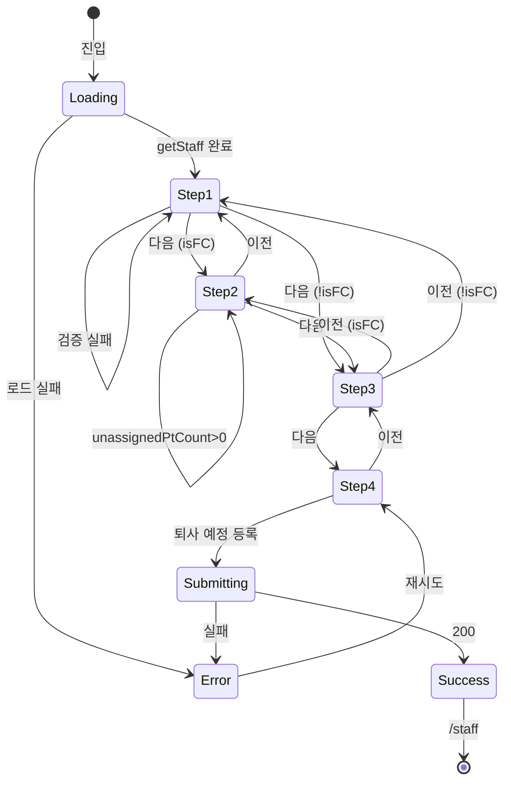

# SCR-062 직원 퇴사 처리 — 기본화면 (마스터)

> 이 문서는 **화면 마스터 스펙**입니다. `01~08` 상태 문서는 이 문서를 상속(override/delta)합니다.
> 🧭 **4단계 위자드**: 직원·퇴사 정보 → 담당 회원 재배정(FC만) → 스케줄 확인 → 최종 확인.
> 🔐 **권한**: owner 이상만 접근. 대규모 인사 액션이므로 센터장 전권.
> 🛡 **핵심 룰**: FC 직원은 담당 회원 재배정이 필수. 비FC는 Step 2 건너뜀.

---

## 0. 메타 & 원천 참조

| 항목 | 값 |
|---|---|
| 화면 ID | SCR-062 |
| 화면명 | 직원 퇴사 처리 |
| 도메인 | D07-직원관리 |
| 경로 | `/staff/resignation?staffId={id}` |
| 파일 경로 | `src/app/staff/resignation/page.tsx` |
| 페이지 컴포넌트 | `StaffResignationPage` → `StaffResignation` (Suspense) |
| 역할 | superAdmin, primary, owner (manager 불가 — 비즈니스 룰) |
| 우선순위 | P0 (인사 민감 플로우) |
| 플랫폼 | 데스크톱(우선) / 태블릿 / 모바일(제한적) |

### 원천 문서
| 문서 | 경로 | 섹션 |
|---|---|---|
| 화면설계서 | `docs/화면설계서/직원관리.md` | §SCR-062 |
| 기능명세서 | `docs/기능명세서/직원관리.md` | §3. 퇴사 처리 |
| 상태전이도 | `docs/상태전이도.md` | §8 StaffStatus (ACTIVE→RESIGNED) |
| 에러코드정의서 | `docs/에러코드정의서.md` | §4.3 직원 (E404200, E409200, E422200) |
| 다이어그램 F1 | `docs/다이어그램/D07_직원관리/SCR-062_직원퇴사처리/F1_진입.md` | 진입 분기 |
| 다이어그램 F2 | `docs/다이어그램/D07_직원관리/SCR-062_직원퇴사처리/F2_메인인터랙션.md` | 4단계 진행 |
| 다이어그램 F3 | `docs/다이어그램/D07_직원관리/SCR-062_직원퇴사처리/F3_버튼액션.md` | 다음/이전/최종 |
| 다이어그램 F6 | `docs/다이어그램/D07_직원관리/SCR-062_직원퇴사처리/F6_상태별화면.md` | 8 상태 |
| 다이어그램 F7 | `docs/다이어그램/D07_직원관리/SCR-062_직원퇴사처리/F7_권한분기.md` | owner 이상 |
| 다이어그램 F8 | `docs/다이어그램/D07_직원관리/SCR-062_직원퇴사처리/F8_에러예외복구.md` | 재배정/퇴사 실패 |
| 다이어그램 F9 | `docs/다이어그램/D07_직원관리/SCR-062_직원퇴사처리/F9_토스트피드백.md` | 성공/경고/실패 |

---

## 1. 화면 목적 (Why)

센터 내 직원 퇴사를 **위자드 4단계**로 체계적으로 처리한다.
- Step 1: 대상 직원·퇴사 예정일·사유 입력.
- Step 2: **FC 직원인 경우**, 담당 회원을 다른 FC로 재배정.
- Step 3: 퇴사 예정일 이후 예약된 미래 스케줄 확인(이관/취소 선택).
- Step 4: 최종 요약 검토 후 퇴사 예정 등록.
- 담당 회원 재배정 → 퇴사 등록 API 순차 호출.

---

## 2. 화면 레이아웃 (Wireframe)

```
┌──────────────────────────────────────────────────────────────────┐
│  PageHeader                                                      │
│  title = "직원 퇴사 처리"                                         │
│  description = "단계별로 퇴사 정보를 입력하고 처리합니다."        │
├──────────────────────────────────────────────────────────────────┤
│  max-w-[860px] mx-auto p-6 lg:p-8                                │
│                                                                  │
│  StepIndicator                                                   │
│  ●─────●─────○─────○                                            │
│  1.직원퇴사정보 2.회원재배정 3.스케줄확인 4.최종확인              │
│                                                                  │
│  (아래 Step 1~4 중 하나 렌더)                                    │
│                                                                  │
│  ═══ Step 1 ═══ 퇴사 대상 직원 선택                              │
│  직원 * [Select ▼]                                               │
│  ┌ 선택 카드 ─────────────────────────┐                          │
│  │ 👤 홍길동 [트레이너]                │                          │
│  │ 📅 입사: 2024-01-15  👥 담당: N명   │                          │
│  └──────────────────────────────────────┘                         │
│  퇴사 예정일 * [date, min=today]                                 │
│  퇴사 사유 [textarea]                                             │
│                                            [다음 →]              │
│                                                                  │
│  ═══ Step 2 (FC만) ═══ 담당 회원 재배정                          │
│  👥 N명  ⚠ PT 잔여 {M}명 미배정                                  │
│  일괄 배정: [FC ▼] [미배정 회원에 적용]                          │
│  ┌────────────────────────────────────┐                          │
│  │ 회원명│연락처│PT 잔여│재배정 담당자 │                          │
│  └────────────────────────────────────┘                          │
│  [← 이전]                               [다음 →]                 │
│                                                                  │
│  ═══ Step 3 ═══ 미래 스케줄 확인                                 │
│  ✅ 예정된 스케줄이 없습니다.                                     │
│  (있으면 SimpleTable)                                             │
│  처리 방법: (●) 후임에게 일괄 이관  (○) 일괄 취소                │
│  [← 이전]                               [다음 →]                 │
│                                                                  │
│  ═══ Step 4 ═══ 최종 확인                                        │
│  ⚠ 퇴사 예정 등록 후에는 수정이 어려울 수 있습니다.              │
│  퇴사 대상: 홍길동 (트레이너)                                    │
│  퇴사 예정일: 2026-05-01                                          │
│  퇴사 사유: (입력 값)                                             │
│  담당 회원 재배정: N명 완료(FC일 때)                             │
│  미래 스케줄: 없음/이관/취소                                      │
│  [← 이전]                   [🚪 퇴사 예정 등록]                  │
└──────────────────────────────────────────────────────────────────┘
```

### 2.1 영역별
| 영역 | 치수 | 역할 |
|---|---|---|
| PageHeader | sticky | 타이틀 |
| Content | `max-w-[860px] mx-auto p-6 lg:p-8 space-y-6` | 위자드 컨테이너 |
| StepIndicator | `flex items-center gap-4 mb-6` | 현재/완료 단계 표시 |
| Step 패널 | `rounded-xl ring-1 ring-line bg-white p-6` | 각 단계 |
| 버튼 바 | `flex justify-between pt-6 border-t border-line` | 이전/다음 |

---

## 3. 디자인 토큰

### 3.1 색상
| 토큰 | 클래스 | 용도 |
|---|---|---|
| step.done | `bg-primary text-white ring-primary` | 완료 단계 원 |
| step.current | `bg-primary text-white ring-4 ring-primary/20` | 현재 단계 |
| step.pending | `bg-white text-content-tertiary ring-line` | 대기 단계 |
| step.connector | `h-0.5 bg-line` / `bg-primary` (완료) | 단계 연결선 |
| warn.banner | `bg-amber-50 border-amber-200 text-amber-800 rounded-lg p-3` | "PT 잔여 미배정" 경고 |
| danger.banner | `bg-error/5 border-error/20 text-error rounded-lg p-4` | Step 4 "수정 어려움" |
| select.card | `bg-primary-light border border-primary/20 rounded-input p-4` | 선택된 직원 카드 |
| table.err | `bg-error/5` + row border-l-2 border-error | 미배정 PT 행 |
| submit.btn | `bg-error text-white rounded-button h-10 px-4` | 퇴사 예정 등록 |

### 3.2 타이포
| 토큰 | 스타일 |
|---|---|
| step.label | `text-sm font-medium` (current: text-primary, done: text-gray-600) |
| section.title | `text-base font-semibold flex items-center gap-1.5` |
| summary.key | `text-sm text-content-secondary` |
| summary.value | `text-sm font-medium text-gray-900` |
| warn.text | `text-sm text-amber-800` |

### 3.3 간격
| 토큰 | 값 |
|---|---|
| radius.card | `rounded-xl` |
| padding.step | `p-6` |
| gap.row | `gap-4` |
| gap.sections | `space-y-6` |

---

## 4. 반응형 규칙

| BP | 폭 | StepIndicator | Step 패널 | 비고 |
|---|---|---|---|---|
| Mobile <640 | 100% | 세로 배치 (stack) | `p-4` | 뒤/다음 버튼 sticky bottom 권장 |
| Tablet | 100% | 가로 | `p-5` | |
| Desktop | max 860 | 가로 | `p-6` | |

---

## 5. 🔐 역할별(RBAC) 매트릭스

| 요소 | superAdmin/primary | owner | manager | 기타 |
|---|:---:|:---:|:---:|:---:|
| 페이지 접근 | ● | ● | — | — |
| Step 1 직원 선택 | ● (전 지점) | ● (자기 지점) | — | — |
| Step 2 재배정 | ● | ● | — | — |
| Step 3 스케줄 처리 | ● | ● | — | — |
| Step 4 최종 등록 | ● | ● | — | — |
| 대상 직원: 자기 자신 | — (차단) | — (차단) | — | — |

**비즈니스 룰**:
- **manager 차단**: `/forbidden` 리다이렉트.
- **자기 자신 퇴사 처리 금지**: `selectedStaffId === user.id`면 Step 1 "다음" 버튼 disabled + toast.error.
- primary/superAdmin는 전 지점 직원 선택 가능 (BranchSwitcher 또는 직원 Select에 지점 prefix).

---

## 6. 컴포넌트 트리

```
<AppLayout role={user.role}>
  <div className="mx-auto max-w-[860px] p-6 lg:p-8 space-y-6">
    <PageHeader title="직원 퇴사 처리"
                description="단계별로 퇴사 정보를 입력하고 처리합니다." />

    <StepIndicator steps={STEPS} current={currentStep}
                   skippedSteps={!isFC ? [2] : []} />

    {currentStep === 1 && (
      <Step1_StaffInfo
        staffList={staffList}
        selectedStaffId={selectedStaffId}
        onSelectStaff={setSelectedStaffId}
        selectedStaff={selectedStaff}
        resignDate={resignDate} onResignDateChange={setResignDate}
        resignReason={resignReason} onResignReasonChange={setResignReason}
        errors={step1Errors} onNext={handleStep1Next} />
    )}

    {currentStep === 2 && isFC && (
      <Step2_MemberReassign
        members={members} activeFcList={activeFcList}
        onChangeAssignee={updateMemberAssignee}
        bulkStaffId={bulkStaffId} onBulkChange={setBulkStaffId}
        onApplyBulk={applyBulkAssign}
        unassignedPtCount={unassignedPtCount}
        loading={membersLoading}
        onBack={handleBack} onNext={handleStep2Next} />
    )}

    {currentStep === 3 && (
      <Step3_ScheduleCheck
        schedules={futureSchedules}
        scheduleAction={scheduleAction} onActionChange={setScheduleAction}
        onBack={handleBack} onNext={handleStep3Next} />
    )}

    {currentStep === 4 && (
      <Step4_FinalConfirm
        summary={buildSummary()}
        isSubmitting={isSubmitting}
        onBack={handleBack} onSubmit={handleSubmit} />
    )}
  </div>
</AppLayout>
```

### 6.1 컴포넌트 명세
| 컴포넌트 | 파일 | 주요 Props |
|---|---|---|
| `StepIndicator` | `src/components/common/StepIndicator.tsx` | `{steps, current, skippedSteps?}` |
| `Step1_StaffInfo` | `src/components/staff/Step1_StaffInfo.tsx` | 직원 선택 + 퇴사 정보 |
| `Step2_MemberReassign` | `src/components/staff/Step2_MemberReassign.tsx` | 담당 회원 재배정 테이블 |
| `Step3_ScheduleCheck` | `src/components/staff/Step3_ScheduleCheck.tsx` | 스케줄 테이블 + RadioGroup |
| `Step4_FinalConfirm` | `src/components/staff/Step4_FinalConfirm.tsx` | 요약 + 최종 제출 |
| `SimpleTable` | `src/components/common/SimpleTable.tsx` | `{columns, data}` |

---

## 7. 데이터 계약

### 7.1 타입
```ts
interface MemberRow {
  id: number;
  name: string;
  phone: string;
  hasPtRemaining: boolean;
  assignedStaffId: number | null;
}

interface FutureSchedule {
  id: number;
  title: string;
  date: string;
  type: 'PT' | 'GX';
}

type ScheduleAction = 'transfer' | 'cancel';

const STEPS = ['직원·퇴사 정보', '담당 회원 재배정', '스케줄 확인', '최종 확인'];
```

### 7.2 API 엔드포인트
| 시점 | 함수 | 파라미터 |
|---|---|---|
| 마운트 | `getStaff({ size:100 })` | - |
| 직원 선택 | `getStaffById(id)` | id |
| Step 2 진입 | `getStaffMembers(staffId)` + `getStaff({ size:100, role:'FC' })` | staffId |
| 최종 제출(재배정) | `reassignMembers({ assignments: [{memberId, newStaffId}] })` | assignments |
| 최종 제출(퇴사 예정) | `scheduleResignation(staffId, { resignScheduledAt, resignReason })` | staffId, data |
| 감사 로그 | `createAuditLog({ action:'STAFF_RESIGN_SCHEDULE', targetType:'staff', targetId, afterValue:{resignScheduledAt} })` | - |

### 7.3 상태 변수
```ts
// 위자드 공통
const [currentStep, setCurrentStep] = useState<1|2|3|4>(1);
const [isSubmitting, setIsSubmitting] = useState(false);

// Step 1
const [staffList, setStaffList] = useState<Staff[]>([]);
const [selectedStaffId, setSelectedStaffId] = useState<number|null>(preselectedId ?? null);
const [selectedStaff, setSelectedStaff] = useState<Staff|null>(null);
const [resignDate, setResignDate] = useState('');
const [resignReason, setResignReason] = useState('');
const [step1Errors, setStep1Errors] = useState<Record<string,string>>({});

// Step 2
const [members, setMembers] = useState<MemberRow[]>([]);
const [activeFcList, setActiveFcList] = useState<Staff[]>([]);
const [membersLoading, setMembersLoading] = useState(false);
const [bulkStaffId, setBulkStaffId] = useState<number|null>(null);

// Step 3
const [futureSchedules, setFutureSchedules] = useState<FutureSchedule[]>([]);
const [scheduleAction, setScheduleAction] = useState<ScheduleAction>('transfer');
```

### 7.4 파생값
```ts
const isFC = selectedStaff?.role === 'FC' || selectedStaff?.role === 'fc';
const unassignedPtCount = members.filter(m => m.hasPtRemaining && m.assignedStaffId === null).length;
```

---

## 8. 비즈니스 룰

1. **Step 흐름 (FC)**: 1 → 2 → 3 → 4 → 제출.
2. **Step 흐름 (비FC)**: 1 → 3 → 4 (Step 2 건너뜀). 뒤로가기 시 Step 3 → Step 1.
3. **Step 1 검증**: `selectedStaffId` 필수, `resignDate` 필수(min=today), `selectedStaffId !== user.id`.
4. **Step 2 검증**: `unassignedPtCount === 0` (미배정 PT 회원 없음). 실패 시 toast.warning.
5. **Step 3**: 스케줄 없음 → ✅ + `scheduleAction` 기본 `'transfer'`. 있음 → RadioGroup로 선택 강제.
6. **Step 4 제출 순서**: 재배정 → 퇴사 예정 등록. 재배정 실패 시 퇴사 등록 중단 + toast.
7. **일괄 배정(Step 2)**: `bulkStaffId` 선택 → 미배정 회원 전원 배정 (덮어쓰지 않음).
8. **최종 제출**: `reassignMembers` + `scheduleResignation` 순차. 성공 시 `moveToPage(974)` + toast.success.
9. **감사 로그**: 성공 후 `AUDIT.STAFF_RESIGN_SCHEDULE`.
10. **중복 처리 방지**: `isSubmitting=true` 동안 버튼 disabled.
11. **이탈 경고**: 입력 중 뒤로가기 시도 `beforeunload` 경고.

---

## 9. 상태 목록

| 파일 | 상태 코드 | 한글 | 트리거 |
|---|---|---|---|
| `01-로딩.md` | `resign-loading` | 로딩 | `getStaff` pending |
| `02-Step1-직원선택.md` | `resign-step1` | Step 1 | currentStep=1 |
| `03-Step2-회원이관.md` | `resign-step2` | Step 2 | currentStep=2 (FC) |
| `04-Step3-스케줄확인.md` | `resign-step3` | Step 3 | currentStep=3 |
| `05-Step4-최종확인.md` | `resign-step4` | Step 4 | currentStep=4 |
| `06-제출중.md` | `resign-submitting` | 제출 중 | isSubmitting=true |
| `07-완료.md` | `resign-success` | 완료 | 재배정+퇴사 등록 성공 |
| `08-에러.md` | `resign-error` | 에러 | API 실패 |

---

## 10. 에러 코드 매핑

| errorCode | HTTP | 시나리오 | 표시 |
|---|---|---|---|
| E400001 | 400 | 필수값 누락 | 인라인 (Step 1) |
| E404200 | 404 | 직원 없음 | Step 1 "유효하지 않은 직원" |
| E409200 | 409 | 이미 퇴사 | Step 4 제출 시 dialog + 목록 이동 |
| E422200 | 422 | 담당 회원 존재(Step 2 미완) | 이미 Step 2에서 사전 검증 — 서버 이중 체크 |
| E500001 | 500 | 서버 | toast + 재시도 가능 |
| NETWORK | — | 오프라인 | 제출 막힘 |

토스트:
- 미배정 PT 경고: `` `PT 잔여 회원 ${N}명의 재배정 담당자를 지정해주세요.` ``
- 재배정 실패: `` `담당 회원 재배정 실패: ${msg}` ``
- 퇴사 등록 성공: `퇴사 예정이 등록되었습니다.`
- 퇴사 등록 실패: `` `퇴사 예정 등록 실패: ${msg}` ``
- 예외: `처리 중 오류가 발생했습니다.`

---

## 11. 접근성 (WCAG 2.1 AA)

- StepIndicator: `role="navigation" aria-label="위자드 진행"` + 각 스텝 `aria-current="step"` (현재).
- 각 Step 패널: `<section role="region" aria-labelledby="step-{n}-title">`
- 선택 카드: `role="status" aria-label="선택된 직원"`.
- 퇴사일 date input: `min={today}`.
- RadioGroup: `role="radiogroup" aria-label="스케줄 처리 방법"`.
- 버튼: "이전/다음" `aria-label` 명확. 제출 버튼 `aria-describedby` 경고 배너.
- 포커스 이동: Step 전환 시 새 패널 첫 포커스 가능 요소로.
- prefers-reduced-motion: step 전환 애니메이션 비활성.

---

## 12. 진입 / 이탈

### 진입
- SCR-060 "퇴사 처리" 버튼 → `/staff/resignation`
- SCR-060에서 단일 직원 선택 시 `?staffId={id}` (preselected)
- 목록 MoreVertical > "퇴사 처리" → `?staffId={id}`
- E422200(담당 회원 존재) dialog 링크

### 이탈
| 액션 | 목적지 |
|---|---|
| 제출 성공 | `/staff` 목록 + hl |
| 취소(선택 기능) | `/staff` |
| 401 | `/login?redirect=/staff/resignation` |
| 403 | `/forbidden` |

---

## 13. 다이어그램 통합 뷰



---

## 14. 🧩 바이브코딩 프롬프트 (마스터)

```
Next.js 15 App Router + TypeScript + Tailwind + Supabase
'use client' 컴포넌트를 작성하라.

━━ 화면: SCR-062 직원 퇴사 처리 (4단계 위자드) ━━
파일: src/app/staff/resignation/page.tsx
보조:
- src/components/common/{StepIndicator,SimpleTable}.tsx
- src/components/staff/{Step1_StaffInfo,Step2_MemberReassign,Step3_ScheduleCheck,Step4_FinalConfirm}.tsx
- src/api/endpoints/staff.ts (getStaff, getStaffById, getStaffMembers, reassignMembers, scheduleResignation)

━━ 상단 가드 ━━
- role ∉ ['superAdmin','primary','owner'] → /forbidden (manager 포함 차단)
- selectedStaffId === user.id 시 "다음" 버튼 disabled + toast.error

━━ STEPS 상수 ━━
const STEPS = ['직원·퇴사 정보', '담당 회원 재배정', '스케줄 확인', '최종 확인'];

━━ 파생 ━━
const isFC = selectedStaff?.role === 'FC' || selectedStaff?.role === 'fc';
const unassignedPtCount = members.filter(m => m.hasPtRemaining && m.assignedStaffId === null).length;

━━ 핵심 핸들러 ━━
function handleStep1Next() {
  const errs: Record<string,string> = {};
  if (!selectedStaffId) errs.staff = '퇴사 처리할 직원을 선택하세요.';
  if (!resignDate) errs.date = '퇴사 예정일을 입력하세요.';
  if (selectedStaffId === user.id) errs.staff = '본인은 퇴사 처리할 수 없습니다.';
  setStep1Errors(errs);
  if (Object.keys(errs).length) return;
  if (isFC) { loadStep2Data(); setCurrentStep(2); }
  else { setCurrentStep(3); }
}

function handleStep2Next() {
  if (unassignedPtCount > 0) {
    toast.warning(`PT 잔여 회원 ${unassignedPtCount}명의 재배정 담당자를 지정해주세요.`);
    return;
  }
  setCurrentStep(3);
}

function handleBack() {
  if (currentStep === 3 && !isFC) setCurrentStep(1);  // Step 2 건너뜀
  else setCurrentStep(s => Math.max(1, s-1) as 1|2|3|4);
}

function applyBulkAssign() {
  if (!bulkStaffId) return;
  setMembers(prev => prev.map(m => m.assignedStaffId === null ? { ...m, assignedStaffId: bulkStaffId } : m));
}

async function handleSubmit() {
  setIsSubmitting(true);
  try {
    if (isFC) {
      const assignments = members
        .filter(m => m.assignedStaffId)
        .map(m => ({ memberId: m.id, newStaffId: m.assignedStaffId! }));
      const r = await reassignMembers({ assignments });
      if (!r.ok) throw new Error(r.message);
    }
    const r2 = await scheduleResignation(selectedStaffId!, { resignScheduledAt: resignDate, resignReason });
    if (!r2.ok) throw new Error(r2.message);
    await createAuditLog({ action:'STAFF_RESIGN_SCHEDULE', targetType:'staff', targetId:selectedStaffId!,
                          afterValue:{ resignScheduledAt: resignDate } });
    toast.success('퇴사 예정이 등록되었습니다.');
    moveToPage(974);
  } catch (e:any) {
    toast.error(`퇴사 예정 등록 실패: ${e.message ?? '알 수 없는 오류'}`);
  } finally {
    setIsSubmitting(false);
  }
}

━━ StepIndicator (간단 구현) ━━
<nav aria-label="위자드 진행" className="flex items-center gap-4">
  {STEPS.map((s, i) => {
    const n = i+1;
    const isCurrent = currentStep === n;
    const isDone = currentStep > n || (currentStep > 2 && n === 2 && !isFC);
    const isSkipped = !isFC && n === 2;
    return (
      <div key={s} className="flex items-center gap-2" aria-current={isCurrent ? 'step' : undefined}>
        <span className={cn(
          'size-8 rounded-full flex items-center justify-center text-sm font-semibold',
          isDone && 'bg-primary text-white ring-primary',
          isCurrent && 'bg-primary text-white ring-4 ring-primary/20',
          !isDone && !isCurrent && 'bg-white text-content-tertiary ring-1 ring-line',
          isSkipped && 'opacity-40'
        )}>{isDone ? <Check size={14}/> : n}</span>
        <span className={cn('text-sm', isCurrent ? 'font-semibold text-primary' : 'text-gray-600')}>{s}</span>
        {i < STEPS.length-1 && <span className={cn('h-0.5 w-8', isDone ? 'bg-primary' : 'bg-line')}/>}
      </div>
    );
  })}
</nav>

━━ 디자인 토큰 ━━
warn.banner: bg-amber-50 border-amber-200 text-amber-800 rounded-lg p-3
danger.banner: bg-error/5 border-error/20 text-error rounded-lg p-4
submit.btn: bg-error text-white rounded-button h-10 px-4
step.current: bg-primary text-white ring-4 ring-primary/20

━━ 접근성 ━━
- nav role="navigation" aria-label="위자드 진행"
- 각 Step <section aria-labelledby>
- Step 전환 시 패널 첫 포커스 이동
- RadioGroup: role="radiogroup" aria-label="스케줄 처리 방법"
- 퇴사 예정 등록 버튼: aria-describedby="resign-warning"
```

---

## 15. QA 체크리스트

- [ ] manager 접근 시 `/forbidden`
- [ ] Step 1 직원 미선택 → "다음" 클릭 시 인라인 에러
- [ ] Step 1 퇴사일 미입력 → 인라인 에러
- [ ] 자기 자신 선택 시 "다음" disabled + toast
- [ ] FC 직원 선택 → Step 2로 이동
- [ ] 비FC 직원 선택 → Step 3으로 직행 (Step 2 건너뜀)
- [ ] Step 2 미배정 PT 있을 때 "다음" 차단 + toast.warning
- [ ] Step 2 일괄 배정 동작 (미배정만 덮어쓰지 않음)
- [ ] Step 3 스케줄 없음 ✅ 메시지 + RadioGroup 기본 "transfer"
- [ ] Step 3 스케줄 있음 + RadioGroup 선택 필수
- [ ] 뒤로가기 (FC): Step 3→2
- [ ] 뒤로가기 (비FC): Step 3→1
- [ ] Step 4 최종 제출 → `reassignMembers` + `scheduleResignation` 순차
- [ ] 재배정 실패 시 퇴사 등록 중단
- [ ] 성공 시 toast + `/staff` 이동 + AUDIT.STAFF_RESIGN_SCHEDULE 기록
- [ ] 제출 중 모든 버튼 disabled
- [ ] 스크린리더: Step 전환 공지 + 현재 단계 aria-current
- [ ] reduced-motion: 단계 전환 애니메이션 비활성
