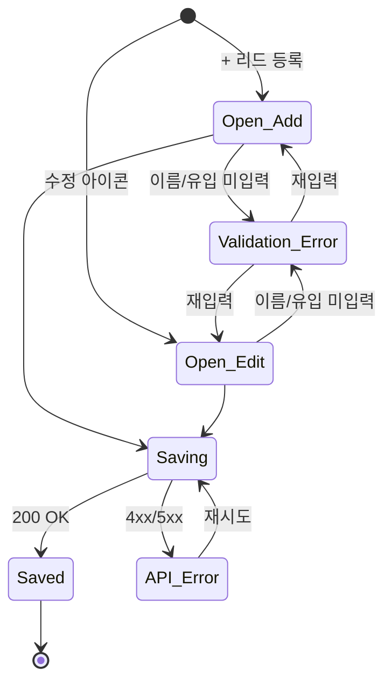

# DLG-070-001 리드 등록/수정 — 기본화면 (마스터)

> 이 문서는 **다이얼로그 마스터 스펙**입니다. `01~05` 상태 문서는 이 문서를 상속(override/delta)합니다.
> 부모 화면: SCR-070 리드 관리 (`/leads`)

---

## 0. 메타 & 원천 참조

| 항목 | 값 |
|------|----|
| 다이얼로그 ID | DLG-070-001 |
| 다이얼로그명 | 리드 등록/수정 모달 |
| 도메인 | D08-마케팅 |
| 부모 화면 | SCR-070 리드 관리 |
| 트리거 | `+ 리드 등록` 버튼 / 테이블 수정 아이콘 |
| 확인 레벨 | L2 (데이터 입력 + 검증) |
| 서버 호출 여부 | ✅ `supabase.leads.insert` / `.update` |
| 닫기 옵션 | ESC/배경/X/취소 모두 가능 (단, 입력 중이면 확인 필요) |
| 역할 | owner, manager, fc |
| 파일 경로 | `src/app/(marketing)/leads/LeadFormModal.tsx` |
| 우선순위 | P0 (FC 핵심 워크플로우) |

### 원천 문서 링크

| 문서 | 경로 |
|---|---|
| 마케팅 화면설계서 | `docs/화면설계서/마케팅.md` §SCR-070 §8.1 DLG-070-001 |
| 마케팅 기능명세서 | `docs/기능명세서/마케팅.md` §1 §G-1 |
| 에러코드정의서 | `docs/에러코드정의서.md` §리드 E40701x |
| 다이어그램 F1~F9 | `docs/다이어그램/D08_마케팅/DLG/DLG-070-001_리드등록수정/` |
| 권한 매트릭스 | `docs/다이어그램/10_권한매트릭스/R1_역할화면_매트릭스.md` |

---

## 1. 다이얼로그 목적 (Why)

신규 리드를 등록하거나 기존 리드의 정보를 수정한다. FC 중심 프리-온보딩 파이프라인 진입의 첫 게이트웨이. 이름/연락처/유입경로/상태/담당자/문의일/후속일/메모를 한 화면에서 입력·수정하고 검증한다.

---

## 2. 화면 레이아웃 (Wireframe)

```
  Backdrop(dim) + 중앙 모달 max-w-[520px]
  ┌──────────────────────────────────────────┐
  │ UserPlus  리드 등록 (또는 수정)     [X]  │
  │ ────────────────────────────────────────│
  │ 이름* [______________________________]  │
  │ 연락처 [_____________________________]  │
  │ 유입경로* [Select ▼ 전화문의 외 9종]    │
  │ 상태 [신규][연락완료][상담예정][방문]   │
  │        [연락][등록완료][미전환][보류]   │ ← 7종 pill
  │ 담당 FC [___________________________]   │
  │ 문의일* [YYYY-MM-DD]  후속일 [YYYY-MM-DD]│
  │ 메모 [textarea rows=3]                  │
  │ ────────────────────────────────────────│
  │                       [취소] [저장(Primary)]│
  └──────────────────────────────────────────┘
```

| 영역 | 치수 | 역할 |
|---|---|---|
| Backdrop | `fixed inset-0 bg-black/50 backdrop-blur-sm z-50` | 차단 |
| Modal | `w-full max-w-[520px] bg-white rounded-2xl p-6` | 카드 |
| Header | 48px h | 아이콘 + 타이틀 + X |
| Body | auto | 8필드 세로 스택 `space-y-3` |
| Footer | 56px h | 취소 + 저장 |

---

## 3. 디자인 토큰

### 3.1 색상

| 토큰 | 클래스 | 용도 |
|---|---|---|
| backdrop | `bg-black/50 backdrop-blur-sm` | 배경 |
| card | `bg-white rounded-2xl shadow-2xl ring-1 ring-gray-100` | 카드 |
| input | `border border-gray-300 focus:ring-2 focus:ring-blue-500` | 입력 |
| label | `text-sm font-medium text-gray-700` | 라벨 |
| required | `text-red-500` (`*`) | 필수 표시 |
| pill.on | `bg-blue-600 text-white` | 선택된 상태 pill |
| pill.off | `bg-gray-100 text-gray-600 hover:bg-gray-200` | 비선택 pill |
| btn.primary | `bg-blue-600 hover:bg-blue-700 text-white` | 저장 |
| btn.ghost | `border border-gray-300 hover:bg-gray-50 text-gray-700` | 취소 |

### 3.2 타이포/간격/반경

| 토큰 | 값 |
|---|---|
| title | `text-lg font-semibold` |
| field.gap | `space-y-3` |
| modal.radius | `rounded-2xl` |
| modal.padding | `p-6` |
| input.h | `h-10` |
| btn.h | `h-10` |

### 3.3 모션

| 토큰 | 값 |
|---|---|
| enter | `animate-[fadeInUp_160ms_ease-out]` |
| reduced | `motion-reduce:animate-none` |

---

## 4. 반응형 규칙

| BP | 모달 | 비고 |
|---|---|---|
| <640 | `max-w-[calc(100%-24px)]` | full width, 상하 16px |
| ≥640 | `max-w-[520px]` | 중앙 |
| Landscape <500h | `overflow-y-auto my-4` | 스크롤 허용 |

---

## 5. 🔐 역할별(RBAC) 매트릭스

| 요소 | superAdmin | primary | owner | manager | fc | trainer | staff | front | readonly |
|---|:---:|:---:|:---:|:---:|:---:|:---:|:---:|:---:|:---:|
| 다이얼로그 열기 | ● | ● | ● | ● | ● | — | — | — | — |
| 이름/연락처 입력 | ● | ● | ● | ● | ● | — | — | — | — |
| 유입경로/상태 선택 | ● | ● | ● | ● | ● | — | — | — | — |
| 담당 FC 입력 | ● | ● | ● | ● | ● | — | — | — | — |
| 저장 (create) | ● | ● | ● | ● | ● | — | — | — | — |
| 저장 (update) | ● | ● | ● | ● | ● | — | — | — | — |
| 타지점 리드 수정 | ● | ● | — | — | — | — | — | — | — |

### 5.1 멀티테넌트
- `branchId`는 `getBranchId()` 강제 주입. 저장 payload에 자동 포함.
- super/primary 외에는 본인 지점 리드만 수정 가능 (RLS).
- `assignedFc`는 해당 지점 소속 FC 목록에서만 선택.

---

## 6. 컴포넌트 트리

```tsx
<Dialog open onClose={handleClose}>
  <DialogBackdrop />
  <DialogContent className="max-w-[520px]">
    <DialogHeader>
      <UserPlus />
      <h2>{editTarget ? '리드 수정' : '리드 등록'}</h2>
      <IconButton onClick={handleClose}><X/></IconButton>
    </DialogHeader>
    <form onSubmit={handleSave} className="space-y-3">
      <Field label="이름" required><Input value={form.name}/></Field>
      <Field label="연락처"><Input type="tel"/></Field>
      <Field label="유입경로" required><Select options={LEAD_SOURCES}/></Field>
      <Field label="상태"><PillGroup options={LEAD_STATUSES}/></Field>
      <Field label="담당 FC"><Input/></Field>
      <div className="grid grid-cols-2 gap-3">
        <Field label="문의일" required><Input type="date"/></Field>
        <Field label="후속 예정일"><Input type="date"/></Field>
      </div>
      <Field label="메모"><Textarea rows={3}/></Field>
      <DialogFooter>
        <Button variant="ghost" onClick={handleClose}>취소</Button>
        <Button type="submit" loading={saving}>저장</Button>
      </DialogFooter>
    </form>
  </DialogContent>
</Dialog>
```

### 컴포넌트 명세

| 컴포넌트 | Props | 재사용 |
|---|---|---|
| `LeadFormModal` | `{ open, editTarget?, onClose, onSaved }` | SCR-070 전용 |
| `Dialog` | Radix UI Dialog | 전역 |
| `PillGroup` | `{ options, value, onChange }` | 전역 |

---

## 7. 데이터 계약

### 7.1 타입

```ts
// src/api/endpoints/leads.ts
export interface Lead {
  id: number;
  branchId: number;
  name: string;
  phone: string | null;
  source: LeadSource;
  status: LeadStatus;
  assignedFc: string | null;
  memo: string | null;
  inquiryDate: string;   // YYYY-MM-DD
  followUpDate: string | null;
  convertedMemberId: number | null;
  createdAt: string;     // ISO
}

export type LeadSource = '간판'|'인터넷'|'전단지'|'추천'|'SNS'|'카카오톡'|'전화문의'|'방문'|'기타';
export type LeadStatus = '신규'|'연락완료'|'상담예정'|'방문완료'|'등록완료'|'미전환'|'보류';

export interface CreateLeadInput {
  name: string;
  phone?: string;
  source: LeadSource;
  status?: LeadStatus;
  assignedFc?: string;
  memo?: string;
  inquiryDate: string;
  followUpDate?: string;
}
```

### 7.2 API

| 함수 | 쿼리 | 권한 |
|---|---|---|
| `createLead(input)` | `supabase.from('leads').insert({...input, branchId}).select().single()` | owner/manager/fc (본 지점) |
| `updateLead(id, input)` | `.update(payload).eq('id', id)` | 동일 (+ RLS로 타지점 차단) |
| `getLeads(branchId)` | `.select('*').eq('branchId').order('createdAt', desc)` | 목록 로드 |

---

## 8. 비즈니스 룰

1. **이름 필수**: 공백 trim 후 비어있으면 `toast.error("이름을 입력하세요.")`.
2. **유입경로 필수**: 미선택 시 저장 차단.
3. **문의일 기본값**: 등록 모드 오픈 시 `new Date().toISOString().slice(0,10)`.
4. **상태 기본값**: 등록 모드 = `신규`.
5. **저장 중 중복 제출 금지**: `saving` state true 동안 버튼 disabled.
6. **branchId 자동 주입**: 페이로드에 `getBranchId()` 포함.
7. **전화번호 포맷**: 저장 시 하이픈 정규화 (`010-1234-5678` 패턴). 자유 입력 허용.
8. **수정 모드 초기화**: `editTarget` 변경 시 form state 전체 동기화 (useEffect).
9. **성공 시 모달 닫기 + 목록 새로고침**: `onSaved()` 호출 → `fetchData()`.
10. **감사로그**: `AUDIT.LEAD_CREATED` / `LEAD_UPDATED` 서버 측 트리거로 기록.

---

## 9. 상태 목록

| 파일 | 상태 코드 | 한글 | 트리거 |
|---|---|---|---|
| `01-열림-등록모드.md` | `open-add` | 열림 (등록 모드) | `+ 리드 등록` 클릭 |
| `02-열림-수정모드.md` | `open-edit` | 열림 (수정 모드) | 수정 아이콘 클릭 |
| `03-저장성공.md` | `saved-success` | 저장 성공 | insert/update 200 |
| `04-유효성오류.md` | `validation-error` | 유효성 오류 | 이름/유입경로 누락 |
| `05-API오류.md` | `api-error` | API 오류 | 4xx/5xx 또는 네트워크 실패 |

---

## 10. 에러 코드 매핑

| errorCode | 시나리오 | 표시 |
|---|---|---|
| E40701 | 이름 미입력 | toast.error "이름을 입력하세요." |
| E40702 | 유입경로 미선택 | toast.error "유입경로를 선택하세요." |
| E40703 | 타지점 리드 수정 시도 | toast.error "권한이 없습니다." (RLS) |
| E40901 | 중복 연락처 (option) | toast.warning "동일 연락처의 리드가 존재합니다." |
| E5xx | 서버 오류 | toast.error "저장 실패: ${message}" |
| NETWORK | 네트워크 오류 | toast.error "네트워크 연결을 확인해주세요." |

---

## 11. 접근성 (WCAG 2.1 AA)

| 항목 | 요구사항 |
|---|---|
| role/aria | `role="dialog" aria-modal="true" aria-labelledby` |
| 포커스 트랩 | 열림 시 이름 input 오토포커스, Tab 순환 |
| 키보드 | Enter=저장, ESC=취소 (단, dirty 상태면 확인) |
| 레이블 연결 | `<label htmlFor>` 모든 input과 연결 |
| 대비 | 본문 4.5:1, 버튼 4.5:1 |
| 필수 표시 | 시각적 `*` + `aria-required="true"` |
| 에러 표시 | `aria-invalid="true"` + 인라인 메시지 |

---

## 12. 진입 / 이탈 연결

| 액션 | 목적지 |
|---|---|
| 저장 성공 | 03-저장성공 → 모달 닫기 → 부모 `fetchData()` |
| 취소 / ESC / 배경 | 모달 닫기 (dirty면 확인 다이얼로그 선택) |
| 유효성 실패 | 04-유효성오류 (모달 유지) |
| API 실패 | 05-API오류 → 재시도 버튼 표시 |

---

## 13. 다이어그램 통합 뷰



참조: `docs/다이어그램/D08_마케팅/DLG/DLG-070-001_리드등록수정/F1~F9`

---

## 14. 🧩 바이브코딩 프롬프트 마스터

```
Next.js 15 App Router + TypeScript + Tailwind v4 + Radix UI Dialog + Supabase 기반
'use client' 리드 등록/수정 모달을 작성하라.

━━ 파일 ━━
  src/app/(marketing)/leads/LeadFormModal.tsx
  src/api/endpoints/leads.ts    (createLead/updateLead)

━━ Props 계약 ━━
type Props = {
  open: boolean;
  editTarget: Lead | null;
  onClose: () => void;
  onSaved: () => void;
};

━━ State ━━
const [form, setForm] = useState<CreateLeadInput>(initialForm(editTarget));
const [saving, setSaving] = useState(false);
const [err, setErr] = useState<string | null>(null);

useEffect(() => { setForm(initialForm(editTarget)); setErr(null); }, [editTarget, open]);

━━ 핸들러 ━━
const handleSave = async (e) => {
  e.preventDefault();
  if (!form.name.trim()) { toast.error('이름을 입력하세요.'); return; }
  if (!form.source)      { toast.error('유입경로를 선택하세요.'); return; }
  setSaving(true);
  try {
    if (editTarget) {
      await updateLead(editTarget.id, form);
      toast.success('리드가 수정되었습니다.');
    } else {
      await createLead(form);
      toast.success('리드가 등록되었습니다.');
    }
    onSaved();
    onClose();
  } catch (e: any) {
    const msg = e?.message ?? '알 수 없는 오류';
    setErr(msg);
    toast.error(`저장 실패: ${msg}`);
  } finally { setSaving(false); }
};

━━ 레이아웃 ━━
<Dialog.Root open={open} onOpenChange={(o) => !o && onClose()}>
  <Dialog.Portal>
    <Dialog.Overlay className="fixed inset-0 z-50 bg-black/50 backdrop-blur-sm
                               motion-reduce:animate-none animate-[fadeIn_120ms]" />
    <Dialog.Content className="fixed left-1/2 top-1/2 z-50 -translate-x-1/2 -translate-y-1/2
                               w-[calc(100%-24px)] max-w-[520px] max-h-[90vh] overflow-y-auto
                               bg-white rounded-2xl shadow-2xl ring-1 ring-gray-100 p-6
                               motion-reduce:animate-none animate-[fadeInUp_160ms]">
      <header className="flex items-center justify-between mb-4">
        <div className="flex items-center gap-2">
          <UserPlus className="size-5 text-blue-600" aria-hidden />
          <Dialog.Title className="text-lg font-semibold text-gray-900">
            {editTarget ? '리드 수정' : '리드 등록'}
          </Dialog.Title>
        </div>
        <Dialog.Close asChild>
          <button aria-label="닫기" className="size-8 grid place-items-center rounded-lg hover:bg-gray-100">
            <X className="size-4" aria-hidden />
          </button>
        </Dialog.Close>
      </header>

      <form onSubmit={handleSave} className="space-y-3">
        <Field label="이름" required>
          <input name="name" autoFocus value={form.name}
            onChange={(e)=>setForm({...form,name:e.target.value})}
            aria-required="true" className="h-10 w-full rounded-lg border border-gray-300 px-3
                        focus:outline-none focus:ring-2 focus:ring-blue-500" />
        </Field>
        <Field label="연락처">
          <input type="tel" value={form.phone??''} onChange={(e)=>setForm({...form,phone:e.target.value})}
            className="h-10 w-full rounded-lg border border-gray-300 px-3" />
        </Field>
        <Field label="유입경로" required>
          <select value={form.source} onChange={(e)=>setForm({...form,source:e.target.value as any})}
            className="h-10 w-full rounded-lg border border-gray-300 px-3">
            {LEAD_SOURCES.map(s => <option key={s} value={s}>{s}</option>)}
          </select>
        </Field>
        <Field label="상태">
          <div className="flex flex-wrap gap-2">
            {LEAD_STATUSES.map(s => (
              <button type="button" key={s}
                onClick={()=>setForm({...form,status:s})}
                className={cx("h-8 px-3 rounded-full text-sm",
                  form.status===s ? "bg-blue-600 text-white" : "bg-gray-100 text-gray-600 hover:bg-gray-200")}>
                {s}
              </button>
            ))}
          </div>
        </Field>
        <Field label="담당 FC">
          <input value={form.assignedFc??''} onChange={(e)=>setForm({...form,assignedFc:e.target.value})}
            className="h-10 w-full rounded-lg border border-gray-300 px-3" />
        </Field>
        <div className="grid grid-cols-2 gap-3">
          <Field label="문의일" required>
            <input type="date" value={form.inquiryDate}
              onChange={(e)=>setForm({...form,inquiryDate:e.target.value})}
              className="h-10 w-full rounded-lg border border-gray-300 px-3" />
          </Field>
          <Field label="후속 예정일">
            <input type="date" value={form.followUpDate??''}
              onChange={(e)=>setForm({...form,followUpDate:e.target.value})}
              className="h-10 w-full rounded-lg border border-gray-300 px-3" />
          </Field>
        </div>
        <Field label="메모">
          <textarea rows={3} value={form.memo??''}
            onChange={(e)=>setForm({...form,memo:e.target.value})}
            className="w-full rounded-lg border border-gray-300 px-3 py-2" />
        </Field>

        {err && <div role="alert" className="text-sm text-red-600">{err}</div>}

        <footer className="pt-2 flex justify-end gap-2">
          <button type="button" onClick={onClose}
            className="h-10 px-4 rounded-lg border border-gray-300 hover:bg-gray-50 text-sm">취소</button>
          <button type="submit" disabled={saving}
            className="h-10 px-5 rounded-lg bg-blue-600 hover:bg-blue-700 text-white text-sm font-medium disabled:opacity-60">
            {saving ? '저장 중…' : '저장'}
          </button>
        </footer>
      </form>
    </Dialog.Content>
  </Dialog.Portal>
</Dialog.Root>

━━ 디자인 토큰 ━━
backdrop: fixed inset-0 z-50 bg-black/50 backdrop-blur-sm
card:     bg-white rounded-2xl shadow-2xl ring-1 ring-gray-100 p-6
input:    h-10 rounded-lg border border-gray-300 focus:ring-2 focus:ring-blue-500
label:    text-sm font-medium text-gray-700
pill.on:  bg-blue-600 text-white
pill.off: bg-gray-100 text-gray-600 hover:bg-gray-200
btn.pri:  h-10 px-5 rounded-lg bg-blue-600 hover:bg-blue-700 text-white text-sm font-medium
btn.gho:  h-10 px-4 rounded-lg border border-gray-300 hover:bg-gray-50 text-sm

━━ QA ━━
- 이름 미입력 → toast.error + 저장 차단
- 유입경로 미선택 → toast.error + 저장 차단
- 저장 중 버튼 disabled + 스피너
- 수정 모드에서 editTarget 변경 시 form 동기화
- ESC/배경/X 클릭 → onClose
- branchId 자동 주입
- role=dialog, Tab 트랩, 이름 오토포커스
```

---

## 15. QA 체크리스트

- [ ] `+ 리드 등록` → 모달 오픈, 이름 필드 포커스
- [ ] 수정 아이콘 → 기존 값으로 초기화된 모달 오픈
- [ ] 이름 빈 값 저장 → `toast.error("이름을 입력하세요.")`
- [ ] 유입경로 미선택 → `toast.error("유입경로를 선택하세요.")`
- [ ] 정상 저장 (create) → `toast.success("리드가 등록되었습니다.")` + 모달 닫힘 + 목록 갱신
- [ ] 정상 저장 (update) → `toast.success("리드가 수정되었습니다.")`
- [ ] 저장 실패 → `toast.error("저장 실패: …")` + 모달 유지
- [ ] 저장 중 버튼 disabled + loading
- [ ] ESC 닫기, 배경 클릭 닫기, X 버튼 닫기
- [ ] 상태 pill 7종 전환
- [ ] 전체 지점 격리(branchId)
- [ ] role=dialog, aria-labelledby, Tab 트랩
- [ ] 모바일 360px 가독성
