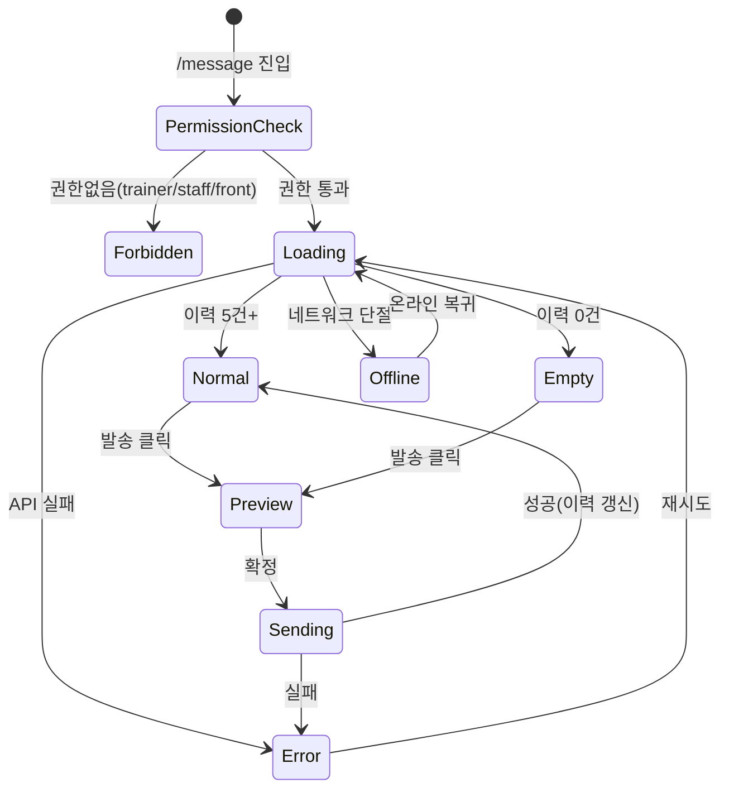

# SCR-071 메시지 발송 — 기본화면 (마스터)

> 이 문서는 **화면 마스터 스펙**입니다. `01~06` 상태 문서는 이 문서를 상속(override/delta)합니다.
> 상태별 파일은 "변경점(델타)만" 기술하며, 이 문서에 정의된 레이아웃/토큰/컴포넌트/데이터/권한/접근성은 **기본값**으로 적용됩니다.

---

## 0. 메타 & 원천 참조

| 항목 | 값 |
|------|----|
| 화면 ID | SCR-071 |
| 화면명 | 메시지 발송 |
| 도메인 | D08-마케팅 |
| 경로 | `/message` |
| Next.js Route Group | `(marketing)` |
| 파일 경로 | `src/app/(marketing)/message/page.tsx` |
| 페이지 컴포넌트 | `MessagePage` |
| 역할 | `superAdmin`, `primary`, `owner`, `manager`, `fc` (발송 가능) / `trainer`, `staff`, `front`, `readonly` (미접근) |
| 우선순위 | P0 (마케팅 핵심 기능) |
| 플랫폼 | 데스크톱(우선) / 태블릿 / 모바일 |
| 멀티테넌트 | ✅ `branchId` 강제 (다른 지점 회원 발송 불가) |

### 원천 문서 링크
| 문서 | 경로 | 섹션 |
|---|---|---|
| 화면설계서 | `docs/화면설계서/마케팅.md` | §SCR-071 메시지 발송 |
| 기능명세서 | `docs/기능명세서/마케팅.md` | §2 메시지 발송 |
| 에러코드정의서 | `docs/에러코드정의서.md` | §4.11 마케팅/쿠폰 (E4xx950~999), §공통 E401~E503 |
| 다이어그램 F1 진입 | `docs/다이어그램/D08_마케팅/SCR-071_메시지발송/F1_진입.md` | 권한 확인 → 데이터 로드 |
| 다이어그램 F2 메인 | `docs/다이어그램/D08_마케팅/SCR-071_메시지발송/F2_메인인터랙션.md` | 발송 폼 + 이력 탭 |
| 다이어그램 F3 버튼액션 | `docs/다이어그램/D08_마케팅/SCR-071_메시지발송/F3_버튼액션.md` | BTN_SEND, BTN_PREVIEW, BTN_VARIABLE |
| 다이어그램 F5 모달트리거 | `docs/다이어그램/D08_마케팅/SCR-071_메시지발송/F5_모달트리거.md` | DLG-071-001 수신자검색, DLG-071-002 미리보기 |
| 다이어그램 F6 상태별 | `docs/다이어그램/D08_마케팅/SCR-071_메시지발송/F6_상태별화면.md` | 로딩/정상/빈/에러/권한/오프라인 |
| 다이어그램 F7 권한 | `docs/다이어그램/D08_마케팅/SCR-071_메시지발송/F7_권한분기.md` | fc까지 발송 가능 |
| 다이어그램 F8 에러 | `docs/다이어그램/D08_마케팅/SCR-071_메시지발송/F8_에러예외.md` | 포인트 부족, API 실패 |
| 권한 매트릭스 | `docs/다이어그램/10_권한매트릭스/R1_역할화면_매트릭스.md` | `/message` 행 |

---

## 1. 화면 목적 (Why)

회원에게 **알림톡/SMS/LMS/앱 푸시**를 수동 발송하고, 예약 발송 및 발송 이력을 확인하는 **마케팅 메시지 허브**.

- 좌: 수동 발송 폼 (채널, 수신자, 메시지 내용, 예약 옵션) + 예상 비용 계산
- 우: 자동 알림 설정 카드 (SCR-072로 이동) + 보유 포인트 표시
- 하단: 최근 발송 이력 5건 (DataTable)
- fc 역할 핵심 업무 — 상담 스크립트 발송, D-7 만료 안내, 재등록 유도
- 본사(super/primary) 사용자는 여러 지점 중 선택한 `branchId`의 회원에게만 발송 가능

---

## 2. 화면 레이아웃 (Wireframe)

### 2.1 풀뷰 와이어프레임 (데스크톱 1440px)

```
┌──────────────────────────────────────────────────────────────────────┐
│ AppLayout [Sidebar | Main]                                           │
│ ┌── PageHeader ──────────────────────────────────────────────────┐   │
│ │ 메시지 발송                                                      │   │
│ │ "회원에게 알림톡·SMS·LMS·앱 푸시를 보내고 이력을 관리합니다"       │   │
│ │                                    [보유 포인트: 52,480 P]      │   │
│ └────────────────────────────────────────────────────────────────┘   │
│ ┌── Tabs ────────────────────────────────────────────────────────┐   │
│ │ [메시지 전송]  [발송 이력]                                         │   │
│ └────────────────────────────────────────────────────────────────┘   │
│ ┌── §A 발신 설정 배너 ────────────────────────────────────────────┐   │
│ │ 발신 번호: [02-1234-5678 ▾]    알림톡 비즈채널: [연동됨 ✅]      │   │
│ └────────────────────────────────────────────────────────────────┘   │
│ ┌── Content 2열 Grid ────────────────────────────────────────────┐   │
│ │ ┌── §B 수동 메시지 발송 (좌 60%) ──┐ ┌── §C 자동 알림 (우 40%) ┐│   │
│ │ │ ▸ 수신자 선택 *                  │ │ 자동 알림 설정           ││   │
│ │ │   [전체][활성][만료D7][PT][장기] │ │                         ││   │
│ │ │   [🔍 직접 선택] — 선택 칩 렌더   │ │ 고객 관련 (7종 토글)    ││   │
│ │ │ ▸ 발송 채널 *                    │ │ 상품 관련 (6종 토글)    ││   │
│ │ │   [알림톡] [SMS/LMS] [푸시]      │ │                         ││   │
│ │ │   · 예상 비용: 800원             │ │ [상세 설정 →]           ││   │
│ │ │ ▸ 메시지 내용 *                   │ │                         ││   │
│ │ │   [Textarea + 글자수 카운터]     │ │                         ││   │
│ │ │   [#이름][#만료일][#상품명]       │ │                         ││   │
│ │ │ ▸ 예약 발송 ☐                    │ │                         ││   │
│ │ │   [날짜] [시간] (체크 시 노출)    │ │                         ││   │
│ │ │                                   │ │                         ││   │
│ │ │              [메시지 발송]         │ │                         ││   │
│ │ └──────────────────────────────────┘ └─────────────────────────┘│   │
│ └────────────────────────────────────────────────────────────────┘   │
│ ┌── §D 최근 발송 이력 (5건) ─────────────────────────────────────┐   │
│ │ 발송일시 | 유형 | 수신자 수 | 예약일시 | 상태 | 액션            │   │
│ └────────────────────────────────────────────────────────────────┘   │
└──────────────────────────────────────────────────────────────────────┘
```

### 2.2 영역 그리드
| 영역 | 그리드 | 비고 |
|---|---|---|
| §A 발신 설정 | `flex items-center justify-between` | 1줄 배너 |
| §B+§C | `grid grid-cols-1 lg:grid-cols-5 gap-6` (B=col-span-3, C=col-span-2) | 태블릿 1열 |
| §D 이력 | `w-full` | DataTable |

---

## 3. 디자인 토큰

### 3.1 색상
| 토큰 | 클래스 | 용도 |
|---|---|---|
| bg.page | `bg-gray-50` | 전체 배경 |
| bg.card | `bg-white rounded-xl shadow-sm ring-1 ring-gray-100 p-6` | 발송 카드/자동알림 카드 |
| bg.banner | `bg-blue-50 ring-1 ring-blue-100 text-blue-800` | 발신 설정 배너 |
| channel.kakao | `bg-yellow-50 text-yellow-800 ring-yellow-200` | 알림톡 탭 선택 |
| channel.sms | `bg-blue-50 text-blue-800 ring-blue-200` | SMS/LMS 선택 |
| channel.push | `bg-emerald-50 text-emerald-800 ring-emerald-200` | 앱 푸시 선택 |
| chip.group | `bg-blue-600 text-white text-xs px-3 py-1.5 rounded-full` | 수신자 그룹 칩 |
| chip.count | `bg-gray-100 text-gray-700 text-xs px-2 py-1 rounded-full` | 선택 수신자 수 |
| cost.primary | `text-blue-700 font-semibold tabular-nums` | 예상 비용 강조 |
| counter.ok | `text-gray-500` | 글자수 정상 |
| counter.warn | `text-amber-600` | 80% 초과 |
| counter.err | `text-rose-600` | 한도 초과 |
| point.positive | `bg-emerald-50 text-emerald-700 ring-emerald-100` | 보유 포인트 충분 |
| point.low | `bg-amber-50 text-amber-800 ring-amber-200` | 포인트 부족 경고 |

### 3.2 타이포그래피
| 토큰 | 스타일 | 용도 |
|---|---|---|
| page.title | `text-2xl font-bold tracking-tight text-gray-900` | "메시지 발송" |
| page.subtitle | `text-sm text-gray-500` | 보조 설명 |
| section.title | `text-base font-semibold text-gray-900 mb-3` | §B/§C 타이틀 |
| field.label | `text-sm font-medium text-gray-700 mb-1.5` | 폼 라벨 |
| field.required | `text-rose-500 ml-1` | `*` 필수 마크 |
| textarea.body | `text-sm text-gray-900 placeholder-gray-400` | 메시지 입력 |
| meta.cost | `text-sm text-gray-600` · 숫자: `tabular-nums font-semibold text-blue-700` | 예상 비용 |
| history.time | `text-xs text-gray-500 tabular-nums` | 발송일시 |

### 3.3 간격 / 반경 / 그림자
| 토큰 | 값 |
|---|---|
| card.radius | `rounded-xl` |
| section.gap | `space-y-6` |
| field.gap | `space-y-4` |
| page.padding | `px-6 lg:px-8 py-6` |

### 3.4 모션
- 발송 버튼 loading: `animate-spin` (Loader2)
- 글자수 카운터 전환: `transition-colors duration-150`
- 발신 배너 등장: `animate-[fadeIn_150ms]`
- `prefers-reduced-motion`: 모든 transition 제거

---

## 4. 반응형 규칙

| BP | 폭 | §B(발송 폼) | §C(자동알림) | §D(이력) | Sidebar |
|---|---|---|---|---|---|
| Mobile <640 | 100% | 1열 | 접힘(아코디언) | 카드 스택 | 드로어 |
| Tablet 640~1024 | 100% | 1열 | 1열 (B 아래) | 테이블 스크롤 | 축약 |
| Desktop ≥1024 | sidebar+main | 3/5 | 2/5 | 풀 테이블 | 펼침 |
| XL ≥1440 | max-w-7xl | 3/5 | 2/5 | 풀 + 엑셀 | 펼침 |

모바일: 수신자 그룹 버튼 가로 스크롤(`overflow-x-auto snap-x`).

---

## 5. 🔐 역할별(RBAC) 매트릭스

> `●` = 표시+CRUD 가능, `○` = 표시만(읽기), `—` = 미표시/접근불가

| 요소 | superAdmin/primary | owner | manager | fc | trainer | staff | front | readonly |
|---|:---:|:---:|:---:|:---:|:---:|:---:|:---:|:---:|
| **페이지 접근** | ● | ● | ● | ● | — | — | — | — |
| 수동 발송 폼 | ● | ● | ● | ● | — | — | — | — |
| 수신자 "전체" 버튼 | ● | ● | ● | ●(확인 경고) | — | — | — | — |
| 예약 발송 | ● | ● | ● | ● | — | — | — | — |
| 발송 이력(본인) | ● | ● | ● | ● | — | — | — | — |
| 발송 이력(전 직원) | ●(전 지점) | ●(본 지점) | ● | — | — | — | — | — |
| 이력 엑셀 다운로드 | ● | ● | ● | ○(본인 건만) | — | — | — | — |
| 자동 알림 카드 이동 | ● | ● | ● | ○(읽기) | — | — | — | — |
| 발신번호 변경 | ● | ● | — | — | — | — | — | — |
| 포인트 충전 이동 | ● | ● | — | — | — | — | — | — |

권한 없는 역할: 403 → `05-권한없음` 상태 또는 `/forbidden` 리다이렉트.

---

## 6. 컴포넌트 트리

```
<AppLayout role={user.role}>
  <PageHeader title="메시지 발송" subtitle="회원에게 알림톡·SMS·LMS·앱 푸시를 보내고 이력을 관리합니다">
    <PointBadge value={points} variant={points>10_000?'positive':'low'} />
  </PageHeader>

  <Tabs value={activeTab} onChange={setActiveTab}>
    <Tab value="send">메시지 전송</Tab>
    <Tab value="history">발송 이력</Tab>
  </Tabs>

  {activeTab === 'send' && (
    <>
      <SenderSettingBanner phone={senderPhone} kakaoActive={kakaoActive} onChangePhone={canChangePhone ? openSenderDlg : undefined} />

      <div className="grid grid-cols-1 lg:grid-cols-5 gap-6">
        {/* §B 수동 발송 */}
        <section className="lg:col-span-3 card">
          <h2 className="section.title">수동 메시지 발송</h2>
          <RecipientGroupChips value={recipientGroup} onChange={setGroup} onSearchOpen={openDlg071_001} />
          <RecipientPreview items={selectedRecipients} count={recipientCount} />
          <ChannelToggle value={channel} onChange={setChannel} messageLen={content.length} />
          <CostHint channel={channel} count={recipientCount} bytes={content.length} />
          <MessageEditor value={content} onChange={setContent}
                         maxLen={channel==='kakao'?1000:channel==='sms'?2000:500}
                         variables={['#{이름}','#{만료일}','#{상품명}','#{잔여횟수}','#{센터명}']} />
          <ScheduleField enabled={scheduleEnabled} onToggle={setScheduleEnabled}
                         date={scheduleDate} time={scheduleTime}
                         onChangeDate={setScheduleDate} onChangeTime={setScheduleTime} />
          <Button size="lg" variant="primary"
                  disabled={!canSubmit || isSending}
                  loading={isSending}
                  onClick={openDlg071_002}>
            {scheduleEnabled ? '메시지 예약' : '메시지 발송'}
          </Button>
        </section>

        {/* §C 자동 알림 */}
        <aside className="lg:col-span-2 card">
          <h2 className="section.title">자동 알림 설정</h2>
          <AutoAlarmSummary customerCount={7} productCount={6} enabledCount={enabledRules.length} />
          <Button variant="secondary" onClick={() => router.push('/message/auto-alarm')}>
            상세 설정 →
          </Button>
        </aside>
      </div>

      {/* §D 최근 이력 */}
      <section>
        <h2 className="section.title">최근 발송 이력</h2>
        <MessageHistoryTable items={recentMessages.slice(0,5)} onRowClick={goToDetail} />
      </section>
    </>
  )}

  {activeTab === 'history' && <MessageHistoryFullTable q={historyQ} onExport={exportExcel} />}

  <DlgRecipientSearch open={dlg001Open} onSelect={setSelected} onClose={closeDlg001} />
  <DlgSendPreview open={dlg002Open} payload={payload} onConfirm={confirmSend} onCancel={closeDlg002} />
</AppLayout>
```

### 6.1 핵심 컴포넌트
| 컴포넌트 | 파일 | Props |
|---|---|---|
| `PageHeader` | `src/components/layout/PageHeader.tsx` | `{title, subtitle, children}` |
| `PointBadge` | `src/components/marketing/PointBadge.tsx` | `{value, variant}` |
| `SenderSettingBanner` | `src/components/marketing/SenderSettingBanner.tsx` | `{phone, kakaoActive, onChangePhone}` |
| `RecipientGroupChips` | `src/components/marketing/RecipientGroupChips.tsx` | `{value, onChange, onSearchOpen}` |
| `ChannelToggle` | `src/components/marketing/ChannelToggle.tsx` | `{value, onChange, messageLen}` |
| `CostHint` | `src/components/marketing/CostHint.tsx` | `{channel, count, bytes}` |
| `MessageEditor` | `src/components/marketing/MessageEditor.tsx` | `{value, onChange, maxLen, variables}` |
| `ScheduleField` | `src/components/marketing/ScheduleField.tsx` | `{enabled, date, time, ...}` |
| `MessageHistoryTable` | `src/components/marketing/MessageHistoryTable.tsx` | `{items, onRowClick}` |
| `DlgRecipientSearch` | `src/components/marketing/DlgRecipientSearch.tsx` | `{open, onSelect, onClose}` |
| `DlgSendPreview` | `src/components/marketing/DlgSendPreview.tsx` | `{open, payload, onConfirm, onCancel}` |

---

## 7. 데이터 계약

### 7.1 타입
```ts
type MessageChannel = 'kakao' | 'sms' | 'lms' | 'push';
type MessageStatus = 'PENDING' | 'SENT' | 'FAILED' | 'SCHEDULED';

interface MessageInput {
  branchId: number;
  channel: MessageChannel;
  recipientIds: number[];         // 빈 배열이면 useAllMembers=true + 서버가 활성 전체로 확장
  useAllMembers?: boolean;
  groupPreset?: 'all'|'active'|'expiringD7'|'pt'|'absent30';
  content: string;                // 변수 치환 전 원본
  scheduledAt?: string | null;    // ISO, null이면 즉시
  senderPhone: string;
}
interface MessageLog {
  id: number;
  branchId: number;
  channel: MessageChannel;
  title: string | null;
  content: string;
  recipients: Array<{memberId: number, phone: string}>;
  recipientCount: number;
  cost: number;
  status: MessageStatus;
  sentAt: string | null;
  scheduledAt: string | null;
  senderUserId: number;
  senderUserName: string;
  resultCode?: string;            // 0000 / 4001 / 4004 / 4005 / 5001 / 5002
  errorMessage?: string;
  createdAt: string;
}
interface PointBalance { branchId: number; balance: number; updatedAt: string; }
```

### 7.2 API 엔드포인트
| 엔드포인트 | 메서드 | 파라미터 | 반환 |
|---|---|---|---|
| `GET /marketing/messages` | GET | `{branchId, limit=5}` | `MessageLog[]` |
| `GET /marketing/messages/history` | GET | `{branchId, page, pageSize, channel?, status?, from?, to?}` | `{items, total}` |
| `POST /marketing/messages` | POST | `MessageInput` | `{id, status, estimatedCost}` |
| `GET /marketing/points` | GET | `{branchId}` | `PointBalance` |
| `GET /marketing/sender-phones` | GET | `{branchId}` | `SenderPhone[]` |
| `GET /marketing/auto-alarm/enabled` | GET | `{branchId}` | `{enabledIds: string[]}` |
| `GET /members/search` | GET | `{branchId, q, limit=50}` | `Member[]` |

### 7.3 상태 관리
- **Store**: `useAuthStore` (user/role/branchId), `useMarketingStore` (senderPhone, points)
- **Fetching**: React Query 병렬 호출, `staleTime: 60_000`
- **Form**: `useState` 로컬 (제출 시 zod validate)
- **Cache 갱신**: 발송 성공 시 `qc.invalidateQueries(['messages'])` + `['points']`

### 7.4 멀티테넌트 branchId 규칙
- 모든 쿼리에 `branchId = useAuthStore.branchId` 강제
- super/primary가 `?branch=` 조작 시 서버 검증 후 403이면 `/forbidden`
- 발송 대상 회원 검색 시 다른 지점 `memberId` 주입 차단 (서버 이중 검증)

---

## 8. 비즈니스 룰

### 8.1 채널 & 비용
1. **SMS/LMS 자동 전환**: `channel='sms'` 선택 시 메시지 길이에 따라 서버가 결정
   - ≤ 90자: SMS (70원/건), `label="SMS"`
   - > 90자: LMS (30원/건), `label="LMS"`
2. **알림톡**: 1,000자 한도, 8원/건. 템플릿 사전 승인 필요.
3. **푸시**: 500자 한도, 0원(무료).
4. **예상 비용**: `수신자수 × 건당비용` 실시간 계산, 포인트 부족 시 경고 + 버튼 비활성.

### 8.2 수신자 선택
5. 수신자 0명 상태로 발송 버튼 비활성.
6. "전체" 선택 시 `useAllMembers=true` + 확인 토스트 "전체 회원 {N}명에게 발송합니다".
7. 그룹 프리셋 5종: 전체 / 활성 / 만료D-7 / PT / 장기미출석30일+
8. 다른 지점 회원 수동 주입 시도 → 서버 403.
9. 수신 거부 회원은 서버가 자동 제외 (결과 코드 4004).

### 8.3 발송/예약
10. **중복 발송 방지**: `isSending=true` 동안 버튼 `disabled`.
11. **미리보기 필수**: 발송 버튼 클릭 시 DLG-071-002 미리보기 모달 → [발송하기] 확정.
12. **예약 발송**: `scheduledAt > now()+5분` 조건. 과거 시간 입력 시 인라인 에러.
13. **즉시 발송**: `status='PENDING'` → 게이트웨이 응답 후 `SENT`/`FAILED`.
14. **야간 발송 제한** (21:00~08:00): 수신자 동의 여부 무관 강제 차단 (광고성 메시지 한정).

### 8.4 변수 치환
15. `#{이름} #{만료일} #{상품명} #{잔여횟수} #{센터명}` 5종. 서버 렌더 시 개별 회원 데이터로 치환.
16. 미정의 변수 발견 시 경고 toast "정의되지 않은 변수: #{xxx}".

### 8.5 권한 & 포인트
17. fc는 본인 발송 이력만 조회. manager 이상은 본 지점 전체 조회.
18. 포인트 잔액 < 예상 비용 → 발송 버튼 disabled + amber 경고 배너 "포인트가 부족합니다. 충전 필요."
19. owner만 포인트 충전 페이지 진입 가능.

### 8.6 감사 로그
20. 성공: `AUDIT.MESSAGE_SENT` (channel, recipientCount, cost). 실패: `AUDIT.MESSAGE_FAILED` (errorCode).

---

## 9. 상태 목록

| 파일 | 상태 코드 | 한글 | 트리거 |
|---|---|---|---|
| `01-로딩.md` | `loading` | 로딩(스켈레톤) | 진입 직후 |
| `02-정상-이력있음.md` | `normal-with-history` | 정상 (이력 있음) | 5건+ 이력 존재 |
| `03-빈이력.md` | `empty-history` | 발송 이력 없음 | 첫 사용자 |
| `04-에러.md` | `error` | API 에러 | 500/503, 포인트 API 실패 |
| `05-권한없음.md` | `forbidden` | 권한 없음 | trainer/staff/front 진입 |
| `06-오프라인.md` | `offline` | 오프라인 | navigator.onLine=false |

상태 전이 그래프: `docs/다이어그램/D08_마케팅/SCR-071_메시지발송/F6_상태별화면.md`.

---

## 10. 에러 코드 매핑

| errorCode | HTTP | 시나리오 | 사용자 메시지 | 표시 |
|---|---|---|---|---|
| E401001 | 401 | 세션 만료 | 로그인이 필요합니다 | `/login?redirect=/message` |
| E403001 | 403 | 권한 없음 | 접근 권한이 없습니다 | `05-권한없음` |
| E400950 | 400 | 필수 정보 누락 | 수신자/내용을 확인해주세요 | 인라인 필드 에러 |
| E422950 | 422 | 발송 불가 상태 | 메시지를 발송할 수 없습니다 | 토스트 + 재시도 |
| E429950 | 429 | Rate limit | 잠시 후 다시 시도해주세요 | 30초 쿨다운 |
| E402951 | 402 | 포인트 부족 | 포인트가 부족합니다 | amber 배너 + 충전 링크 |
| E500950 | 500 | 게이트웨이 오류 | 발송 중 오류가 발생했습니다 | 토스트 + 재시도 |
| E503950 | 503 | SMS/카카오 API 장애 | 발송 서비스 점검 중입니다 | 상단 경고 배너 |
| NETWORK | — | 오프라인 | 네트워크 연결을 확인해주세요 | `06-오프라인` |

---

## 11. 접근성 (WCAG 2.1 AA)
- 폼: `<form role="form" aria-labelledby="send-title">`
- 수신자 그룹 칩: `role="radiogroup" aria-label="수신자 프리셋"`, 각 칩 `role="radio" aria-checked`
- 채널 토글: `role="radiogroup" aria-label="발송 채널"`
- 글자수 카운터: `aria-live="polite"` (한도 초과 시 `aria-live="assertive"`)
- 예상 비용: `aria-live="polite"` (수신자/채널 변경 시 공지)
- 에러 배너: `role="alert" aria-live="assertive"`
- 포커스 순서: 그룹 칩 → 직접 선택 → 채널 → 내용 → 변수 버튼 → 예약 → 발송
- 미리보기 모달: `role="dialog" aria-modal="true"`, Esc 닫기, 첫 포커스 [취소] 버튼
- `prefers-reduced-motion`: 버튼 로딩 스피너 회전 감속

---

## 12. 진입 / 이탈

### 진입
- 사이드바 > 마케팅 > 메시지 발송
- 회원 상세에서 "메시지 보내기" 버튼 → 수신자 프리필
- 자동 알림 설정(SCR-072) 뒤로가기

### 이탈
| 액션 | 목적지 |
|---|---|
| "상세 설정 →" | `/message/auto-alarm` (SCR-072) |
| 발송 이력 엑셀 | 파일 다운로드 |
| 이력 행 클릭 | 발송 상세 모달 |
| 포인트 부족 배너 "충전" | `/settings/points` (owner 전용) |
| DLG-071-001 검색 | 수신자 선택 완료 |
| DLG-071-002 미리보기 | 발송 실행 → toast |

---

## 13. 다이어그램 통합 뷰



---

## 14. 🧩 바이브코딩 프롬프트 (마스터)

```
Next.js 15 App Router + TypeScript + Tailwind v4 + React Query + Supabase + zod 기반
'use client' 컴포넌트를 작성하라.

━━ 화면: SCR-071 메시지 발송 (마스터, 멀티테넌트) ━━
파일: src/app/(marketing)/message/page.tsx
보조:
- src/components/marketing/{PointBadge, SenderSettingBanner, RecipientGroupChips,
   ChannelToggle, CostHint, MessageEditor, ScheduleField,
   MessageHistoryTable, DlgRecipientSearch, DlgSendPreview}.tsx
- src/hooks/useMessages.ts
- src/lib/message-cost.ts  (channelCost, byteLengthKorean)
- src/schemas/message.ts   (messageInputSchema)

━━ 멀티테넌트 ━━
- branchId = useAuthStore().user.branchId (강제)
- super/primary가 URL ?branch= 조작 시 서버 검증, 실패면 /forbidden
- 수동 수신자 선택은 본 지점 회원만 필터링

━━ 레이아웃 ━━
<main className="min-h-screen bg-gray-50">
  <AppLayout role={role}>
    <div className="px-6 lg:px-8 py-6 space-y-6 max-w-7xl mx-auto">
      <PageHeader title="메시지 발송"
                  subtitle="회원에게 알림톡·SMS·LMS·앱 푸시를 보내고 이력을 관리합니다">
        <PointBadge value={points} variant={points>10_000?'positive':'low'} />
      </PageHeader>

      <Tabs value={activeTab} onChange={setActiveTab}
            items={[{v:'send',l:'메시지 전송'},{v:'history',l:'발송 이력'}]} />

      <SenderSettingBanner phone={senderPhone} kakaoActive={kakaoActive}
                           onChangePhone={canChangePhone ? openSenderDlg : undefined} />

      <div className="grid grid-cols-1 lg:grid-cols-5 gap-6">
        <section className="lg:col-span-3 bg-white rounded-xl shadow-sm ring-1 ring-gray-100 p-6 space-y-4">
          <h2 className="text-base font-semibold text-gray-900">수동 메시지 발송</h2>
          <RecipientGroupChips value={group} onChange={setGroup}
                                onSearchOpen={() => setDlg001(true)} />
          <RecipientPreview items={selected} count={recipientCount} />
          <ChannelToggle value={channel} onChange={setChannel}
                          messageLen={content.length} />
          <CostHint channel={channel} count={recipientCount} bytes={content.length} />
          <MessageEditor value={content} onChange={setContent}
                          maxLen={channel==='kakao'?1000:channel==='sms'?2000:500}
                          variables={['#{이름}','#{만료일}','#{상품명}','#{잔여횟수}','#{센터명}']} />
          <ScheduleField enabled={scheduleEnabled} date={scheduleDate} time={scheduleTime}
                          onToggle={setScheduleEnabled}
                          onChangeDate={setScheduleDate} onChangeTime={setScheduleTime} />
          <Button size="lg" variant="primary"
                  disabled={!canSubmit || isSending || points<estimatedCost}
                  loading={isSending}
                  onClick={() => setDlg002(true)}>
            {scheduleEnabled ? '메시지 예약' : '메시지 발송'}
          </Button>
        </section>
        <aside className="lg:col-span-2 bg-white rounded-xl shadow-sm ring-1 ring-gray-100 p-6">
          <h2 className="text-base font-semibold text-gray-900 mb-3">자동 알림 설정</h2>
          <AutoAlarmSummary ... />
          <Button variant="secondary" onClick={() => router.push('/message/auto-alarm')}>
            상세 설정 →
          </Button>
        </aside>
      </div>

      <section>
        <h2 className="text-base font-semibold text-gray-900 mb-3">최근 발송 이력</h2>
        <MessageHistoryTable items={recentMessages.slice(0,5)} />
      </section>
    </div>
  </AppLayout>
</main>

━━ 디자인 토큰 ━━
bg.page:     bg-gray-50
card:        bg-white rounded-xl shadow-sm ring-1 ring-gray-100 p-6
banner:      bg-blue-50 ring-1 ring-blue-100 text-blue-800 p-4 rounded-lg
chip.group:  bg-blue-600 text-white text-xs px-3 py-1.5 rounded-full
             (비활성 - bg-white ring-1 ring-gray-300 text-gray-700)
cost.value:  text-blue-700 font-semibold tabular-nums
counter.ok:  text-gray-500
counter.warn:text-amber-600
counter.err: text-rose-600
btn.primary: h-12 rounded-lg bg-blue-600 hover:bg-blue-700 text-white disabled:bg-gray-300

━━ 데이터 훅 (useMessages.ts) ━━
export function useMessages(branchId: number) {
  const [recent, history, points, senderPhones] = useQueries([
    { queryKey:['messages','recent',branchId],     queryFn:() => api.getMessages({branchId, limit:5}) },
    { queryKey:['messages','history',branchId,f],  queryFn:() => api.getHistory({branchId,...f}) },
    { queryKey:['points',branchId],                queryFn:() => api.getPoints(branchId) },
    { queryKey:['sender-phones',branchId],         queryFn:() => api.getSenderPhones(branchId) },
  ]);
  const send = useMutation({
    mutationFn: (input: MessageInput) => api.sendMessage(input),
    onSuccess: () => {
      qc.invalidateQueries(['messages']);
      qc.invalidateQueries(['points']);
      toast.success(input.scheduledAt ? '메시지 예약이 완료되었습니다.' : '메시지가 발송되었습니다.');
    },
    onError: (e) => handleMessageError(e),
  });
  return { recent, history, points, senderPhones, send };
}

━━ 비용 계산 (lib/message-cost.ts) ━━
export function estimateCost(channel: MessageChannel, count: number, content: string): number {
  if (channel === 'push') return 0;
  if (channel === 'kakao') return count * 8;
  const isLMS = content.length > 90;
  return count * (isLMS ? 30 : 70);
}

━━ 인터랙션 ━━
- 그룹 칩 클릭 → recipientIds 재계산 + 예상 비용 재계산
- 채널 변경 → 글자수 한도 갱신 + 카운터 재평가
- #{변수} 버튼 클릭 → textarea 커서 위치 삽입
- 예약 체크 → 날짜/시간 필드 등장, 과거 시간 입력 시 border-rose-300
- "메시지 발송" → DLG-071-002 미리보기 모달 → [발송하기] → mutate()
- 에러: 402(포인트 부족) → amber 배너 "포인트가 부족합니다. 관리자에게 문의하세요"
- 중복 클릭: isSending 중 버튼 disabled
- 야간 발송(21~08시): 서버가 거부, 4004 결과로 상태 표시

━━ 접근성 ━━
- form role="form" aria-labelledby="send-title"
- 수신자 그룹: role="radiogroup" / 각 칩 role="radio" aria-checked
- 글자수 aria-live="polite", 한도 초과 시 assertive
- 예상 비용 aria-live="polite"
- 에러 배너 role="alert"
- Esc: 모달 닫기
- reduced-motion: loading spinner 감속

━━ 반응형 ━━
- 모바일(<640): 2열 grid 해제 → 1열, 그룹 칩 가로 스크롤
- 태블릿(<1024): §C 자동알림이 §B 아래로
- 데스크톱(≥1024): 3:2 grid
- XL(≥1440): max-w-7xl 유지
```

---

## 15. QA 체크리스트 (수용 기준)

- [ ] 권한 있는 역할(owner/manager/fc/super/primary)만 페이지 렌더, 나머지는 403 또는 `05-권한없음`
- [ ] branchId 강제: 다른 지점 회원 발송 시 서버 403
- [ ] 수신자 0명 시 발송 버튼 disabled
- [ ] 채널 변경 시 글자수 한도 즉시 갱신
- [ ] SMS 91자 이상 → LMS 라벨 + 30원 단가 표시
- [ ] 수신자 100명 + 알림톡 → 예상 800원
- [ ] 포인트 부족 시 amber 배너 + 발송 버튼 disabled
- [ ] 예약 체크 → 날짜/시간 노출, 과거 시간 인라인 에러
- [ ] 즉시 발송 → 성공 toast + 이력 즉시 갱신
- [ ] 예약 발송 → `SCHEDULED` 상태 + toast "메시지 예약이 완료되었습니다"
- [ ] 중복 클릭 방지(isSending 체크)
- [ ] DLG-071-002 미리보기 → [취소]/[발송] 모두 정상 동작
- [ ] 이력 엑셀 다운로드(fc는 본인 건만)
- [ ] 오프라인 시 `06-오프라인` 상태로 전환, 복귀 시 자동 재조회
- [ ] 접근성: Tab 순서, SR 공지, reduced-motion
- [ ] 멀티테넌트 데이터 누수 없음 (서버 스코프 검증)
