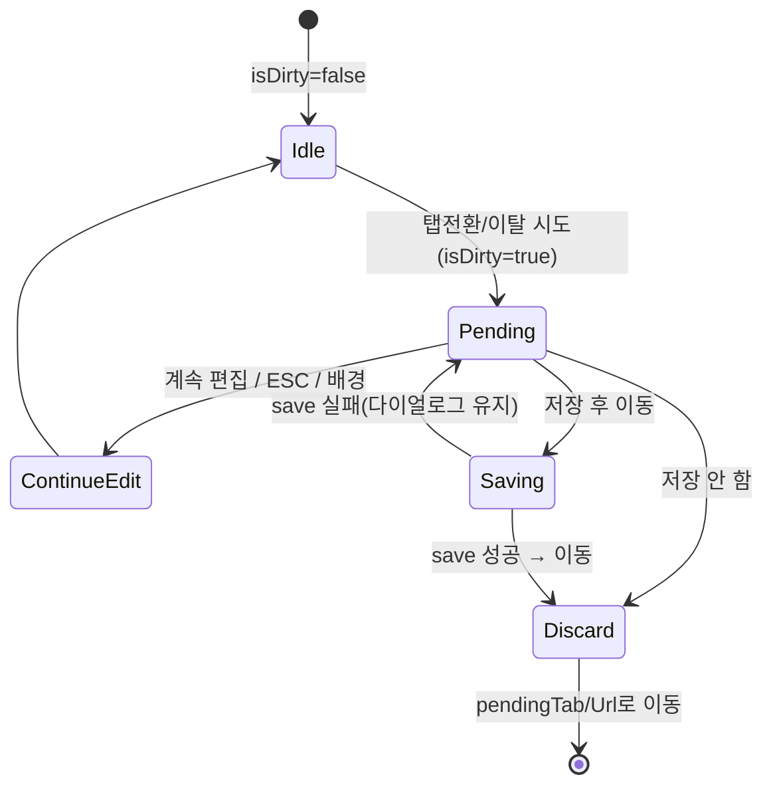

# DLG-080-001 미저장 경고 — 기본화면 (마스터)

> 이 문서는 **다이얼로그 마스터 스펙**입니다. `01~03` 상태 문서는 이 문서를 상속(override/delta)합니다.
> ⚠ **경고 다이얼로그(warning)**: 센터 설정(SCR-080)에서 탭 전환/페이지 이탈 시 `isDirty=true` 상태에서 자동 오픈되는 미저장 보호 장치.

---

## 0. 메타 & 원천 참조

| 항목 | 값 |
|------|----|
| 다이얼로그 ID | DLG-080-001 |
| 다이얼로그명 | 미저장 경고 (센터 설정) |
| 도메인 | D09-설정관리 |
| 부모 화면 | SCR-080 센터 설정 |
| 트리거 조건 | `isDirty===true` + (탭 전환 / 라우터 이동 / 뒤로가기 / beforeunload / 사이드바 이동) |
| 확인 레벨 | L1 (경고, warning) |
| 서버 호출 | ❌ 클라이언트 전용 (단, "저장 후 이동" 선택 시 부모 save 트리거) |
| 닫기 옵션 | ✅ ESC/배경/X = "계속 편집"과 동일 |
| 역할 | superAdmin, primary, owner, manager (SCR-080 편집 권한 보유 역할) |
| 파일 경로 | `src/components/settings/UnsavedWarningDialog.tsx` (DLG-002 공용 LeaveWarningDialog 파생) |
| 우선순위 | P1 |

### 원천 문서 링크

| 문서 | 경로 | 섹션 |
|---|---|---|
| 화면설계서 | `docs/화면설계서/설정관리.md` | §11 DLG-080-001, SCR-080 §10 저장 버튼 상태 |
| 기능명세서 | `docs/기능명세서/설정관리.md` | §1 센터 설정 → 미저장 경고 로직 |
| 공통 DLG-002 | `docs/화면설계서/D01-공통/DLG-002-이탈경고/00-기본화면.md` | 상속 기준 |
| 다이어그램 | `docs/다이어그램/D09_설정관리/DLG/DLG-080-001_미저장경고/` | M1 생명주기 / M2 검증 / M3 결과분기 |
| 에러코드 | `docs/에러코드정의서.md` | §4.10 지점/설정 (E4xx900~949) |

---

## 1. 다이얼로그 목적 (Why)

센터 설정은 **영업시간·상권·테마·물품 수량** 등 운영에 직접 영향을 주는 데이터이다.
- 기본정보/알림/테마/물품 4개 탭을 편집 중 실수로 탭 이동 또는 페이지 이탈 시 변경 소실 방지
- "저장 후 이동" 액션을 통해 의도적 이동 경로 제공
- 사이드바의 다른 설정(권한, 키오스크, IoT 등) 클릭 시에도 동일하게 경고

---

## 2. 화면 레이아웃 (Wireframe)

```
  backdrop: bg-black/40
  ┌─────────────────────────────────────┐
  │  ┌─────────────────────────────┐    │
  │  │ ⚠ 저장되지 않은 변경사항  [X]│    │ ← Header (amber)
  │  │                             │    │
  │  │ {탭이동|페이지이탈} 시       │    │ ← Body
  │  │ 변경 사항이 사라집니다.       │    │
  │  │                             │    │
  │  │ 변경된 항목: 3개 필드         │    │ ← (옵션) 변경 요약
  │  │   • 센터명                   │    │
  │  │   • 영업시간(평일)            │    │
  │  │   • 수건(대) 재고             │    │
  │  │                             │    │
  │  │ [계속 편집][저장 안 함][저장 후 이동]│ ← Footer
  │  └─────────────────────────────┘    │
  └─────────────────────────────────────┘
```

| 영역 | 치수 | 역할 |
|---|---|---|
| Backdrop | `fixed inset-0 bg-black/40 z-40` | 배경 |
| Modal | `max-w-md` | 카드 |
| Header | 48px | 아이콘/제목/X |
| Body | auto (최대 200px) | 본문 + 변경 요약 |
| Footer | 64px | 3-버튼 (mobile 세로 스택) |

### 버튼 변형

| 패턴 | 버튼 구성 | 조건 |
|---|---|---|
| 3-버튼 기본 | [계속 편집] [저장 안 함] [저장 후 이동] | 저장 권한 보유 + isDirty=true |
| 2-버튼(읽기전용 예외) | [계속 편집] [저장 안 함] | (있다면 — 실제로는 편집 권한 없으면 isDirty=false 유지로 DLG 오픈 안 됨) |

---

## 3. 디자인 토큰

### 3.1 색상

| 토큰 | 클래스 | 용도 |
|---|---|---|
| backdrop | `fixed inset-0 bg-black/40 z-40` | 배경 |
| card | `bg-white rounded-2xl shadow-xl ring-1 ring-gray-100` | 카드 |
| icon.warn.wrap | `bg-amber-50 rounded-full size-10` | 아이콘 래퍼 |
| icon.warn | `text-amber-500` | `AlertTriangle` |
| changed.pill | `bg-amber-50 border border-amber-200 text-amber-800 rounded-md px-2 py-0.5 text-xs` | 변경 항목 pill |
| btn.continue | `border border-gray-300 bg-white hover:bg-gray-50 text-gray-700` | Secondary (계속 편집) |
| btn.discard | `text-rose-600 hover:bg-rose-50` | Ghost-Danger (저장 안 함) |
| btn.save-leave | `bg-blue-600 hover:bg-blue-700 text-white` | Primary (저장 후 이동) |

### 3.2 타이포

| 토큰 | 값 |
|---|---|
| title | `text-lg font-semibold text-gray-900` |
| body | `text-sm text-gray-600 leading-relaxed` |
| list.item | `text-xs text-gray-600` |
| button | `text-sm font-medium` |

### 3.3 간격/반경/모션

- radius: `rounded-2xl`
- padding: `p-6`
- enter: `animate-[fadeInUp_140ms_ease-out] motion-reduce:animate-none`
- list: `space-y-1 max-h-24 overflow-y-auto`

---

## 4. 반응형 규칙

| BP | 모달 | 버튼 레이아웃 |
|---|---|---|
| Mobile <640 | `max-w-xs w-[calc(100%-32px)]` | 세로 스택, 위험 액션 맨 아래 |
| Tablet ~1024 | `max-w-md` | 가로 우측 정렬 |
| Desktop ≥1024 | `max-w-md` | 가로 우측 정렬 |

모바일 3-버튼 세로: [계속 편집] → [저장 후 이동] → [저장 안 함] (위험 액션 마지막)

---

## 5. 🔐 역할별(RBAC) 매트릭스

> SCR-080 편집 권한을 가진 역할만 `isDirty` 에 진입 → DLG 자동 노출.

| 요소 | superAdmin | primary | owner | manager | fc | trainer | staff | front |
|---|:---:|:---:|:---:|:---:|:---:|:---:|:---:|:---:|
| **SCR-080 편집 접근** | ● | ● | ● | ● | — | — | — | — |
| DLG 자동 오픈(isDirty) | ● | ● | ● | ● | — | — | — | — |
| "계속 편집" | ● | ● | ● | ● | — | — | — | — |
| "저장 안 함" | ● | ● | ● | ● | — | — | — | — |
| "저장 후 이동" | ● | ● | ● | ● | — | — | — | — |
| ESC/배경 닫기 | ● | ● | ● | ● | — | — | — | — |

### 멀티테넌트
- `branchId` 스코프로 저장(SCR-080 §12 API). 다른 지점 설정 수정 시도 시 서버 E403003 반환
- superAdmin은 원격 지점 설정 편집 시 헤더에 `지점: {branchName}` 표기 필수

---

## 6. 컴포넌트 트리

```tsx
<Portal>
  <div role="alertdialog" aria-modal="true"
       aria-labelledby="unsaved-title" aria-describedby="unsaved-desc"
       className="fixed inset-0 z-40 flex items-center justify-center bg-black/40 px-4">
    <div className="w-full max-w-md bg-white rounded-2xl shadow-xl ring-1 ring-gray-100 p-6 space-y-4
                    motion-reduce:animate-none animate-[fadeInUp_140ms_ease-out]">
      <header className="flex items-start gap-3">
        <span className="flex size-10 items-center justify-center rounded-full bg-amber-50 shrink-0">
          <AlertTriangle className="size-5 text-amber-500" aria-hidden />
        </span>
        <div className="flex-1">
          <h2 id="unsaved-title" className="text-lg font-semibold text-gray-900">저장되지 않은 변경사항</h2>
          <p id="unsaved-desc" className="text-sm text-gray-600 leading-relaxed mt-1">
            {trigger === 'tab'
              ? '탭을 이동하면 변경 사항이 사라집니다.'
              : '페이지를 벗어나면 변경 사항이 사라집니다.'}
          </p>
        </div>
        <button aria-label="닫기" onClick={onContinueEditing} disabled={saving}>
          <X className="size-4" />
        </button>
      </header>
      {dirtyFields?.length > 0 && (
        <div className="space-y-1">
          <div className="text-xs text-gray-500">변경된 항목: {dirtyFields.length}개</div>
          <ul className="space-y-1 max-h-24 overflow-y-auto">
            {dirtyFields.map(f => (
              <li key={f.path} className="text-xs text-gray-600">• {f.label}</li>
            ))}
          </ul>
        </div>
      )}
      <div className="flex flex-col sm:flex-row sm:justify-end gap-2 pt-2">
        <Button ref={continueBtnRef} variant="secondary" onClick={onContinueEditing}>계속 편집</Button>
        <Button variant="primary" onClick={onSaveAndLeave} loading={saving}>저장 후 이동</Button>
        <Button variant="ghost-danger" onClick={onDiscard}>저장 안 함</Button>
      </div>
    </div>
  </div>
</Portal>
```

### 컴포넌트 명세

| 컴포넌트 | Props | 재사용 여부 |
|---|---|---|
| `UnsavedWarningDialog` | `{isOpen, trigger:'tab'|'route', dirtyFields?, onContinueEditing, onDiscard, onSaveAndLeave, saving}` | SCR-080 전용 |
| `useBlockNavigation(isDirty)` | — | 공통 훅 (DLG-002 공용) |
| `useTabGuard(isDirty, onAttemptSwitch)` | — | SCR-080 탭 전환 가드 |

---

## 7. 데이터 계약

### 7.1 Props 타입

```ts
// src/components/settings/UnsavedWarningDialog.tsx
type DirtyField = { path: string; label: string };
interface Props {
  isOpen: boolean;
  trigger: 'tab' | 'route';           // 탭 이동 vs 라우터 이동
  dirtyFields?: DirtyField[];          // 변경 요약 표시(선택)
  onContinueEditing: () => void;
  onDiscard: () => void;
  onSaveAndLeave: () => Promise<void>;
  saving?: boolean;
}
```

### 7.2 SCR-080 탭 전환 가드 훅

```ts
// src/hooks/useTabGuard.ts (SCR-080 전용)
export function useTabGuard(
  isDirty: boolean,
  onAttempt: (nextTab: string) => void
) {
  return (nextTab: string, currentTab: string) => {
    if (nextTab === currentTab) return false;
    if (!isDirty) return true;            // 통과
    onAttempt(nextTab);                    // DLG 오픈 트리거
    return false;                          // 탭 전환 차단
  };
}
```

### 7.3 SCR-080 저장 API

| 항목 | 값 |
|---|---|
| 엔드포인트 | `PATCH /branches/:branchId/settings` |
| 요청(알림 탭 예시) | `{ smsEnabled, autoExpireNotify, pushEntrance }` |
| 성공 | 200 + 갱신된 settings 객체 |
| 실패 | E403001/E403003/E500001/NETWORK |

### 7.4 상태 전이

```
idle(isDirty=false) → pending(탭/이탈 시도 + isDirty=true) →
   continueEdit | discard | saveAndLeave(→saving→discard|pending)
```

---

## 8. 비즈니스 룰

1. **isDirty 추적**: SCR-080의 각 탭 폼(`react-hook-form` formState.isDirty 또는 `baseData/settings/theme/supplies` 수동 비교)
2. **탭 전환 가드**: 탭 버튼 onClick 시 `useTabGuard` 경유. 가드 통과해야 `setActiveTab(nextTab)` 실행
3. **라우터 가드**: 사이드바/네비 링크는 공용 `useBlockNavigation` 훅 재사용 (DLG-002와 동일)
4. **beforeunload**: isDirty=true 시 `window.addEventListener('beforeunload')` 등록 — 브라우저 기본 경고
5. **닫기 = 계속 편집**: ESC/배경/X → onContinueEditing → pendingTab/pendingUrl 초기화
6. **저장 안 함**: 즉시 pendingTab/pendingUrl 이동 → form.reset(initialValues)로 isDirty=false 복원
7. **저장 후 이동**: 부모 `handleSave()` → 성공 시 이동 → 실패 시 다이얼로그 유지 + 에러 토스트
8. **중복 오픈 방지**: 이미 오픈된 DLG-080-001 이 있으면 새 전환 요청 무시(또는 pendingTab 덮어쓰기)
9. **세션 만료 우선**: DLG-000 이 열려 있으면 이 DLG 오픈 금지 → DLG-000 닫힌 후 재시도 시 자동 오픈
10. **감사 로그**: 저장 성공 시 부모가 `AUDIT.SETTINGS.UPDATE` 기록. 다이얼로그 자체는 로그 대상 아님
11. **변경 요약(옵션)**: `dirtyFields` 표시 시 `max-h-24 overflow-y-auto`, 5개 초과 시 `… 외 N개`로 축약
12. **저장 중 ESC 차단**: `saving=true` 동안 ESC/배경 무시

---

## 9. 상태 목록

| 파일 | 상태 코드 | 한글 | 트리거 |
|---|---|---|---|
| `01-닫힘.md` | `unsaved-closed` | 닫힘 (isDirty=false 또는 이탈 의도 없음) | 초기/폐기/이동 완료 |
| `02-열림.md` | `unsaved-open` | 열림 | 탭 전환/라우터 이동 시도 + isDirty=true |
| `03-저장후이동.md` | `unsaved-saving-leave` | 저장 후 이동 (전환 중) | "저장 후 이동" 클릭 |

---

## 10. 에러 코드 매핑

| errorCode | HTTP | 시나리오 | 표시 | 다음 상태 |
|---|---|---|---|---|
| E403001 | 403 | 저장 권한 없음(런타임 권한 변경) | 토스트 "저장 권한이 없습니다" | DLG 유지 |
| E403003 | 403 | 다른 지점 데이터 조작 | 토스트 "해당 지점 설정을 저장할 수 없습니다" | DLG 닫기 + 원화면 복귀 |
| E400xxx | 400 | 유효성 실패(영업시간 역전 등) | 토스트 + 해당 탭으로 복귀 | DLG 닫기 + 탭 이동 취소 |
| E500001 | 500 | 서버 오류 | 토스트 "일시적인 오류" | DLG 유지 + 재시도 |
| NETWORK | — | 오프라인 | 토스트 "네트워크 오류" | DLG 유지 |
| E401002 | 401 | 세션 만료 | DLG-000 우선 오픈 | 이 DLG 자동 정리 |

---

## 11. 접근성 (WCAG 2.1 AA)

| 항목 | 요구사항 |
|---|---|
| role | `role="alertdialog"` (데이터 손실 경고) |
| 라벨 | `aria-labelledby="unsaved-title"`, `aria-describedby="unsaved-desc"` |
| 포커스 | 오픈 시 "계속 편집" 자동 포커스 (안전 기본값) |
| Tab | 계속 편집 → 저장 후 이동 → 저장 안 함 → X → 계속 편집 (trap) |
| 키보드 | `Enter`=계속 편집(안전), `Esc`=계속 편집 (단 saving 중 차단) |
| 위험 액션 명시 | "저장 안 함" `text-rose-600` + 명확 한국어 |
| 라이브 리전 | 변경 요약 `aria-live="polite"` |
| 모션 감소 | `motion-reduce:animate-none` |
| 대비 | 4.5:1 이상 유지 |

---

## 12. 진입 / 이탈 연결

### 진입
- SCR-080 탭 전환 버튼 클릭 (기본정보↔알림설정↔테마설정↔물품관리)
- 사이드바의 다른 메뉴 클릭 (LinkGuard)
- 브라우저 뒤로가기(popstate)
- 탭 닫기/리로드 (beforeunload — 네이티브 경고)

### 이탈

| 액션 | 목적지 |
|---|---|
| "계속 편집" / ESC / 배경 / X | SCR-080 현재 탭 유지, pendingTab/pendingUrl 초기화 |
| "저장 안 함" | `03-저장후이동` 건너뜀 → 즉시 pendingTab 또는 pendingUrl 로 이동 |
| "저장 후 이동" | 부모 save → 성공 시 pendingTab/pendingUrl 이동 / 실패 시 DLG 유지 |
| 세션 만료(401) | DLG-000 우선, 이 DLG 자동 정리 |

---

## 13. 다이어그램 통합 뷰



참조: `docs/다이어그램/D09_설정관리/DLG/DLG-080-001_미저장경고/M1_생명주기.md`

---

## 14. 🧩 바이브코딩 프롬프트 (마스터)

```
Next.js 15 App Router + TypeScript + Tailwind + react-hook-form + React Query 기반
'use client' SCR-080 미저장 경고 다이얼로그와 탭/라우터 가드 훅을 작성하라.

━━ 파일 구성 ━━
src/components/settings/UnsavedWarningDialog.tsx
src/hooks/useTabGuard.ts
src/hooks/useBlockNavigation.ts (DLG-002와 공용, 재사용)
src/app/settings/page.tsx (SCR-080)

━━ 다이얼로그 컴포넌트 ━━
'use client';
import { createPortal } from 'react-dom';
import { AlertTriangle, X, Loader2 } from 'lucide-react';
import { useEffect, useRef } from 'react';

type DirtyField = { path: string; label: string };
interface Props {
  isOpen: boolean;
  trigger: 'tab' | 'route';
  dirtyFields?: DirtyField[];
  onContinueEditing: () => void;
  onDiscard: () => void;
  onSaveAndLeave: () => Promise<void>;
  saving?: boolean;
}

export default function UnsavedWarningDialog({
  isOpen, trigger, dirtyFields = [],
  onContinueEditing, onDiscard, onSaveAndLeave, saving = false,
}: Props) {
  const continueBtnRef = useRef<HTMLButtonElement>(null);
  useEffect(() => {
    if (!isOpen) return;
    continueBtnRef.current?.focus();
    document.body.style.overflow = 'hidden';
    const onKey = (e: KeyboardEvent) => { if (e.key === 'Escape' && !saving) onContinueEditing(); };
    window.addEventListener('keydown', onKey);
    return () => { document.body.style.overflow = ''; window.removeEventListener('keydown', onKey); };
  }, [isOpen, saving, onContinueEditing]);

  if (!isOpen || typeof document === 'undefined') return null;

  return createPortal(
    <div role="alertdialog" aria-modal="true"
         aria-labelledby="unsaved-title" aria-describedby="unsaved-desc"
         onClick={(e) => { if (e.target === e.currentTarget && !saving) onContinueEditing(); }}
         className="fixed inset-0 z-40 flex items-center justify-center bg-black/40 px-4">
      <div className="w-full max-w-md bg-white rounded-2xl shadow-xl ring-1 ring-gray-100 p-6 space-y-4
                      motion-reduce:animate-none animate-[fadeInUp_140ms_ease-out]">
        <header className="flex items-start gap-3">
          <span className="flex size-10 items-center justify-center rounded-full bg-amber-50 shrink-0">
            <AlertTriangle className="size-5 text-amber-500" aria-hidden />
          </span>
          <div className="flex-1">
            <h2 id="unsaved-title" className="text-lg font-semibold text-gray-900">저장되지 않은 변경사항</h2>
            <p id="unsaved-desc" className="text-sm text-gray-600 leading-relaxed mt-1">
              {trigger === 'tab' ? '탭을 이동하면 변경 사항이 사라집니다.' : '페이지를 벗어나면 변경 사항이 사라집니다.'}
            </p>
          </div>
          <button aria-label="닫기" onClick={onContinueEditing} disabled={saving}
            className="size-8 grid place-items-center rounded-md hover:bg-gray-100 text-gray-500 disabled:opacity-50">
            <X className="size-4" />
          </button>
        </header>

        {dirtyFields.length > 0 && (
          <div className="space-y-1" aria-live="polite">
            <div className="text-xs text-gray-500">변경된 항목: {dirtyFields.length}개</div>
            <ul className="space-y-1 max-h-24 overflow-y-auto">
              {dirtyFields.slice(0, 5).map(f => (
                <li key={f.path} className="text-xs text-gray-600">• {f.label}</li>
              ))}
              {dirtyFields.length > 5 && (
                <li className="text-xs text-gray-500">… 외 {dirtyFields.length - 5}개</li>
              )}
            </ul>
          </div>
        )}

        <div className="flex flex-col sm:flex-row sm:justify-end gap-2 pt-2">
          <button ref={continueBtnRef} onClick={onContinueEditing} disabled={saving}
            className="h-10 px-4 rounded-lg border border-gray-300 bg-white hover:bg-gray-50 text-sm font-medium text-gray-700 disabled:opacity-50">
            계속 편집
          </button>
          <button onClick={onSaveAndLeave} disabled={saving}
            className="h-10 px-4 rounded-lg bg-blue-600 hover:bg-blue-700 text-white text-sm font-medium
                       disabled:bg-blue-400 inline-flex items-center justify-center gap-2">
            {saving && <Loader2 className="size-4 animate-spin" aria-hidden />}
            {saving ? '저장 중...' : '저장 후 이동'}
          </button>
          <button onClick={onDiscard} disabled={saving}
            className="h-10 px-4 rounded-lg text-rose-600 hover:bg-rose-50 text-sm font-medium disabled:opacity-50">
            저장 안 함
          </button>
        </div>
      </div>
    </div>,
    document.body
  );
}

━━ 탭 가드 훅 ━━
export function useTabGuard(isDirty: boolean, onAttempt: (next: string) => void) {
  return (next: string, current: string) => {
    if (next === current) return false;
    if (!isDirty) return true;
    onAttempt(next);
    return false;
  };
}

━━ SCR-080 사용 예 ━━
const [pendingTab, setPendingTab] = useState<string | null>(null);
const [saving, setSaving] = useState(false);
const saveMutation = useMutation({
  mutationFn: (payload) => fetch(`/branches/${branchId}/settings`, { method:'PATCH', body: JSON.stringify(payload) }),
});
const guard = useTabGuard(isDirty, setPendingTab);

<TabSwitcher activeTab={tab} onChange={(next) => { if (guard(next, tab)) setTab(next); }} />

<UnsavedWarningDialog
  isOpen={!!pendingTab}
  trigger="tab"
  dirtyFields={diffFields(savedData, formData)}
  onContinueEditing={() => setPendingTab(null)}
  onDiscard={() => { form.reset(savedData); const t = pendingTab; setPendingTab(null); setTab(t!); }}
  onSaveAndLeave={async () => {
    setSaving(true);
    try { await saveMutation.mutateAsync(form.getValues());
          form.reset(form.getValues());
          const t = pendingTab; setPendingTab(null); setTab(t!); }
    catch (e) { toast.error('저장에 실패했습니다'); }
    finally { setSaving(false); }
  }}
  saving={saving}
/>

━━ 디자인 토큰 (정확히) ━━
backdrop:   fixed inset-0 z-40 bg-black/40
card:       bg-white rounded-2xl shadow-xl ring-1 ring-gray-100 p-6
icon.wrap:  flex size-10 items-center justify-center rounded-full bg-amber-50
icon:       text-amber-500
title:      text-lg font-semibold text-gray-900
body:       text-sm text-gray-600 leading-relaxed
btn.sec:    h-10 px-4 rounded-lg border border-gray-300 bg-white hover:bg-gray-50 text-gray-700
btn.pri:    h-10 px-4 rounded-lg bg-blue-600 hover:bg-blue-700 text-white
btn.ghost:  h-10 px-4 rounded-lg text-rose-600 hover:bg-rose-50

━━ QA 체크 ━━
- isDirty=false에서는 DLG가 오픈되지 않음
- 탭 전환 → isDirty=true → DLG 오픈 (trigger='tab')
- 사이드바 링크 클릭 → DLG 오픈 (trigger='route')
- "계속 편집"/ESC/배경 → 닫힘 + 현재 탭 유지
- "저장 안 함" → form.reset + pendingTab로 이동 + DLG 닫힘
- "저장 후 이동" → save → 성공 시 이동 / 실패 시 DLG 유지 + 토스트
- saving=true 동안 ESC/배경/X 차단
- beforeunload 브라우저 기본 경고 (탭 닫기/리로드)
- role=alertdialog, 포커스 "계속 편집" 자동
```

---

## 15. QA 체크리스트

- [ ] isDirty=false 일 때 탭 전환 즉시 허용 (DLG 비노출)
- [ ] 기본정보 → 알림 탭 전환 시 isDirty=true면 DLG 오픈
- [ ] 사이드바 링크 클릭 시 DLG 오픈
- [ ] 뒤로가기 시 DLG 오픈 (popstate 가드)
- [ ] 브라우저 탭 닫기/리로드 시 브라우저 기본 경고
- [ ] "계속 편집" / ESC / 배경 / X → 닫힘 + 현재 탭 유지
- [ ] "저장 안 함" → form.reset + pendingTab 이동
- [ ] "저장 후 이동" → save 성공 시 이동, 실패 시 유지 + 토스트
- [ ] 변경된 항목 요약 리스트 노출 (5개 초과 시 축약)
- [ ] saving=true 동안 모든 닫기 수단 차단
- [ ] DLG-000 세션만료가 우선 (중복 오픈 금지)
- [ ] 역할: superAdmin/primary/owner/manager 만 노출
- [ ] 모바일 세로 버튼 스택
- [ ] role=alertdialog, 포커스 "계속 편집" 자동
- [ ] motion-reduce 준수
- [ ] branchId 스코프 강제, 타지점 편집 시 E403003 처리
